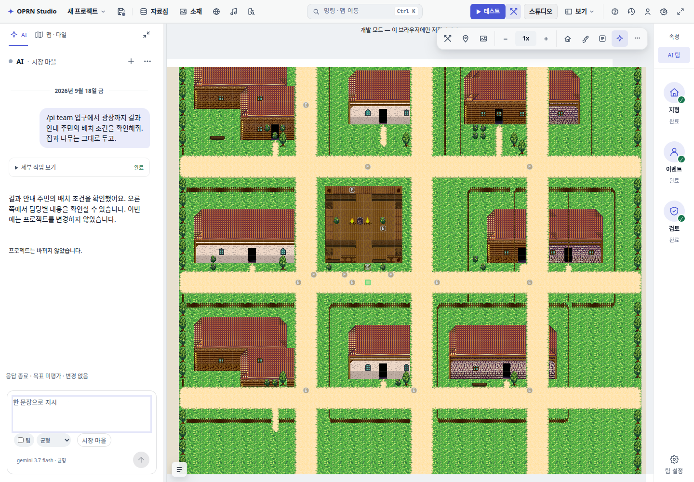
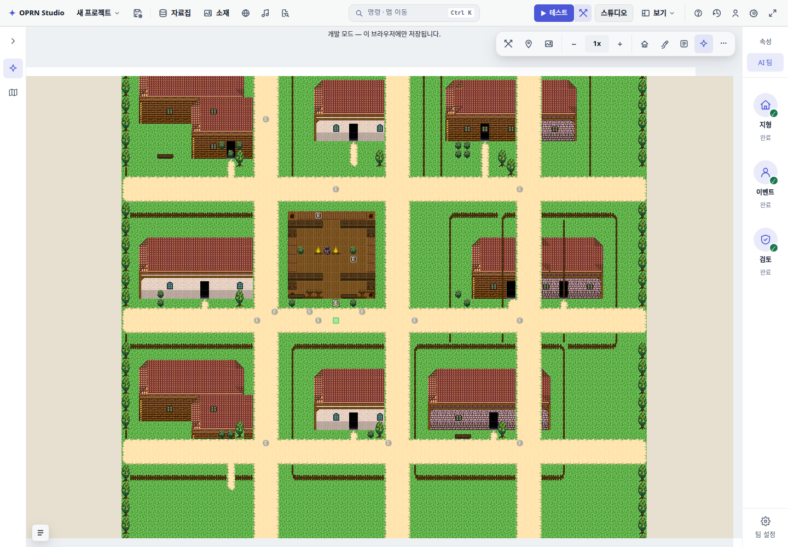

# AI sidebar and map toolbar evidence

Actual editor screenshots with deterministic Pi transport replay; no live model calls or remote project writes.

- Final browser run: 38 checks passed, zero page exceptions (`report.json`). Reproduce: `BASE=http://127.0.0.1:<dev-port> node scripts/qa/ai-team-sidebar.mjs`.
- Earlier functional revision: app typecheck exit 0; 8 related Vitest files / 133 tests passed. Subsequent sidebar/toolbar polish verified in the final browser run above.
- CSS gate on earlier functional revision: exit 1 both at original HEAD and after changes. Existing budget/live-class failures remained; intentional AI stylesheet winner changes were reviewed. No baseline was overwritten. Full repository gates were not run.

