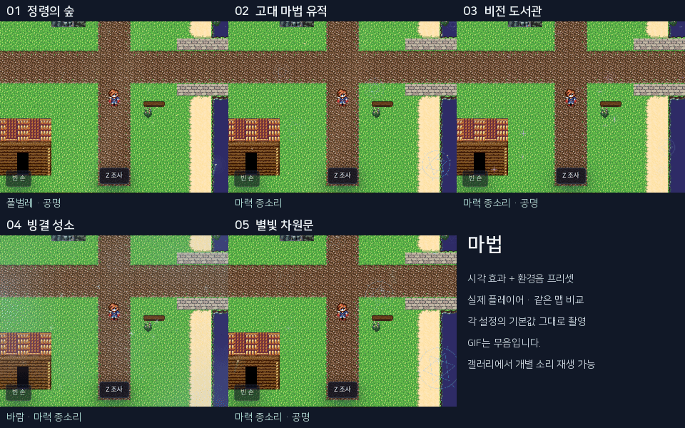
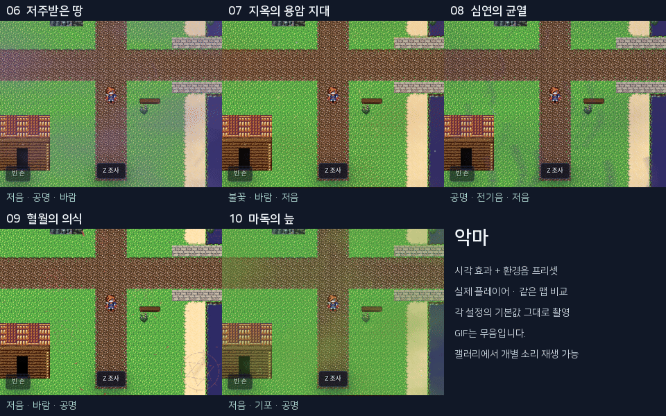
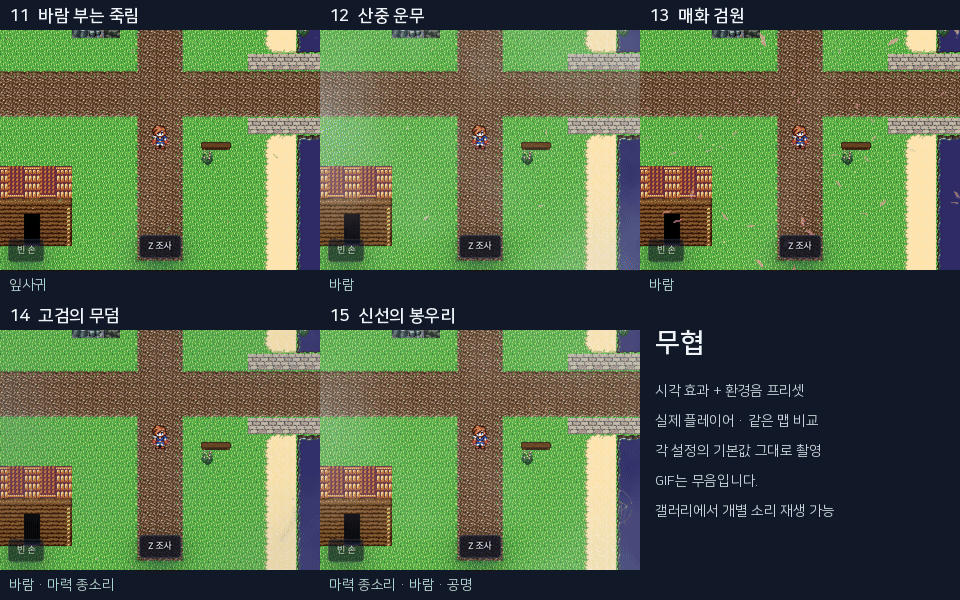
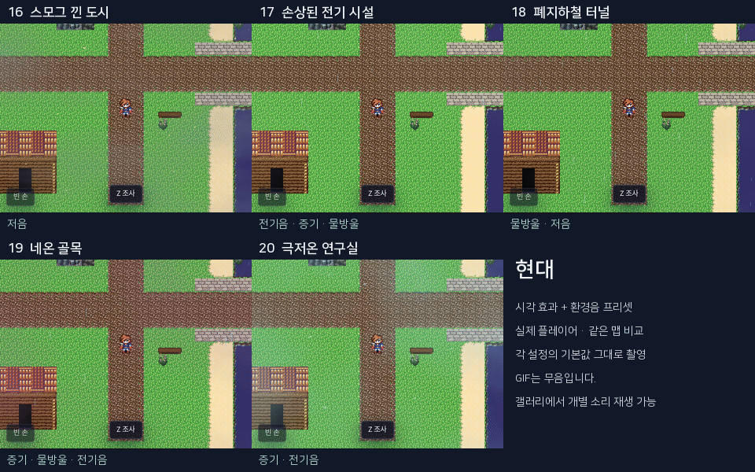
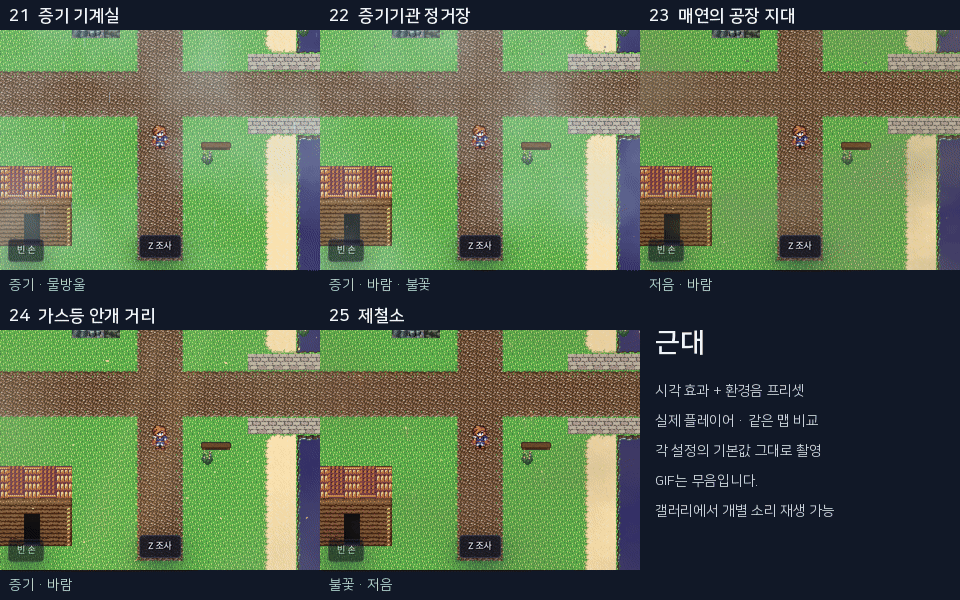
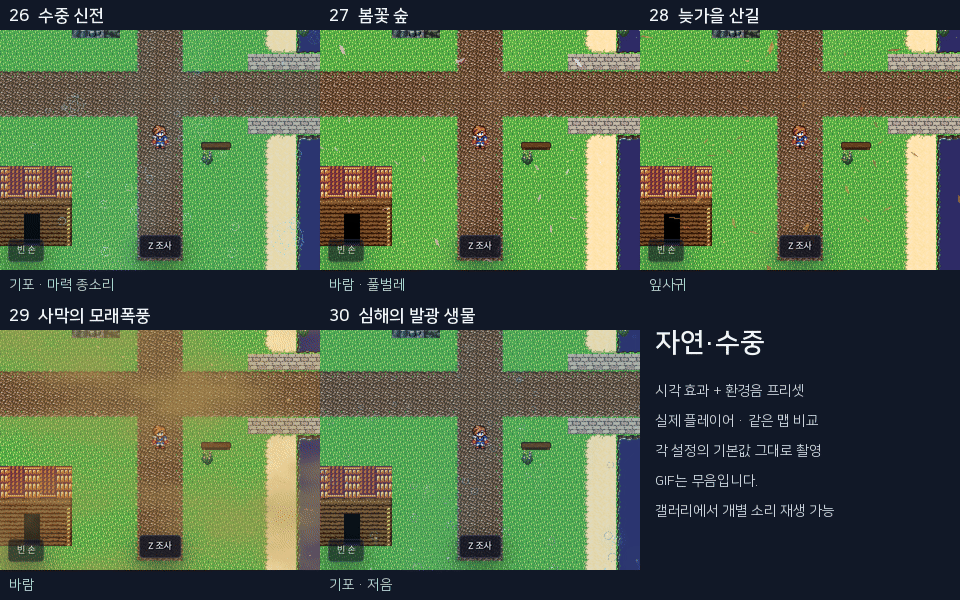

# 30 audiovisual atmosphere presets

Committed review evidence: six grouped GIFs, thirty real player audio recordings, catalog settings and capture receipts in SUMMARY.json.

Recreate the full-size GIF gallery with scripts/qa/runtime/atmosphere-presets.capture.mjs, scripts/qa/compose-atmosphere-presets.py and scripts/qa/package-atmosphere-presets.py. Raw screenshot frames, QA project fixtures and the 134 MiB archive are local generated artifacts.

GIFs are silent; recordings are separate ambience captures, not synchronized video.

## 마법

- [정령의 숲 audio](enchanted-forest.mp3) — 반딧불·정령빛·햇살 / 풀벌레와 정령 공명
- [고대 마법 유적 audio](ancient-ruins.mp3) — 떠도는 문양·먼지·금빛 / 느린 마력 종소리
- [비전 도서관 audio](arcane-library.mp3) — 보라색 마력·작은 문양 / 종소리와 공명
- [빙결 성소 audio](frost-sanctum.mp3) — 서리 결정·찬 운무 / 바람과 맑은 종소리
- [별빛 차원문 audio](astral-gate.mp3) — 큰 문양·푸른 정령·별빛 / 겹쳐 울리는 공명

## 악마

- [저주받은 땅 audio](cursed-land.mp3) — 독안개·검은 잔영·재 / 낮은 울림과 불길한 공명
- [지옥의 용암 지대 audio](volcanic-forge.mp3) — 불씨·재·붉은 연무 / 불꽃과 저음
- [심연의 균열 audio](abyss-rift.mp3) — 큰 그림자 잔영·보라 스파크 / 공명과 불안정한 전기음
- [혈월의 의식 audio](blood-moon.mp3) — 핏빛 문양·붉은 꽃잎·잔영 / 낮은 의식의 울림
- [마독의 늪 audio](blight-marsh.mp3) — 녹색 독무·떠오르는 기포·괴광 / 기포와 독무 저음

## 무협

- [바람 부는 죽림 audio](bamboo-grove.mp3) — 초록 잎·가는 햇살 / 잎사귀 바람
- [산중 운무 audio](mountain-mist.mp3) — 흰 운무·옅은 꽃잎 / 느린 산바람
- [매화 검원 audio](plum-courtyard.mp3) — 붉고 흰 매화 꽃잎·먼지 / 꽃잎을 실은 바람
- [고검의 무덤 audio](sword-grave.mp3) — 회색 잔영·재·차가운 운무 / 황량한 바람과 쇠울림 같은 공명
- [신선의 봉우리 audio](immortal-peak.mp3) — 금빛 문양·느린 운무·영기 / 맑은 종소리와 산바람

## 현대

- [스모그 낀 도시 audio](city-smog.mp3) — 회색 스모그·부유 먼지 / 낮은 도시 배경음
- [손상된 전기 시설 audio](power-station.mp3) — 스파크·증기·누수 / 전기 잡음과 물방울
- [폐지하철 터널 audio](subway-tunnel.mp3) — 누수·탁한 먼지·옅은 연무 / 물방울과 터널 저음
- [네온 골목 audio](neon-alley.mp3) — 분홍 증기·청록 물방울·간헐적 스파크 / 증기와 전기음
- [극저온 연구실 audio](cryo-laboratory.mp3) — 청백색 증기·서리·전기 불꽃 / 냉각음과 전기 잡음

## 근대

- [증기 기계실 audio](boiler-room.mp3) — 진한 증기·누수 / 압력 증기와 물방울
- [증기기관 정거장 audio](steam-station.mp3) — 빠른 흰 증기·검댕·불씨 / 증기 분출과 불꽃
- [매연의 공장 지대 audio](factory-chimneys.mp3) — 황갈색 매연·검은 재·먼지 / 공장 저음과 바람
- [가스등 안개 거리 audio](gaslamp-street.mp3) — 호박빛 빛줄기·낮은 안개·먼지 / 가스 새는 소리와 바람
- [제철소 audio](iron-foundry.mp3) — 많은 불씨·주황 스파크·뜨거운 연기 / 화로와 거친 잡음

## 자연·수중

- [수중 신전 audio](sunken-temple.mp3) — 기포·물빛·청록 문양 / 기포와 희미한 종소리
- [봄꽃 숲 audio](spring-grove.mp3) — 꽃잎·반딧불·따스한 햇살 / 산들바람과 풀벌레
- [늦가을 산길 audio](autumn-road.mp3) — 커다란 낙엽·황금 먼지 / 낙엽 스치는 바람
- [사막의 모래폭풍 audio](desert-wind.mp3) — 빠른 모래·누런 먼지·짙은 모래 안개 / 거센 바람
- [심해의 발광 생물 audio](deep-sea.mp3) — 느린 기포·푸른 발광 입자·심해 부유물 / 수중 저음과 기포
