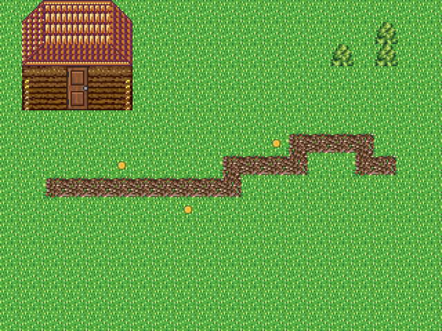
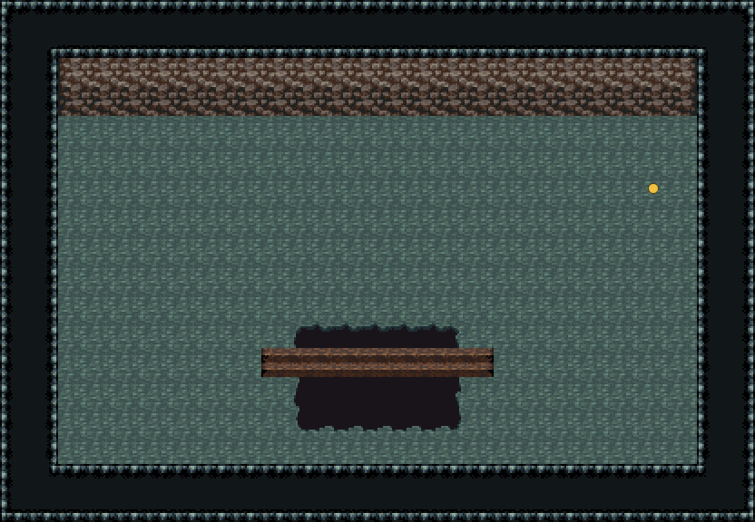
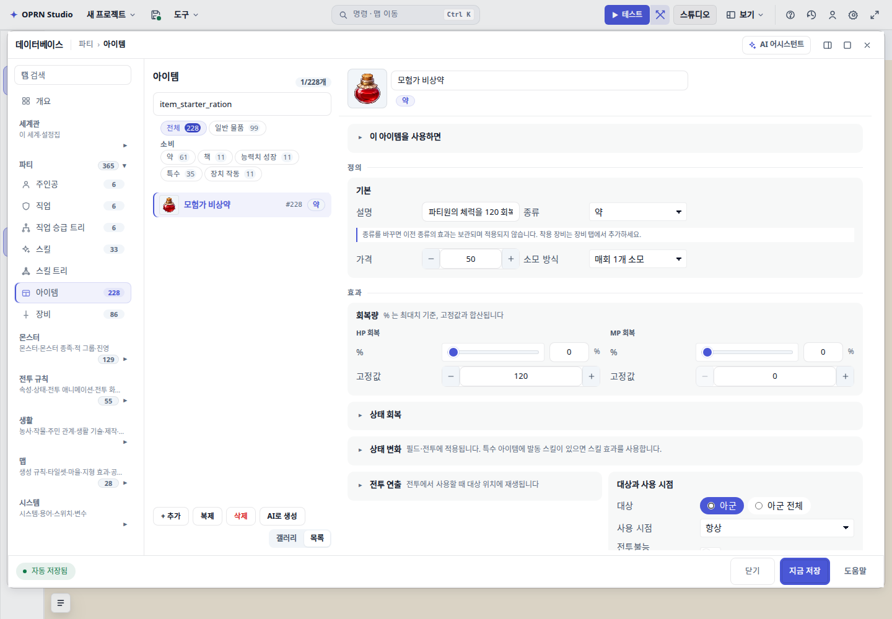
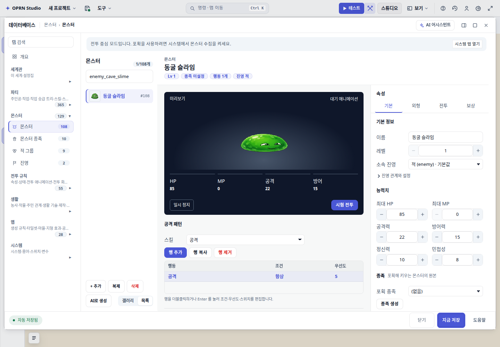
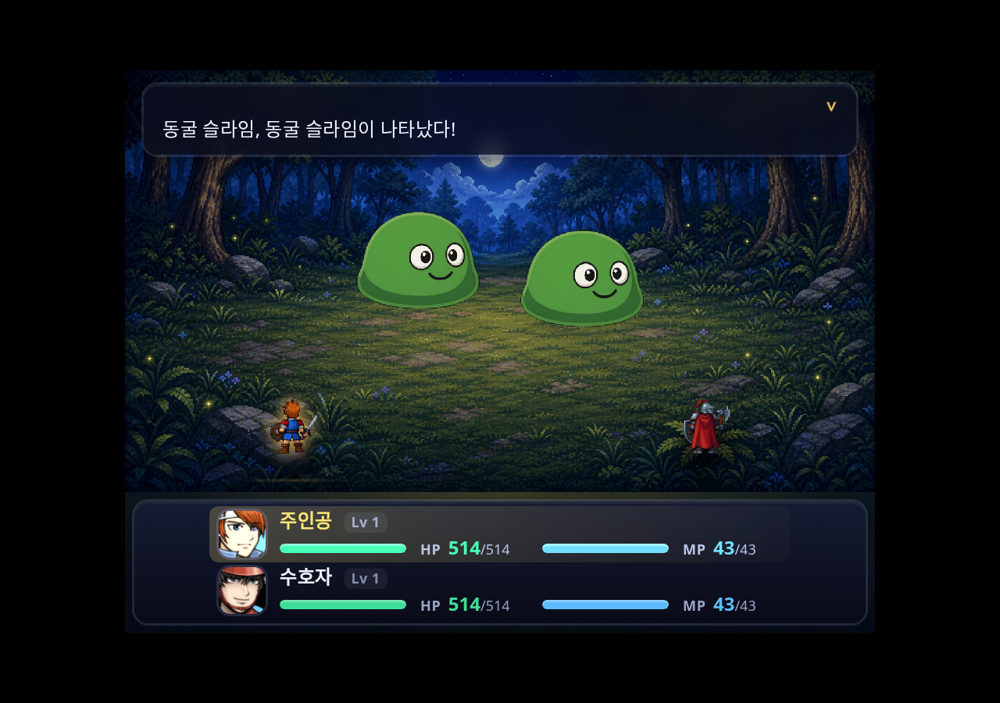
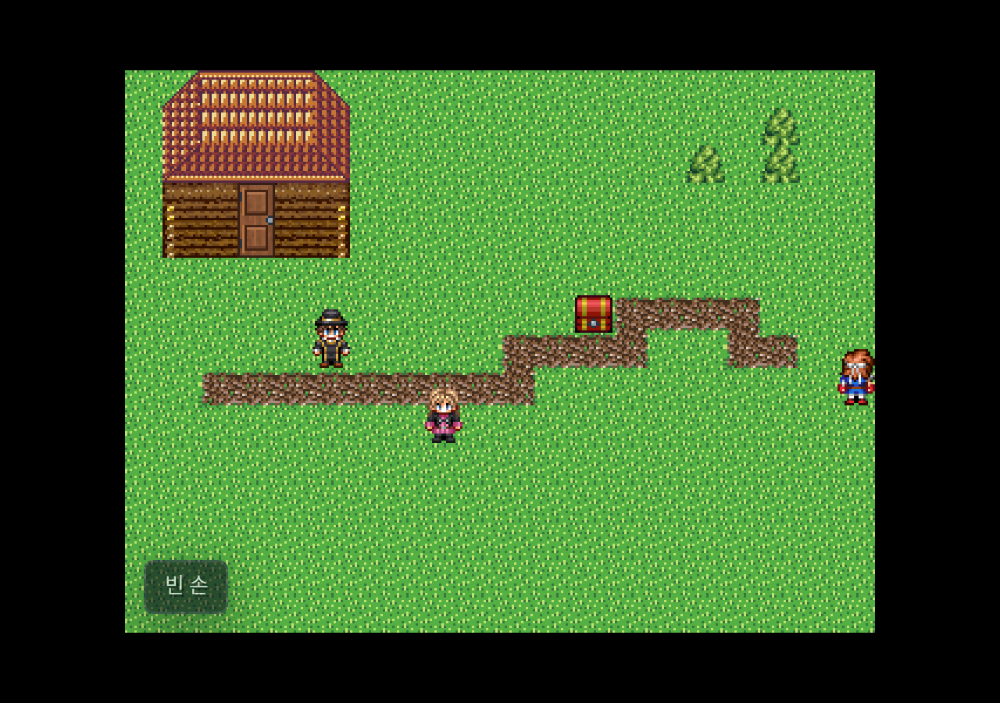

# JRPG AI 단독 저작 재검증 (2026-09-05)

기능 경로는 최대 자율 모드에서 통과했다. 기본 균형 모드의 1회 완주와 시각 완성도는 통과로 판정하지 않는다.

- 같은 원문 프롬프트를 실제 편집기 AI에 입력했다. 매회 기존 빈 맵과 기존 DB를 새 Supabase 프로젝트에 저장·재로드한 뒤 실행했다. 검증자는 AI 결과의 맵·이벤트·DB를 직접 보정하지 않았다.
- 최종 소스 `876e456b`, 프로젝트 `oprn-jrpg-solo-d315de29`, 모델 `gemini-3.7-flash`, 최대 자율. 143.1초, LLM 37회, 도구 83회 중 실패 19회. 사용량 미보고이므로 비용은 산정하지 않는다.
- 실제 2인 파티 → 두 NPC 대화 → 던전 → 전투 4승 → 상자 보상 → 재개봉 중복 지급 없음 → 마을 복귀. 출하 `player.html` 경로, 15관측, 오류 0. QA 이동은 목적지가 아닌 전이 칸을 피하며 프로젝트를 변경하지 않는다.
- AI 직후·QA 스냅샷·Supabase 재로드의 정규화 해시 일치: `persistence.json`.
- DB: `item_starter_ration`(HP120, 50G, 아이콘), `enemy_cave_slime`(HP85, 공격22, 방어15, 공격 행동), `troop_dungeon_intro`(조회한 슬라임 2마리). 최종 실행은 새 장비를 만들지 않았다. 아이콘 없는 장비의 거짓 완료 차단은 통합 테스트로 확인했다.

## 수정

도달 가능한 전투·보물·복귀와 실제 시작 파티 검사, 건물과 NPC/상자 겹침 검사, 마지막 전체 맵 시각 조회의 실제 영역 추적, NPC 재시도 ID 보존, legacy 무기 item 생성 거절, 대사 별칭 정규화와 잘못된 줄바꿈/본문 누락 거절, 시작 파티 도구의 런타임 시작 상태 반영, 모험 도구의 첫 호출 노출, 아이템·장비 아이콘 완료 검사.

## 한계와 검증 범위

- 기본 균형 모드는 16회 실행 제한으로 중단됐다. 최대 자율 결과를 기본 설정의 성공으로 바꾸어 보고하지 않는다.
- 거점은 집 한 채로 마을 밀도가 낮고, 문 앞 길·동굴 입구 표식이 약하다. 동굴 전투가 기존 숲 배경을 사용한다. 전체 시각 품질은 조건부다.
- 정적 완료 검사는 페이지 조건·공통 이벤트의 모든 경로·미술 품질·재미를 증명하지 않는다.
- 전체 게이트(`1833f149`)는 앱 타입 0, CSS 통과, Vitest 13,100통과/167실패. 새 실패로 분류된 16개 파일은 수정 전 `29b772ea`에서 같은 테스트와 진단으로 재현됐다. 새 body 검증에 걸린 보스 테스트는 잘못된 text 필드를 정식 body로 수정해 원래 의미를 보존했다.
- 이후 최종 장비 아이콘 검사 추가 뒤 관련 32개 테스트와 `npm run gates -- --only typecheck` 통과. 전체 13,267개는 최종 작은 변경 후 다시 실행하지 않았다. 상세 `gate-review.json`.

## 화면

전체 로컬 보고서: `/home/main/.herdr/worktrees/rpg-zzu/worktree-calm-cloud-6e89/output/evidence/jrpg-solo-recheck/REPORT.html`.
원본 및 중간 실패 보고서·DB 변경 전체·원격 저장 증거·호출 로그를 모두 보존했다.
