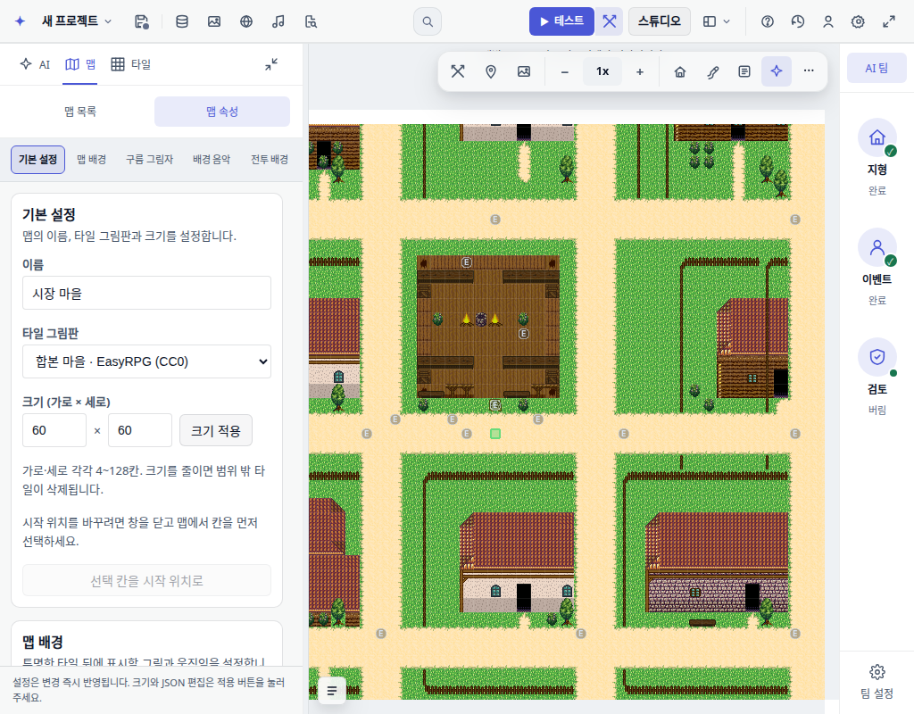
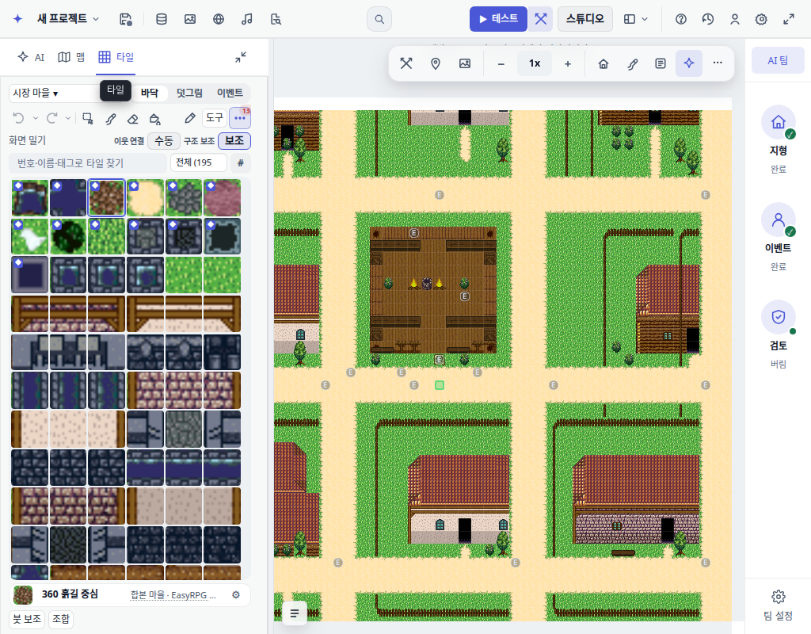

# Map and tile section browser evidence

45 browser assertions passed, zero page exceptions. Actual editor UI, deterministic Pi transport replay, no live model calls or remote content writes.

Reproduce: `BASE=http://127.0.0.1:<port> node scripts/qa/ai-team-sidebar.mjs`.

Checks cover the dedicated Maps section, left-side map properties, separate Tiles section, retained tile map dropdown, collapse/restore, and existing AI team interactions.

