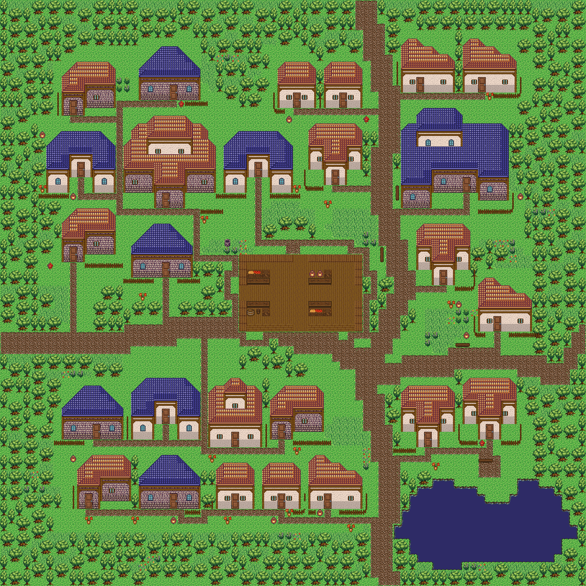

# 소규모 마을 정본 — 2026-09-13

집을 더 조밀하게 모으고, 큰집을 포함해 2층 이상 외형을 **총 3채**로 제한했다.
정본은 저장된 소규모 마을 설계서이며, 실제 예시는 이를 참조하는 정주지 지역과 컴파일된 맵이다.
전체 규모의 마을에 적용하는 기본 설계서는 지정하지 않았다.

- [네이티브 확대 지도](render/index.html) · [실제 에디터 설계서](editor-small-village-design.png)
- Supabase project: `rpg-zzu-house-template-gallery`
- 설계서: `small-village-dense`, 개정 1, 기준 크기 76×76
- 지역: `small-village:region:dense`; 예시 occurrence: `small-village:example:20260913`
- 맵: `spatial-geography:30:small-village:example:20260913`, 시드 20260913
- 26채 = 1층 23채 + 2층 3채. 큰집은 2채 포함. 최대 외형 14×13.
- 가장 가까운 집까지 평균 빈칸 거리: 기존 3 → **1.154칸**, 개별 1~2칸. 맵 축소만으로 밀도를 보고하지 않는다.
- 나무 1,670칸, 243 계열 풀 776칸, 비대칭 호수 210칸. 장터 4곳·호숫가 쉼터 1곳.
- 현관 26곳 + 공용 목적지 5곳의 정확한 접근 칸까지 모두 연결된다.
- 기존 맵 16개와 공간 occurrence 보존. 12종 그래픽을 바꾸지 않고 오브젝트에 외형 층수/개정만 추가.

## 저장과 실행 증거

- [CAS 저장·전체 정규화 재로드 일치](supabase-proof.json)
- [독립 DB 재조회: 서버 SHA·맵·공간 문서·그래픽 일치](final-remote-check.json)
- [실제 에디터 부팅·원격 저장 활성화·맵 일치](editor-proof.json)
- [지역 카드에서 설계서 열기·23/3 규칙·실제 26채 미리보기](editor-design-proof.json)
- [실제 등록 도구 호출](tool-call-proof.json): `author_village`는 presetId만으로 집 구성·크기를 읽는다.
  `upsert_spatial_design → preview_spatial_build → apply_spatial_build`로 지역을 실제 시공하며 타일이 일치한다.
  제공자/LLM 자연어 실행은 하지 않았다(`provider: null`).
- [출하 player.html QA](runtime-summary.md): 8/8, 실제 이동 37걸음, 런타임 오류 없음.
  SUMMARY의 즉시 확인 샷은 0개다. 실행 통과를 시각 품질 판정으로 대신하지 않았다.
  지도 및 에디터 스크린샷은 별도로 눈으로 확인했다.
- [관련 계약 검사](focused-proof.json): 33/33. 2개 시드의 23/3 구성, 지역 생성 버튼의 기준 크기,
  동일 재시공과 수작업 보호, 구형 설계서 호환, 설계서 화면 복귀를 검사한다.
- [저장된 지역 재시공 일치](recompile-proof.json): 현재 코드로 기존 예시를 재시공해 두 타일 레이어가 동일함.
- [전체 게이트와 기준선 비교](gates-proof.json): 전체 실행은 512건 실패(직전 508건), CSS 통과,
  surface 실패였다. 광장 타입 import 2오류와 구형 프리셋 폴백 회귀를 수정한 뒤
  **앱 타입 게이트 0오류·관련 검사 66/66**를 확인했다. 새 spatial/publication 4사례는
  수정 없이 통과했고, 포트 5173 충돌을 보인 devRuntimeArchive는 단독 **12/12** 통과했다.
  수정 후 전체 스위트 재실행 결과로 표현하지 않는다. [최종 관련 검사](post-gate-proof.json).

## 검토에서 수정한 부분

1. 층수는 외형 높이에서 추측하지 않고 `ObjectDesign.exteriorStories`로 저작한다.
2. 2층 이상 할당에 큰집을 포함하고, 지정 집과 충돌하면 전체 초안을 거부한다.
3. 마당 여백을 중복 합산하지 않고 한 칸 옆 골목·두 칸 앞 통로를 공유한다.
4. 미리보기·AI·새 지역 만들기 모두 저장된 기준 크기와 집 구성에 연결한다.
5. 재시공 시 이전 시작점이 식생 난수 배치에 영향을 주지 않도록 광장 안에서 시작한다.
6. 설계서 화면은 중첩된 갤러리·인스펙터를 제거해 입력란/미리보기가 겹치지 않는다.
7. 광장 계산은 재료 카탈로그를 불러오지 않는 순수 모듈로 분리해 집 킷 초기화 순환을 막는다.
