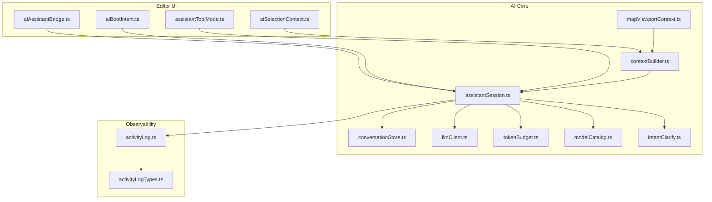
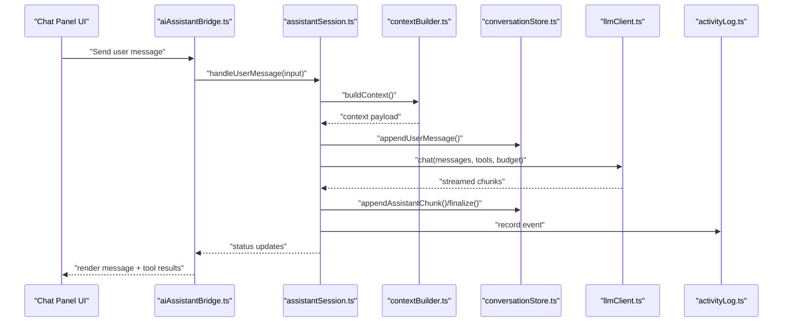
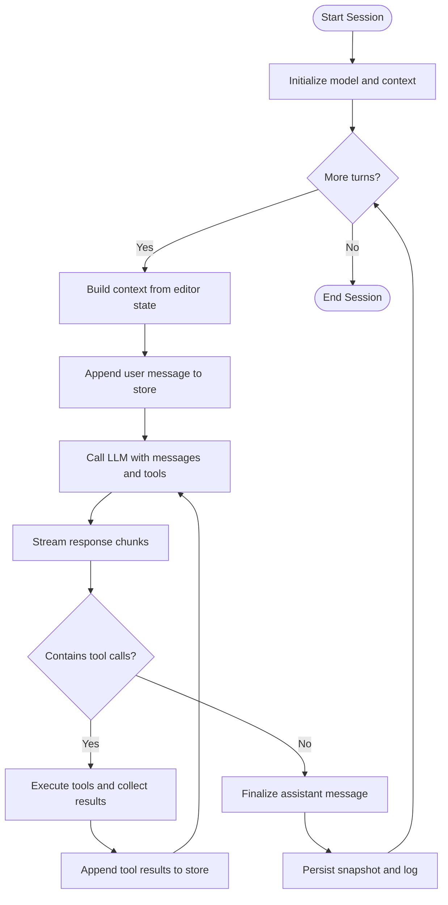
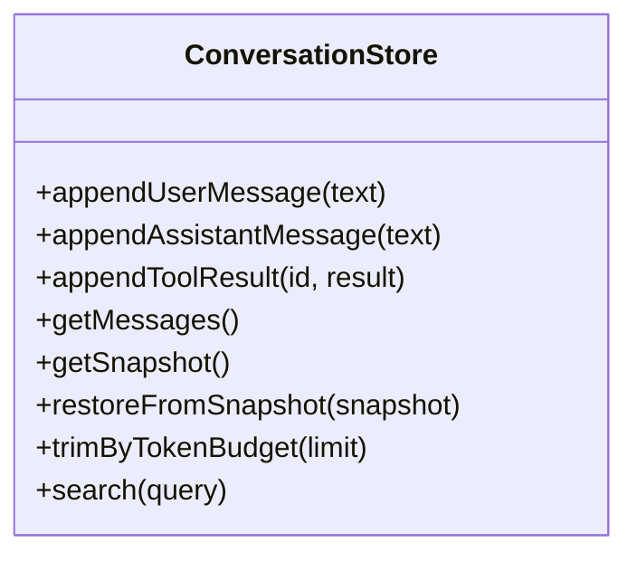
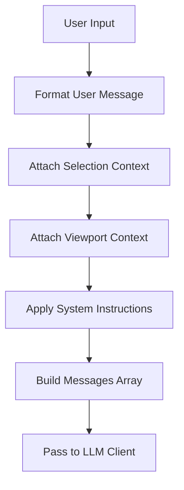
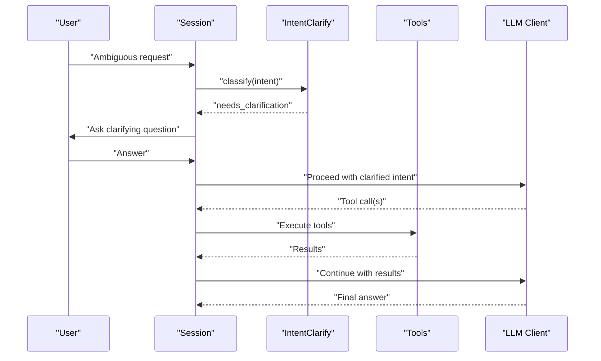
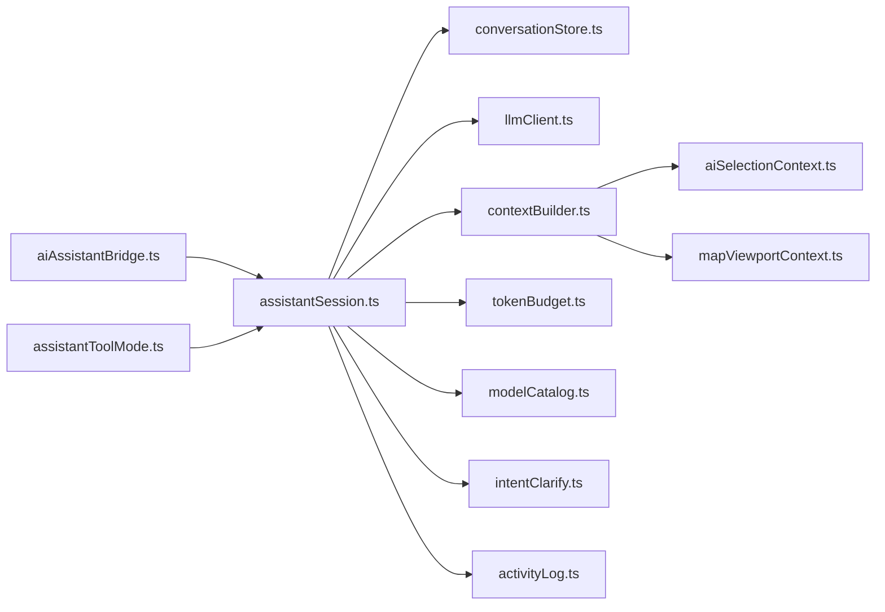

# AI Conversation Management

<cite>
**Referenced Files in This Document**
- [assistantSession.ts](file://src/ai/assistantSession.ts)
- [conversationStore.ts](file://src/ai/conversationStore.ts)
- [llmClient.ts](file://src/ai/llmClient.ts)
- [contextBuilder.ts](file://src/ai/contextBuilder.ts)
- [activityLog.ts](file://src/ai/activityLog.ts)
- [activityLogTypes.ts](file://src/ai/activityLogTypes.ts)
- [tokenBudget.ts](file://src/ai/tokenBudget.ts)
- [intentClarify.ts](file://src/ai/intentClarify.ts)
- [mapViewportContext.ts](file://src/ai/mapViewportContext.ts)
- [modelCatalog.ts](file://src/ai/modelCatalog.ts)
- [aiAssistantBridge.ts](file://src/editor/aiAssistantBridge.ts)
- [aiBootIntent.ts](file://src/editor/aiBootIntent.ts)
- [aiSelectionContext.ts](file://src/editor/aiSelectionContext.ts)
- [assistantToolMode.ts](file://src/editor/assistantToolMode.ts)
- [2026-07-10-tool-calling-architecture-review.md](file://docs/2026-07-10-tool-calling-architecture-review.md)
- [ai-assistant-how-it-works.html](file://docs/ai-assistant-how-it-works.html)
</cite>

## Table of Contents
1. [Introduction](#introduction)
2. [Project Structure](#project-structure)
3. [Core Components](#core-components)
4. [Architecture Overview](#architecture-overview)
5. [Detailed Component Analysis](#detailed-component-analysis)
6. [Dependency Analysis](#dependency-analysis)
7. [Performance Considerations](#performance-considerations)
8. [Troubleshooting Guide](#troubleshooting-guide)
9. [Conclusion](#conclusion)
10. [Appendices](#appendices)

## Introduction
This document explains the AI conversation management system used by the editor’s assistant features. It covers the assistant session lifecycle, multi-turn dialogue handling, conversation state persistence, message formatting, and context preservation across sessions. It also documents the chat panel UI integration points, history management, search capabilities, export functionality, error handling strategies, and memory management for long conversations.

## Project Structure
The AI conversation subsystem is implemented under src/ai and integrates with the editor UI via src/editor components. Key responsibilities:
- Session orchestration and multi-turn flow control
- Conversation store and persistence
- LLM client abstraction and tool calling
- Context building from editor state (selection, viewport, etc.)
- Activity logging and observability
- Token budgeting and model catalog

**Diagram sources**
- [assistantSession.ts](file://src/ai/assistantSession.ts)
- [conversationStore.ts](file://src/ai/conversationStore.ts)
- [llmClient.ts](file://src/ai/llmClient.ts)
- [contextBuilder.ts](file://src/ai/contextBuilder.ts)
- [mapViewportContext.ts](file://src/ai/mapViewportContext.ts)
- [tokenBudget.ts](file://src/ai/tokenBudget.ts)
- [modelCatalog.ts](file://src/ai/modelCatalog.ts)
- [intentClarify.ts](file://src/ai/intentClarify.ts)
- [activityLog.ts](file://src/ai/activityLog.ts)
- [activityLogTypes.ts](file://src/ai/activityLogTypes.ts)
- [aiAssistantBridge.ts](file://src/editor/aiAssistantBridge.ts)
- [aiBootIntent.ts](file://src/editor/aiBootIntent.ts)
- [aiSelectionContext.ts](file://src/editor/aiSelectionContext.ts)
- [assistantToolMode.ts](file://src/editor/assistantToolMode.ts)

**Section sources**
- [assistantSession.ts](file://src/ai/assistantSession.ts)
- [conversationStore.ts](file://src/ai/conversationStore.ts)
- [llmClient.ts](file://src/ai/llmClient.ts)
- [contextBuilder.ts](file://src/ai/contextBuilder.ts)
- [mapViewportContext.ts](file://src/ai/mapViewportContext.ts)
- [tokenBudget.ts](file://src/ai/tokenBudget.ts)
- [modelCatalog.ts](file://src/ai/modelCatalog.ts)
- [intentClarify.ts](file://src/ai/intentClarify.ts)
- [activityLog.ts](file://src/ai/activityLog.ts)
- [activityLogTypes.ts](file://src/ai/activityLogTypes.ts)
- [aiAssistantBridge.ts](file://src/editor/aiAssistantBridge.ts)
- [aiBootIntent.ts](file://src/editor/aiBootIntent.ts)
- [aiSelectionContext.ts](file://src/editor/aiSelectionContext.ts)
- [assistantToolMode.ts](file://src/editor/assistantToolMode.ts)

## Core Components
- Assistant Session: Orchestrates multi-turn dialogues, manages turn lifecycle, coordinates context building, token budgeting, and tool execution.
- Conversation Store: Provides an append-only message log with snapshotting, trimming, and persistence hooks.
- LLM Client: Abstracts provider calls, streaming responses, retries, and tool call payloads.
- Context Builder: Assembles editor-relevant context (selection, viewport, project state) into prompt-friendly structures.
- Activity Logger: Records structured events for debugging and analytics.
- Token Budget: Enforces per-session and per-turn token limits to prevent overflow.
- Model Catalog: Centralizes available models and their capabilities.
- Intent Clarifier: Detects ambiguous user intents and prompts for clarification before proceeding.
- Map Viewport Context: Captures current map view and related metadata for contextual awareness.

**Section sources**
- [assistantSession.ts](file://src/ai/assistantSession.ts)
- [conversationStore.ts](file://src/ai/conversationStore.ts)
- [llmClient.ts](file://src/ai/llmClient.ts)
- [contextBuilder.ts](file://src/ai/contextBuilder.ts)
- [activityLog.ts](file://src/ai/activityLog.ts)
- [activityLogTypes.ts](file://src/ai/activityLogTypes.ts)
- [tokenBudget.ts](file://src/ai/tokenBudget.ts)
- [modelCatalog.ts](file://src/ai/modelCatalog.ts)
- [intentClarify.ts](file://src/ai/intentClarify.ts)
- [mapViewportContext.ts](file://src/ai/mapViewportContext.ts)

## Architecture Overview
The assistant session drives a loop:
- Receive user input or boot intent
- Build context from editor state
- Apply token budget constraints
- Call LLM client with formatted messages and tools
- Stream response, parse tool calls if any
- Execute tools, update conversation store
- Persist snapshots and activity logs
- Render UI updates through the bridge

**Diagram sources**
- [assistantSession.ts](file://src/ai/assistantSession.ts)
- [conversationStore.ts](file://src/ai/conversationStore.ts)
- [llmClient.ts](file://src/ai/llmClient.ts)
- [contextBuilder.ts](file://src/ai/contextBuilder.ts)
- [activityLog.ts](file://src/ai/activityLog.ts)
- [aiAssistantBridge.ts](file://src/editor/aiAssistantBridge.ts)

## Detailed Component Analysis

### Assistant Session Lifecycle
Responsibilities:
- Initialize session with model selection and initial context
- Manage multi-turn turns: user -> assistant -> tool -> assistant
- Handle streaming responses and incremental rendering
- Enforce token budgets and trim history when needed
- Persist conversation snapshots and activity logs
- Integrate with editor tool modes and selection context

Key flows:
- Start: bootstrap with boot intent and default model
- Turn: build context, append messages, call LLM, process tool calls
- End: finalize turn, persist, notify UI

**Diagram sources**
- [assistantSession.ts](file://src/ai/assistantSession.ts)
- [conversationStore.ts](file://src/ai/conversationStore.ts)
- [llmClient.ts](file://src/ai/llmClient.ts)
- [contextBuilder.ts](file://src/ai/contextBuilder.ts)
- [tokenBudget.ts](file://src/ai/tokenBudget.ts)
- [activityLog.ts](file://src/ai/activityLog.ts)

**Section sources**
- [assistantSession.ts](file://src/ai/assistantSession.ts)
- [conversationStore.ts](file://src/ai/conversationStore.ts)
- [llmClient.ts](file://src/ai/llmClient.ts)
- [contextBuilder.ts](file://src/ai/contextBuilder.ts)
- [tokenBudget.ts](file://src/ai/tokenBudget.ts)
- [activityLog.ts](file://src/ai/activityLog.ts)

### Conversation Store Architecture
Features:
- Append-only message list with stable IDs
- Snapshotting for rollback and export
- History trimming based on token budget
- Persistence hooks for local storage or remote sync
- Search indexing for quick retrieval

Operations:
- Append user/assistant/tool messages
- Truncate oldest messages while preserving system prompts
- Generate snapshots for export and restore
- Index messages for text search

**Diagram sources**
- [conversationStore.ts](file://src/ai/conversationStore.ts)

**Section sources**
- [conversationStore.ts](file://src/ai/conversationStore.ts)

### Message Formatting and Context Preservation
Formatting:
- System instructions for role and behavior
- User messages with optional attachments (images, selections)
- Assistant messages with optional tool call blocks
- Tool result messages linked by ID

Context preservation:
- Editor selection context injected at each turn
- Map viewport context captured for spatial reasoning
- Project metadata included in system context
- Optional skill-based context augmentation

**Diagram sources**
- [contextBuilder.ts](file://src/ai/contextBuilder.ts)
- [mapViewportContext.ts](file://src/ai/mapViewportContext.ts)
- [aiSelectionContext.ts](file://src/editor/aiSelectionContext.ts)

**Section sources**
- [contextBuilder.ts](file://src/ai/contextBuilder.ts)
- [mapViewportContext.ts](file://src/ai/mapViewportContext.ts)
- [aiSelectionContext.ts](file://src/editor/aiSelectionContext.ts)

### Multi-Turn Dialogue Handling
Patterns:
- Clarification-first: detect ambiguity and ask targeted questions
- Tool-driven loops: assistant proposes actions, executes tools, then continues
- Streaming UX: show partial responses and tool progress in real time

**Diagram sources**
- [intentClarify.ts](file://src/ai/intentClarify.ts)
- [assistantSession.ts](file://src/ai/assistantSession.ts)
- [llmClient.ts](file://src/ai/llmClient.ts)

**Section sources**
- [intentClarify.ts](file://src/ai/intentClarify.ts)
- [assistantSession.ts](file://src/ai/assistantSession.ts)
- [llmClient.ts](file://src/ai/llmClient.ts)

### Chat Panel UI Integration
Integration points:
- aiAssistantBridge: exposes methods for sending messages, receiving status, and updating UI
- assistantToolMode: toggles tool-aware behaviors in the editor during assistant interactions
- aiBootIntent: initializes assistant with project-specific goals and defaults

Rendering:
- Incremental message rendering for streamed responses
- Inline tool call indicators and results
- Error banners and retry controls

**Section sources**
- [aiAssistantBridge.ts](file://src/editor/aiAssistantBridge.ts)
- [assistantToolMode.ts](file://src/editor/assistantToolMode.ts)
- [aiBootIntent.ts](file://src/editor/aiBootIntent.ts)

### Conversation History Management, Search, and Export
History:
- Persistent store with snapshots
- Automatic trimming to fit token budgets
- Manual rewind via snapshot restore

Search:
- Text search over messages
- Filter by role (user/assistant/tool)

Export:
- Snapshot serialization for sharing or archival
- Structured JSON format including messages and metadata

**Section sources**
- [conversationStore.ts](file://src/ai/conversationStore.ts)

### Error Handling Strategies
Approaches:
- Retry with backoff on transient network errors
- Graceful degradation when tools fail
- Clear error messages surfaced to UI
- Activity logs capture failures for diagnosis

**Section sources**
- [llmClient.ts](file://src/ai/llmClient.ts)
- [activityLog.ts](file://src/ai/activityLog.ts)
- [activityLogTypes.ts](file://src/ai/activityLogTypes.ts)

### Memory Management for Long Conversations
Techniques:
- Token budget enforcement per session and per turn
- Sliding window trimming of older messages
- Summarization hooks for very long histories (optional)
- Selective context inclusion to reduce payload size

**Section sources**
- [tokenBudget.ts](file://src/ai/tokenBudget.ts)
- [conversationStore.ts](file://src/ai/conversationStore.ts)

## Dependency Analysis
High-level dependencies:
- Session depends on Store, Client, ContextBuilder, Budget, Catalog, Intent, ActivityLogger
- ContextBuilder depends on SelectionContext and MapViewportContext
- UI depends on Bridge and ToolMode

**Diagram sources**
- [assistantSession.ts](file://src/ai/assistantSession.ts)
- [conversationStore.ts](file://src/ai/conversationStore.ts)
- [llmClient.ts](file://src/ai/llmClient.ts)
- [contextBuilder.ts](file://src/ai/contextBuilder.ts)
- [tokenBudget.ts](file://src/ai/tokenBudget.ts)
- [modelCatalog.ts](file://src/ai/modelCatalog.ts)
- [intentClarify.ts](file://src/ai/intentClarify.ts)
- [activityLog.ts](file://src/ai/activityLog.ts)
- [aiSelectionContext.ts](file://src/editor/aiSelectionContext.ts)
- [mapViewportContext.ts](file://src/ai/mapViewportContext.ts)
- [aiAssistantBridge.ts](file://src/editor/aiAssistantBridge.ts)
- [assistantToolMode.ts](file://src/editor/assistantToolMode.ts)

**Section sources**
- [assistantSession.ts](file://src/ai/assistantSession.ts)
- [conversationStore.ts](file://src/ai/conversationStore.ts)
- [llmClient.ts](file://src/ai/llmClient.ts)
- [contextBuilder.ts](file://src/ai/contextBuilder.ts)
- [tokenBudget.ts](file://src/ai/tokenBudget.ts)
- [modelCatalog.ts](file://src/ai/modelCatalog.ts)
- [intentClarify.ts](file://src/ai/intentClarify.ts)
- [activityLog.ts](file://src/ai/activityLog.ts)
- [aiSelectionContext.ts](file://src/editor/aiSelectionContext.ts)
- [mapViewportContext.ts](file://src/ai/mapViewportContext.ts)
- [aiAssistantBridge.ts](file://src/editor/aiAssistantBridge.ts)
- [assistantToolMode.ts](file://src/editor/assistantToolMode.ts)

## Performance Considerations
- Prefer streaming responses to reduce perceived latency
- Trim conversation history proactively using token budgets
- Avoid redundant context duplication; reuse computed contexts
- Batch tool executions where possible
- Cache expensive context computations across turns

[No sources needed since this section provides general guidance]

## Troubleshooting Guide
Common issues and diagnostics:
- Network timeouts or rate limits: check retry policy and model availability
- Tool execution failures: inspect activity logs and tool result messages
- Excessive memory usage: verify token budget settings and history trimming
- Stale context: ensure selection and viewport contexts are refreshed each turn

Use activity logs to trace:
- Request/response boundaries
- Tool call IDs and outcomes
- Errors and recovery attempts

**Section sources**
- [activityLog.ts](file://src/ai/activityLog.ts)
- [activityLogTypes.ts](file://src/ai/activityLogTypes.ts)
- [llmClient.ts](file://src/ai/llmClient.ts)

## Conclusion
The AI conversation management system provides a robust foundation for multi-turn assistant interactions within the editor. It balances rich context awareness with performance and reliability through token budgeting, streaming, and comprehensive logging. The modular design allows easy extension of tools, context sources, and UI integrations.

[No sources needed since this section summarizes without analyzing specific files]

## Appendices

### References and Background
- Tool calling architecture overview and patterns
- How the assistant works from a user perspective

**Section sources**
- [2026-07-10-tool-calling-architecture-review.md](file://docs/2026-07-10-tool-calling-architecture-review.md)
- [ai-assistant-how-it-works.html](file://docs/ai-assistant-how-it-works.html)