# AI-Assisted Development

<cite>
**Referenced Files in This Document**
- [src/ai/assistantSession.ts](file://src/ai/assistantSession.ts)
- [src/ai/conversationStore.ts](file://src/ai/conversationStore.ts)
- [src/ai/contextBuilder.ts](file://src/ai/contextBuilder.ts)
- [src/ai/mapViewportContext.ts](file://src/ai/mapViewportContext.ts)
- [src/ai/workPlan.ts](file://src/ai/workPlan.ts)
- [src/ai/proposalCompleteness.ts](file://src/ai/proposalCompleteness.ts)
- [src/ai/buildSpec.ts](file://src/ai/buildSpec.ts)
- [src/ai/llmClient.ts](file://src/ai/llmClient.ts)
- [src/ai/chatgptOAuthClient.ts](file://src/ai/chatgptOAuthClient.ts)
- [src/ai/modelCatalog.ts](file://src/ai/modelCatalog.ts)
- [src/ai/tokenBudget.ts](file://src/ai/tokenBudget.ts)
- [src/ai/activityLog.ts](file://src/ai/activityLog.ts)
- [src/ai/activityLogTypes.ts](file://src/ai/activityLogTypes.ts)
- [src/editor/aiAssistantBridge.ts](file://src/editor/aiAssistantBridge.ts)
- [src/editor/agentFocus.ts](file://src/editor/agentFocus.ts)
- [src/editor/agentGhostPreview.ts](file://src/editor/agentGhostPreview.ts)
- [src/editor/assistantToolMode.ts](file://src/editor/assistantToolMode.ts)
- [src/editor/aiSelectionContext.ts](file://src/editor/aiSelectionContext.ts)
- [src/editor/aiBootIntent.ts](file://src/editor/aiBootIntent.ts)
- [src/editor/tools/regionTaskRun.ts](file://src/editor/tools/regionTaskRun.ts)
- [src/editor/tools/regionTaskMenu.ts](file://src/editor/tools/regionTaskMenu.ts)
- [src/editor/tools/regionTaskModal.ts](file://src/editor/tools/regionTaskModal.ts)
- [src/editor/tools/regionTaskStatus.ts](file://src/editor/tools/regionTaskStatus.ts)
- [src/editor/tools/regionTaskClip.ts](file://src/editor/tools/regionTaskClip.ts)
- [src/editor/tools/regionTaskLogExport.ts](file://src/editor/tools/regionTaskLogExport.ts)
- [scripts/rpgzzu-assistant-mcp.mjs](file://scripts/rpgzzu-assistant-mcp.mjs)
- [scripts/rpgzzu-mcp-server.mjs](file://scripts/rpgzzu-mcp-server.mjs)
- [scripts/rpgzzu-tools.mjs](file://scripts/rpgzzu-tools.mjs)
- [openwiki/ai-workflow.md](file://openwiki/ai-workflow.md)
- [evals/llmSuite.eval.ts](file://evals/llmSuite.eval.ts)
- [test/aiAssistantBridge.test.ts](file://test/aiAssistantBridge.test.ts)
- [test/aiAssistantSession.test.ts](file://test/aiAssistantSession.test.ts)
- [test/aiProposalCardUxd.test.ts](file://test/aiProposalCardUxd.test.ts)
- [test/aiProposalEmptyNotice.test.ts](file://test/aiProposalEmptyNotice.test.ts)
- [test/aiProposalSoftConfirm.test.ts](file://test/aiProposalSoftConfirm.test.ts)
- [test/aiChatPanelSettings.test.ts](file://test/aiChatPanelSettings.test.ts)
- [test/aiChatPanelUxRepairs.test.ts](file://test/aiChatPanelUxRepairs.test.ts)
- [test/aiChatLeanUi.test.ts](file://test/aiChatLeanUi.test.ts)
- [test/aiChatObservability.test.ts](file://test/aiChatObservability.test.ts)
- [test/aiSkills.test.ts](file://test/aiSkills.test.ts)
- [test/aiClusterAiModal.test.ts](file://test/aiClusterAiModal.test.ts)
- [test/aiClusterAiModalImageFirst.test.ts](file://test/aiClusterAiModalImageFirst.test.ts)
- [test/aiClusterAiModalRangeClassify.test.ts](file://test/aiClusterAiModalRangeClassify.test.ts)
- [test/aiDocTools.test.ts](file://test/aiDocTools.test.ts)
- [test/aiInterviewUx.test.ts](file://test/aiInterviewUx.test.ts)
- [test/aiLlmClient.test.ts](file://test/aiLlmClient.test.ts)
- [test/aiPanelAutoExpand.test.ts](file://test/aiPanelAutoExpand.test.ts)
- [test/aiPanelChrome.test.ts](file://test/aiPanelChrome.test.ts)
- [test/aiPanelResizeAndToolBrowser.test.ts](file://test/aiPanelResizeAndToolBrowser.test.ts)
- [test/aiPreviewContracts.test.ts](file://test/aiPreviewContracts.test.ts)
- [test/aiPreviewGenerator.test.ts](file://test/aiPreviewGenerator.test.ts)
- [test/aiSharedSurface.test.ts](file://test/aiSharedSurface.test.ts)
- [test/aiStartScreenCards.test.ts](file://test/aiStartScreenCards.test.ts)
- [test/aiVisualPolish.test.ts](file://test/aiVisualPolish.test.ts)
- [test/aiBusyQueue.test.ts](file://test/aiBusyQueue.test.ts)
- [test/aiAgentic.test.ts](file://test/aiAgentic.test.ts)
- [test/aiActivityLog.test.ts](file://test/aiActivityLog.test.ts)
- [test/aiSpecGate.test.ts](file://test/aiSpecGate.test.ts)
- [test/aiAgentFocus.test.ts](file://test/aiAgentFocus.test.ts)
- [test/aiAgentGhostPreview.test.ts](file://test/aiAgentGhostPreview.test.ts)
- [test/aiAgentGhostPreviewHidden.test.ts](file://test/aiAgentGhostPreviewHidden.test.ts)
- [test/aiAgentUxPolicyPrompt.test.ts](file://test/aiAgentUxPolicyPrompt.test.ts)
- [test/aiBootIntent.test.ts](file://test/aiBootIntent.test.ts)
- [test/aiChatLeanUi.test.ts](file://test/aiChatLeanUi.test.ts)
- [test/aiChatPanelSettings.test.ts](file://test/aiChatPanelSettings.test.ts)
- [test/aiChatPanelUxRepairs.test.ts](file://test/aiChatPanelUxRepairs.test.ts)
- [test/aiClusterAiModal.test.ts](file://test/aiClusterAiModal.test.ts)
- [test/aiClusterAiModalImageFirst.test.ts](file://test/aiClusterAiModalImageFirst.test.ts)
- [test/aiClusterAiModalRangeClassify.test.ts](file://test/aiClusterAiModalRangeClassify.test.ts)
- [test/aiClusterRuleAuthoring.test.ts](file://test/aiClusterRuleAuthoring.test.ts)
- [test/aiClusterRuleCommitGate.test.ts](file://test/aiClusterRuleCommitGate.test.ts)
- [test/aiClusterRulePlacement.test.ts](file://test/aiClusterRulePlacement.test.ts)
- [test/aiClusterRuleValidators.test.ts](file://test/aiClusterRuleValidators.test.ts)
- [test/aiDocTools.test.ts](file://test/aiDocTools.test.ts)
- [test/aiInterviewUx.test.ts](file://test/aiInterviewUx.test.ts)
- [test/aiLlmClient.test.ts](file://test/aiLlmClient.test.ts)
- [test/aiPanelAutoExpand.test.ts](file://test/aiPanelAutoExpand.test.ts)
- [test/aiPanelChrome.test.ts](file://test/aiPanelChrome.test.ts)
- [test/aiPanelResizeAndToolBrowser.test.ts](file://test/aiPanelResizeAndToolBrowser.test.ts)
- [test/aiPreviewContracts.test.ts](file://test/aiPreviewContracts.test.ts)
- [test/aiPreviewGenerator.test.ts](file://test/aiPreviewGenerator.test.ts)
- [test/aiProposalCardUxd.test.ts](file://test/aiProposalCardUxd.test.ts)
- [test/aiProposalEmptyNotice.test.ts](file://test/aiProposalEmptyNotice.test.ts)
- [test/aiProposalSoftConfirm.test.ts](file://test/aiProposalSoftConfirm.test.ts)
- [test/aiRegionTaskMenu.test.ts](file://test/aiRegionTaskMenu.test.ts)
- [test/aiRegionTaskModal.test.ts](file://test/aiRegionTaskModal.test.ts)
- [test/aiRegionTaskRun.test.ts](file://test/aiRegionTaskRun.test.ts)
- [test/aiRegionTaskStatus.test.ts](file://test/aiRegionTaskStatus.test.ts)
- [test/aiRegionTaskClip.test.ts](file://test/aiRegionTaskClip.test.ts)
- [test/aiRegionTaskLogExport.test.ts](file://test/aiRegionTaskLogExport.test.ts)
- [test/aiRegionIntentExposure.test.ts](file://test/aiRegionIntentExposure.test.ts)
- [test/aiRegionIntentRouter.test.ts](file://test/aiRegionIntentRouter.test.ts)
- [test/aiRegionSnapshot.test.ts](file://test/aiRegionSnapshot.test.ts)
- [test/aiRegionAiHouseTreeNpc.probe.test.ts](file://test/aiRegionAiHouseTreeNpc.probe.test.ts)
- [test/aiRegionAiPlacementHarness.test.ts](file://test/aiRegionAiPlacementHarness.test.ts)
- [test/aiRegionRightDrag.test.ts](file://test/aiRegionRightDrag.test.ts)
- [test/aiRegionTaskMenu.test.ts](file://test/aiRegionTaskMenu.test.ts)
- [test/aiRegionTaskModal.test.ts](file://test/aiRegionTaskModal.test.ts)
- [test/aiRegionTaskRun.test.ts](file://test/aiRegionTaskRun.test.ts)
- [test/aiRegionTaskStatus.test.ts](file://test/aiRegionTaskStatus.test.ts)
- [test/aiRegionTaskClip.test.ts](file://test/aiRegionTaskClip.test.ts)
- [test/aiRegionTaskLogExport.test.ts](file://test/aiRegionTaskLogExport.test.ts)
- [test/aiRegionIntentExposure.test.ts](file://test/aiRegionIntentExposure.test.ts)
- [test/aiRegionIntentRouter.test.ts](file://test/aiRegionIntentRouter.test.ts)
- [test/aiRegionSnapshot.test.ts](file://test/aiRegionSnapshot.test.ts)
- [test/aiRegionAiHouseTreeNpc.probe.test.ts](file://test/aiRegionAiHouseTreeNpc.probe.test.ts)
- [test/aiRegionAiPlacementHarness.test.ts](file://test/aiRegionAiPlacementHarness.test.ts)
- [test/aiRegionRightDrag.test.ts](file://test/aiRegionRightDrag.test.ts)
- [test/aiRegionTaskMenu.test.ts](file://test/aiRegionTaskMenu.test.ts)
- [test/aiRegionTaskModal.test.ts](file://test/aiRegionTaskModal.test.ts)
- [test/aiRegionTaskRun.test.ts](file://test/aiRegionTaskRun.test.ts)
- [test/aiRegionTaskStatus.test.ts](file://test/aiRegionTaskStatus.test.ts)
- [test/aiRegionTaskClip.test.ts](file://test/aiRegionTaskClip.test.ts)
- [test/aiRegionTaskLogExport.test.ts](file://test/aiRegionTaskLogExport.test.ts)
- [test/aiRegionIntentExposure.test.ts](file://test/aiRegionIntentExposure.test.ts)
- [test/aiRegionIntentRouter.test.ts](file://test/aiRegionIntentRouter.test.ts)
- [test/aiRegionSnapshot.test.ts](file://test/aiRegionSnapshot.test.ts)
- [test/aiRegionAiHouseTreeNpc.probe.test.ts](file://test/aiRegionAiHouseTreeNpc.probe.test.ts)
- [test/aiRegionAiPlacementHarness.test.ts](file://test/aiRegionAiPlacementHarness.test.ts)
- [test/aiRegionRightDrag.test.ts](file://test/aiRegionRightDrag.test.ts)
</cite>

## Table of Contents
1. [Introduction](#introduction)
2. [Project Structure](#project-structure)
3. [Core Components](#core-components)
4. [Architecture Overview](#architecture-overview)
5. [Detailed Component Analysis](#detailed-component-analysis)
6. [Dependency Analysis](#dependency-analysis)
7. [Performance Considerations](#performance-considerations)
8. [Troubleshooting Guide](#troubleshooting-guide)
9. [Conclusion](#conclusion)
10. [Appendices](#appendices)

## Introduction
This document explains the AI-assisted development features integrated into the editor and runtime. It covers how conversations are managed, how context is built for game development tasks, and how proposals are generated and approved. It also documents integration between AI services and editor tools, including automated content generation, code suggestions, and workflow automation. Practical examples include map generation, NPC dialogue creation, quest design assistance, and asset suggestion systems. Finally, it addresses configuration of AI providers, prompt engineering best practices, and quality control measures.

## Project Structure
The AI system spans several layers:
- Editor integration layer that exposes AI capabilities to the UI and tooling
- Conversation and session management for multi-turn interactions
- Context builders that assemble project-aware context for prompts
- Proposal and work plan engines that structure authoring workflows
- LLM client and provider integrations with OAuth and model cataloging
- Activity logging and observability for auditing and debugging
- MCP server and assistant bridge for external tool interoperability

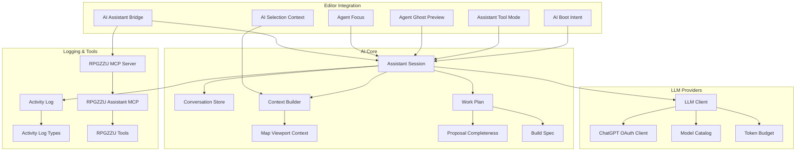

**Diagram sources**
- [src/editor/aiAssistantBridge.ts](file://src/editor/aiAssistantBridge.ts)
- [src/editor/agentFocus.ts](file://src/editor/agentFocus.ts)
- [src/editor/agentGhostPreview.ts](file://src/editor/agentGhostPreview.ts)
- [src/editor/assistantToolMode.ts](file://src/editor/assistantToolMode.ts)
- [src/editor/aiSelectionContext.ts](file://src/editor/aiSelectionContext.ts)
- [src/editor/aiBootIntent.ts](file://src/editor/aiBootIntent.ts)
- [src/ai/assistantSession.ts](file://src/ai/assistantSession.ts)
- [src/ai/conversationStore.ts](file://src/ai/conversationStore.ts)
- [src/ai/contextBuilder.ts](file://src/ai/contextBuilder.ts)
- [src/ai/mapViewportContext.ts](file://src/ai/mapViewportContext.ts)
- [src/ai/workPlan.ts](file://src/ai/workPlan.ts)
- [src/ai/proposalCompleteness.ts](file://src/ai/proposalCompleteness.ts)
- [src/ai/buildSpec.ts](file://src/ai/buildSpec.ts)
- [src/ai/llmClient.ts](file://src/ai/llmClient.ts)
- [src/ai/chatgptOAuthClient.ts](file://src/ai/chatgptOAuthClient.ts)
- [src/ai/modelCatalog.ts](file://src/ai/modelCatalog.ts)
- [src/ai/tokenBudget.ts](file://src/ai/tokenBudget.ts)
- [src/ai/activityLog.ts](file://src/ai/activityLog.ts)
- [src/ai/activityLogTypes.ts](file://src/ai/activityLogTypes.ts)
- [scripts/rpgzzu-mcp-server.mjs](file://scripts/rpgzzu-mcp-server.mjs)
- [scripts/rpgzzu-assistant-mcp.mjs](file://scripts/rpgzzu-assistant-mcp.mjs)
- [scripts/rpgzzu-tools.mjs](file://scripts/rpgzzu-tools.mjs)

**Section sources**
- [openwiki/ai-workflow.md](file://openwiki/ai-workflow.md)

## Core Components
- Assistant Session: Orchestrates multi-turn conversations, coordinates context building, proposal assembly, and execution steps.
- Conversation Store: Persists messages and state across turns; supports replay and export.
- Context Builder: Assembles structured context from project data, selection, viewport, and domain knowledge.
- Map Viewport Context: Captures current map view, selection, and region metadata for precise prompting.
- Work Plan: Decomposes goals into ordered tasks with dependencies and checkpoints.
- Proposal Completeness: Validates proposed changes against constraints and schema before approval.
- Build Spec: Encodes artifacts, assets, and edits required by a proposal.
- LLM Client: Unified interface to call models, handle retries, streaming, and token accounting.
- ChatGPT OAuth Client: Manages authentication flows for supported providers.
- Model Catalog: Central registry of available models and their capabilities.
- Token Budget: Enforces cost and token limits per request or session.
- Activity Log and Types: Records AI actions, decisions, and outcomes for auditability.
- Editor Integrations: Bridge, focus, ghost preview, tool mode, selection context, boot intent.
- MCP Server and Assistant Bridge: External tool interoperability via MCP protocol.

**Section sources**
- [src/ai/assistantSession.ts](file://src/ai/assistantSession.ts)
- [src/ai/conversationStore.ts](file://src/ai/conversationStore.ts)
- [src/ai/contextBuilder.ts](file://src/ai/contextBuilder.ts)
- [src/ai/mapViewportContext.ts](file://src/ai/mapViewportContext.ts)
- [src/ai/workPlan.ts](file://src/ai/workPlan.ts)
- [src/ai/proposalCompleteness.ts](file://src/ai/proposalCompleteness.ts)
- [src/ai/buildSpec.ts](file://src/ai/buildSpec.ts)
- [src/ai/llmClient.ts](file://src/ai/llmClient.ts)
- [src/ai/chatgptOAuthClient.ts](file://src/ai/chatgptOAuthClient.ts)
- [src/ai/modelCatalog.ts](file://src/ai/modelCatalog.ts)
- [src/ai/tokenBudget.ts](file://src/ai/tokenBudget.ts)
- [src/ai/activityLog.ts](file://src/ai/activityLog.ts)
- [src/ai/activityLogTypes.ts](file://src/ai/activityLogTypes.ts)
- [src/editor/aiAssistantBridge.ts](file://src/editor/aiAssistantBridge.ts)
- [src/editor/agentFocus.ts](file://src/editor/agentFocus.ts)
- [src/editor/agentGhostPreview.ts](file://src/editor/agentGhostPreview.ts)
- [src/editor/assistantToolMode.ts](file://src/editor/assistantToolMode.ts)
- [src/editor/aiSelectionContext.ts](file://src/editor/aiSelectionContext.ts)
- [src/editor/aiBootIntent.ts](file://src/editor/aiBootIntent.ts)
- [scripts/rpgzzu-mcp-server.mjs](file://scripts/rpgzzu-mcp-server.mjs)
- [scripts/rpgzzu-assistant-mcp.mjs](file://scripts/rpgzzu-assistant-mcp.mjs)
- [scripts/rpgzzu-tools.mjs](file://scripts/rpgzzu-tools.mjs)

## Architecture Overview
The AI system follows a layered architecture:
- Editor Layer: Exposes AI through panels, tool modes, and previews.
- Session Layer: Manages conversation lifecycle, context composition, and planning.
- Provider Layer: Abstracts LLM calls, auth, and budgeting.
- Observability Layer: Logs activities and metrics for review and debugging.
- Interop Layer: Provides MCP endpoints for external agents and scripts.

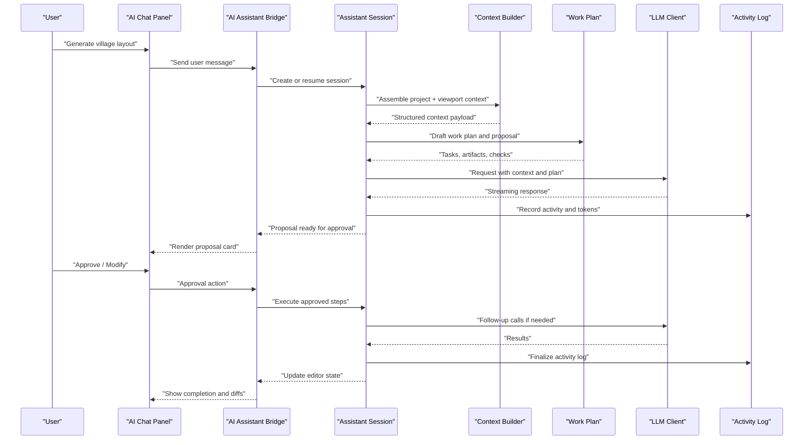

**Diagram sources**
- [src/editor/aiAssistantBridge.ts](file://src/editor/aiAssistantBridge.ts)
- [src/ai/assistantSession.ts](file://src/ai/assistantSession.ts)
- [src/ai/contextBuilder.ts](file://src/ai/contextBuilder.ts)
- [src/ai/workPlan.ts](file://src/ai/workPlan.ts)
- [src/ai/llmClient.ts](file://src/ai/llmClient.ts)
- [src/ai/activityLog.ts](file://src/ai/activityLog.ts)

## Detailed Component Analysis

### Assistant Session and Multi-Turn Conversations
The assistant session manages conversation state, orchestrates context building, and drives proposal generation and execution. It integrates with the conversation store for persistence and with the LLM client for model calls. It also enforces token budgets and logs all activities.

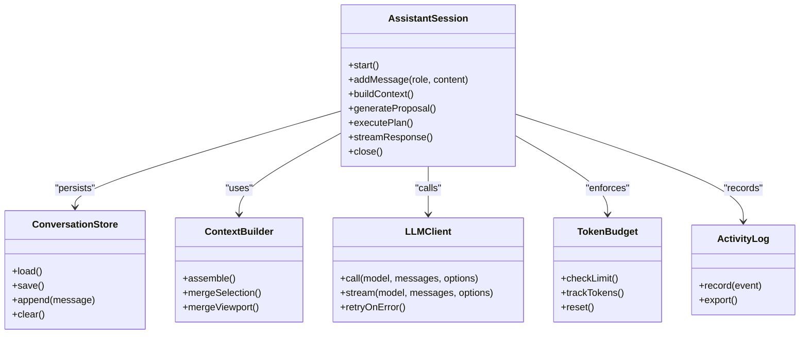

**Diagram sources**
- [src/ai/assistantSession.ts](file://src/ai/assistantSession.ts)
- [src/ai/conversationStore.ts](file://src/ai/conversationStore.ts)
- [src/ai/contextBuilder.ts](file://src/ai/contextBuilder.ts)
- [src/ai/llmClient.ts](file://src/ai/llmClient.ts)
- [src/ai/tokenBudget.ts](file://src/ai/tokenBudget.ts)
- [src/ai/activityLog.ts](file://src/ai/activityLog.ts)

**Section sources**
- [src/ai/assistantSession.ts](file://src/ai/assistantSession.ts)
- [src/ai/conversationStore.ts](file://src/ai/conversationStore.ts)
- [src/ai/llmClient.ts](file://src/ai/llmClient.ts)
- [src/ai/tokenBudget.ts](file://src/ai/tokenBudget.ts)
- [src/ai/activityLog.ts](file://src/ai/activityLog.ts)
- [test/aiAssistantSession.test.ts](file://test/aiAssistantSession.test.ts)
- [test/aiChatPanelSettings.test.ts](file://test/aiChatPanelSettings.test.ts)
- [test/aiChatPanelUxRepairs.test.ts](file://test/aiChatPanelUxRepairs.test.ts)
- [test/aiChatLeanUi.test.ts](file://test/aiChatLeanUi.test.ts)
- [test/aiChatObservability.test.ts](file://test/aiChatObservability.test.ts)

### Context Building for Game Development Tasks
Context building composes multiple sources:
- Project metadata and database references
- Current selection (events, tiles, NPCs)
- Map viewport and region information
- Domain knowledge and skills

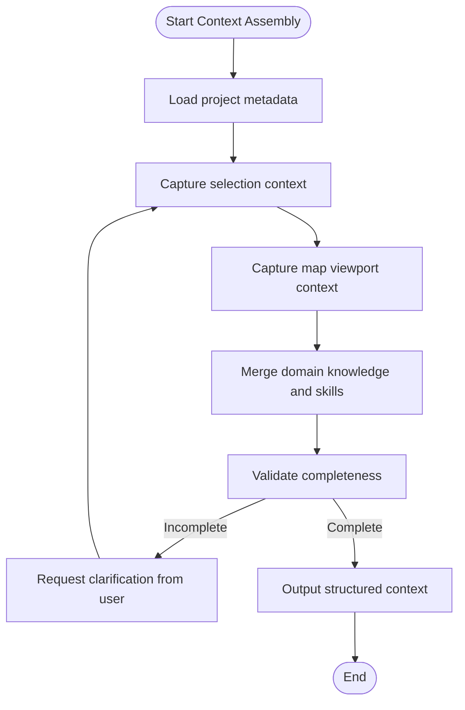

**Diagram sources**
- [src/ai/contextBuilder.ts](file://src/ai/contextBuilder.ts)
- [src/ai/mapViewportContext.ts](file://src/ai/mapViewportContext.ts)
- [src/editor/aiSelectionContext.ts](file://src/editor/aiSelectionContext.ts)

**Section sources**
- [src/ai/contextBuilder.ts](file://src/ai/contextBuilder.ts)
- [src/ai/mapViewportContext.ts](file://src/ai/mapViewportContext.ts)
- [src/editor/aiSelectionContext.ts](file://src/editor/aiSelectionContext.ts)
- [test/contextBuilder.test.ts](file://test/contextBuilder.test.ts)
- [test/mapViewportContext.test.ts](file://test/mapViewportContext.test.ts)

### Proposal Generation and Approval System
Proposals encapsulate planned changes, artifacts, and validation checks. The system ensures completeness before approval and supports soft confirm UX.

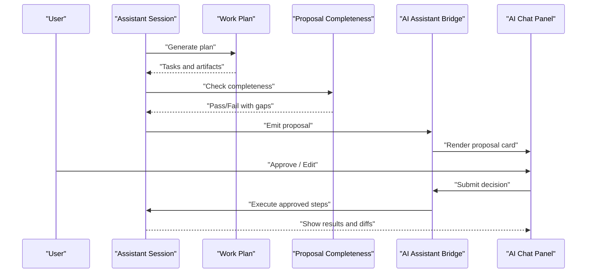

**Diagram sources**
- [src/ai/workPlan.ts](file://src/ai/workPlan.ts)
- [src/ai/proposalCompleteness.ts](file://src/ai/proposalCompleteness.ts)
- [src/ai/buildSpec.ts](file://src/ai/buildSpec.ts)
- [src/editor/aiAssistantBridge.ts](file://src/editor/aiAssistantBridge.ts)

**Section sources**
- [src/ai/workPlan.ts](file://src/ai/workPlan.ts)
- [src/ai/proposalCompleteness.ts](file://src/ai/proposalCompleteness.ts)
- [src/ai/buildSpec.ts](file://src/ai/buildSpec.ts)
- [test/aiProposalCardUxd.test.ts](file://test/aiProposalCardUxd.test.ts)
- [test/aiProposalEmptyNotice.test.ts](file://test/aiProposalEmptyNotice.test.ts)
- [test/aiProposalSoftConfirm.test.ts](file://test/aiProposalSoftConfirm.test.ts)

### Task Planning Capabilities
Work plans decompose high-level goals into executable tasks with dependencies and checkpoints. They integrate with build specs to define artifacts and with proposal completeness to gate approvals.

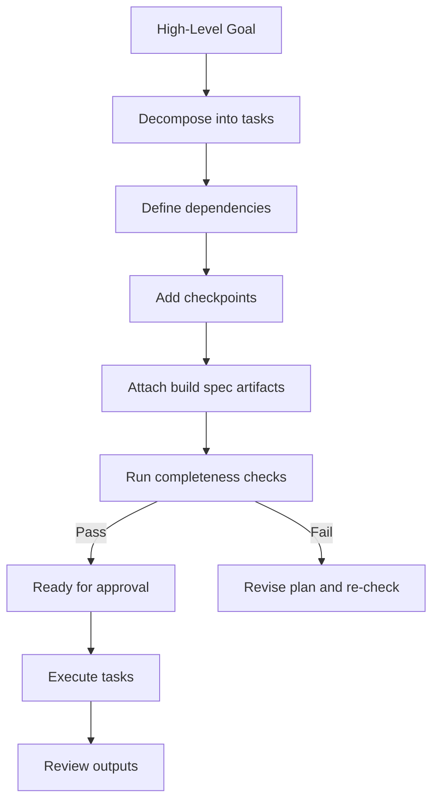

**Diagram sources**
- [src/ai/workPlan.ts](file://src/ai/workPlan.ts)
- [src/ai/buildSpec.ts](file://src/ai/buildSpec.ts)
- [src/ai/proposalCompleteness.ts](file://src/ai/proposalCompleteness.ts)

**Section sources**
- [src/ai/workPlan.ts](file://src/ai/workPlan.ts)
- [src/ai/buildSpec.ts](file://src/ai/buildSpec.ts)
- [src/ai/proposalCompleteness.ts](file://src/ai/proposalCompleteness.ts)
- [test/workPlan.test.ts](file://test/workPlan.test.ts)
- [test/proposalCompleteness.test.ts](file://test/proposalCompleteness.test.ts)

### Integration Between AI Services and Editor Tools
The editor exposes AI through a bridge that connects chat UI, tool modes, and previews. Agent focus and ghost preview provide visual feedback during AI operations.

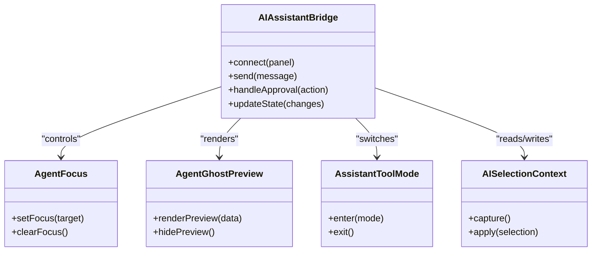

**Diagram sources**
- [src/editor/aiAssistantBridge.ts](file://src/editor/aiAssistantBridge.ts)
- [src/editor/agentFocus.ts](file://src/editor/agentFocus.ts)
- [src/editor/agentGhostPreview.ts](file://src/editor/agentGhostPreview.ts)
- [src/editor/assistantToolMode.ts](file://src/editor/assistantToolMode.ts)
- [src/editor/aiSelectionContext.ts](file://src/editor/aiSelectionContext.ts)

**Section sources**
- [src/editor/aiAssistantBridge.ts](file://src/editor/aiAssistantBridge.ts)
- [src/editor/agentFocus.ts](file://src/editor/agentFocus.ts)
- [src/editor/agentGhostPreview.ts](file://src/editor/agentGhostPreview.ts)
- [src/editor/assistantToolMode.ts](file://src/editor/assistantToolMode.ts)
- [src/editor/aiSelectionContext.ts](file://src/editor/aiSelectionContext.ts)
- [test/aiAssistantBridge.test.ts](file://test/aiAssistantBridge.test.ts)
- [test/aiAgentFocus.test.ts](file://test/aiAgentFocus.test.ts)
- [test/aiAgentGhostPreview.test.ts](file://test/aiAgentGhostPreview.test.ts)
- [test/aiAgentGhostPreviewHidden.test.ts](file://test/aiAgentGhostPreviewHidden.test.ts)

### Automated Content Generation and Code Suggestions
Automated generation uses context and plans to produce maps, events, and assets. Code suggestions leverage selection context and tool modes to propose edits inline.

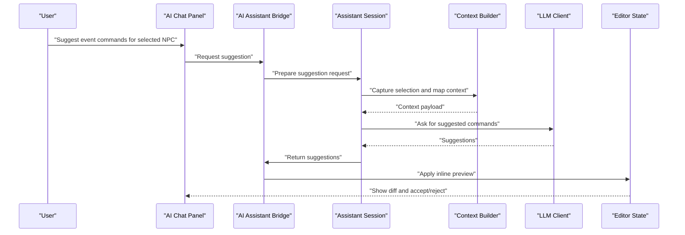

**Diagram sources**
- [src/editor/aiAssistantBridge.ts](file://src/editor/aiAssistantBridge.ts)
- [src/ai/assistantSession.ts](file://src/ai/assistantSession.ts)
- [src/ai/contextBuilder.ts](file://src/ai/contextBuilder.ts)
- [src/ai/llmClient.ts](file://src/ai/llmClient.ts)

**Section sources**
- [src/editor/aiAssistantBridge.ts](file://src/editor/aiAssistantBridge.ts)
- [src/ai/assistantSession.ts](file://src/ai/assistantSession.ts)
- [src/ai/contextBuilder.ts](file://src/ai/contextBuilder.ts)
- [src/ai/llmClient.ts](file://src/ai/llmClient.ts)
- [test/aiPreviewContracts.test.ts](file://test/aiPreviewContracts.test.ts)
- [test/aiPreviewGenerator.test.ts](file://test/aiPreviewGenerator.test.ts)

### Workflow Automation via MCP
The MCP server and assistant bridge enable external tools to interact with the editor’s AI features. Scripts can invoke tasks, retrieve logs, and automate repetitive workflows.

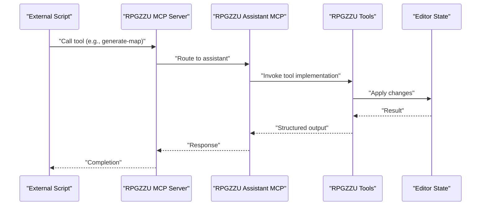

**Diagram sources**
- [scripts/rpgzzu-mcp-server.mjs](file://scripts/rpgzzu-mcp-server.mjs)
- [scripts/rpgzzu-assistant-mcp.mjs](file://scripts/rpgzzu-assistant-mcp.mjs)
- [scripts/rpgzzu-tools.mjs](file://scripts/rpgzzu-tools.mjs)

**Section sources**
- [scripts/rpgzzu-mcp-server.mjs](file://scripts/rpgzzu-mcp-server.mjs)
- [scripts/rpgzzu-assistant-mcp.mjs](file://scripts/rpgzzu-assistant-mcp.mjs)
- [scripts/rpgzzu-tools.mjs](file://scripts/rpgzzu-tools.mjs)

### Region Task Management
Region task tools support planning, running, clipping, status tracking, and exporting logs for AI-driven map and scene construction.

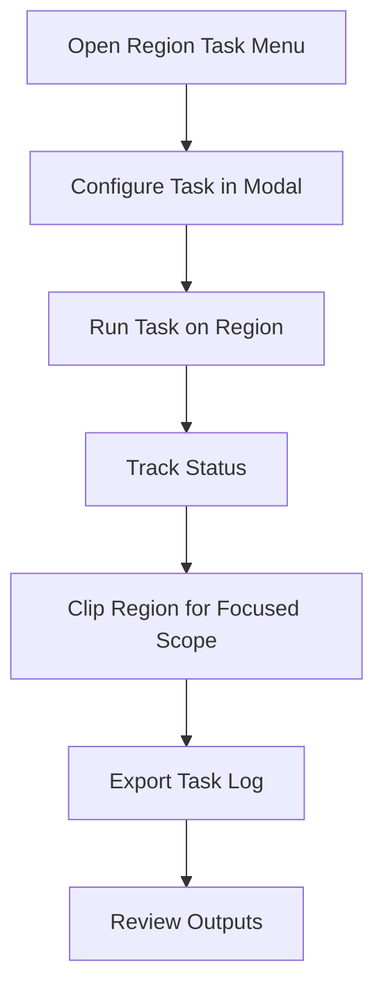

**Diagram sources**
- [src/editor/tools/regionTaskMenu.ts](file://src/editor/tools/regionTaskMenu.ts)
- [src/editor/tools/regionTaskModal.ts](file://src/editor/tools/regionTaskModal.ts)
- [src/editor/tools/regionTaskRun.ts](file://src/editor/tools/regionTaskRun.ts)
- [src/editor/tools/regionTaskStatus.ts](file://src/editor/tools/regionTaskStatus.ts)
- [src/editor/tools/regionTaskClip.ts](file://src/editor/tools/regionTaskClip.ts)
- [src/editor/tools/regionTaskLogExport.ts](file://src/editor/tools/regionTaskLogExport.ts)

**Section sources**
- [src/editor/tools/regionTaskMenu.ts](file://src/editor/tools/regionTaskMenu.ts)
- [src/editor/tools/regionTaskModal.ts](file://src/editor/tools/regionTaskModal.ts)
- [src/editor/tools/regionTaskRun.ts](file://src/editor/tools/regionTaskRun.ts)
- [src/editor/tools/regionTaskStatus.ts](file://src/editor/tools/regionTaskStatus.ts)
- [src/editor/tools/regionTaskClip.ts](file://src/editor/tools/regionTaskClip.ts)
- [src/editor/tools/regionTaskLogExport.ts](file://src/editor/tools/regionTaskLogExport.ts)
- [test/aiRegionTaskMenu.test.ts](file://test/aiRegionTaskMenu.test.ts)
- [test/aiRegionTaskModal.test.ts](file://test/aiRegionTaskModal.test.ts)
- [test/aiRegionTaskRun.test.ts](file://test/aiRegionTaskRun.test.ts)
- [test/aiRegionTaskStatus.test.ts](file://test/aiRegionTaskStatus.test.ts)
- [test/aiRegionTaskClip.test.ts](file://test/aiRegionTaskClip.test.ts)
- [test/aiRegionTaskLogExport.test.ts](file://test/aiRegionTaskLogExport.test.ts)

### Practical Examples
- AI-powered map generation: Use region tasks and viewport context to generate layouts, then approve proposals to apply tilesets and events.
- NPC dialogue creation: Provide character profiles and scene context; the assistant drafts dialogue trees and suggests placement.
- Quest design assistance: Define quest loops and objectives; the assistant proposes quests with conditions and rewards.
- Asset suggestion systems: Based on selection and style tags, the assistant recommends compatible assets and generates variants.

[No sources needed since this section provides conceptual examples]

## Dependency Analysis
The AI components have clear separation of concerns:
- Editor integration depends on session and context builders
- Session depends on LLM client, plan, and proposal modules
- LLM client depends on OAuth and model catalog
- Logging is cross-cutting and used by session and tools

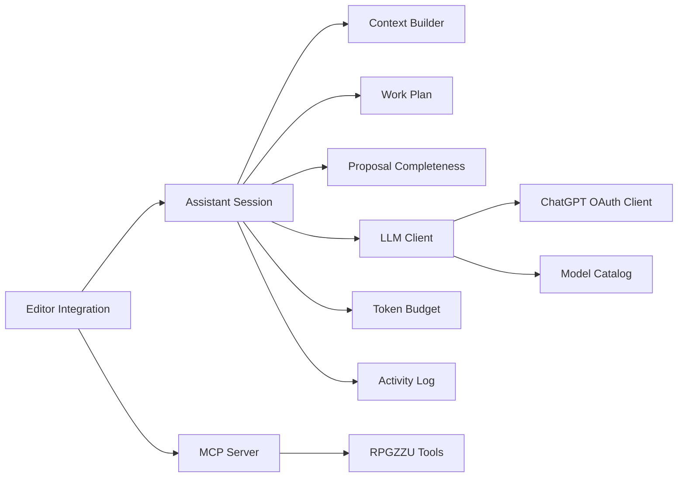

**Diagram sources**
- [src/editor/aiAssistantBridge.ts](file://src/editor/aiAssistantBridge.ts)
- [src/ai/assistantSession.ts](file://src/ai/assistantSession.ts)
- [src/ai/contextBuilder.ts](file://src/ai/contextBuilder.ts)
- [src/ai/workPlan.ts](file://src/ai/workPlan.ts)
- [src/ai/proposalCompleteness.ts](file://src/ai/proposalCompleteness.ts)
- [src/ai/llmClient.ts](file://src/ai/llmClient.ts)
- [src/ai/chatgptOAuthClient.ts](file://src/ai/chatgptOAuthClient.ts)
- [src/ai/modelCatalog.ts](file://src/ai/modelCatalog.ts)
- [src/ai/tokenBudget.ts](file://src/ai/tokenBudget.ts)
- [src/ai/activityLog.ts](file://src/ai/activityLog.ts)
- [scripts/rpgzzu-mcp-server.mjs](file://scripts/rpgzzu-mcp-server.mjs)
- [scripts/rpgzzu-tools.mjs](file://scripts/rpgzzu-tools.mjs)

**Section sources**
- [src/ai/assistantSession.ts](file://src/ai/assistantSession.ts)
- [src/ai/llmClient.ts](file://src/ai/llmClient.ts)
- [src/ai/chatgptOAuthClient.ts](file://src/ai/chatgptOAuthClient.ts)
- [src/ai/modelCatalog.ts](file://src/ai/modelCatalog.ts)
- [src/ai/tokenBudget.ts](file://src/ai/tokenBudget.ts)
- [src/ai/activityLog.ts](file://src/ai/activityLog.ts)
- [scripts/rpgzzu-mcp-server.mjs](file://scripts/rpgzzu-mcp-server.mjs)
- [scripts/rpgzzu-tools.mjs](file://scripts/rpgzzu-tools.mjs)

## Performance Considerations
- Token budget enforcement prevents runaway costs and keeps responses timely.
- Streaming responses improve perceived latency for long outputs.
- Context minimization reduces payload size while preserving relevance.
- Caching of repeated context fragments avoids redundant computation.
- Batched operations in MCP reduce round-trips for bulk edits.

[No sources needed since this section provides general guidance]

## Troubleshooting Guide
Common issues and diagnostics:
- Authentication failures: Verify OAuth flow and provider credentials.
- Token limit exceeded: Adjust budget settings or split large requests.
- Incomplete context: Ensure selection and viewport capture are active.
- Proposal rejection: Review completeness checks and revise plan.
- Logging gaps: Inspect activity logs for missing steps or errors.

**Section sources**
- [src/ai/chatgptOAuthClient.ts](file://src/ai/chatgptOAuthClient.ts)
- [src/ai/tokenBudget.ts](file://src/ai/tokenBudget.ts)
- [src/ai/contextBuilder.ts](file://src/ai/contextBuilder.ts)
- [src/ai/proposalCompleteness.ts](file://src/ai/proposalCompleteness.ts)
- [src/ai/activityLog.ts](file://src/ai/activityLog.ts)
- [test/aiActivityLog.test.ts](file://test/aiActivityLog.test.ts)
- [test/aiLlmClient.test.ts](file://test/aiLlmClient.test.ts)

## Conclusion
The AI-assisted development system integrates tightly with the editor to streamline game creation. Through robust conversation management, context-aware prompting, structured planning, and approval workflows, it enables efficient map generation, NPC dialogue creation, quest design, and asset suggestions. Provider abstraction, token budgeting, and comprehensive logging ensure reliability and control.

[No sources needed since this section summarizes without analyzing specific files]

## Appendices

### Configuration of AI Providers
- Configure OAuth clients for supported providers.
- Register models in the catalog with capabilities and constraints.
- Set token budgets per session or request.
- Enable activity logging for audit trails.

**Section sources**
- [src/ai/chatgptOAuthClient.ts](file://src/ai/chatgptOAuthClient.ts)
- [src/ai/modelCatalog.ts](file://src/ai/modelCatalog.ts)
- [src/ai/tokenBudget.ts](file://src/ai/tokenBudget.ts)
- [src/ai/activityLog.ts](file://src/ai/activityLog.ts)

### Prompt Engineering Best Practices
- Provide concise, structured context from selection and viewport.
- Include explicit constraints and acceptance criteria in proposals.
- Use iterative refinement with follow-up prompts when needed.
- Keep prompts focused on one task to improve accuracy.

[No sources needed since this section provides general guidance]

### Quality Control Measures
- Proposal completeness checks enforce schema and dependency rules.
- Activity logs record decisions and outcomes for review.
- Soft confirm UX allows safe iteration before committing changes.
- Evaluation suites validate behavior across scenarios.

**Section sources**
- [src/ai/proposalCompleteness.ts](file://src/ai/proposalCompleteness.ts)
- [src/ai/activityLog.ts](file://src/ai/activityLog.ts)
- [test/aiProposalSoftConfirm.test.ts](file://test/aiProposalSoftConfirm.test.ts)
- [evals/llmSuite.eval.ts](file://evals/llmSuite.eval.ts)