# Context Building System

<cite>
**Referenced Files in This Document**
- [contextBuilder.ts](file://src/ai/contextBuilder.ts)
- [mapViewportContext.ts](file://src/ai/mapViewportContext.ts)
- [aiSelectionContext.ts](file://src/editor/aiSelectionContext.ts)
- [assistantSession.ts](file://src/ai/assistantSession.ts)
- [llmClient.ts](file://src/ai/llmClient.ts)
- [activityLog.ts](file://src/ai/activityLog.ts)
- [tokenBudget.ts](file://src/ai/tokenBudget.ts)
- [groupSampleBuilder.ts](file://src/ai/groupSampleBuilder.ts)
- [eventCommandAssist.ts](file://src/ai/eventCommandAssist.ts)
- [clusterAssistPrompt.ts](file://src/ai/clusterAssistPrompt.ts)
- [demonstrationPrompt.ts](file://src/ai/demonstrationPrompt.ts)
- [intentClarify.ts](file://src/ai/intentClarify.ts)
- [workPlan.ts](file://src/ai/workPlan.ts)
- [skills.ts](file://src/ai/skills.ts)
- [toolImageRenderer.ts](file://src/ai/toolImageRenderer.ts)
- [modelCatalog.ts](file://src/ai/modelCatalog.ts)
- [conversationStore.ts](file://src/ai/conversationStore.ts)
- [buildSpec.ts](file://src/ai/buildSpec.ts)
- [aiAssistantBridge.ts](file://src/editor/aiAssistantBridge.ts)
- [agentFocus.ts](file://src/editor/agentFocus.ts)
- [agentGhostPreview.ts](file://src/editor/agentGhostPreview.ts)
- [agentPreviewRenderers.ts](file://src/editor/agentPreviewRenderers.ts)
- [aiBootIntent.ts](file://src/editor/aiBootIntent.ts)
- [assistantToolMode.ts](file://src/editor/assistantToolMode.ts)
</cite>

## Table of Contents
1. [Introduction](#introduction)
2. [Project Structure](#project-structure)
3. [Core Components](#core-components)
4. [Architecture Overview](#architecture-overview)
5. [Detailed Component Analysis](#detailed-component-analysis)
6. [Dependency Analysis](#dependency-analysis)
7. [Performance Considerations](#performance-considerations)
8. [Troubleshooting Guide](#troubleshooting-guide)
9. [Conclusion](#conclusion)
10. [Appendices](#appendices)

## Introduction
This document explains the AI context building system that gathers and structures game development context from the editor state, map viewport information, and user selections. It details how context is enriched, transformed, and scored for relevance to downstream AI components such as LLM clients, tooling, and planning modules. The guide includes concrete examples for map editing, asset generation, and event scripting, and discusses performance optimization and caching strategies for large projects.

## Project Structure
The context building system spans several modules:
- Editor integration points capture selection, focus, and viewport data.
- Context builders assemble structured context objects tailored to tasks.
- Enrichment utilities add semantic metadata, references, and constraints.
- Scoring and budgeting ensure only relevant content reaches the LLM.
- Downstream consumers (LLM client, work planner, skills, tools) use the final context.

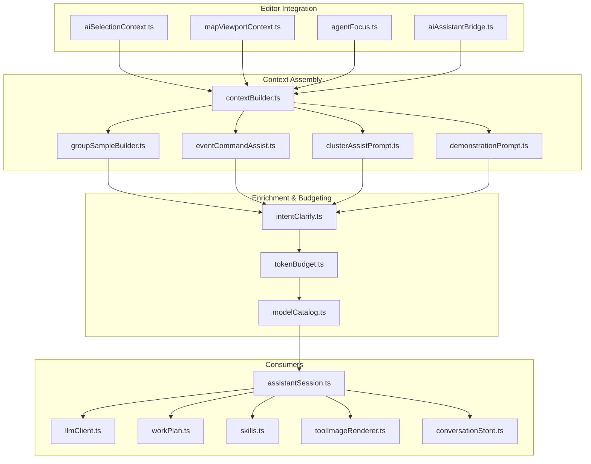

**Diagram sources**
- [aiSelectionContext.ts](file://src/editor/aiSelectionContext.ts)
- [mapViewportContext.ts](file://src/ai/mapViewportContext.ts)
- [agentFocus.ts](file://src/editor/agentFocus.ts)
- [aiAssistantBridge.ts](file://src/editor/aiAssistantBridge.ts)
- [contextBuilder.ts](file://src/ai/contextBuilder.ts)
- [groupSampleBuilder.ts](file://src/ai/groupSampleBuilder.ts)
- [eventCommandAssist.ts](file://src/ai/eventCommandAssist.ts)
- [clusterAssistPrompt.ts](file://src/ai/clusterAssistPrompt.ts)
- [demonstrationPrompt.ts](file://src/ai/demonstrationPrompt.ts)
- [intentClarify.ts](file://src/ai/intentClarify.ts)
- [tokenBudget.ts](file://src/ai/tokenBudget.ts)
- [modelCatalog.ts](file://src/ai/modelCatalog.ts)
- [assistantSession.ts](file://src/ai/assistantSession.ts)
- [llmClient.ts](file://src/ai/llmClient.ts)
- [workPlan.ts](file://src/ai/workPlan.ts)
- [skills.ts](file://src/ai/skills.ts)
- [toolImageRenderer.ts](file://src/ai/toolImageRenderer.ts)
- [conversationStore.ts](file://src/ai/conversationStore.ts)

**Section sources**
- [contextBuilder.ts](file://src/ai/contextBuilder.ts)
- [mapViewportContext.ts](file://src/ai/mapViewportContext.ts)
- [aiSelectionContext.ts](file://src/editor/aiSelectionContext.ts)
- [assistantSession.ts](file://src/ai/assistantSession.ts)
- [llmClient.ts](file://src/ai/llmClient.ts)
- [activityLog.ts](file://src/ai/activityLog.ts)
- [tokenBudget.ts](file://src/ai/tokenBudget.ts)
- [groupSampleBuilder.ts](file://src/ai/groupSampleBuilder.ts)
- [eventCommandAssist.ts](file://src/ai/eventCommandAssist.ts)
- [clusterAssistPrompt.ts](file://src/ai/clusterAssistPrompt.ts)
- [demonstrationPrompt.ts](file://src/ai/demonstrationPrompt.ts)
- [intentClarify.ts](file://src/ai/intentClarify.ts)
- [workPlan.ts](file://src/ai/workPlan.ts)
- [skills.ts](file://src/ai/skills.ts)
- [toolImageRenderer.ts](file://src/ai/toolImageRenderer.ts)
- [modelCatalog.ts](file://src/ai/modelCatalog.ts)
- [conversationStore.ts](file://src/ai/conversationStore.ts)
- [aiAssistantBridge.ts](file://src/editor/aiAssistantBridge.ts)
- [agentFocus.ts](file://src/editor/agentFocus.ts)
- [agentGhostPreview.ts](file://src/editor/agentGhostPreview.ts)
- [agentPreviewRenderers.ts](file://src/editor/agentPreviewRenderers.ts)
- [aiBootIntent.ts](file://src/editor/aiBootIntent.ts)
- [assistantToolMode.ts](file://src/editor/assistantToolMode.ts)

## Core Components
- Context Builder: Orchestrates gathering of editor state, viewport, and selection into a unified context object. It coordinates enrichment and scoring before passing context to consumers.
- Map Viewport Context: Captures visible tile ranges, camera position, zoom, and layer visibility to bound context scope.
- Selection Context: Encodes current UI selections (tiles, events, regions, assets) and their relationships.
- Intent Clarifier: Refines ambiguous user intents by asking clarifying questions or applying defaults based on context.
- Token Budget Manager: Trims and prioritizes context to fit model limits while preserving critical information.
- Model Catalog: Selects appropriate models and capabilities based on task type and context size.
- Assistant Session: Manages conversation history, session-scoped caches, and orchestrates context assembly per turn.
- Activity Log: Records context construction steps and decisions for observability and debugging.

Key responsibilities and interactions are illustrated below.

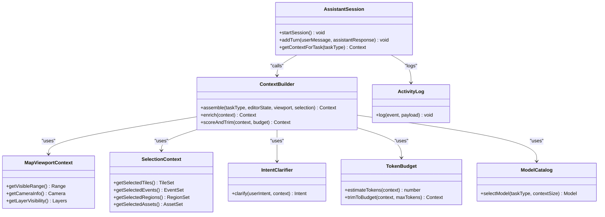

**Diagram sources**
- [contextBuilder.ts](file://src/ai/contextBuilder.ts)
- [mapViewportContext.ts](file://src/ai/mapViewportContext.ts)
- [aiSelectionContext.ts](file://src/editor/aiSelectionContext.ts)
- [intentClarify.ts](file://src/ai/intentClarify.ts)
- [tokenBudget.ts](file://src/ai/tokenBudget.ts)
- [modelCatalog.ts](file://src/ai/modelCatalog.ts)
- [assistantSession.ts](file://src/ai/assistantSession.ts)
- [activityLog.ts](file://src/ai/activityLog.ts)

**Section sources**
- [contextBuilder.ts](file://src/ai/contextBuilder.ts)
- [mapViewportContext.ts](file://src/ai/mapViewportContext.ts)
- [aiSelectionContext.ts](file://src/editor/aiSelectionContext.ts)
- [intentClarify.ts](file://src/ai/intentClarify.ts)
- [tokenBudget.ts](file://src/ai/tokenBudget.ts)
- [modelCatalog.ts](file://src/ai/modelCatalog.ts)
- [assistantSession.ts](file://src/ai/assistantSession.ts)
- [activityLog.ts](file://src/ai/activityLog.ts)

## Architecture Overview
The system follows a pipeline architecture:
- Input: Editor state, viewport bounds, and user selections.
- Processing: Context assembly, enrichment, intent clarification, relevance scoring, token budget trimming.
- Output: Task-specific context payloads consumed by LLM client, work planner, skills, and tool renderers.

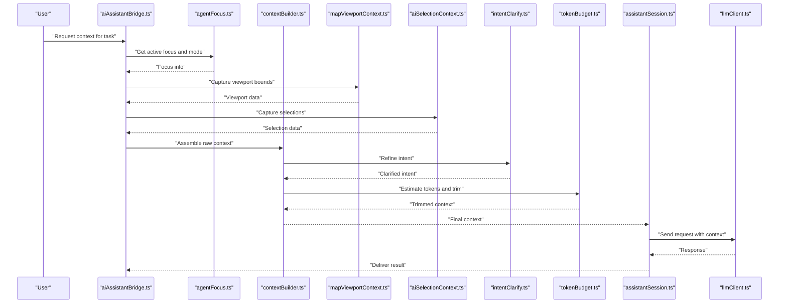

**Diagram sources**
- [aiAssistantBridge.ts](file://src/editor/aiAssistantBridge.ts)
- [agentFocus.ts](file://src/editor/agentFocus.ts)
- [contextBuilder.ts](file://src/ai/contextBuilder.ts)
- [mapViewportContext.ts](file://src/ai/mapViewportContext.ts)
- [aiSelectionContext.ts](file://src/editor/aiSelectionContext.ts)
- [intentClarify.ts](file://src/ai/intentClarify.ts)
- [tokenBudget.ts](file://src/ai/tokenBudget.ts)
- [assistantSession.ts](file://src/ai/assistantSession.ts)
- [llmClient.ts](file://src/ai/llmClient.ts)

## Detailed Component Analysis

### Context Builder Pipeline
The builder composes context from multiple sources and applies transformations:
- Gather: Collects viewport range, selected tiles/events/regions/assets, and editor mode.
- Enrich: Adds semantic tags, reference links, and constraints derived from project ontology and database.
- Score: Computes relevance scores based on proximity to selection, importance of entities, and task type.
- Trim: Applies token budget rules to keep essential context within model limits.

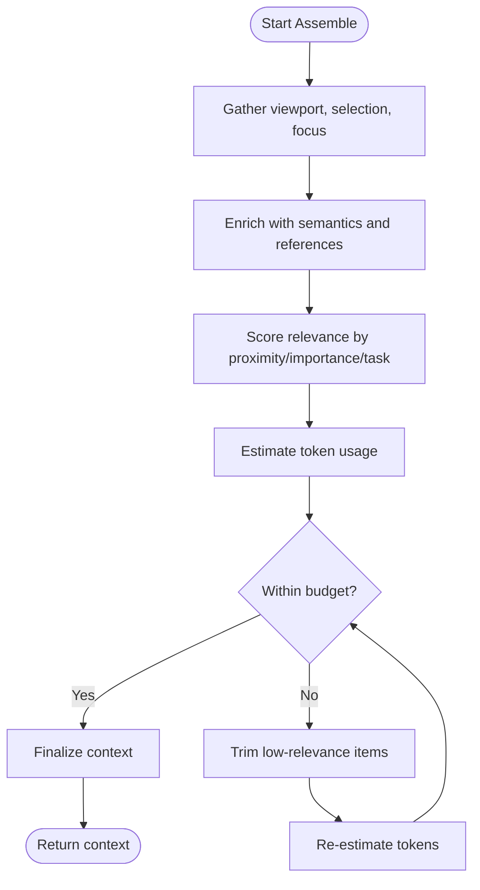

**Diagram sources**
- [contextBuilder.ts](file://src/ai/contextBuilder.ts)
- [tokenBudget.ts](file://src/ai/tokenBudget.ts)

**Section sources**
- [contextBuilder.ts](file://src/ai/contextBuilder.ts)
- [tokenBudget.ts](file://src/ai/tokenBudget.ts)

### Map Viewport Context
Captures the visible area and layer visibility to constrain context scope:
- Visible range: Minimum and maximum tile indices currently in view.
- Camera info: Position, zoom level, and pan offsets.
- Layer visibility: Which layers are active (terrain, props, events).

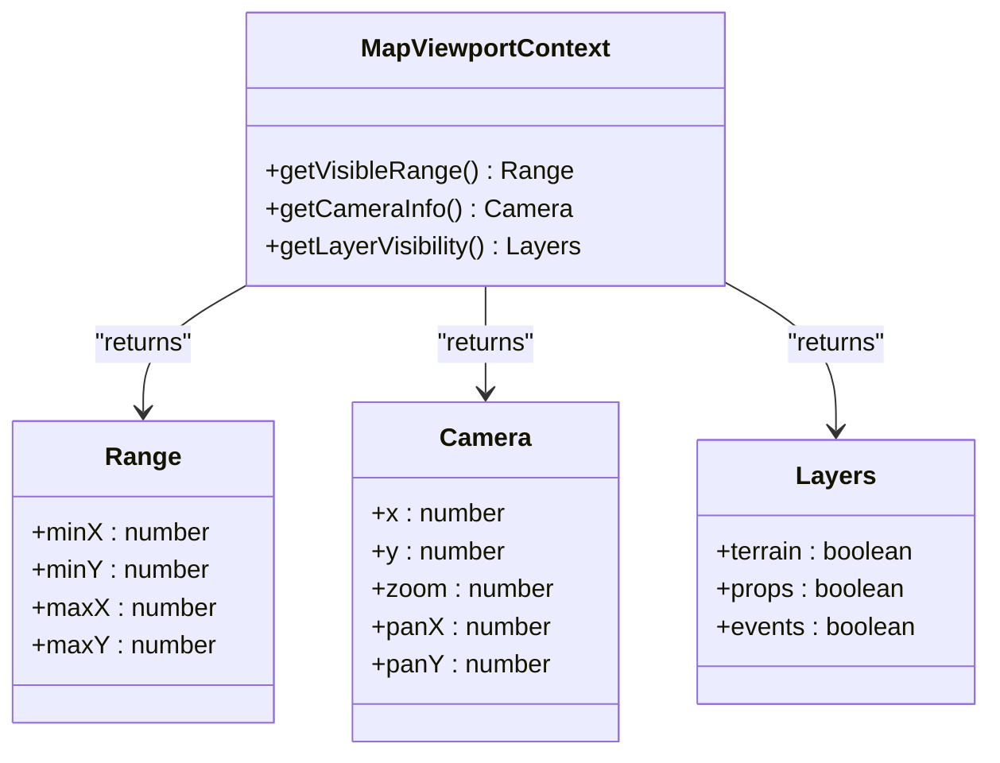

**Diagram sources**
- [mapViewportContext.ts](file://src/ai/mapViewportContext.ts)

**Section sources**
- [mapViewportContext.ts](file://src/ai/mapViewportContext.ts)

### Selection Context
Encapsulates current UI selections across tiles, events, regions, and assets:
- Selected tiles: Set of tile positions and types.
- Selected events: Event IDs and page states.
- Selected regions: Region identifiers and attributes.
- Selected assets: Resource IDs and metadata.

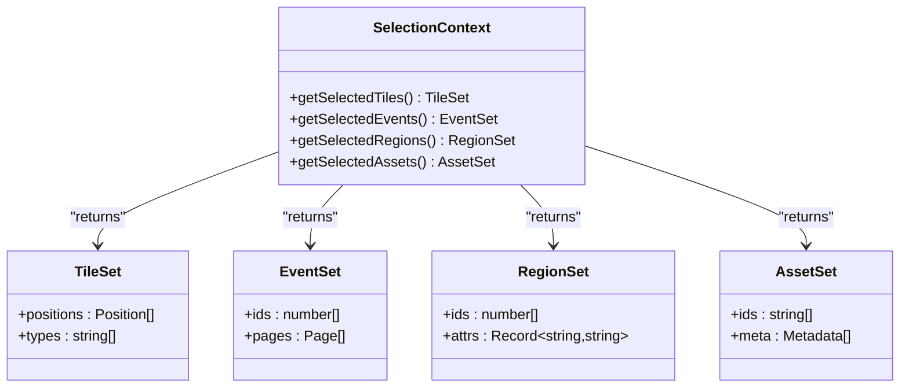

**Diagram sources**
- [aiSelectionContext.ts](file://src/editor/aiSelectionContext.ts)

**Section sources**
- [aiSelectionContext.ts](file://src/editor/aiSelectionContext.ts)

### Intent Clarification
Resolves ambiguity by leveraging context and defaults:
- Detects vague intents (e.g., “make it look better”).
- Asks targeted clarifications or infers options from viewport and selection.
- Produces a refined intent used for downstream processing.

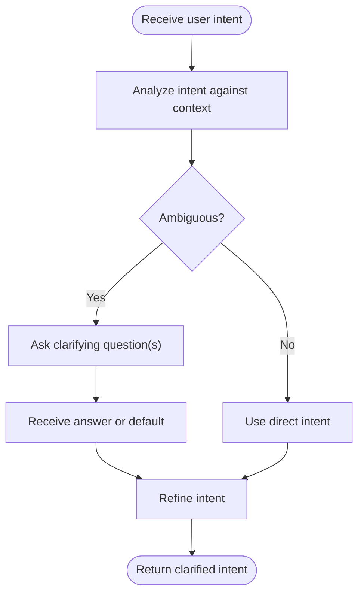

**Diagram sources**
- [intentClarify.ts](file://src/ai/intentClarify.ts)

**Section sources**
- [intentClarify.ts](file://src/ai/intentClarify.ts)

### Token Budget Management
Ensures context fits model constraints:
- Estimates token usage for each context segment.
- Prioritizes high-relevance segments (selections, nearby tiles, key events).
- Trims lower-priority segments until within budget.

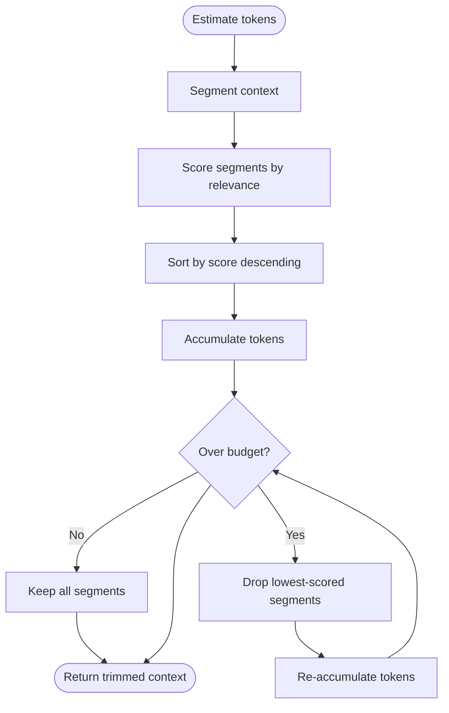

**Diagram sources**
- [tokenBudget.ts](file://src/ai/tokenBudget.ts)

**Section sources**
- [tokenBudget.ts](file://src/ai/tokenBudget.ts)

### Group Sample Builder
Constructs representative samples for placement and clustering tasks:
- Aggregates nearby elements (tiles, props, events) within viewport.
- Normalizes sample structure for consistent consumption by planners and tools.

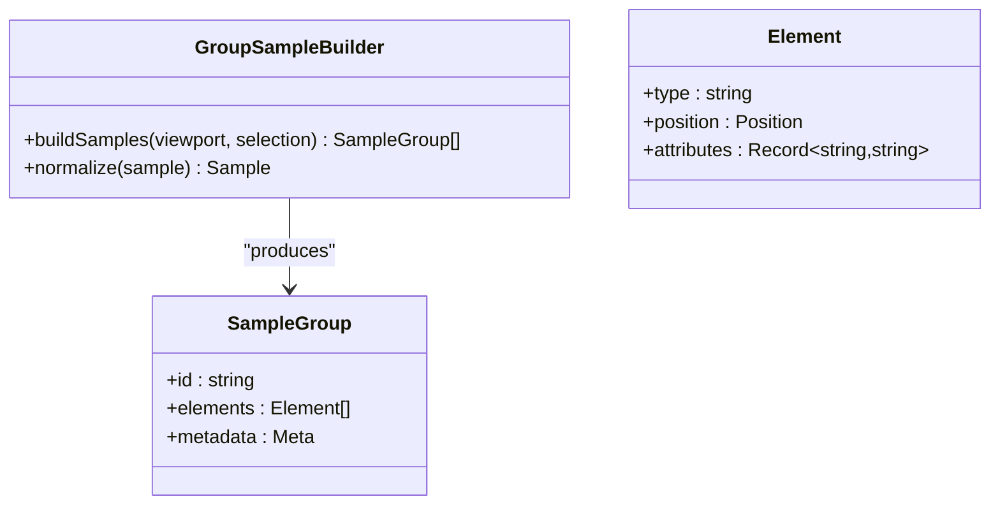

**Diagram sources**
- [groupSampleBuilder.ts](file://src/ai/groupSampleBuilder.ts)

**Section sources**
- [groupSampleBuilder.ts](file://src/ai/groupSampleBuilder.ts)

### Event Command Assist
Generates context for event scripting assistance:
- Extracts relevant event pages, conditions, and commands near selection.
- Maps command kinds to schema and provides examples.

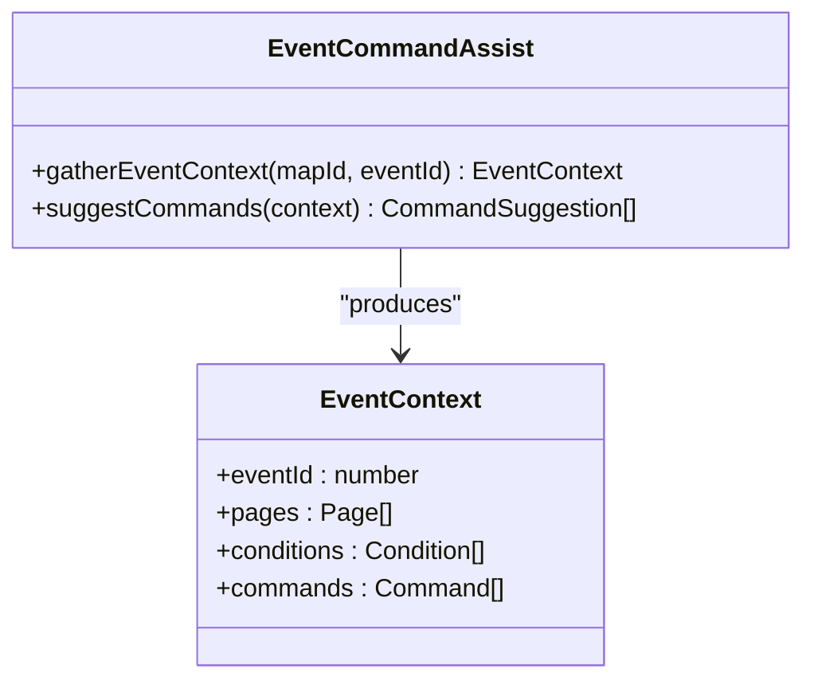

**Diagram sources**
- [eventCommandAssist.ts](file://src/ai/eventCommandAssist.ts)

**Section sources**
- [eventCommandAssist.ts](file://src/ai/eventCommandAssist.ts)

### Cluster Assist Prompt
Builds prompts for cluster-based layout and rule application:
- Summarizes cluster rules and current map state.
- Provides structured input for rule evaluation and placement suggestions.

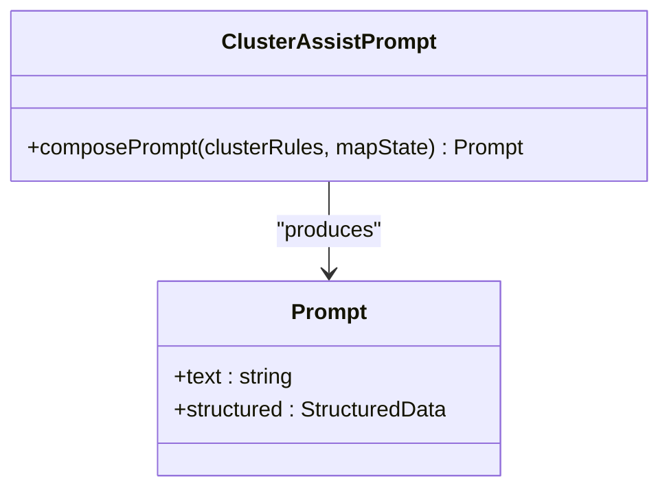

**Diagram sources**
- [clusterAssistPrompt.ts](file://src/ai/clusterAssistPrompt.ts)

**Section sources**
- [clusterAssistPrompt.ts](file://src/ai/clusterAssistPrompt.ts)

### Demonstration Prompt
Creates demonstration-driven prompts using prior successful patterns:
- Retrieves similar past contexts and outcomes.
- Formats demonstrations to guide model behavior.

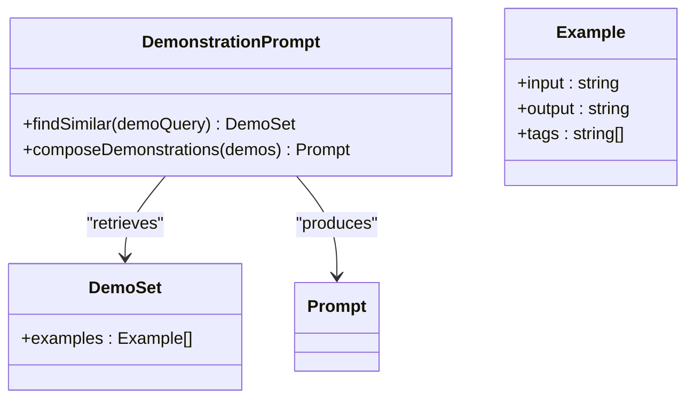

**Diagram sources**
- [demonstrationPrompt.ts](file://src/ai/demonstrationPrompt.ts)

**Section sources**
- [demonstrationPrompt.ts](file://src/ai/demonstrationPrompt.ts)

### Assistant Session and Consumers
Manages conversation lifecycle and integrates context with consumers:
- Starts sessions, tracks turns, and maintains session-scoped caches.
- Delegates context assembly to the builder and forwards to LLM client, work planner, skills, and tool renderers.

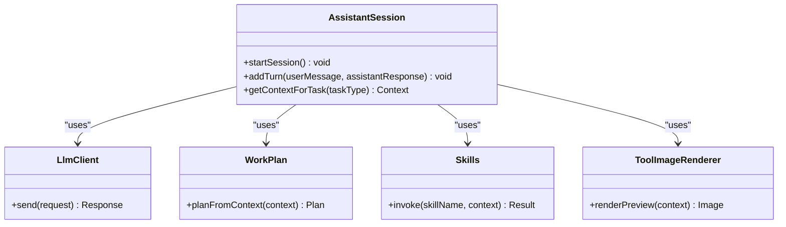

**Diagram sources**
- [assistantSession.ts](file://src/ai/assistantSession.ts)
- [llmClient.ts](file://src/ai/llmClient.ts)
- [workPlan.ts](file://src/ai/workPlan.ts)
- [skills.ts](file://src/ai/skills.ts)
- [toolImageRenderer.ts](file://src/ai/toolImageRenderer.ts)

**Section sources**
- [assistantSession.ts](file://src/ai/assistantSession.ts)
- [llmClient.ts](file://src/ai/llmClient.ts)
- [workPlan.ts](file://src/ai/workPlan.ts)
- [skills.ts](file://src/ai/skills.ts)
- [toolImageRenderer.ts](file://src/ai/toolImageRenderer.ts)

### Concrete Examples

#### Map Editing Context Construction
- Inputs: Visible tile range, selected terrain tiles, active layers.
- Enrichment: Terrain semantics, autotile compatibility, adjacency constraints.
- Scoring: Proximity to selection, terrain importance, layer priority.
- Output: Compact context including candidate tiles and constraints for placement suggestions.

**Section sources**
- [mapViewportContext.ts](file://src/ai/mapViewportContext.ts)
- [aiSelectionContext.ts](file://src/editor/aiSelectionContext.ts)
- [contextBuilder.ts](file://src/ai/contextBuilder.ts)
- [tokenBudget.ts](file://src/ai/tokenBudget.ts)

#### Asset Generation Context Construction
- Inputs: Selected assets, resource metadata, theme tags.
- Enrichment: Semantic tags, style descriptors, palette constraints.
- Scoring: Relevance to current map theme, visual coherence, usage frequency.
- Output: Context guiding image generation or asset mapping with style and palette hints.

**Section sources**
- [aiSelectionContext.ts](file://src/editor/aiSelectionContext.ts)
- [contextBuilder.ts](file://src/ai/contextBuilder.ts)
- [modelCatalog.ts](file://src/ai/modelCatalog.ts)

#### Event Scripting Context Construction
- Inputs: Selected event ID, event pages, conditions, commands.
- Enrichment: Command schema, condition references, variable mappings.
- Scoring: Proximity to player interaction points, conditional complexity.
- Output: Context enabling command suggestions and script completion.

**Section sources**
- [eventCommandAssist.ts](file://src/ai/eventCommandAssist.ts)
- [contextBuilder.ts](file://src/ai/contextBuilder.ts)
- [intentClarify.ts](file://src/ai/intentClarify.ts)

## Dependency Analysis
The context building system has clear separation between editor integration, assembly, enrichment, and consumption. Dependencies are primarily unidirectional, reducing coupling risks.

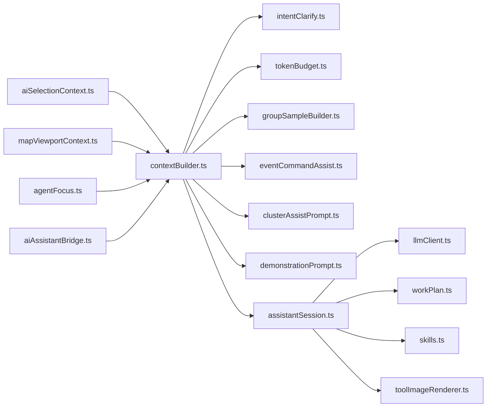

**Diagram sources**
- [aiSelectionContext.ts](file://src/editor/aiSelectionContext.ts)
- [mapViewportContext.ts](file://src/ai/mapViewportContext.ts)
- [agentFocus.ts](file://src/editor/agentFocus.ts)
- [aiAssistantBridge.ts](file://src/editor/aiAssistantBridge.ts)
- [contextBuilder.ts](file://src/ai/contextBuilder.ts)
- [intentClarify.ts](file://src/ai/intentClarify.ts)
- [tokenBudget.ts](file://src/ai/tokenBudget.ts)
- [groupSampleBuilder.ts](file://src/ai/groupSampleBuilder.ts)
- [eventCommandAssist.ts](file://src/ai/eventCommandAssist.ts)
- [clusterAssistPrompt.ts](file://src/ai/clusterAssistPrompt.ts)
- [demonstrationPrompt.ts](file://src/ai/demonstrationPrompt.ts)
- [assistantSession.ts](file://src/ai/assistantSession.ts)
- [llmClient.ts](file://src/ai/llmClient.ts)
- [workPlan.ts](file://src/ai/workPlan.ts)
- [skills.ts](file://src/ai/skills.ts)
- [toolImageRenderer.ts](file://src/ai/toolImageRenderer.ts)

**Section sources**
- [contextBuilder.ts](file://src/ai/contextBuilder.ts)
- [assistantSession.ts](file://src/ai/assistantSession.ts)

## Performance Considerations
- Viewport-bounded sampling: Limit context to visible ranges to reduce token usage and improve responsiveness.
- Incremental updates: Recompute only changed segments when selections or viewport shift slightly.
- Caching strategies:
  - Session-scoped caches for repeated queries (e.g., group samples, event contexts).
  - Model catalog cache for selecting optimal models based on task and context size.
  - Conversation store cache for recent turns to avoid reassembly.
- Token budget trimming: Prioritize high-relevance segments; drop low-value data first.
- Batched enrichment: Combine semantic tagging and reference resolution into single passes where possible.
- Lazy loading: Load heavy metadata (e.g., full asset manifests) on demand.

[No sources needed since this section provides general guidance]

## Troubleshooting Guide
- Symptom: Context too large causing timeouts.
  - Check token budget estimation and trimming thresholds.
  - Verify viewport bounds are correctly constrained.
  - Review relevance scoring weights to prioritize essential data.
- Symptom: Irrelevant suggestions.
  - Inspect intent clarification logic and defaults.
  - Validate selection context accuracy and layer visibility flags.
  - Ensure enrichment adds correct semantic tags and constraints.
- Symptom: Slow response times in large projects.
  - Enable incremental updates and caching for group samples and event contexts.
  - Reduce unnecessary metadata in context payloads.
  - Monitor activity logs for expensive operations.

**Section sources**
- [activityLog.ts](file://src/ai/activityLog.ts)
- [tokenBudget.ts](file://src/ai/tokenBudget.ts)
- [intentClarify.ts](file://src/ai/intentClarify.ts)
- [mapViewportContext.ts](file://src/ai/mapViewportContext.ts)
- [aiSelectionContext.ts](file://src/editor/aiSelectionContext.ts)

## Conclusion
The AI context building system integrates editor state, viewport data, and user selections into task-specific contexts through a robust pipeline of assembly, enrichment, scoring, and budgeting. By constraining scope, prioritizing relevance, and employing caching, it delivers high-quality responses for map editing, asset generation, and event scripting while maintaining performance in large projects.

[No sources needed since this section summarizes without analyzing specific files]

## Appendices

### Editor Integration Points
- aiAssistantBridge: Entry point for context requests from UI.
- agentFocus: Tracks active focus and mode to tailor context.
- agentGhostPreview and agentPreviewRenderers: Visual feedback for context-informed actions.
- aiBootIntent and assistantToolMode: Initialize context-building modes at startup.

**Section sources**
- [aiAssistantBridge.ts](file://src/editor/aiAssistantBridge.ts)
- [agentFocus.ts](file://src/editor/agentFocus.ts)
- [agentGhostPreview.ts](file://src/editor/agentGhostPreview.ts)
- [agentPreviewRenderers.ts](file://src/editor/agentPreviewRenderers.ts)
- [aiBootIntent.ts](file://src/editor/aiBootIntent.ts)
- [assistantToolMode.ts](file://src/editor/assistantToolMode.ts)