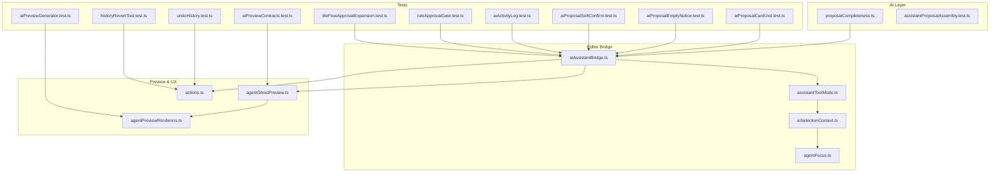
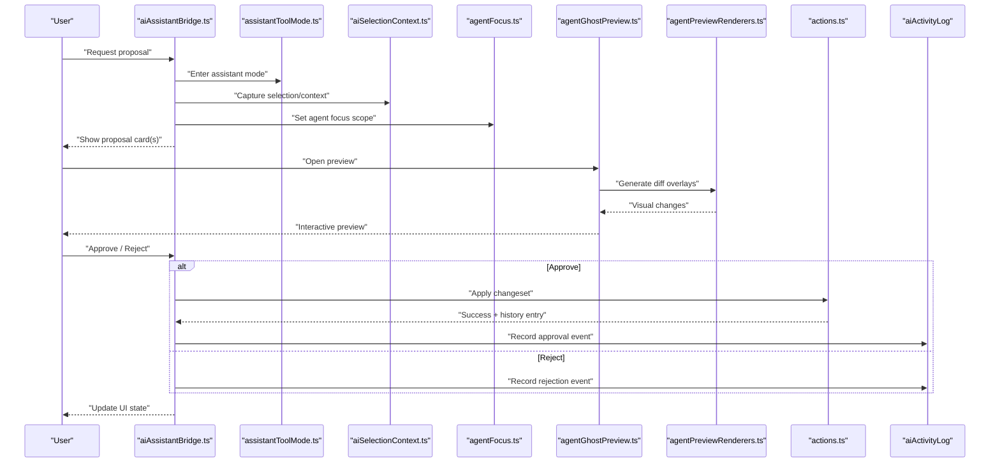
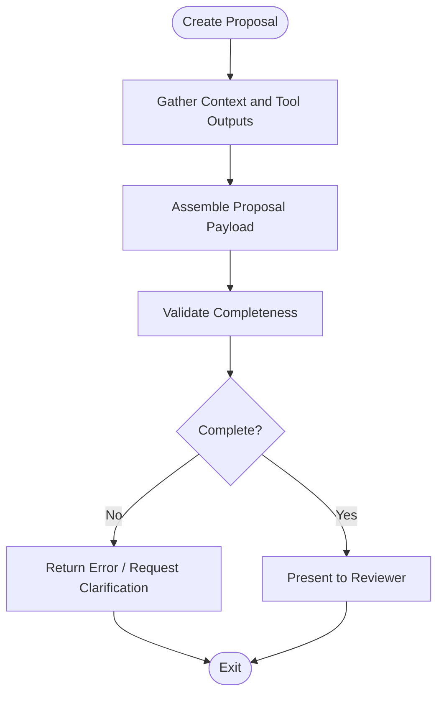
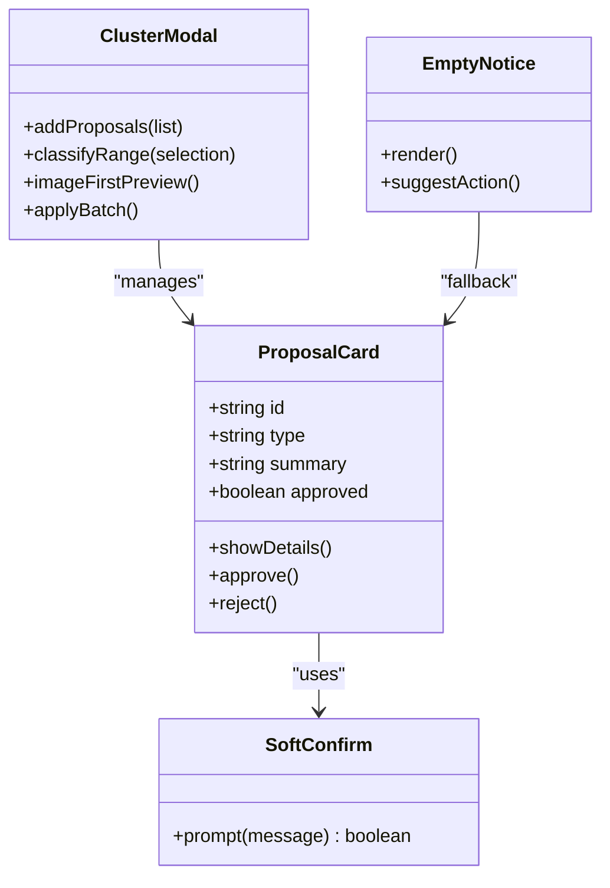
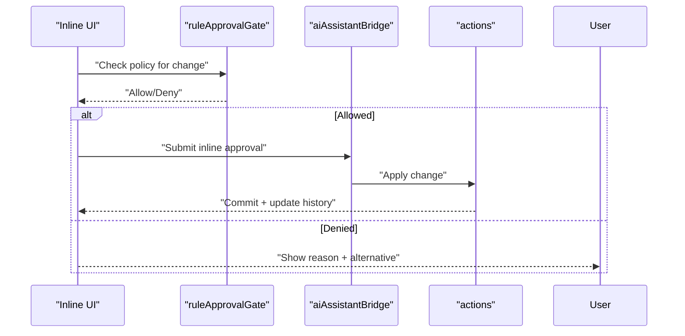
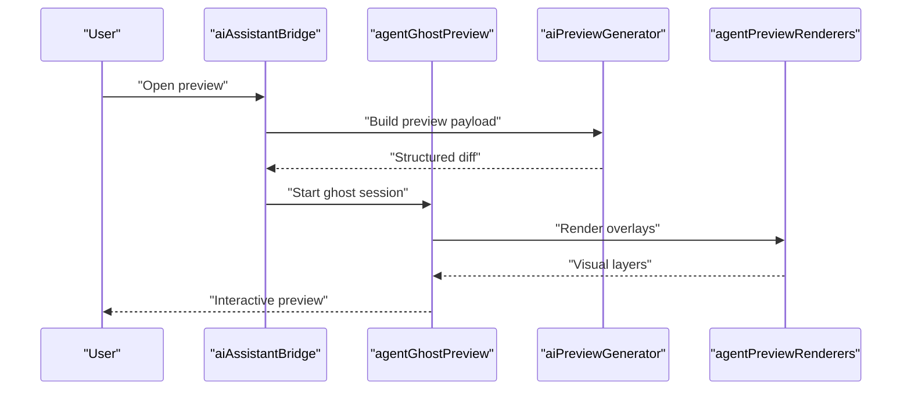
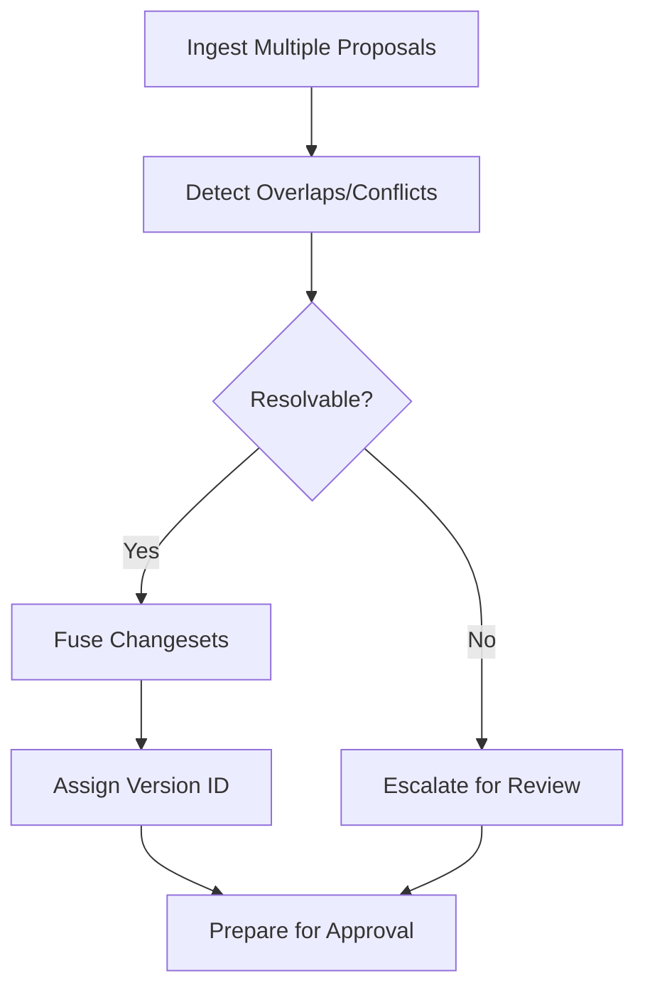
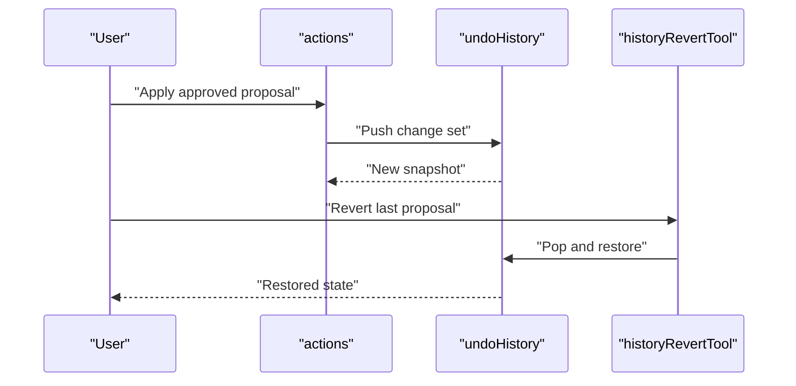
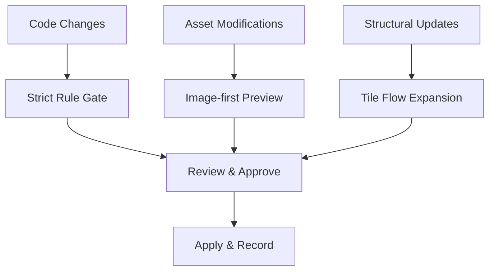
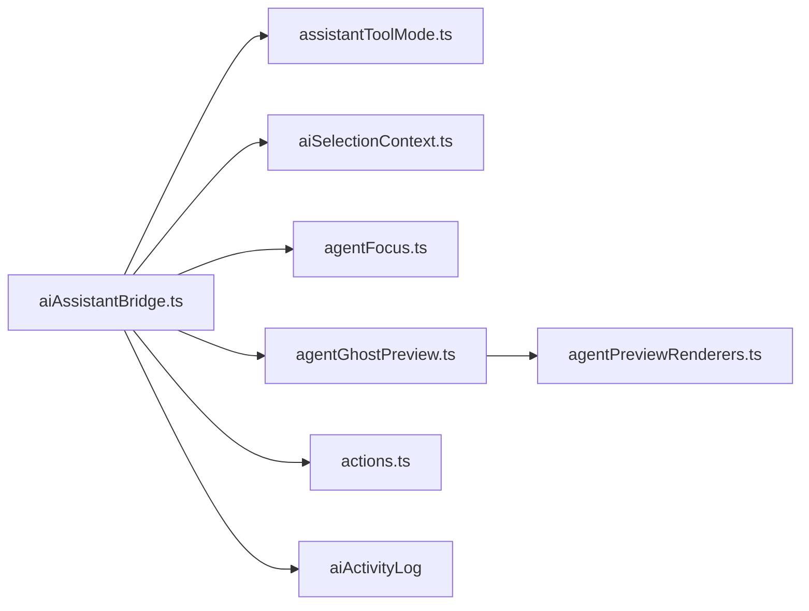

# Proposal Generation and Approval Workflow

<cite>
**Referenced Files in This Document**
- [src/ai/proposalCompleteness.ts](file://src/ai/proposalCompleteness.ts)
- [src/editor/agentGhostPreview.ts](file://src/editor/agentGhostPreview.ts)
- [src/editor/agentPreviewRenderers.ts](file://src/editor/agentPreviewRenderers.ts)
- [src/editor/actions.ts](file://src/editor/actions.ts)
- [src/editor/aiAssistantBridge.ts](file://src/editor/aiAssistantBridge.ts)
- [src/editor/assistantToolMode.ts](file://src/editor/assistantToolMode.ts)
- [src/editor/aiSelectionContext.ts](file://src/editor/aiSelectionContext.ts)
- [src/editor/agentFocus.ts](file://src/editor/agentFocus.ts)
- [test/aiProposalCardUxd.test.ts](file://test/aiProposalCardUxd.test.ts)
- [test/aiProposalEmptyNotice.test.ts](file://test/aiProposalEmptyNotice.test.ts)
- [test/aiProposalSoftConfirm.test.ts](file://test/aiProposalSoftConfirm.test.ts)
- [test/aiPreviewContracts.test.ts](file://test/aiPreviewContracts.test.ts)
- [test/aiPreviewGenerator.test.ts](file://test/aiPreviewGenerator.test.ts)
- [test/assistantProposalAssembly.test.ts](file://test/assistantProposalAssembly.test.ts)
- [test/aiActivityLog.test.ts](file://test/aiActivityLog.test.ts)
- [test/aiAgentic.test.ts](file://test/aiAgentic.test.ts)
- [test/aiClusterAiModal.test.ts](file://test/aiClusterAiModal.test.ts)
- [test/clusterAiModalImageFirst.test.ts](file://test/clusterAiModalImageFirst.test.ts)
- [test/clusterAiModalRangeClassify.test.ts](file://test/clusterAiModalRangeClassify.test.ts)
- [test/tileFlowApprovalExpansion.test.ts](file://test/tileFlowApprovalExpansion.test.ts)
- [test/ruleApprovalGate.test.ts](file://test/ruleApprovalGate.test.ts)
- [test/undoHistory.test.ts](file://test/undoHistory.test.ts)
- [test/historyRevertTool.test.ts](file://test/historyRevertTool.test.ts)
- [openwiki/ai-workflow.md](file://openwiki/ai-workflow.md)
</cite>

## Table of Contents
1. [Introduction](#introduction)
2. [Project Structure](#project-structure)
3. [Core Components](#core-components)
4. [Architecture Overview](#architecture-overview)
5. [Detailed Component Analysis](#detailed-component-analysis)
6. [Dependency Analysis](#dependency-analysis)
7. [Performance Considerations](#performance-considerations)
8. [Troubleshooting Guide](#troubleshooting-guide)
9. [Conclusion](#conclusion)
10. [Appendices](#appendices)

## Introduction
This document explains the AI proposal generation and approval workflow used by the editor. It covers how proposals are created, validated for completeness, presented to users for review, and applied via inline or modal approvals. It also documents proposal fusion, conflict resolution, version tracking, integration with the editor’s undo/redo system, and change preview capabilities. Examples include code changes, asset modifications, and structural updates.

## Project Structure
The proposal system spans AI orchestration, editor UI components, preview rendering, and tests that validate behavior. Key areas:
- AI proposal assembly and completeness validation
- Editor bridge and tool mode coordination
- Ghost previews and renderers for change visualization
- Approval UX (cards, modals, soft confirm)
- Integration with history (undo/redo) and activity logging

**Diagram sources**
- [src/ai/proposalCompleteness.ts](file://src/ai/proposalCompleteness.ts)
- [src/editor/aiAssistantBridge.ts](file://src/editor/aiAssistantBridge.ts)
- [src/editor/assistantToolMode.ts](file://src/editor/assistantToolMode.ts)
- [src/editor/aiSelectionContext.ts](file://src/editor/aiSelectionContext.ts)
- [src/editor/agentFocus.ts](file://src/editor/agentFocus.ts)
- [src/editor/agentGhostPreview.ts](file://src/editor/agentGhostPreview.ts)
- [src/editor/agentPreviewRenderers.ts](file://src/editor/agentPreviewRenderers.ts)
- [src/editor/actions.ts](file://src/editor/actions.ts)
- [test/aiProposalCardUxd.test.ts](file://test/aiProposalCardUxd.test.ts)
- [test/aiProposalEmptyNotice.test.ts](file://test/aiProposalEmptyNotice.test.ts)
- [test/aiProposalSoftConfirm.test.ts](file://test/aiProposalSoftConfirm.test.ts)
- [test/aiPreviewContracts.test.ts](file://test/aiPreviewContracts.test.ts)
- [test/aiPreviewGenerator.test.ts](file://test/aiPreviewGenerator.test.ts)
- [test/aiActivityLog.test.ts](file://test/aiActivityLog.test.ts)
- [test/ruleApprovalGate.test.ts](file://test/ruleApprovalGate.test.ts)
- [test/tileFlowApprovalExpansion.test.ts](file://test/tileFlowApprovalExpansion.test.ts)
- [test/undoHistory.test.ts](file://test/undoHistory.test.ts)
- [test/historyRevertTool.test.ts](file://test/historyRevertTool.test.ts)

**Section sources**
- [openwiki/ai-workflow.md](file://openwiki/ai-workflow.md)

## Core Components
- Proposal completeness validator: Ensures a generated proposal contains all required fields and references before it is shown to the user.
- Assistant proposal assembly: Orchestrates building a proposal from multiple sources (context, tools, rules).
- Editor bridge: Connects AI outputs to editor actions, manages tool modes, selection context, and focus.
- Ghost preview and renderers: Provide visual diffs and overlays so users can inspect proposed changes before approval.
- Approval UX: Proposal cards, empty-state notices, soft confirmation flows, and modal interactions.
- Activity logging: Records proposal lifecycle events for auditability.

**Section sources**
- [src/ai/proposalCompleteness.ts](file://src/ai/proposalCompleteness.ts)
- [test/assistantProposalAssembly.test.ts](file://test/assistantProposalAssembly.test.ts)
- [src/editor/aiAssistantBridge.ts](file://src/editor/aiAssistantBridge.ts)
- [src/editor/assistantToolMode.ts](file://src/editor/assistantToolMode.ts)
- [src/editor/aiSelectionContext.ts](file://src/editor/aiSelectionContext.ts)
- [src/editor/agentFocus.ts](file://src/editor/agentFocus.ts)
- [src/editor/agentGhostPreview.ts](file://src/editor/agentGhostPreview.ts)
- [src/editor/agentPreviewRenderers.ts](file://src/editor/agentPreviewRenderers.ts)
- [test/aiProposalCardUxd.test.ts](file://test/aiProposalCardUxd.test.ts)
- [test/aiProposalEmptyNotice.test.ts](file://test/aiProposalEmptyNotice.test.ts)
- [test/aiProposalSoftConfirm.test.ts](file://test/aiProposalSoftConfirm.test.ts)
- [test/aiActivityLog.test.ts](file://test/aiActivityLog.test.ts)

## Architecture Overview
The workflow proceeds through creation, validation, preview, review, and application. Proposals may be fused when multiple suggestions target overlapping regions or records. Conflicts are resolved using rule-based gates and expansion strategies. Approved changes integrate with the editor’s history stack for undo/redo.

**Diagram sources**
- [src/editor/aiAssistantBridge.ts](file://src/editor/aiAssistantBridge.ts)
- [src/editor/assistantToolMode.ts](file://src/editor/assistantToolMode.ts)
- [src/editor/aiSelectionContext.ts](file://src/editor/aiSelectionContext.ts)
- [src/editor/agentFocus.ts](file://src/editor/agentFocus.ts)
- [src/editor/agentGhostPreview.ts](file://src/editor/agentGhostPreview.ts)
- [src/editor/agentPreviewRenderers.ts](file://src/editor/agentPreviewRenderers.ts)
- [src/editor/actions.ts](file://src/editor/actions.ts)
- [test/aiActivityLog.test.ts](file://test/aiActivityLog.test.ts)

## Detailed Component Analysis

### Proposal Creation and Completeness Validation
- The completeness validator checks that proposals contain required metadata, change descriptions, affected resources, and any constraints needed for safe application.
- Assembly logic aggregates inputs from context builders, tool outputs, and domain rules into a unified proposal structure.
- Tests verify that incomplete proposals are rejected early and that valid proposals pass validation.

**Diagram sources**
- [src/ai/proposalCompleteness.ts](file://src/ai/proposalCompleteness.ts)
- [test/assistantProposalAssembly.test.ts](file://test/assistantProposalAssembly.test.ts)

**Section sources**
- [src/ai/proposalCompleteness.ts](file://src/ai/proposalCompleteness.ts)
- [test/assistantProposalAssembly.test.ts](file://test/assistantProposalAssembly.test.ts)

### Proposal Card Components and Modal Interactions
- Proposal cards summarize each suggestion with type, scope, and impact indicators. Empty states guide users when no proposals exist.
- Soft confirm prompts reduce accidental approvals by requiring explicit acknowledgment.
- Clustered AI modals support batch operations, image-first previews, and range classification for complex selections.

**Diagram sources**
- [test/aiProposalCardUxd.test.ts](file://test/aiProposalCardUxd.test.ts)
- [test/aiProposalEmptyNotice.test.ts](file://test/aiProposalEmptyNotice.test.ts)
- [test/aiProposalSoftConfirm.test.ts](file://test/aiProposalSoftConfirm.test.ts)
- [test/aiClusterAiModal.test.ts](file://test/aiClusterAiModal.test.ts)
- [test/clusterAiModalImageFirst.test.ts](file://test/clusterAiModalImageFirst.test.ts)
- [test/clusterAiModalRangeClassify.test.ts](file://test/clusterAiModalRangeClassify.test.ts)

**Section sources**
- [test/aiProposalCardUxd.test.ts](file://test/aiProposalCardUxd.test.ts)
- [test/aiProposalEmptyNotice.test.ts](file://test/aiProposalEmptyNotice.test.ts)
- [test/aiProposalSoftConfirm.test.ts](file://test/aiProposalSoftConfirm.test.ts)
- [test/aiClusterAiModal.test.ts](file://test/aiClusterAiModal.test.ts)
- [test/clusterAiModalImageFirst.test.ts](file://test/clusterAiModalImageFirst.test.ts)
- [test/clusterAiModalRangeClassify.test.ts](file://test/clusterAiModalRangeClassify.test.ts)

### Inline Approval Mechanisms
- Inline approvals allow quick acceptance of small, low-risk changes directly within the editor view.
- Rule-based approval gates enforce safety policies before applying changes.
- Tile flow approval expansion supports multi-step tile edits with progressive confirmation.

**Diagram sources**
- [test/ruleApprovalGate.test.ts](file://test/ruleApprovalGate.test.ts)
- [test/tileFlowApprovalExpansion.test.ts](file://test/tileFlowApprovalExpansion.test.ts)
- [src/editor/aiAssistantBridge.ts](file://src/editor/aiAssistantBridge.ts)
- [src/editor/actions.ts](file://src/editor/actions.ts)

**Section sources**
- [test/ruleApprovalGate.test.ts](file://test/ruleApprovalGate.test.ts)
- [test/tileFlowApprovalExpansion.test.ts](file://test/tileFlowApprovalExpansion.test.ts)
- [src/editor/aiAssistantBridge.ts](file://src/editor/aiAssistantBridge.ts)
- [src/editor/actions.ts](file://src/editor/actions.ts)

### Change Preview Capabilities
- Ghost previews overlay proposed changes on the current canvas without committing them.
- Preview contracts define stable interfaces between preview generators and renderers.
- Generators produce structured diffs that renderers visualize as highlights, deletions, and insertions.

**Diagram sources**
- [src/editor/agentGhostPreview.ts](file://src/editor/agentGhostPreview.ts)
- [src/editor/agentPreviewRenderers.ts](file://src/editor/agentPreviewRenderers.ts)
- [test/aiPreviewContracts.test.ts](file://test/aiPreviewContracts.test.ts)
- [test/aiPreviewGenerator.test.ts](file://test/aiPreviewGenerator.test.ts)
- [src/editor/aiAssistantBridge.ts](file://src/editor/aiAssistantBridge.ts)

**Section sources**
- [src/editor/agentGhostPreview.ts](file://src/editor/agentGhostPreview.ts)
- [src/editor/agentPreviewRenderers.ts](file://src/editor/agentPreviewRenderers.ts)
- [test/aiPreviewContracts.test.ts](file://test/aiPreviewContracts.test.ts)
- [test/aiPreviewGenerator.test.ts](file://test/aiPreviewGenerator.test.ts)
- [src/editor/aiAssistantBridge.ts](file://src/editor/aiAssistantBridge.ts)

### Proposal Fusion, Conflict Resolution, and Version Tracking
- Fusion merges multiple proposals targeting overlapping areas by reconciling differences and preserving intent.
- Conflict resolution uses rule gates and expansion strategies to decide precedence or request clarification.
- Versioning tracks proposal revisions and their relationships to ensure traceability across iterations.

[No diagram sources since this section describes conceptual fusion and versioning patterns]

**Section sources**
- [test/aiAgentic.test.ts](file://test/aiAgentic.test.ts)
- [test/aiActivityLog.test.ts](file://test/aiActivityLog.test.ts)

### Integration with Undo/Redo and History
- Approved changes are committed through editor actions, which push entries onto the history stack.
- Users can revert or step back through history after applying proposals.
- Revert tools provide targeted rollback for specific proposal applications.

**Diagram sources**
- [src/editor/actions.ts](file://src/editor/actions.ts)
- [test/undoHistory.test.ts](file://test/undoHistory.test.ts)
- [test/historyRevertTool.test.ts](file://test/historyRevertTool.test.ts)

**Section sources**
- [src/editor/actions.ts](file://src/editor/actions.ts)
- [test/undoHistory.test.ts](file://test/undoHistory.test.ts)
- [test/historyRevertTool.test.ts](file://test/historyRevertTool.test.ts)

### Example Proposal Types and Workflows
- Code changes: Event command edits, script patches, or database record updates. These typically require stricter rule gates and detailed previews.
- Asset modifications: Swapping images, audio, or tilesets. Image-first previews help validate visual impact quickly.
- Structural updates: Map layout changes, region reassignments, or tile flow expansions. Expansion workflows guide users through multi-step approvals.

[No diagram sources since this section provides conceptual examples]

**Section sources**
- [test/clusterAiModalImageFirst.test.ts](file://test/clusterAiModalImageFirst.test.ts)
- [test/tileFlowApprovalExpansion.test.ts](file://test/tileFlowApprovalExpansion.test.ts)
- [test/ruleApprovalGate.test.ts](file://test/ruleApprovalGate.test.ts)

## Dependency Analysis
The proposal system depends on cohesive modules for context capture, preview rendering, and action application. Coupling is minimized through well-defined contracts between preview generators and renderers, and between the bridge and editor actions.

**Diagram sources**
- [src/editor/aiAssistantBridge.ts](file://src/editor/aiAssistantBridge.ts)
- [src/editor/assistantToolMode.ts](file://src/editor/assistantToolMode.ts)
- [src/editor/aiSelectionContext.ts](file://src/editor/aiSelectionContext.ts)
- [src/editor/agentFocus.ts](file://src/editor/agentFocus.ts)
- [src/editor/agentGhostPreview.ts](file://src/editor/agentGhostPreview.ts)
- [src/editor/agentPreviewRenderers.ts](file://src/editor/agentPreviewRenderers.ts)
- [src/editor/actions.ts](file://src/editor/actions.ts)
- [test/aiActivityLog.test.ts](file://test/aiActivityLog.test.ts)

**Section sources**
- [src/editor/aiAssistantBridge.ts](file://src/editor/aiAssistantBridge.ts)
- [src/editor/assistantToolMode.ts](file://src/editor/assistantToolMode.ts)
- [src/editor/aiSelectionContext.ts](file://src/editor/aiSelectionContext.ts)
- [src/editor/agentFocus.ts](file://src/editor/agentFocus.ts)
- [src/editor/agentGhostPreview.ts](file://src/editor/agentGhostPreview.ts)
- [src/editor/agentPreviewRenderers.ts](file://src/editor/agentPreviewRenderers.ts)
- [src/editor/actions.ts](file://src/editor/actions.ts)
- [test/aiActivityLog.test.ts](file://test/aiActivityLog.test.ts)

## Performance Considerations
- Defer heavy preview rendering until explicitly requested to avoid blocking the editor.
- Batch multiple small changes into a single proposal where possible to reduce UI churn.
- Use image-first previews selectively for large assets to minimize memory pressure.
- Keep proposal payloads compact; store only necessary deltas and references.

[No sources needed since this section provides general guidance]

## Troubleshooting Guide
- If proposals do not appear, check completeness validation and empty notice flows.
- For preview issues, verify preview contracts and generator outputs.
- When approvals fail unexpectedly, inspect rule gates and inline approval paths.
- To diagnose side effects, review activity logs and history entries.

**Section sources**
- [test/aiProposalEmptyNotice.test.ts](file://test/aiProposalEmptyNotice.test.ts)
- [test/aiPreviewContracts.test.ts](file://test/aiPreviewContracts.test.ts)
- [test/aiPreviewGenerator.test.ts](file://test/aiPreviewGenerator.test.ts)
- [test/ruleApprovalGate.test.ts](file://test/ruleApprovalGate.test.ts)
- [test/aiActivityLog.test.ts](file://test/aiActivityLog.test.ts)

## Conclusion
The proposal system provides a robust pipeline from AI-generated suggestions to user-approved changes, with strong emphasis on validation, preview, and safety gates. Fusion and conflict resolution enable scalable authoring, while integration with undo/redo ensures reversibility. The modular design supports diverse proposal types and maintains clarity for both novice and expert users.

[No sources needed since this section summarizes without analyzing specific files]

## Appendices
- Additional background and process notes are available in the open wiki documentation.

**Section sources**
- [openwiki/ai-workflow.md](file://openwiki/ai-workflow.md)