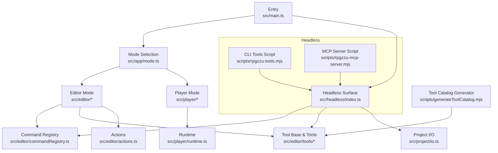
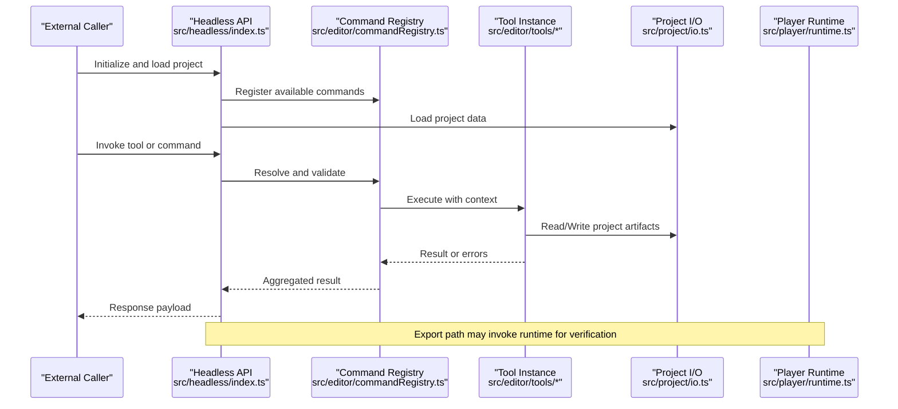
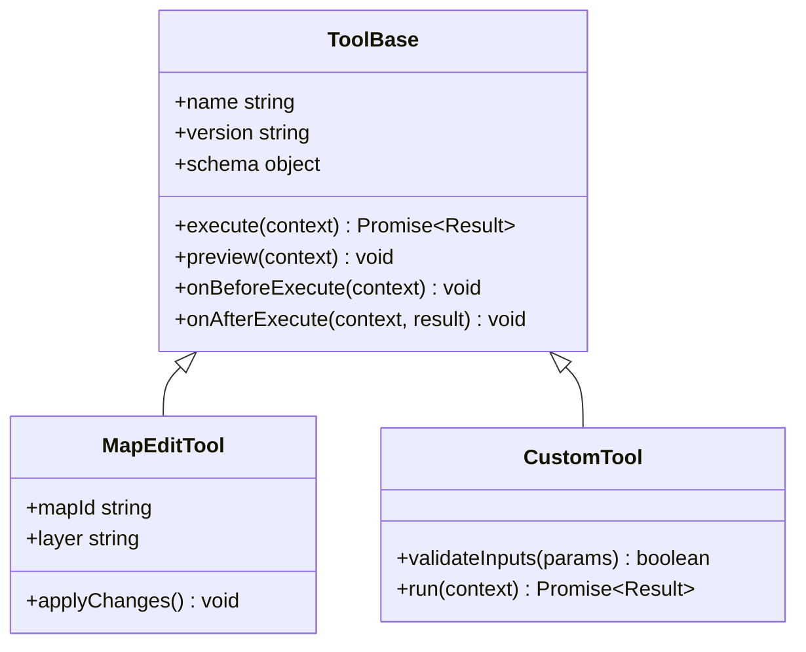
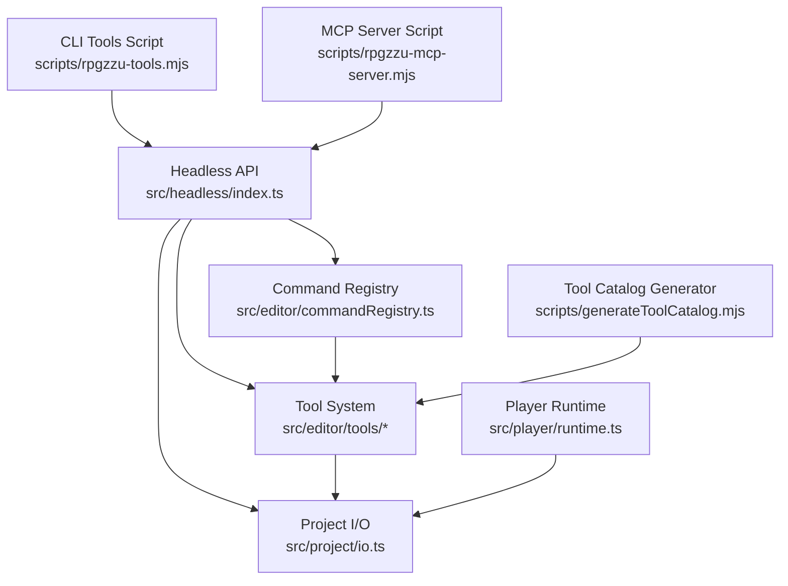

# API Reference

<cite>
**Referenced Files in This Document**
- [src/main.ts](file://src/main.ts)
- [src/app/mode.ts](file://src/app/mode.ts)
- [src/headless/index.ts](file://src/headless/index.ts)
- [src/editor/commandRegistry.ts](file://src/editor/commandRegistry.ts)
- [src/editor/tools/ToolBase.ts](file://src/editor/tools/ToolBase.ts)
- [src/editor/tools/MapEditTool.ts](file://src/editor/tools/MapEditTool.ts)
- [src/editor/actions.ts](file://src/editor/actions.ts)
- [src/project/io.ts](file://src/project/io.ts)
- [src/player/runtime.ts](file://src/player/runtime.ts)
- [scripts/rpgzzu-tools.mjs](file://scripts/rpgzzu-tools.mjs)
- [scripts/rpgzzu-mcp-server.mjs](file://scripts/rpgzzu-mcp-server.mjs)
- [scripts/generateToolCatalog.mjs](file://scripts/generateToolCatalog.mjs)
- [test/toolRegistry.test.ts](file://test/toolRegistry.test.ts)
- [test/headlessTools.test.ts](file://test/headlessTools.test.ts)
- [test/webExport.test.ts](file://test/webExport.test.ts)
</cite>

## Table of Contents
1. [Introduction](#introduction)
2. [Project Structure](#project-structure)
3. [Core Components](#core-components)
4. [Architecture Overview](#architecture-overview)
5. [Detailed Component Analysis](#detailed-component-analysis)
6. [Dependency Analysis](#dependency-analysis)
7. [Performance Considerations](#performance-considerations)
8. [Troubleshooting Guide](#troubleshooting-guide)
9. [Conclusion](#conclusion)
10. [Appendices](#appendices)

## Introduction
This document provides comprehensive API documentation for RPG Maker Zzu’s public interfaces, focusing on:
- Editor API for programmatic access
- Headless mode operations and automation
- Export interfaces for web and runtime targets
- Tool registration system and plugin architecture
- Extension points and integration scenarios
- Method signatures, parameters, return values, and error handling patterns
- Practical examples for automation, custom tool development, and integrations
- API versioning, deprecation policies, and migration guidance

The goal is to enable developers to build tools, automate workflows, and integrate with the editor and headless runtime safely and predictably.

## Project Structure
RPG Maker Zzu organizes its code into clear layers:
- Application entrypoints and modes (editor vs player)
- Headless execution surface for automation
- Editor subsystems (tools, commands, actions)
- Project I/O and persistence
- Player runtime for exported games
- Scripts for CLI and server-based integrations

**Diagram sources**
- [src/main.ts](file://src/main.ts)
- [src/app/mode.ts](file://src/app/mode.ts)
- [src/headless/index.ts](file://src/headless/index.ts)
- [src/editor/commandRegistry.ts](file://src/editor/commandRegistry.ts)
- [src/editor/tools/ToolBase.ts](file://src/editor/tools/ToolBase.ts)
- [src/editor/tools/MapEditTool.ts](file://src/editor/tools/MapEditTool.ts)
- [src/editor/actions.ts](file://src/editor/actions.ts)
- [src/project/io.ts](file://src/project/io.ts)
- [src/player/runtime.ts](file://src/player/runtime.ts)
- [scripts/rpgzzu-tools.mjs](file://scripts/rpgzzu-tools.mjs)
- [scripts/rpgzzu-mcp-server.mjs](file://scripts/rpgzzu-mcp-server.mjs)
- [scripts/generateToolCatalog.mjs](file://scripts/generateToolCatalog.mjs)

**Section sources**
- [src/main.ts](file://src/main.ts)
- [src/app/mode.ts](file://src/app/mode.ts)
- [src/headless/index.ts](file://src/headless/index.ts)
- [src/editor/commandRegistry.ts](file://src/editor/commandRegistry.ts)
- [src/editor/tools/ToolBase.ts](file://src/editor/tools/ToolBase.ts)
- [src/editor/tools/MapEditTool.ts](file://src/editor/tools/MapEditTool.ts)
- [src/editor/actions.ts](file://src/editor/actions.ts)
- [src/project/io.ts](file://src/project/io.ts)
- [src/player/runtime.ts](file://src/player/runtime.ts)
- [scripts/rpgzzu-tools.mjs](file://scripts/rpgzzu-tools.mjs)
- [scripts/rpgzzu-mcp-server.mjs](file://scripts/rpgzzu-mcp-server.mjs)
- [scripts/generateToolCatalog.mjs](file://scripts/generateToolCatalog.mjs)

## Core Components
This section outlines the primary APIs exposed by RPG Maker Zzu for external consumers.

- Headless API
  - Purpose: Programmatic control of the editor without UI, enabling automation and CI pipelines.
  - Entry point: Headless module that initializes the editor environment and exposes a stable interface for project manipulation, tool invocation, and export.
  - Typical usage: Load a project, run tools, save changes, export builds.

- Editor Command Registry
  - Purpose: Central registry for editor commands and actions invoked programmatically or via tools.
  - Responsibilities: Registration, validation, dispatch, and lifecycle hooks for commands.

- Tool System
  - Purpose: Extensible framework for authoring reusable editing utilities.
  - Key concepts: Tool base class, parameter schemas, execution context, preview/rendering, undo/redo integration.

- Project I/O
  - Purpose: Read/write project files, assets, and metadata; manage versions and compatibility.
  - Responsibilities: Serialization, deserialization, migrations, and integrity checks.

- Player Runtime
  - Purpose: Exposes runtime APIs for exported games and tests.
  - Responsibilities: Game loop, event processing, state management, and platform-specific integrations.

- Integration Scripts
  - Purpose: Provide CLI and server-based entry points for automation and MCP-based tool calling.
  - Examples: rpgzzu-tools.mjs for CLI orchestration; rpgzzu-mcp-server.mjs for remote tool invocation.

**Section sources**
- [src/headless/index.ts](file://src/headless/index.ts)
- [src/editor/commandRegistry.ts](file://src/editor/commandRegistry.ts)
- [src/editor/tools/ToolBase.ts](file://src/editor/tools/ToolBase.ts)
- [src/project/io.ts](file://src/project/io.ts)
- [src/player/runtime.ts](file://src/player/runtime.ts)
- [scripts/rpgzzu-tools.mjs](file://scripts/rpgzzu-tools.mjs)
- [scripts/rpgzzu-mcp-server.mjs](file://scripts/rpgzzu-mcp-server.mjs)

## Architecture Overview
The following diagram maps the high-level flow from an external caller through the headless layer into the editor and project I/O, and optionally into the player runtime for exports.

**Diagram sources**
- [src/headless/index.ts](file://src/headless/index.ts)
- [src/editor/commandRegistry.ts](file://src/editor/commandRegistry.ts)
- [src/editor/tools/ToolBase.ts](file://src/editor/tools/ToolBase.ts)
- [src/project/io.ts](file://src/project/io.ts)
- [src/player/runtime.ts](file://src/player/runtime.ts)

## Detailed Component Analysis

### Headless API
The headless API provides a stable surface for automation. It initializes the editor environment, loads projects, executes tools, and returns structured results suitable for scripting and CI.

Key responsibilities:
- Environment initialization and configuration
- Project loading and session management
- Tool invocation and result aggregation
- Error normalization and logging
- Export triggers and artifact handling

Typical workflow:
- Initialize headless session
- Load project by path or identifier
- Run one or more tools in sequence
- Save project and/or export artifacts
- Return status and diagnostics

Error handling:
- Validation errors for inputs
- Filesystem and serialization errors
- Tool execution failures with stack traces
- Graceful shutdown and cleanup

Practical examples:
- Batch process multiple projects
- Generate reports and catalogs
- Automate asset imports and validations

**Section sources**
- [src/headless/index.ts](file://src/headless/index.ts)
- [test/headlessTools.test.ts](file://test/headlessTools.test.ts)

### Editor Command Registry
The command registry centralizes command definitions, validation, and dispatch. It ensures consistent behavior across UI and programmatic calls.

Responsibilities:
- Command registration and schema validation
- Context injection (selection, active map, database)
- Execution pipeline and lifecycle hooks
- Undo/redo integration and history tracking
- Permission and quota enforcement

Common operations:
- Register new commands
- Query available commands
- Execute commands with typed arguments
- Subscribe to command events

Error handling:
- Schema validation failures
- Missing dependencies or resources
- Execution exceptions with contextual info

**Section sources**
- [src/editor/commandRegistry.ts](file://src/editor/commandRegistry.ts)
- [test/toolRegistry.test.ts](file://test/toolRegistry.test.ts)

### Tool System
The tool system enables extensibility through well-defined extension points. Tools encapsulate domain logic for editing tasks and can be composed into pipelines.

Core concepts:
- Tool base class defining lifecycle and contract
- Parameter schema for input validation
- Execution context providing read/write access
- Preview rendering and interactive feedback
- Integration with undo/redo and history

Class relationships:
- ToolBase defines common behavior
- MapEditTool extends base for map-centric operations
- Custom tools extend base to implement specific functionality

**Diagram sources**
- [src/editor/tools/ToolBase.ts](file://src/editor/tools/ToolBase.ts)
- [src/editor/tools/MapEditTool.ts](file://src/editor/tools/MapEditTool.ts)

Execution flow:
- External caller invokes tool via headless API
- Registry resolves tool by name and validates parameters
- Tool executes within context, reading/writing project data
- Results are aggregated and returned to caller

Error handling:
- Input validation errors
- Resource not found or permission denied
- Execution exceptions with detailed diagnostics

**Section sources**
- [src/editor/tools/ToolBase.ts](file://src/editor/tools/ToolBase.ts)
- [src/editor/tools/MapEditTool.ts](file://src/editor/tools/MapEditTool.ts)
- [test/toolRegistry.test.ts](file://test/toolRegistry.test.ts)

### Actions Layer
Actions provide higher-level operations that compose multiple commands and tools. They simplify complex workflows and ensure consistency.

Responsibilities:
- Compose multi-step operations
- Manage transactional semantics
- Provide user-friendly operation names
- Integrate with undo/redo and history

Common actions:
- Import assets and update references
- Rebuild derived resources
- Validate project integrity

**Section sources**
- [src/editor/actions.ts](file://src/editor/actions.ts)

### Project I/O
Project I/O handles serialization, deserialization, and migration of project data. It ensures compatibility across versions and robustness against malformed inputs.

Responsibilities:
- Read/write project files and assets
- Version detection and migration
- Integrity checks and repair helpers
- Export packaging and artifact generation

Export interfaces:
- Web export for browser deployment
- Runtime verification for exported builds

Error handling:
- Corrupted file recovery
- Migration failures with rollback
- Asset resolution errors

**Section sources**
- [src/project/io.ts](file://src/project/io.ts)
- [test/webExport.test.ts](file://test/webExport.test.ts)

### Player Runtime
The player runtime powers exported games and supports testing and verification of builds.

Responsibilities:
- Game loop and event processing
- State synchronization and persistence
- Platform-specific integrations (audio, graphics)
- Diagnostics and profiling hooks

Integration points:
- Headless verification of exported content
- Automated playtesting and assertions

**Section sources**
- [src/player/runtime.ts](file://src/player/runtime.ts)

### Integration Scripts
Scripts provide convenient entry points for automation and remote tool invocation.

- CLI Tools Script
  - Orchestrates batch operations
  - Invokes headless API and tools
  - Produces logs and artifacts

- MCP Server Script
  - Exposes tools over a protocol for remote clients
  - Supports dynamic tool discovery and execution
  - Integrates with agent frameworks

- Tool Catalog Generator
  - Scans registered tools and generates documentation/catalog
  - Ensures schema consistency and availability

**Section sources**
- [scripts/rpgzzu-tools.mjs](file://scripts/rpgzzu-tools.mjs)
- [scripts/rpgzzu-mcp-server.mjs](file://scripts/rpgzzu-mcp-server.mjs)
- [scripts/generateToolCatalog.mjs](file://scripts/generateToolCatalog.mjs)

## Dependency Analysis
The following diagram highlights key dependencies between components and scripts.

**Diagram sources**
- [src/headless/index.ts](file://src/headless/index.ts)
- [src/editor/commandRegistry.ts](file://src/editor/commandRegistry.ts)
- [src/editor/tools/ToolBase.ts](file://src/editor/tools/ToolBase.ts)
- [src/project/io.ts](file://src/project/io.ts)
- [scripts/rpgzzu-tools.mjs](file://scripts/rpgzzu-tools.mjs)
- [scripts/rpgzzu-mcp-server.mjs](file://scripts/rpgzzu-mcp-server.mjs)
- [scripts/generateToolCatalog.mjs](file://scripts/generateToolCatalog.mjs)
- [src/player/runtime.ts](file://src/player/runtime.ts)

**Section sources**
- [src/headless/index.ts](file://src/headless/index.ts)
- [src/editor/commandRegistry.ts](file://src/editor/commandRegistry.ts)
- [src/editor/tools/ToolBase.ts](file://src/editor/tools/ToolBase.ts)
- [src/project/io.ts](file://src/project/io.ts)
- [scripts/rpgzzu-tools.mjs](file://scripts/rpgzzu-tools.mjs)
- [scripts/rpgzzu-mcp-server.mjs](file://scripts/rpgzzu-mcp-server.mjs)
- [scripts/generateToolCatalog.mjs](file://scripts/generateToolCatalog.mjs)
- [src/player/runtime.ts](file://src/player/runtime.ts)

## Performance Considerations
- Prefer batch operations to minimize I/O overhead when processing multiple projects or assets.
- Use tool schemas to validate inputs early and avoid expensive rework.
- Leverage caching where appropriate for repeated lookups (e.g., resource manifests).
- Profile long-running tools and consider streaming large outputs.
- Avoid blocking the main thread in headless mode; use asynchronous patterns consistently.

[No sources needed since this section provides general guidance]

## Troubleshooting Guide
Common issues and resolutions:
- Initialization failures in headless mode
  - Check environment variables and paths
  - Verify project accessibility and permissions
- Tool execution errors
  - Validate input schemas and required fields
  - Inspect logs for stack traces and context
- Project I/O problems
  - Confirm file integrity and version compatibility
  - Use migration helpers to repair corrupted data
- Export failures
  - Validate asset references and dependencies
  - Review runtime verification logs

Diagnostic utilities:
- Headless test suite for smoke testing
- Tool registry tests for registration and validation
- Web export tests for build correctness

**Section sources**
- [test/headlessTools.test.ts](file://test/headlessTools.test.ts)
- [test/toolRegistry.test.ts](file://test/toolRegistry.test.ts)
- [test/webExport.test.ts](file://test/webExport.test.ts)

## Conclusion
RPG Maker Zzu exposes a robust set of APIs for programmatic editor access, headless automation, and export workflows. The tool registration system and plugin architecture enable extensibility while maintaining consistency and safety. By adhering to the documented contracts and error handling patterns, developers can build reliable integrations and automation pipelines.

[No sources needed since this section summarizes without analyzing specific files]

## Appendices

### API Versioning and Deprecation Policy
- Versioning strategy:
  - Stable public interfaces are versioned to prevent breaking changes.
  - Minor updates add features without altering existing contracts.
  - Major updates introduce breaking changes with migration guides.
- Deprecation policy:
  - Deprecated APIs remain supported for at least one major version.
  - Clear warnings and migration steps are provided.
- Migration guidance:
  - Update tool schemas and parameter names as indicated.
  - Replace deprecated methods with recommended alternatives.
  - Run catalog generator to verify updated tool definitions.

[No sources needed since this section provides general guidance]

### Practical Automation Examples
- Batch project processing:
  - Iterate over project directories
  - Load each project via headless API
  - Run validation and repair tools
  - Save and export artifacts
- Custom tool development:
  - Extend ToolBase with domain-specific logic
  - Define parameter schemas for validation
  - Integrate with undo/redo and history
  - Test using tool registry tests
- Integration scenarios:
  - Use CLI script to orchestrate multi-step workflows
  - Expose tools via MCP server for remote clients
  - Generate tool catalogs for documentation and discovery

[No sources needed since this section provides general guidance]