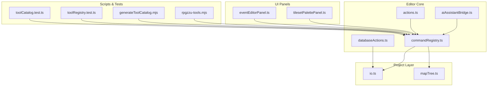
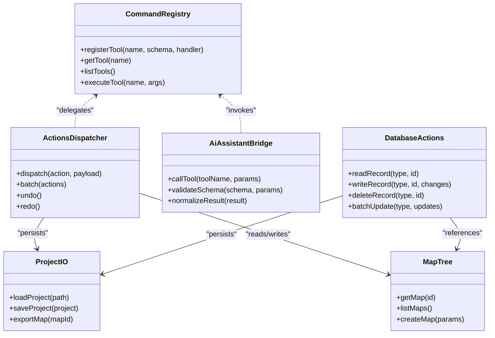
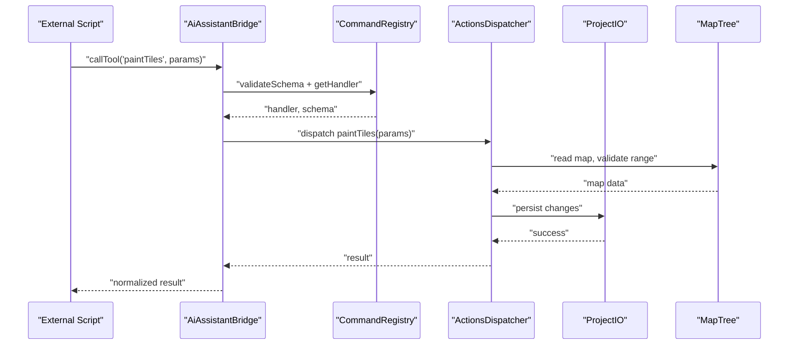
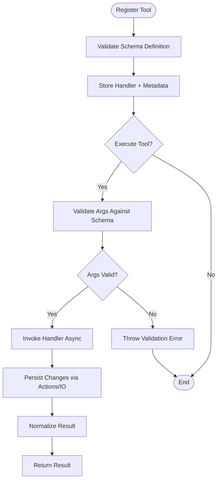
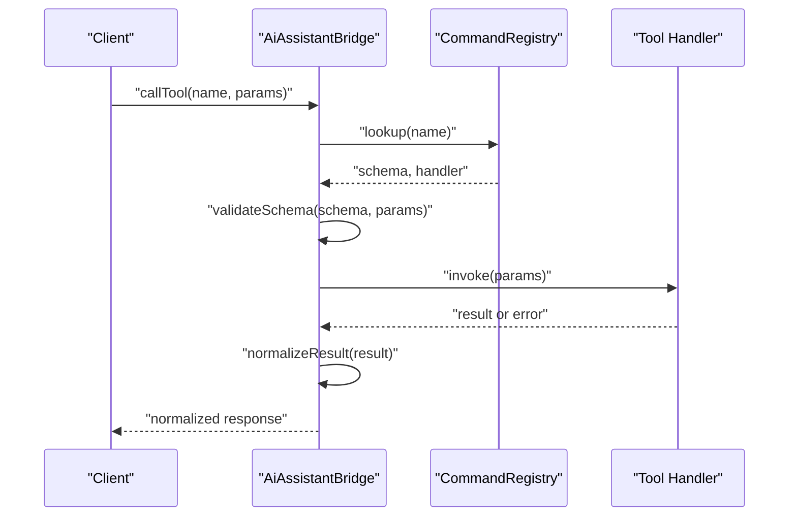
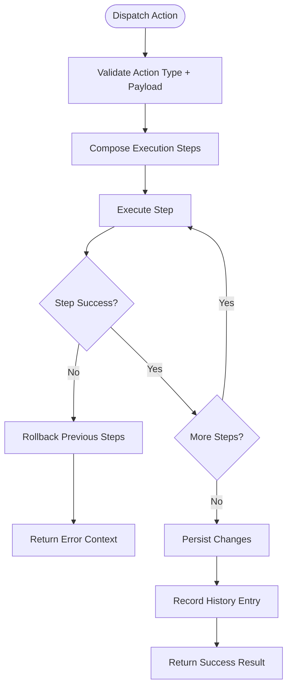
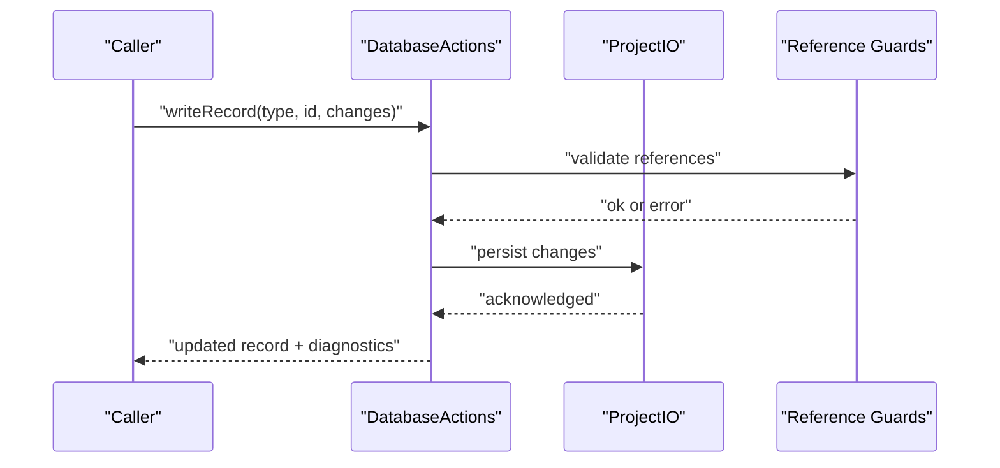
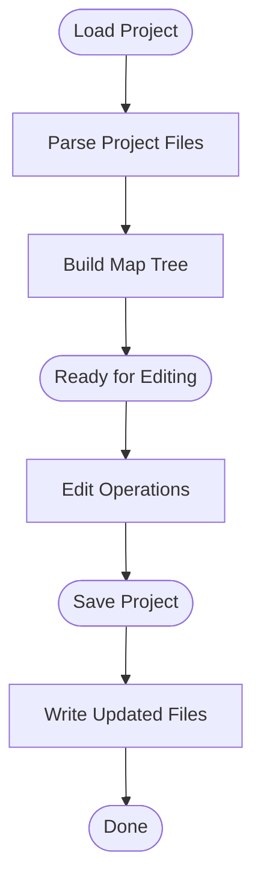
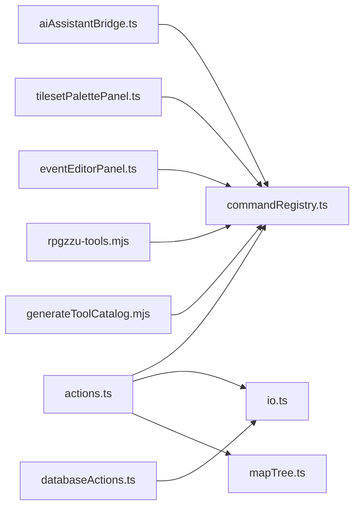

# Editor API

<cite>
**Referenced Files in This Document**
- [src/editor/tools/commandRegistry.ts](file://src/editor/tools/commandRegistry.ts)
- [src/editor/tools/toolCatalog.ts](file://src/editor/tools/toolCatalog.ts)
- [src/editor/aiAssistantBridge.ts](file://src/editor/aiAssistantBridge.ts)
- [src/editor/actions.ts](file://src/editor/actions.ts)
- [src/editor/databaseActions.ts](file://src/editor/databaseActions.ts)
- [src/project/io.ts](file://src/project/io.ts)
- [src/project/mapTree.ts](file://src/project/mapTree.ts)
- [src/editor/panels/tilesetPalettePanel.ts](file://src/editor/panels/tilesetPalettePanel.ts)
- [src/editor/panels/eventEditorPanel.ts](file://src/editor/panels/eventEditorPanel.ts)
- [scripts/rpgzzu-tools.mjs](file://scripts/rpgzzu-tools.mjs)
- [scripts/generateToolCatalog.mjs](file://scripts/generateToolCatalog.mjs)
- [test/toolRegistry.test.ts](file://test/toolRegistry.test.ts)
- [test/toolCatalog.test.ts](file://test/toolCatalog.test.ts)
</cite>

## Table of Contents
1. [Introduction](#introduction)
2. [Project Structure](#project-structure)
3. [Core Components](#core-components)
4. [Architecture Overview](#architecture-overview)
5. [Detailed Component Analysis](#detailed-component-analysis)
6. [Dependency Analysis](#dependency-analysis)
7. [Performance Considerations](#performance-considerations)
8. [Troubleshooting Guide](#troubleshooting-guide)
9. [Conclusion](#conclusion)
10. [Appendices](#appendices)

## Introduction
This document describes the programmatic Editor API exposed by RPG Maker Zzu for extending and automating editor functionality. It focuses on:
- Map editing operations (tile painting, event creation, region management)
- Database operations (records, references, validation)
- Asset management (resource resolution, tilesets, previews)
- Project manipulation (loading, saving, map tree navigation)
- Tool registration system with method signatures, parameter validation, and return value specifications
- Error handling patterns, async/await usage, and performance considerations
- Integration examples for custom tools and external scripts that extend editor capabilities

The goal is to enable authors and automation pipelines to interact with the editor programmatically through a stable, typed interface.

## Project Structure
The Editor API surface is primarily implemented under src/editor and integrates with project data via src/project. Key areas include:
- Tool registration and cataloging
- Bridge layer for AI assistant tool calls
- Action dispatchers for editor commands
- Database action helpers
- I/O and map tree utilities
- Panel integrations for UI-driven workflows

**Diagram sources**
- [src/editor/tools/commandRegistry.ts](file://src/editor/tools/commandRegistry.ts)
- [src/editor/actions.ts](file://src/editor/actions.ts)
- [src/editor/aiAssistantBridge.ts](file://src/editor/aiAssistantBridge.ts)
- [src/editor/databaseActions.ts](file://src/editor/databaseActions.ts)
- [src/project/io.ts](file://src/project/io.ts)
- [src/project/mapTree.ts](file://src/project/mapTree.ts)
- [src/editor/panels/tilesetPalettePanel.ts](file://src/editor/panels/tilesetPalettePanel.ts)
- [src/editor/panels/eventEditorPanel.ts](file://src/editor/panels/eventEditorPanel.ts)
- [scripts/rpgzzu-tools.mjs](file://scripts/rpgzzu-tools.mjs)
- [scripts/generateToolCatalog.mjs](file://scripts/generateToolCatalog.mjs)
- [test/toolRegistry.test.ts](file://test/toolRegistry.test.ts)
- [test/toolCatalog.test.ts](file://test/toolCatalog.test.ts)

**Section sources**
- [src/editor/tools/commandRegistry.ts](file://src/editor/tools/commandRegistry.ts)
- [src/editor/actions.ts](file://src/editor/actions.ts)
- [src/editor/aiAssistantBridge.ts](file://src/editor/aiAssistantBridge.ts)
- [src/editor/databaseActions.ts](file://src/editor/databaseActions.ts)
- [src/project/io.ts](file://src/project/io.ts)
- [src/project/mapTree.ts](file://src/project/mapTree.ts)
- [src/editor/panels/tilesetPalettePanel.ts](file://src/editor/panels/tilesetPalettePanel.ts)
- [src/editor/panels/eventEditorPanel.ts](file://src/editor/panels/eventEditorPanel.ts)
- [scripts/rpgzzu-tools.mjs](file://scripts/rpgzzu-tools.mjs)
- [scripts/generateToolCatalog.mjs](file://scripts/generateToolCatalog.mjs)
- [test/toolRegistry.test.ts](file://test/toolRegistry.test.ts)
- [test/toolCatalog.test.ts](file://test/toolCatalog.test.ts)

## Core Components
- Command Registry: Central registry for tool definitions, schemas, and execution. Provides registration, discovery, and invocation APIs used by both UI panels and external scripts.
- Actions Dispatcher: High-level command dispatcher that coordinates multi-step editor actions and integrates with undo/redo history.
- AI Assistant Bridge: Adapter layer that translates assistant tool calls into registered editor commands with schema validation and result normalization.
- Database Actions: Helpers for reading/writing database records, managing references, and performing batch updates with validation.
- Project I/O and Map Tree: Utilities for loading/saving projects, navigating maps, and accessing map metadata and resources.
- Panel Integrations: UI panels (tileset palette, event editor) that expose programmatic entry points for common authoring tasks.

Key responsibilities and interactions are illustrated below.

**Diagram sources**
- [src/editor/tools/commandRegistry.ts](file://src/editor/tools/commandRegistry.ts)
- [src/editor/actions.ts](file://src/editor/actions.ts)
- [src/editor/aiAssistantBridge.ts](file://src/editor/aiAssistantBridge.ts)
- [src/editor/databaseActions.ts](file://src/editor/databaseActions.ts)
- [src/project/io.ts](file://src/project/io.ts)
- [src/project/mapTree.ts](file://src/project/mapTree.ts)

**Section sources**
- [src/editor/tools/commandRegistry.ts](file://src/editor/tools/commandRegistry.ts)
- [src/editor/actions.ts](file://src/editor/actions.ts)
- [src/editor/aiAssistantBridge.ts](file://src/editor/aiAssistantBridge.ts)
- [src/editor/databaseActions.ts](file://src/editor/databaseActions.ts)
- [src/project/io.ts](file://src/project/io.ts)
- [src/project/mapTree.ts](file://src/project/mapTree.ts)

## Architecture Overview
The Editor API follows a layered architecture:
- Presentation Layer: UI panels and external scripts call into the API.
- Command Layer: Registered tools define declarative schemas and handlers.
- Action Layer: Multi-step operations are composed and persisted.
- Data Layer: Project I/O and map tree provide access to persistent state.

**Diagram sources**
- [src/editor/aiAssistantBridge.ts](file://src/editor/aiAssistantBridge.ts)
- [src/editor/tools/commandRegistry.ts](file://src/editor/tools/commandRegistry.ts)
- [src/editor/actions.ts](file://src/editor/actions.ts)
- [src/project/io.ts](file://src/project/io.ts)
- [src/project/mapTree.ts](file://src/project/mapTree.ts)

## Detailed Component Analysis

### Tool Registration System
The tool registration system provides a declarative way to define editor commands with typed parameters and structured results.

- Registration API
  - registerTool(name, schema, handler): Registers a new tool with a JSON Schema-like definition and an asynchronous handler.
  - getTool(name): Retrieves tool metadata and handler reference.
  - listTools(): Returns all registered tools and their schemas.
  - executeTool(name, args): Executes a tool after validating arguments against its schema.

- Parameter Validation
  - Schemas enforce required fields, types, ranges, and constraints.
  - Invalid inputs raise descriptive errors with field paths and messages.

- Return Values
  - Handlers return normalized results including status, affected counts, and optional diagnostics.
  - Errors are wrapped with context for debugging and user feedback.

- Examples
  - Bulk tile operations: Define a tool that accepts a map ID, tileset ID, and rectangle; validates bounds; applies tiles across cells; returns counts and error summary.
  - Event creation: Define a tool that creates events with pages and commands; validates references to actors, items, and switches; persists changes.
  - Database record management: Define a tool that reads/writes/deletes records; enforces referential integrity; supports batch updates.

**Diagram sources**
- [src/editor/tools/commandRegistry.ts](file://src/editor/tools/commandRegistry.ts)
- [src/editor/actions.ts](file://src/editor/actions.ts)
- [src/project/io.ts](file://src/project/io.ts)

**Section sources**
- [src/editor/tools/commandRegistry.ts](file://src/editor/tools/commandRegistry.ts)
- [test/toolRegistry.test.ts](file://test/toolRegistry.test.ts)

### AI Assistant Bridge
The bridge adapts assistant tool calls into editor commands:
- callTool(toolName, params): Validates parameters using the tool’s schema, invokes the handler, and normalizes results.
- validateSchema(schema, params): Performs strict type and constraint checks.
- normalizeResult(result): Ensures consistent output structure for consumers.

**Diagram sources**
- [src/editor/aiAssistantBridge.ts](file://src/editor/aiAssistantBridge.ts)
- [src/editor/tools/commandRegistry.ts](file://src/editor/tools/commandRegistry.ts)

**Section sources**
- [src/editor/aiAssistantBridge.ts](file://src/editor/aiAssistantBridge.ts)

### Actions Dispatcher
The dispatcher composes multi-step operations and integrates with persistence:
- dispatch(action, payload): Executes a single action with validation and side effects.
- batch(actions): Executes multiple actions atomically where possible, with rollback on failure.
- undo()/redo(): Supports history navigation for editor changes.

**Diagram sources**
- [src/editor/actions.ts](file://src/editor/actions.ts)
- [src/project/io.ts](file://src/project/io.ts)

**Section sources**
- [src/editor/actions.ts](file://src/editor/actions.ts)

### Database Actions
Database helpers provide safe CRUD operations and batch updates:
- readRecord(type, id): Fetches a record by type and ID with reference guards.
- writeRecord(type, id, changes): Applies partial updates with validation and dependency checks.
- deleteRecord(type, id): Removes a record while ensuring no dangling references.
- batchUpdate(type, updates): Applies multiple updates efficiently, returning success/failure summaries.

**Diagram sources**
- [src/editor/databaseActions.ts](file://src/editor/databaseActions.ts)
- [src/project/io.ts](file://src/project/io.ts)

**Section sources**
- [src/editor/databaseActions.ts](file://src/editor/databaseActions.ts)

### Project I/O and Map Tree
Utilities for project and map operations:
- loadProject(path), saveProject(project), exportMap(mapId): Manage project lifecycle and exports.
- getMap(id), listMaps(), createMap(params): Navigate and manipulate map structures.

**Diagram sources**
- [src/project/io.ts](file://src/project/io.ts)
- [src/project/mapTree.ts](file://src/project/mapTree.ts)

**Section sources**
- [src/project/io.ts](file://src/project/io.ts)
- [src/project/mapTree.ts](file://src/project/mapTree.ts)

### Panel Integrations
UI panels expose programmatic entry points for common tasks:
- Tileset Palette Panel: Selects tilesets, previews tiles, and triggers paint operations.
- Event Editor Panel: Creates and edits events, manages pages and commands.

These panels integrate with the command registry and actions dispatcher to ensure consistency between UI and script-driven workflows.

**Section sources**
- [src/editor/panels/tilesetPalettePanel.ts](file://src/editor/panels/tilesetPalettePanel.ts)
- [src/editor/panels/eventEditorPanel.ts](file://src/editor/panels/eventEditorPanel.ts)

### External Scripts and Tool Catalog Generation
External scripts can leverage the Editor API to automate tasks:
- rpgzzu-tools.mjs: Example script demonstrating tool invocation and batch operations.
- generateToolCatalog.mjs: Generates a catalog of available tools and schemas for documentation and discovery.

**Section sources**
- [scripts/rpgzzu-tools.mjs](file://scripts/rpgzzu-tools.mjs)
- [scripts/generateToolCatalog.mjs](file://scripts/generateToolCatalog.mjs)

## Dependency Analysis
The following diagram shows key dependencies among core components:

**Diagram sources**
- [src/editor/aiAssistantBridge.ts](file://src/editor/aiAssistantBridge.ts)
- [src/editor/tools/commandRegistry.ts](file://src/editor/tools/commandRegistry.ts)
- [src/editor/actions.ts](file://src/editor/actions.ts)
- [src/editor/databaseActions.ts](file://src/editor/databaseActions.ts)
- [src/project/io.ts](file://src/project/io.ts)
- [src/project/mapTree.ts](file://src/project/mapTree.ts)
- [src/editor/panels/tilesetPalettePanel.ts](file://src/editor/panels/tilesetPalettePanel.ts)
- [src/editor/panels/eventEditorPanel.ts](file://src/editor/panels/eventEditorPanel.ts)
- [scripts/rpgzzu-tools.mjs](file://scripts/rpgzzu-tools.mjs)
- [scripts/generateToolCatalog.mjs](file://scripts/generateToolCatalog.mjs)

**Section sources**
- [src/editor/aiAssistantBridge.ts](file://src/editor/aiAssistantBridge.ts)
- [src/editor/tools/commandRegistry.ts](file://src/editor/tools/commandRegistry.ts)
- [src/editor/actions.ts](file://src/editor/actions.ts)
- [src/editor/databaseActions.ts](file://src/editor/databaseActions.ts)
- [src/project/io.ts](file://src/project/io.ts)
- [src/project/mapTree.ts](file://src/project/mapTree.ts)
- [src/editor/panels/tilesetPalettePanel.ts](file://src/editor/panels/tilesetPalettePanel.ts)
- [src/editor/panels/eventEditorPanel.ts](file://src/editor/panels/eventEditorPanel.ts)
- [scripts/rpgzzu-tools.mjs](file://scripts/rpgzzu-tools.mjs)
- [scripts/generateToolCatalog.mjs](file://scripts/generateToolCatalog.mjs)

## Performance Considerations
- Batch operations: Prefer batch updates for large-scale changes to reduce I/O overhead and improve transactional consistency.
- Schema validation: Keep schemas minimal and focused to avoid excessive validation cost during high-frequency calls.
- Undo/redo history: Limit history granularity for bulk operations; consider disabling history temporarily for massive writes and re-enabling afterward.
- Caching: Use panel caches and resource resolvers to minimize repeated asset lookups.
- Async patterns: Use async/await consistently; avoid blocking the main thread with synchronous loops over large datasets.

[No sources needed since this section provides general guidance]

## Troubleshooting Guide
Common issues and resolutions:
- Validation errors: Check parameter schemas for required fields and constraints; inspect error messages for field paths.
- Reference integrity failures: Ensure referenced IDs exist and are compatible with the target record type.
- Persistence failures: Verify project path permissions and file formats; check I/O logs for detailed stack traces.
- Performance regressions: Profile batch operations; split large tasks into smaller chunks and monitor memory usage.

**Section sources**
- [test/toolRegistry.test.ts](file://test/toolRegistry.test.ts)
- [test/toolCatalog.test.ts](file://test/toolCatalog.test.ts)

## Conclusion
The RPG Maker Zzu Editor API provides a robust, typed interface for programmatic editor automation. By leveraging the tool registration system, actions dispatcher, and database helpers, authors and scripts can perform complex map edits, manage assets, and manipulate project data safely and efficiently. Adhering to best practices for batching, validation, and async patterns ensures reliable and performant integrations.

[No sources needed since this section summarizes without analyzing specific files]

## Appendices

### Common Automation Tasks

- Bulk Tile Operations
  - Define a tool accepting map ID, tileset ID, and rectangle.
  - Validate bounds and tileset compatibility.
  - Apply tiles across cells and return counts and error summaries.

- Event Creation
  - Define a tool to create events with pages and commands.
  - Validate references to actors, items, and switches.
  - Persist changes and return created event IDs.

- Database Record Management
  - Define tools for read/write/delete/batch update.
  - Enforce referential integrity and return diagnostics.

[No sources needed since this section provides conceptual guidance]

### Integration Examples

- External Script Invocation
  - Use rpgzzu-tools.mjs as a template for calling registered tools and processing results.

- Tool Catalog Generation
  - Use generateToolCatalog.mjs to enumerate available tools and schemas for documentation and discovery.

**Section sources**
- [scripts/rpgzzu-tools.mjs](file://scripts/rpgzzu-tools.mjs)
- [scripts/generateToolCatalog.mjs](file://scripts/generateToolCatalog.mjs)