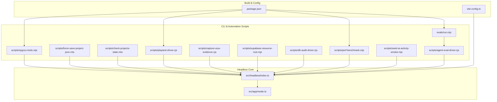
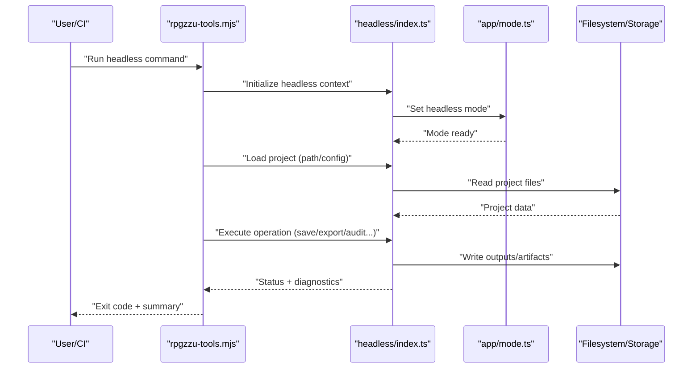
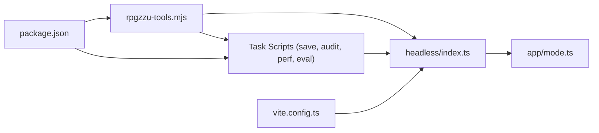

# Headless Mode API

<cite>
**Referenced Files in This Document**
- [src/headless/index.ts](file://src/headless/index.ts)
- [src/app/mode.ts](file://src/app/mode.ts)
- [scripts/rpgzzu-tools.mjs](file://scripts/rpgzzu-tools.mjs)
- [scripts/force-save-project-json.mts](file://scripts/force-save-project-json.mts)
- [scripts/check-projects-state.mts](file://scripts/check-projects-state.mts)
- [scripts/playtest-driver.cjs](file://scripts/playtest-driver.cjs)
- [scripts/capture-uiux-evidence.cjs](file://scripts/capture-uiux-evidence.cjs)
- [scripts/supabase-resource-root.mjs](file://scripts/supabase-resource-root.mjs)
- [scripts/db-audit-driver.cjs](file://scripts/db-audit-driver.cjs)
- [scripts/perf-benchmark.mjs](file://scripts/perf-benchmark.mjs)
- [scripts/seed-ai-activity-smoke.mjs](file://scripts/seed-ai-activity-smoke.mjs)
- [scripts/agent-eval-driver.cjs](file://scripts/agent-eval-driver.cjs)
- [evals/run.mjs](file://evals/run.mjs)
- [package.json](file://package.json)
- [vite.config.ts](file://vite.config.ts)
</cite>

## Table of Contents
1. [Introduction](#introduction)
2. [Project Structure](#project-structure)
3. [Core Components](#core-components)
4. [Architecture Overview](#architecture-overview)
5. [Detailed Component Analysis](#detailed-component-analysis)
6. [Dependency Analysis](#dependency-analysis)
7. [Performance Considerations](#performance-considerations)
8. [Troubleshooting Guide](#troubleshooting-guide)
9. [Conclusion](#conclusion)
10. [Appendices](#appendices)

## Introduction
This document describes the headless mode interface for RPG Maker Zzu, focusing on command-line execution, batch processing, and automated build pipelines. It covers project import/export operations, asset generation workflows, quality assurance scripting, CI/CD integration patterns, automated testing scenarios, mass content generation tasks, configuration options, environment variables, and error reporting mechanisms. The goal is to enable reliable automation without a graphical editor.

## Project Structure
The headless capability centers around a dedicated module that exposes programmatic APIs and CLI entry points. Supporting scripts demonstrate common automation patterns such as saving projects, running playtests, capturing UI evidence, auditing databases, benchmarking performance, seeding data, and orchestrating evaluation suites. Build tooling and package scripts provide hooks for CI/CD integration.

**Diagram sources**
- [src/headless/index.ts](file://src/headless/index.ts)
- [src/app/mode.ts](file://src/app/mode.ts)
- [scripts/rpgzzu-tools.mjs](file://scripts/rpgzzu-tools.mjs)
- [scripts/force-save-project-json.mts](file://scripts/force-save-project-json.mts)
- [scripts/check-projects-state.mts](file://scripts/check-projects-state.mts)
- [scripts/playtest-driver.cjs](file://scripts/playtest-driver.cjs)
- [scripts/capture-uiux-evidence.cjs](file://scripts/capture-uiux-evidence.cjs)
- [scripts/supabase-resource-root.mjs](file://scripts/supabase-resource-root.mjs)
- [scripts/db-audit-driver.cjs](file://scripts/db-audit-driver.cjs)
- [scripts/perf-benchmark.mjs](file://scripts/perf-benchmark.mjs)
- [scripts/seed-ai-activity-smoke.mjs](file://scripts/seed-ai-activity-smoke.mjs)
- [scripts/agent-eval-driver.cjs](file://scripts/agent-eval-driver.cjs)
- [evals/run.mjs](file://evals/run.mjs)
- [package.json](file://package.json)
- [vite.config.ts](file://vite.config.ts)

**Section sources**
- [src/headless/index.ts](file://src/headless/index.ts)
- [src/app/mode.ts](file://src/app/mode.ts)
- [scripts/rpgzzu-tools.mjs](file://scripts/rpgzzu-tools.mjs)
- [package.json](file://package.json)
- [vite.config.ts](file://vite.config.ts)

## Core Components
- Headless entrypoint: Provides the primary API surface for non-interactive execution, including project loading, manipulation, and persistence.
- Mode control: Centralizes runtime mode detection and transitions (e.g., headless vs. editor), ensuring consistent initialization paths.
- CLI orchestration: A thin CLI wrapper that parses arguments and delegates to headless APIs for repeatable operations.
- Automation scripts: Focused utilities demonstrating real-world usage patterns for save/export, audit, benchmarking, and evaluation.

Key responsibilities:
- Initialize the engine in headless mode with minimal dependencies.
- Load target projects from disk or remote storage.
- Execute domain operations (import/export, asset generation, QA checks).
- Persist results and artifacts deterministically.
- Report structured logs and exit codes for CI consumption.

**Section sources**
- [src/headless/index.ts](file://src/headless/index.ts)
- [src/app/mode.ts](file://src/app/mode.ts)
- [scripts/rpgzzu-tools.mjs](file://scripts/rpgzzu-tools.mjs)

## Architecture Overview
The headless architecture separates concerns between core APIs, CLI orchestration, and task-specific scripts. The CLI layer translates user commands into function calls against the headless API. Task scripts compose these calls to implement higher-level workflows like batch saves, audits, and evaluations. Build tooling integrates these scripts via npm/pnpm scripts for CI/CD.

**Diagram sources**
- [scripts/rpgzzu-tools.mjs](file://scripts/rpgzzu-tools.mjs)
- [src/headless/index.ts](file://src/headless/index.ts)
- [src/app/mode.ts](file://src/app/mode.ts)

## Detailed Component Analysis

### Headless Entry Point
Purpose:
- Expose programmatic functions for project lifecycle management and domain operations.
- Provide deterministic initialization suitable for automation.

Typical capabilities:
- Initialize headless runtime.
- Load project by path or identifier.
- Perform operations such as export, validation, transformation, and artifact generation.
- Persist outputs and return structured results.

Usage patterns:
- Direct imports in Node-based scripts.
- Invocation through CLI wrappers.

**Section sources**
- [src/headless/index.ts](file://src/headless/index.ts)

### Mode Control
Purpose:
- Detect and enforce headless execution constraints.
- Ensure consistent initialization across tools and scripts.

Responsibilities:
- Set runtime flags indicating headless mode.
- Disable interactive prompts and UI-dependent features.
- Provide safe defaults for non-interactive environments.

**Section sources**
- [src/app/mode.ts](file://src/app/mode.ts)

### CLI Orchestration (rpgzzu-tools.mjs)
Purpose:
- Parse command-line arguments and route them to headless APIs.
- Standardize logging, error handling, and exit codes.

Common flows:
- Command parsing and validation.
- Context initialization via headless API.
- Execution of requested operations.
- Reporting results and returning appropriate exit codes.

**Section sources**
- [scripts/rpgzzu-tools.mjs](file://scripts/rpgzzu-tools.mjs)

### Save and Export Utilities
Examples:
- Force-saving project JSON to ensure consistency and portability.
- Checking project state for integrity before further processing.

Use cases:
- Pre/post-build normalization.
- Snapshotting project state for audits or rollbacks.

**Section sources**
- [scripts/force-save-project-json.mts](file://scripts/force-save-project-json.mts)
- [scripts/check-projects-state.mts](file://scripts/check-projects-state.mts)

### Playtesting and Evidence Capture
Examples:
- Automated playtest driver to run scripted sessions and collect outcomes.
- UI/UX evidence capture for regression checks and visual diffs.

Use cases:
- Continuous verification of gameplay logic and UI behavior.
- Regression detection via screenshots or structured metrics.

**Section sources**
- [scripts/playtest-driver.cjs](file://scripts/playtest-driver.cjs)
- [scripts/capture-uiux-evidence.cjs](file://scripts/capture-uiux-evidence.cjs)

### Resource Root and Sync
Example:
- Managing resource roots and syncing assets to external storage (e.g., Supabase).

Use cases:
- Centralized asset distribution.
- Versioned asset catalogs for reproducible builds.

**Section sources**
- [scripts/supabase-resource-root.mjs](file://scripts/supabase-resource-root.mjs)

### Database Audit Driver
Example:
- Running database integrity checks and generating reports.

Use cases:
- Schema validation.
- Cross-reference integrity and orphan detection.

**Section sources**
- [scripts/db-audit-driver.cjs](file://scripts/db-audit-driver.cjs)

### Performance Benchmarking
Example:
- Measuring load times, memory usage, and throughput under headless conditions.

Use cases:
- Baseline comparisons across versions.
- Performance regression gates in CI.

**Section sources**
- [scripts/perf-benchmark.mjs](file://scripts/perf-benchmark.mjs)

### Evaluation and Smoke Testing
Examples:
- Seeding AI activity for smoke tests.
- Orchestrating agent evaluation runs.
- Running evaluation suites via a central runner.

Use cases:
- Automated quality gates.
- Scenario coverage and stability checks.

**Section sources**
- [scripts/seed-ai-activity-smoke.mjs](file://scripts/seed-ai-activity-smoke.mjs)
- [scripts/agent-eval-driver.cjs](file://scripts/agent-eval-driver.cjs)
- [evals/run.mjs](file://evals/run.mjs)

## Dependency Analysis
The headless system depends on:
- Runtime mode control for consistent initialization.
- Filesystem and optional remote storage for project and asset I/O.
- Build tooling (Vite) for bundling and environment setup.
- Package scripts for standardized invocation in CI.

**Diagram sources**
- [scripts/rpgzzu-tools.mjs](file://scripts/rpgzzu-tools.mjs)
- [src/headless/index.ts](file://src/headless/index.ts)
- [src/app/mode.ts](file://src/app/mode.ts)
- [vite.config.ts](file://vite.config.ts)
- [package.json](file://package.json)

**Section sources**
- [scripts/rpgzzu-tools.mjs](file://scripts/rpgzzu-tools.mjs)
- [src/headless/index.ts](file://src/headless/index.ts)
- [src/app/mode.ts](file://src/app/mode.ts)
- [vite.config.ts](file://vite.config.ts)
- [package.json](file://package.json)

## Performance Considerations
- Prefer headless-only initialization paths to minimize overhead.
- Cache heavy computations where possible and reuse contexts across tasks.
- Stream large outputs to avoid excessive memory pressure.
- Use deterministic seeds for randomized processes to improve reproducibility.
- Profile critical paths using the provided benchmarking script and compare baselines.

[No sources needed since this section provides general guidance]

## Troubleshooting Guide
Common issues and resolutions:
- Missing environment variables: Ensure required keys are set for remote storage and authentication.
- Permission errors: Verify read/write access to project directories and output folders.
- Exit codes: Inspect CLI and script exit codes to identify failure categories (validation, I/O, runtime).
- Logs: Enable verbose logging in headless mode to capture detailed diagnostics.
- Determinism: For reproducible results, pin versions and use fixed seeds.

Operational tips:
- Run lightweight smoke checks first (e.g., project state check).
- Isolate failing tasks by running individual scripts directly.
- Compare outputs against known-good artifacts to detect regressions.

**Section sources**
- [scripts/rpgzzu-tools.mjs](file://scripts/rpgzzu-tools.mjs)
- [scripts/check-projects-state.mts](file://scripts/check-projects-state.mts)
- [scripts/db-audit-driver.cjs](file://scripts/db-audit-driver.cjs)
- [scripts/perf-benchmark.mjs](file://scripts/perf-benchmark.mjs)

## Conclusion
RPG Maker Zzu’s headless mode provides a robust foundation for automation, enabling project import/export, asset generation, quality assurance, and evaluation at scale. By composing focused scripts over a stable headless API and integrating them via package scripts, teams can implement reliable CI/CD pipelines, automated testing, and continuous deployment workflows.

[No sources needed since this section summarizes without analyzing specific files]

## Appendices

### Command-Line Tool Execution
- Primary CLI entry point: rpgzzu-tools.mjs
- Typical usage pattern: invoke CLI with subcommands that map to headless operations (load, validate, export, audit, benchmark).
- Exit codes: non-zero indicates failure; zero indicates success.

**Section sources**
- [scripts/rpgzzu-tools.mjs](file://scripts/rpgzzu-tools.mjs)

### Batch Processing Capabilities
- Iterate over multiple projects using project discovery and state checks.
- Apply transformations and exports in parallel where safe.
- Aggregate results and produce summary reports.

**Section sources**
- [scripts/check-projects-state.mts](file://scripts/check-projects-state.mts)

### Automated Build Pipelines
- Integrate via package.json scripts for standardization.
- Chain steps: lint -> build -> test -> export -> deploy.
- Use caching strategies for dependencies and generated assets.

**Section sources**
- [package.json](file://package.json)
- [vite.config.ts](file://vite.config.ts)

### Project Import/Export Operations
- Import: load project definitions and assets into headless context.
- Export: persist normalized project files and generate artifacts.
- Validation: run integrity checks before and after export.

**Section sources**
- [scripts/force-save-project-json.mts](file://scripts/force-save-project-json.mts)
- [scripts/check-projects-state.mts](file://scripts/check-projects-state.mts)

### Asset Generation Workflows
- Generate tilesets, sprites, and other resources deterministically.
- Catalog generated assets and update manifests.
- Sync assets to shared storage for downstream consumers.

**Section sources**
- [scripts/supabase-resource-root.mjs](file://scripts/supabase-resource-root.mjs)

### Quality Assurance Scripting
- Database audits for schema and reference integrity.
- UI/UX evidence capture for regression detection.
- Playtesting drivers for gameplay logic verification.

**Section sources**
- [scripts/db-audit-driver.cjs](file://scripts/db-audit-driver.cjs)
- [scripts/capture-uiux-evidence.cjs](file://scripts/capture-uiux-evidence.cjs)
- [scripts/playtest-driver.cjs](file://scripts/playtest-driver.cjs)

### CI/CD Integration Examples
- GitHub Actions or similar: install dependencies, run headless scripts, upload artifacts, and publish reports.
- Matrix builds: test across multiple Node versions and platforms.
- Artifacts: store exported projects, logs, and evidence for review.

**Section sources**
- [package.json](file://package.json)
- [scripts/rpgzzu-tools.mjs](file://scripts/rpgzzu-tools.mjs)

### Automated Testing Scenarios
- Unit and integration tests executed in headless mode.
- Evaluation suites orchestrated by evals/run.mjs.
- Agent-driven smoke tests to verify AI-assisted workflows.

**Section sources**
- [evals/run.mjs](file://evals/run.mjs)
- [scripts/agent-eval-driver.cjs](file://scripts/agent-eval-driver.cjs)
- [scripts/seed-ai-activity-smoke.mjs](file://scripts/seed-ai-activity-smoke.mjs)

### Mass Content Generation Tasks
- Procedural generation of maps, rooms, and props.
- Template-driven authoring with parameter sweeps.
- Output validation and packaging for distribution.

**Section sources**
- [scripts/rpgzzu-tools.mjs](file://scripts/rpgzzu-tools.mjs)

### Configuration Options and Environment Variables
- Configure headless runtime via environment variables (e.g., storage endpoints, feature flags).
- Override defaults per-task using CLI flags or config files.
- Pin versions and seeds for reproducibility.

**Section sources**
- [src/app/mode.ts](file://src/app/mode.ts)
- [scripts/rpgzzu-tools.mjs](file://scripts/rpgzzu-tools.mjs)

### Error Reporting Mechanisms
- Structured logs with severity levels and contextual metadata.
- Exit codes aligned with failure categories.
- Optional artifact dumps for post-mortem analysis.

**Section sources**
- [scripts/rpgzzu-tools.mjs](file://scripts/rpgzzu-tools.mjs)
- [scripts/db-audit-driver.cjs](file://scripts/db-audit-driver.cjs)