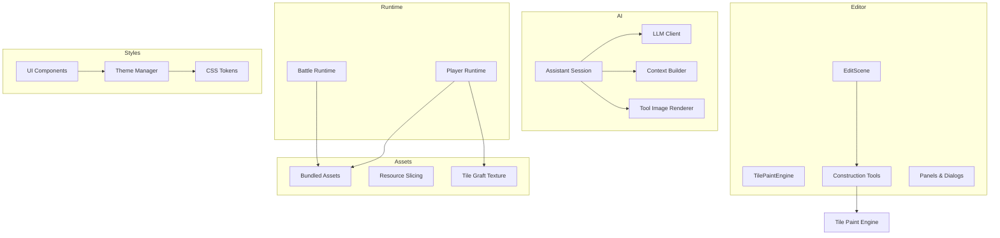
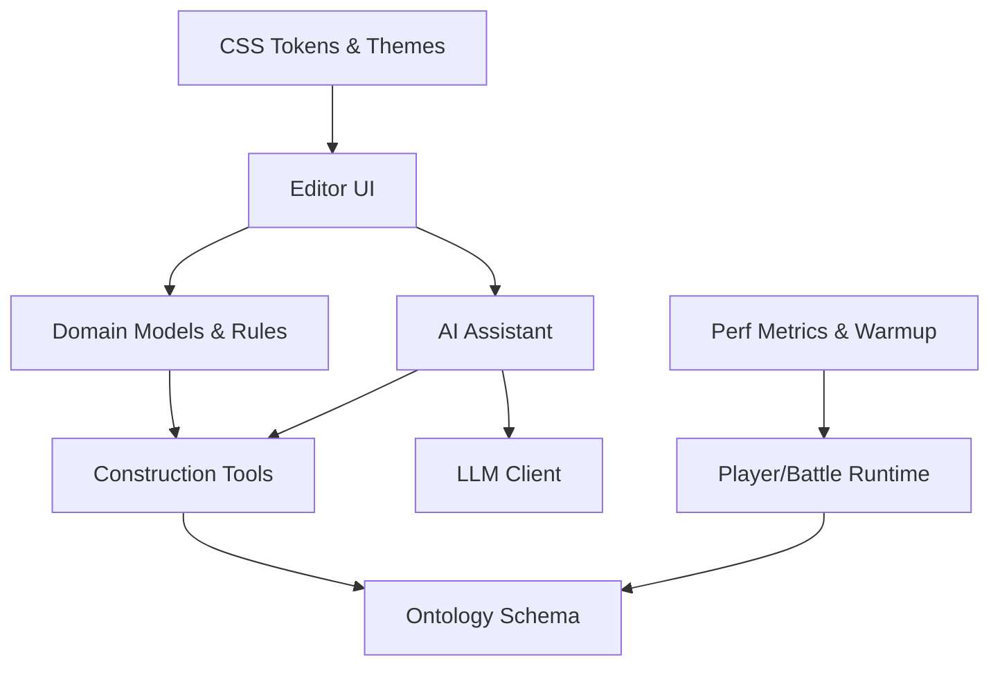
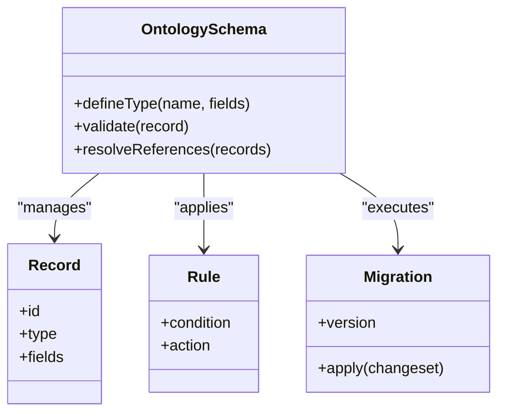
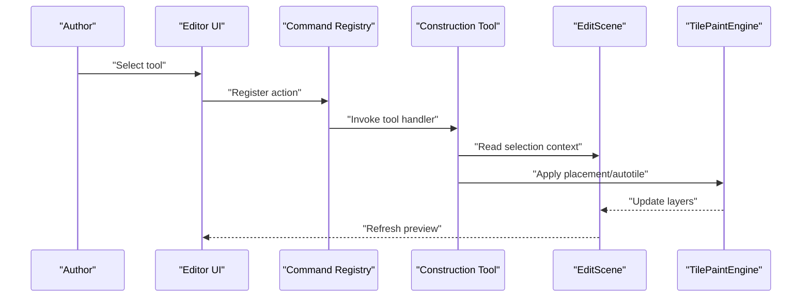
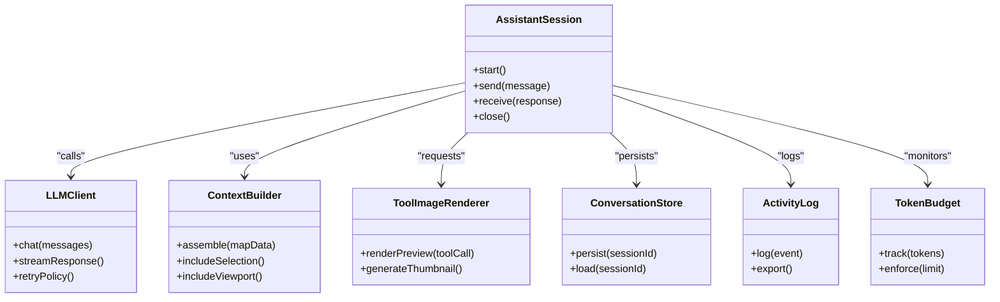
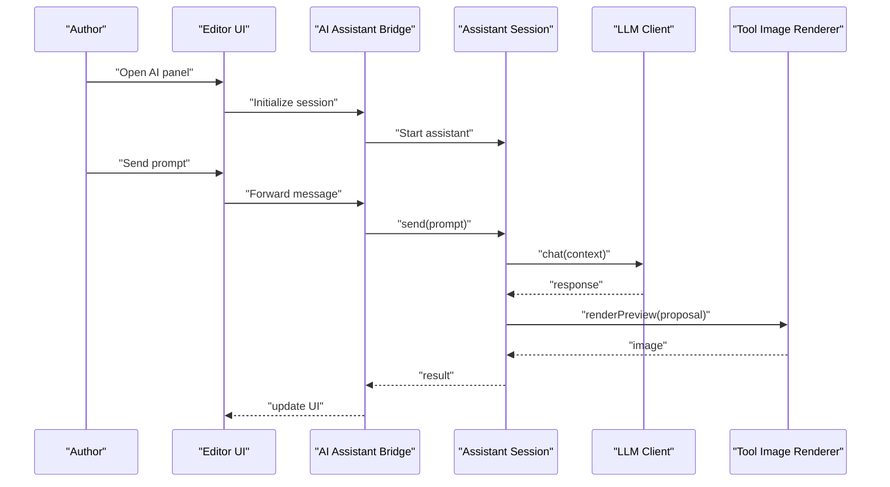
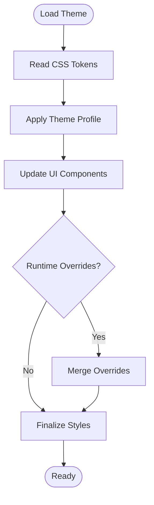
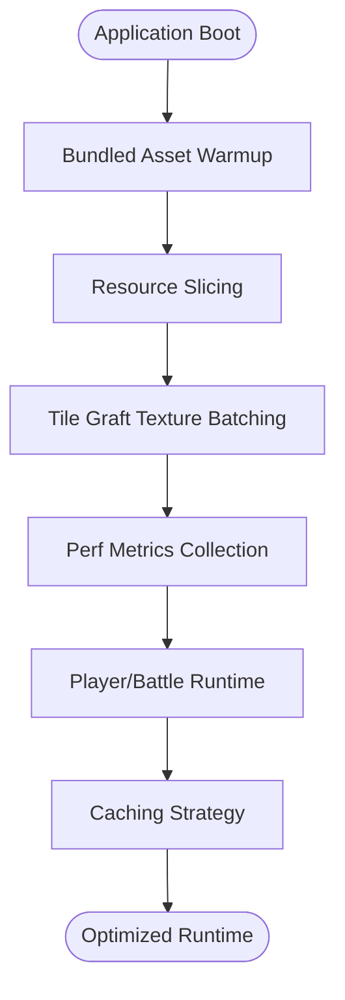
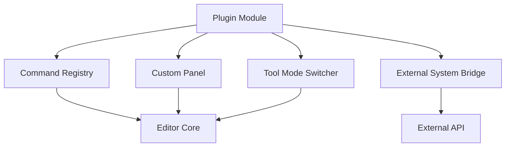
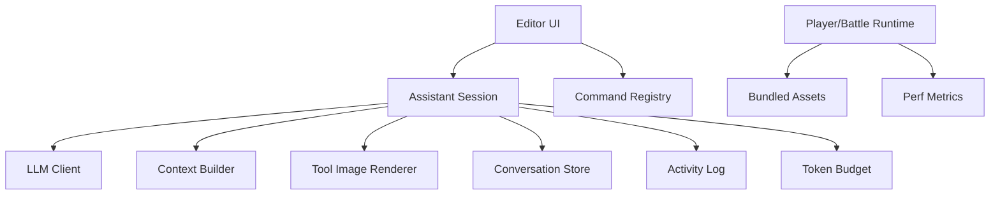

# Advanced Topics and Customization

<cite>
**Referenced Files in This Document**
- [development-ontology.md](file://docs/ontology/development-ontology.md)
- [rpgzzu-development-ontology-design.md](file://docs/specs/2026-06-27-rpg-zzu-development-ontology-design.md)
- [architecture.md](file://openwiki/architecture.md)
- [runtime-and-data.md](file://openwiki/runtime-and-data.md)
- [editor-workflows.md](file://openwiki/editor-workflows.md)
- [ai-assistant-how-it-works.html](file://docs/ai-assistant-how-it-works.html)
- [llm-blueprint-plan.md](file://docs/llm-blueprint-plan.md)
- [modelCatalog.ts](file://src/ai/modelCatalog.ts)
- [llmClient.ts](file://src/ai/llmClient.ts)
- [assistantSession.ts](file://src/ai/assistantSession.ts)
- [contextBuilder.ts](file://src/ai/contextBuilder.ts)
- [toolImageRenderer.ts](file://src/ai/toolImageRenderer.ts)
- [conversationStore.ts](file://src/ai/conversationStore.ts)
- [activityLog.ts](file://src/ai/activityLog.ts)
- [tokenBudget.ts](file://src/ai/tokenBudget.ts)
- [buildSpec.ts](file://src/ai/buildSpec.ts)
- [workPlan.ts](file://src/ai/workPlan.ts)
- [intentClarify.ts](file://src/ai/intentClarify.ts)
- [demonstrationPrompt.ts](file://src/ai/demonstrationPrompt.ts)
- [clusterAssistPrompt.ts](file://src/ai/clusterAssistPrompt.ts)
- [narrativeHorrorWorkPlan.ts](file://src/ai/narrativeHorrorWorkPlan.ts)
- [proposalCompleteness.ts](file://src/ai/proposalCompleteness.ts)
- [skills.ts](file://src/ai/skills.ts)
- [mapViewportContext.ts](file://src/ai/mapViewportContext.ts)
- [groupSampleBuilder.ts](file://src/ai/groupSampleBuilder.ts)
- [eventCommandAssist.ts](file://src/ai/eventCommandAssist.ts)
- [aiBootIntent.ts](file://src/editor/aiBootIntent.ts)
- [aiAssistantBridge.ts](file://src/editor/aiAssistantBridge.ts)
- [assistantToolMode.ts](file://src/editor/assistantToolMode.ts)
- [aiSelectionContext.ts](file://src/editor/aiSelectionContext.ts)
- [agentFocus.ts](file://src/editor/agentFocus.ts)
- [agentGhostPreview.ts](file://src/editor/agentGhostPreview.ts)
- [agentPreviewRenderers.ts](file://src/editor/agentPreviewRenderers.ts)
- [commandRegistry.ts](file://src/editor/commandRegistry.ts)
- [TilePaintEngine.ts](file://src/editor/TilePaintEngine.ts)
- [EditScene.ts](file://src/editor/EditScene.ts)
- [construction/index.ts](file://src/editor/construction/index.ts)
- [construction/placement.ts](file://src/editor/construction/placement.ts)
- [construction/autotileRules.ts](file://src/editor/construction/autotileRules.ts)
- [construction/regionTask.ts](file://src/editor/construction/regionTask.ts)
- [tools/tileFlowTool.ts](file://src/editor/tools/tileFlowTool.ts)
- [tools/structureKitTools.ts](file://src/editor/tools/structureKitTools.ts)
- [tools/interiorWallFrameTool.ts](file://src/editor/tools/interiorWallFrameTool.ts)
- [tools/roomHarnessEngine.ts](file://src/editor/tools/roomHarnessEngine.ts)
- [tools/houseTemplateGallery.ts](file://src/editor/tools/houseTemplateGallery.ts)
- [tools/regionAiPlacementHarness.ts](file://src/editor/tools/regionAiPlacementHarness.ts)
- [styles/cssTokens.ts](file://src/styles/cssTokens.ts)
- [styles/themeManager.ts](file://src/styles/themeManager.ts)
- [styles/uiComponents.ts](file://src/styles/uiComponents.ts)
- [app/perfMetrics.ts](file://src/app/perfMetrics.ts)
- [assets/bundledAssetWarmup.ts](file://src/assets/bundledAssetWarmup.ts)
- [assets/resourceSlicing.ts](file://src/assets/resourceSlicing.ts)
- [assets/tileGraftTexture.ts](file://src/assets/tileGraftTexture.ts)
- [player/runtime.ts](file://src/player/runtime.ts)
- [battle/runtime.ts](file://src/battle/runtime.ts)
</cite>

## Table of Contents
1. [Introduction](#introduction)
2. [Project Structure](#project-structure)
3. [Core Components](#core-components)
4. [Architecture Overview](#architecture-overview)
5. [Detailed Component Analysis](#detailed-component-analysis)
6. [Dependency Analysis](#dependency-analysis)
7. [Performance Considerations](#performance-considerations)
8. [Troubleshooting Guide](#troubleshooting-guide)
9. [Conclusion](#conclusion)
10. [Appendices](#appendices)

## Introduction
This document focuses on advanced customization and extension topics for the project, including:
- Game data modeling via the ontology system
- Advanced construction tool development
- AI model integration and orchestration
- Styling customization through CSS tokens, theme development, and UI modification patterns
- Performance optimization techniques, memory management, and profiling tools
- Deep customization scenarios, plugin architecture patterns, and external integrations
- Architectural decisions, design patterns, and best practices for large-scale modifications

The goal is to provide a comprehensive guide that balances conceptual clarity with concrete implementation references.

## Project Structure
At a high level, the repository organizes code by feature domains (AI, editor, player, assets, styles), with supporting documentation and scripts. The key areas relevant to advanced customization are:
- Ontology and domain modeling under docs and src/project
- Editor construction tools and panels under src/editor
- AI assistant and LLM client integration under src/ai
- Styling and theming under src/styles
- Runtime and performance instrumentation under src/app and src/player

[No sources needed since this diagram shows conceptual workflow, not actual code structure]

## Core Components
- Ontology System: Provides a structured vocabulary and schema for game data modeling, enabling consistent authoring and validation across editor and runtime.
- Construction Tooling: A set of specialized tools for map building, autotiling, region tasks, and template-based placement.
- AI Integration: An assistant layer coordinating LLM calls, context assembly, tool execution, and session state.
- Styling and Theming: A token-driven styling system with theme switching and component-level overrides.
- Performance Instrumentation: Metrics collection, asset warm-up, texture batching, and runtime profiling hooks.

**Section sources**
- [development-ontology.md](file://docs/ontology/development-ontology.md)
- [rpgzzu-development-ontology-design.md](file://docs/specs/2026-06-27-rpg-zzu-development-ontology-design.md)
- [architecture.md](file://openwiki/architecture.md)
- [runtime-and-data.md](file://openwiki/runtime-and-data.md)
- [editor-workflows.md](file://openwiki/editor-workflows.md)

## Architecture Overview
The system follows a layered architecture:
- Presentation Layer: Editor UI, panels, and dialogs
- Domain Layer: Construction tools, ontology models, and rules
- Integration Layer: AI assistant orchestrating LLM clients and tools
- Runtime Layer: Player and battle runtimes consuming authored data
- Styling Layer: Tokenized CSS and theme manager driving visual consistency

**Diagram sources**
- [architecture.md](file://openwiki/architecture.md)
- [runtime-and-data.md](file://openwiki/runtime-and-data.md)
- [editor-workflows.md](file://openwiki/editor-workflows.md)

**Section sources**
- [architecture.md](file://openwiki/architecture.md)
- [runtime-and-data.md](file://openwiki/runtime-and-data.md)
- [editor-workflows.md](file://openwiki/editor-workflows.md)

## Detailed Component Analysis

### Ontology System for Game Data Modeling
The ontology defines core entities, relationships, and constraints used throughout the editor and runtime. It supports:
- Type definitions and schemas for records
- Reference integrity and cross-entity links
- Validation rules and migration pathways
- Authoring aids such as pickers and previews

Key responsibilities:
- Centralize domain vocabulary
- Provide consistent serialization and deserialization
- Enable tooling to generate forms and validations automatically

**Diagram sources**
- [development-ontology.md](file://docs/ontology/development-ontology.md)
- [rpgzzu-development-ontology-design.md](file://docs/specs/2026-06-27-rpg-zzu-development-ontology-design.md)

**Section sources**
- [development-ontology.md](file://docs/ontology/development-ontology.md)
- [rpgzzu-development-ontology-design.md](file://docs/specs/2026-06-27-rpg-zzu-development-ontology-design.md)

### Advanced Construction Tool Development
Construction tools extend the editor’s capabilities for efficient map creation:
- Placement utilities for tiles, props, and structures
- Autotile rule engines for seamless terrain transitions
- Region task pipelines for batch operations and approvals
- Template-based room and house builders

Patterns:
- Command registry for tool actions
- Selection context for scoped operations
- Preview rendering for non-destructive workflows

**Diagram sources**
- [commandRegistry.ts](file://src/editor/commandRegistry.ts)
- [EditScene.ts](file://src/editor/EditScene.ts)
- [TilePaintEngine.ts](file://src/editor/TilePaintEngine.ts)
- [construction/index.ts](file://src/editor/construction/index.ts)
- [construction/placement.ts](file://src/editor/construction/placement.ts)
- [construction/autotileRules.ts](file://src/editor/construction/autotileRules.ts)
- [construction/regionTask.ts](file://src/editor/construction/regionTask.ts)
- [tools/tileFlowTool.ts](file://src/editor/tools/tileFlowTool.ts)
- [tools/structureKitTools.ts](file://src/editor/tools/structureKitTools.ts)
- [tools/interiorWallFrameTool.ts](file://src/editor/tools/interiorWallFrameTool.ts)
- [tools/roomHarnessEngine.ts](file://src/editor/tools/roomHarnessEngine.ts)
- [tools/houseTemplateGallery.ts](file://src/editor/tools/houseTemplateGallery.ts)
- [tools/regionAiPlacementHarness.ts](file://src/editor/tools/regionAiPlacementHarness.ts)

**Section sources**
- [commandRegistry.ts](file://src/editor/commandRegistry.ts)
- [EditScene.ts](file://src/editor/EditScene.ts)
- [TilePaintEngine.ts](file://src/editor/TilePaintEngine.ts)
- [construction/index.ts](file://src/editor/construction/index.ts)
- [construction/placement.ts](file://src/editor/construction/placement.ts)
- [construction/autotileRules.ts](file://src/editor/construction/autotileRules.ts)
- [construction/regionTask.ts](file://src/editor/construction/regionTask.ts)
- [tools/tileFlowTool.ts](file://src/editor/tools/tileFlowTool.ts)
- [tools/structureKitTools.ts](file://src/editor/tools/structureKitTools.ts)
- [tools/interiorWallFrameTool.ts](file://src/editor/tools/interiorWallFrameTool.ts)
- [tools/roomHarnessEngine.ts](file://src/editor/tools/roomHarnessEngine.ts)
- [tools/houseTemplateGallery.ts](file://src/editor/tools/houseTemplateGallery.ts)
- [tools/regionAiPlacementHarness.ts](file://src/editor/tools/regionAiPlacementHarness.ts)

### AI Model Integration
The AI subsystem integrates an assistant session with LLM clients, context builders, and tool renderers to support authoring assistance:
- Model catalog and client abstraction for multiple providers
- Conversation store and activity logging for traceability
- Context builder assembling map viewport and selection data
- Tool image renderer generating previews for proposals
- Work plan and build spec generation for complex tasks

**Diagram sources**
- [assistantSession.ts](file://src/ai/assistantSession.ts)
- [llmClient.ts](file://src/ai/llmClient.ts)
- [contextBuilder.ts](file://src/ai/contextBuilder.ts)
- [toolImageRenderer.ts](file://src/ai/toolImageRenderer.ts)
- [conversationStore.ts](file://src/ai/conversationStore.ts)
- [activityLog.ts](file://src/ai/activityLog.ts)
- [tokenBudget.ts](file://src/ai/tokenBudget.ts)
- [modelCatalog.ts](file://src/ai/modelCatalog.ts)
- [buildSpec.ts](file://src/ai/buildSpec.ts)
- [workPlan.ts](file://src/ai/workPlan.ts)
- [intentClarify.ts](file://src/ai/intentClarify.ts)
- [demonstrationPrompt.ts](file://src/ai/demonstrationPrompt.ts)
- [clusterAssistPrompt.ts](file://src/ai/clusterAssistPrompt.ts)
- [narrativeHorrorWorkPlan.ts](file://src/ai/narrativeHorrorWorkPlan.ts)
- [proposalCompleteness.ts](file://src/ai/proposalCompleteness.ts)
- [skills.ts](file://src/ai/skills.ts)
- [mapViewportContext.ts](file://src/ai/mapViewportContext.ts)
- [groupSampleBuilder.ts](file://src/ai/groupSampleBuilder.ts)
- [eventCommandAssist.ts](file://src/ai/eventCommandAssist.ts)

**Diagram sources**
- [aiBootIntent.ts](file://src/editor/aiBootIntent.ts)
- [aiAssistantBridge.ts](file://src/editor/aiAssistantBridge.ts)
- [assistantToolMode.ts](file://src/editor/assistantToolMode.ts)
- [aiSelectionContext.ts](file://src/editor/aiSelectionContext.ts)
- [assistantSession.ts](file://src/ai/assistantSession.ts)
- [llmClient.ts](file://src/ai/llmClient.ts)
- [toolImageRenderer.ts](file://src/ai/toolImageRenderer.ts)

**Section sources**
- [ai-assistant-how-it-works.html](file://docs/ai-assistant-how-it-works.html)
- [llm-blueprint-plan.md](file://docs/llm-blueprint-plan.md)
- [assistantSession.ts](file://src/ai/assistantSession.ts)
- [llmClient.ts](file://src/ai/llmClient.ts)
- [contextBuilder.ts](file://src/ai/contextBuilder.ts)
- [toolImageRenderer.ts](file://src/ai/toolImageRenderer.ts)
- [conversationStore.ts](file://src/ai/conversationStore.ts)
- [activityLog.ts](file://src/ai/activityLog.ts)
- [tokenBudget.ts](file://src/ai/tokenBudget.ts)
- [modelCatalog.ts](file://src/ai/modelCatalog.ts)
- [buildSpec.ts](file://src/ai/buildSpec.ts)
- [workPlan.ts](file://src/ai/workPlan.ts)
- [intentClarify.ts](file://src/ai/intentClarify.ts)
- [demonstrationPrompt.ts](file://src/ai/demonstrationPrompt.ts)
- [clusterAssistPrompt.ts](file://src/ai/clusterAssistPrompt.ts)
- [narrativeHorrorWorkPlan.ts](file://src/ai/narrativeHorrorWorkPlan.ts)
- [proposalCompleteness.ts](file://src/ai/proposalCompleteness.ts)
- [skills.ts](file://src/ai/skills.ts)
- [mapViewportContext.ts](file://src/ai/mapViewportContext.ts)
- [groupSampleBuilder.ts](file://src/ai/groupSampleBuilder.ts)
- [eventCommandAssist.ts](file://src/ai/eventCommandAssist.ts)
- [aiBootIntent.ts](file://src/editor/aiBootIntent.ts)
- [aiAssistantBridge.ts](file://src/editor/aiAssistantBridge.ts)
- [assistantToolMode.ts](file://src/editor/assistantToolMode.ts)
- [aiSelectionContext.ts](file://src/editor/aiSelectionContext.ts)
- [agentFocus.ts](file://src/editor/agentFocus.ts)
- [agentGhostPreview.ts](file://src/editor/agentGhostPreview.ts)
- [agentPreviewRenderers.ts](file://src/editor/agentPreviewRenderers.ts)

### Styling Customization Through CSS Tokens and Theme Development
Styling is driven by a token system that centralizes colors, spacing, typography, and component states. The theme manager applies tokens to UI components and supports dynamic switching.

Key aspects:
- Token definitions for consistent design values
- Theme profiles for light/dark or custom palettes
- Component-level overrides without breaking global consistency
- Utility functions to compute derived values at runtime

**Diagram sources**
- [styles/cssTokens.ts](file://src/styles/cssTokens.ts)
- [styles/themeManager.ts](file://src/styles/themeManager.ts)
- [styles/uiComponents.ts](file://src/styles/uiComponents.ts)

**Section sources**
- [styles/cssTokens.ts](file://src/styles/cssTokens.ts)
- [styles/themeManager.ts](file://src/styles/themeManager.ts)
- [styles/uiComponents.ts](file://src/styles/uiComponents.ts)

### Performance Optimization Techniques, Memory Management, and Profiling
Optimization strategies include:
- Asset warm-up to reduce first-frame latency
- Texture batching and slicing to minimize draw calls
- Runtime metrics collection for profiling bottlenecks
- Lazy loading and caching for heavy resources

**Diagram sources**
- [app/perfMetrics.ts](file://src/app/perfMetrics.ts)
- [assets/bundledAssetWarmup.ts](file://src/assets/bundledAssetWarmup.ts)
- [assets/resourceSlicing.ts](file://src/assets/resourceSlicing.ts)
- [assets/tileGraftTexture.ts](file://src/assets/tileGraftTexture.ts)
- [player/runtime.ts](file://src/player/runtime.ts)
- [battle/runtime.ts](file://src/battle/runtime.ts)

**Section sources**
- [app/perfMetrics.ts](file://src/app/perfMetrics.ts)
- [assets/bundledAssetWarmup.ts](file://src/assets/bundledAssetWarmup.ts)
- [assets/resourceSlicing.ts](file://src/assets/resourceSlicing.ts)
- [assets/tileGraftTexture.ts](file://src/assets/tileGraftTexture.ts)
- [player/runtime.ts](file://src/player/runtime.ts)
- [battle/runtime.ts](file://src/battle/runtime.ts)

### Deep Customization Scenarios and Plugin Architecture Patterns
Deep customization leverages:
- Command registration to inject new behaviors
- Panel composition to extend editor surfaces
- Tool mode switching for contextual interactions
- External integrations via bridge modules

Patterns:
- Observer pattern for event-driven updates
- Factory pattern for tool instantiation
- Strategy pattern for pluggable rendering backends
- Adapter pattern for external system connectors

[No sources needed since this diagram shows conceptual workflow, not actual code structure]

### Integration With External Systems
Integration points include:
- Supabase resource root for cloud storage and sync
- OAuth companion for authentication flows
- MCP server for tool exposure and automation
- Web export pipeline for deployment targets

Best practices:
- Use typed contracts for payloads
- Implement retry and error handling
- Log activity for observability

**Section sources**
- [scripts/supabase-resource-root/catalog.mjs](file://scripts/supabase-resource-root/catalog.mjs)
- [scripts/supabase-resource-root/projectUploads.mjs](file://scripts/supabase-resource-root/projectUploads.mjs)
- [scripts/supabase-resource-root/supabaseRest.mjs](file://scripts/supabase-resource-root/supabaseRest.mjs)
- [scripts/chatgpt-oauth-companion.mjs](file://scripts/chatgpt-oauth-companion.mjs)
- [scripts/rpgzzu-mcp-server.mjs](file://scripts/rpgzzu-mcp-server.mjs)

## Dependency Analysis
The following diagram highlights key dependencies among AI, editor, and runtime modules:

**Diagram sources**
- [assistantSession.ts](file://src/ai/assistantSession.ts)
- [llmClient.ts](file://src/ai/llmClient.ts)
- [contextBuilder.ts](file://src/ai/contextBuilder.ts)
- [toolImageRenderer.ts](file://src/ai/toolImageRenderer.ts)
- [conversationStore.ts](file://src/ai/conversationStore.ts)
- [activityLog.ts](file://src/ai/activityLog.ts)
- [tokenBudget.ts](file://src/ai/tokenBudget.ts)
- [commandRegistry.ts](file://src/editor/commandRegistry.ts)
- [bundledAssetWarmup.ts](file://src/assets/bundledAssetWarmup.ts)
- [perfMetrics.ts](file://src/app/perfMetrics.ts)
- [player/runtime.ts](file://src/player/runtime.ts)
- [battle/runtime.ts](file://src/battle/runtime.ts)

**Section sources**
- [assistantSession.ts](file://src/ai/assistantSession.ts)
- [llmClient.ts](file://src/ai/llmClient.ts)
- [contextBuilder.ts](file://src/ai/contextBuilder.ts)
- [toolImageRenderer.ts](file://src/ai/toolImageRenderer.ts)
- [conversationStore.ts](file://src/ai/conversationStore.ts)
- [activityLog.ts](file://src/ai/activityLog.ts)
- [tokenBudget.ts](file://src/ai/tokenBudget.ts)
- [commandRegistry.ts](file://src/editor/commandRegistry.ts)
- [bundledAssetWarmup.ts](file://src/assets/bundledAssetWarmup.ts)
- [perfMetrics.ts](file://src/app/perfMetrics.ts)
- [player/runtime.ts](file://src/player/runtime.ts)
- [battle/runtime.ts](file://src/battle/runtime.ts)

## Performance Considerations
- Prefer lazy loading for heavy assets and defer initialization until needed
- Use texture batching and slicing to reduce GPU overhead
- Collect and analyze perf metrics during authoring sessions to identify hotspots
- Implement robust caching strategies for frequently accessed resources
- Monitor token budgets in AI flows to prevent excessive usage

[No sources needed since this section provides general guidance]

## Troubleshooting Guide
Common issues and resolutions:
- AI session failures: Check conversation store persistence and activity logs for errors; verify token budget enforcement and retry policies
- Construction tool misbehavior: Validate command registration and selection context; ensure preview renderers update correctly
- Styling inconsistencies: Inspect token definitions and theme profile application; confirm runtime overrides do not conflict
- Performance regressions: Review bundled asset warm-up steps, resource slicing outcomes, and tile graft texture batching; correlate with perf metrics

**Section sources**
- [conversationStore.ts](file://src/ai/conversationStore.ts)
- [activityLog.ts](file://src/ai/activityLog.ts)
- [tokenBudget.ts](file://src/ai/tokenBudget.ts)
- [commandRegistry.ts](file://src/editor/commandRegistry.ts)
- [styles/cssTokens.ts](file://src/styles/cssTokens.ts)
- [styles/themeManager.ts](file://src/styles/themeManager.ts)
- [assets/bundledAssetWarmup.ts](file://src/assets/bundledAssetWarmup.ts)
- [assets/resourceSlicing.ts](file://src/assets/resourceSlicing.ts)
- [assets/tileGraftTexture.ts](file://src/assets/tileGraftTexture.ts)
- [app/perfMetrics.ts](file://src/app/perfMetrics.ts)

## Conclusion
Advanced customization in this project hinges on a well-defined ontology, extensible construction tooling, robust AI integration, token-driven styling, and strong performance instrumentation. By adhering to established patterns—command registration, observer/event-driven updates, factory/strategy implementations, and adapter bridges—developers can implement large-scale modifications safely and maintainably.

[No sources needed since this section summarizes without analyzing specific files]

## Appendices
- Example deep customization scenario: Integrate a new external asset provider by implementing an adapter module, registering commands for upload/download, and updating the resource resolver to fetch from the new source.
- Best practices for large-scale modifications:
  - Keep domain models stable and evolve via migrations
  - Encapsulate changes behind clear interfaces and registries
  - Add tests for critical paths and edge cases
  - Document behavioral contracts for plugins and integrations

[No sources needed since this section provides general guidance]