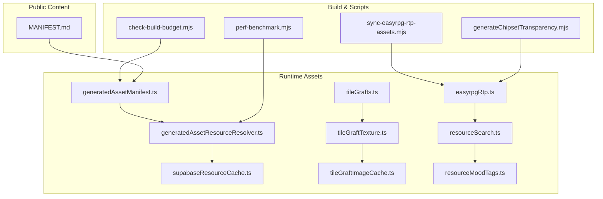
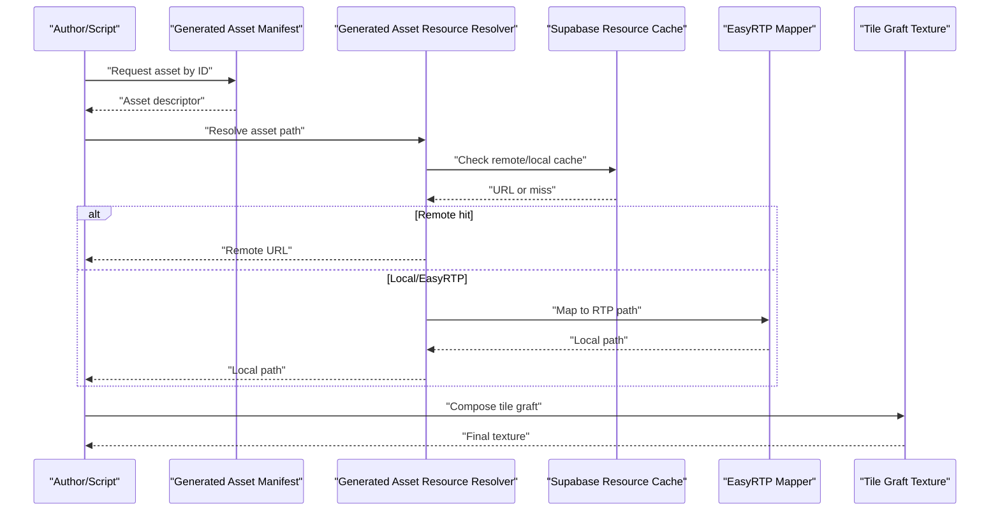
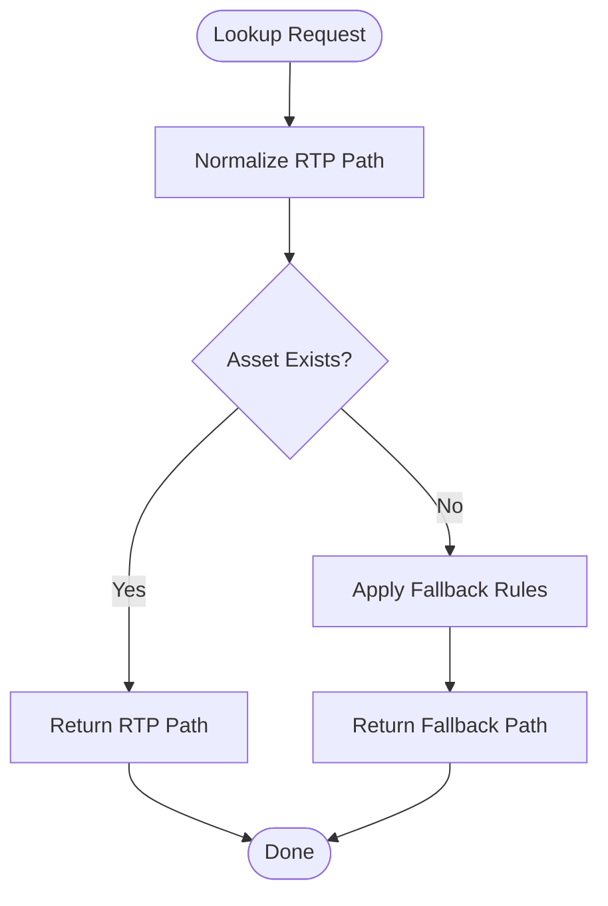
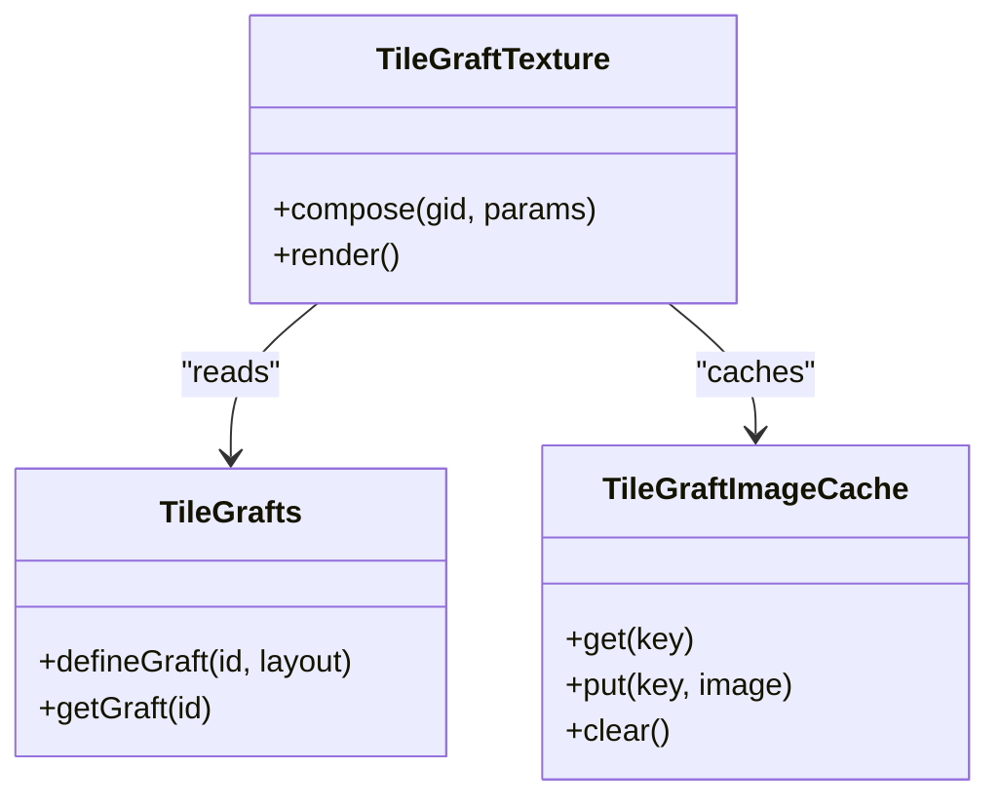
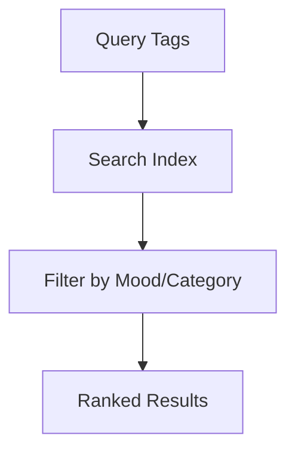
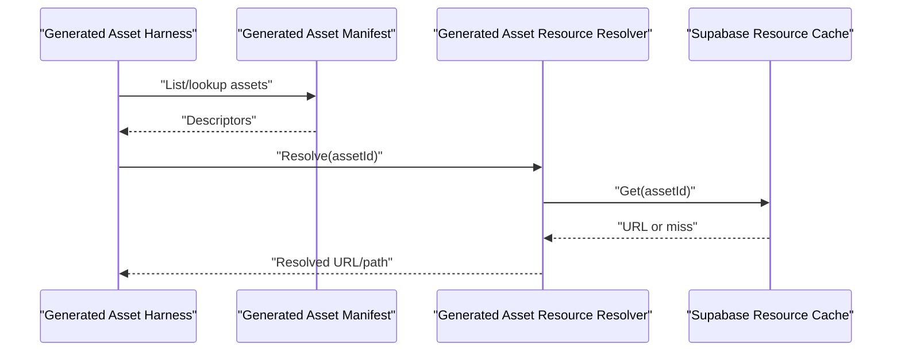
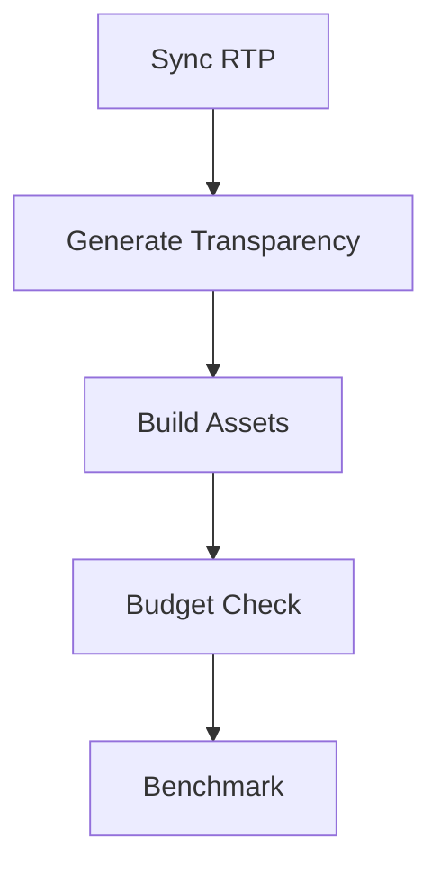
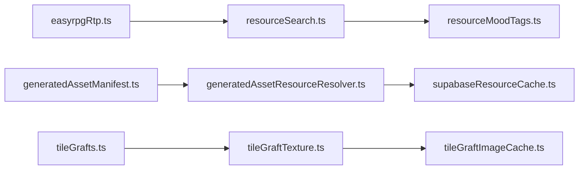

# Asset Management and Pipeline

<cite>
**Referenced Files in This Document**
- [src/assets/easyrpgRtp.ts](file://src/assets/easyrpgRtp.ts)
- [src/assets/tileGrafts.ts](file://src/assets/tileGrafts.ts)
- [src/assets/tileGraftTexture.ts](file://src/assets/tileGraftTexture.ts)
- [src/assets/tileGraftImageCache.ts](file://src/assets/tileGraftImageCache.ts)
- [src/assets/resourceSearch.ts](file://src/assets/resourceSearch.ts)
- [src/assets/resourceMoodTags.ts](file://src/assets/resourceMoodTags.ts)
- [src/assets/generatedAssetManifest.ts](file://src/assets/generatedAssetManifest.ts)
- [src/assets/generatedAssetResourceResolver.ts](file://src/assets/generatedAssetResourceResolver.ts)
- [src/assets/generatedAssetHarness.ts](file://src/assets/generatedAssetHarness.ts)
- [src/assets/supabaseResourceCache.ts](file://src/assets/supabaseResourceCache.ts)
- [scripts/sync-easyrpg-rtp-assets.mjs](file://scripts/sync-easyrpg-rtp-assets.mjs)
- [scripts/generateChipsetTransparency.mjs](file://scripts/generateChipsetTransparency.mjs)
- [scripts/check-build-budget.mjs](file://scripts/check-build-budget.mjs)
- [scripts/perf-benchmark.mjs](file://scripts/perf-benchmark.mjs)
- [public/assets/MANIFEST.md](file://public/assets/MANIFEST.md)
</cite>

## Table of Contents
1. [Introduction](#introduction)
2. [Project Structure](#project-structure)
3. [Core Components](#core-components)
4. [Architecture Overview](#architecture-overview)
5. [Detailed Component Analysis](#detailed-component-analysis)
6. [Dependency Analysis](#dependency-analysis)
7. [Performance Considerations](#performance-considerations)
8. [Troubleshooting Guide](#troubleshooting-guide)
9. [Conclusion](#conclusion)
10. [Appendices](#appendices)

## Introduction
This document explains the asset management system and procedural generation pipeline. It covers resource loading architecture, caching strategies, memory optimization, tile grafting, asset tagging and categorization, EasyRTP compatibility layer, procedural generation tools, batch processing scripts, quality assurance utilities, custom asset creation workflows, format conversion processes, integration with external pipelines, performance optimization for large libraries, and CDN deployment strategies. The goal is to provide both a high-level understanding and actionable guidance for authors and engineers working with assets.

## Project Structure
The asset system spans runtime modules under src/assets, build-time scripts under scripts, and public content under public/assets. Key areas:
- Runtime asset loaders and caches (EasyRTP, generated assets, Supabase cache)
- Tile grafting subsystem (graffiti composition, texture assembly, image cache)
- Tagging and search (mood tags, resource search)
- Procedural generation harness and manifest
- Build and QA scripts (transparency generation, budget checks, benchmarks)
- Public manifests and catalogs

**Diagram sources**
- [src/assets/easyrpgRtp.ts](file://src/assets/easyrpgRtp.ts)
- [src/assets/generatedAssetManifest.ts](file://src/assets/generatedAssetManifest.ts)
- [src/assets/generatedAssetResourceResolver.ts](file://src/assets/generatedAssetResourceResolver.ts)
- [src/assets/supabaseResourceCache.ts](file://src/assets/supabaseResourceCache.ts)
- [src/assets/tileGrafts.ts](file://src/assets/tileGrafts.ts)
- [src/assets/tileGraftTexture.ts](file://src/assets/tileGraftTexture.ts)
- [src/assets/tileGraftImageCache.ts](file://src/assets/tileGraftImageCache.ts)
- [src/assets/resourceSearch.ts](file://src/assets/resourceSearch.ts)
- [src/assets/resourceMoodTags.ts](file://src/assets/resourceMoodTags.ts)
- [scripts/sync-easyrpg-rtp-assets.mjs](file://scripts/sync-easyrpg-rtp-assets.mjs)
- [scripts/generateChipsetTransparency.mjs](file://scripts/generateChipsetTransparency.mjs)
- [scripts/check-build-budget.mjs](file://scripts/check-build-budget.mjs)
- [scripts/perf-benchmark.mjs](file://scripts/perf-benchmark.mjs)
- [public/assets/MANIFEST.md](file://public/assets/MANIFEST.md)

**Section sources**
- [src/assets/easyrpgRtp.ts](file://src/assets/easyrpgRtp.ts)
- [src/assets/generatedAssetManifest.ts](file://src/assets/generatedAssetManifest.ts)
- [src/assets/generatedAssetResourceResolver.ts](file://src/assets/generatedAssetResourceResolver.ts)
- [src/assets/supabaseResourceCache.ts](file://src/assets/supabaseResourceCache.ts)
- [src/assets/tileGrafts.ts](file://src/assets/tileGrafts.ts)
- [src/assets/tileGraftTexture.ts](file://src/assets/tileGraftTexture.ts)
- [src/assets/tileGraftImageCache.ts](file://src/assets/tileGraftImageCache.ts)
- [src/assets/resourceSearch.ts](file://src/assets/resourceSearch.ts)
- [src/assets/resourceMoodTags.ts](file://src/assets/resourceMoodTags.ts)
- [scripts/sync-easyrpg-rtp-assets.mjs](file://scripts/sync-easyrpg-rtp-assets.mjs)
- [scripts/generateChipsetTransparency.mjs](file://scripts/generateChipsetTransparency.mjs)
- [scripts/check-build-budget.mjs](file://scripts/check-build-budget.mjs)
- [scripts/perf-benchmark.mjs](file://scripts/perf-benchmark.mjs)
- [public/assets/MANIFEST.md](file://public/assets/MANIFEST.md)

## Core Components
- EasyRTP Compatibility Layer: Provides mapping and resolution for official EasyRPG RTP resources so existing assets can be used without modification.
- Generated Asset System: A manifest-driven approach that resolves procedurally generated or derived assets at runtime, with optional remote caching.
- Tile Grafting Subsystem: Composes complex tiles from smaller pieces, assembles textures, and caches intermediate images to reduce GPU/CPU overhead.
- Resource Search and Tagging: Enables semantic queries over assets using mood tags and searchable metadata.
- Build-Time Tooling: Scripts to sync RTP assets, generate transparency maps, enforce budgets, and benchmark performance.

**Section sources**
- [src/assets/easyrpgRtp.ts](file://src/assets/easyrpgRtp.ts)
- [src/assets/generatedAssetManifest.ts](file://src/assets/generatedAssetManifest.ts)
- [src/assets/generatedAssetResourceResolver.ts](file://src/assets/generatedAssetResourceResolver.ts)
- [src/assets/tileGrafts.ts](file://src/assets/tileGrafts.ts)
- [src/assets/tileGraftTexture.ts](file://src/assets/tileGraftTexture.ts)
- [src/assets/tileGraftImageCache.ts](file://src/assets/tileGraftImageCache.ts)
- [src/assets/resourceSearch.ts](file://src/assets/resourceSearch.ts)
- [src/assets/resourceMoodTags.ts](file://src/assets/resourceMoodTags.ts)
- [scripts/sync-easyrpg-rtp-assets.mjs](file://scripts/sync-easyrpg-rtp-assets.mjs)
- [scripts/generateChipsetTransparency.mjs](file://scripts/generateChipsetTransparency.mjs)
- [scripts/check-build-budget.mjs](file://scripts/check-build-budget.mjs)
- [scripts/perf-benchmark.mjs](file://scripts/perf-benchmark.mjs)

## Architecture Overview
The asset pipeline integrates three layers:
- Source/Authoring Layer: Author assets, define manifests, and run build scripts.
- Resolution Layer: Resolve assets via EasyRTP mappings, generated asset resolver, and local/remote caches.
- Rendering Layer: Use tile grafting to compose final textures efficiently.

**Diagram sources**
- [src/assets/generatedAssetManifest.ts](file://src/assets/generatedAssetManifest.ts)
- [src/assets/generatedAssetResourceResolver.ts](file://src/assets/generatedAssetResourceResolver.ts)
- [src/assets/supabaseResourceCache.ts](file://src/assets/supabaseResourceCache.ts)
- [src/assets/easyrpgRtp.ts](file://src/assets/easyrpgRtp.ts)
- [src/assets/tileGraftTexture.ts](file://src/assets/tileGraftTexture.ts)

## Detailed Component Analysis

### EasyRTP Compatibility Layer
Purpose:
- Map game references to official EasyRPG RTP resources.
- Provide consistent paths and fallbacks across environments.

Key responsibilities:
- RTP path normalization
- Version-aware lookups
- Fallback strategy when assets are missing

**Diagram sources**
- [src/assets/easyrpgRtp.ts](file://src/assets/easyrpgRtp.ts)

**Section sources**
- [src/assets/easyrpgRtp.ts](file://src/assets/easyrpgRtp.ts)

### Tile Grafting System
Purpose:
- Compose complex tiles from reusable fragments.
- Assemble final textures and cache intermediate results.

Components:
- tileGrafts: Defines graft rules and fragment layouts.
- tileGraftTexture: Assembles composed textures.
- tileGraftImageCache: Caches intermediate images to avoid recomputation.

**Diagram sources**
- [src/assets/tileGrafts.ts](file://src/assets/tileGrafts.ts)
- [src/assets/tileGraftTexture.ts](file://src/assets/tileGraftTexture.ts)
- [src/assets/tileGraftImageCache.ts](file://src/assets/tileGraftImageCache.ts)

**Section sources**
- [src/assets/tileGrafts.ts](file://src/assets/tileGrafts.ts)
- [src/assets/tileGraftTexture.ts](file://src/assets/tileGraftTexture.ts)
- [src/assets/tileGraftImageCache.ts](file://src/assets/tileGraftImageCache.ts)

### Asset Tagging and Categorization
Purpose:
- Enable semantic search and filtering of assets.
- Support mood-based curation and discovery.

Highlights:
- resourceMoodTags: Declares mood categories and associations.
- resourceSearch: Indexes and queries assets by tags and metadata.

**Diagram sources**
- [src/assets/resourceMoodTags.ts](file://src/assets/resourceMoodTags.ts)
- [src/assets/resourceSearch.ts](file://src/assets/resourceSearch.ts)

**Section sources**
- [src/assets/resourceMoodTags.ts](file://src/assets/resourceMoodTags.ts)
- [src/assets/resourceSearch.ts](file://src/assets/resourceSearch.ts)

### Generated Asset System
Purpose:
- Centralize definitions of procedurally generated or derived assets.
- Resolve assets at runtime with optional remote caching.

Flow:
- Manifest defines IDs and descriptors.
- Resolver computes paths and fetches from cache or local sources.
- Harness provides authoring/testing utilities.

**Diagram sources**
- [src/assets/generatedAssetManifest.ts](file://src/assets/generatedAssetManifest.ts)
- [src/assets/generatedAssetResourceResolver.ts](file://src/assets/generatedAssetResourceResolver.ts)
- [src/assets/generatedAssetHarness.ts](file://src/assets/generatedAssetHarness.ts)
- [src/assets/supabaseResourceCache.ts](file://src/assets/supabaseResourceCache.ts)

**Section sources**
- [src/assets/generatedAssetManifest.ts](file://src/assets/generatedAssetManifest.ts)
- [src/assets/generatedAssetResourceResolver.ts](file://src/assets/generatedAssetResourceResolver.ts)
- [src/assets/generatedAssetHarness.ts](file://src/assets/generatedAssetHarness.ts)
- [src/assets/supabaseResourceCache.ts](file://src/assets/supabaseResourceCache.ts)

### Build-Time and QA Scripts
- Sync EasyRTP assets: Ensures local RTP alignment with expected versions.
- Generate chipset transparency: Produces transparency maps for chipsets.
- Check build budget: Enforces size constraints on generated assets.
- Performance benchmark: Measures load times and memory usage.

**Diagram sources**
- [scripts/sync-easyrpg-rtp-assets.mjs](file://scripts/sync-easyrpg-rtp-assets.mjs)
- [scripts/generateChipsetTransparency.mjs](file://scripts/generateChipsetTransparency.mjs)
- [scripts/check-build-budget.mjs](file://scripts/check-build-budget.mjs)
- [scripts/perf-benchmark.mjs](file://scripts/perf-benchmark.mjs)

**Section sources**
- [scripts/sync-easyrpg-rtp-assets.mjs](file://scripts/sync-easyrpg-rtp-assets.mjs)
- [scripts/generateChipsetTransparency.mjs](file://scripts/generateChipsetTransparency.mjs)
- [scripts/check-build-budget.mjs](file://scripts/check-build-budget.mjs)
- [scripts/perf-benchmark.mjs](file://scripts/perf-benchmark.mjs)

## Dependency Analysis
High-level dependencies among core modules:

**Diagram sources**
- [src/assets/easyrpgRtp.ts](file://src/assets/easyrpgRtp.ts)
- [src/assets/resourceSearch.ts](file://src/assets/resourceSearch.ts)
- [src/assets/generatedAssetManifest.ts](file://src/assets/generatedAssetManifest.ts)
- [src/assets/generatedAssetResourceResolver.ts](file://src/assets/generatedAssetResourceResolver.ts)
- [src/assets/supabaseResourceCache.ts](file://src/assets/supabaseResourceCache.ts)
- [src/assets/tileGrafts.ts](file://src/assets/tileGrafts.ts)
- [src/assets/tileGraftTexture.ts](file://src/assets/tileGraftTexture.ts)
- [src/assets/tileGraftImageCache.ts](file://src/assets/tileGraftImageCache.ts)
- [src/assets/resourceMoodTags.ts](file://src/assets/resourceMoodTags.ts)

**Section sources**
- [src/assets/easyrpgRtp.ts](file://src/assets/easyrpgRtp.ts)
- [src/assets/resourceSearch.ts](file://src/assets/resourceSearch.ts)
- [src/assets/generatedAssetManifest.ts](file://src/assets/generatedAssetManifest.ts)
- [src/assets/generatedAssetResourceResolver.ts](file://src/assets/generatedAssetResourceResolver.ts)
- [src/assets/supabaseResourceCache.ts](file://src/assets/supabaseResourceCache.ts)
- [src/assets/tileGrafts.ts](file://src/assets/tileGrafts.ts)
- [src/assets/tileGraftTexture.ts](file://src/assets/tileGraftTexture.ts)
- [src/assets/tileGraftImageCache.ts](file://src/assets/tileGraftImageCache.ts)
- [src/assets/resourceMoodTags.ts](file://src/assets/resourceMoodTags.ts)

## Performance Considerations
- Prefer tile grafting for repeated compositions; reuse cached images to minimize GPU uploads.
- Use generated asset manifest to precompute and deduplicate derived assets.
- Leverage Supabase cache for remote assets to reduce network latency and bandwidth.
- Run budget checks during CI to prevent regressions in asset sizes.
- Benchmark critical paths (loading, composition) regularly and track trends.

[No sources needed since this section provides general guidance]

## Troubleshooting Guide
Common issues and resolutions:
- Missing RTP assets: Ensure synchronization script runs before build; verify version alignment.
- Stale cache entries: Clear local cache and re-resolve; validate remote cache TTL settings.
- Excessive memory usage: Reduce tile graft cache size; prune unused generated assets.
- Slow loads: Enable CDN caching headers; compress assets; prefer atlases where applicable.

**Section sources**
- [scripts/sync-easyrpg-rtp-assets.mjs](file://scripts/sync-easyrpg-rtp-assets.mjs)
- [src/assets/supabaseResourceCache.ts](file://src/assets/supabaseResourceCache.ts)
- [src/assets/tileGraftImageCache.ts](file://src/assets/tileGraftImageCache.ts)
- [scripts/check-build-budget.mjs](file://scripts/check-build-budget.mjs)

## Conclusion
The asset management system combines a robust compatibility layer, a flexible generated asset pipeline, efficient tile grafting, and strong tooling for build-time validation and performance monitoring. By following the recommended practices—manifest-driven resolution, caching, and disciplined asset budgets—you can scale to large libraries while maintaining fast load times and predictable behavior across environments.

[No sources needed since this section summarizes without analyzing specific files]

## Appendices

### Custom Asset Creation Workflow
- Define new assets in the generated asset manifest with stable IDs.
- Implement resolution logic if assets require derivation or remote fetching.
- Add tags and mood metadata for discoverability.
- Validate with budget checks and benchmarks before committing.

**Section sources**
- [src/assets/generatedAssetManifest.ts](file://src/assets/generatedAssetManifest.ts)
- [src/assets/generatedAssetResourceResolver.ts](file://src/assets/generatedAssetResourceResolver.ts)
- [src/assets/resourceMoodTags.ts](file://src/assets/resourceMoodTags.ts)
- [scripts/check-build-budget.mjs](file://scripts/check-build-budget.mjs)

### Format Conversion Workflows
- Use transparency generation to produce alpha maps for chipsets.
- Convert source formats into optimized targets via build scripts.
- Verify outputs with visual QA and automated checks.

**Section sources**
- [scripts/generateChipsetTransparency.mjs](file://scripts/generateChipsetTransparency.mjs)

### Integration with External Asset Pipelines
- Publish generated assets to a CDN-backed storage (e.g., Supabase).
- Update manifests to point to canonical URLs.
- Keep EasyRTP mappings aligned with published RTP versions.

**Section sources**
- [src/assets/supabaseResourceCache.ts](file://src/assets/supabaseResourceCache.ts)
- [src/assets/easyrpgRtp.ts](file://src/assets/easyrpgRtp.ts)
- [public/assets/MANIFEST.md](file://public/assets/MANIFEST.md)

### CDN Deployment Strategies
- Set long-lived cache headers for immutable assets.
- Use versioned URLs to bust caches safely.
- Monitor cache hit ratios and adjust TTLs based on access patterns.

[No sources needed since this section provides general guidance]