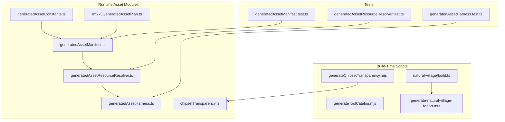
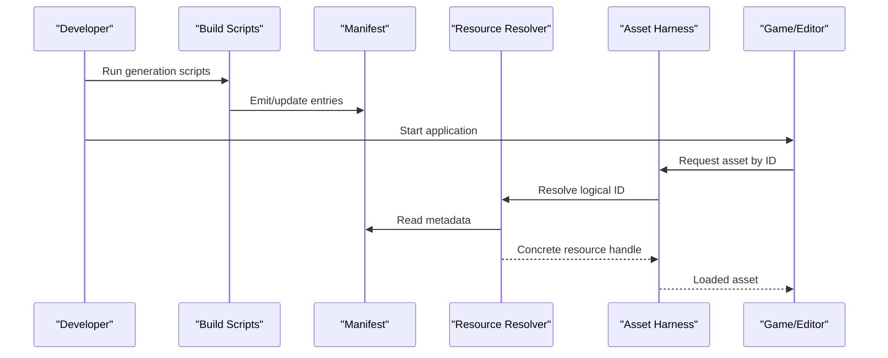
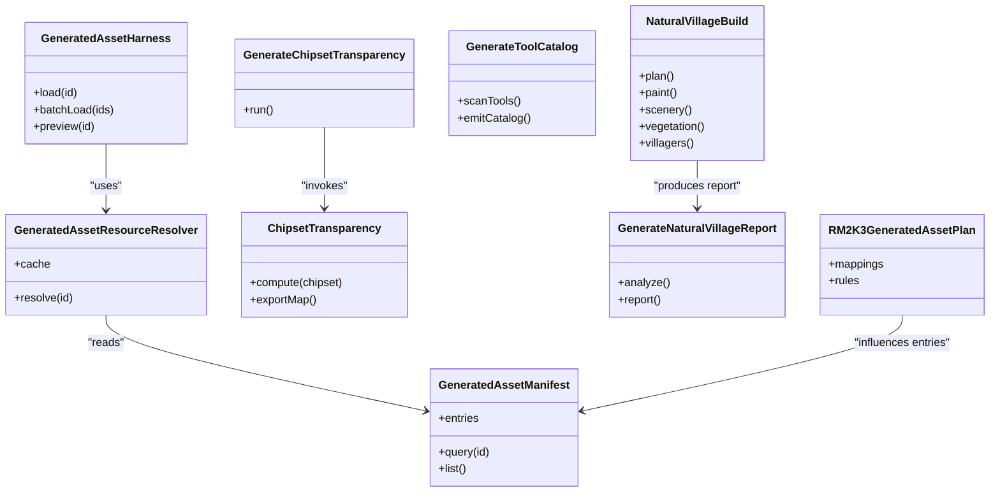

# Procedural Asset Generation

<cite>
**Referenced Files in This Document**
- [generatedAssetManifest.ts](file://src/assets/generatedAssetManifest.ts)
- [generatedAssetResourceResolver.ts](file://src/assets/generatedAssetResourceResolver.ts)
- [generatedAssetHarness.ts](file://src/assets/generatedAssetHarness.ts)
- [generatedAssetConstants.ts](file://src/assets/generatedAssetConstants.ts)
- [chipsetTransparency.ts](file://src/assets/chipsetTransparency.ts)
- [generateChipsetTransparency.mjs](file://scripts/generateChipsetTransparency.mjs)
- [generateToolCatalog.mjs](file://scripts/generateToolCatalog.mjs)
- [natural-village/build.ts](file://scripts/natural-village/build.ts)
- [natural-village/blueprint.ts](file://scripts/natural-village/blueprint.ts)
- [natural-village/paint.ts](file://scripts/natural-village/paint.ts)
- [natural-village/scenery.ts](file://scripts/natural-village/scenery.ts)
- [natural-village/vegetation.ts](file://scripts/natural-village/vegetation.ts)
- [natural-village/villagers.ts](file://scripts/natural-village/villagers.ts)
- [generate-natural-village-report.mts](file://scripts/generate-natural-village-report.mts)
- [rm2k3GeneratedAssetPlan.json](file://src/assets/rm2k3GeneratedAssetPlan.json)
- [rm2k3GeneratedAssetPlan.ts](file://src/assets/rm2k3GeneratedAssetPlan.ts)
- [generatedAssetManifest.test.ts](file://test/generatedAssetManifest.test.ts)
- [generatedAssetResourceResolver.test.ts](file://test/generatedAssetResourceResolver.test.ts)
- [generatedAssetHarness.test.ts](file://test/generatedAssetHarness.test.ts)
</cite>

## Table of Contents
1. [Introduction](#introduction)
2. [Project Structure](#project-structure)
3. [Core Components](#core-components)
4. [Architecture Overview](#architecture-overview)
5. [Detailed Component Analysis](#detailed-component-analysis)
6. [Dependency Analysis](#dependency-analysis)
7. [Performance Considerations](#performance-considerations)
8. [Troubleshooting Guide](#troubleshooting-guide)
9. [Conclusion](#conclusion)
10. [Appendices](#appendices)

## Introduction
This document explains the procedural asset generation pipeline, focusing on:
- The manifest system that describes generated assets and their metadata
- Resource resolution strategies for locating and loading generated content at runtime
- Batch processing tools used to generate and validate assets
- Tile transparency generation for chipsets
- Tool catalog creation for editor tool exposure
- Natural village reporting utilities for map and scene analysis
- Guidance for creating custom generators, integrating external tools, and optimizing generated assets
- Quality assurance workflows and automated testing for generated content

The goal is to provide a clear mental model of how generated assets are defined, produced, resolved, and verified across build-time and runtime.

## Project Structure
The procedural asset pipeline spans both build-time scripts and runtime modules:
- Build-time scripts under scripts/ orchestrate generation, transformation, and reporting
- Runtime asset modules under src/assets define manifests, resolvers, and harnesses
- Tests under test/ validate behavior and contracts for generated assets and tooling

**Diagram sources**
- [generateChipsetTransparency.mjs](file://scripts/generateChipsetTransparency.mjs)
- [generateToolCatalog.mjs](file://scripts/generateToolCatalog.mjs)
- [natural-village/build.ts](file://scripts/natural-village/build.ts)
- [generate-natural-village-report.mts](file://scripts/generate-natural-village-report.mts)
- [generatedAssetManifest.ts](file://src/assets/generatedAssetManifest.ts)
- [generatedAssetResourceResolver.ts](file://src/assets/generatedAssetResourceResolver.ts)
- [generatedAssetHarness.ts](file://src/assets/generatedAssetHarness.ts)
- [generatedAssetConstants.ts](file://src/assets/generatedAssetConstants.ts)
- [chipsetTransparency.ts](file://src/assets/chipsetTransparency.ts)
- [rm2k3GeneratedAssetPlan.ts](file://src/assets/rm2k3GeneratedAssetPlan.ts)
- [generatedAssetManifest.test.ts](file://test/generatedAssetManifest.test.ts)
- [generatedAssetResourceResolver.test.ts](file://test/generatedAssetResourceResolver.test.ts)
- [generatedAssetHarness.test.ts](file://test/generatedAssetHarness.test.ts)

**Section sources**
- [generatedAssetManifest.ts](file://src/assets/generatedAssetManifest.ts)
- [generatedAssetResourceResolver.ts](file://src/assets/generatedAssetResourceResolver.ts)
- [generatedAssetHarness.ts](file://src/assets/generatedAssetHarness.ts)
- [generatedAssetConstants.ts](file://src/assets/generatedAssetConstants.ts)
- [chipsetTransparency.ts](file://src/assets/chipsetTransparency.ts)
- [generateChipsetTransparency.mjs](file://scripts/generateChipsetTransparency.mjs)
- [generateToolCatalog.mjs](file://scripts/generateToolCatalog.mjs)
- [natural-village/build.ts](file://scripts/natural-village/build.ts)
- [generate-natural-village-report.mts](file://scripts/generate-natural-village-report.mts)
- [rm2k3GeneratedAssetPlan.ts](file://src/assets/rm2k3GeneratedAssetPlan.ts)
- [generatedAssetManifest.test.ts](file://test/generatedAssetManifest.test.ts)
- [generatedAssetResourceResolver.test.ts](file://test/generatedAssetResourceResolver.test.ts)
- [generatedAssetHarness.test.ts](file://test/generatedAssetHarness.test.ts)

## Core Components
- Generated Asset Manifest: Declares all generated assets with identifiers, paths, and metadata consumed by the resolver and harness.
- Resource Resolver: Resolves logical asset IDs to concrete resources (images, atlases, or derived data), applying caching and fallbacks.
- Asset Harness: Provides a unified API to load, preview, and manage generated assets during development and runtime.
- Chipset Transparency: Computes and stores per-tile transparency information for efficient rendering and compositing.
- RM2K3 Generated Asset Plan: Defines mapping and generation rules for compatibility assets.
- Build Tools: Scripts that produce transparency maps, catalogs, and natural village reports.

Key responsibilities:
- Manifest defines stable contracts between build outputs and runtime consumption
- Resolver enforces deterministic lookup and versioned resource selection
- Harness abstracts platform-specific loading details
- Transparency module optimizes tile blending and avoids expensive per-frame checks
- Plans and scripts ensure reproducible generation and consistent quality

**Section sources**
- [generatedAssetManifest.ts](file://src/assets/generatedAssetManifest.ts)
- [generatedAssetResourceResolver.ts](file://src/assets/generatedAssetResourceResolver.ts)
- [generatedAssetHarness.ts](file://src/assets/generatedAssetHarness.ts)
- [chipsetTransparency.ts](file://src/assets/chipsetTransparency.ts)
- [rm2k3GeneratedAssetPlan.ts](file://src/assets/rm2k3GeneratedAssetPlan.ts)

## Architecture Overview
The pipeline separates concerns into three layers:
- Definition Layer: Manifest and plans describe what should be generated and how it is addressed
- Production Layer: Build scripts transform inputs into outputs (transparency maps, catalogs, reports)
- Consumption Layer: Runtime modules resolve and serve assets to the game/editor

**Diagram sources**
- [generatedAssetManifest.ts](file://src/assets/generatedAssetManifest.ts)
- [generatedAssetResourceResolver.ts](file://src/assets/generatedAssetResourceResolver.ts)
- [generatedAssetHarness.ts](file://src/assets/generatedAssetHarness.ts)
- [generateChipsetTransparency.mjs](file://scripts/generateChipsetTransparency.mjs)
- [generateToolCatalog.mjs](file://scripts/generateToolCatalog.mjs)

## Detailed Component Analysis

### Generated Asset Manifest
Purpose:
- Central registry of generated assets
- Stable IDs for addressing assets across builds
- Metadata such as source references, versions, and tags

Responsibilities:
- Define schema for asset entries
- Provide APIs to query and iterate over assets
- Support filtering by tags or categories

Design considerations:
- Deterministic ordering for reproducibility
- Versioning strategy to avoid breaking changes
- Extensibility points for new asset types

Usage patterns:
- Build scripts write entries based on generation outcomes
- Runtime reads entries to inform resolution and UI

**Section sources**
- [generatedAssetManifest.ts](file://src/assets/generatedAssetManifest.ts)
- [generatedAssetManifest.test.ts](file://test/generatedAssetManifest.test.ts)

### Resource Resolution Strategy
Purpose:
- Map logical asset IDs to actual resources
- Apply caching, fallbacks, and environment-aware paths

Resolution flow:
- Normalize input IDs
- Look up manifest entry
- Select concrete resource path or handle
- Cache results to avoid repeated IO
- Return typed handles suitable for rendering or further processing

Error handling:
- Missing entries raise descriptive errors
- Fallbacks for optional assets
- Validation against manifest schema

Integration points:
- Consumed by harness for high-level operations
- Used by tests to assert correctness

**Section sources**
- [generatedAssetResourceResolver.ts](file://src/assets/generatedAssetResourceResolver.ts)
- [generatedAssetResourceResolver.test.ts](file://test/generatedAssetResourceResolver.test.ts)

### Asset Harness
Purpose:
- Unified interface for loading, previewing, and managing assets
- Abstracts differences between dev and production environments

Capabilities:
- Batch load sets of assets
- Generate previews and thumbnails
- Expose status and diagnostics for loaded assets

Best practices:
- Use harness for all asset access from game/editor code
- Avoid direct file system calls in runtime logic

**Section sources**
- [generatedAssetHarness.ts](file://src/assets/generatedAssetHarness.ts)
- [generatedAssetHarness.test.ts](file://test/generatedAssetHarness.test.ts)

### Chipset Transparency Generation
Purpose:
- Compute per-tile transparency masks for chipsets
- Optimize rendering by precomputing alpha regions

Process overview:
- Input chipset images
- Analyze pixel data to determine transparent regions
- Output transparency maps or embedded metadata
- Integrate with runtime to skip opaque checks

Optimization notes:
- Precompute once during build
- Store compact representations to minimize memory footprint

**Section sources**
- [chipsetTransparency.ts](file://src/assets/chipsetTransparency.ts)
- [generateChipsetTransparency.mjs](file://scripts/generateChipsetTransparency.mjs)

### Tool Catalog Creation
Purpose:
- Generate a catalog describing available editor tools
- Enable dynamic discovery and UI population

Workflow:
- Scan tool definitions and schemas
- Produce structured catalog entries
- Publish catalog for editor consumption

Quality gates:
- Validate schema completeness
- Ensure no duplicate or conflicting entries

**Section sources**
- [generateToolCatalog.mjs](file://scripts/generateToolCatalog.mjs)

### Natural Village Pipeline and Reporting
Purpose:
- Procedurally construct natural villages using blueprints, painting, scenery, vegetation, and villager placement
- Generate reports summarizing composition, coverage, and potential issues

Pipeline stages:
- Blueprint planning: layout and structure definition
- Painting: terrain and surface detail
- Scenery: props and environmental elements
- Vegetation: trees, grass, and organic features
- Villagers: NPC placement and schedules
- Reporting: aggregate metrics and visual summaries

Reporting utilities:
- Summarize counts and distributions
- Highlight anomalies or rule violations
- Export artifacts for review

**Section sources**
- [natural-village/build.ts](file://scripts/natural-village/build.ts)
- [natural-village/blueprint.ts](file://scripts/natural-village/blueprint.ts)
- [natural-village/paint.ts](file://scripts/natural-village/paint.ts)
- [natural-village/scenery.ts](file://scripts/natural-village/scenery.ts)
- [natural-village/vegetation.ts](file://scripts/natural-village/vegetation.ts)
- [natural-village/villagers.ts](file://scripts/natural-village/villagers.ts)
- [generate-natural-village-report.mts](file://scripts/generate-natural-village-report.mts)

### RM2K3 Generated Asset Plan
Purpose:
- Define compatibility mappings and generation rules for legacy assets
- Ensure parity with original formats where required

Structure:
- Mapping tables from legacy IDs to modern assets
- Rules for transformations and substitutions

Usage:
- Guides generation scripts to produce compatible outputs
- Informs runtime resolution for legacy support

**Section sources**
- [rm2k3GeneratedAssetPlan.json](file://src/assets/rm2k3GeneratedAssetPlan.json)
- [rm2k3GeneratedAssetPlan.ts](file://src/assets/rm2k3GeneratedAssetPlan.ts)

## Dependency Analysis
High-level dependencies among core components:

**Diagram sources**
- [generatedAssetManifest.ts](file://src/assets/generatedAssetManifest.ts)
- [generatedAssetResourceResolver.ts](file://src/assets/generatedAssetResourceResolver.ts)
- [generatedAssetHarness.ts](file://src/assets/generatedAssetHarness.ts)
- [chipsetTransparency.ts](file://src/assets/chipsetTransparency.ts)
- [generateChipsetTransparency.mjs](file://scripts/generateChipsetTransparency.mjs)
- [generateToolCatalog.mjs](file://scripts/generateToolCatalog.mjs)
- [natural-village/build.ts](file://scripts/natural-village/build.ts)
- [generate-natural-village-report.mts](file://scripts/generate-natural-village-report.mts)
- [rm2k3GeneratedAssetPlan.ts](file://src/assets/rm2k3GeneratedAssetPlan.ts)

**Section sources**
- [generatedAssetManifest.ts](file://src/assets/generatedAssetManifest.ts)
- [generatedAssetResourceResolver.ts](file://src/assets/generatedAssetResourceResolver.ts)
- [generatedAssetHarness.ts](file://src/assets/generatedAssetHarness.ts)
- [chipsetTransparency.ts](file://src/assets/chipsetTransparency.ts)
- [generateChipsetTransparency.mjs](file://scripts/generateChipsetTransparency.mjs)
- [generateToolCatalog.mjs](file://scripts/generateToolCatalog.mjs)
- [natural-village/build.ts](file://scripts/natural-village/build.ts)
- [generate-natural-village-report.mts](file://scripts/generate-natural-village-report.mts)
- [rm2k3GeneratedAssetPlan.ts](file://src/assets/rm2k3GeneratedAssetPlan.ts)

## Performance Considerations
- Prefer precomputed transparency maps to reduce per-frame alpha checks
- Cache resolved resources to avoid redundant IO and decoding
- Batch loads to amortize overhead when many assets are needed together
- Keep manifest entries minimal and indexed for fast lookups
- Limit catalog size by scoping tool discovery to active contexts
- For natural village generation, stage computations and reuse intermediate results

[No sources needed since this section provides general guidance]

## Troubleshooting Guide
Common issues and resolutions:
- Missing asset entries: Verify manifest integrity and rebuild affected assets
- Resolution failures: Check ID normalization and environment-specific paths
- Transparency mismatches: Re-run transparency generation and confirm input chipset consistency
- Catalog inconsistencies: Re-scan tool definitions and validate schema constraints
- Natural village anomalies: Inspect blueprint rules and re-run stages to isolate failures

Validation and tests:
- Use unit tests for manifest queries and resolver behavior
- Harness tests ensure end-to-end loading flows remain stable
- Report generation helps detect regressions in natural village composition

**Section sources**
- [generatedAssetManifest.test.ts](file://test/generatedAssetManifest.test.ts)
- [generatedAssetResourceResolver.test.ts](file://test/generatedAssetResourceResolver.test.ts)
- [generatedAssetHarness.test.ts](file://test/generatedAssetHarness.test.ts)

## Conclusion
The procedural asset generation pipeline combines a robust manifest-driven design with efficient runtime resolution and comprehensive build-time tooling. By separating concerns across definition, production, and consumption layers, the system supports reproducible generation, flexible integration, and strong QA through automated tests and reporting. Following the best practices outlined here will help maintain performance, clarity, and reliability as the asset ecosystem grows.

[No sources needed since this section summarizes without analyzing specific files]

## Appendices

### Creating Custom Generators
Steps:
- Define an entry in the manifest with a unique ID and metadata
- Implement a generator script that produces outputs and updates the manifest
- Register any necessary transformations in the plan if compatibility is required
- Add tests to verify output correctness and stability

Integration tips:
- Use the harness for loading generated assets in tests and demos
- Follow naming conventions and tagging schemes for discoverability

**Section sources**
- [generatedAssetManifest.ts](file://src/assets/generatedAssetManifest.ts)
- [rm2k3GeneratedAssetPlan.ts](file://src/assets/rm2k3GeneratedAssetPlan.ts)

### Integrating External Tools
Approach:
- Wrap external binaries or services behind a thin adapter script
- Standardize inputs/outputs to align with manifest expectations
- Capture logs and artifacts for debugging and reporting
- Gate integrations behind feature flags or configuration

**Section sources**
- [generateToolCatalog.mjs](file://scripts/generateToolCatalog.mjs)
- [generateChipsetTransparency.mjs](file://scripts/generateChipsetTransparency.mjs)

### Optimizing Generated Assets
Recommendations:
- Compress images and use appropriate formats
- Precompute expensive properties (e.g., transparency)
- Split large atlases into smaller tiles where possible
- Profile runtime loading to identify hotspots

[No sources needed since this section provides general guidance]

### Quality Assurance Workflows and Automated Testing
Guidelines:
- Maintain snapshot-based tests for visual assets where feasible
- Assert manifest invariants and resolver contracts
- Include smoke tests for generation scripts
- Automate report generation and diffing for natural village builds

**Section sources**
- [generatedAssetManifest.test.ts](file://test/generatedAssetManifest.test.ts)
- [generatedAssetResourceResolver.test.ts](file://test/generatedAssetResourceResolver.test.ts)
- [generatedAssetHarness.test.ts](file://test/generatedAssetHarness.test.ts)
- [generate-natural-village-report.mts](file://scripts/generate-natural-village-report.mts)