# Resource Management and Loading

<cite>
**Referenced Files in This Document**
- [src/assets/bundled.ts](file://src/assets/bundled.ts)
- [src/assets/bundledAssetWarmup.ts](file://src/assets/bundledAssetWarmup.ts)
- [src/assets/easyrpgRtp.ts](file://src/assets/easyrpgRtp.ts)
- [src/assets/resourceMoodTags.ts](file://src/assets/resourceMoodTags.ts)
- [src/assets/resourceSearch.ts](file://src/assets/resourceSearch.ts)
- [src/assets/supabaseResourceCache.ts](file://src/assets/supabaseResourceCache.ts)
- [src/assets/generatedAssetManifest.ts](file://src/assets/generatedAssetManifest.ts)
- [src/assets/generatedAssetResourceResolver.ts](file://src/assets/generatedAssetResourceResolver.ts)
- [scripts/supabase-resource-root/catalog.mjs](file://scripts/supabase-resource-root/catalog.mjs)
- [scripts/supabase-resource-root/projectUploads.mjs](file://scripts/supabase-resource-root/projectUploads.mjs)
- [scripts/supabase-resource-root/supabaseRest.mjs](file://scripts/supabase-resource-root/supabaseRest.mjs)
- [scripts/perf-benchmark.mjs](file://scripts/perf-benchmark.mjs)
- [scripts/perf-benchmark-entry.ts](file://scripts/perf-benchmark-entry.ts)
- [test/bundledAssetWarmup.test.ts](file://test/bundledAssetWarmup.test.ts)
- [test/easyrpgAssets.test.ts](file://test/easyrpgAssets.test.ts)
- [test/easyrpgRtpAssets.test.ts](file://test/easyrpgRtpAssets.test.ts)
- [test/easyrpgRtpRuntime.test.ts](file://test/easyrpgRtpRuntime.test.ts)
- [test/resourceSearch.test.ts](file://test/resourceSearch.test.ts)
- [test/supabaseResourceCache.test.ts](file://test/supabaseResourceCache.test.ts)
</cite>

## Table of Contents
1. [Introduction](#introduction)
2. [Project Structure](#project-structure)
3. [Core Components](#core-components)
4. [Architecture Overview](#architecture-overview)
5. [Detailed Component Analysis](#detailed-component-analysis)
6. [Dependency Analysis](#dependency-analysis)
7. [Performance Considerations](#performance-considerations)
8. [Troubleshooting Guide](#troubleshooting-guide)
9. [Conclusion](#conclusion)
10. [Appendices](#appendices)

## Introduction
This document explains the resource management and loading system with a focus on asset discovery, mood-based categorization, search functionality, EasyRTP compatibility for RPG Maker assets, bundled asset warmup strategies, and Supabase cloud caching. It also covers custom resource loaders, memory optimization techniques, performance monitoring, asset versioning, dependency resolution, and error handling patterns. The goal is to provide both high-level understanding and code-level details for developers integrating or extending the system.

## Project Structure
The resource subsystem is primarily implemented under src/assets and supported by scripts and tests:
- Asset catalogs and manifests: generatedAssetManifest.ts, bundled.ts
- Discovery and search: resourceSearch.ts, resourceMoodTags.ts
- Compatibility layer: easyrpgRtp.ts
- Cloud cache integration: supabaseResourceCache.ts
- Warmup utilities: bundledAssetWarmup.ts
- Generated asset resolver: generatedAssetResourceResolver.ts
- Scripting tools for cataloging and uploading resources: scripts/supabase-resource-root/*
- Performance benchmarking: scripts/perf-benchmark.mjs, scripts/perf-benchmark-entry.ts
- Tests validating behavior: test/* (bundledAssetWarmup.test.ts, resourceSearch.test.ts, easyrpg* tests, supabaseResourceCache.test.ts)

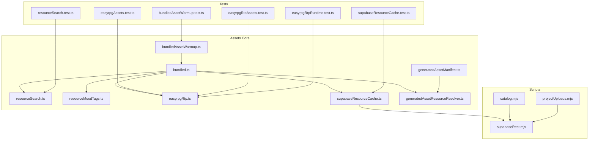

**Diagram sources**
- [src/assets/bundled.ts](file://src/assets/bundled.ts)
- [src/assets/bundledAssetWarmup.ts](file://src/assets/bundledAssetWarmup.ts)
- [src/assets/resourceSearch.ts](file://src/assets/resourceSearch.ts)
- [src/assets/resourceMoodTags.ts](file://src/assets/resourceMoodTags.ts)
- [src/assets/easyrpgRtp.ts](file://src/assets/easyrpgRtp.ts)
- [src/assets/supabaseResourceCache.ts](file://src/assets/supabaseResourceCache.ts)
- [src/assets/generatedAssetManifest.ts](file://src/assets/generatedAssetManifest.ts)
- [src/assets/generatedAssetResourceResolver.ts](file://src/assets/generatedAssetResourceResolver.ts)
- [scripts/supabase-resource-root/catalog.mjs](file://scripts/supabase-resource-root/catalog.mjs)
- [scripts/supabase-resource-root/projectUploads.mjs](file://scripts/supabase-resource-root/projectUploads.mjs)
- [scripts/supabase-resource-root/supabaseRest.mjs](file://scripts/supabase-resource-root/supabaseRest.mjs)
- [test/bundledAssetWarmup.test.ts](file://test/bundledAssetWarmup.test.ts)
- [test/resourceSearch.test.ts](file://test/resourceSearch.test.ts)
- [test/easyrpgAssets.test.ts](file://test/easyrpgAssets.test.ts)
- [test/easyrpgRtpAssets.test.ts](file://test/easyrpgRtpAssets.test.ts)
- [test/easyrpgRtpRuntime.test.ts](file://test/easyrpgRtpRuntime.test.ts)
- [test/supabaseResourceCache.test.ts](file://test/supabaseResourceCache.test.ts)

**Section sources**
- [src/assets/bundled.ts](file://src/assets/bundled.ts)
- [src/assets/bundledAssetWarmup.ts](file://src/assets/bundledAssetWarmup.ts)
- [src/assets/resourceSearch.ts](file://src/assets/resourceSearch.ts)
- [src/assets/resourceMoodTags.ts](file://src/assets/resourceMoodTags.ts)
- [src/assets/easyrpgRtp.ts](file://src/assets/easyrpgRtp.ts)
- [src/assets/supabaseResourceCache.ts](file://src/assets/supabaseResourceCache.ts)
- [src/assets/generatedAssetManifest.ts](file://src/assets/generatedAssetManifest.ts)
- [src/assets/generatedAssetResourceResolver.ts](file://src/assets/generatedAssetResourceResolver.ts)
- [scripts/supabase-resource-root/catalog.mjs](file://scripts/supabase-resource-root/catalog.mjs)
- [scripts/supabase-resource-root/projectUploads.mjs](file://scripts/supabase-resource-root/projectUploads.mjs)
- [scripts/supabase-resource-root/supabaseRest.mjs](file://scripts/supabase-resource-root/supabaseRest.mjs)
- [test/bundledAssetWarmup.test.ts](file://test/bundledAssetWarmup.test.ts)
- [test/resourceSearch.test.ts](file://test/resourceSearch.test.ts)
- [test/easyrpgAssets.test.ts](file://test/easyrpgAssets.test.ts)
- [test/easyrpgRtpAssets.test.ts](file://test/easyrpgRtpAssets.test.ts)
- [test/easyrpgRtpRuntime.test.ts](file://test/easyrpgRtpRuntime.test.ts)
- [test/supabaseResourceCache.test.ts](file://test/supabaseResourceCache.test.ts)

## Core Components
- Asset registry and bundling: centralizes asset metadata and provides lookup APIs.
- Warmup engine: preloads critical assets at startup to reduce first-frame latency.
- Search and mood tagging: indexes assets by semantic tags and supports filtering by mood categories.
- EasyRTP compatibility: maps RPG Maker RTP assets into the runtime’s resource model.
- Supabase cloud cache: caches remote assets and syncs project resources via REST.
- Generated asset manifest and resolver: drives deterministic asset resolution from build-time outputs.

Key responsibilities:
- Discover assets from local bundles and remote sources.
- Categorize assets using mood tags for UI and gameplay use.
- Provide fast search across large catalogs.
- Ensure compatibility with existing RPG Maker content through EasyRTP mapping.
- Cache assets in Supabase for collaborative workflows and faster reloads.
- Warm up frequently used assets during boot.

**Section sources**
- [src/assets/bundled.ts](file://src/assets/bundled.ts)
- [src/assets/bundledAssetWarmup.ts](file://src/assets/bundledAssetWarmup.ts)
- [src/assets/resourceSearch.ts](file://src/assets/resourceSearch.ts)
- [src/assets/resourceMoodTags.ts](file://src/assets/resourceMoodTags.ts)
- [src/assets/easyrpgRtp.ts](file://src/assets/easyrpgRtp.ts)
- [src/assets/supabaseResourceCache.ts](file://src/assets/supabaseResourceCache.ts)
- [src/assets/generatedAssetManifest.ts](file://src/assets/generatedAssetManifest.ts)
- [src/assets/generatedAssetResourceResolver.ts](file://src/assets/generatedAssetResourceResolver.ts)

## Architecture Overview
The resource system composes several layers:
- Registry and Manifest: defines available assets and their metadata.
- Resolver: resolves logical names to concrete resources, considering versions and dependencies.
- Sources: local bundle, EasyRTP compatibility, and Supabase cache.
- Utilities: warmup, search, and mood tagging.

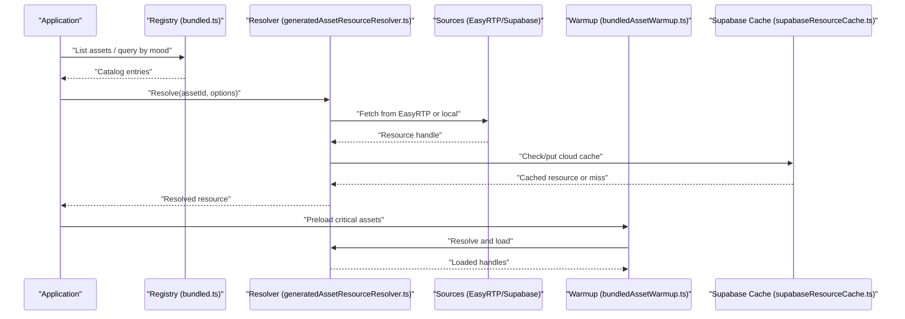

**Diagram sources**
- [src/assets/bundled.ts](file://src/assets/bundled.ts)
- [src/assets/generatedAssetResourceResolver.ts](file://src/assets/generatedAssetResourceResolver.ts)
- [src/assets/easyrpgRtp.ts](file://src/assets/easyrpgRtp.ts)
- [src/assets/supabaseResourceCache.ts](file://src/assets/supabaseResourceCache.ts)
- [src/assets/bundledAssetWarmup.ts](file://src/assets/bundledAssetWarmup.ts)

## Detailed Component Analysis

### Asset Discovery and Cataloging
- Centralized registry exposes asset listings and metadata.
- Generated manifest drives deterministic discovery based on build outputs.
- Resolver uses manifest data to map logical IDs to concrete files.

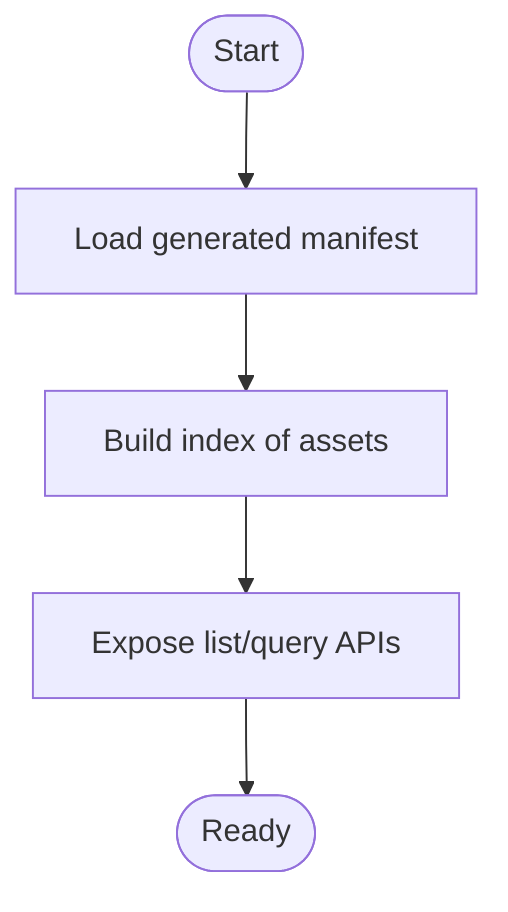

**Diagram sources**
- [src/assets/generatedAssetManifest.ts](file://src/assets/generatedAssetManifest.ts)
- [src/assets/generatedAssetResourceResolver.ts](file://src/assets/generatedAssetResourceResolver.ts)
- [src/assets/bundled.ts](file://src/assets/bundled.ts)

**Section sources**
- [src/assets/generatedAssetManifest.ts](file://src/assets/generatedAssetManifest.ts)
- [src/assets/generatedAssetResourceResolver.ts](file://src/assets/generatedAssetResourceResolver.ts)
- [src/assets/bundled.ts](file://src/assets/bundled.ts)

### Mood-Based Categorization
- Assets are tagged with mood categories to support curated browsing and contextual selection.
- Tagging integrates with search to filter results by mood.

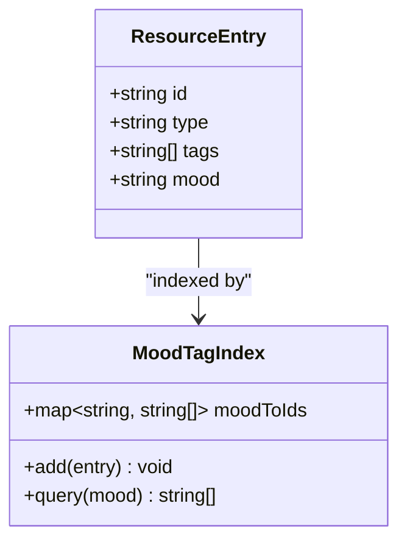

**Diagram sources**
- [src/assets/resourceMoodTags.ts](file://src/assets/resourceMoodTags.ts)
- [src/assets/resourceSearch.ts](file://src/assets/resourceSearch.ts)

**Section sources**
- [src/assets/resourceMoodTags.ts](file://src/assets/resourceMoodTags.ts)
- [src/assets/resourceSearch.ts](file://src/assets/resourceSearch.ts)

### Search Functionality
- Provides keyword and tag-based search over the asset catalog.
- Supports filters such as type, mood, and availability.

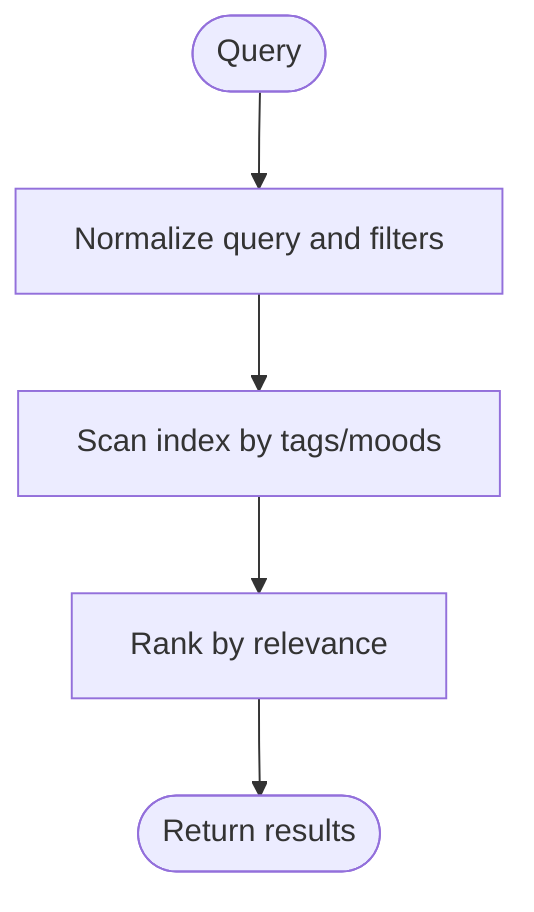

**Diagram sources**
- [src/assets/resourceSearch.ts](file://src/assets/resourceSearch.ts)

**Section sources**
- [src/assets/resourceSearch.ts](file://src/assets/resourceSearch.ts)

### EasyRTP Compatibility Layer
- Maps RPG Maker RTP assets into the runtime’s resource model.
- Enables seamless usage of existing RPG Maker assets without manual conversion.

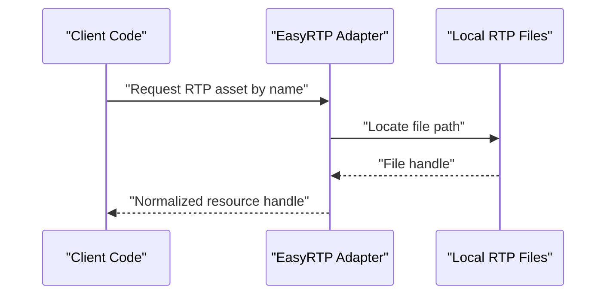

**Diagram sources**
- [src/assets/easyrpgRtp.ts](file://src/assets/easyrpgRtp.ts)

**Section sources**
- [src/assets/easyrpgRtp.ts](file://src/assets/easyrpgRtp.ts)
- [test/easyrpgAssets.test.ts](file://test/easyrpgAssets.test.ts)
- [test/easyrpgRtpAssets.test.ts](file://test/easyrpgRtpAssets.test.ts)
- [test/easyrpgRtpRuntime.test.ts](file://test/easyrpgRtpRuntime.test.ts)

### Bundled Asset Warmup Strategies
- Preloads critical assets during boot to minimize first-frame stalls.
- Uses priority queues and concurrency limits to avoid blocking the main thread.

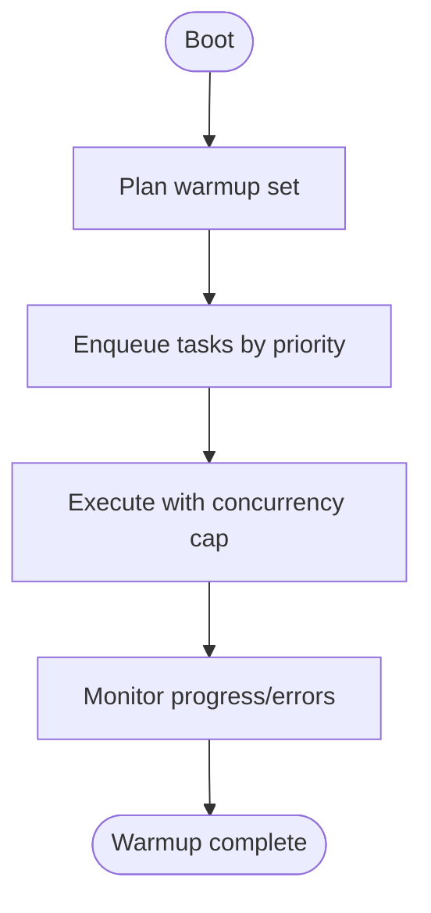

**Diagram sources**
- [src/assets/bundledAssetWarmup.ts](file://src/assets/bundledAssetWarmup.ts)

**Section sources**
- [src/assets/bundledAssetWarmup.ts](file://src/assets/bundledAssetWarmup.ts)
- [test/bundledAssetWarmup.test.ts](file://test/bundledAssetWarmup.test.ts)

### Supabase Cloud Caching
- Caches assets remotely to speed up multi-device collaboration and cold starts.
- Integrates with REST client for upload/download operations.

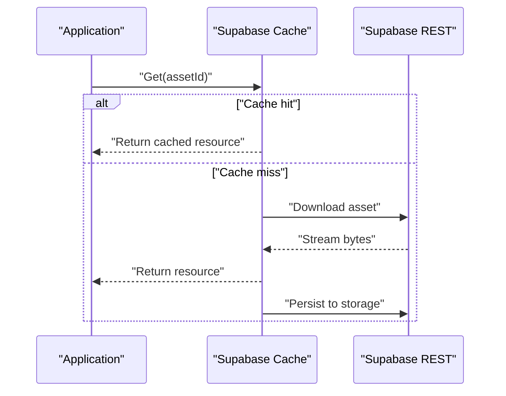

**Diagram sources**
- [src/assets/supabaseResourceCache.ts](file://src/assets/supabaseResourceCache.ts)
- [scripts/supabase-resource-root/supabaseRest.mjs](file://scripts/supabase-resource-root/supabaseRest.mjs)

**Section sources**
- [src/assets/supabaseResourceCache.ts](file://src/assets/supabaseResourceCache.ts)
- [scripts/supabase-resource-root/supabaseRest.mjs](file://scripts/supabase-resource-root/supabaseRest.mjs)
- [scripts/supabase-resource-root/catalog.mjs](file://scripts/supabase-resource-root/catalog.mjs)
- [scripts/supabase-resource-root/projectUploads.mjs](file://scripts/supabase-resource-root/projectUploads.mjs)
- [test/supabaseResourceCache.test.ts](file://test/supabaseResourceCache.test.ts)

### Custom Resource Loaders
- Implement a loader that conforms to the registry’s interface to plug in new sources (e.g., CDN, procedural generation).
- Register the loader with the resolver so it participates in resolution order.

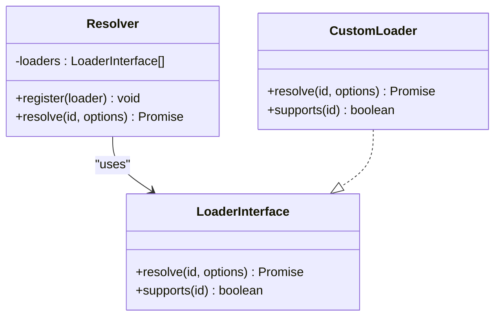

[No sources needed since this diagram shows conceptual loader pattern]

### Memory Optimization Techniques
- Use streaming downloads for large assets.
- Apply texture atlasing and sprite sheet packing where applicable.
- Release references when assets are no longer needed; prefer weak references for caches.
- Limit concurrent loads to prevent memory spikes.

[No sources needed since this section provides general guidance]

### Performance Monitoring
- Benchmark asset loading times and warmup effectiveness.
- Track cache hit rates and network latency.
- Surface metrics for debugging bottlenecks.

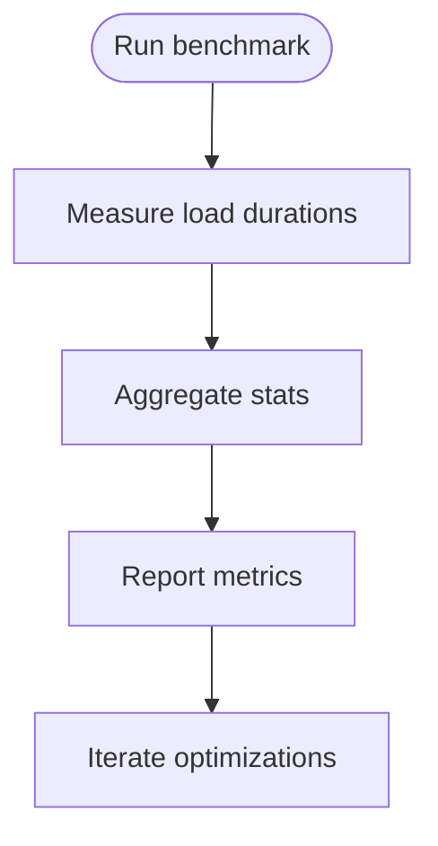

**Diagram sources**
- [scripts/perf-benchmark.mjs](file://scripts/perf-benchmark.mjs)
- [scripts/perf-benchmark-entry.ts](file://scripts/perf-benchmark-entry.ts)

**Section sources**
- [scripts/perf-benchmark.mjs](file://scripts/perf-benchmark.mjs)
- [scripts/perf-benchmark-entry.ts](file://scripts/perf-benchmark-entry.ts)

### Asset Versioning and Dependency Resolution
- Versioned asset IDs ensure stable references across updates.
- Dependency graph tracks prerequisites (e.g., textures required by spritesheets).
- Resolver enforces ordering and avoids loading missing dependencies.

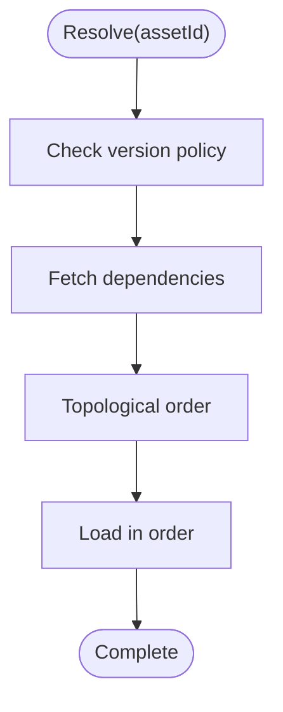

[No sources needed since this diagram shows conceptual workflow]

### Error Handling Patterns
- Wrap network calls with retries and timeouts.
- Provide fallbacks (local bundle if cloud cache fails).
- Emit structured errors with context (assetId, source, reason).

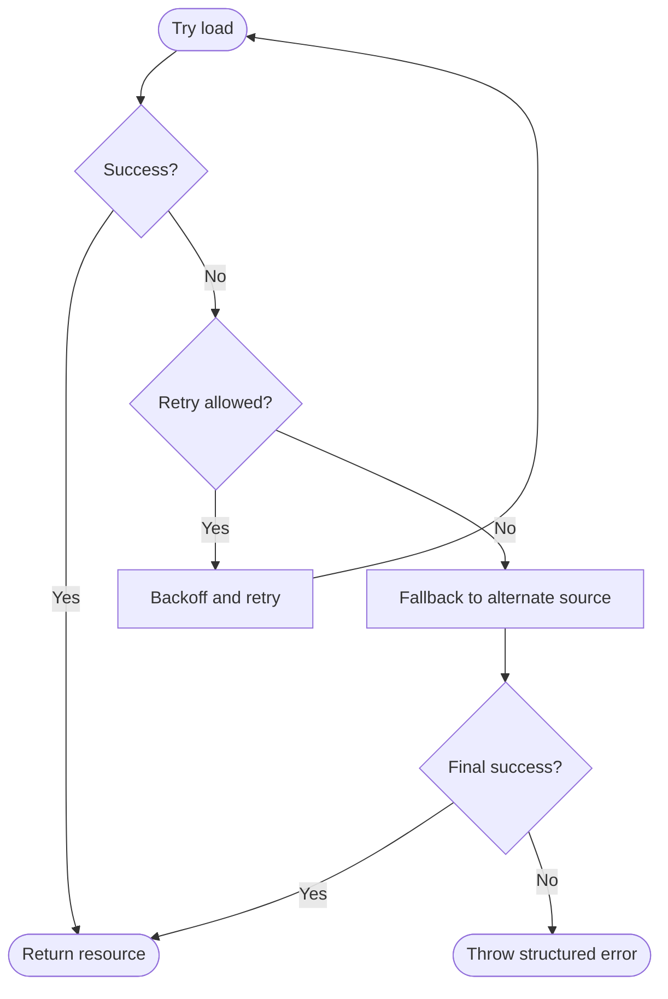

[No sources needed since this diagram shows conceptual workflow]

## Dependency Analysis
The following diagram highlights key dependencies among core modules and supporting scripts/tests.

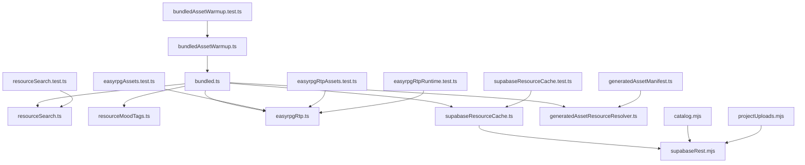

**Diagram sources**
- [src/assets/bundled.ts](file://src/assets/bundled.ts)
- [src/assets/resourceSearch.ts](file://src/assets/resourceSearch.ts)
- [src/assets/resourceMoodTags.ts](file://src/assets/resourceMoodTags.ts)
- [src/assets/easyrpgRtp.ts](file://src/assets/easyrpgRtp.ts)
- [src/assets/supabaseResourceCache.ts](file://src/assets/supabaseResourceCache.ts)
- [src/assets/generatedAssetResourceResolver.ts](file://src/assets/generatedAssetResourceResolver.ts)
- [src/assets/bundledAssetWarmup.ts](file://src/assets/bundledAssetWarmup.ts)
- [src/assets/generatedAssetManifest.ts](file://src/assets/generatedAssetManifest.ts)
- [scripts/supabase-resource-root/supabaseRest.mjs](file://scripts/supabase-resource-root/supabaseRest.mjs)
- [scripts/supabase-resource-root/catalog.mjs](file://scripts/supabase-resource-root/catalog.mjs)
- [scripts/supabase-resource-root/projectUploads.mjs](file://scripts/supabase-resource-root/projectUploads.mjs)
- [test/bundledAssetWarmup.test.ts](file://test/bundledAssetWarmup.test.ts)
- [test/resourceSearch.test.ts](file://test/resourceSearch.test.ts)
- [test/easyrpgAssets.test.ts](file://test/easyrpgAssets.test.ts)
- [test/easyrpgRtpAssets.test.ts](file://test/easyrpgRtpAssets.test.ts)
- [test/easyrpgRtpRuntime.test.ts](file://test/easyrpgRtpRuntime.test.ts)
- [test/supabaseResourceCache.test.ts](file://test/supabaseResourceCache.test.ts)

**Section sources**
- [src/assets/bundled.ts](file://src/assets/bundled.ts)
- [src/assets/resourceSearch.ts](file://src/assets/resourceSearch.ts)
- [src/assets/resourceMoodTags.ts](file://src/assets/resourceMoodTags.ts)
- [src/assets/easyrpgRtp.ts](file://src/assets/easyrpgRtp.ts)
- [src/assets/supabaseResourceCache.ts](file://src/assets/supabaseResourceCache.ts)
- [src/assets/generatedAssetResourceResolver.ts](file://src/assets/generatedAssetResourceResolver.ts)
- [src/assets/bundledAssetWarmup.ts](file://src/assets/bundledAssetWarmup.ts)
- [src/assets/generatedAssetManifest.ts](file://src/assets/generatedAssetManifest.ts)
- [scripts/supabase-resource-root/supabaseRest.mjs](file://scripts/supabase-resource-root/supabaseRest.mjs)
- [scripts/supabase-resource-root/catalog.mjs](file://scripts/supabase-resource-root/catalog.mjs)
- [scripts/supabase-resource-root/projectUploads.mjs](file://scripts/supabase-resource-root/projectUploads.mjs)
- [test/bundledAssetWarmup.test.ts](file://test/bundledAssetWarmup.test.ts)
- [test/resourceSearch.test.ts](file://test/resourceSearch.test.ts)
- [test/easyrpgAssets.test.ts](file://test/easyrpgAssets.test.ts)
- [test/easyrpgRtpAssets.test.ts](file://test/easyrpgRtpAssets.test.ts)
- [test/easyrpgRtpRuntime.test.ts](file://test/easyrpgRtpRuntime.test.ts)
- [test/supabaseResourceCache.test.ts](file://test/supabaseResourceCache.test.ts)

## Performance Considerations
- Prefer warmup for critical paths to reduce first-frame latency.
- Use lazy loading for non-critical assets.
- Batch requests and leverage caching to minimize network overhead.
- Profile with provided benchmarks to identify regressions.

[No sources needed since this section provides general guidance]

## Troubleshooting Guide
Common issues and diagnostics:
- Missing assets: verify manifest integrity and resolver mappings.
- Slow loads: check cache hit rates and adjust warmup sets.
- EasyRTP mismatches: confirm naming conventions and path mappings.
- Network failures: inspect retry/backoff policies and fallbacks.

Validation points:
- Warmup tests confirm preload behavior.
- Search tests validate indexing and filtering.
- EasyRTP tests ensure compatibility.
- Cache tests verify cloud interactions.

**Section sources**
- [test/bundledAssetWarmup.test.ts](file://test/bundledAssetWarmup.test.ts)
- [test/resourceSearch.test.ts](file://test/resourceSearch.test.ts)
- [test/easyrpgAssets.test.ts](file://test/easyrpgAssets.test.ts)
- [test/easyrpgRtpAssets.test.ts](file://test/easyrpgRtpAssets.test.ts)
- [test/easyrpgRtpRuntime.test.ts](file://test/easyrpgRtpRuntime.test.ts)
- [test/supabaseResourceCache.test.ts](file://test/supabaseResourceCache.test.ts)

## Conclusion
The resource management system combines a robust registry, efficient search and mood tagging, EasyRTP compatibility, cloud caching, and proactive warmup to deliver a responsive and extensible asset pipeline. By adhering to versioning and dependency resolution practices and applying the outlined error handling and performance strategies, teams can maintain high-quality user experiences while scaling asset catalogs.

## Appendices
- Example custom loader implementation outline: see “Custom Resource Loaders” above.
- Example warmup configuration: define priority sets and concurrency caps in the warmup module.
- Example search queries: combine keywords with mood and type filters for precise results.

[No sources needed since this section provides general guidance]