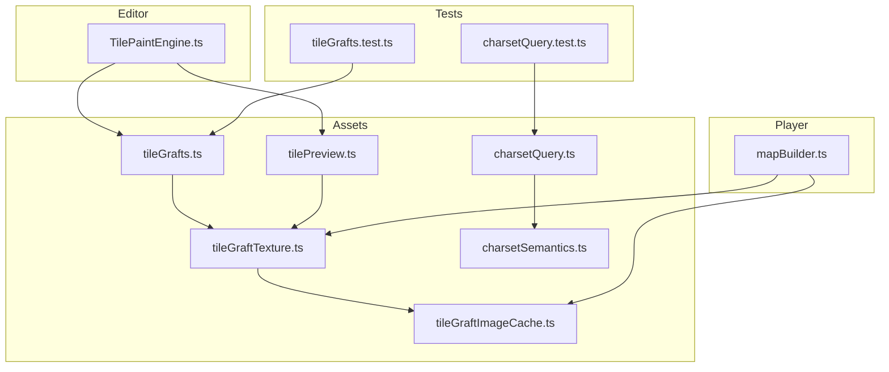
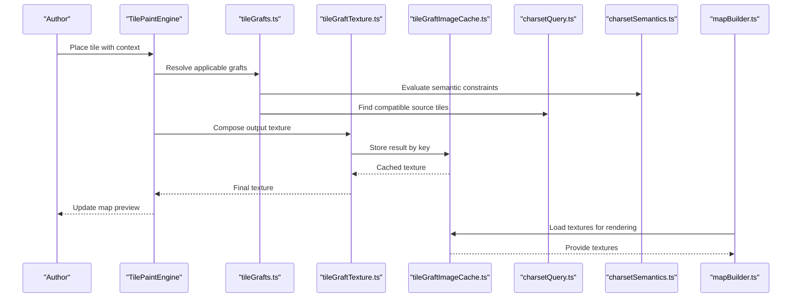
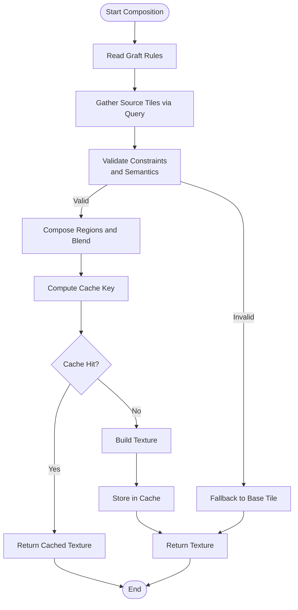
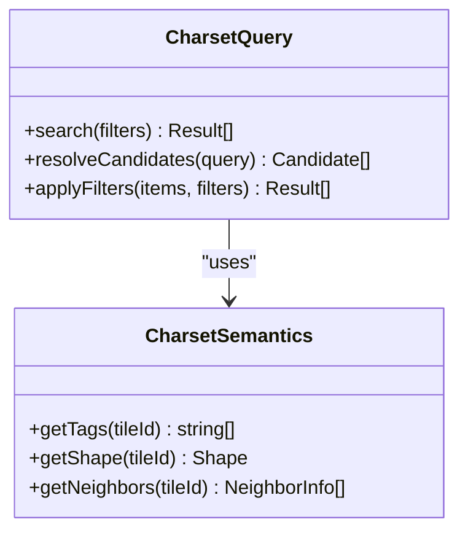
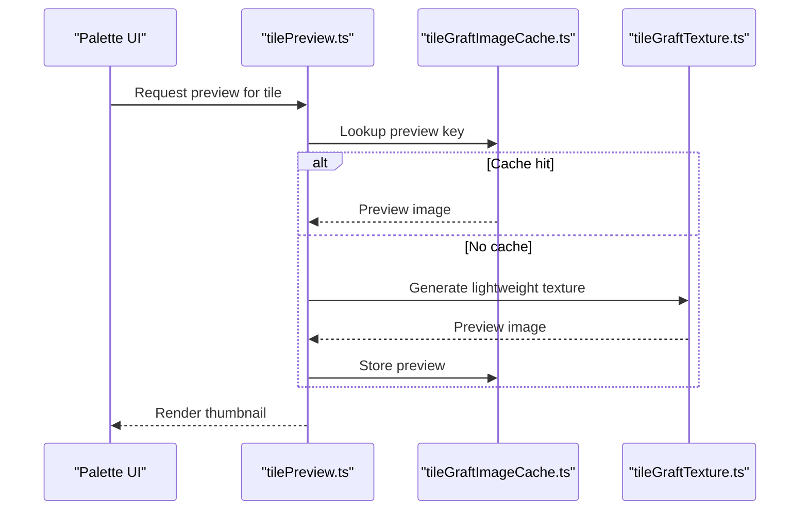
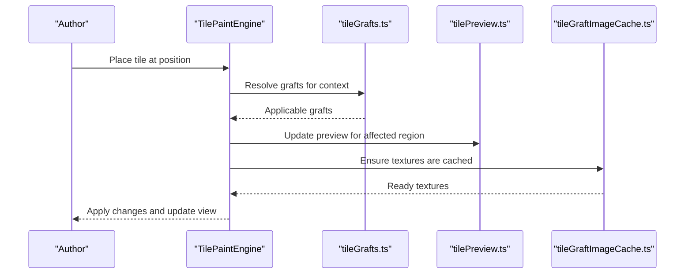
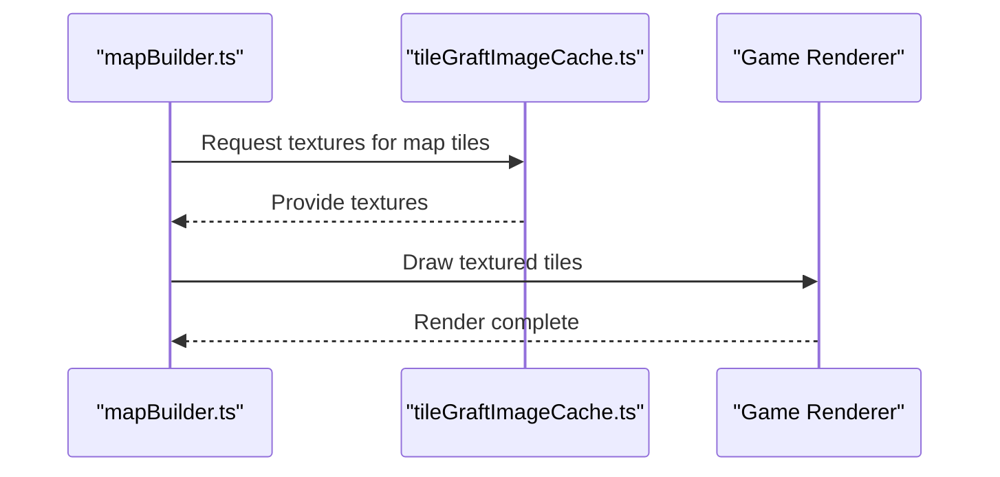
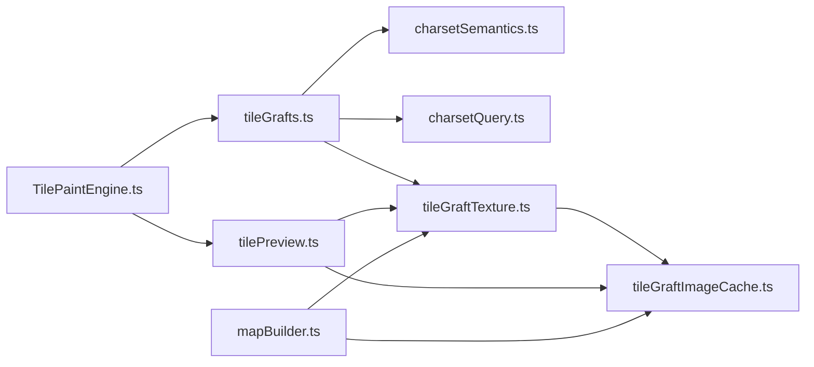

# Tile System and Grafting

<cite>
**Referenced Files in This Document**
- [src/assets/tileGrafts.ts](file://src/assets/tileGrafts.ts)
- [src/assets/tileGraftTexture.ts](file://src/assets/tileGraftTexture.ts)
- [src/assets/tileGraftImageCache.ts](file://src/assets/tileGraftImageCache.ts)
- [src/assets/charsetQuery.ts](file://src/assets/charsetQuery.ts)
- [src/assets/charsetSemantics.ts](file://src/assets/charsetSemantics.ts)
- [src/assets/tilePreview.ts](file://src/assets/tilePreview.ts)
- [src/editor/TilePaintEngine.ts](file://src/editor/TilePaintEngine.ts)
- [src/player/builders/mapBuilder.ts](file://src/player/builders/mapBuilder.ts)
- [test/tileGrafts.test.ts](file://test/tileGrafts.test.ts)
- [test/charsetQuery.test.ts](file://test/charsetQuery.test.ts)
</cite>

## Table of Contents
1. [Introduction](#introduction)
2. [Project Structure](#project-structure)
3. [Core Components](#core-components)
4. [Architecture Overview](#architecture-overview)
5. [Detailed Component Analysis](#detailed-component-analysis)
6. [Dependency Analysis](#dependency-analysis)
7. [Performance Considerations](#performance-considerations)
8. [Troubleshooting Guide](#troubleshooting-guide)
9. [Conclusion](#conclusion)
10. [Appendices](#appendices)

## Introduction
This document explains the tile system architecture and grafting mechanisms, focusing on how tiles are composed, how textures are blended, and how semantic analysis guides placement and rendering. It also documents the charset query system, preview generation, and metadata handling for tiles. Practical examples cover custom tile grafts, semantic tagging, and performance optimization strategies for large tilesets. Finally, it addresses validation, compatibility checking, and debugging tools to help authors and developers maintain robust tile workflows.

## Project Structure
The tile system spans asset preparation, editor painting, runtime rendering, and tests:
- Asset preparation and composition:
  - Graft definitions and texture assembly
  - Image caching for performance
  - Charset querying and semantics
  - Preview generation utilities
- Editor integration:
  - Paint engine that applies grafts during authoring
- Runtime integration:
  - Map builder that consumes prepared assets and metadata
- Tests:
  - Validation and behavior verification for grafts and queries

**Diagram sources**
- [src/assets/tileGrafts.ts](file://src/assets/tileGrafts.ts)
- [src/assets/tileGraftTexture.ts](file://src/assets/tileGraftTexture.ts)
- [src/assets/tileGraftImageCache.ts](file://src/assets/tileGraftImageCache.ts)
- [src/assets/charsetQuery.ts](file://src/assets/charsetQuery.ts)
- [src/assets/charsetSemantics.ts](file://src/assets/charsetSemantics.ts)
- [src/assets/tilePreview.ts](file://src/assets/tilePreview.ts)
- [src/editor/TilePaintEngine.ts](file://src/editor/TilePaintEngine.ts)
- [src/player/builders/mapBuilder.ts](file://src/player/builders/mapBuilder.ts)
- [test/tileGrafts.test.ts](file://test/tileGrafts.test.ts)
- [test/charsetQuery.test.ts](file://test/charsetQuery.test.ts)

**Section sources**
- [src/assets/tileGrafts.ts](file://src/assets/tileGrafts.ts)
- [src/assets/tileGraftTexture.ts](file://src/assets/tileGraftTexture.ts)
- [src/assets/tileGraftImageCache.ts](file://src/assets/tileGraftImageCache.ts)
- [src/assets/charsetQuery.ts](file://src/assets/charsetQuery.ts)
- [src/assets/charsetSemantics.ts](file://src/assets/charsetSemantics.ts)
- [src/assets/tilePreview.ts](file://src/assets/tilePreview.ts)
- [src/editor/TilePaintEngine.ts](file://src/editor/TilePaintEngine.ts)
- [src/player/builders/mapBuilder.ts](file://src/player/builders/mapBuilder.ts)
- [test/tileGrafts.test.ts](file://test/tileGrafts.test.ts)
- [test/charsetQuery.test.ts](file://test/charsetQuery.test.ts)

## Core Components
- Graft definitions: Declarative rules describing how multiple source tiles combine into a single output tile. They define regions, blending modes, and constraints.
- Texture assembly: Composes final textures from source tiles according to graft rules, applying blending and masking.
- Image cache: Stores assembled textures keyed by inputs and parameters to avoid recomputation.
- Charset query: Provides semantic search over character sets (charsets), enabling selection based on tags, shapes, or adjacency patterns.
- Semantics: Encodes meaning for tiles (e.g., floor, wall, door) and relationships used by queries and grafts.
- Preview generation: Produces small previews for palette UI and inspection, often derived from cached textures or lightweight compositions.
- Editor paint engine: Applies grafts interactively during map editing, updating layers and previews in real time.
- Map builder: Consumes prepared textures and metadata at runtime to render maps efficiently.

**Section sources**
- [src/assets/tileGrafts.ts](file://src/assets/tileGrafts.ts)
- [src/assets/tileGraftTexture.ts](file://src/assets/tileGraftTexture.ts)
- [src/assets/tileGraftImageCache.ts](file://src/assets/tileGraftImageCache.ts)
- [src/assets/charsetQuery.ts](file://src/assets/charsetQuery.ts)
- [src/assets/charsetSemantics.ts](file://src/assets/charsetSemantics.ts)
- [src/assets/tilePreview.ts](file://src/assets/tilePreview.ts)
- [src/editor/TilePaintEngine.ts](file://src/editor/TilePaintEngine.ts)
- [src/player/builders/mapBuilder.ts](file://src/player/builders/mapBuilder.ts)

## Architecture Overview
The tile system follows a layered pipeline:
- Authoring layer: Grafts and semantics guide interactive painting and preview.
- Composition layer: Textures are assembled and cached for reuse.
- Query layer: Semantic queries select appropriate tiles or variants.
- Rendering layer: The map builder uses prebuilt textures and metadata for efficient display.

**Diagram sources**
- [src/editor/TilePaintEngine.ts](file://src/editor/TilePaintEngine.ts)
- [src/assets/tileGrafts.ts](file://src/assets/tileGrafts.ts)
- [src/assets/charsetSemantics.ts](file://src/assets/charsetSemantics.ts)
- [src/assets/charsetQuery.ts](file://src/assets/charsetQuery.ts)
- [src/assets/tileGraftTexture.ts](file://src/assets/tileGraftTexture.ts)
- [src/assets/tileGraftImageCache.ts](file://src/assets/tileGraftImageCache.ts)
- [src/player/builders/mapBuilder.ts](file://src/player/builders/mapBuilder.ts)

## Detailed Component Analysis

### Graft Definitions and Composition
Grafts describe multi-tile compositions with regions, masks, and blend modes. They can be conditional based on semantic tags and neighbor contexts. The composition engine reads these rules and produces a unified texture.

**Diagram sources**
- [src/assets/tileGrafts.ts](file://src/assets/tileGrafts.ts)
- [src/assets/tileGraftTexture.ts](file://src/assets/tileGraftTexture.ts)
- [src/assets/tileGraftImageCache.ts](file://src/assets/tileGraftImageCache.ts)
- [src/assets/charsetQuery.ts](file://src/assets/charsetQuery.ts)
- [src/assets/charsetSemantics.ts](file://src/assets/charsetSemantics.ts)

**Section sources**
- [src/assets/tileGrafts.ts](file://src/assets/tileGrafts.ts)
- [src/assets/tileGraftTexture.ts](file://src/assets/tileGraftTexture.ts)
- [src/assets/tileGraftImageCache.ts](file://src/assets/tileGraftImageCache.ts)

### Charset Query System
The charset query system enables semantic searches across charsets. Queries can filter by tags, shapes, adjacency, and other properties. Results feed graft resolution and palette suggestions.

**Diagram sources**
- [src/assets/charsetQuery.ts](file://src/assets/charsetQuery.ts)
- [src/assets/charsetSemantics.ts](file://src/assets/charsetSemantics.ts)

**Section sources**
- [src/assets/charsetQuery.ts](file://src/assets/charsetQuery.ts)
- [src/assets/charsetSemantics.ts](file://src/assets/charsetSemantics.ts)

### Preview Generation
Previews provide quick visual feedback in the editor and palette. They may use cached textures or lightweight compositions to keep UI responsive.

**Diagram sources**
- [src/assets/tilePreview.ts](file://src/assets/tilePreview.ts)
- [src/assets/tileGraftImageCache.ts](file://src/assets/tileGraftImageCache.ts)
- [src/assets/tileGraftTexture.ts](file://src/assets/tileGraftTexture.ts)

**Section sources**
- [src/assets/tilePreview.ts](file://src/assets/tilePreview.ts)
- [src/assets/tileGraftImageCache.ts](file://src/assets/tileGraftImageCache.ts)
- [src/assets/tileGraftTexture.ts](file://src/assets/tileGraftTexture.ts)

### Editor Integration
The paint engine integrates grafts and previews into the authoring workflow. When an author places a tile, the engine resolves relevant grafts, composes textures, updates previews, and persists metadata.

**Diagram sources**
- [src/editor/TilePaintEngine.ts](file://src/editor/TilePaintEngine.ts)
- [src/assets/tileGrafts.ts](file://src/assets/tileGrafts.ts)
- [src/assets/tilePreview.ts](file://src/assets/tilePreview.ts)
- [src/assets/tileGraftImageCache.ts](file://src/assets/tileGraftImageCache.ts)

**Section sources**
- [src/editor/TilePaintEngine.ts](file://src/editor/TilePaintEngine.ts)
- [src/assets/tileGrafts.ts](file://src/assets/tileGrafts.ts)
- [src/assets/tilePreview.ts](file://src/assets/tilePreview.ts)
- [src/assets/tileGraftImageCache.ts](file://src/assets/tileGraftImageCache.ts)

### Runtime Rendering
At runtime, the map builder consumes prebuilt textures and metadata to render maps efficiently. It relies on the cache to fetch ready-to-draw textures without recomposition.

**Diagram sources**
- [src/player/builders/mapBuilder.ts](file://src/player/builders/mapBuilder.ts)
- [src/assets/tileGraftImageCache.ts](file://src/assets/tileGraftImageCache.ts)

**Section sources**
- [src/player/builders/mapBuilder.ts](file://src/player/builders/mapBuilder.ts)
- [src/assets/tileGraftImageCache.ts](file://src/assets/tileGraftImageCache.ts)

### Custom Tile Grafts and Semantic Tagging
Authors can define custom grafts to create complex tiles from simpler ones. Semantic tags guide which source tiles are eligible and how they should blend. Examples include:
- Road junctions combining straight and corner segments based on adjacency.
- Wall frames merging base walls with decorative overlays using masks.
- Floor transitions blending two materials with smooth gradients.

Semantic tagging involves assigning meaningful labels (e.g., “floor”, “wall”, “door”) to tiles so queries can find compatible pieces and grafts can enforce logical constraints.

**Section sources**
- [src/assets/tileGrafts.ts](file://src/assets/tileGrafts.ts)
- [src/assets/charsetSemantics.ts](file://src/assets/charsetSemantics.ts)
- [src/assets/charsetQuery.ts](file://src/assets/charsetQuery.ts)

### Tile Metadata Handling
Metadata includes semantic tags, shape descriptors, neighbor relations, and composition hints. It is used by:
- Queries to filter and rank candidates.
- Grafts to validate placement and choose blends.
- Previews to generate accurate thumbnails.
- Runtime builders to optimize draw calls and batching.

**Section sources**
- [src/assets/charsetSemantics.ts](file://src/assets/charsetSemantics.ts)
- [src/assets/charsetQuery.ts](file://src/assets/charsetQuery.ts)
- [src/assets/tilePreview.ts](file://src/assets/tilePreview.ts)
- [src/player/builders/mapBuilder.ts](file://src/player/builders/mapBuilder.ts)

## Dependency Analysis
The following diagram shows core dependencies among tile system modules:

**Diagram sources**
- [src/assets/tileGrafts.ts](file://src/assets/tileGrafts.ts)
- [src/assets/charsetSemantics.ts](file://src/assets/charsetSemantics.ts)
- [src/assets/charsetQuery.ts](file://src/assets/charsetQuery.ts)
- [src/assets/tileGraftTexture.ts](file://src/assets/tileGraftTexture.ts)
- [src/assets/tileGraftImageCache.ts](file://src/assets/tileGraftImageCache.ts)
- [src/assets/tilePreview.ts](file://src/assets/tilePreview.ts)
- [src/editor/TilePaintEngine.ts](file://src/editor/TilePaintEngine.ts)
- [src/player/builders/mapBuilder.ts](file://src/player/builders/mapBuilder.ts)

**Section sources**
- [src/assets/tileGrafts.ts](file://src/assets/tileGrafts.ts)
- [src/assets/charsetSemantics.ts](file://src/assets/charsetSemantics.ts)
- [src/assets/charsetQuery.ts](file://src/assets/charsetQuery.ts)
- [src/assets/tileGraftTexture.ts](file://src/assets/tileGraftTexture.ts)
- [src/assets/tileGraftImageCache.ts](file://src/assets/tileGraftImageCache.ts)
- [src/assets/tilePreview.ts](file://src/assets/tilePreview.ts)
- [src/editor/TilePaintEngine.ts](file://src/editor/TilePaintEngine.ts)
- [src/player/builders/mapBuilder.ts](file://src/player/builders/mapBuilder.ts)

## Performance Considerations
- Cache aggressively: Use stable keys for composed textures to avoid recomputation.
- Batch drawing: Prefer fewer, larger textures when possible to reduce draw calls.
- Lazy loading: Generate previews and textures on demand rather than upfront.
- Limit scope: Restrict graft resolution to local neighborhoods to reduce complexity.
- Normalize inputs: Canonicalize tile IDs and parameters to maximize cache hits.
- Profile hot paths: Monitor composition and cache lookup times during heavy edits.

[No sources needed since this section provides general guidance]

## Troubleshooting Guide
Common issues and diagnostics:
- Graft conflicts: When multiple grafts match, ensure priority rules and constraints disambiguate outcomes.
- Missing previews: Verify preview keys align with cache keys; regenerate if necessary.
- Slow composition: Inspect cache miss rates and consider simplifying graft rules or increasing cache size.
- Semantic mismatches: Review tag assignments and neighbor relations to ensure queries return expected results.
- Compatibility checks: Validate that new grafts do not break existing map layouts or runtime expectations.

Use tests to validate behavior:
- Graft behavior and edge cases
- Charset query correctness and performance

**Section sources**
- [test/tileGrafts.test.ts](file://test/tileGrafts.test.ts)
- [test/charsetQuery.test.ts](file://test/charsetQuery.test.ts)

## Conclusion
The tile system combines declarative grafts, semantic queries, and efficient caching to support rich tile composition and seamless authoring experiences. By leveraging semantic tagging and robust previews, authors can craft complex visuals while maintaining performance. Proper validation and testing ensure compatibility and reliability across large tilesets.

[No sources needed since this section summarizes without analyzing specific files]

## Appendices

### Example Workflows
- Custom road junction graft:
  - Define regions for straight and corner segments.
  - Add semantic tags for “road” and “junction”.
  - Use queries to select compatible neighbors.
  - Compose and cache the resulting texture.
- Wall frame overlay:
  - Create base wall tiles and decorative overlays.
  - Assign tags like “wall”, “frame”, “corner”.
  - Configure graft masks and blend modes.
  - Generate previews for palette selection.

[No sources needed since this section provides conceptual examples]