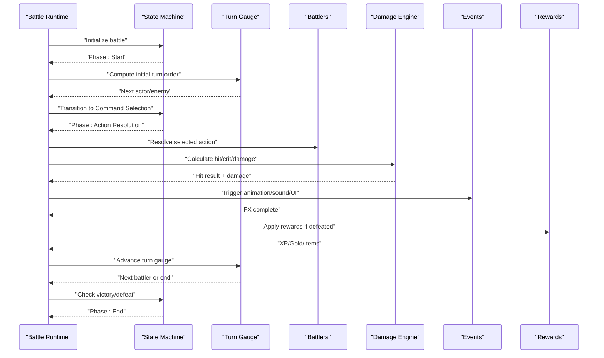
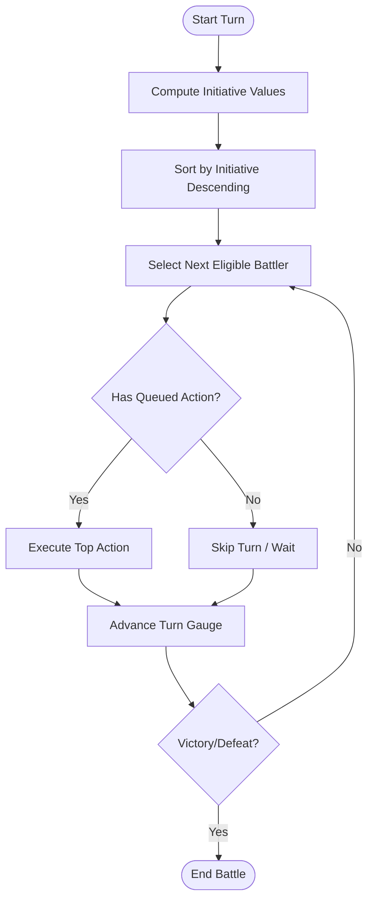
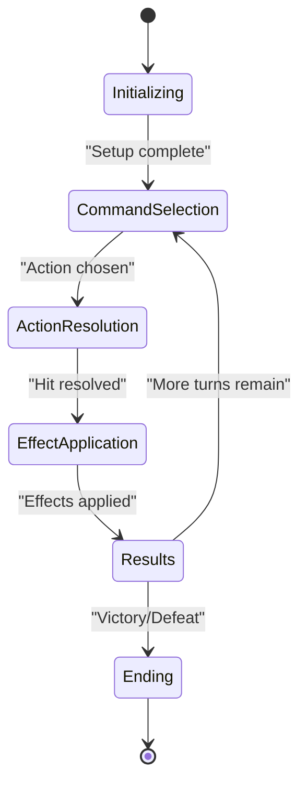
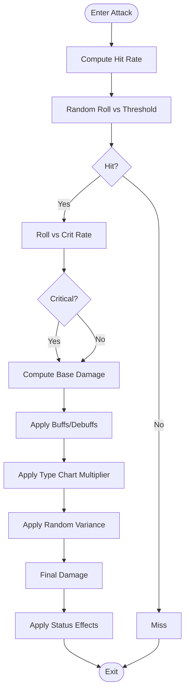
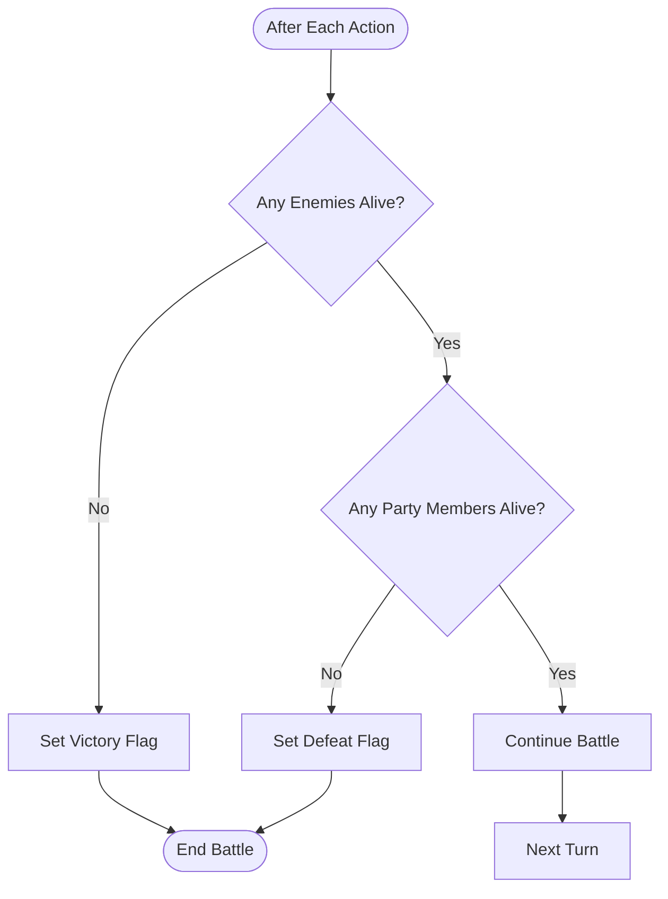
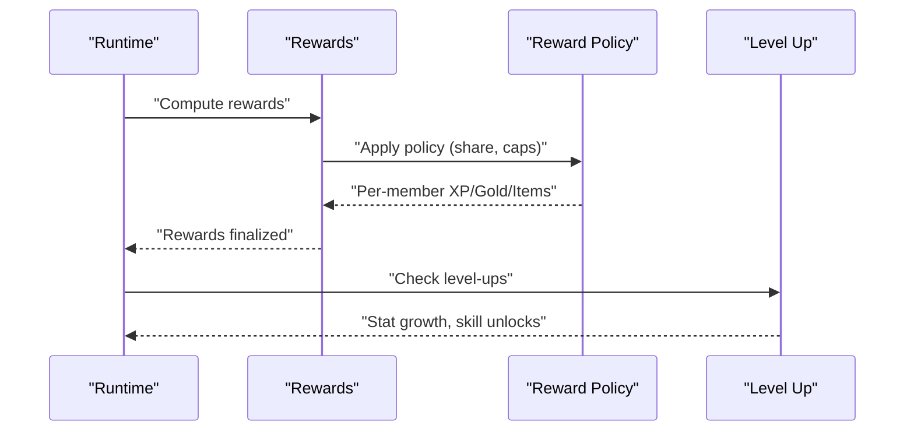
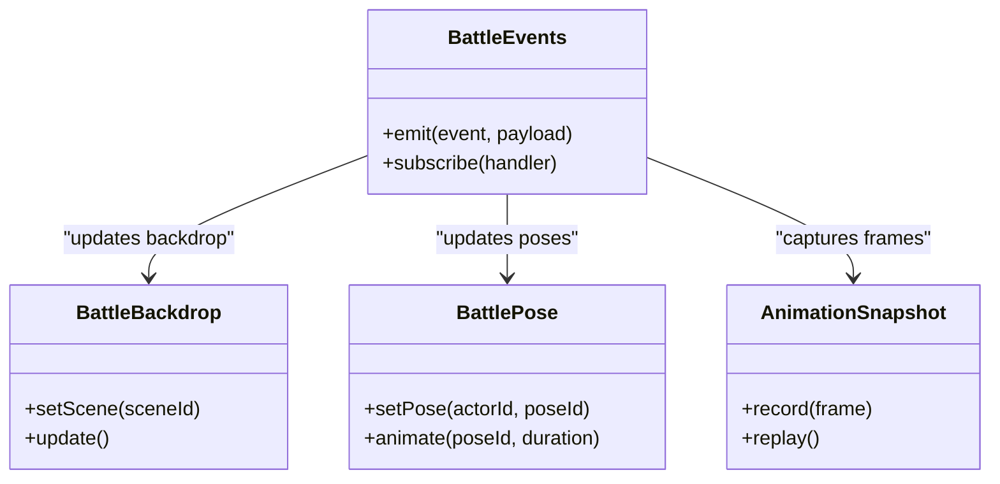
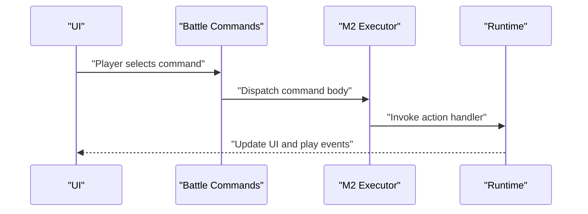
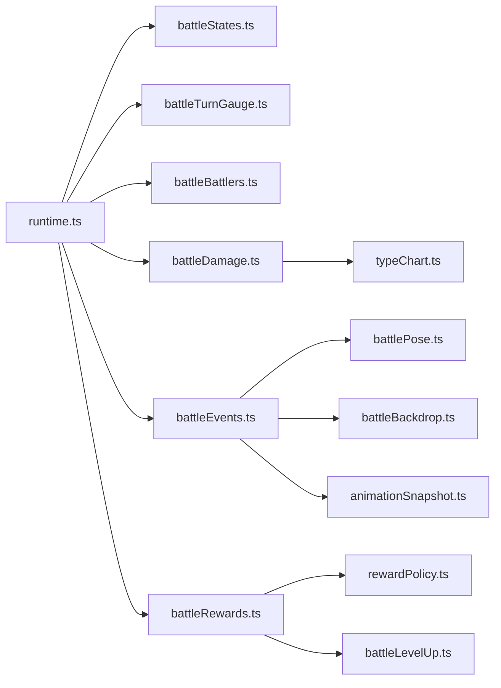

# Battle Mechanics and Combat Logic

<cite>
**Referenced Files in This Document**
- [runtime.ts](file://src/battle/runtime.ts)
- [battleRuntimeAdvance.ts](file://src/battle/battleRuntimeAdvance.ts)
- [battleStates.ts](file://src/battle/battleStates.ts)
- [battleTurnGauge.ts](file://src/battle/battleTurnGauge.ts)
- [battleDamage.ts](file://src/battle/battleDamage.ts)
- [battleBattlers.ts](file://src/battle/battleBattlers.ts)
- [battleEvents.ts](file://src/battle/battleEvents.ts)
- [battleRewards.ts](file://src/battle/battleRewards.ts)
- [rewardPolicy.ts](file://src/battle/rewardPolicy.ts)
- [battleLevelUp.ts](file://src/battle/battleLevelUp.ts)
- [typeChart.ts](file://src/battle/typeChart.ts)
- [battlePose.ts](file://src/battle/battlePose.ts)
- [battleBackdrop.ts](file://src/battle/battleBackdrop.ts)
- [animationSnapshot.ts](file://src/battle/animationSnapshot.ts)
- [battlePredict.ts](file://src/battle/battlePredict.ts)
- [simulate.ts](file://src/battle/simulate.ts)
- [battleM2CommandExecutor.ts](file://src/battle/battleM2CommandExecutor.ts)
- [battleM2Commands.ts](file://src/battle/battleM2Commands.ts)
- [battleCommands.ts](file://src/battle/battleCommands.ts)
</cite>

## Table of Contents
1. [Introduction](#introduction)
2. [Project Structure](#project-structure)
3. [Core Components](#core-components)
4. [Architecture Overview](#architecture-overview)
5. [Detailed Component Analysis](#detailed-component-analysis)
6. [Dependency Analysis](#dependency-analysis)
7. [Performance Considerations](#performance-considerations)
8. [Troubleshooting Guide](#troubleshooting-guide)
9. [Conclusion](#conclusion)
10. [Appendices](#appendices)

## Introduction
This document explains the turn-based combat engine, including turn order calculation, action queue management, state transitions between battle phases, damage and hit rate formulas, critical hits, status effects, victory/defeat conditions, experience and reward processing, and the event system for animations, sound, and UI updates. It also provides guidance on customizing combat formulas, implementing special abilities, and designing balanced encounters.

## Project Structure
The battle subsystem is organized into focused modules:
- Runtime orchestration and phase control
- Turn gauge and action scheduling
- Battler model and state
- Damage, crits, accuracy, and type interactions
- Rewards, XP, and level-up
- Eventing for animations, sounds, and UI
- Command execution and simulation utilities

```mermaid
graph TB
subgraph "Battle Core"
R["runtime.ts"]
S["battleStates.ts"]
A["battleRuntimeAdvance.ts"]
T["battleTurnGauge.ts"]
end
subgraph "Entities"
B["battleBattlers.ts"]
P["battlePose.ts"]
D["battleDamage.ts"]
Y["typeChart.ts"]
end
subgraph "Rewards & Growth"
RW["battleRewards.ts"]
RP["rewardPolicy.ts"]
LU["battleLevelUp.ts"]
end
subgraph "Events & FX"
E["battleEvents.ts"]
BS["battleBackdrop.ts"]
AN["animationSnapshot.ts"]
end
subgraph "Tools"
PR["battlePredict.ts"]
SIM["simulate.ts"]
M2E["battleM2CommandExecutor.ts"]
M2C["battleM2Commands.ts"]
BC["battleCommands.ts"]
end
R --> S
R --> A
R --> T
R --> B
R --> D
R --> E
R --> RW
R --> RP
R --> LU
R --> Y
R --> P
R --> BS
R --> AN
R --> PR
R --> SIM
R --> M2E
R --> M2C
R --> BC
```

**Diagram sources**
- [runtime.ts](file://src/battle/runtime.ts)
- [battleStates.ts](file://src/battle/battleStates.ts)
- [battleRuntimeAdvance.ts](file://src/battle/battleRuntimeAdvance.ts)
- [battleTurnGauge.ts](file://src/battle/battleTurnGauge.ts)
- [battleBattlers.ts](file://src/battle/battleBattlers.ts)
- [battleDamage.ts](file://src/battle/battleDamage.ts)
- [typeChart.ts](file://src/battle/typeChart.ts)
- [battleRewards.ts](file://src/battle/battleRewards.ts)
- [rewardPolicy.ts](file://src/battle/rewardPolicy.ts)
- [battleLevelUp.ts](file://src/battle/battleLevelUp.ts)
- [battleEvents.ts](file://src/battle/battleEvents.ts)
- [battlePose.ts](file://src/battle/battlePose.ts)
- [battleBackdrop.ts](file://src/battle/battleBackdrop.ts)
- [animationSnapshot.ts](file://src/battle/animationSnapshot.ts)
- [battlePredict.ts](file://src/battle/battlePredict.ts)
- [simulate.ts](file://src/battle/simulate.ts)
- [battleM2CommandExecutor.ts](file://src/battle/battleM2CommandExecutor.ts)
- [battleM2Commands.ts](file://src/battle/battleM2Commands.ts)
- [battleCommands.ts](file://src/battle/battleCommands.ts)

**Section sources**
- [runtime.ts](file://src/battle/runtime.ts)
- [battleStates.ts](file://src/battle/battleStates.ts)
- [battleRuntimeAdvance.ts](file://src/battle/battleRuntimeAdvance.ts)
- [battleTurnGauge.ts](file://src/battle/battleTurnGauge.ts)
- [battleBattlers.ts](file://src/battle/battleBattlers.ts)
- [battleDamage.ts](file://src/battle/battleDamage.ts)
- [typeChart.ts](file://src/battle/typeChart.ts)
- [battleRewards.ts](file://src/battle/battleRewards.ts)
- [rewardPolicy.ts](file://src/battle/rewardPolicy.ts)
- [battleLevelUp.ts](file://src/battle/battleLevelUp.ts)
- [battleEvents.ts](file://src/battle/battleEvents.ts)
- [battlePose.ts](file://src/battle/battlePose.ts)
- [battleBackdrop.ts](file://src/battle/battleBackdrop.ts)
- [animationSnapshot.ts](file://src/battle/animationSnapshot.ts)
- [battlePredict.ts](file://src/battle/battlePredict.ts)
- [simulate.ts](file://src/battle/simulate.ts)
- [battleM2CommandExecutor.ts](file://src/battle/battleM2CommandExecutor.ts)
- [battleM2Commands.ts](file://src/battle/battleM2Commands.ts)
- [battleCommands.ts](file://src/battle/battleCommands.ts)

## Core Components
- Battle runtime: central controller that owns the current phase, manages the turn gauge, advances turns, and coordinates events and rewards.
- State machine: defines discrete phases (e.g., start, command selection, action resolution, results, end) and transitions.
- Turn gauge: computes initiative and schedules battlers’ actions across turns.
- Battlers: models for actors and enemies with stats, HP/MP, statuses, and positions.
- Damage engine: calculates raw damage, applies modifiers (type chart, buffs/debuffs), determines hit/miss, crit chance, and final damage.
- Rewards: XP, gold, items; policy-driven distribution and leveling.
- Events: triggers for animations, sounds, and UI updates during combat.
- Tools: prediction and headless simulation for testing and balancing.

**Section sources**
- [runtime.ts](file://src/battle/runtime.ts)
- [battleStates.ts](file://src/battle/battleStates.ts)
- [battleTurnGauge.ts](file://src/battle/battleTurnGauge.ts)
- [battleBattlers.ts](file://src/battle/battleBattlers.ts)
- [battleDamage.ts](file://src/battle/battleDamage.ts)
- [battleRewards.ts](file://src/battle/battleRewards.ts)
- [rewardPolicy.ts](file://src/battle/rewardPolicy.ts)
- [battleLevelUp.ts](file://src/battle/battleLevelUp.ts)
- [battleEvents.ts](file://src/battle/battleEvents.ts)

## Architecture Overview
The combat engine follows a phased loop driven by a turn gauge. The runtime orchestrates state transitions, while specialized modules handle domain logic (damage, rewards, events).

**Diagram sources**
- [runtime.ts](file://src/battle/runtime.ts)
- [battleStates.ts](file://src/battle/battleStates.ts)
- [battleTurnGauge.ts](file://src/battle/battleTurnGauge.ts)
- [battleBattlers.ts](file://src/battle/battleBattlers.ts)
- [battleDamage.ts](file://src/battle/battleDamage.ts)
- [battleEvents.ts](file://src/battle/battleEvents.ts)
- [battleRewards.ts](file://src/battle/battleRewards.ts)

## Detailed Component Analysis

### Turn Order and Action Queue
- Initiative computation: each battler’s speed and modifiers determine a turn value; the highest acts first.
- Turn gauge advancement: after an action resolves, the gauge increments and selects the next eligible battler.
- Action queue: pending commands are queued per battler; when a battler’s turn arrives, the top command is executed.
- Interruptions: certain skills or states can reorder or cancel queued actions.

**Diagram sources**
- [battleTurnGauge.ts](file://src/battle/battleTurnGauge.ts)
- [battleRuntimeAdvance.ts](file://src/battle/battleRuntimeAdvance.ts)
- [battleStates.ts](file://src/battle/battleStates.ts)

**Section sources**
- [battleTurnGauge.ts](file://src/battle/battleTurnGauge.ts)
- [battleRuntimeAdvance.ts](file://src/battle/battleRuntimeAdvance.ts)
- [battleStates.ts](file://src/battle/battleStates.ts)

### State Transitions Between Phases
- Phases include: initialization, command selection, action resolution, effect application, results, and end.
- Transitions are guarded by preconditions (e.g., all battlers must be alive for end-of-turn checks).
- The state machine ensures deterministic progression and prevents invalid jumps.

**Diagram sources**
- [battleStates.ts](file://src/battle/battleStates.ts)
- [battleRuntimeAdvance.ts](file://src/battle/battleRuntimeAdvance.ts)

**Section sources**
- [battleStates.ts](file://src/battle/battleStates.ts)
- [battleRuntimeAdvance.ts](file://src/battle/battleRuntimeAdvance.ts)

### Damage Calculation, Hit Rate, Critical Hits, and Status Effects
- Hit rate: base accuracy modified by evasion, buffs/debuffs, and random roll against threshold.
- Critical hits: determined by crit rate; multipliers increase final damage.
- Damage formula: base power scaled by attacker/defender stats, element/type effectiveness, and random variance.
- Status effects: applied post-hit; may alter stats, cause tick damage, or restrict actions.

**Diagram sources**
- [battleDamage.ts](file://src/battle/battleDamage.ts)
- [typeChart.ts](file://src/battle/typeChart.ts)
- [battleBattlers.ts](file://src/battle/battleBattlers.ts)

**Section sources**
- [battleDamage.ts](file://src/battle/battleDamage.ts)
- [typeChart.ts](file://src/battle/typeChart.ts)
- [battleBattlers.ts](file://src/battle/battleBattlers.ts)

### Victory and Defeat Conditions
- Victory: all enemy battlers defeated.
- Defeat: all player party members defeated.
- Early exit: forced retreat or escape success.

**Diagram sources**
- [battleRuntimeAdvance.ts](file://src/battle/battleRuntimeAdvance.ts)
- [battleStates.ts](file://src/battle/battleStates.ts)

**Section sources**
- [battleRuntimeAdvance.ts](file://src/battle/battleRuntimeAdvance.ts)
- [battleStates.ts](file://src/battle/battleStates.ts)

### Experience Points, Level-Up, and Reward Processing
- XP distribution: total XP divided among surviving party members according to policy.
- Gold/items: computed from encounter definitions and randomized within ranges.
- Level-up: when XP thresholds are met, stats grow and skills may unlock.

**Diagram sources**
- [battleRewards.ts](file://src/battle/battleRewards.ts)
- [rewardPolicy.ts](file://src/battle/rewardPolicy.ts)
- [battleLevelUp.ts](file://src/battle/battleLevelUp.ts)

**Section sources**
- [battleRewards.ts](file://src/battle/battleRewards.ts)
- [rewardPolicy.ts](file://src/battle/rewardPolicy.ts)
- [battleLevelUp.ts](file://src/battle/battleLevelUp.ts)

### Battle Event System (Animations, Sound, UI)
- Events are emitted at key moments: attack start, hit/miss, critical, damage numbers, status apply, KO, victory/defeat.
- Backdrops and poses update to reflect context (e.g., facing direction, stance).
- Animation snapshots capture frames for replay or debugging.

**Diagram sources**
- [battleEvents.ts](file://src/battle/battleEvents.ts)
- [battleBackdrop.ts](file://src/battle/battleBackdrop.ts)
- [battlePose.ts](file://src/battle/battlePose.ts)
- [animationSnapshot.ts](file://src/battle/animationSnapshot.ts)

**Section sources**
- [battleEvents.ts](file://src/battle/battleEvents.ts)
- [battleBackdrop.ts](file://src/battle/battleBackdrop.ts)
- [battlePose.ts](file://src/battle/battlePose.ts)
- [animationSnapshot.ts](file://src/battle/animationSnapshot.ts)

### Command Execution and Special Abilities
- Commands define available actions (attack, skill, item, flee).
- M2 command executor bridges database-defined commands to runtime actions.
- Special abilities are implemented as command handlers that modify targets, stats, or trigger additional effects.

**Diagram sources**
- [battleCommands.ts](file://src/battle/battleCommands.ts)
- [battleM2CommandExecutor.ts](file://src/battle/battleM2CommandExecutor.ts)
- [battleM2Commands.ts](file://src/battle/battleM2Commands.ts)
- [battleRuntimeAdvance.ts](file://src/battle/battleRuntimeAdvance.ts)

**Section sources**
- [battleCommands.ts](file://src/battle/battleCommands.ts)
- [battleM2CommandExecutor.ts](file://src/battle/battleM2CommandExecutor.ts)
- [battleM2Commands.ts](file://src/battle/battleM2Commands.ts)
- [battleRuntimeAdvance.ts](file://src/battle/battleRuntimeAdvance.ts)

## Dependency Analysis
High-level dependencies:
- Runtime depends on states, turn gauge, battlers, damage, events, and rewards.
- Damage depends on battler stats and type chart.
- Rewards depend on policy and level-up logic.
- Events coordinate backdrop, pose, and animation snapshotting.

**Diagram sources**
- [runtime.ts](file://src/battle/runtime.ts)
- [battleStates.ts](file://src/battle/battleStates.ts)
- [battleTurnGauge.ts](file://src/battle/battleTurnGauge.ts)
- [battleBattlers.ts](file://src/battle/battleBattlers.ts)
- [battleDamage.ts](file://src/battle/battleDamage.ts)
- [typeChart.ts](file://src/battle/typeChart.ts)
- [battleEvents.ts](file://src/battle/battleEvents.ts)
- [battleRewards.ts](file://src/battle/battleRewards.ts)
- [rewardPolicy.ts](file://src/battle/rewardPolicy.ts)
- [battleLevelUp.ts](file://src/battle/battleLevelUp.ts)
- [battlePose.ts](file://src/battle/battlePose.ts)
- [battleBackdrop.ts](file://src/battle/battleBackdrop.ts)
- [animationSnapshot.ts](file://src/battle/animationSnapshot.ts)

**Section sources**
- [runtime.ts](file://src/battle/runtime.ts)
- [battleDamage.ts](file://src/battle/battleDamage.ts)
- [battleRewards.ts](file://src/battle/battleRewards.ts)
- [battleEvents.ts](file://src/battle/battleEvents.ts)

## Performance Considerations
- Keep damage calculations O(1) per hit; avoid heavy allocations inside hot paths.
- Batch event emissions to reduce UI churn; coalesce pose/backdrop updates.
- Use deterministic RNG seeds for reproducible simulations and tests.
- Precompute static tables (e.g., type charts) once at load time.
- Avoid deep recursion in AI decision-making; prefer iterative schedulers.

[No sources needed since this section provides general guidance]

## Troubleshooting Guide
Common issues and diagnostics:
- Stuck in a phase: verify state transition guards and ensure required preconditions are met.
- Incorrect damage: check stat modifiers, type effectiveness, and variance bounds.
- Missing events: confirm event emission points and subscription handlers.
- Unbalanced encounters: use prediction and headless simulation to validate difficulty curves.

Useful tools:
- Prediction module for expected outcomes under given parameters.
- Headless simulator for automated runs and regression tests.
- Animation snapshot playback to inspect frame timing and sequence correctness.

**Section sources**
- [battlePredict.ts](file://src/battle/battlePredict.ts)
- [simulate.ts](file://src/battle/simulate.ts)
- [animationSnapshot.ts](file://src/battle/animationSnapshot.ts)

## Conclusion
The battle system is modular and extensible: a clear runtime drives a state machine, a turn gauge schedules actions, and dedicated modules implement damage, rewards, and events. By adjusting formulas, policies, and command handlers, designers can fine-tune feel and balance while maintaining a robust, testable core.

[No sources needed since this section summarizes without analyzing specific files]

## Appendices

### Customizing Combat Formulas
- Modify damage scaling factors and variance ranges in the damage module.
- Adjust crit thresholds and multipliers for desired frequency and impact.
- Tune accuracy/evasion modifiers to influence pacing and risk.

**Section sources**
- [battleDamage.ts](file://src/battle/battleDamage.ts)

### Implementing Special Abilities
- Define new command bodies and map them via the M2 command executor.
- Hook into event emission to provide unique animations and sounds.
- Ensure abilities integrate with status effects and buff/debuff systems.

**Section sources**
- [battleM2CommandExecutor.ts](file://src/battle/battleM2CommandExecutor.ts)
- [battleM2Commands.ts](file://src/battle/battleM2Commands.ts)
- [battleEvents.ts](file://src/battle/battleEvents.ts)

### Balanced Encounter Design Patterns
- Use reward policy to scale XP/gold based on party size and difficulty.
- Employ prediction and simulation to validate win rates and average turns.
- Introduce variety through enemy compositions, types, and status strategies.

**Section sources**
- [rewardPolicy.ts](file://src/battle/rewardPolicy.ts)
- [battlePredict.ts](file://src/battle/battlePredict.ts)
- [simulate.ts](file://src/battle/simulate.ts)