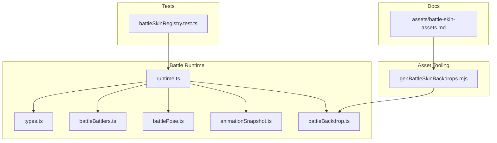
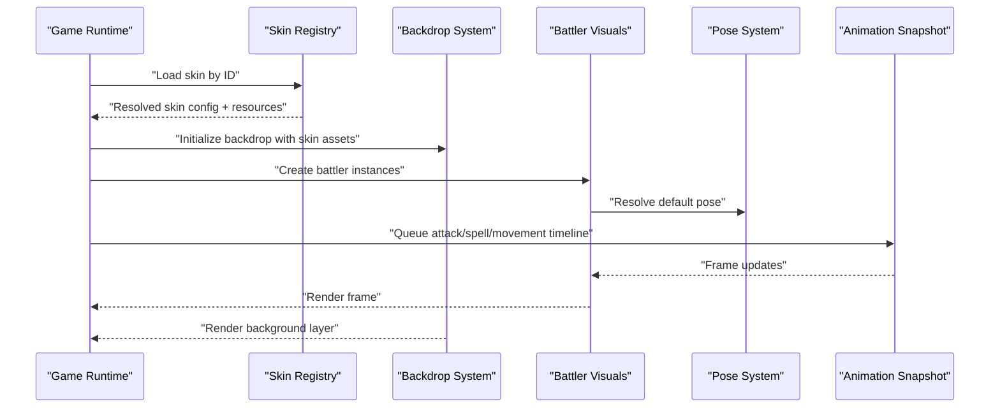
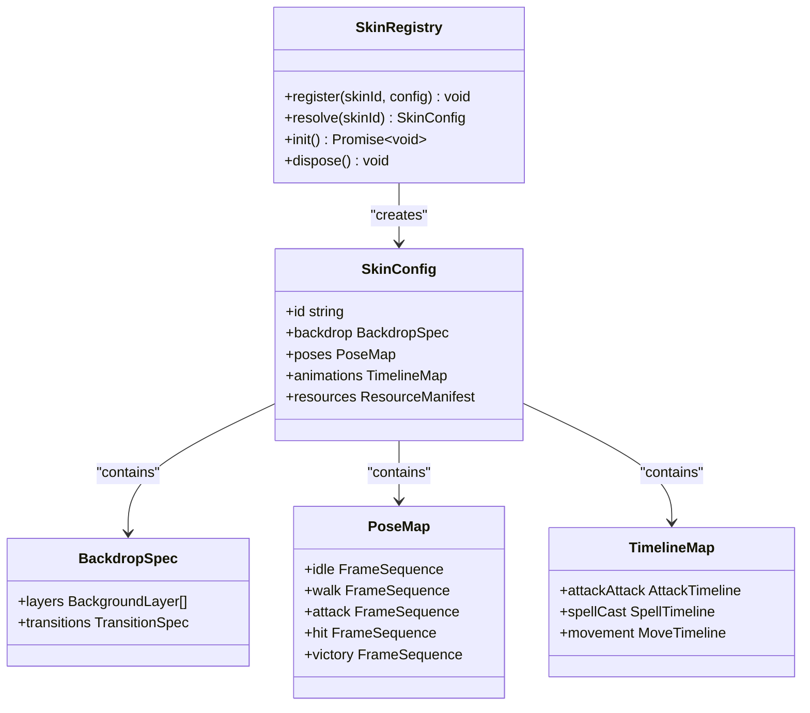
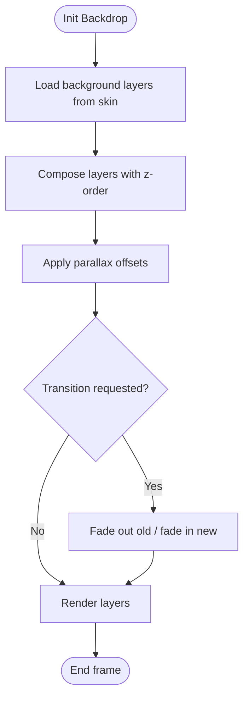
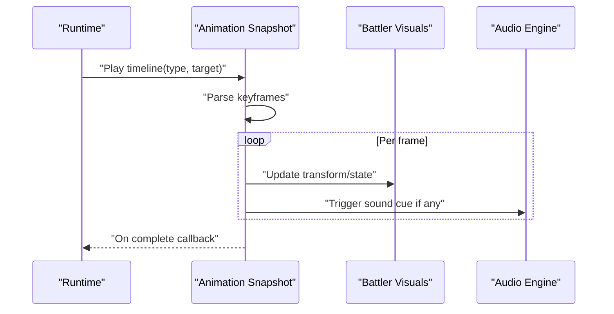
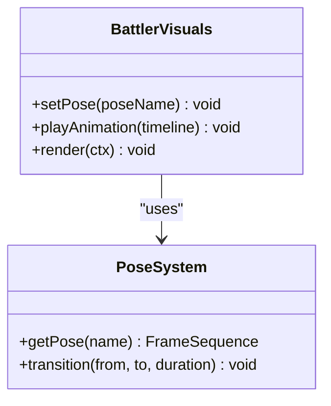
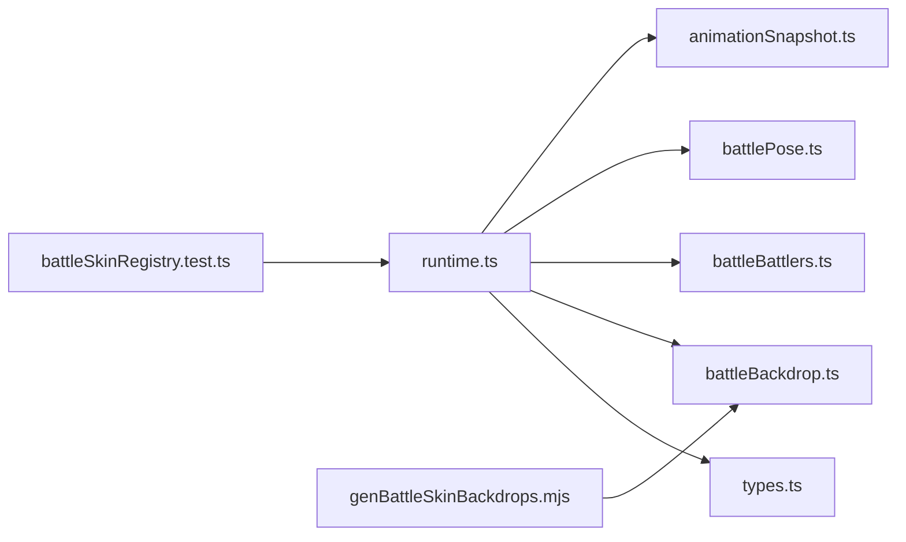

# Battle Skin System and Visual Customization

<cite>
**Referenced Files in This Document**
- [battleSkinRegistry.test.ts](file://test/battleSkinRegistry.test.ts)
- [battleBackdrop.ts](file://src/battle/battleBackdrop.ts)
- [animationSnapshot.ts](file://src/battle/animationSnapshot.ts)
- [battleBattlers.ts](file://src/battle/battleBattlers.ts)
- [battlePose.ts](file://src/battle/battlePose.ts)
- [runtime.ts](file://src/battle/runtime.ts)
- [types.ts](file://src/battle/types.ts)
- [genBattleSkinBackdrops.mjs](file://scripts/assets/genBattleSkinBackdrops.mjs)
- [assets/battle-skin-assets.md](file://docs/assets/battle-skin-assets.md)
</cite>

## Table of Contents
1. [Introduction](#introduction)
2. [Project Structure](#project-structure)
3. [Core Components](#core-components)
4. [Architecture Overview](#architecture-overview)
5. [Detailed Component Analysis](#detailed-component-analysis)
6. [Dependency Analysis](#dependency-analysis)
7. [Performance Considerations](#performance-considerations)
8. [Troubleshooting Guide](#troubleshooting-guide)
9. [Conclusion](#conclusion)
10. [Appendices](#appendices)

## Introduction
This document explains the battle skin system that enables visual customization across different RPG styles (e.g., Final Fantasy, Pokemon, Chrono Trigger). It covers:
- The skin registry architecture for loading and managing battle visual themes
- The backdrop system for battle backgrounds and environment rendering
- Animation playback systems for attack sequences, spell effects, and character movements
- Built-in skins and their configuration options
- Step-by-step guides to create custom battle skins, define animation timelines, and integrate with the asset pipeline
- Performance considerations for complex animations and memory optimization techniques

## Project Structure
The battle skin system is implemented under the battle module and related scripts/docs:
- src/battle: Core runtime, types, backdrop, battler visuals, pose, and animation snapshot utilities
- scripts/assets: Asset generation tooling for backdrops and other assets
- docs/assets: Documentation on battle skin assets
- test: Tests validating skin registry behavior

**Diagram sources**
- [runtime.ts](file://src/battle/runtime.ts)
- [types.ts](file://src/battle/types.ts)
- [battleBattlers.ts](file://src/battle/battleBattlers.ts)
- [battlePose.ts](file://src/battle/battlePose.ts)
- [animationSnapshot.ts](file://src/battle/animationSnapshot.ts)
- [battleBackdrop.ts](file://src/battle/battleBackdrop.ts)
- [genBattleSkinBackdrops.mjs](file://scripts/assets/genBattleSkinBackdrops.mjs)
- [assets/battle-skin-assets.md](file://docs/assets/battle-skin-assets.md)
- [battleSkinRegistry.test.ts](file://test/battleSkinRegistry.test.ts)

**Section sources**
- [battleSkinRegistry.test.ts](file://test/battleSkinRegistry.test.ts)
- [battleBackdrop.ts](file://src/battle/battleBackdrop.ts)
- [animationSnapshot.ts](file://src/battle/animationSnapshot.ts)
- [battleBattlers.ts](file://src/battle/battleBattlers.ts)
- [battlePose.ts](file://src/battle/battlePose.ts)
- [runtime.ts](file://src/battle/runtime.ts)
- [types.ts](file://src/battle/types.ts)
- [genBattleSkinBackdrops.mjs](file://scripts/assets/genBattleSkinBackdrops.mjs)
- [assets/battle-skin-assets.md](file://docs/assets/battle-skin-assets.md)

## Core Components
- Skin Registry: Centralized loader and manager for battle visual themes. Provides registration, resolution by name, and lifecycle hooks for initialization and disposal.
- Backdrop System: Manages background images, parallax layers, and environment overlays for each skin.
- Battler Visuals: Renders characters and enemies with pose-driven frames and state transitions.
- Pose System: Defines idle, walk, attack, hit, and victory poses per skin.
- Animation Snapshot: Captures and replays keyframe-based animations for attacks, spells, and movement.
- Types: Shared interfaces and data contracts used by the runtime and skins.

Key responsibilities:
- Skin registry resolves resources (images, audio, timelines) by skin ID
- Backdrop composes layered backgrounds and applies transitions
- Battler visuals consume pose and animation snapshots to render actions
- Types enforce consistent structure across skins and runtime

**Section sources**
- [runtime.ts](file://src/battle/runtime.ts)
- [types.ts](file://src/battle/types.ts)
- [battleBattlers.ts](file://src/battle/battleBattlers.ts)
- [battlePose.ts](file://src/battle/battlePose.ts)
- [animationSnapshot.ts](file://src/battle/animationSnapshot.ts)
- [battleBackdrop.ts](file://src/battle/battleBackdrop.ts)

## Architecture Overview
The battle skin system follows a layered architecture:
- Presentation Layer: Skins define visuals, poses, and timelines
- Composition Layer: Backdrop composes backgrounds; battler visuals compose poses and animations
- Runtime Layer: Orchestrates skin selection, resource loading, and event-driven playback
- Asset Pipeline: Scripts generate optimized assets (e.g., backdrops) for consumption at runtime

**Diagram sources**
- [runtime.ts](file://src/battle/runtime.ts)
- [battleBackdrop.ts](file://src/battle/battleBackdrop.ts)
- [battleBattlers.ts](file://src/battle/battleBattlers.ts)
- [battlePose.ts](file://src/battle/battlePose.ts)
- [animationSnapshot.ts](file://src/battle/animationSnapshot.ts)

## Detailed Component Analysis

### Skin Registry Architecture
Responsibilities:
- Register skins with unique IDs
- Resolve skin configurations and associated assets
- Provide lifecycle hooks for init and dispose
- Cache loaded resources to avoid redundant loads

Typical flow:
- Initialize registry with base paths and manifest
- Request skin by ID
- Load required textures, audio, and timeline definitions
- Expose API for runtime to query current skin and switch mid-session

**Diagram sources**
- [types.ts](file://src/battle/types.ts)
- [runtime.ts](file://src/battle/runtime.ts)

**Section sources**
- [battleSkinRegistry.test.ts](file://test/battleSkinRegistry.test.ts)
- [types.ts](file://src/battle/types.ts)
- [runtime.ts](file://src/battle/runtime.ts)

### Backdrop System
Responsibilities:
- Manage multi-layer backgrounds (base, midground, foreground)
- Apply parallax scrolling and zoom effects
- Handle transitions between environments (e.g., day/night, location changes)
- Optimize texture batching and draw calls

**Diagram sources**
- [battleBackdrop.ts](file://src/battle/battleBackdrop.ts)

**Section sources**
- [battleBackdrop.ts](file://src/battle/battleBackdrop.ts)

### Animation Playback System
Responsibilities:
- Define timelines for attacks, spells, and movement
- Parse keyframes and interpolate positions, scales, rotations, and opacity
- Sync audio cues with visual events
- Support looping and conditional branches within timelines

**Diagram sources**
- [animationSnapshot.ts](file://src/battle/animationSnapshot.ts)
- [battleBattlers.ts](file://src/battle/battleBattlers.ts)

**Section sources**
- [animationSnapshot.ts](file://src/battle/animationSnapshot.ts)
- [battleBattlers.ts](file://src/battle/battleBattlers.ts)

### Battler Visuals and Pose System
Responsibilities:
- Map game states to pose frames
- Blend between poses during transitions
- Integrate with animation timelines for action beats

**Diagram sources**
- [battleBattlers.ts](file://src/battle/battleBattlers.ts)
- [battlePose.ts](file://src/battle/battlePose.ts)

**Section sources**
- [battleBattlers.ts](file://src/battle/battleBattlers.ts)
- [battlePose.ts](file://src/battle/battlePose.ts)

### Built-in Skins and Configuration Options
Built-in skins typically include:
- FF-style: Classic turn-based UI, dramatic camera moves, heavy spell effects
- Pokemon-style: Grid-aligned battlers, simple attack arcs, minimal parallax
- Chrono Trigger-style: Dynamic backgrounds, expressive poses, cinematic timing

Configuration options commonly include:
- Backdrop layers and parallax settings
- Pose frame maps (idle, walk, attack, hit, victory)
- Animation timelines (attack, spell, movement)
- Resource manifests (textures, audio, fonts)
- Transition specs (fade durations, easing curves)

For exact fields and defaults, consult the shared types and documentation.

**Section sources**
- [types.ts](file://src/battle/types.ts)
- [assets/battle-skin-assets.md](file://docs/assets/battle-skin-assets.md)

### Creating Custom Battle Skins: Step-by-Step
1. Prepare assets
   - Collect background layers, battler spritesheets, and audio cues
   - Organize into a skin folder with clear naming conventions
2. Define skin configuration
   - Create a manifest referencing all resources
   - Specify backdrop layers and transition parameters
   - Map poses to frame sequences
   - Author timelines for attacks, spells, and movement
3. Register the skin
   - Use the registry API to register your skin ID and config
   - Ensure init completes before first battle
4. Test and iterate
   - Validate transitions, timings, and performance
   - Adjust parallax and effect intensity as needed

**Section sources**
- [genBattleSkinBackdrops.mjs](file://scripts/assets/genBattleSkinBackdrops.mjs)
- [assets/battle-skin-assets.md](file://docs/assets/battle-skin-assets.md)
- [types.ts](file://src/battle/types.ts)

### Defining Animation Timelines
- Keyframe format: time, position, scale, rotation, opacity, and optional audio triggers
- Easing functions: linear, ease-in-out, bounce for impact
- Branching: conditional segments based on skill type or target
- Looping: repeatable motion for continuous effects

Use the animation snapshot system to parse and play these timelines during battles.

**Section sources**
- [animationSnapshot.ts](file://src/battle/animationSnapshot.ts)

### Integrating with the Asset Pipeline
- Use the backdrop generator script to produce optimized background sets
- Follow naming conventions expected by the skin manifest
- Verify generated assets load correctly in the registry

**Section sources**
- [genBattleSkinBackdrops.mjs](file://scripts/assets/genBattleSkinBackdrops.mjs)
- [assets/battle-skin-assets.md](file://docs/assets/battle-skin-assets.md)

## Dependency Analysis
High-level dependencies:
- runtime depends on types, backdrop, battler visuals, pose, and animation snapshot
- backdrop consumes skin resources and may be generated via scripts
- tests validate registry behavior and integration points

**Diagram sources**
- [runtime.ts](file://src/battle/runtime.ts)
- [types.ts](file://src/battle/types.ts)
- [battleBackdrop.ts](file://src/battle/battleBackdrop.ts)
- [battleBattlers.ts](file://src/battle/battleBattlers.ts)
- [battlePose.ts](file://src/battle/battlePose.ts)
- [animationSnapshot.ts](file://src/battle/animationSnapshot.ts)
- [genBattleSkinBackdrops.mjs](file://scripts/assets/genBattleSkinBackdrops.mjs)
- [battleSkinRegistry.test.ts](file://test/battleSkinRegistry.test.ts)

**Section sources**
- [runtime.ts](file://src/battle/runtime.ts)
- [battleSkinRegistry.test.ts](file://test/battleSkinRegistry.test.ts)

## Performance Considerations
- Texture atlasing: Combine small sprites into larger sheets to reduce draw calls
- Parallax limits: Cap number of active layers and restrict scroll speed
- Animation budget: Limit simultaneous timelines and reuse common effects
- Memory management: Dispose unused skin resources promptly; preload only necessary assets
- Batching: Group similar draw operations and minimize state changes
- Profiling: Monitor frame times and GPU usage during complex spell sequences

[No sources needed since this section provides general guidance]

## Troubleshooting Guide
Common issues and resolutions:
- Skin not found: Verify skin ID matches registry entries and manifest references are correct
- Missing backdrop layers: Check generated assets exist and paths align with skin config
- Animation desync: Ensure timeline keyframe timestamps match intended durations and audio cues
- Pose mismatch: Confirm pose names map to available frame sequences in the skin
- Performance drops: Reduce parallax layers, simplify effects, and enable resource pooling

**Section sources**
- [battleSkinRegistry.test.ts](file://test/battleSkinRegistry.test.ts)
- [battleBackdrop.ts](file://src/battle/battleBackdrop.ts)
- [animationSnapshot.ts](file://src/battle/animationSnapshot.ts)

## Conclusion
The battle skin system provides a flexible, extensible framework for visual customization across RPG styles. By leveraging the skin registry, backdrop composition, pose-driven visuals, and timeline-based animations, developers can craft distinctive battle experiences while maintaining performance and maintainability.

[No sources needed since this section summarizes without analyzing specific files]

## Appendices
- Reference documentation for battle skin assets and conventions
- Example configurations for built-in skins (FF, Pokemon, Chrono Trigger)
- Best practices for authoring timelines and optimizing assets

**Section sources**
- [assets/battle-skin-assets.md](file://docs/assets/battle-skin-assets.md)