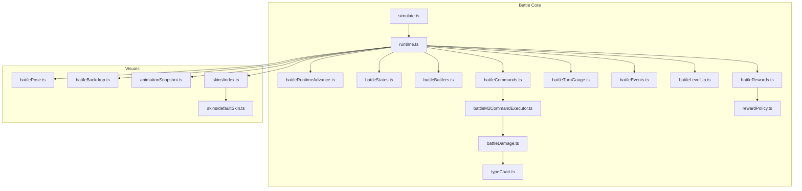
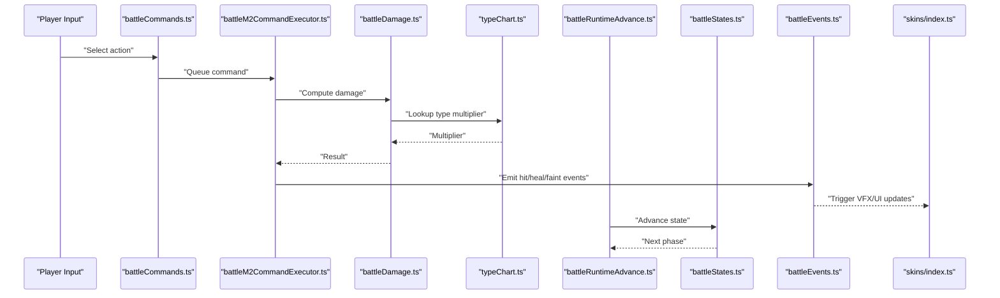
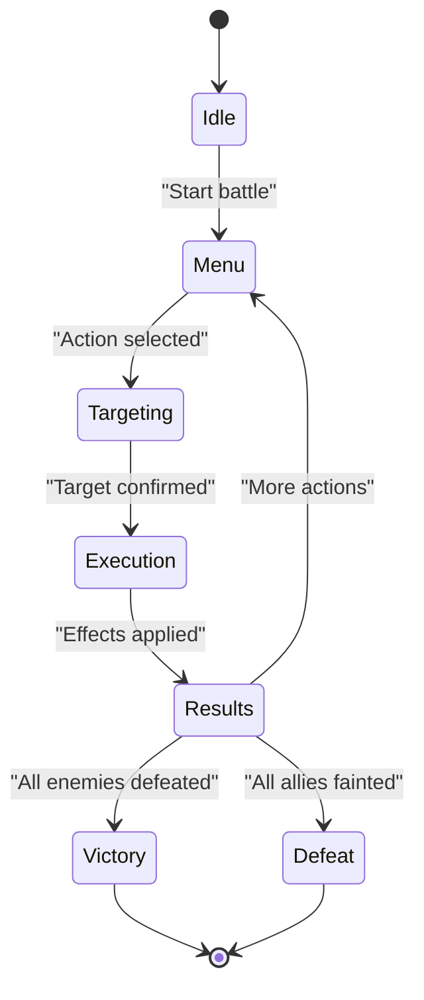
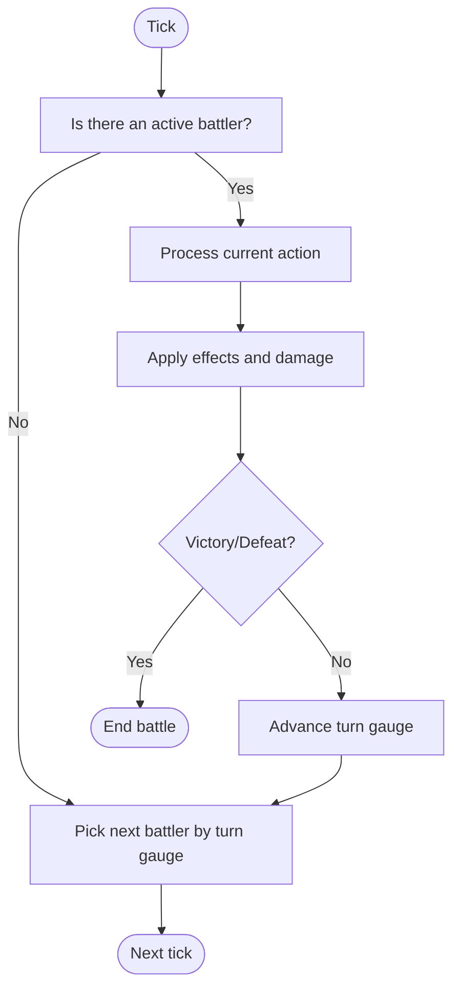
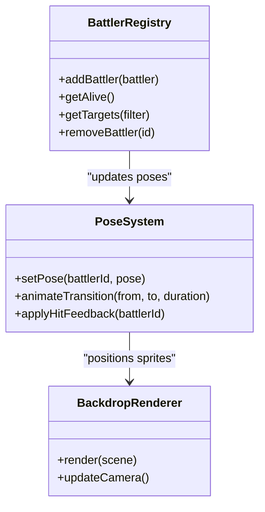
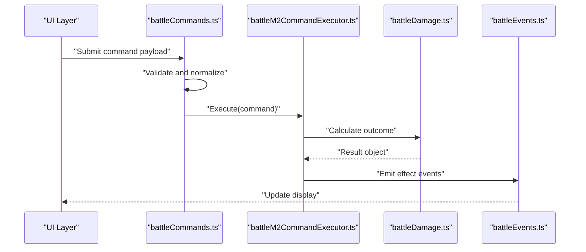
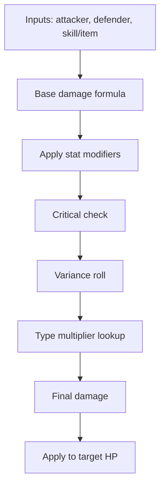
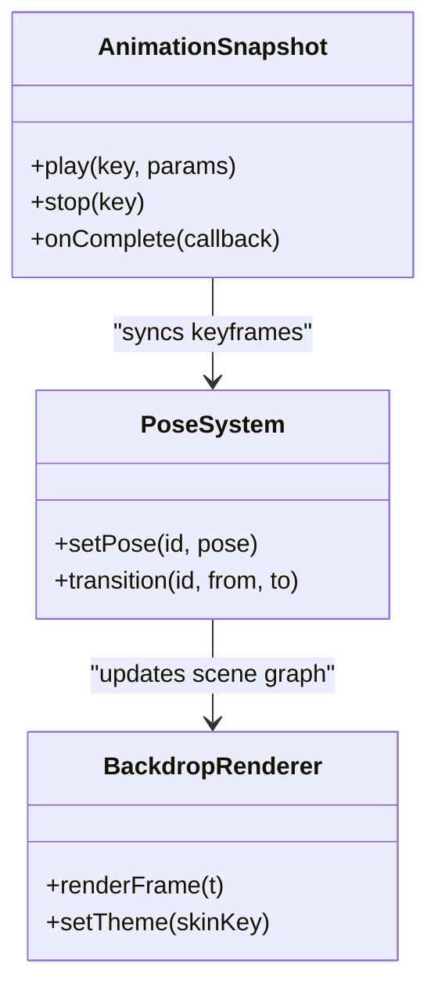
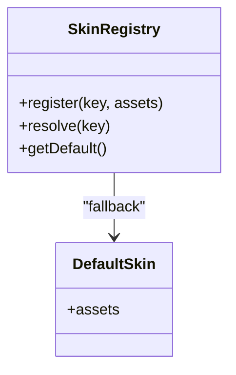
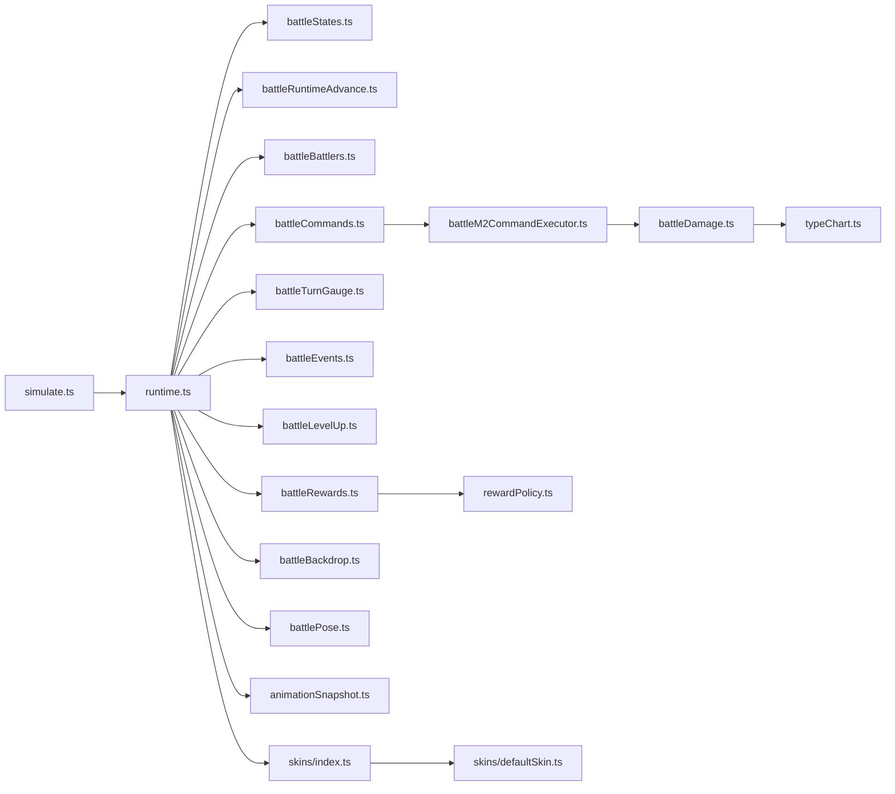

# Battle System

<cite>
**Referenced Files in This Document**
- [runtime.ts](file://src/battle/runtime.ts)
- [battleRuntimeAdvance.ts](file://src/battle/battleRuntimeAdvance.ts)
- [battleStates.ts](file://src/battle/battleStates.ts)
- [battleBattlers.ts](file://src/battle/battleBattlers.ts)
- [battleCommands.ts](file://src/battle/battleCommands.ts)
- [battleM2CommandExecutor.ts](file://src/battle/battleM2CommandExecutor.ts)
- [battleDamage.ts](file://src/battle/battleDamage.ts)
- [typeChart.ts](file://src/battle/typeChart.ts)
- [battlePose.ts](file://src/battle/battlePose.ts)
- [battleBackdrop.ts](file://src/battle/battleBackdrop.ts)
- [battleTurnGauge.ts](file://src/battle/battleTurnGauge.ts)
- [battleEvents.ts](file://src/battle/battleEvents.ts)
- [battleLevelUp.ts](file://src/battle/battleLevelUp.ts)
- [battleRewards.ts](file://src/battle/battleRewards.ts)
- [rewardPolicy.ts](file://src/battle/rewardPolicy.ts)
- [simulate.ts](file://src/battle/simulate.ts)
- [animationSnapshot.ts](file://src/battle/animationSnapshot.ts)
- [skins/index.ts](file://src/battle/skins/index.ts)
- [skins/defaultSkin.ts](file://src/battle/skins/defaultSkin.ts)
</cite>

## Table of Contents
1. [Introduction](#introduction)
2. [Project Structure](#project-structure)
3. [Core Components](#core-components)
4. [Architecture Overview](#architecture-overview)
5. [Detailed Component Analysis](#detailed-component-analysis)
6. [Dependency Analysis](#dependency-analysis)
7. [Performance Considerations](#performance-considerations)
8. [Troubleshooting Guide](#troubleshooting-guide)
9. [Conclusion](#conclusion)
10. [Appendices](#appendices)

## Introduction
This document explains the turn-based battle system implementation, focusing on runtime architecture, state management, and turn progression. It covers battler positioning, animation systems, visual effects rendering, command processing, damage calculation formulas, status effects, victory conditions, and the battle skin system for customizing visuals across RPG styles. Configuration examples are provided to help authors create balanced encounters, customize mechanics, and integrate with character progression. Performance optimization strategies and debugging techniques are also included.

## Project Structure
The battle subsystem is organized under src/battle with clear separation of concerns:
- Runtime orchestration and state machine
- Battler entities and positioning
- Command processing and execution
- Damage and type interactions
- Visuals (poses, backdrops, animations)
- Turn gauge and sequencing
- Rewards and level-up integration
- Simulation utilities for testing and authoring

**Diagram sources**
- [runtime.ts](file://src/battle/runtime.ts)
- [battleRuntimeAdvance.ts](file://src/battle/battleRuntimeAdvance.ts)
- [battleStates.ts](file://src/battle/battleStates.ts)
- [battleBattlers.ts](file://src/battle/battleBattlers.ts)
- [battleCommands.ts](file://src/battle/battleCommands.ts)
- [battleM2CommandExecutor.ts](file://src/battle/battleM2CommandExecutor.ts)
- [battleDamage.ts](file://src/battle/battleDamage.ts)
- [typeChart.ts](file://src/battle/typeChart.ts)
- [battleTurnGauge.ts](file://src/battle/battleTurnGauge.ts)
- [battleEvents.ts](file://src/battle/battleEvents.ts)
- [battleLevelUp.ts](file://src/battle/battleLevelUp.ts)
- [battleRewards.ts](file://src/battle/battleRewards.ts)
- [rewardPolicy.ts](file://src/battle/rewardPolicy.ts)
- [simulate.ts](file://src/battle/simulate.ts)
- [battlePose.ts](file://src/battle/battlePose.ts)
- [battleBackdrop.ts](file://src/battle/battleBackdrop.ts)
- [animationSnapshot.ts](file://src/battle/animationSnapshot.ts)
- [skins/index.ts](file://src/battle/skins/index.ts)
- [skins/defaultSkin.ts](file://src/battle/skins/defaultSkin.ts)

**Section sources**
- [runtime.ts](file://src/battle/runtime.ts)
- [battleRuntimeAdvance.ts](file://src/battle/battleRuntimeAdvance.ts)
- [battleStates.ts](file://src/battle/battleStates.ts)
- [battleBattlers.ts](file://src/battle/battleBattlers.ts)
- [battleCommands.ts](file://src/battle/battleCommands.ts)
- [battleM2CommandExecutor.ts](file://src/battle/battleM2CommandExecutor.ts)
- [battleDamage.ts](file://src/battle/battleDamage.ts)
- [typeChart.ts](file://src/battle/typeChart.ts)
- [battleTurnGauge.ts](file://src/battle/battleTurnGauge.ts)
- [battleEvents.ts](file://src/battle/battleEvents.ts)
- [battleLevelUp.ts](file://src/battle/battleLevelUp.ts)
- [battleRewards.ts](file://src/battle/battleRewards.ts)
- [rewardPolicy.ts](file://src/battle/rewardPolicy.ts)
- [simulate.ts](file://src/battle/simulate.ts)
- [battlePose.ts](file://src/battle/battlePose.ts)
- [battleBackdrop.ts](file://src/battle/battleBackdrop.ts)
- [animationSnapshot.ts](file://src/battle/animationSnapshot.ts)
- [skins/index.ts](file://src/battle/skins/index.ts)
- [skins/defaultSkin.ts](file://src/battle/skins/defaultSkin.ts)

## Core Components
- Runtime orchestrator: Initializes battles, manages state transitions, coordinates turn order, and dispatches events.
- State machine: Encapsulates battle states such as menu selection, action resolution, and result handling.
- Advance engine: Drives step-by-step progression through turns and actions.
- Battler registry: Manages party and enemy battlers, including positions and lifecycles.
- Command processor: Parses player and AI commands, validates them, and queues execution.
- Command executor: Bridges high-level commands to concrete effects (attacks, items, skills).
- Damage calculator: Applies base stats, modifiers, critical hits, and type effectiveness.
- Type chart: Provides multipliers for elemental or categorical matchups.
- Turn gauge: Controls initiative and scheduling of battler turns.
- Events: Emits lifecycle hooks for UI, audio, and VFX.
- Level-up and rewards: Integrates progression and loot after battle conclusion.
- Simulation: Headless runner for deterministic testing and authoring aids.
- Visuals: Poses, backdrops, and animation snapshots for presentation.
- Skin system: Pluggable visual theme for different RPG styles.

**Section sources**
- [runtime.ts](file://src/battle/runtime.ts)
- [battleStates.ts](file://src/battle/battleStates.ts)
- [battleRuntimeAdvance.ts](file://src/battle/battleRuntimeAdvance.ts)
- [battleBattlers.ts](file://src/battle/battleBattlers.ts)
- [battleCommands.ts](file://src/battle/battleCommands.ts)
- [battleM2CommandExecutor.ts](file://src/battle/battleM2CommandExecutor.ts)
- [battleDamage.ts](file://src/battle/battleDamage.ts)
- [typeChart.ts](file://src/battle/typeChart.ts)
- [battleTurnGauge.ts](file://src/battle/battleTurnGauge.ts)
- [battleEvents.ts](file://src/battle/battleEvents.ts)
- [battleLevelUp.ts](file://src/battle/battleLevelUp.ts)
- [battleRewards.ts](file://src/battle/battleRewards.ts)
- [rewardPolicy.ts](file://src/battle/rewardPolicy.ts)
- [simulate.ts](file://src/battle/simulate.ts)
- [battlePose.ts](file://src/battle/battlePose.ts)
- [battleBackdrop.ts](file://src/battle/battleBackdrop.ts)
- [animationSnapshot.ts](file://src/battle/animationSnapshot.ts)
- [skins/index.ts](file://src/battle/skins/index.ts)
- [skins/defaultSkin.ts](file://src/battle/skins/defaultSkin.ts)

## Architecture Overview
The battle runtime composes a state-driven loop that advances turns, resolves commands, applies effects, and renders feedback via the skin system. The advance engine drives the main loop; the state machine controls phase transitions; the command pipeline converts user/AI input into effect calls; the damage module computes outcomes; and the event bus notifies UI/VFX layers.

**Diagram sources**
- [battleCommands.ts](file://src/battle/battleCommands.ts)
- [battleM2CommandExecutor.ts](file://src/battle/battleM2CommandExecutor.ts)
- [battleDamage.ts](file://src/battle/battleDamage.ts)
- [typeChart.ts](file://src/battle/typeChart.ts)
- [battleRuntimeAdvance.ts](file://src/battle/battleRuntimeAdvance.ts)
- [battleStates.ts](file://src/battle/battleStates.ts)
- [battleEvents.ts](file://src/battle/battleEvents.ts)
- [skins/index.ts](file://src/battle/skins/index.ts)

## Detailed Component Analysis

### Runtime Orchestration and State Machine
- Responsibilities:
  - Initialize battle context and participants
  - Manage state transitions between phases (menu, targeting, execution, results)
  - Coordinate turn scheduling and advancement
  - Emit lifecycle events for UI and VFX
- Key behaviors:
  - On state change, update UI and trigger next steps
  - Validate inputs before advancing
  - Handle early exits (flee, surrender) and victory checks

**Diagram sources**
- [battleStates.ts](file://src/battle/battleStates.ts)
- [battleRuntimeAdvance.ts](file://src/battle/battleRuntimeAdvance.ts)
- [battleEvents.ts](file://src/battle/battleEvents.ts)

**Section sources**
- [battleStates.ts](file://src/battle/battleStates.ts)
- [battleRuntimeAdvance.ts](file://src/battle/battleRuntimeAdvance.ts)
- [battleEvents.ts](file://src/battle/battleEvents.ts)

### Turn Progression and Scheduling
- Responsibilities:
  - Maintain turn order based on speed/initiative
  - Advance active battler each tick
  - Handle simultaneous turns and delays
- Key behaviors:
  - Update turn gauge when actions complete
  - Skip inactive or fainted battlers
  - Enforce turn limits and timeouts

**Diagram sources**
- [battleTurnGauge.ts](file://src/battle/battleTurnGauge.ts)
- [battleRuntimeAdvance.ts](file://src/battle/battleRuntimeAdvance.ts)

**Section sources**
- [battleTurnGauge.ts](file://src/battle/battleTurnGauge.ts)
- [battleRuntimeAdvance.ts](file://src/battle/battleRuntimeAdvance.ts)

### Battler Positioning and Pose System
- Responsibilities:
  - Assign initial positions for party and enemies
  - Update positions during attacks, dodges, and knockbacks
  - Bind poses to battlers for consistent presentation
- Key behaviors:
  - Respect formation constraints and screen bounds
  - Animate transitions smoothly
  - Sync pose changes with events (hit, dodge, faint)

**Diagram sources**
- [battleBattlers.ts](file://src/battle/battleBattlers.ts)
- [battlePose.ts](file://src/battle/battlePose.ts)
- [battleBackdrop.ts](file://src/battle/battleBackdrop.ts)

**Section sources**
- [battleBattlers.ts](file://src/battle/battleBattlers.ts)
- [battlePose.ts](file://src/battle/battlePose.ts)
- [battleBackdrop.ts](file://src/battle/battleBackdrop.ts)

### Command Processing and Execution
- Responsibilities:
  - Parse player/AI commands
  - Validate targets and resource costs
  - Queue and execute commands deterministically
- Key behaviors:
  - Support multiple command types (attack, skill, item, flee)
  - Resolve targeting rules (single, multiple, random)
  - Integrate with executor for side effects

**Diagram sources**
- [battleCommands.ts](file://src/battle/battleCommands.ts)
- [battleM2CommandExecutor.ts](file://src/battle/battleM2CommandExecutor.ts)
- [battleDamage.ts](file://src/battle/battleDamage.ts)
- [battleEvents.ts](file://src/battle/battleEvents.ts)

**Section sources**
- [battleCommands.ts](file://src/battle/battleCommands.ts)
- [battleM2CommandExecutor.ts](file://src/battle/battleM2CommandExecutor.ts)

### Damage Calculation and Type Effects
- Responsibilities:
  - Compute raw damage from attacker vs defender stats
  - Apply modifiers (critical, variance, buffs/debuffs)
  - Factor in type effectiveness using the type chart
- Key behaviors:
  - Clamp final damage to non-negative ranges
  - Provide debug-friendly breakdown values
  - Allow extensibility for special resistances

**Diagram sources**
- [battleDamage.ts](file://src/battle/battleDamage.ts)
- [typeChart.ts](file://src/battle/typeChart.ts)

**Section sources**
- [battleDamage.ts](file://src/battle/battleDamage.ts)
- [typeChart.ts](file://src/battle/typeChart.ts)

### Status Effects and Lifecycle
- Responsibilities:
  - Track persistent conditions on battlers
  - Apply periodic effects (poison, burn) at turn boundaries
  - Interact with damage and evasion calculations
- Key behaviors:
  - Define durations and triggers
  - Ensure correct stacking and immunity rules
  - Emit events for UI and VFX

**Section sources**
- [battleDamage.ts](file://src/battle/battleDamage.ts)
- [battleEvents.ts](file://src/battle/battleEvents.ts)

### Victory Conditions and Battle End
- Responsibilities:
  - Evaluate win/loss criteria each tick
  - Trigger reward distribution and level-up logic
  - Clean up resources and return control to game flow
- Key behaviors:
  - Handle partial victories (e.g., boss phases) if applicable
  - Preserve deterministic outcomes for replays

**Section sources**
- [battleRuntimeAdvance.ts](file://src/battle/battleRuntimeAdvance.ts)
- [battleRewards.ts](file://src/battle/battleRewards.ts)
- [battleLevelUp.ts](file://src/battle/battleLevelUp.ts)

### Animation System and Visual Effects
- Responsibilities:
  - Manage animation snapshots and playback
  - Render backdrop scenes and camera moves
  - Drive pose transitions and hit reactions
- Key behaviors:
  - Decouple animation data from logic
  - Provide timing hooks for sound and VFX
  - Support skin-specific assets

**Diagram sources**
- [animationSnapshot.ts](file://src/battle/animationSnapshot.ts)
- [battlePose.ts](file://src/battle/battlePose.ts)
- [battleBackdrop.ts](file://src/battle/battleBackdrop.ts)

**Section sources**
- [animationSnapshot.ts](file://src/battle/animationSnapshot.ts)
- [battlePose.ts](file://src/battle/battlePose.ts)
- [battleBackdrop.ts](file://src/battle/battleBackdrop.ts)

### Battle Skin System
- Responsibilities:
  - Provide pluggable visual themes for backgrounds, battler art, and UI chrome
  - Register skins and resolve assets by key
  - Default skin fallback for compatibility
- Key behaviors:
  - Skin registry maps style identifiers to asset bundles
  - Runtime selects skin per battle or globally
  - Skin assets include backdrops, battler frames, and overlay elements

**Diagram sources**
- [skins/index.ts](file://src/battle/skins/index.ts)
- [skins/defaultSkin.ts](file://src/battle/skins/defaultSkin.ts)

**Section sources**
- [skins/index.ts](file://src/battle/skins/index.ts)
- [skins/defaultSkin.ts](file://src/battle/skins/defaultSkin.ts)

### Simulation and Testing Utilities
- Responsibilities:
  - Run headless battles deterministically
  - Capture snapshots for evidence and analysis
  - Aid authoring by predicting outcomes
- Key behaviors:
  - Accept fixed seeds and inputs
  - Replay sequences for debugging
  - Export logs for balance tuning

**Section sources**
- [simulate.ts](file://src/battle/simulate.ts)
- [battleEvents.ts](file://src/battle/battleEvents.ts)

## Dependency Analysis
High-level dependencies among core modules:

**Diagram sources**
- [runtime.ts](file://src/battle/runtime.ts)
- [battleStates.ts](file://src/battle/battleStates.ts)
- [battleRuntimeAdvance.ts](file://src/battle/battleRuntimeAdvance.ts)
- [battleBattlers.ts](file://src/battle/battleBattlers.ts)
- [battleCommands.ts](file://src/battle/battleCommands.ts)
- [battleM2CommandExecutor.ts](file://src/battle/battleM2CommandExecutor.ts)
- [battleDamage.ts](file://src/battle/battleDamage.ts)
- [typeChart.ts](file://src/battle/typeChart.ts)
- [battleTurnGauge.ts](file://src/battle/battleTurnGauge.ts)
- [battleEvents.ts](file://src/battle/battleEvents.ts)
- [battleLevelUp.ts](file://src/battle/battleLevelUp.ts)
- [battleRewards.ts](file://src/battle/battleRewards.ts)
- [rewardPolicy.ts](file://src/battle/rewardPolicy.ts)
- [battleBackdrop.ts](file://src/battle/battleBackdrop.ts)
- [battlePose.ts](file://src/battle/battlePose.ts)
- [animationSnapshot.ts](file://src/battle/animationSnapshot.ts)
- [skins/index.ts](file://src/battle/skins/index.ts)
- [skins/defaultSkin.ts](file://src/battle/skins/defaultSkin.ts)
- [simulate.ts](file://src/battle/simulate.ts)

**Section sources**
- [runtime.ts](file://src/battle/runtime.ts)
- [battleRuntimeAdvance.ts](file://src/battle/battleRuntimeAdvance.ts)
- [battleStates.ts](file://src/battle/battleStates.ts)
- [battleBattlers.ts](file://src/battle/battleBattlers.ts)
- [battleCommands.ts](file://src/battle/battleCommands.ts)
- [battleM2CommandExecutor.ts](file://src/battle/battleM2CommandExecutor.ts)
- [battleDamage.ts](file://src/battle/battleDamage.ts)
- [typeChart.ts](file://src/battle/typeChart.ts)
- [battleTurnGauge.ts](file://src/battle/battleTurnGauge.ts)
- [battleEvents.ts](file://src/battle/battleEvents.ts)
- [battleLevelUp.ts](file://src/battle/battleLevelUp.ts)
- [battleRewards.ts](file://src/battle/battleRewards.ts)
- [rewardPolicy.ts](file://src/battle/rewardPolicy.ts)
- [battleBackdrop.ts](file://src/battle/battleBackdrop.ts)
- [battlePose.ts](file://src/battle/battlePose.ts)
- [animationSnapshot.ts](file://src/battle/animationSnapshot.ts)
- [skins/index.ts](file://src/battle/skins/index.ts)
- [skins/defaultSkin.ts](file://src/battle/skins/defaultSkin.ts)
- [simulate.ts](file://src/battle/simulate.ts)

## Performance Considerations
- Batch updates: Group battler position and pose updates to minimize reflows.
- Event coalescing: Merge frequent small events into fewer notifications.
- Deterministic simulation: Use fixed seeds and replay logs to isolate performance regressions.
- Asset streaming: Load skin assets lazily and cache frequently used textures.
- Avoid heavy allocations: Reuse buffers and objects within loops.
- Optimize damage math: Precompute common multipliers where possible.

[No sources needed since this section provides general guidance]

## Troubleshooting Guide
- Use simulation mode to reproduce issues deterministically and export logs.
- Inspect event emissions around damage and state transitions to pinpoint failures.
- Validate command payloads and targeting rules before execution.
- Check skin asset keys and fallback behavior when visuals fail to render.
- Monitor turn gauge anomalies and ensure proper advancement after actions.

**Section sources**
- [simulate.ts](file://src/battle/simulate.ts)
- [battleEvents.ts](file://src/battle/battleEvents.ts)
- [battleCommands.ts](file://src/battle/battleCommands.ts)
- [skins/index.ts](file://src/battle/skins/index.ts)
- [battleTurnGauge.ts](file://src/battle/battleTurnGauge.ts)

## Conclusion
The battle system is a modular, state-driven architecture that cleanly separates logic, visuals, and presentation. Its design supports flexible command processing, robust damage and type interactions, and a skinnable visual layer. With deterministic simulation and comprehensive eventing, it enables both balanced authoring and reliable debugging.

[No sources needed since this section summarizes without analyzing specific files]

## Appendices

### Configuration Examples and Best Practices
- Balanced encounters:
  - Tune enemy HP and attack scaling relative to party levels
  - Adjust type effectiveness weights to encourage strategy
  - Set turn gauge parameters to control pacing
- Custom mechanics:
  - Extend damage modifiers for unique skills or equipment
  - Add new status effects with defined durations and triggers
  - Implement alternate targeting rules for area-of-effect abilities
- Integration with progression:
  - Hook level-up logic to post-battle rewards
  - Persist experience and gold gains to session state
  - Use reward policies to gate drops and scaling

[No sources needed since this section provides general guidance]