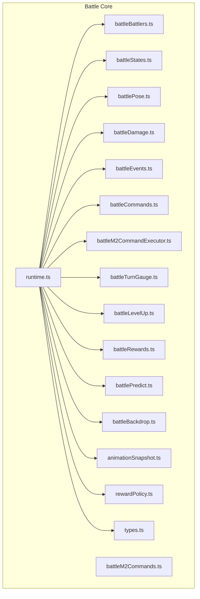
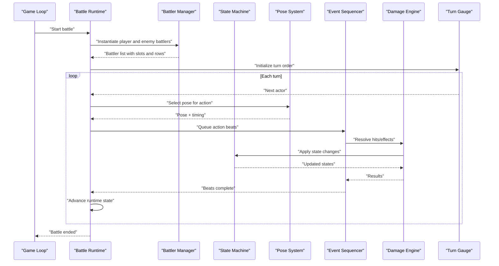
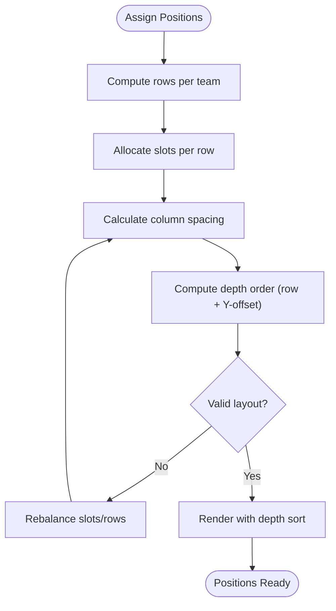
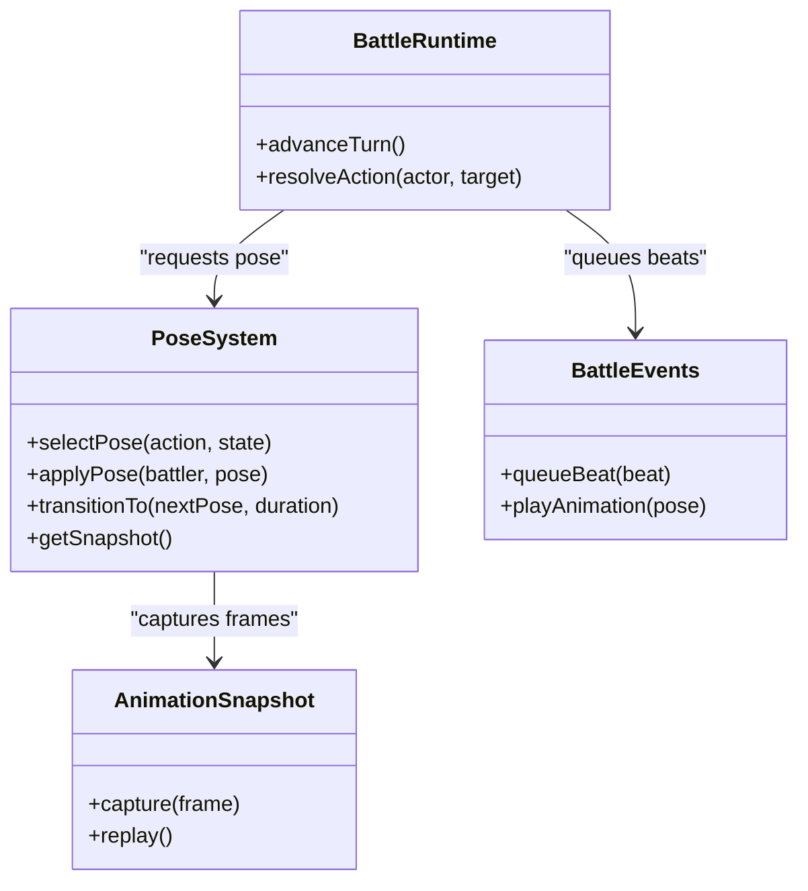
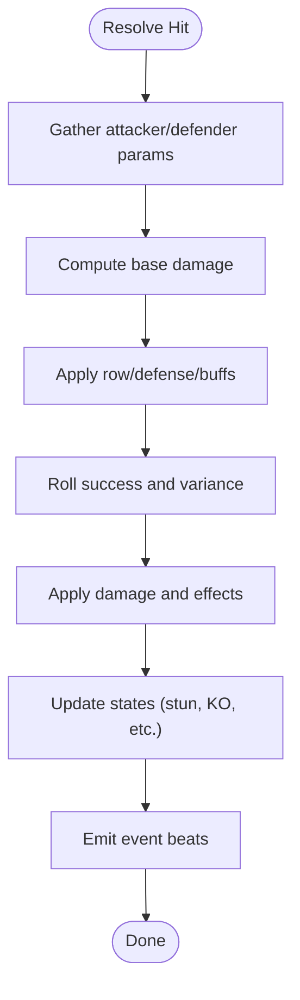
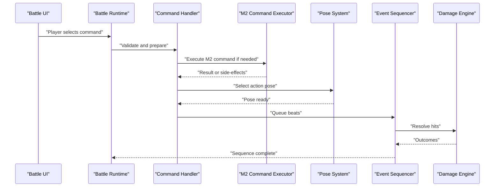
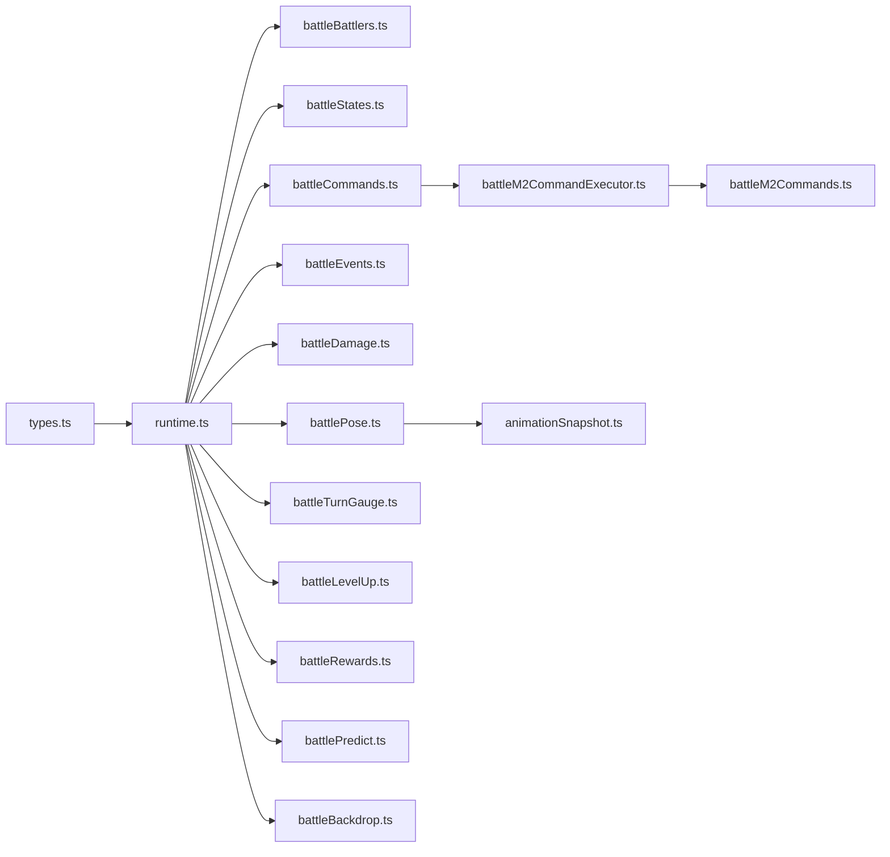

# Battler Management and Positioning

<cite>
**Referenced Files in This Document**
- [battleRuntime.ts](file://src/battle/runtime.ts)
- [battleBattlers.ts](file://src/battle/battleBattlers.ts)
- [battlePose.ts](file://src/battle/battlePose.ts)
- [battleStates.ts](file://src/battle/battleStates.ts)
- [battleDamage.ts](file://src/battle/battleDamage.ts)
- [battleEvents.ts](file://src/battle/battleEvents.ts)
- [battleCommands.ts](file://src/battle/battleCommands.ts)
- [battleM2CommandExecutor.ts](file://src/battle/battleM2CommandExecutor.ts)
- [battleM2Commands.ts](file://src/battle/battleM2Commands.ts)
- [battleTurnGauge.ts](file://src/battle/battleTurnGauge.ts)
- [battleLevelUp.ts](file://src/battle/battleLevelUp.ts)
- [battleRewards.ts](file://src/battle/battleRewards.ts)
- [battlePredict.ts](file://src/battle/battlePredict.ts)
- [battleBackdrop.ts](file://src/battle/battleBackdrop.ts)
- [animationSnapshot.ts](file://src/battle/animationSnapshot.ts)
- [rewardPolicy.ts](file://src/battle/rewardPolicy.ts)
- [types.ts](file://src/battle/types.ts)
</cite>

## Table of Contents
1. [Introduction](#introduction)
2. [Project Structure](#project-structure)
3. [Core Components](#core-components)
4. [Architecture Overview](#architecture-overview)
5. [Detailed Component Analysis](#detailed-component-analysis)
6. [Dependency Analysis](#dependency-analysis)
7. [Performance Considerations](#performance-considerations)
8. [Troubleshooting Guide](#troubleshooting-guide)
9. [Conclusion](#conclusion)
10. [Appendices](#appendices)

## Introduction
This document explains the battler management and positioning system used during battles. It covers how player characters and enemy units are instantiated, tracked, and managed; how positioning (front/back row, spacing, depth sorting) is computed and rendered; battler states such as alive, dead, stunned, and their visual implications; and the pose system for actions like attacking, defending, casting spells, and taking damage. It also provides guidance on adding new battler types, customizing positioning rules, and implementing advanced movement patterns.

## Project Structure
The battle subsystem is organized into focused modules:
- Runtime orchestration and turn control
- Battler lifecycle and state management
- Pose and animation snapshotting
- Damage calculation and event sequencing
- Command execution and prediction
- Rewards, level-up, and backdrop rendering

**Diagram sources**
- [runtime.ts](file://src/battle/runtime.ts)
- [battleBattlers.ts](file://src/battle/battleBattlers.ts)
- [battleStates.ts](file://src/battle/battleStates.ts)
- [battlePose.ts](file://src/battle/battlePose.ts)
- [battleDamage.ts](file://src/battle/battleDamage.ts)
- [battleEvents.ts](file://src/battle/battleEvents.ts)
- [battleCommands.ts](file://src/battle/battleCommands.ts)
- [battleM2CommandExecutor.ts](file://src/battle/battleM2CommandExecutor.ts)
- [battleM2Commands.ts](file://src/battle/battleM2Commands.ts)
- [battleTurnGauge.ts](file://src/battle/battleTurnGauge.ts)
- [battleLevelUp.ts](file://src/battle/battleLevelUp.ts)
- [battleRewards.ts](file://src/battle/battleRewards.ts)
- [battlePredict.ts](file://src/battle/battlePredict.ts)
- [battleBackdrop.ts](file://src/battle/battleBackdrop.ts)
- [animationSnapshot.ts](file://src/battle/animationSnapshot.ts)
- [rewardPolicy.ts](file://src/battle/rewardPolicy.ts)
- [types.ts](file://src/battle/types.ts)

**Section sources**
- [runtime.ts](file://src/battle/runtime.ts)
- [types.ts](file://src/battle/types.ts)

## Core Components
- Battle runtime: orchestrates turns, advances state, coordinates battler updates, and drives the overall flow.
- Battler manager: instantiates and tracks player and enemy battlers, manages slots, rows, and visibility.
- State machine: defines and transitions between battler states (alive, dead, stunned, etc.).
- Pose system: selects and animates poses for actions (attack, defend, cast, hit).
- Damage engine: computes damage, applies effects, and triggers events.
- Event sequencer: composes action beats, camera/visual cues, and UI feedback.
- Command executor: interprets commands and executes M2-style commands within battle context.
- Turn gauge: controls initiative and turn pacing.
- Level-up and rewards: handles progression and loot distribution.
- Prediction and snapshots: supports previewing outcomes and capturing animation frames.
- Backdrop renderer: draws background elements behind battlers.

**Section sources**
- [battleRuntime.ts](file://src/battle/runtime.ts)
- [battleBattlers.ts](file://src/battle/battleBattlers.ts)
- [battleStates.ts](file://src/battle/battleStates.ts)
- [battlePose.ts](file://src/battle/battlePose.ts)
- [battleDamage.ts](file://src/battle/battleDamage.ts)
- [battleEvents.ts](file://src/battle/battleEvents.ts)
- [battleCommands.ts](file://src/battle/battleCommands.ts)
- [battleM2CommandExecutor.ts](file://src/battle/battleM2CommandExecutor.ts)
- [battleM2Commands.ts](file://src/battle/battleM2Commands.ts)
- [battleTurnGauge.ts](file://src/battle/battleTurnGauge.ts)
- [battleLevelUp.ts](file://src/battle/battleLevelUp.ts)
- [battleRewards.ts](file://src/battle/battleRewards.ts)
- [battlePredict.ts](file://src/battle/battlePredict.ts)
- [battleBackdrop.ts](file://src/battle/battleBackdrop.ts)
- [animationSnapshot.ts](file://src/battle/animationSnapshot.ts)
- [rewardPolicy.ts](file://src/battle/rewardPolicy.ts)
- [types.ts](file://src/battle/types.ts)

## Architecture Overview
At a high level, the runtime initializes the battle, creates battlers from party and troop definitions, assigns positions (rows and columns), and then runs a loop that advances turns, resolves actions, applies damage, updates states, and renders poses and effects. The pose system and animation snapshot module coordinate with the render pipeline to display correct visuals based on current states and actions.

**Diagram sources**
- [battleRuntime.ts](file://src/battle/runtime.ts)
- [battleBattlers.ts](file://src/battle/battleBattlers.ts)
- [battleStates.ts](file://src/battle/battleStates.ts)
- [battlePose.ts](file://src/battle/battlePose.ts)
- [battleEvents.ts](file://src/battle/battleEvents.ts)
- [battleDamage.ts](file://src/battle/battleDamage.ts)
- [battleTurnGauge.ts](file://src/battle/battleTurnGauge.ts)

## Detailed Component Analysis

### Battler Lifecycle and Tracking
- Instantiation: Player battlers are created from party data; enemy battlers are created from troop definitions. Each battler receives an ID, reference to its model, initial stats, and a slot assignment.
- Slot and row assignment: Slots determine horizontal placement; rows determine front/back positioning. The manager ensures valid placements and can rebalance if battlers die or join mid-battle.
- Visibility and removal: When a battler dies, it transitions to a dead state and may be hidden or replaced by a death pose. Dead battlers remain in memory for reward processing but are excluded from targeting.
- Targeting and grouping: Battlers are grouped by team (player vs enemy) and filtered by row and range when selecting targets for skills or attacks.

Positioning specifics:
- Front/back row: Affects hit probability and sometimes defense modifiers.
- Spacing: Horizontal spacing between battlers is derived from slot width and screen scaling.
- Depth sorting: Determined by row and vertical offset; back-row battlers render behind front-row ones.

**Section sources**
- [battleBattlers.ts](file://src/battle/battleBattlers.ts)
- [battleStates.ts](file://src/battle/battleStates.ts)
- [battlePose.ts](file://src/battle/battlePose.ts)
- [battleEvents.ts](file://src/battle/battleEvents.ts)
- [battleDamage.ts](file://src/battle/battleDamage.ts)
- [battleRuntime.ts](file://src/battle/runtime.ts)

### Positioning System
- Row logic: Assigns each battler to front or back row based on configuration and available slots.
- Column layout: Distributes battlers across columns with consistent spacing.
- Depth ordering: Uses row and Y-offset to compute z-order so front-row battlers appear above back-row ones.
- Dynamic adjustments: If battlers enter or leave, the system recalculates positions to maintain balanced spacing.

**Diagram sources**
- [battleBattlers.ts](file://src/battle/battleBattlers.ts)
- [battleRuntime.ts](file://src/battle/runtime.ts)

**Section sources**
- [battleBattlers.ts](file://src/battle/battleBattlers.ts)
- [battleRuntime.ts](file://src/battle/runtime.ts)

### Battler States and Visual Representation
- Alive: Default state; battler participates in turns and can be targeted.
- Dead: Non-participating; typically shows a death pose and is removed from targeting pools.
- Stunned: Prevents acting until cleared; may show a specific pose or effect overlay.
- Other status conditions: Additional states (e.g., poisoned, silenced) can be represented via pose overlays and targeting filters.

Visual mapping:
- Each state maps to a pose variant or animation frame set.
- Status icons or overlays indicate active conditions.
- Death transitions include fade-out or collapse animations before removal from active lists.

**Section sources**
- [battleStates.ts](file://src/battle/battleStates.ts)
- [battlePose.ts](file://src/battle/battlePose.ts)
- [battleEvents.ts](file://src/battle/battleEvents.ts)

### Pose System for Actions
- Action poses: Attack, defend, cast spell, take damage, victory, idle.
- Pose selection: Based on current action, target direction, and state.
- Timing and blending: Poses have durations and can blend into next poses (e.g., attack -> return to idle).
- Snapshotting: Animation snapshots capture keyframes for replay or prediction.

**Diagram sources**
- [battlePose.ts](file://src/battle/battlePose.ts)
- [battleRuntime.ts](file://src/battle/runtime.ts)
- [battleEvents.ts](file://src/battle/battleEvents.ts)
- [animationSnapshot.ts](file://src/battle/animationSnapshot.ts)

**Section sources**
- [battlePose.ts](file://src/battle/battlePose.ts)
- [animationSnapshot.ts](file://src/battle/animationSnapshot.ts)
- [battleEvents.ts](file://src/battle/battleEvents.ts)
- [battleRuntime.ts](file://src/battle/runtime.ts)

### Damage Calculation and Effects
- Inputs: Attacker stats, skill/item parameters, defender resistances, random factors.
- Process: Compute base damage, apply modifiers (row, defense, buffs/debuffs), roll success rate, and finalize result.
- Output: Damage value, status changes, and event beats (hit flash, sound, shake).

**Diagram sources**
- [battleDamage.ts](file://src/battle/battleDamage.ts)
- [battleStates.ts](file://src/battle/battleStates.ts)
- [battleEvents.ts](file://src/battle/battleEvents.ts)

**Section sources**
- [battleDamage.ts](file://src/battle/battleDamage.ts)
- [battleStates.ts](file://src/battle/battleStates.ts)
- [battleEvents.ts](file://src/battle/battleEvents.ts)

### Command Execution and M2 Integration
- Commands: Player chooses actions (attack, skill, item, defend, flee).
- Executor: Interprets commands and delegates to M2 command handlers for complex operations.
- Flow: Command validation -> pose selection -> event sequencing -> damage resolution -> state update.

**Diagram sources**
- [battleCommands.ts](file://src/battle/battleCommands.ts)
- [battleM2CommandExecutor.ts](file://src/battle/battleM2CommandExecutor.ts)
- [battleM2Commands.ts](file://src/battle/battleM2Commands.ts)
- [battlePose.ts](file://src/battle/battlePose.ts)
- [battleEvents.ts](file://src/battle/battleEvents.ts)
- [battleDamage.ts](file://src/battle/battleDamage.ts)
- [battleRuntime.ts](file://src/battle/runtime.ts)

**Section sources**
- [battleCommands.ts](file://src/battle/battleCommands.ts)
- [battleM2CommandExecutor.ts](file://src/battle/battleM2CommandExecutor.ts)
- [battleM2Commands.ts](file://src/battle/battleM2Commands.ts)
- [battleRuntime.ts](file://src/battle/runtime.ts)

### Turn Control and Progression
- Turn gauge: Manages initiative order and pacing; determines which battler acts next.
- Level-up: After battle, processes experience and level-ups for surviving battlers.
- Rewards: Calculates exp, gold, items, and other drops using policy rules.

**Section sources**
- [battleTurnGauge.ts](file://src/battle/battleTurnGauge.ts)
- [battleLevelUp.ts](file://src/battle/battleLevelUp.ts)
- [battleRewards.ts](file://src/battle/battleRewards.ts)
- [rewardPolicy.ts](file://src/battle/rewardPolicy.ts)

### Prediction and Backdrops
- Prediction: Simulates outcomes without committing to state changes; useful for previews and tooltips.
- Backdrops: Renders scene backgrounds behind battlers; integrates with depth sorting.

**Section sources**
- [battlePredict.ts](file://src/battle/battlePredict.ts)
- [battleBackdrop.ts](file://src/battle/battleBackdrop.ts)

## Dependency Analysis
The runtime depends on all core modules to orchestrate battle flow. Battler management depends on types and states. Pose and events depend on runtime decisions. Damage depends on states and events. Commands depend on M2 executor and pose/event systems.

**Diagram sources**
- [types.ts](file://src/battle/types.ts)
- [battleRuntime.ts](file://src/battle/runtime.ts)
- [battleBattlers.ts](file://src/battle/battleBattlers.ts)
- [battleStates.ts](file://src/battle/battleStates.ts)
- [battlePose.ts](file://src/battle/battlePose.ts)
- [battleEvents.ts](file://src/battle/battleEvents.ts)
- [battleDamage.ts](file://src/battle/battleDamage.ts)
- [battleCommands.ts](file://src/battle/battleCommands.ts)
- [battleM2CommandExecutor.ts](file://src/battle/battleM2CommandExecutor.ts)
- [battleM2Commands.ts](file://src/battle/battleM2Commands.ts)
- [battleTurnGauge.ts](file://src/battle/battleTurnGauge.ts)
- [battleLevelUp.ts](file://src/battle/battleLevelUp.ts)
- [battleRewards.ts](file://src/battle/battleRewards.ts)
- [battlePredict.ts](file://src/battle/battlePredict.ts)
- [battleBackdrop.ts](file://src/battle/battleBackdrop.ts)
- [animationSnapshot.ts](file://src/battle/animationSnapshot.ts)

**Section sources**
- [battleRuntime.ts](file://src/battle/runtime.ts)
- [battleBattlers.ts](file://src/battle/battleBattlers.ts)
- [battleStates.ts](file://src/battle/battleStates.ts)
- [battlePose.ts](file://src/battle/battlePose.ts)
- [battleDamage.ts](file://src/battle/battleDamage.ts)
- [battleEvents.ts](file://src/battle/battleEvents.ts)
- [battleCommands.ts](file://src/battle/battleCommands.ts)
- [battleM2CommandExecutor.ts](file://src/battle/battleM2CommandExecutor.ts)
- [battleM2Commands.ts](file://src/battle/battleM2Commands.ts)
- [battleTurnGauge.ts](file://src/battle/battleTurnGauge.ts)
- [battleLevelUp.ts](file://src/battle/battleLevelUp.ts)
- [battleRewards.ts](file://src/battle/battleRewards.ts)
- [battlePredict.ts](file://src/battle/battlePredict.ts)
- [battleBackdrop.ts](file://src/battle/battleBackdrop.ts)
- [animationSnapshot.ts](file://src/battle/animationSnapshot.ts)
- [types.ts](file://src/battle/types.ts)

## Performance Considerations
- Batch updates: Group battler position recalculations and state transitions to minimize re-renders.
- Pose caching: Cache common pose frames to reduce overhead during rapid action sequences.
- Efficient targeting: Use precomputed lists for valid targets filtered by row and range.
- Lightweight prediction: Run predictions on copies of battler state to avoid heavy allocations.

[No sources needed since this section provides general guidance]

## Troubleshooting Guide
Common issues and checks:
- Battler not appearing: Verify slot assignment and row allocation; ensure depth sorting places battlers correctly.
- Wrong pose playing: Confirm pose selection logic matches current action and state; check animation snapshot playback.
- Damage not applied: Inspect damage inputs, modifiers, and success rolls; verify state transitions after damage.
- Turn order anomalies: Review turn gauge initialization and actor readiness flags.
- Command execution errors: Validate command bodies and M2 command mappings; check event beat sequencing.

**Section sources**
- [battleBattlers.ts](file://src/battle/battleBattlers.ts)
- [battlePose.ts](file://src/battle/battlePose.ts)
- [battleDamage.ts](file://src/battle/battleDamage.ts)
- [battleTurnGauge.ts](file://src/battle/battleTurnGauge.ts)
- [battleCommands.ts](file://src/battle/battleCommands.ts)
- [battleM2CommandExecutor.ts](file://src/battle/battleM2CommandExecutor.ts)
- [battleEvents.ts](file://src/battle/battleEvents.ts)

## Conclusion
The battler management and positioning system combines clear separation of concerns: runtime orchestration, battler lifecycle, state management, pose-driven visuals, and robust damage/event pipelines. By following the documented patterns, you can add new battler types, customize positioning rules, and implement advanced movement patterns while maintaining predictable behavior and performance.

[No sources needed since this section summarizes without analyzing specific files]

## Appendices

### Adding a New Battler Type
Steps:
- Define type metadata and default stats in the shared types module.
- Provide pose variants for standard actions (idle, attack, defend, cast, hit, dead).
- Ensure the battler manager recognizes the new type during instantiation and assigns appropriate slots/rows.
- Add any special behaviors in the damage or command modules if needed.

**Section sources**
- [types.ts](file://src/battle/types.ts)
- [battleBattlers.ts](file://src/battle/battleBattlers.ts)
- [battlePose.ts](file://src/battle/battlePose.ts)
- [battleDamage.ts](file://src/battle/battleDamage.ts)
- [battleCommands.ts](file://src/battle/battleCommands.ts)

### Customizing Positioning Rules
Approach:
- Adjust row allocation logic to support more rows or conditional placement.
- Modify spacing calculations to accommodate different sprite widths or screen scales.
- Update depth sorting to reflect new row hierarchy and Y-offsets.

**Section sources**
- [battleBattlers.ts](file://src/battle/battleBattlers.ts)
- [battleRuntime.ts](file://src/battle/runtime.ts)

### Implementing Advanced Movement Patterns
Approach:
- Extend the event sequencer to queue movement beats (step, dash, teleport).
- Integrate with the pose system to play movement-related poses and transitions.
- Use prediction to preview movement outcomes and adjust targeting accordingly.

**Section sources**
- [battleEvents.ts](file://src/battle/battleEvents.ts)
- [battlePose.ts](file://src/battle/battlePose.ts)
- [battlePredict.ts](file://src/battle/battlePredict.ts)
- [battleRuntime.ts](file://src/battle/runtime.ts)