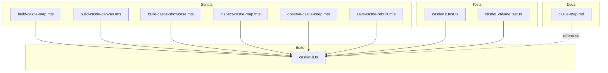
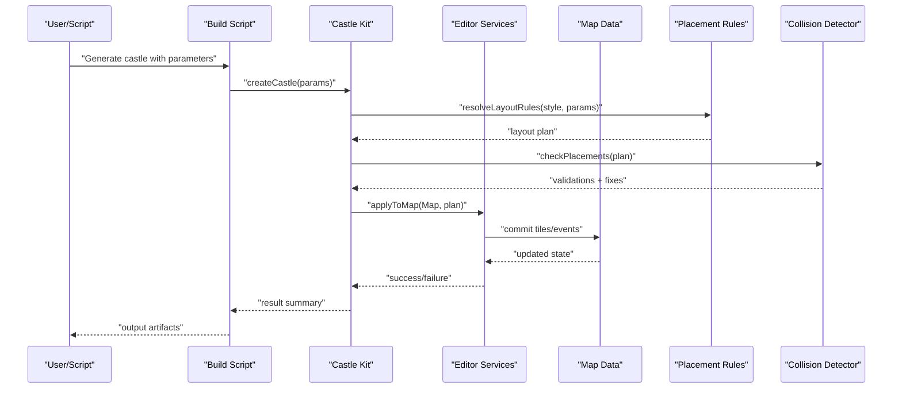
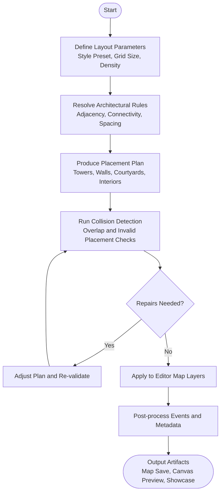
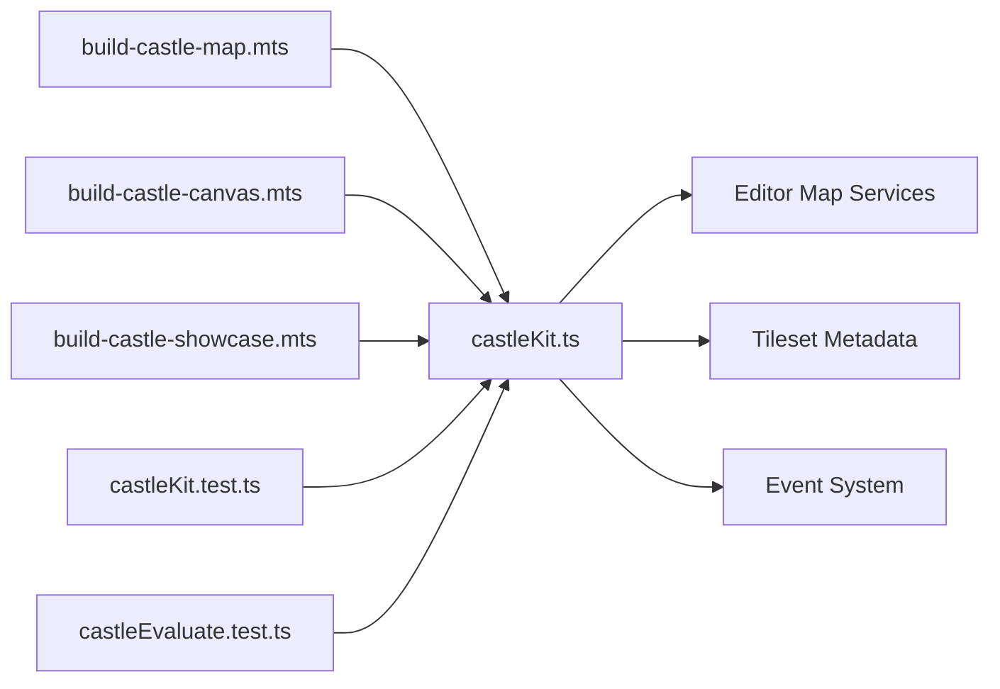

# Castle Builder

<cite>
**Referenced Files in This Document**
- [castleKit.ts](file://src/editor/castleKit.ts)
- [castleKit.test.ts](file://test/castleKit.test.ts)
- [castleEvaluate.test.ts](file://test/castleEvaluate.test.ts)
- [build-castle-map.mts](file://scripts/build-castle-map.mts)
- [build-castle-canvas.mts](file://scripts/build-castle-canvas.mts)
- [build-castle-showcase.mts](file://scripts/build-castle-showcase.mts)
- [inspect-castle-map.mts](file://scripts/inspect-castle-map.mts)
- [observe-castle-keep.mts](file://scripts/observe-castle-keep.mts)
- [save-castle-rebuilt.mts](file://scripts/save-castle-rebuilt.mts)
- [castle-map.md](file://openwiki/castle-map.md)
</cite>

## Table of Contents
1. [Introduction](#introduction)
2. [Project Structure](#project-structure)
3. [Core Components](#core-components)
4. [Architecture Overview](#architecture-overview)
5. [Detailed Component Analysis](#detailed-component-analysis)
6. [Dependency Analysis](#dependency-analysis)
7. [Performance Considerations](#performance-considerations)
8. [Troubleshooting Guide](#troubleshooting-guide)
9. [Conclusion](#conclusion)
10. [Appendices](#appendices)

## Introduction
This document explains the castle builder tool and its integration with the main editor. It covers generation algorithms, architectural rules, layout parameters, customization options for different castle styles, and how to use the castle kit API to produce castles with towers, walls, courtyards, and interior spaces. It also documents the rule-based placement system, collision detection considerations, performance optimization strategies for large structures, and troubleshooting guidance for common issues such as wall connectivity problems.

## Project Structure
The castle builder is implemented primarily within the editor subsystem and exposed via a dedicated kit module. Supporting scripts provide headless build flows, visualization, inspection, and persistence utilities. Tests validate behavior and evaluate outcomes.

**Diagram sources**
- [castleKit.ts](file://src/editor/castleKit.ts)
- [build-castle-map.mts](file://scripts/build-castle-map.mts)
- [build-castle-canvas.mts](file://scripts/build-castle-canvas.mts)
- [build-castle-showcase.mts](file://scripts/build-castle-showcase.mts)
- [inspect-castle-map.mts](file://scripts/inspect-castle-map.mts)
- [observe-castle-keep.mts](file://scripts/observe-castle-keep.mts)
- [save-castle-rebuilt.mts](file://scripts/save-castle-rebuilt.mts)
- [castleKit.test.ts](file://test/castleKit.test.ts)
- [castleEvaluate.test.ts](file://test/castleEvaluate.test.ts)
- [castle-map.md](file://openwiki/castle-map.md)

**Section sources**
- [castleKit.ts](file://src/editor/castleKit.ts)
- [castleKit.test.ts](file://test/castleKit.test.ts)
- [castleEvaluate.test.ts](file://test/castleEvaluate.test.ts)
- [build-castle-map.mts](file://scripts/build-castle-map.mts)
- [build-castle-canvas.mts](file://scripts/build-castle-canvas.mts)
- [build-castle-showcase.mts](file://scripts/build-castle-showcase.mts)
- [inspect-castle-map.mts](file://scripts/inspect-castle-map.mts)
- [observe-castle-keep.mts](file://scripts/observe-castle-keep.mts)
- [save-castle-rebuilt.mts](file://scripts/save-castle-rebuilt.mts)
- [castle-map.md](file://openwiki/castle-map.md)

## Core Components
- Castle Kit API: The primary entry point for generating and customizing castle layouts programmatically from both editor tools and headless scripts. It exposes functions to define layout parameters, choose architectural styles, place structural elements (towers, walls, courtyards, interiors), and apply rules for connectivity and collisions.
- Headless Build Scripts: Provide reusable workflows to generate maps, render canvases, create showcases, inspect generated content, observe keep structures, and persist rebuilt results.
- Evaluation and Tests: Validate correctness of generation logic, rule application, and output quality.

Key responsibilities:
- Layout parameterization: width/height, grid resolution, style presets, density controls.
- Rule-based placement: enforce architectural grammar, adjacency constraints, and connectivity.
- Collision detection: prevent overlapping or invalid placements across layers.
- Performance optimizations: chunking, batching, and incremental updates for large structures.

**Section sources**
- [castleKit.ts](file://src/editor/castleKit.ts)
- [castleKit.test.ts](file://test/castleKit.test.ts)
- [castleEvaluate.test.ts](file://test/castleEvaluate.test.ts)

## Architecture Overview
The castle builder integrates tightly with the editor’s map and tile systems. The kit orchestrates high-level generation steps while delegating low-level operations to editor services. Headless scripts drive the kit through standardized interfaces to produce reproducible outputs.

**Diagram sources**
- [castleKit.ts](file://src/editor/castleKit.ts)
- [build-castle-map.mts](file://scripts/build-castle-map.mts)
- [build-castle-canvas.mts](file://scripts/build-castle-canvas.mts)
- [build-castle-showcase.mts](file://scripts/build-castle-showcase.mts)

## Detailed Component Analysis

### Castle Kit API
The castle kit provides a programmatic interface to generate and customize castle layouts. Typical usage includes:
- Defining layout parameters (grid size, style preset, density).
- Selecting architectural styles (e.g., keep-centric, concentric rings, linear bastions).
- Placing core components: towers, curtain walls, gatehouses, courtyards, interior rooms.
- Applying rule-based constraints for connectivity and collisions.
- Rendering or saving the resulting map.

Recommended workflow:
1. Initialize kit with project context.
2. Configure parameters and style presets.
3. Generate layout plan using rule engine.
4. Validate and repair placements via collision checks.
5. Apply changes to the active map layer(s).
6. Export or visualize results.

Customization options:
- Style presets: control proportions, tower frequency, wall thickness, courtyard sizes.
- Density and spacing: tune element distribution and gaps.
- Connectivity rules: ensure paths between gates, courtyards, and keeps.
- Interior templates: select room modules and attach events.

Integration points:
- Editor map APIs for tile/event manipulation.
- Tileset metadata for autotile composition.
- Region and zone definitions for gameplay semantics.

Practical examples:
- Generate a compact keep with surrounding walls and one courtyard.
- Create a multi-ring castle with multiple towers and inner/outer baileys.
- Produce an elongated fortress with bastion towers and angled walls.

**Section sources**
- [castleKit.ts](file://src/editor/castleKit.ts)
- [castleKit.test.ts](file://test/castleKit.test.ts)

### Headless Build Scripts
Headless scripts automate castle generation and post-processing tasks:
- build-castle-map.mts: Generates a new map based on provided parameters and saves it into the project.
- build-castle-canvas.mts: Renders a preview canvas for quick visual verification.
- build-castle-showcase.mts: Produces showcase images or videos highlighting generated castles.
- inspect-castle-map.mts: Inspects generated map data for diagnostics and validation.
- observe-castle-keep.mts: Observes keep structure properties and connectivity.
- save-castle-rebuilt.mts: Persists rebuilt castle variants for comparison or archival.

Usage patterns:
- CLI invocation with JSON configuration files.
- Batch processing over multiple style presets.
- Integration with CI pipelines for automated quality checks.

**Section sources**
- [build-castle-map.mts](file://scripts/build-castle-map.mts)
- [build-castle-canvas.mts](file://scripts/build-castle-canvas.mts)
- [build-castle-showcase.mts](file://scripts/build-castle-showcase.mts)
- [inspect-castle-map.mts](file://scripts/inspect-castle-map.mts)
- [observe-castle-keep.mts](file://scripts/observe-castle-keep.mts)
- [save-castle-rebuilt.mts](file://scripts/save-castle-rebuilt.mts)

### Evaluation and Tests
- castleKit.test.ts: Validates API contracts, parameter handling, and basic generation scenarios.
- castleEvaluate.test.ts: Evaluates generated outputs against quality metrics (connectivity, coverage, aesthetics).

These tests help ensure stability and guide improvements to the rule engine and collision detection.

**Section sources**
- [castleKit.test.ts](file://test/castleKit.test.ts)
- [castleEvaluate.test.ts](file://test/castleEvaluate.test.ts)

### Conceptual Overview
The following conceptual diagram illustrates the typical flow from user intent to final castle output, independent of specific code mappings.

[No sources needed since this diagram shows conceptual workflow, not actual code structure]

## Dependency Analysis
The castle kit depends on editor services for map manipulation, tilesets, and event systems. Headless scripts depend on the kit and may rely on file I/O and rendering utilities. Tests depend on both the kit and evaluation helpers.

**Diagram sources**
- [castleKit.ts](file://src/editor/castleKit.ts)
- [build-castle-map.mts](file://scripts/build-castle-map.mts)
- [build-castle-canvas.mts](file://scripts/build-castle-canvas.mts)
- [build-castle-showcase.mts](file://scripts/build-castle-showcase.mts)
- [castleKit.test.ts](file://test/castleKit.test.ts)
- [castleEvaluate.test.ts](file://test/castleEvaluate.test.ts)

**Section sources**
- [castleKit.ts](file://src/editor/castleKit.ts)
- [build-castle-map.mts](file://scripts/build-castle-map.mts)
- [build-castle-canvas.mts](file://scripts/build-castle-canvas.mts)
- [build-castle-showcase.mts](file://scripts/build-castle-showcase.mts)
- [castleKit.test.ts](file://test/castleKit.test.ts)
- [castleEvaluate.test.ts](file://test/castleEvaluate.test.ts)

## Performance Considerations
For large castle structures, consider the following strategies:
- Chunked generation: process the map in tiles or regions to reduce memory spikes.
- Batched writes: group tile and event updates to minimize editor overhead.
- Incremental validation: run collision checks per region rather than globally when possible.
- Caching: reuse computed layout plans and tile compositions for repeated runs.
- Level-of-detail: simplify previews by deferring fine-grained details until final export.

[No sources needed since this section provides general guidance]

## Troubleshooting Guide
Common issues and resolutions:
- Wall connectivity problems:
  - Verify adjacency rules allow continuous wall segments.
  - Ensure gatehouse placements do not break required connections.
  - Use inspection scripts to identify disconnected segments and auto-repair where feasible.
- Overlapping elements:
  - Confirm collision detection thresholds are appropriate for chosen tilesets.
  - Adjust spacing parameters to avoid tight fits that trigger false positives.
- Interior placement failures:
  - Check room template compatibility with available floor tiles.
  - Validate door alignments and event references.
- Performance bottlenecks:
  - Reduce generation scope (smaller grids or fewer elements).
  - Enable chunked processing and batched writes.
  - Profile editor service calls to identify hotspots.

Useful diagnostic scripts:
- inspect-castle-map.mts: analyze map structure and connectivity.
- observe-castle-keep.mts: verify keep integrity and internal routing.
- save-castle-rebuilt.mts: persist alternative configurations for comparison.

**Section sources**
- [inspect-castle-map.mts](file://scripts/inspect-castle-map.mts)
- [observe-castle-keep.mts](file://scripts/observe-castle-keep.mts)
- [save-castle-rebuilt.mts](file://scripts/save-castle-rebuilt.mts)

## Conclusion
The castle builder provides a robust, rule-driven approach to generating complex castle layouts with strong integration into the editor. By leveraging the castle kit API, developers can customize architectural styles, enforce connectivity and collision constraints, and optimize performance for large structures. Headless scripts streamline automation and evaluation, while tests ensure reliability. With careful parameter tuning and adherence to architectural rules, users can produce diverse and functional castles efficiently.

[No sources needed since this section summarizes without analyzing specific files]

## Appendices

### Practical Examples
- Compact Keep with Courtyard:
  - Set style preset to “Keep-Centric”.
  - Define moderate density and enable single courtyard.
  - Generate and validate connectivity between keep and gatehouse.
- Multi-Ring Fortress:
  - Choose “Concentric Rings” style.
  - Increase tower count and wall thickness.
  - Add inner and outer baileys; verify path continuity.
- Linear Bastion Castle:
  - Select “Linear Bastions” style.
  - Configure elongated grid and angled walls.
  - Place bastion towers at intervals; check collision-free transitions.

[No sources needed since this section provides general guidance]

### References
- Castle map documentation and design notes:
  - [castle-map.md](file://openwiki/castle-map.md)

**Section sources**
- [castle-map.md](file://openwiki/castle-map.md)