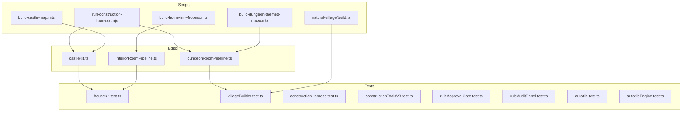
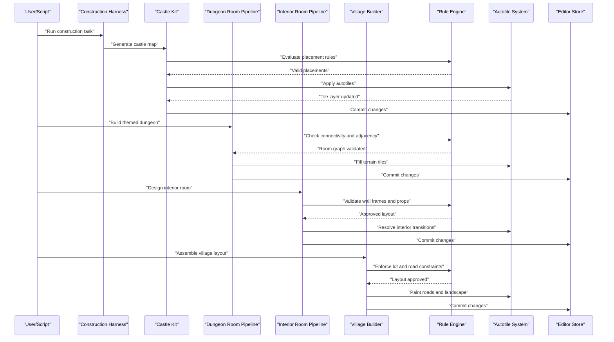
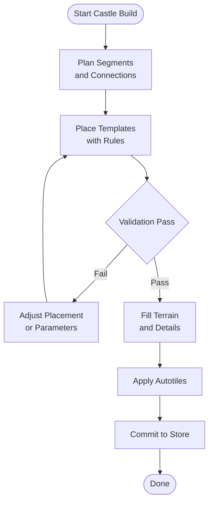
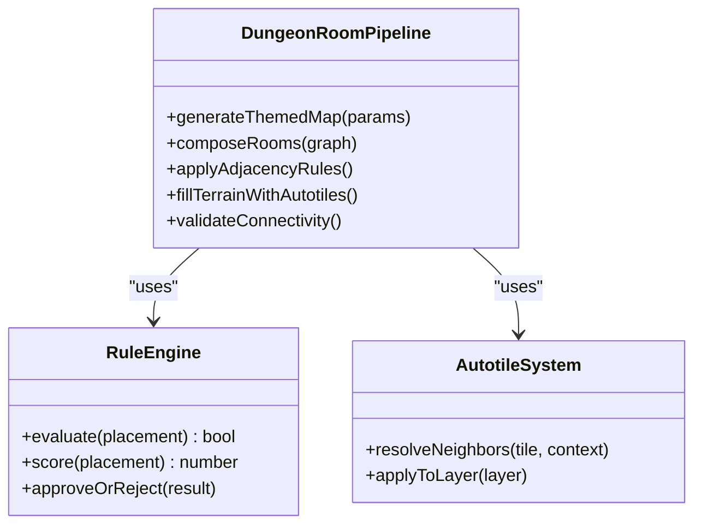
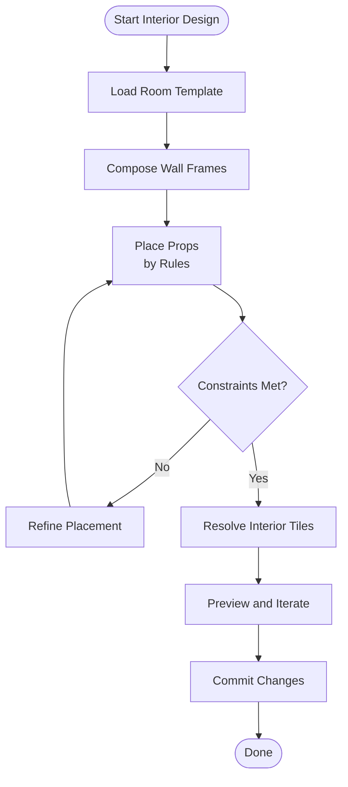
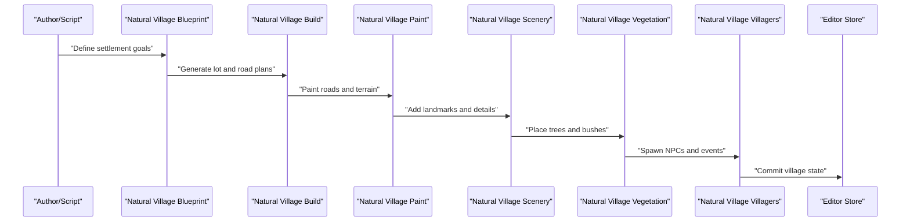
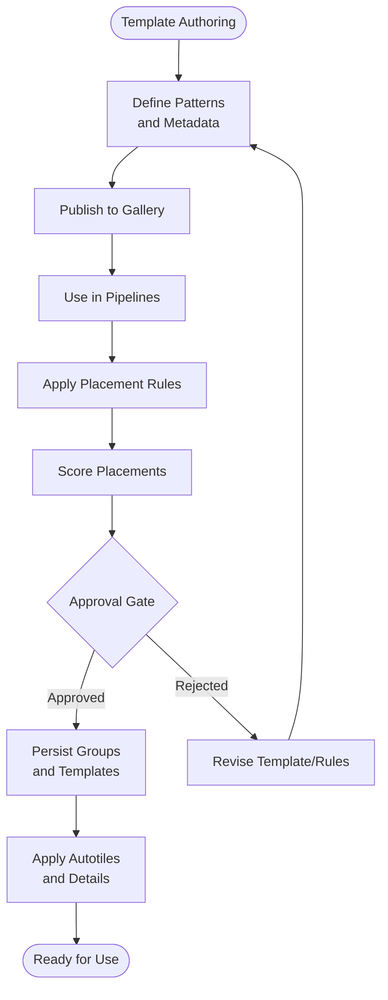
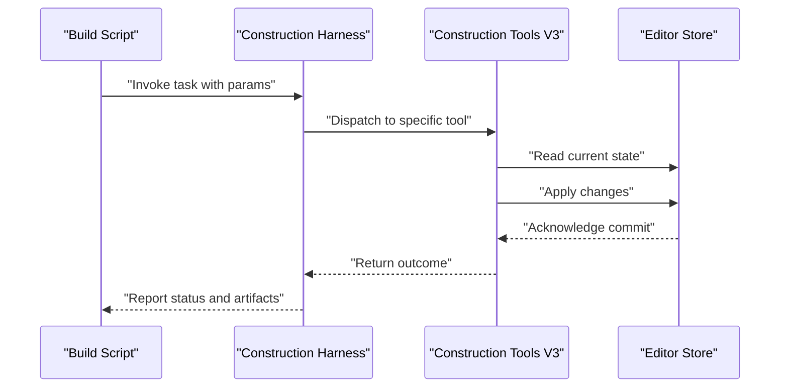
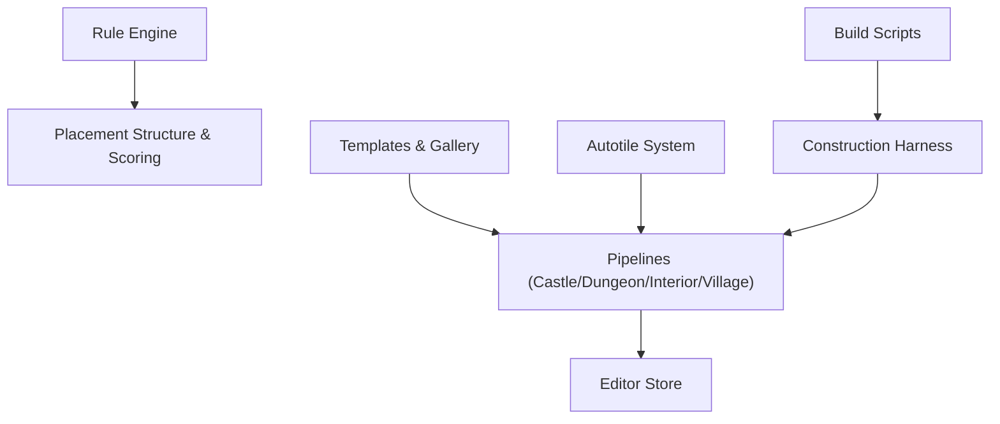

# Construction Kit and Templates

<cite>
**Referenced Files in This Document**
- [castleKit.ts](file://src/editor/castleKit.ts)
- [dungeonRoomPipeline.ts](file://src/editor/dungeonRoomPipeline.ts)
- [houseKit.test.ts](file://test/houseKit.test.ts)
- [villageBuilder.test.ts](file://test/villageBuilder.test.ts)
- [constructionHarness.test.ts](file://test/constructionHarness.test.ts)
- [constructionToolsV3.test.ts](file://test/constructionToolsV3.test.ts)
- [toolsHouseAndRules.test.ts](file://test/toolsHouseAndRules.test.ts)
- [setClusterRule.test.ts](file://test/setClusterRule.test.ts)
- [clusterRulePlacement.test.ts](file://test/clusterRulePlacement.test.ts)
- [clusterRuleValidators.test.ts](file://test/clusterRuleValidators.test.ts)
- [placementStructure.test.ts](file://test/placementStructure.test.ts)
- [placementScoring.test.ts](file://test/placementScoring.test.ts)
- [roomHarnessEngine.test.ts](file://test/roomHarnessEngine.test.ts)
- [interiorRoomPipeline.test.ts](file://test/interiorRoomPipeline.test.ts)
- [dungeonRoomPipeline.test.ts](file://test/dungeonRoomPipeline.test.ts)
- [houseTemplates.test.ts](file://test/houseTemplates.test.ts)
- [houseTemplateGallery.test.ts](file://test/houseTemplateGallery.test.ts)
- [dbExtractedHouseTemplate.test.ts](file://test/dbExtractedHouseTemplate.test.ts)
- [smallHouseVariants.test.ts](file://test/smallHouseVariants.test.ts)
- [villagerRoomKit.test.ts](file://test/villagerRoomKit.test.ts)
- [naturalVillageReference.test.ts](file://test/naturalVillageReference.test.ts)
- [villageLandscape.test.ts](file://test/villageLandscape.test.ts)
- [lakeVillageCenterRebuild.test.ts](file://test/lakeVillageCenterRebuild.test.ts)
- [lakeVillageRebuildFinal.test.ts](file://test/lakeVillageRebuildFinal.test.ts)
- [townArchitectureCity.test.ts](file://test/townArchitectureCity.test.ts)
- [townArchitectureTest.test.ts](file://test/townArchitectureTest.test.ts)
- [mapLayoutPlan.test.ts](file://test/mapLayoutPlan.test.ts)
- [groupLayoutAuthoring.test.ts](file://test/groupLayoutAuthoring.test.ts)
- [ruleApprovalGate.test.ts](file://test/ruleApprovalGate.test.ts)
- [ruleAuditPanel.test.ts](file://test/ruleAuditPanel.test.ts)
- [structureKitDbActions.test.ts](file://test/structureKitDbActions.test.ts)
- [structureKitTools.test.ts](file://test/structureKitTools.test.ts)
- [structureStampTools.test.ts](file://test/structureStampTools.test.ts)
- [autotileTemplates.test.ts](file://test/autotileTemplates.test.ts)
- [tileFlowApprovalExpansion.test.ts](file://test/tileFlowApprovalExpansion.test.ts)
- [autotile.test.ts](file://test/autotile.test.ts)
- [autotileEngine.test.ts](file://test/autotileEngine.test.ts)
- [autotileGroupPersistence.test.ts](file://test/autotileGroupPersistence.test.ts)
- [builtinAutotileGroups.test.ts](file://test/builtinAutotileGroups.test.ts)
- [darkWallAutotile.test.ts](file://test/darkWallAutotile.test.ts)
- [terrainQuarterAutotile.test.ts](file://test/terrainQuarterAutotile.test.ts)
- [interiorTerrainAutotiles.test.ts](file://test/interiorTerrainAutotiles.test.ts)
- [interiorWallFrameQuarterComposition.test.ts](file://test/interiorWallFrameQuarterComposition.test.ts)
- [legacyInteriorWallContract.test.ts](file://test/legacyInteriorWallContract.test.ts)
- [largeProjectPerf.test.ts](file://test/largeProjectPerf.test.ts)
- [perf-benchmark.mjs](file://scripts/perf-benchmark.mjs)
- [run-construction-harness.mjs](file://scripts/run-construction-harness.mjs)
- [build-castle-map.mts](file://scripts/build-castle-map.mts)
- [build-dungeon-themed-maps.mts](file://scripts/build-dungeon-themed-maps.mts)
- [build-home-inn-4rooms.mts](file://scripts/build-home-inn-4rooms.mts)
- [build-villager-room-gallery.mts](file://scripts/build-villager-room-gallery.mts)
- [wipe-and-build-large-river-market-village.mts](file://scripts/wipe-and-build-large-river-market-village.mts)
- [ai-natural-village-harness.mts](file://scripts/author-natural-village-harness.mts)
- [natural-village/blueprint.ts](file://scripts/natural-village/blueprint.ts)
- [natural-village/build.ts](file://scripts/natural-village/build.ts)
- [natural-village/events.ts](file://scripts/natural-village/events.ts)
- [natural-village/paint.ts](file://scripts/natural-village/paint.ts)
- [natural-village/scenery.ts](file://scripts/natural-village/scenery.ts)
- [natural-village/vegetation.ts](file://scripts/natural-village/vegetation.ts)
- [natural-village/villagers.ts](file://scripts/natural-village/villagers.ts)
</cite>

## Table of Contents
1. [Introduction](#introduction)
2. [Project Structure](#project-structure)
3. [Core Components](#core-components)
4. [Architecture Overview](#architecture-overview)
5. [Detailed Component Analysis](#detailed-component-analysis)
6. [Dependency Analysis](#dependency-analysis)
7. [Performance Considerations](#performance-considerations)
8. [Troubleshooting Guide](#troubleshooting-guide)
9. [Conclusion](#conclusion)
10. [Appendices](#appendices)

## Introduction
This document explains the construction kit and template system used to rapidly author levels, interiors, dungeons, castles, and villages. It covers:
- Castle builder, dungeon room generator, house interior designer, and village layout tools
- Template system architecture and rule-based placement algorithms
- Procedural generation parameters and customization guidelines
- Construction tool APIs and integration with the main editor
- Practical examples for rapid prototyping, consistent level design, and collaborative world building
- Performance considerations for large-scale operations

The goal is to help authors and teams build coherent worlds quickly while maintaining quality and consistency through templates and rules.

## Project Structure
The construction kit spans editor modules, test suites validating behavior, scripts driving end-to-end builds, and utilities for natural village generation. Key areas include:
- Editor construction kits and pipelines (e.g., castle kit, dungeon room pipeline)
- House and interior templates and galleries
- Village and town layout builders
- Rule-based placement and autotile systems
- Harnesses and scripts that orchestrate large-scale generation

**Diagram sources**
- [castleKit.ts](file://src/editor/castleKit.ts)
- [dungeonRoomPipeline.ts](file://src/editor/dungeonRoomPipeline.ts)
- [interiorRoomPipeline.ts](file://src/editor/interiorRoomPipeline.ts)
- [houseKit.test.ts](file://test/houseKit.test.ts)
- [villageBuilder.test.ts](file://test/villageBuilder.test.ts)
- [constructionHarness.test.ts](file://test/constructionHarness.test.ts)
- [constructionToolsV3.test.ts](file://test/constructionToolsV3.test.ts)
- [ruleApprovalGate.test.ts](file://test/ruleApprovalGate.test.ts)
- [ruleAuditPanel.test.ts](file://test/ruleAuditPanel.test.ts)
- [autotile.test.ts](file://test/autotile.test.ts)
- [autotileEngine.test.ts](file://test/autotileEngine.test.ts)
- [run-construction-harness.mjs](file://scripts/run-construction-harness.mjs)
- [build-castle-map.mts](file://scripts/build-castle-map.mts)
- [build-dungeon-themed-maps.mts](file://scripts/build-dungeon-themed-maps.mts)
- [build-home-inn-4rooms.mts](file://scripts/build-home-inn-4rooms.mts)
- [natural-village/build.ts](file://scripts/natural-village/build.ts)

**Section sources**
- [castleKit.ts](file://src/editor/castleKit.ts)
- [dungeonRoomPipeline.ts](file://src/editor/dungeonRoomPipeline.ts)
- [houseKit.test.ts](file://test/houseKit.test.ts)
- [villageBuilder.test.ts](file://test/villageBuilder.test.ts)
- [constructionHarness.test.ts](file://test/constructionHarness.test.ts)
- [constructionToolsV3.test.ts](file://test/constructionToolsV3.test.ts)
- [ruleApprovalGate.test.ts](file://test/ruleApprovalGate.test.ts)
- [ruleAuditPanel.test.ts](file://test/ruleAuditPanel.test.ts)
- [autotile.test.ts](file://test/autotile.test.ts)
- [autotileEngine.test.ts](file://test/autotileEngine.test.ts)
- [run-construction-harness.mjs](file://scripts/run-construction-harness.mjs)
- [build-castle-map.mts](file://scripts/build-castle-map.mts)
- [build-dungeon-themed-maps.mts](file://scripts/build-dungeon-themed-maps.mts)
- [build-home-inn-4rooms.mts](file://scripts/build-home-inn-4rooms.mts)
- [natural-village/build.ts](file://scripts/natural-village/build.ts)

## Core Components
- Castle Builder: Provides high-level operations to generate castle maps and structures using templated components and placement rules.
- Dungeon Room Generator: Composes rooms from templates, applies adjacency and connectivity constraints, and fills terrain with autotiles.
- House Interior Designer: Authoring and previewing interior layouts via templates, wall frames, and prop placement guided by rules.
- Village Layout Tools: Orchestrates lot planning, road networks, buildings, and landscape features across multiple maps.

These components share a common template and rule engine:
- Templates define reusable spatial patterns (rooms, walls, props, terrain).
- Rules constrain placement (adjacency, clearance, connectivity, style).
- Pipelines sequence steps (layout, fill, polish, validate).

**Section sources**
- [castleKit.ts](file://src/editor/castleKit.ts)
- [dungeonRoomPipeline.ts](file://src/editor/dungeonRoomPipeline.ts)
- [houseKit.test.ts](file://test/houseKit.test.ts)
- [villageBuilder.test.ts](file://test/villageBuilder.test.ts)
- [constructionHarness.test.ts](file://test/constructionHarness.test.ts)
- [constructionToolsV3.test.ts](file://test/constructionToolsV3.test.ts)

## Architecture Overview
The construction system follows a layered architecture:
- API Layer: Public functions and harnesses expose construction actions to editors and scripts.
- Pipeline Layer: Ordered stages compose templates, apply rules, and perform validation.
- Rule Engine: Evaluates placement constraints and scoring to select valid placements.
- Autotile System: Resolves tile transitions based on neighborhood context.
- Persistence and Integration: Commits changes to the project store and integrates with the editor UI.

**Diagram sources**
- [constructionHarness.test.ts](file://test/constructionHarness.test.ts)
- [castleKit.ts](file://src/editor/castleKit.ts)
- [dungeonRoomPipeline.ts](file://src/editor/dungeonRoomPipeline.ts)
- [interiorRoomPipeline.ts](file://src/editor/interiorRoomPipeline.ts)
- [villageBuilder.test.ts](file://test/villageBuilder.test.ts)
- [autotile.test.ts](file://test/autotile.test.ts)
- [autotileEngine.test.ts](file://test/autotileEngine.test.ts)

## Detailed Component Analysis

### Castle Builder
The castle builder composes large-scale structures using templated segments and rule-driven placement. It supports:
- High-level composition of keep, towers, walls, and courtyards
- Consistent style application via templates
- Validation of structural integrity and connectivity

**Diagram sources**
- [castleKit.ts](file://src/editor/castleKit.ts)
- [constructionHarness.test.ts](file://test/constructionHarness.test.ts)
- [build-castle-map.mts](file://scripts/build-castle-map.mts)

**Section sources**
- [castleKit.ts](file://src/editor/castleKit.ts)
- [constructionHarness.test.ts](file://test/constructionHarness.test.ts)
- [build-castle-map.mts](file://scripts/build-castle-map.mts)

### Dungeon Room Generator
The dungeon room generator creates connected room graphs, enforces adjacency constraints, and fills terrain with appropriate autotiles. It supports themed layouts and parameterized difficulty or density.

**Diagram sources**
- [dungeonRoomPipeline.ts](file://src/editor/dungeonRoomPipeline.ts)
- [dungeonRoomPipeline.test.ts](file://test/dungeonRoomPipeline.test.ts)
- [autotile.test.ts](file://test/autotile.test.ts)
- [autotileEngine.test.ts](file://test/autotileEngine.test.ts)

**Section sources**
- [dungeonRoomPipeline.ts](file://src/editor/dungeonRoomPipeline.ts)
- [dungeonRoomPipeline.test.ts](file://test/dungeonRoomPipeline.test.ts)
- [autotile.test.ts](file://test/autotile.test.ts)
- [autotileEngine.test.ts](file://test/autotileEngine.test.ts)

### House Interior Designer
The interior designer focuses on room templates, wall frames, and prop placement. It ensures consistent interior aesthetics and functional layouts.

**Diagram sources**
- [houseKit.test.ts](file://test/houseKit.test.ts)
- [interiorRoomPipeline.test.ts](file://test/interiorRoomPipeline.test.ts)
- [interiorTerrainAutotiles.test.ts](file://test/interiorTerrainAutotiles.test.ts)
- [interiorWallFrameQuarterComposition.test.ts](file://test/interiorWallFrameQuarterComposition.test.ts)
- [legacyInteriorWallContract.test.ts](file://test/legacyInteriorWallContract.test.ts)

**Section sources**
- [houseKit.test.ts](file://test/houseKit.test.ts)
- [interiorRoomPipeline.test.ts](file://test/interiorRoomPipeline.test.ts)
- [interiorTerrainAutotiles.test.ts](file://test/interiorTerrainAutotiles.test.ts)
- [interiorWallFrameQuarterComposition.test.ts](file://test/interiorWallFrameQuarterComposition.test.ts)
- [legacyInteriorWallContract.test.ts](file://test/legacyInteriorWallContract.test.ts)

### Village Layout Tools
Village layout tools plan lots, roads, buildings, and landscape features across multiple maps. They support natural settlement patterns and structured town layouts.

**Diagram sources**
- [natural-village/blueprint.ts](file://scripts/natural-village/blueprint.ts)
- [natural-village/build.ts](file://scripts/natural-village/build.ts)
- [natural-village/paint.ts](file://scripts/natural-village/paint.ts)
- [natural-village/scenery.ts](file://scripts/natural-village/scenery.ts)
- [natural-village/vegetation.ts](file://scripts/natural-village/vegetation.ts)
- [natural-village/villagers.ts](file://scripts/natural-village/villagers.ts)
- [naturalVillageReference.test.ts](file://test/naturalVillageReference.test.ts)
- [villageLandscape.test.ts](file://test/villageLandscape.test.ts)
- [lakeVillageCenterRebuild.test.ts](file://test/lakeVillageCenterRebuild.test.ts)
- [lakeVillageRebuildFinal.test.ts](file://test/lakeVillageRebuildFinal.test.ts)

**Section sources**
- [natural-village/blueprint.ts](file://scripts/natural-village/blueprint.ts)
- [natural-village/build.ts](file://scripts/natural-village/build.ts)
- [natural-village/paint.ts](file://scripts/natural-village/paint.ts)
- [natural-village/scenery.ts](file://scripts/natural-village/scenery.ts)
- [natural-village/vegetation.ts](file://scripts/natural-village/vegetation.ts)
- [natural-village/villagers.ts](file://scripts/natural-village/villagers.ts)
- [naturalVillageReference.test.ts](file://test/naturalVillageReference.test.ts)
- [villageLandscape.test.ts](file://test/villageLandscape.test.ts)
- [lakeVillageCenterRebuild.test.ts](file://test/lakeVillageCenterRebuild.test.ts)
- [lakeVillageRebuildFinal.test.ts](file://test/lakeVillageRebuildFinal.test.ts)

### Template System and Rule-Based Placement
Templates define reusable spatial patterns; rules enforce placement constraints and scoring. The system includes:
- Template authoring and gallery browsing
- Rule creation, approval gates, and audit panels
- Placement structure and scoring mechanisms
- Autotile templates and group persistence

**Diagram sources**
- [houseTemplates.test.ts](file://test/houseTemplates.test.ts)
- [houseTemplateGallery.test.ts](file://test/houseTemplateGallery.test.ts)
- [dbExtractedHouseTemplate.test.ts](file://test/dbExtractedHouseTemplate.test.ts)
- [ruleApprovalGate.test.ts](file://test/ruleApprovalGate.test.ts)
- [ruleAuditPanel.test.ts](file://test/ruleAuditPanel.test.ts)
- [placementStructure.test.ts](file://test/placementStructure.test.ts)
- [placementScoring.test.ts](file://test/placementScoring.test.ts)
- [autotileTemplates.test.ts](file://test/autotileTemplates.test.ts)
- [autotileGroupPersistence.test.ts](file://test/autotileGroupPersistence.test.ts)

**Section sources**
- [houseTemplates.test.ts](file://test/houseTemplates.test.ts)
- [houseTemplateGallery.test.ts](file://test/houseTemplateGallery.test.ts)
- [dbExtractedHouseTemplate.test.ts](file://test/dbExtractedHouseTemplate.test.ts)
- [ruleApprovalGate.test.ts](file://test/ruleApprovalGate.test.ts)
- [ruleAuditPanel.test.ts](file://test/ruleAuditPanel.test.ts)
- [placementStructure.test.ts](file://test/placementStructure.test.ts)
- [placementScoring.test.ts](file://test/placementScoring.test.ts)
- [autotileTemplates.test.ts](file://test/autotileTemplates.test.ts)
- [autotileGroupPersistence.test.ts](file://test/autotileGroupPersistence.test.ts)

### Construction Tool APIs and Integration
The construction harness exposes APIs for running tasks, integrating with the editor, and orchestrating multi-step builds. Tests cover tool exposure, schema compatibility, and domain scoping.

**Diagram sources**
- [run-construction-harness.mjs](file://scripts/run-construction-harness.mjs)
- [constructionToolsV3.test.ts](file://test/constructionToolsV3.test.ts)
- [constructionHarness.test.ts](file://test/constructionHarness.test.ts)

**Section sources**
- [run-construction-harness.mjs](file://scripts/run-construction-harness.mjs)
- [constructionToolsV3.test.ts](file://test/constructionToolsV3.test.ts)
- [constructionHarness.test.ts](file://test/constructionHarness.test.ts)

### Practical Examples
- Rapid Prototyping: Use the construction harness to spin up quick prototypes with predefined templates and parameters.
- Consistent Level Design: Leverage rule-based placement and autotile groups to maintain visual coherence across maps.
- Collaborative World Building: Employ approval gates and audit panels to review and approve template changes before publishing.

Examples are demonstrated in tests and scripts such as:
- Small house variants and villager room kits
- Themed dungeon maps and inn interiors
- Large river market village assembly

**Section sources**
- [smallHouseVariants.test.ts](file://test/smallHouseVariants.test.ts)
- [villagerRoomKit.test.ts](file://test/villagerRoomKit.test.ts)
- [build-dungeon-themed-maps.mts](file://scripts/build-dungeon-themed-maps.mts)
- [build-home-inn-4rooms.mts](file://scripts/build-home-inn-4rooms.mts)
- [wipe-and-build-large-river-market-village.mts](file://scripts/wipe-and-build-large-river-market-village.mts)

## Dependency Analysis
The construction kit depends on:
- Rule engine and placement scoring
- Autotile resolution and group persistence
- Template galleries and database-backed extraction
- Harness and scripts for orchestration

**Diagram sources**
- [placementStructure.test.ts](file://test/placementStructure.test.ts)
- [placementScoring.test.ts](file://test/placementScoring.test.ts)
- [autotile.test.ts](file://test/autotile.test.ts)
- [autotileEngine.test.ts](file://test/autotileEngine.test.ts)
- [autotileGroupPersistence.test.ts](file://test/autotileGroupPersistence.test.ts)
- [houseTemplateGallery.test.ts](file://test/houseTemplateGallery.test.ts)
- [run-construction-harness.mjs](file://scripts/run-construction-harness.mjs)

**Section sources**
- [placementStructure.test.ts](file://test/placementStructure.test.ts)
- [placementScoring.test.ts](file://test/placementScoring.test.ts)
- [autotile.test.ts](file://test/autotile.test.ts)
- [autotileEngine.test.ts](file://test/autotileEngine.test.ts)
- [autotileGroupPersistence.test.ts](file://test/autotileGroupPersistence.test.ts)
- [houseTemplateGallery.test.ts](file://test/houseTemplateGallery.test.ts)
- [run-construction-harness.mjs](file://scripts/run-construction-harness.mjs)

## Performance Considerations
For large-scale construction operations:
- Batch updates and minimize store writes
- Use autotile group persistence to reduce recomputation
- Prefer incremental refinement over full rebuilds
- Profile heavy operations with benchmarking utilities

Guidance references:
- Large project performance tests
- Benchmark entry points
- Harness orchestration patterns

**Section sources**
- [largeProjectPerf.test.ts](file://test/largeProjectPerf.test.ts)
- [perf-benchmark.mjs](file://scripts/perf-benchmark.mjs)
- [run-construction-harness.mjs](file://scripts/run-construction-harness.mjs)

## Troubleshooting Guide
Common issues and diagnostics:
- Rule violations: Review approval gate outcomes and audit panel logs
- Autotile mismatches: Inspect group persistence and quarter composition
- Placement failures: Validate placement structure and scoring thresholds
- Pipeline errors: Trace harness invocations and script parameters

Diagnostic resources:
- Rule approval and audit tests
- Autotile engine and group persistence tests
- Placement structure and scoring tests
- Construction tools and harness tests

**Section sources**
- [ruleApprovalGate.test.ts](file://test/ruleApprovalGate.test.ts)
- [ruleAuditPanel.test.ts](file://test/ruleAuditPanel.test.ts)
- [autotileEngine.test.ts](file://test/autotileEngine.test.ts)
- [autotileGroupPersistence.test.ts](file://test/autotileGroupPersistence.test.ts)
- [placementStructure.test.ts](file://test/placementStructure.test.ts)
- [placementScoring.test.ts](file://test/placementScoring.test.ts)
- [constructionToolsV3.test.ts](file://test/constructionToolsV3.test.ts)
- [constructionHarness.test.ts](file://test/constructionHarness.test.ts)

## Conclusion
The construction kit and template system provide a robust foundation for rapid, consistent, and collaborative world building. By combining templated patterns, rule-based placement, and autotile resolution, authors can efficiently prototype and scale complex environments. The harness and scripts enable repeatable workflows, while tests ensure reliability and performance at scale.

## Appendices

### Custom Template Creation Guidelines
- Define clear metadata and usage contexts
- Publish to the gallery after passing approval gates
- Maintain backward compatibility when updating templates
- Document parameters and expected constraints

References:
- Template gallery and extraction tests
- Approval gate and audit panel tests

**Section sources**
- [houseTemplateGallery.test.ts](file://test/houseTemplateGallery.test.ts)
- [dbExtractedHouseTemplate.test.ts](file://test/dbExtractedHouseTemplate.test.ts)
- [ruleApprovalGate.test.ts](file://test/ruleApprovalGate.test.ts)
- [ruleAuditPanel.test.ts](file://test/ruleAuditPanel.test.ts)

### Integration with Main Editor
- Use the construction harness to invoke tasks from scripts or UI
- Ensure schema compatibility and domain scoping
- Commit changes back to the editor store for live previews

References:
- Construction tools V3 tests
- Harness tests

**Section sources**
- [constructionToolsV3.test.ts](file://test/constructionToolsV3.test.ts)
- [constructionHarness.test.ts](file://test/constructionHarness.test.ts)