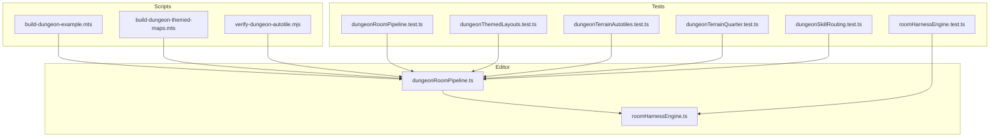
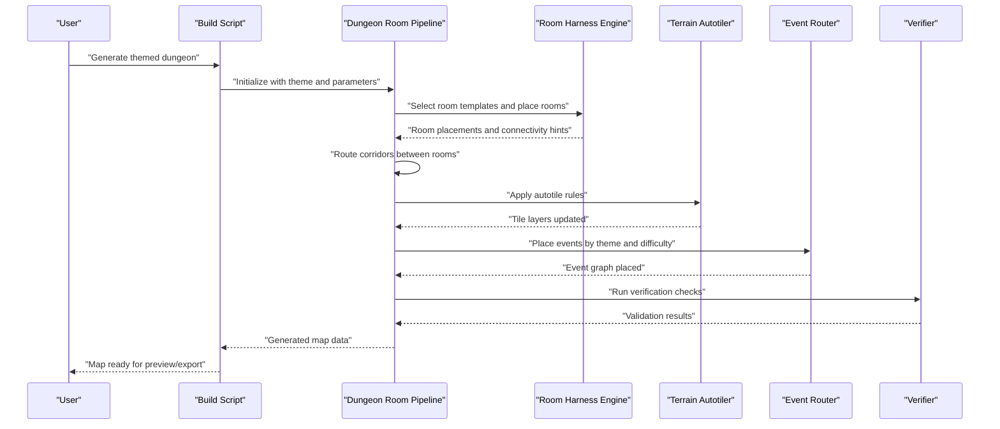
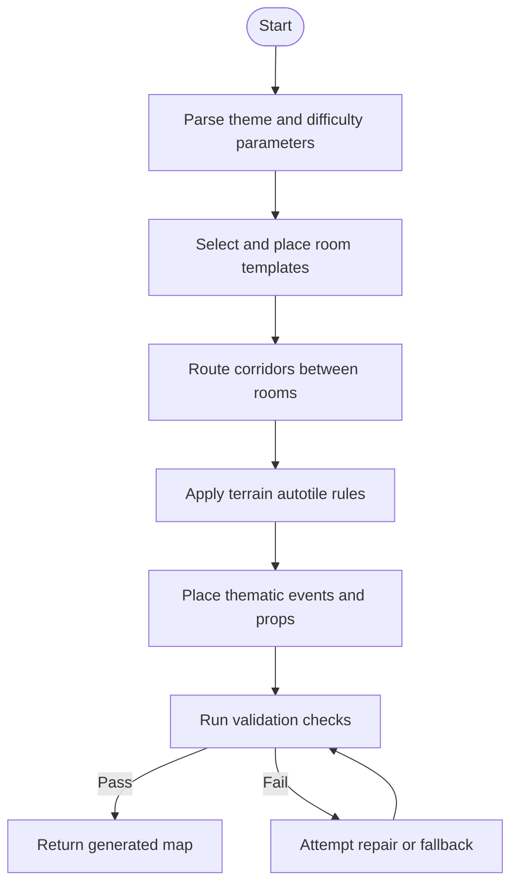
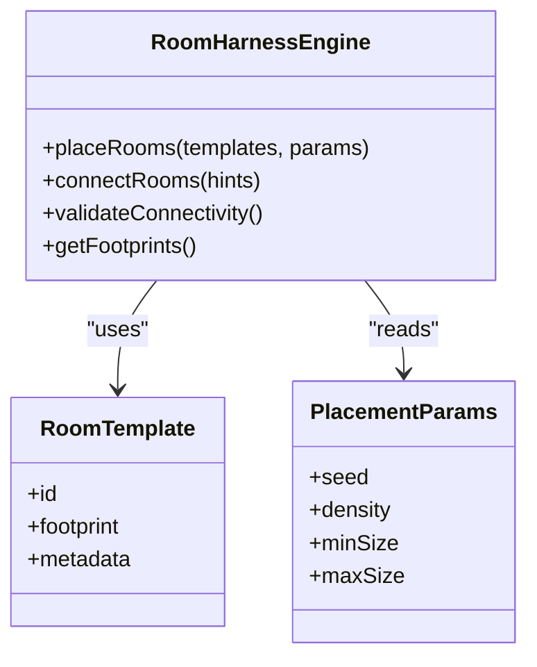
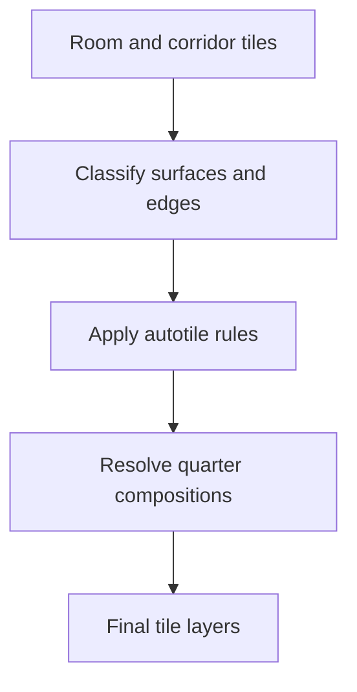
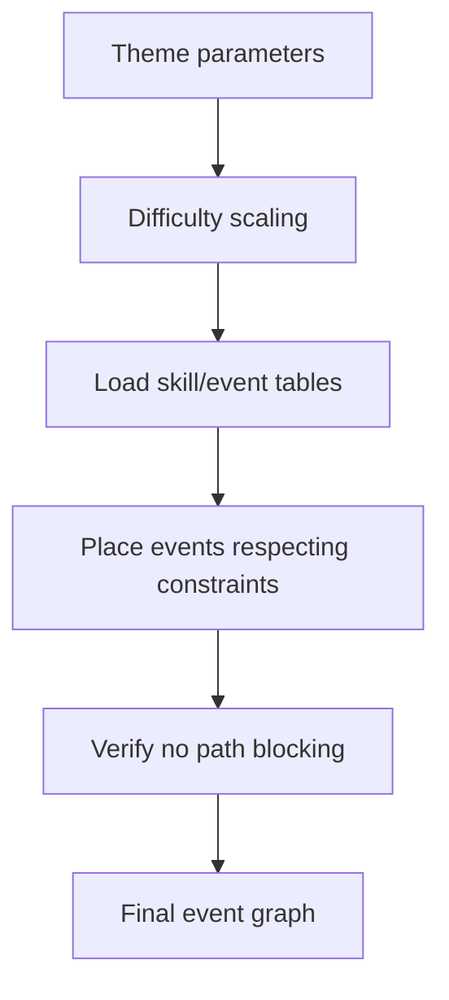
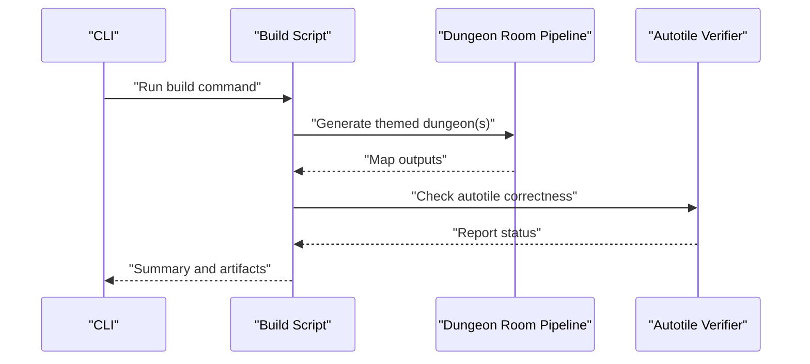
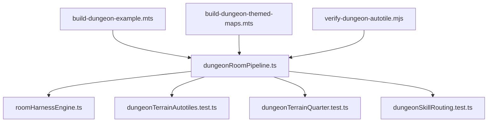

# Dungeon Room Generator

<cite>
**Referenced Files in This Document**
- [dungeonRoomPipeline.ts](file://src/editor/dungeonRoomPipeline.ts)
- [dungeonRoomPipeline.test.ts](file://test/dungeonRoomPipeline.test.ts)
- [dungeonSkillRouting.test.ts](file://test/dungeonSkillRouting.test.ts)
- [dungeonTerrainAutotiles.test.ts](file://test/dungeonTerrainAutotiles.test.ts)
- [dungeonTerrainQuarter.test.ts](file://test/dungeonTerrainQuarter.test.ts)
- [dungeonThemedLayouts.test.ts](file://test/dungeonThemedLayouts.test.ts)
- [build-dungeon-example.mts](file://scripts/build-dungeon-example.mts)
- [build-dungeon-themed-maps.mts](file://scripts/build-dungeon-themed-maps.mts)
- [verify-dungeon-autotile.mjs](file://scripts/verify-dungeon-autotile.mjs)
- [roomHarnessEngine.test.ts](file://test/roomHarnessEngine.test.ts)
- [roomHarnessEngine.ts](file://src/editor/roomHarness/roomHarnessEngine.ts)
</cite>

## Table of Contents
1. [Introduction](#introduction)
2. [Project Structure](#project-structure)
3. [Core Components](#core-components)
4. [Architecture Overview](#architecture-overview)
5. [Detailed Component Analysis](#detailed-component-analysis)
6. [Dependency Analysis](#dependency-analysis)
7. [Performance Considerations](#performance-considerations)
8. [Troubleshooting Guide](#troubleshooting-guide)
9. [Conclusion](#conclusion)
10. [Appendices](#appendices)

## Introduction
This document explains the dungeon room generator system, focusing on procedural generation algorithms, room layout templates, corridor connection logic, and the overall pipeline architecture. It also covers session management, theme-based generation parameters, integration with tileset systems, and automated event placement. The goal is to make the system accessible to beginners while providing enough technical depth for experienced developers to customize and extend it effectively.

## Project Structure
The dungeon room generator is implemented primarily within the editor subsystem and is exercised by dedicated tests and scripts. Key areas include:
- Pipeline orchestration for generating themed dungeons
- Terrain autotiling and quarter composition rules
- Skill routing for placing events and props based on themes
- Harness engine for composing rooms and corridors
- Build scripts that drive end-to-end generation and verification

**Diagram sources**
- [dungeonRoomPipeline.ts](file://src/editor/dungeonRoomPipeline.ts)
- [roomHarnessEngine.ts](file://src/editor/roomHarness/roomHarnessEngine.ts)
- [dungeonRoomPipeline.test.ts](file://test/dungeonRoomPipeline.test.ts)
- [dungeonThemedLayouts.test.ts](file://test/dungeonThemedLayouts.test.ts)
- [dungeonTerrainAutotiles.test.ts](file://test/dungeonTerrainAutotiles.test.ts)
- [dungeonTerrainQuarter.test.ts](file://test/dungeonTerrainQuarter.test.ts)
- [dungeonSkillRouting.test.ts](file://test/dungeonSkillRouting.test.ts)
- [roomHarnessEngine.test.ts](file://test/roomHarnessEngine.test.ts)
- [build-dungeon-example.mts](file://scripts/build-dungeon-example.mts)
- [build-dungeon-themed-maps.mts](file://scripts/build-dungeon-themed-maps.mts)
- [verify-dungeon-autotile.mjs](file://scripts/verify-dungeon-autotile.mjs)

**Section sources**
- [dungeonRoomPipeline.ts](file://src/editor/dungeonRoomPipeline.ts)
- [roomHarnessEngine.ts](file://src/editor/roomHarness/roomHarnessEngine.ts)
- [dungeonRoomPipeline.test.ts](file://test/dungeonRoomPipeline.test.ts)
- [dungeonThemedLayouts.test.ts](file://test/dungeonThemedLayouts.test.ts)
- [dungeonTerrainAutotiles.test.ts](file://test/dungeonTerrainAutotiles.test.ts)
- [dungeonTerrainQuarter.test.ts](file://test/dungeonTerrainQuarter.test.ts)
- [dungeonSkillRouting.test.ts](file://test/dungeonSkillRouting.test.ts)
- [roomHarnessEngine.test.ts](file://test/roomHarnessEngine.test.ts)
- [build-dungeon-example.mts](file://scripts/build-dungeon-example.mts)
- [build-dungeon-themed-maps.mts](file://scripts/build-dungeon-themed-maps.mts)
- [verify-dungeon-autotile.mjs](file://scripts/verify-dungeon-autotile.mjs)

## Core Components
- Dungeon Room Pipeline: Orchestrates the full generation flow from theme selection to final map output. It coordinates room template selection, corridor routing, terrain autotiling, and event placement.
- Room Harness Engine: Provides primitives for composing rooms and corridors, including placement strategies, collision checks, and connectivity validation.
- Terrain Autotiling and Quarter Rules: Ensures consistent wall/floor transitions and corner compositions across generated maps.
- Skill Routing: Places thematic events (e.g., chests, traps, NPCs) according to difficulty and theme parameters.
- Build Scripts: Drive end-to-end generation, allowing users to generate example or themed dungeons and verify autotiling correctness.

**Section sources**
- [dungeonRoomPipeline.ts](file://src/editor/dungeonRoomPipeline.ts)
- [roomHarnessEngine.ts](file://src/editor/roomHarness/roomHarnessEngine.ts)
- [dungeonTerrainAutotiles.test.ts](file://test/dungeonTerrainAutotiles.test.ts)
- [dungeonTerrainQuarter.test.ts](file://test/dungeonTerrainQuarter.test.ts)
- [dungeonSkillRouting.test.ts](file://test/dungeonSkillRouting.test.ts)
- [build-dungeon-example.mts](file://scripts/build-dungeon-example.mts)
- [build-dungeon-themed-maps.mts](file://scripts/build-dungeon-themed-maps.mts)
- [verify-dungeon-autotile.mjs](file://scripts/verify-dungeon-autotile.mjs)

## Architecture Overview
The dungeon generation pipeline follows a staged approach:
1. Theme Selection and Parameterization: Choose a theme (e.g., crypt, ruin, cave) and set difficulty, density, and size constraints.
2. Layout Generation: Select room templates and place them using the harness engine, ensuring non-overlapping footprints and basic connectivity.
3. Corridor Routing: Connect rooms with corridors, resolving conflicts and maintaining walkability.
4. Terrain Autotiling: Apply autotile rules to walls, floors, and corners for visual consistency.
5. Event Placement: Use skill routing to place thematic events and props based on theme and difficulty.
6. Validation and Output: Run verification steps and export the generated map.

**Diagram sources**
- [dungeonRoomPipeline.ts](file://src/editor/dungeonRoomPipeline.ts)
- [roomHarnessEngine.ts](file://src/editor/roomHarness/roomHarnessEngine.ts)
- [build-dungeon-example.mts](file://scripts/build-dungeon-example.mts)
- [build-dungeon-themed-maps.mts](file://scripts/build-dungeon-themed-maps.mts)
- [verify-dungeon-autotile.mjs](file://scripts/verify-dungeon-autotile.mjs)

## Detailed Component Analysis

### Dungeon Room Pipeline
Responsibilities:
- Accept theme and difficulty parameters
- Coordinate room template selection and placement via the harness engine
- Route corridors and ensure connectivity
- Trigger terrain autotiling and event placement
- Validate and return the final map structure

Key behaviors:
- Theme-based parameterization influences room types, corridor styles, and event density
- Difficulty scaling adjusts encounter rates, trap frequency, and resource distribution
- Session management tracks generation state and allows retries or partial regeneration

**Diagram sources**
- [dungeonRoomPipeline.ts](file://src/editor/dungeonRoomPipeline.ts)
- [dungeonRoomPipeline.test.ts](file://test/dungeonRoomPipeline.test.ts)

**Section sources**
- [dungeonRoomPipeline.ts](file://src/editor/dungeonRoomPipeline.ts)
- [dungeonRoomPipeline.test.ts](file://test/dungeonRoomPipeline.test.ts)

### Room Harness Engine
Responsibilities:
- Provide primitives for room footprint definition and placement
- Enforce non-overlap and boundary constraints
- Offer connectivity hints for corridor routing
- Support deterministic seeding for reproducible layouts

Key behaviors:
- Template registry maps room types to footprint shapes and metadata
- Placement strategy balances density and playability
- Connectivity validation ensures all rooms are reachable

**Diagram sources**
- [roomHarnessEngine.ts](file://src/editor/roomHarness/roomHarnessEngine.ts)
- [roomHarnessEngine.test.ts](file://test/roomHarnessEngine.test.ts)

**Section sources**
- [roomHarnessEngine.ts](file://src/editor/roomHarness/roomHarnessEngine.ts)
- [roomHarnessEngine.test.ts](file://test/roomHarnessEngine.test.ts)

### Terrain Autotiling and Quarter Composition
Responsibilities:
- Ensure consistent transitions between walls, floors, and corners
- Apply quarter composition rules to resolve ambiguous edges
- Maintain compatibility with tileset definitions

Key behaviors:
- Autotile rules depend on neighboring tiles and surface semantics
- Quarter composition resolves complex junctions and prevents visual artifacts
- Tests validate correct application across varied layouts

**Diagram sources**
- [dungeonTerrainAutotiles.test.ts](file://test/dungeonTerrainAutotiles.test.ts)
- [dungeonTerrainQuarter.test.ts](file://test/dungeonTerrainQuarter.test.ts)

**Section sources**
- [dungeonTerrainAutotiles.test.ts](file://test/dungeonTerrainAutotiles.test.ts)
- [dungeonTerrainQuarter.test.ts](file://test/dungeonTerrainQuarter.test.ts)

### Skill Routing for Themed Events
Responsibilities:
- Place events such as chests, traps, NPCs, and interactive objects
- Scale event density and types based on theme and difficulty
- Respect spatial constraints and narrative coherence

Key behaviors:
- Skill tables define probabilities and conditions per theme
- Difficulty modifiers adjust spawn rates and reward tiers
- Routing ensures events do not block critical paths

**Diagram sources**
- [dungeonSkillRouting.test.ts](file://test/dungeonSkillRouting.test.ts)

**Section sources**
- [dungeonSkillRouting.test.ts](file://test/dungeonSkillRouting.test.ts)

### End-to-End Generation Scripts
Responsibilities:
- Drive the pipeline with concrete examples and themed configurations
- Generate multiple maps for showcases or testing
- Verify autotiling correctness and report issues

Key behaviors:
- Example script demonstrates minimal setup and generation
- Themed script iterates over multiple themes and parameters
- Verifier script inspects generated maps for autotile compliance

**Diagram sources**
- [build-dungeon-example.mts](file://scripts/build-dungeon-example.mts)
- [build-dungeon-themed-maps.mts](file://scripts/build-dungeon-themed-maps.mts)
- [verify-dungeon-autotile.mjs](file://scripts/verify-dungeon-autotile.mjs)

**Section sources**
- [build-dungeon-example.mts](file://scripts/build-dungeon-example.mts)
- [build-dungeon-themed-maps.mts](file://scripts/build-dungeon-themed-maps.mts)
- [verify-dungeon-autotile.mjs](file://scripts/verify-dungeon-autotile.mjs)

## Dependency Analysis
The dungeon generator depends on:
- Room harness engine for layout composition
- Terrain autotiling and quarter composition modules for visual consistency
- Skill routing for event placement
- Build scripts for orchestration and verification

**Diagram sources**
- [dungeonRoomPipeline.ts](file://src/editor/dungeonRoomPipeline.ts)
- [roomHarnessEngine.ts](file://src/editor/roomHarness/roomHarnessEngine.ts)
- [dungeonTerrainAutotiles.test.ts](file://test/dungeonTerrainAutotiles.test.ts)
- [dungeonTerrainQuarter.test.ts](file://test/dungeonTerrainQuarter.test.ts)
- [dungeonSkillRouting.test.ts](file://test/dungeonSkillRouting.test.ts)
- [build-dungeon-example.mts](file://scripts/build-dungeon-example.mts)
- [build-dungeon-themed-maps.mts](file://scripts/build-dungeon-themed-maps.mts)
- [verify-dungeon-autotile.mjs](file://scripts/verify-dungeon-autotile.mjs)

**Section sources**
- [dungeonRoomPipeline.ts](file://src/editor/dungeonRoomPipeline.ts)
- [roomHarnessEngine.ts](file://src/editor/roomHarness/roomHarnessEngine.ts)
- [dungeonTerrainAutotiles.test.ts](file://test/dungeonTerrainAutotiles.test.ts)
- [dungeonTerrainQuarter.test.ts](file://test/dungeonTerrainQuarter.test.ts)
- [dungeonSkillRouting.test.ts](file://test/dungeonSkillRouting.test.ts)
- [build-dungeon-example.mts](file://scripts/build-dungeon-example.mts)
- [build-dungeon-themed-maps.mts](file://scripts/build-dungeon-themed-maps.mts)
- [verify-dungeon-autotile.mjs](file://scripts/verify-dungeon-autotile.mjs)

## Performance Considerations
- Deterministic Seeding: Use seeds to reproduce layouts quickly during iteration and debugging.
- Batch Operations: Group tile updates and event placements to minimize overhead.
- Early Validation: Check connectivity and overlap before applying expensive autotile rules.
- Incremental Regeneration: Allow partial re-generation when only specific sections change.
- Memory Management: Reuse templates and avoid unnecessary allocations during large-scale generation.

[No sources needed since this section provides general guidance]

## Troubleshooting Guide
Common issues and resolutions:
- Disconnected Rooms: Verify connectivity hints and corridor routing; ensure all rooms have at least one valid path.
- Autotile Artifacts: Inspect quarter composition rules and edge classifications; run the verifier script to identify mismatches.
- Event Blocking Paths: Adjust skill routing constraints to prevent placing events on critical routes.
- Reproducibility Problems: Confirm seed usage and parameter consistency across runs.

**Section sources**
- [dungeonRoomPipeline.test.ts](file://test/dungeonRoomPipeline.test.ts)
- [dungeonTerrainAutotiles.test.ts](file://test/dungeonTerrainAutotiles.test.ts)
- [dungeonTerrainQuarter.test.ts](file://test/dungeonTerrainQuarter.test.ts)
- [dungeonSkillRouting.test.ts](file://test/dungeonSkillRouting.test.ts)
- [verify-dungeon-autotile.mjs](file://scripts/verify-dungeon-autotile.mjs)

## Conclusion
The dungeon room generator combines a robust pipeline with modular components for layout, connectivity, autotiling, and event placement. By leveraging theme-based parameters and difficulty scaling, it produces coherent and playable dungeons. The provided tests and scripts offer practical entry points for customization and extension, supporting both beginner-friendly workflows and advanced authoring needs.

[No sources needed since this section summarizes without analyzing specific files]

## Appendices

### How to Generate Themed Dungeons
- Use the example script to generate a basic dungeon with default theme and parameters.
- Use the themed script to iterate over multiple themes and tune difficulty, density, and size.
- Run the verifier script to ensure autotile correctness and catch potential issues early.

**Section sources**
- [build-dungeon-example.mts](file://scripts/build-dungeon-example.mts)
- [build-dungeon-themed-maps.mts](file://scripts/build-dungeon-themed-maps.mts)
- [verify-dungeon-autotile.mjs](file://scripts/verify-dungeon-autotile.mjs)

### Customizing Room Types
- Extend the room template registry with new footprint shapes and metadata.
- Adjust placement parameters to control density and size constraints.
- Validate connectivity and overlap using the harness engine’s utilities.

**Section sources**
- [roomHarnessEngine.ts](file://src/editor/roomHarness/roomHarnessEngine.ts)
- [roomHarnessEngine.test.ts](file://test/roomHarnessEngine.test.ts)

### Controlling Difficulty Scaling
- Modify skill routing tables to adjust event density and reward tiers.
- Tune corridor complexity and trap frequency through theme parameters.
- Validate outcomes with targeted tests to ensure balance and playability.

**Section sources**
- [dungeonSkillRouting.test.ts](file://test/dungeonSkillRouting.test.ts)
- [dungeonRoomPipeline.test.ts](file://test/dungeonRoomPipeline.test.ts)

### Relationship with Tileset Systems
- Autotile rules must align with tileset definitions and semantic tags.
- Quarter composition resolves ambiguities at junctions and corners.
- Use the verifier to detect mismatches between generated tiles and tileset expectations.

**Section sources**
- [dungeonTerrainAutotiles.test.ts](file://test/dungeonTerrainAutotiles.test.ts)
- [dungeonTerrainQuarter.test.ts](file://test/dungeonTerrainQuarter.test.ts)
- [verify-dungeon-autotile.mjs](file://scripts/verify-dungeon-autotile.mjs)

### Event Placement Automation
- Skill routing places thematic events based on theme and difficulty.
- Constraints ensure events do not block essential paths or break gameplay.
- Tests cover probability distributions and constraint enforcement.

**Section sources**
- [dungeonSkillRouting.test.ts](file://test/dungeonSkillRouting.test.ts)
- [dungeonRoomPipeline.test.ts](file://test/dungeonRoomPipeline.test.ts)