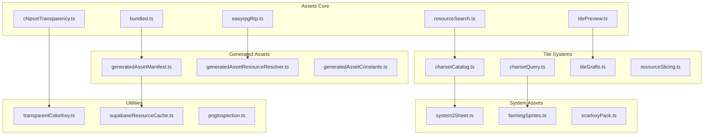
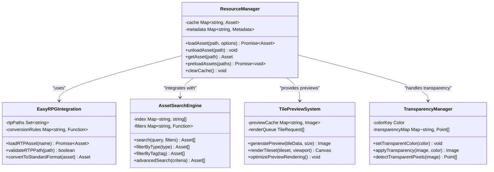
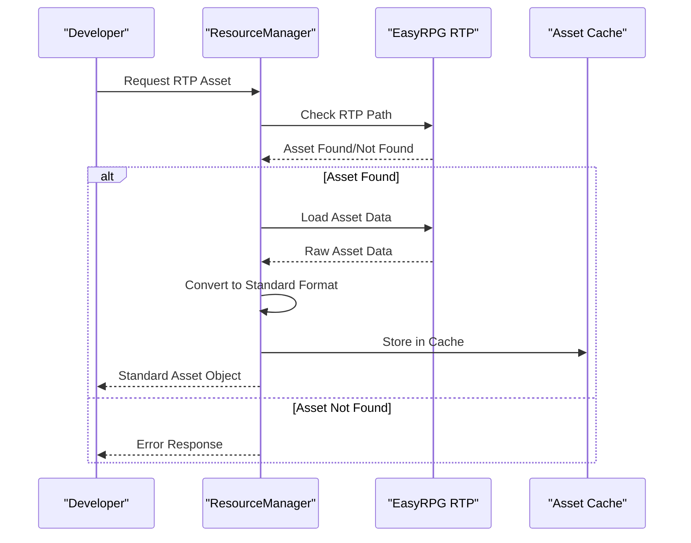
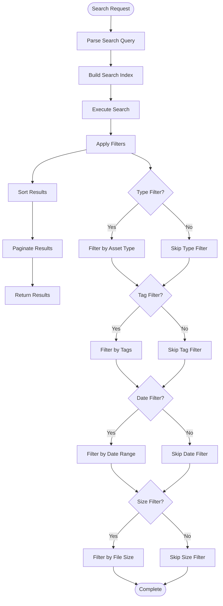

# Asset Management

<cite>
**Referenced Files in This Document**
- [easyrpgRtp.ts](file://src/assets/easyrpgRtp.ts)
- [resourceSearch.ts](file://src/assets/resourceSearch.ts)
- [tilePreview.ts](file://src/assets/tilePreview.ts)
- [chipsetTransparency.ts](file://src/assets/chipsetTransparency.ts)
- [bundled.ts](file://src/assets/bundled.ts)
- [charsetCatalog.ts](file://src/assets/charsetCatalog.ts)
- [charsetQuery.ts](file://src/assets/charsetQuery.ts)
- [farmingSprites.ts](file://src/assets/farmingSprites.ts)
- [generatedAssetManifest.ts](file://src/assets/generatedAssetManifest.ts)
- [generatedAssetResourceResolver.ts](file://src/assets/generatedAssetResourceResolver.ts)
- [resourceSlicing.ts](file://src/assets/resourceSlicing.ts)
- [system2Sheet.ts](file://src/assets/system2Sheet.ts)
- [tileGrafts.ts](file://src/assets/tileGrafts.ts)
- [transparentColorKey.ts](file://src/assets/transparentColorKey.ts)
- [supabaseResourceCache.ts](file://src/assets/supabaseResourceCache.ts)
</cite>

## Table of Contents
1. [Introduction](#introduction)
2. [Project Structure](#project-structure)
3. [Core Components](#core-components)
4. [Architecture Overview](#architecture-overview)
5. [Detailed Component Analysis](#detailed-component-analysis)
6. [EasyRPG RTP Integration](#easyrpg-rtp-integration)
7. [Asset Search and Filtering](#asset-search-and-filtering)
8. [Tileset Configuration Tools](#tileset-configuration-tools)
9. [Chipset Preview System](#chipset-preview-system)
10. [Transparency Settings](#transparency-settings)
11. [Asset Optimization Features](#asset-optimization-features)
12. [Practical Examples](#practical-examples)
13. [Performance Considerations](#performance-considerations)
14. [Best Practices](#best-practices)
15. [Troubleshooting Guide](#troubleshooting-guide)
16. [Conclusion](#conclusion)

## Introduction

The RPG-ZZU asset management system provides a comprehensive framework for organizing, managing, and optimizing game assets including tiles, sprites, audio files, and other game resources. The system integrates with EasyRPG RTP (Runtime Package) for compatibility while offering advanced features for asset search, filtering, preview, and optimization.

This documentation covers the complete asset management architecture, from low-level resource loading to high-level editor interfaces, explaining how developers can effectively organize their projects and leverage the system's capabilities for optimal performance and workflow efficiency.

## Project Structure

The asset management system is organized into several key directories and modules:



**Diagram sources**
- [bundled.ts](file://src/assets/bundled.ts)
- [easyrpgRtp.ts](file://src/assets/easyrpgRtp.ts)
- [resourceSearch.ts](file://src/assets/resourceSearch.ts)
- [generatedAssetManifest.ts](file://src/assets/generatedAssetManifest.ts)

**Section sources**
- [bundled.ts](file://src/assets/bundled.ts)
- [easyrpgRtp.ts](file://src/assets/easyrpgRtp.ts)
- [resourceSearch.ts](file://src/assets/resourceSearch.ts)

## Core Components

The asset management system consists of several core components that work together to provide a unified interface for resource management:

### Resource Manager Interface

The primary interface for organizing and accessing game assets through a consistent API. This interface handles:

- **Asset Loading**: Dynamic loading of tiles, sprites, audio files, and other resources
- **Caching**: Efficient caching mechanisms for frequently accessed assets
- **Dependency Resolution**: Automatic resolution of asset dependencies
- **Format Support**: Support for multiple asset formats (PNG, WAV, OGG, etc.)

### Asset Catalog System

A comprehensive catalog system that maintains metadata about all available assets:

- **Metadata Storage**: Stores descriptive information about each asset
- **Tagging System**: Allows categorization and organization through tags
- **Search Indexing**: Enables fast searching and filtering operations
- **Version Control**: Tracks asset versions and updates

### Resource Slicing Engine

Advanced slicing capabilities for sprite sheets and tilesets:

- **Automatic Detection**: Automatically detects tile boundaries and grid layouts
- **Manual Editing**: Provides tools for manual slice definition
- **Batch Processing**: Supports processing multiple assets simultaneously
- **Quality Assurance**: Validates sliced assets for consistency

**Section sources**
- [resourceSlicing.ts](file://src/assets/resourceSlicing.ts)
- [charsetCatalog.ts](file://src/assets/charsetCatalog.ts)
- [generatedAssetManifest.ts](file://src/assets/generatedAssetManifest.ts)

## Architecture Overview

The asset management system follows a layered architecture pattern that separates concerns and promotes modularity:



**Diagram sources**
- [easyrpgRtp.ts](file://src/assets/easyrpgRtp.ts)
- [resourceSearch.ts](file://src/assets/resourceSearch.ts)
- [tilePreview.ts](file://src/assets/tilePreview.ts)
- [chipsetTransparency.ts](file://src/assets/chipsetTransparency.ts)

## Detailed Component Analysis

### Resource Loader and Cache Manager

The resource loader handles the fundamental operations of loading, caching, and managing asset lifecycles:

#### Key Responsibilities:
- **Asynchronous Loading**: Non-blocking asset loading with progress tracking
- **Memory Management**: Efficient memory usage with automatic cleanup
- **Error Handling**: Robust error handling and recovery mechanisms
- **Format Detection**: Automatic detection of asset formats and appropriate loaders

#### Performance Optimizations:
- **Lazy Loading**: Assets are loaded on-demand rather than upfront
- **Reference Counting**: Prevents premature disposal of shared assets
- **Compression**: Supports compressed asset formats for reduced memory footprint
- **Texture Atlasing**: Combines small textures into larger atlases for better GPU performance

**Section sources**
- [bundled.ts](file://src/assets/bundled.ts)
- [generatedAssetResourceResolver.ts](file://src/assets/generatedAssetResourceResolver.ts)

### Asset Metadata and Catalog System

The metadata system provides rich information about assets beyond their raw data:

#### Metadata Structure:
- **Basic Information**: Name, description, author, version
- **Technical Properties**: Dimensions, format, compression settings
- **Usage Context**: Where and how the asset is used in the game
- **Relationships**: Dependencies and connections to other assets

#### Search and Discovery:
- **Full-text Search**: Searches across all metadata fields
- **Faceted Filtering**: Filter by type, category, tags, and custom properties
- **Similarity Matching**: Find visually or functionally similar assets
- **Import History**: Track asset import and modification history

**Section sources**
- [charsetCatalog.ts](file://src/assets/charsetCatalog.ts)
- [charsetQuery.ts](file://src/assets/charsetQuery.ts)
- [generatedAssetManifest.ts](file://src/assets/generatedAssetManifest.ts)

## EasyRPG RTP Integration

The EasyRPG RTP integration provides seamless compatibility with the EasyRPG runtime package, allowing developers to use existing EasyRPG assets while maintaining full functionality within the RPG-ZZU ecosystem.

### RTP Asset Discovery

The system automatically discovers and catalogs EasyRPG RTP assets:



**Diagram sources**
- [easyrpgRtp.ts](file://src/assets/easyrpgRtp.ts)

### Format Conversion Pipeline

The conversion pipeline ensures RTP assets work seamlessly within RPG-ZZU:

1. **Path Resolution**: Maps RTP paths to internal asset locations
2. **Format Validation**: Ensures assets meet RPG-ZZU requirements
3. **Metadata Extraction**: Extracts useful information from RTP metadata
4. **Optimization**: Applies RPG-ZZU-specific optimizations
5. **Caching**: Stores converted assets for future use

### Compatibility Layer

The compatibility layer handles differences between RTP and RPG-ZZU asset formats:

- **Sprite Sheet Mapping**: Converts RTP sprite sheet layouts to RPG-ZZU format
- **Animation Frame Handling**: Preserves animation timing and sequence data
- **Audio Format Conversion**: Handles different audio codec requirements
- **Tileset Layout Translation**: Maintains tile positioning and grouping

**Section sources**
- [easyrpgRtp.ts](file://src/assets/easyrpgRtp.ts)

## Asset Search and Filtering

The asset search and filtering system provides powerful tools for finding and organizing assets within large libraries.

### Search Query Language

The system supports a flexible query language for complex searches:

#### Basic Operations:
- **Text Search**: Full-text search across asset names and descriptions
- **Type Filtering**: Filter by asset type (tiles, sprites, audio, etc.)
- **Tag-based Search**: Search using predefined or custom tags
- **Date Range Filtering**: Find assets created or modified within specific timeframes

#### Advanced Queries:
- **Boolean Logic**: Combine multiple conditions with AND/OR operators
- **Regular Expressions**: Use regex patterns for complex text matching
- **Spatial Queries**: Find assets based on dimensions or aspect ratios
- **Content Analysis**: Search based on visual or audio characteristics

### Filtering Capabilities

Multiple filtering strategies ensure efficient asset discovery:



**Diagram sources**
- [resourceSearch.ts](file://src/assets/resourceSearch.ts)

### Performance Optimizations

The search system is optimized for large asset libraries:

- **Indexed Searching**: Pre-built indexes enable fast query execution
- **Incremental Updates**: Indexes update incrementally as assets change
- **Caching**: Frequently used queries are cached for rapid response
- **Parallel Processing**: Multiple search operations run concurrently
- **Result Streaming**: Large result sets are streamed to prevent memory issues

**Section sources**
- [resourceSearch.ts](file://src/assets/resourceSearch.ts)

## Tileset Configuration Tools

The tileset configuration system provides comprehensive tools for creating, editing, and managing tilesets within the RPG-ZZU environment.

### Tileset Editor Interface

The tileset editor offers both simple and advanced editing capabilities:

#### Basic Editing:
- **Visual Grid Editor**: WYSIWYG interface for tile placement
- **Brush Tools**: Various brushes for efficient tile painting
- **Selection Tools**: Rectangle, lasso, and magic wand selection
- **Copy/Paste Operations**: Move and duplicate tile regions

#### Advanced Features:
- **Layer Management**: Support for multiple tile layers
- **Autotile Configuration**: Define autotile rules and behaviors
- **Collision Mapping**: Configure collision areas for gameplay
- **Animation Setup**: Define tile animations and transitions

### Tile Classification System

Automated classification helps organize and understand tilesets:

#### Semantic Classification:
- **Terrain Recognition**: Automatically identifies terrain types (grass, water, walls)
- **Object Detection**: Recognizes props, decorations, and interactive elements
- **Structural Analysis**: Identifies architectural patterns and building components
- **Contextual Understanding**: Analyzes tile relationships and dependencies

#### Manual Override:
- **Classification Review**: Review and correct automated classifications
- **Custom Categories**: Create custom categories for specialized needs
- **Bulk Operations**: Apply classifications to multiple tiles at once
- **Validation Rules**: Ensure classification consistency across tilesets

**Section sources**
- [charsetCatalog.ts](file://src/assets/charsetCatalog.ts)
- [charsetQuery.ts](file://src/assets/charsetQuery.ts)

## Chipset Preview System

The chipset preview system provides real-time visualization of tilesets and chipsets during development and editing.

### Real-time Rendering

The preview system renders tilesets with high performance:

#### Rendering Pipeline:
1. **Tile Parsing**: Parse tileset data and extract individual tiles
2. **Texture Generation**: Create optimized textures from tile data
3. **Viewport Management**: Render only visible portions of large tilesets
4. **Caching Strategy**: Cache rendered tiles for faster subsequent displays
5. **Update Optimization**: Minimize re-rendering when only small changes occur

#### Performance Features:
- **GPU Acceleration**: Leverage WebGL for hardware-accelerated rendering
- **Level of Detail**: Reduce quality for distant or small previews
- **Progressive Loading**: Show low-resolution previews while loading details
- **Background Processing**: Perform heavy computations asynchronously

### Interactive Preview Controls

Users can interact with previews through various controls:

#### Navigation:
- **Zoom Controls**: Zoom in/out for detailed inspection
- **Pan Operations**: Navigate around large tilesets
- **Grid Overlay**: Toggle grid lines for precise alignment
- **Measurement Tools**: Measure distances and dimensions

#### Inspection Tools:
- **Pixel Peeping**: Examine individual pixels for transparency issues
- **Color Picker**: Sample colors from tiles
- **Metadata Display**: View tile properties and relationships
- **Animation Preview**: Watch animated tiles in motion

**Section sources**
- [tilePreview.ts](file://src/assets/tilePreview.ts)

## Transparency Settings

The transparency system handles transparent and semi-transparent pixels in game assets, crucial for proper visual composition.

### Transparency Detection

Automatic detection of transparent pixels ensures accurate asset processing:

#### Detection Methods:
- **Alpha Channel Analysis**: Detect alpha values in RGBA images
- **Color Key Detection**: Identify specific colors designated as transparent
- **Edge Detection**: Find transparent borders around opaque content
- **Pattern Recognition**: Recognize common transparency patterns

#### Quality Assurance:
- **Anti-aliasing Preservation**: Maintain smooth edges when detecting transparency
- **Noise Reduction**: Filter out accidental transparent pixels
- **Border Smoothing**: Ensure clean edges between transparent and opaque areas
- **Consistency Checking**: Verify transparency across related assets

### Transparency Application

Once detected, transparency is applied consistently across the asset pipeline:

#### Processing Pipeline:
1. **Source Analysis**: Analyze original asset for transparency information
2. **Format Conversion**: Preserve transparency during format conversions
3. **Optimization**: Optimize transparent areas for better performance
4. **Validation**: Verify transparency integrity after processing
5. **Export**: Generate final assets with correct transparency handling

#### Runtime Integration:
- **Shader Support**: Proper blending modes for transparent rendering
- **Depth Sorting**: Correct z-ordering for overlapping transparent objects
- **Performance Optimization**: Batch transparent and opaque rendering separately
- **Fallback Handling**: Graceful degradation when transparency isn't supported

**Section sources**
- [chipsetTransparency.ts](file://src/assets/chipsetTransparency.ts)
- [transparentColorKey.ts](file://src/assets/transparentColorKey.ts)

## Asset Optimization Features

The asset optimization system provides multiple strategies for reducing file sizes and improving runtime performance.

### Compression Strategies

Multiple compression algorithms are available depending on asset type:

#### Image Compression:
- **Lossless Compression**: PNG optimization without quality loss
- **Lossy Compression**: JPEG/WebP for photographic content
- **Palette Optimization**: Reduce color palettes for pixel art
- **Texture Atlasing**: Combine multiple textures into single atlases

#### Audio Compression:
- **Format Selection**: Choose optimal format for each audio clip
- **Bitrate Optimization**: Balance quality and file size
- **Streaming Support**: Enable streaming for large audio files
- **Deduplication**: Remove duplicate audio files across the project

### Memory Optimization

Runtime memory usage is minimized through various techniques:

#### Asset Pooling:
- **Object Reuse**: Reuse asset instances instead of creating new ones
- **Reference Counting**: Track asset usage to determine disposal timing
- **Lazy Loading**: Load assets only when needed
- **Background Unloading**: Unload unused assets during idle periods

#### Texture Management:
- **Mipmap Generation**: Create mipmaps for better texture filtering
- **Texture Compression**: Use GPU-native texture formats
- **Atlas Management**: Dynamically manage texture atlas allocation
- **Garbage Collection**: Efficient cleanup of unused textures

**Section sources**
- [supabaseResourceCache.ts](file://src/assets/supabaseResourceCache.ts)
- [system2Sheet.ts](file://src/assets/system2Sheet.ts)

## Practical Examples

### Importing Custom Assets

Step-by-step process for importing custom assets into the RPG-ZZU project:

#### Image Assets:
1. **Prepare Source Files**: Ensure images meet RPG-ZZU specifications
2. **Use Import Wizard**: Launch the asset import dialog
3. **Configure Options**: Set compression, sizing, and metadata options
4. **Review and Confirm**: Preview imported assets before finalizing
5. **Organize in Project**: Place assets in appropriate project folders

#### Audio Assets:
1. **Format Conversion**: Convert audio to supported formats (OGG, WAV)
2. **Quality Settings**: Choose appropriate bitrate and quality levels
3. **Metadata Addition**: Add descriptive information and tags
4. **Testing**: Verify audio plays correctly in-game
5. **Integration**: Link audio to appropriate game events and scenes

#### Tileset Creation:
1. **Design Tiles**: Create individual tiles following RPG Maker conventions
2. **Arrange Sprite Sheet**: Organize tiles into proper sprite sheet layout
3. **Define Autotiles**: Set up autotile rules for seamless tiling
4. **Test Integration**: Verify tiles work correctly in the editor
5. **Publish**: Make tileset available to other team members

### Organizing Project Resources

Best practices for structuring project assets:

#### Directory Structure:
```
assets/
├── tiles/
│   ├── terrain/
│   ├── buildings/
│   └── props/
├── characters/
│   ├── heroes/
│   ├── enemies/
│   └── npcs/
├── audio/
│   ├── music/
│   ├── sfx/
│   └── voice/
├── ui/
│   ├── icons/
│   ├── backgrounds/
│   └── fonts/
└── generated/
    ├── atlases/
    └── optimized/
```

#### Naming Conventions:
- **Descriptive Names**: Use clear, descriptive filenames
- **Consistent Formatting**: Follow established naming patterns
- **Version Control**: Include version numbers for major revisions
- **Localization**: Support multiple languages in asset names

### Managing Asset Dependencies

Handling complex dependency relationships between assets:

#### Dependency Tracking:
- **Automatic Detection**: System automatically detects asset dependencies
- **Visual Dependency Graph**: Display relationships between assets
- **Impact Analysis**: Determine which assets are affected by changes
- **Circular Dependency Detection**: Identify and resolve circular references

#### Update Propagation:
- **Cascade Updates**: Automatically update dependent assets when originals change
- **Selective Updating**: Choose which dependencies to update
- **Conflict Resolution**: Handle conflicts when multiple assets depend on the same source
- **Rollback Support**: Revert changes if updates cause problems

**Section sources**
- [generatedAssetManifest.ts](file://src/assets/generatedAssetManifest.ts)
- [generatedAssetResourceResolver.ts](file://src/assets/generatedAssetResourceResolver.ts)

## Performance Considerations

### Large Asset Libraries

Strategies for managing projects with extensive asset collections:

#### Indexing and Caching:
- **Incremental Indexing**: Update indexes as assets are added or modified
- **Distributed Caching**: Share cache across team members and build processes
- **Intelligent Prefetching**: Predict and preload likely-to-be-used assets
- **Cache Invalidation**: Efficiently invalidate stale cache entries

#### Memory Management:
- **Virtual Memory**: Stream assets from disk instead of loading entirely into RAM
- **Memory Pools**: Pre-allocate memory pools for frequently used asset types
- **Garbage Collection Tuning**: Optimize GC behavior for asset-heavy applications
- **Memory Profiling**: Monitor memory usage patterns and identify leaks

### Build and Deployment Optimization

Optimizing asset processing during development and deployment:

#### Build Pipeline:
- **Parallel Processing**: Process multiple assets simultaneously
- **Incremental Builds**: Only rebuild changed assets
- **Asset Deduplication**: Remove duplicate assets across the project
- **Bundle Optimization**: Create optimal asset bundles for different platforms

#### Runtime Performance:
- **Loading Screens**: Implement progressive loading with meaningful feedback
- **Background Processing**: Offload heavy computations to background threads
- **Adaptive Quality**: Adjust asset quality based on device capabilities
- **Network Optimization**: Compress and stream assets over network connections

## Best Practices

### Asset Organization Guidelines

Establishing consistent organizational patterns:

#### Folder Structure:
- **Logical Grouping**: Group related assets by function or theme
- **Scalable Hierarchy**: Design folder hierarchy that scales with project growth
- **Clear Naming**: Use intuitive, searchable folder names
- **Documentation**: Maintain README files explaining folder purposes

#### Version Control:
- **Binary Asset Handling**: Use appropriate VCS strategies for binary files
- **Change Tracking**: Monitor asset modifications and their impact
- **Branching Strategy**: Plan asset workflows for feature branches
- **Merge Conflict Resolution**: Establish procedures for resolving asset conflicts

### Development Workflow

Streamlining the asset creation and integration process:

#### Creation Standards:
- **Resolution Guidelines**: Define standard resolutions for different asset types
- **File Format Policies**: Establish preferred formats for each asset category
- **Naming Conventions**: Enforce consistent naming across the team
- **Quality Gates**: Implement automated checks for asset quality

#### Testing and Validation:
- **Automated Testing**: Run asset validation as part of CI/CD pipeline
- **Performance Testing**: Measure asset loading times and memory usage
- **Cross-platform Verification**: Test assets on target platforms early
- **User Acceptance**: Involve artists and designers in asset approval processes

## Troubleshooting Guide

### Common Issues and Solutions

#### Asset Loading Failures:
- **Check File Paths**: Verify asset paths are correct and accessible
- **Validate Formats**: Ensure assets use supported file formats
- **Inspect Permissions**: Confirm read permissions for asset directories
- **Review Dependencies**: Check for missing or corrupted dependencies

#### Performance Problems:
- **Monitor Memory Usage**: Use profiling tools to identify memory bottlenecks
- **Analyze Loading Times**: Profile asset loading to find slow operations
- **Check Cache Efficiency**: Monitor cache hit rates and invalidation patterns
- **Review Bundle Sizes**: Analyze bundle composition for oversized assets

#### Visual Artifacts:
- **Verify Transparency**: Check transparency settings for proper blending
- **Inspect Texture Atlases**: Ensure atlases don't contain conflicting assets
- **Validate Tile Alignment**: Confirm tiles align properly in sprite sheets
- **Check Color Spaces**: Verify consistent color space usage across assets

### Debugging Tools

Built-in debugging utilities for asset-related issues:

#### Asset Inspector:
- **Property Viewer**: Examine all properties of loaded assets
- **Dependency Tree**: Visualize asset dependency relationships
- **Performance Metrics**: Monitor loading times and memory usage
- **Error Logging**: Detailed error messages with actionable suggestions

#### Diagnostic Reports:
- **Asset Health Report**: Comprehensive analysis of asset library health
- **Performance Benchmark**: Automated performance testing suite
- **Compatibility Check**: Verify assets work across target platforms
- **Optimization Suggestions**: AI-powered recommendations for improvement

**Section sources**
- [pngInspection.ts](file://src/assets/pngInspection.ts)
- [supabaseResourceCache.ts](file://src/assets/supabaseResourceCache.ts)

## Conclusion

The RPG-ZZU asset management system provides a comprehensive, scalable solution for managing game assets throughout the development lifecycle. From basic asset loading and caching to advanced features like EasyRPG RTP integration, intelligent search and filtering, and sophisticated optimization techniques, the system addresses the complex needs of modern game development.

Key strengths of the system include its modular architecture, which allows for easy extension and customization; its focus on performance, ensuring smooth operation even with large asset libraries; and its developer-friendly interfaces that make asset management intuitive and efficient.

For teams working on RPG-style games, the system's EasyRPG compatibility provides immediate value by leveraging existing asset ecosystems while offering modern development workflows and performance optimizations. The comprehensive tooling for tileset management, transparency handling, and asset organization ensures that developers can maintain high-quality visuals while keeping performance optimal.

As projects grow in complexity and scale, the asset management system's design principles of modularity, performance, and usability continue to serve as a solid foundation for effective game development workflows.