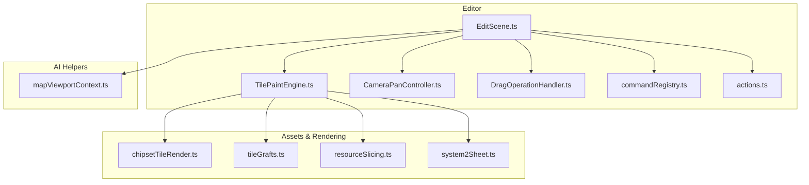
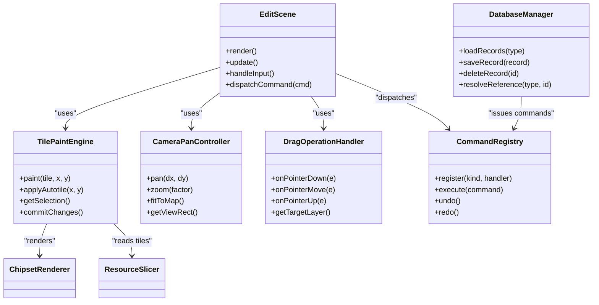
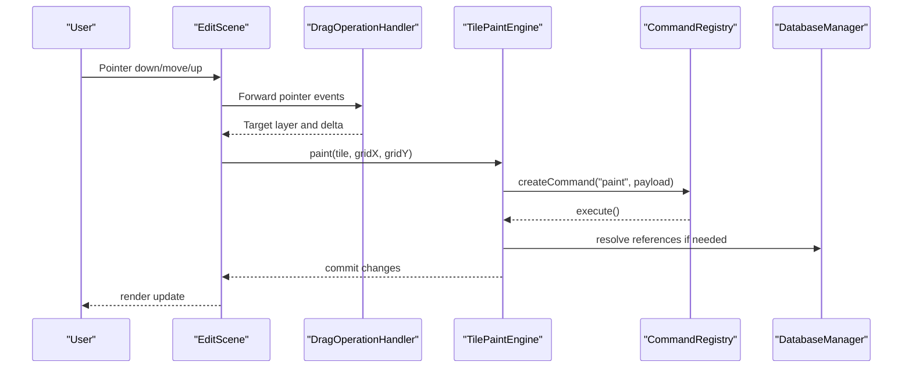
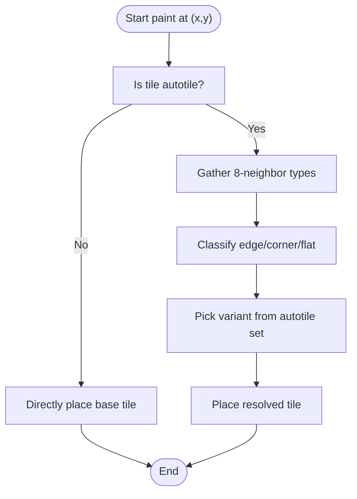
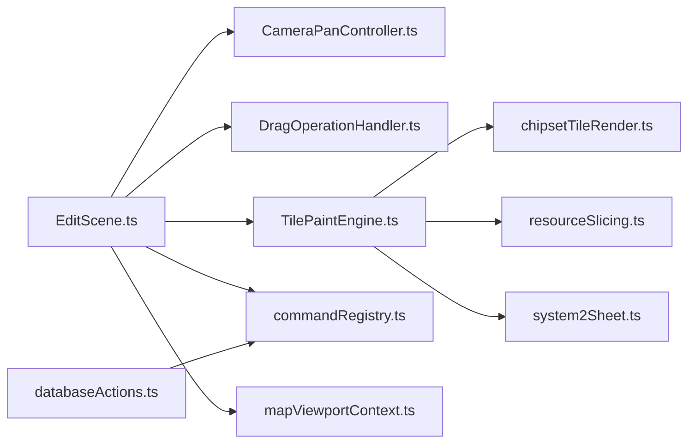

# Core Editor Features

<cite>
**Referenced Files in This Document**
- [EditScene.ts](file://src/editor/EditScene.ts)
- [TilePaintEngine.ts](file://src/editor/TilePaintEngine.ts)
- [CameraPanController.ts](file://src/editor/CameraPanController.ts)
- [DragOperationHandler.ts](file://src/editor/DragOperationHandler.ts)
- [databaseActions.ts](file://src/editor/databaseActions.ts)
- [databaseCopy.ts](file://src/editor/databaseCopy.ts)
- [databaseElementList.ts](file://src/editor/databaseElementList.ts)
- [databaseRecordMutators.ts](file://src/editor/databaseRecordMutators.ts)
- [mapViewportContext.ts](file://src/ai/mapViewportContext.ts)
- [commandRegistry.ts](file://src/editor/commandRegistry.ts)
- [actions.ts](file://src/editor/actions.ts)
- [agentFocus.ts](file://src/editor/agentFocus.ts)
- [chipsetTileRender.ts](file://src/editor/chipsetTileRender.ts)
- [tileGrafts.ts](file://src/assets/tileGrafts.ts)
- [resourceSlicing.ts](file://src/assets/resourceSlicing.ts)
- [system2Sheet.ts](file://src/assets/system2Sheet.ts)
</cite>

## Table of Contents
1. [Introduction](#introduction)
2. [Project Structure](#project-structure)
3. [Core Components](#core-components)
4. [Architecture Overview](#architecture-overview)
5. [Detailed Component Analysis](#detailed-component-analysis)
6. [Dependency Analysis](#dependency-analysis)
7. [Performance Considerations](#performance-considerations)
8. [Troubleshooting Guide](#troubleshooting-guide)
9. [Conclusion](#conclusion)
10. [Appendices](#appendices)

## Introduction
This document explains the core editor features of RPG Maker Zzu with a focus on:
- Main editing scene architecture and control flow
- Tile painting engine including autotile support
- Camera and viewport controls
- Drag operation handling for efficient map authoring
- Database management system for characters, items, skills, and battle configurations
- Map list and project organization features
- Layer management and event placement systems
- Resource management interfaces
- Practical workflows, keyboard shortcuts, and productivity tips
- Performance considerations for large projects and optimization techniques

The goal is to provide both high-level understanding and code-level traceability for contributors and advanced users.

## Project Structure
RPG Maker Zzu organizes editor functionality under src/editor, with supporting asset and rendering utilities under src/assets and AI integration helpers under src/ai. The main editing surface is implemented as a scene that composes tile rendering, camera control, drag operations, and command dispatch.

**Diagram sources**
- [EditScene.ts](file://src/editor/EditScene.ts)
- [TilePaintEngine.ts](file://src/editor/TilePaintEngine.ts)
- [CameraPanController.ts](file://src/editor/CameraPanController.ts)
- [DragOperationHandler.ts](file://src/editor/DragOperationHandler.ts)
- [commandRegistry.ts](file://src/editor/commandRegistry.ts)
- [actions.ts](file://src/editor/actions.ts)
- [chipsetTileRender.ts](file://src/editor/chipsetTileRender.ts)
- [tileGrafts.ts](file://src/assets/tileGrafts.ts)
- [resourceSlicing.ts](file://src/assets/resourceSlicing.ts)
- [system2Sheet.ts](file://src/assets/system2Sheet.ts)
- [mapViewportContext.ts](file://src/ai/mapViewportContext.ts)

**Section sources**
- [EditScene.ts](file://src/editor/EditScene.ts)
- [TilePaintEngine.ts](file://src/editor/TilePaintEngine.ts)
- [CameraPanController.ts](file://src/editor/CameraPanController.ts)
- [DragOperationHandler.ts](file://src/editor/DragOperationHandler.ts)
- [commandRegistry.ts](file://src/editor/commandRegistry.ts)
- [actions.ts](file://src/editor/actions.ts)
- [chipsetTileRender.ts](file://src/editor/chipsetTileRender.ts)
- [tileGrafts.ts](file://src/assets/tileGrafts.ts)
- [resourceSlicing.ts](file://src/assets/resourceSlicing.ts)
- [system2Sheet.ts](file://src/assets/system2Sheet.ts)
- [mapViewportContext.ts](file://src/ai/mapViewportContext.ts)

## Core Components
- EditScene: Orchestrates the editor loop, integrates tile painting, camera, drag operations, and command execution. It coordinates UI panels and state transitions.
- TilePaintEngine: Implements tile drawing, selection, stamping, and autotile resolution. It interacts with chipset rendering and resource slicing.
- CameraPanController: Manages viewport panning, zooming, and snapping behaviors.
- DragOperationHandler: Handles pointer interactions for dragging tiles, events, and regions across layers.
- Command Registry and Actions: Centralized command dispatch and action history for undo/redo and consistent behavior.
- Database Management: Provides CRUD and cross-references for characters, items, skills, and battle configurations.
- Viewport Context (AI): Supplies current viewport state to AI tools for context-aware assistance.

Key responsibilities and relationships are visualized below.

**Diagram sources**
- [EditScene.ts](file://src/editor/EditScene.ts)
- [TilePaintEngine.ts](file://src/editor/TilePaintEngine.ts)
- [CameraPanController.ts](file://src/editor/CameraPanController.ts)
- [DragOperationHandler.ts](file://src/editor/DragOperationHandler.ts)
- [commandRegistry.ts](file://src/editor/commandRegistry.ts)
- [databaseActions.ts](file://src/editor/databaseActions.ts)
- [chipsetTileRender.ts](file://src/editor/chipsetTileRender.ts)
- [resourceSlicing.ts](file://src/assets/resourceSlicing.ts)

**Section sources**
- [EditScene.ts](file://src/editor/EditScene.ts)
- [TilePaintEngine.ts](file://src/editor/TilePaintEngine.ts)
- [CameraPanController.ts](file://src/editor/CameraPanController.ts)
- [DragOperationHandler.ts](file://src/editor/DragOperationHandler.ts)
- [commandRegistry.ts](file://src/editor/commandRegistry.ts)
- [databaseActions.ts](file://src/editor/databaseActions.ts)

## Architecture Overview
The editor follows a scene-driven architecture where EditScene composes subsystems for input, rendering, and persistence. Commands encapsulate user actions and integrate with an undo/redo stack. Tile painting leverages chipset-based rendering and resource slicing for performance. Autotile logic resolves neighbor patterns to select appropriate tile variants.

**Diagram sources**
- [EditScene.ts](file://src/editor/EditScene.ts)
- [DragOperationHandler.ts](file://src/editor/DragOperationHandler.ts)
- [TilePaintEngine.ts](file://src/editor/TilePaintEngine.ts)
- [commandRegistry.ts](file://src/editor/commandRegistry.ts)
- [databaseActions.ts](file://src/editor/databaseActions.ts)

## Detailed Component Analysis

### EditScene: Main Editing Loop and Composition
- Responsibilities:
  - Initialize and manage subsystems (camera, drag, paint).
  - Route input events to appropriate handlers.
  - Dispatch commands via the registry and handle undo/redo.
  - Integrate viewport context for AI assistance.
- Integration points:
  - Uses CameraPanController for navigation.
  - Delegates pointer interactions to DragOperationHandler.
  - Calls TilePaintEngine for tile operations.
  - Invokes database actions when editing records or resolving references.

Practical workflow example:
- Select a tile from the palette, click-drag on the map to paint, then press Undo to revert.

Keyboard shortcuts (typical):
- Pan: WASD or arrow keys
- Zoom: +/- or scroll wheel
- Undo/Redo: Ctrl+Z / Ctrl+Shift+Z
- Toggle grid overlay: G
- Fit to map: F

**Section sources**
- [EditScene.ts](file://src/editor/EditScene.ts)
- [mapViewportContext.ts](file://src/ai/mapViewportContext.ts)
- [commandRegistry.ts](file://src/editor/commandRegistry.ts)
- [actions.ts](file://src/editor/actions.ts)

### TilePaintEngine: Painting, Selection, and Autotiles
- Responsibilities:
  - Apply tile paints at grid positions.
  - Manage selection rectangles and stamps.
  - Resolve autotile patterns based on neighbors.
  - Commit changes through the command system.
- Rendering dependencies:
  - Uses chipset rendering for efficient tile blitting.
  - Reads sliced resources from atlases.
  - Applies system2 sheet elements for overlays.

Autotile resolution flow:

Productivity tips:
- Use region brushes for large areas.
- Enable autotile preview to validate edges before committing.
- Batch paint using stamp mode for repeated patterns.

**Section sources**
- [TilePaintEngine.ts](file://src/editor/TilePaintEngine.ts)
- [chipsetTileRender.ts](file://src/editor/chipsetTileRender.ts)
- [resourceSlicing.ts](file://src/assets/resourceSlicing.ts)
- [system2Sheet.ts](file://src/assets/system2Sheet.ts)
- [tileGrafts.ts](file://src/assets/tileGrafts.ts)

### CameraPanController: Navigation and Viewport Controls
- Responsibilities:
  - Handle panning and zooming.
  - Provide view rectangle calculations for culling and rendering.
  - Support snapping to grid and fitting to map bounds.
- Interaction model:
  - Keyboard pan with WASD/arrows.
  - Mouse drag to pan when configured.
  - Scroll wheel to zoom with center-of-screen pivot.

Common use cases:
- Quick navigation with hotkeys during long sessions.
- Fit-to-map to orient after placing many objects.

**Section sources**
- [CameraPanController.ts](file://src/editor/CameraPanController.ts)

### DragOperationHandler: Pointer Interactions and Layer Targeting
- Responsibilities:
  - Translate pointer events into grid-space deltas.
  - Determine target layer and object type (tiles, events, regions).
  - Emit drag start/move/end events for higher-level handlers.
- Behavior highlights:
  - Supports multi-layer awareness to avoid accidental edits.
  - Integrates with selection modes and tool context.

Workflow example:
- Right-click drag to pan vs left-click drag to paint depends on active tool and modifier keys.

**Section sources**
- [DragOperationHandler.ts](file://src/editor/DragOperationHandler.ts)

### Command Registry and Actions: Undo/Redo and Consistency
- Responsibilities:
  - Register command kinds and handlers.
  - Execute commands and maintain history.
  - Provide undo/redo operations for all editor actions.
- Integration:
  - Tile painting, database edits, and UI toggles issue commands.
  - Ensures atomic updates and consistent state transitions.

Best practices:
- Always wrap side effects in commands.
- Keep command payloads small and serializable.

**Section sources**
- [commandRegistry.ts](file://src/editor/commandRegistry.ts)
- [actions.ts](file://src/editor/actions.ts)

### Database Management System: Characters, Items, Skills, Battles
- Capabilities:
  - Load, save, delete, and duplicate records.
  - Cross-reference validation and resolution.
  - Bulk copy/paste and template application.
- Key modules:
  - Element lists for tabular browsing and search.
  - Record mutators for safe updates.
  - Copy utilities for duplication workflows.

Typical workflows:
- Create a new character, assign skills, and link to equipment.
- Duplicate an item record and adjust stats quickly.
- Validate troop compositions against element references.

**Section sources**
- [databaseActions.ts](file://src/editor/databaseActions.ts)
- [databaseCopy.ts](file://src/editor/databaseCopy.ts)
- [databaseElementList.ts](file://src/editor/databaseElementList.ts)
- [databaseRecordMutators.ts](file://src/editor/databaseRecordMutators.ts)

### Layer Management and Event Placement
- Layer concepts:
  - Multiple logical layers (terrain, props, events, regions).
  - Visibility toggles and z-ordering.
- Event placement:
  - Drag-and-drop events onto maps.
  - Page-based scripting with conditions and triggers.
  - Reference guards ensure valid links to database entries.

Tips:
- Use region layers to mark gameplay zones.
- Group related events and name them descriptively.

**Section sources**
- [EditScene.ts](file://src/editor/EditScene.ts)
- [DragOperationHandler.ts](file://src/editor/DragOperationHandler.ts)
- [TilePaintEngine.ts](file://src/editor/TilePaintEngine.ts)

### Resource Management Interfaces
- Asset loading and caching:
  - Chipset rendering for efficient tile blitting.
  - Resource slicing to extract tiles from atlases.
  - System2 sheet access for UI overlays and indicators.
- Tile grafts:
  - Precomputed tile combinations for complex visuals.

Optimization:
- Prefer atlas-based assets and reuse slices.
- Avoid frequent reloads by leveraging caches.

**Section sources**
- [chipsetTileRender.ts](file://src/editor/chipsetTileRender.ts)
- [resourceSlicing.ts](file://src/assets/resourceSlicing.ts)
- [system2Sheet.ts](file://src/assets/system2Sheet.ts)
- [tileGrafts.ts](file://src/assets/tileGrafts.ts)

## Dependency Analysis
High-level dependency relationships among core editor components:

**Diagram sources**
- [EditScene.ts](file://src/editor/EditScene.ts)
- [CameraPanController.ts](file://src/editor/CameraPanController.ts)
- [DragOperationHandler.ts](file://src/editor/DragOperationHandler.ts)
- [TilePaintEngine.ts](file://src/editor/TilePaintEngine.ts)
- [commandRegistry.ts](file://src/editor/commandRegistry.ts)
- [chipsetTileRender.ts](file://src/editor/chipsetTileRender.ts)
- [resourceSlicing.ts](file://src/assets/resourceSlicing.ts)
- [system2Sheet.ts](file://src/assets/system2Sheet.ts)
- [mapViewportContext.ts](file://src/ai/mapViewportContext.ts)
- [databaseActions.ts](file://src/editor/databaseActions.ts)

**Section sources**
- [EditScene.ts](file://src/editor/EditScene.ts)
- [TilePaintEngine.ts](file://src/editor/TilePaintEngine.ts)
- [CameraPanController.ts](file://src/editor/CameraPanController.ts)
- [DragOperationHandler.ts](file://src/editor/DragOperationHandler.ts)
- [commandRegistry.ts](file://src/editor/commandRegistry.ts)
- [databaseActions.ts](file://src/editor/databaseActions.ts)
- [chipsetTileRender.ts](file://src/editor/chipsetTileRender.ts)
- [resourceSlicing.ts](file://src/assets/resourceSlicing.ts)
- [system2Sheet.ts](file://src/assets/system2Sheet.ts)
- [mapViewportContext.ts](file://src/ai/mapViewportContext.ts)

## Performance Considerations
- Rendering:
  - Use chipset rendering and resource slicing to minimize draw calls.
  - Limit autotile recalculations to changed neighborhoods.
- Input and interaction:
  - Debounce heavy operations during rapid drags.
  - Use grid snapping to reduce precision overhead.
- Memory:
  - Reuse tile slices and avoid redundant allocations.
  - Clear caches when switching large tilesets.
- Large projects:
  - Split maps into smaller chunks and lazy-load offscreen areas.
  - Profile paint batches and consider tiling strategies.

[No sources needed since this section provides general guidance]

## Troubleshooting Guide
- Autotile seams appear incorrect:
  - Verify neighbor classification and ensure consistent tile semantics.
  - Check autotile sets and variant mappings.
- Paint does not apply:
  - Confirm active layer and tool mode.
  - Inspect command execution logs for failures.
- Database references broken:
  - Run reference validation and repair missing IDs.
  - Use copy utilities to rebuild templates safely.
- Camera stuck or unresponsive:
  - Reset view to fit map and rebind hotkeys if necessary.

**Section sources**
- [TilePaintEngine.ts](file://src/editor/TilePaintEngine.ts)
- [commandRegistry.ts](file://src/editor/commandRegistry.ts)
- [databaseActions.ts](file://src/editor/databaseActions.ts)
- [CameraPanController.ts](file://src/editor/CameraPanController.ts)

## Conclusion
RPG Maker Zzu’s editor combines a robust scene architecture with specialized subsystems for tile painting, camera control, drag interactions, and database management. By leveraging chipset rendering, autotile resolution, and a command-driven workflow, it supports efficient authoring even for large projects. Following the recommended workflows, keyboard shortcuts, and performance practices will help you work productively and maintainably.

[No sources needed since this section summarizes without analyzing specific files]

## Appendices

### Common Editing Workflows
- Paint terrain:
  - Select tile, enable autotile preview, drag to paint, commit via command.
- Place events:
  - Open event panel, drag event onto map, configure pages and conditions.
- Manage database:
  - Open database panel, create/duplicate records, link references, validate integrity.

### Keyboard Shortcuts (Examples)
- Pan: WASD or arrows
- Zoom: +/- or scroll
- Undo/Redo: Ctrl+Z / Ctrl+Shift+Z
- Toggle grid: G
- Fit to map: F

[No sources needed since this section provides general guidance]