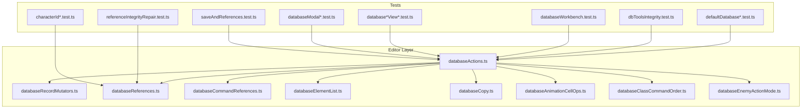
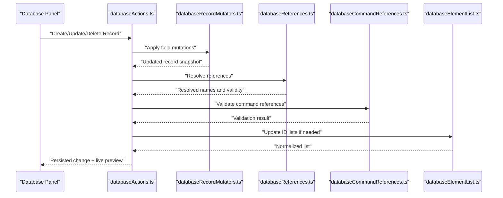
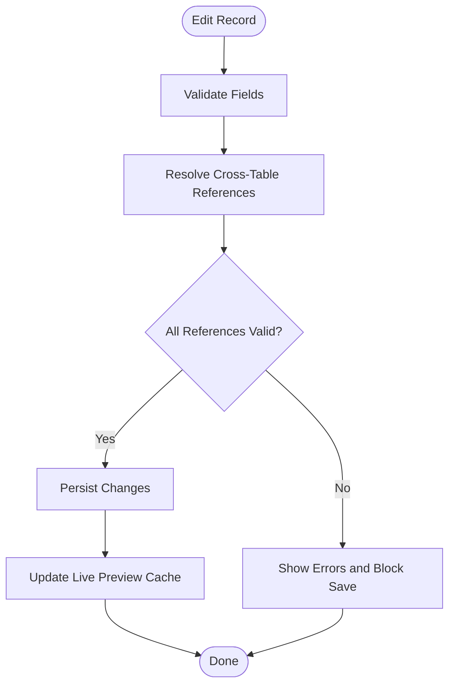
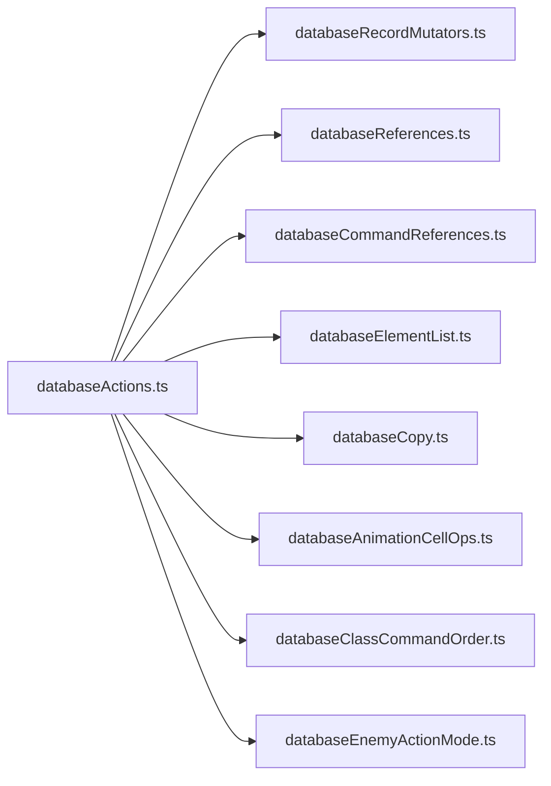

# Database Management

<cite>
**Referenced Files in This Document**
- [databaseActions.ts](file://src/editor/databaseActions.ts)
- [databaseRecordMutators.ts](file://src/editor/databaseRecordMutators.ts)
- [databaseReferences.ts](file://src/editor/databaseReferences.ts)
- [databaseCommandReferences.ts](file://src/editor/databaseCommandReferences.ts)
- [databaseElementList.ts](file://src/editor/databaseElementList.ts)
- [databaseAnimationCellOps.ts](file://src/editor/databaseAnimationCellOps.ts)
- [databaseClassCommandOrder.ts](file://src/editor/databaseClassCommandOrder.ts)
- [databaseEnemyActionMode.ts](file://src/editor/databaseEnemyActionMode.ts)
- [databaseCopy.ts](file://src/editor/databaseCopy.ts)
- [defaultDatabase.test.ts](file://test/defaultDatabase.test.ts)
- [defaultDatabaseStarterRecords.test.ts](file://test/defaultDatabaseStarterRecords.test.ts)
- [defaultItemRecordsIntegrity.test.ts](file://test/defaultItemRecordsIntegrity.test.ts)
- [dbToolsIntegrity.test.ts](file://test/dbToolsIntegrity.test.ts)
- [referenceIntegrityRepair.test.ts](file://test/referenceIntegrityRepair.test.ts)
- [databaseWorkbench.test.ts](file://test/databaseWorkbench.test.ts)
- [databaseCharacterView.test.ts](file://test/databaseCharacterView.test.ts)
- [databaseEquipmentRecordView.test.ts](file://test/databaseEquipmentRecordView.test.ts)
- [databaseMonsterSpeciesView.test.ts](file://test/databaseMonsterSpeciesView.test.ts)
- [databaseTroopBattleTestModalClose.test.ts](file://test/databaseTroopBattleTestModalClose.test.ts)
- [databaseTroopRecordViewNameSync.test.ts](file://test/databaseTroopRecordViewNameSync.test.ts)
- [databaseUtilityViews.test.ts](file://test/databaseUtilityViews.test.ts)
- [databaseSystemView.test.ts](file://test/databaseSystemView.test.ts)
- [databaseCrossTabNav.test.ts](file://test/databaseCrossTabNav.test.ts)
- [databaseReferenceGuards.test.ts](file://test/databaseReferenceGuards.test.ts)
- [databaseResourcePickerDialog.test.ts](file://test/databaseResourcePickerDialog.test.ts)
- [databasePanelBaseline.test.ts](file://test/databasePanelBaseline.test.ts)
- [databasePanelGridClasses.test.ts](file://test/databasePanelGridClasses.test.ts)
- [databaseListVirtualizer.test.ts](file://test/databaseListVirtualizer.test.ts)
- [databaseRecordThumbnails.test.ts](file://test/databaseRecordThumbnails.test.ts)
- [databaseRecordPartialRender.test.ts](file://test/databaseRecordPartialRender.test.ts)
- [databaseSixSurfaces.test.ts](file://test/databaseSixSurfaces.test.ts)
- [databaseSkillItemForms.test.ts](file://test/databaseSkillItemForms.test.ts)
- [databaseControlsNumberField.test.ts](file://test/databaseControlsNumberField.test.ts)
- [databaseCommonEventViews.test.ts](file://test/databaseCommonEventViews.test.ts)
- [databaseCommonEventCommandListAdapter.test.ts](file://test/databaseCommonEventCommandListAdapter.test.ts)
- [databaseAnimationPreview.test.ts](file://test/databaseAnimationPreview.test.ts)
- [databaseAnimationCellStaleClosure.test.ts](file://test/databaseAnimationCellStaleClosure.test.ts)
- [databaseCropView.test.ts](file://test/databaseCropView.test.ts)
- [databaseEnemySpeciesPanel.test.ts](file://test/databaseEnemySpeciesPanel.test.ts)
- [databaseModalDirtySession.test.ts](file://test/databaseModalDirtySession.test.ts)
- [databaseModalDockMode.test.ts](file://test/databaseModalDockMode.test.ts)
- [databaseModalFooter.test.ts](file://test/databaseModalFooter.test.ts)
- [databaseModalReopenLeak.test.ts](file://test/databaseModalReopenLeak.test.ts)
- [characterIdRelationshipGate.test.ts](file://test/characterIdRelationshipGate.test.ts)
- [characterIdIndex.test.ts](file://test/characterIdIndex.test.ts)
- [saveAndReferences.test.ts](file://test/saveAndReferences.test.ts)
- [saveSkipLocation.test.ts](file://test/saveSkipLocation.test.ts)
</cite>

## Table of Contents
1. [Introduction](#introduction)
2. [Project Structure](#project-structure)
3. [Core Components](#core-components)
4. [Architecture Overview](#architecture-overview)
5. [Detailed Component Analysis](#detailed-component-analysis)
6. [Dependency Analysis](#dependency-analysis)
7. [Performance Considerations](#performance-considerations)
8. [Troubleshooting Guide](#troubleshooting-guide)
9. [Conclusion](#conclusion)
10. [Appendices](#appendices)

## Introduction
This document explains the database management system for RPG Zzu, focusing on the comprehensive interface for managing characters, enemies, items, skills, classes, equipment, states, and troops. It covers the record view system, cross-reference validation, live preview capabilities, and the workbench interface designed for efficient data entry and editing workflows. The guide also includes examples of database relationships, validation rules, best practices for organizing RPG game data, performance considerations for large databases, and tips for maintaining data integrity.

## Project Structure
The database subsystem is implemented under the editor layer with a clear separation between:
- Data access and mutation helpers
- Reference resolution and validation
- UI views and panels for each database table
- Workbench orchestration for multi-record editing
- Tests that validate behavior, integrity, and UX

**Diagram sources**
- [databaseActions.ts](file://src/editor/databaseActions.ts)
- [databaseRecordMutators.ts](file://src/editor/databaseRecordMutators.ts)
- [databaseReferences.ts](file://src/editor/databaseReferences.ts)
- [databaseCommandReferences.ts](file://src/editor/databaseCommandReferences.ts)
- [databaseElementList.ts](file://src/editor/databaseElementList.ts)
- [databaseCopy.ts](file://src/editor/databaseCopy.ts)
- [databaseAnimationCellOps.ts](file://src/editor/databaseAnimationCellOps.ts)
- [databaseClassCommandOrder.ts](file://src/editor/databaseClassCommandOrder.ts)
- [databaseEnemyActionMode.ts](file://src/editor/databaseEnemyActionMode.ts)
- [defaultDatabase.test.ts](file://test/defaultDatabase.test.ts)
- [defaultDatabaseStarterRecords.test.ts](file://test/defaultDatabaseStarterRecords.test.ts)
- [defaultItemRecordsIntegrity.test.ts](file://test/defaultItemRecordsIntegrity.test.ts)
- [dbToolsIntegrity.test.ts](file://test/dbToolsIntegrity.test.ts)
- [referenceIntegrityRepair.test.ts](file://test/referenceIntegrityRepair.test.ts)
- [databaseWorkbench.test.ts](file://test/databaseWorkbench.test.ts)
- [databaseCharacterView.test.ts](file://test/databaseCharacterView.test.ts)
- [databaseEquipmentRecordView.test.ts](file://test/databaseEquipmentRecordView.test.ts)
- [databaseMonsterSpeciesView.test.ts](file://test/databaseMonsterSpeciesView.test.ts)
- [databaseTroopBattleTestModalClose.test.ts](file://test/databaseTroopBattleTestModalClose.test.ts)
- [databaseTroopRecordViewNameSync.test.ts](file://test/databaseTroopRecordViewNameSync.test.ts)
- [databaseUtilityViews.test.ts](file://test/databaseUtilityViews.test.ts)
- [databaseSystemView.test.ts](file://test/databaseSystemView.test.ts)
- [databaseCrossTabNav.test.ts](file://test/databaseCrossTabNav.test.ts)
- [databaseReferenceGuards.test.ts](file://test/databaseReferenceGuards.test.ts)
- [databaseResourcePickerDialog.test.ts](file://test/databaseResourcePickerDialog.test.ts)
- [databasePanelBaseline.test.ts](file://test/databasePanelBaseline.test.ts)
- [databasePanelGridClasses.test.ts](file://test/databasePanelGridClasses.test.ts)
- [databaseListVirtualizer.test.ts](file://test/databaseListVirtualizer.test.ts)
- [databaseRecordThumbnails.test.ts](file://test/databaseRecordThumbnails.test.ts)
- [databaseRecordPartialRender.test.ts](file://test/databaseRecordPartialRender.test.ts)
- [databaseSixSurfaces.test.ts](file://test/databaseSixSurfaces.test.ts)
- [databaseSkillItemForms.test.ts](file://test/databaseSkillItemForms.test.ts)
- [databaseControlsNumberField.test.ts](file://test/databaseControlsNumberField.test.ts)
- [databaseCommonEventViews.test.ts](file://test/databaseCommonEventViews.test.ts)
- [databaseCommonEventCommandListAdapter.test.ts](file://test/databaseCommonEventCommandListAdapter.test.ts)
- [databaseAnimationPreview.test.ts](file://test/databaseAnimationPreview.test.ts)
- [databaseAnimationCellStaleClosure.test.ts](file://test/databaseAnimationCellStaleClosure.test.ts)
- [databaseCropView.test.ts](file://test/databaseCropView.test.ts)
- [databaseEnemySpeciesPanel.test.ts](file://test/databaseEnemySpeciesPanel.test.ts)
- [databaseModalDirtySession.test.ts](file://test/databaseModalDirtySession.test.ts)
- [databaseModalDockMode.test.ts](file://test/databaseModalDockMode.test.ts)
- [databaseModalFooter.test.ts](file://test/databaseModalFooter.test.ts)
- [databaseModalReopenLeak.test.ts](file://test/databaseModalReopenLeak.test.ts)
- [characterIdRelationshipGate.test.ts](file://test/characterIdRelationshipGate.test.ts)
- [characterIdIndex.test.ts](file://test/characterIdIndex.test.ts)
- [saveAndReferences.test.ts](file://test/saveAndReferences.test.ts)
- [saveSkipLocation.test.ts](file://test/saveSkipLocation.test.ts)

**Section sources**
- [databaseActions.ts](file://src/editor/databaseActions.ts)
- [databaseRecordMutators.ts](file://src/editor/databaseRecordMutators.ts)
- [databaseReferences.ts](file://src/editor/databaseReferences.ts)
- [databaseCommandReferences.ts](file://src/editor/databaseCommandReferences.ts)
- [databaseElementList.ts](file://src/editor/databaseElementList.ts)
- [databaseCopy.ts](file://src/editor/databaseCopy.ts)
- [databaseAnimationCellOps.ts](file://src/editor/databaseAnimationCellOps.ts)
- [databaseClassCommandOrder.ts](file://src/editor/databaseClassCommandOrder.ts)
- [databaseEnemyActionMode.ts](file://src/editor/databaseEnemyActionMode.ts)
- [defaultDatabase.test.ts](file://test/defaultDatabase.test.ts)
- [defaultDatabaseStarterRecords.test.ts](file://test/defaultDatabaseStarterRecords.test.ts)
- [defaultItemRecordsIntegrity.test.ts](file://test/defaultItemRecordsIntegrity.test.ts)
- [dbToolsIntegrity.test.ts](file://test/dbToolsIntegrity.test.ts)
- [referenceIntegrityRepair.test.ts](file://test/referenceIntegrityRepair.test.ts)
- [databaseWorkbench.test.ts](file://test/databaseWorkbench.test.ts)
- [databaseCharacterView.test.ts](file://test/databaseCharacterView.test.ts)
- [databaseEquipmentRecordView.test.ts](file://test/databaseEquipmentRecordView.test.ts)
- [databaseMonsterSpeciesView.test.ts](file://test/databaseMonsterSpeciesView.test.ts)
- [databaseTroopBattleTestModalClose.test.ts](file://test/databaseTroopBattleTestModalClose.test.ts)
- [databaseTroopRecordViewNameSync.test.ts](file://test/databaseTroopRecordViewNameSync.test.ts)
- [databaseUtilityViews.test.ts](file://test/databaseUtilityViews.test.ts)
- [databaseSystemView.test.ts](file://test/databaseSystemView.test.ts)
- [databaseCrossTabNav.test.ts](file://test/databaseCrossTabNav.test.ts)
- [databaseReferenceGuards.test.ts](file://test/databaseReferenceGuards.test.ts)
- [databaseResourcePickerDialog.test.ts](file://test/databaseResourcePickerDialog.test.ts)
- [databasePanelBaseline.test.ts](file://test/databasePanelBaseline.test.ts)
- [databasePanelGridClasses.test.ts](file://test/databasePanelGridClasses.test.ts)
- [databaseListVirtualizer.test.ts](file://test/databaseListVirtualizer.test.ts)
- [databaseRecordThumbnails.test.ts](file://test/databaseRecordThumbnails.test.ts)
- [databaseRecordPartialRender.test.ts](file://test/databaseRecordPartialRender.test.ts)
- [databaseSixSurfaces.test.ts](file://test/databaseSixSurfaces.test.ts)
- [databaseSkillItemForms.test.ts](file://test/databaseSkillItemForms.test.ts)
- [databaseControlsNumberField.test.ts](file://test/databaseControlsNumberField.test.ts)
- [databaseCommonEventViews.test.ts](file://test/databaseCommonEventViews.test.ts)
- [databaseCommonEventCommandListAdapter.test.ts](file://test/databaseCommonEventCommandListAdapter.test.ts)
- [databaseAnimationPreview.test.ts](file://test/databaseAnimationPreview.test.ts)
- [databaseAnimationCellStaleClosure.test.ts](file://test/databaseAnimationCellStaleClosure.test.ts)
- [databaseCropView.test.ts](file://test/databaseCropView.test.ts)
- [databaseEnemySpeciesPanel.test.ts](file://test/databaseEnemySpeciesPanel.test.ts)
- [databaseModalDirtySession.test.ts](file://test/databaseModalDirtySession.test.ts)
- [databaseModalDockMode.test.ts](file://test/databaseModalDockMode.test.ts)
- [databaseModalFooter.test.ts](file://test/databaseModalFooter.test.ts)
- [databaseModalReopenLeak.test.ts](file://test/databaseModalReopenLeak.test.ts)
- [characterIdRelationshipGate.test.ts](file://test/characterIdRelationshipGate.test.ts)
- [characterIdIndex.test.ts](file://test/characterIdIndex.test.ts)
- [saveAndReferences.test.ts](file://test/saveAndReferences.test.ts)
- [saveSkipLocation.test.ts](file://test/saveSkipLocation.test.ts)

## Core Components
- Database actions and mutators: Provide centralized operations to create, update, delete, and reorder records across all tables (characters, enemies, items, skills, classes, equipment, states, troops). Mutators encapsulate field-level changes and ensure consistent state updates.
- References and command references: Resolve IDs to display names, enforce referential integrity, and provide guards against broken links. Command references support event commands that point to database entries.
- Element list utilities: Manage lists of IDs used by entities such as party members, troop members, or class skill sets. Includes helpers for deduplication, sorting, and validation.
- Animation cell operations: Specialized helpers for manipulating animation frames and cells referenced by characters and enemies.
- Class command order: Manages the sequence of commands available to each class, ensuring valid ordering and constraints.
- Enemy action mode: Controls how enemy actions are selected and executed during battles, including randomization and priority logic.
- Copy utilities: Enable duplication of records while updating internal references to avoid unintended sharing.

These components collectively power the record view system, cross-reference validation, and live preview features used throughout the database workbench.

**Section sources**
- [databaseActions.ts](file://src/editor/databaseActions.ts)
- [databaseRecordMutators.ts](file://src/editor/databaseRecordMutators.ts)
- [databaseReferences.ts](file://src/editor/databaseReferences.ts)
- [databaseCommandReferences.ts](file://src/editor/databaseCommandReferences.ts)
- [databaseElementList.ts](file://src/editor/databaseElementList.ts)
- [databaseAnimationCellOps.ts](file://src/editor/databaseAnimationCellOps.ts)
- [databaseClassCommandOrder.ts](file://src/editor/databaseClassCommandOrder.ts)
- [databaseEnemyActionMode.ts](file://src/editor/databaseEnemyActionMode.ts)
- [databaseCopy.ts](file://src/editor/databaseCopy.ts)

## Architecture Overview
The database subsystem follows a layered architecture:
- UI layer: Panels and modals render record views, thumbnails, and previews. They consume actions and reference utilities to present live feedback.
- Domain layer: Actions and mutators implement domain operations over the project’s database model.
- Validation layer: Reference resolvers and guards ensure cross-table consistency and prevent invalid states.
- Utilities: Helpers for animations, class command ordering, enemy actions, and copying streamline complex operations.

**Diagram sources**
- [databaseActions.ts](file://src/editor/databaseActions.ts)
- [databaseRecordMutators.ts](file://src/editor/databaseRecordMutators.ts)
- [databaseReferences.ts](file://src/editor/databaseReferences.ts)
- [databaseCommandReferences.ts](file://src/editor/databaseCommandReferences.ts)
- [databaseElementList.ts](file://src/editor/databaseElementList.ts)

## Detailed Component Analysis

### Record View System
The record view system provides per-table editors for characters, enemies, items, skills, classes, equipment, states, and troops. Key characteristics:
- Rich forms with inline previews (e.g., character portraits, item icons, animation cells).
- Cross-tab navigation to jump between related records quickly.
- Thumbnails and partial rendering to keep the UI responsive even with large datasets.
- Modal docking modes and footer controls for flexible authoring workflows.

Examples validated by tests include:
- Character view behaviors and name synchronization.
- Equipment record view interactions.
- Monster species panel integration.
- Troop record view name sync and battle test modal lifecycle.
- Utility views and system view integrations.
- Cross-tab navigation flows.
- Resource picker dialogs and reference guards.
- Panel baseline and grid layout classes.
- Virtualized lists for performance.
- Thumbnail rendering and partial record rendering.
- Six-surface graphics handling.
- Skill and item form rendering.
- Number field controls and common event views.
- Animation preview and stale closure fixes.
- Crop view for graphic selection.

Best practices:
- Use resource pickers to select assets safely.
- Leverage cross-tab navigation to maintain relational context.
- Rely on reference guards to catch broken links early.
- Prefer virtualized lists when working with large tables.

**Section sources**
- [databaseCharacterView.test.ts](file://test/databaseCharacterView.test.ts)
- [databaseEquipmentRecordView.test.ts](file://test/databaseEquipmentRecordView.test.ts)
- [databaseMonsterSpeciesView.test.ts](file://test/databaseMonsterSpeciesView.test.ts)
- [databaseTroopBattleTestModalClose.test.ts](file://test/databaseTroopBattleTestModalClose.test.ts)
- [databaseTroopRecordViewNameSync.test.ts](file://test/databaseTroopRecordViewNameSync.test.ts)
- [databaseUtilityViews.test.ts](file://test/databaseUtilityViews.test.ts)
- [databaseSystemView.test.ts](file://test/databaseSystemView.test.ts)
- [databaseCrossTabNav.test.ts](file://test/databaseCrossTabNav.test.ts)
- [databaseReferenceGuards.test.ts](file://test/databaseReferenceGuards.test.ts)
- [databaseResourcePickerDialog.test.ts](file://test/databaseResourcePickerDialog.test.ts)
- [databasePanelBaseline.test.ts](file://test/databasePanelBaseline.test.ts)
- [databasePanelGridClasses.test.ts](file://test/databasePanelGridClasses.test.ts)
- [databaseListVirtualizer.test.ts](file://test/databaseListVirtualizer.test.ts)
- [databaseRecordThumbnails.test.ts](file://test/databaseRecordThumbnails.test.ts)
- [databaseRecordPartialRender.test.ts](file://test/databaseRecordPartialRender.test.ts)
- [databaseSixSurfaces.test.ts](file://test/databaseSixSurfaces.test.ts)
- [databaseSkillItemForms.test.ts](file://test/databaseSkillItemForms.test.ts)
- [databaseControlsNumberField.test.ts](file://test/databaseControlsNumberField.test.ts)
- [databaseCommonEventViews.test.ts](file://test/databaseCommonEventViews.test.ts)
- [databaseCommonEventCommandListAdapter.test.ts](file://test/databaseCommonEventCommandListAdapter.test.ts)
- [databaseAnimationPreview.test.ts](file://test/databaseAnimationPreview.test.ts)
- [databaseAnimationCellStaleClosure.test.ts](file://test/databaseAnimationCellStaleClosure.test.ts)
- [databaseCropView.test.ts](file://test/databaseCropView.test.ts)
- [databaseEnemySpeciesPanel.test.ts](file://test/databaseEnemySpeciesPanel.test.ts)

### Cross-Reference Validation
Cross-reference validation ensures that IDs referenced across records resolve to existing targets and remain consistent after edits. Highlights:
- Reference resolvers map IDs to display names and validity flags.
- Command references validate event commands pointing to database entries.
- Guards prevent saving records with broken references.
- Character ID relationship gates and indexes enforce constraints specific to characters.
- Save-and-references tests verify that persistence respects integrity checks.

Operational flow:

**Diagram sources**
- [databaseReferences.ts](file://src/editor/databaseReferences.ts)
- [databaseCommandReferences.ts](file://src/editor/databaseCommandReferences.ts)
- [characterIdRelationshipGate.test.ts](file://test/characterIdRelationshipGate.test.ts)
- [characterIdIndex.test.ts](file://test/characterIdIndex.test.ts)
- [saveAndReferences.test.ts](file://test/saveAndReferences.test.ts)

**Section sources**
- [databaseReferences.ts](file://src/editor/databaseReferences.ts)
- [databaseCommandReferences.ts](file://src/editor/databaseCommandReferences.ts)
- [characterIdRelationshipGate.test.ts](file://test/characterIdRelationshipGate.test.ts)
- [characterIdIndex.test.ts](file://test/characterIdIndex.test.ts)
- [saveAndReferences.test.ts](file://test/saveAndReferences.test.ts)

### Live Preview Capabilities
Live preview renders immediate visual feedback for records being edited:
- Character and enemy previews show sprites and animations.
- Item and skill previews display icons and effects summaries.
- Animation previews allow frame-by-frame inspection.
- Stale closure issues are guarded to prevent outdated previews.

Integration points:
- Animations and cells are updated via specialized helpers.
- Views subscribe to record changes and re-render selectively.

**Section sources**
- [databaseAnimationPreview.test.ts](file://test/databaseAnimationPreview.test.ts)
- [databaseAnimationCellStaleClosure.test.ts](file://test/databaseAnimationCellStaleClosure.test.ts)
- [databaseAnimationCellOps.ts](file://src/editor/databaseAnimationCellOps.ts)

### Workbench Interface
The workbench orchestrates efficient data entry and editing workflows:
- Batch operations and copy utilities speed up repetitive tasks.
- Dockable modals and footer controls improve ergonomics.
- Dirty session tracking prevents accidental loss of changes.
- Reopen leak protections guard against memory issues.

Validated scenarios include:
- Workbench flows and modal dock modes.
- Dirty session handling and footer interactions.
- Reopen leak prevention.

**Section sources**
- [databaseWorkbench.test.ts](file://test/databaseWorkbench.test.ts)
- [databaseModalDirtySession.test.ts](file://test/databaseModalDirtySession.test.ts)
- [databaseModalDockMode.test.ts](file://test/databaseModalDockMode.test.ts)
- [databaseModalFooter.test.ts](file://test/databaseModalFooter.test.ts)
- [databaseModalReopenLeak.test.ts](file://test/databaseModalReopenLeak.test.ts)
- [databaseCopy.ts](file://src/editor/databaseCopy.ts)

### Data Integrity and Default Records
Default database initialization and starter records are validated to ensure a consistent starting state:
- Default database structure correctness.
- Starter records completeness and naming conventions.
- Item records integrity checks.
- General DB tool integrity validations.
- Reference integrity repair mechanisms.

**Section sources**
- [defaultDatabase.test.ts](file://test/defaultDatabase.test.ts)
- [defaultDatabaseStarterRecords.test.ts](file://test/defaultDatabaseStarterRecords.test.ts)
- [defaultItemRecordsIntegrity.test.ts](file://test/defaultItemRecordsIntegrity.test.ts)
- [dbToolsIntegrity.test.ts](file://test/dbToolsIntegrity.test.ts)
- [referenceIntegrityRepair.test.ts](file://test/referenceIntegrityRepair.test.ts)

## Dependency Analysis
The following diagram shows key dependencies among core database modules and their role in the editor workflow.

**Diagram sources**
- [databaseActions.ts](file://src/editor/databaseActions.ts)
- [databaseRecordMutators.ts](file://src/editor/databaseRecordMutators.ts)
- [databaseReferences.ts](file://src/editor/databaseReferences.ts)
- [databaseCommandReferences.ts](file://src/editor/databaseCommandReferences.ts)
- [databaseElementList.ts](file://src/editor/databaseElementList.ts)
- [databaseCopy.ts](file://src/editor/databaseCopy.ts)
- [databaseAnimationCellOps.ts](file://src/editor/databaseAnimationCellOps.ts)
- [databaseClassCommandOrder.ts](file://src/editor/databaseClassCommandOrder.ts)
- [databaseEnemyActionMode.ts](file://src/editor/databaseEnemyActionMode.ts)

**Section sources**
- [databaseActions.ts](file://src/editor/databaseActions.ts)
- [databaseRecordMutators.ts](file://src/editor/databaseRecordMutators.ts)
- [databaseReferences.ts](file://src/editor/databaseReferences.ts)
- [databaseCommandReferences.ts](file://src/editor/databaseCommandReferences.ts)
- [databaseElementList.ts](file://src/editor/databaseElementList.ts)
- [databaseCopy.ts](file://src/editor/databaseCopy.ts)
- [databaseAnimationCellOps.ts](file://src/editor/databaseAnimationCellOps.ts)
- [databaseClassCommandOrder.ts](file://src/editor/databaseClassCommandOrder.ts)
- [databaseEnemyActionMode.ts](file://src/editor/databaseEnemyActionMode.ts)

## Performance Considerations
- Virtualized lists: For large tables (e.g., many items or skills), use virtualization to render only visible rows and reduce DOM overhead.
- Partial record rendering: Avoid full re-renders; update only changed fields to keep UI responsive.
- Thumbnail caching: Cache generated thumbnails and previews to minimize repeated image processing.
- Selective subscriptions: Subscribe to specific record changes rather than global listeners to limit unnecessary updates.
- Batch operations: Group multiple mutations into single transactions where possible to reduce save churn.
- Skip location saves: When appropriate, skip redundant location-based saves to improve throughput during bulk edits.

[No sources needed since this section provides general guidance]

## Troubleshooting Guide
Common issues and resolutions:
- Broken references: Use reference guards and resolvers to identify invalid IDs. Repair via integrity tools before saving.
- Stale previews: Ensure animation cell operations do not capture stale closures; refresh previews after record updates.
- Dirty sessions: Confirm unsaved changes are handled correctly; use dirty session tracking to prevent accidental discards.
- Modal leaks: Verify modal reopen behavior does not leak resources; rely on reopen leak protections.
- Character ID constraints: Check relationship gates and indexes to ensure character IDs adhere to required constraints.
- Save skipping: Understand when and why saves may be skipped to avoid confusion during batch operations.

**Section sources**
- [databaseReferenceGuards.test.ts](file://test/databaseReferenceGuards.test.ts)
- [databaseAnimationCellStaleClosure.test.ts](file://test/databaseAnimationCellStaleClosure.test.ts)
- [databaseModalDirtySession.test.ts](file://test/databaseModalDirtySession.test.ts)
- [databaseModalReopenLeak.test.ts](file://test/databaseModalReopenLeak.test.ts)
- [characterIdRelationshipGate.test.ts](file://test/characterIdRelationshipGate.test.ts)
- [characterIdIndex.test.ts](file://test/characterIdIndex.test.ts)
- [saveSkipLocation.test.ts](file://test/saveSkipLocation.test.ts)

## Conclusion
The RPG Zzu database management system provides a robust, extensible foundation for authoring RPG content. Its layered architecture separates concerns cleanly, enabling powerful record views, strong cross-reference validation, and responsive live previews. The workbench interface streamlines authoring workflows, while comprehensive tests ensure reliability and data integrity. By following the best practices outlined here—leveraging virtualization, partial rendering, reference guards, and batch operations—you can maintain high performance and consistency even in large projects.

[No sources needed since this section summarizes without analyzing specific files]

## Appendices

### Examples of Database Relationships
- Characters reference skills, states, and equipment slots.
- Enemies reference skills, states, and drops.
- Items and skills reference elements and effects.
- Classes define command orders and learnable skills.
- Troops compose enemy instances and encounter conditions.
- States affect battlers’ parameters and abilities.

[No sources needed since this section provides conceptual examples]

### Validation Rules and Best Practices
- Always use resource pickers to select assets and avoid typos.
- Keep ID naming consistent and unique across tables.
- Normalize ID lists (deduplicate, sort) using element list utilities.
- Run reference integrity checks regularly and repair broken links promptly.
- Use default records as templates to maintain consistency.
- Prefer batch operations for mass edits and commit changes in logical groups.

[No sources needed since this section provides general guidance]