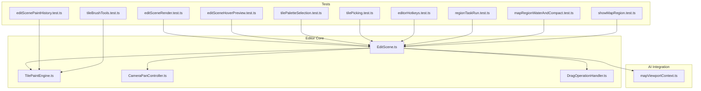
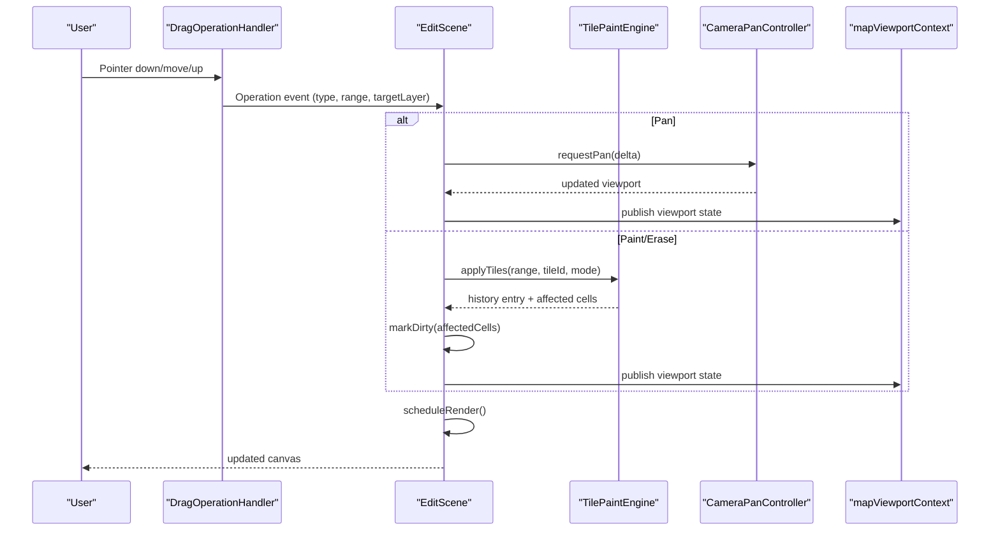
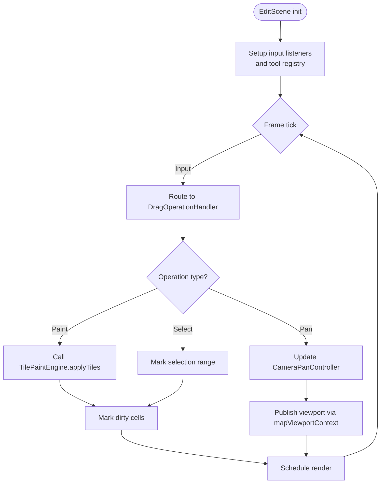
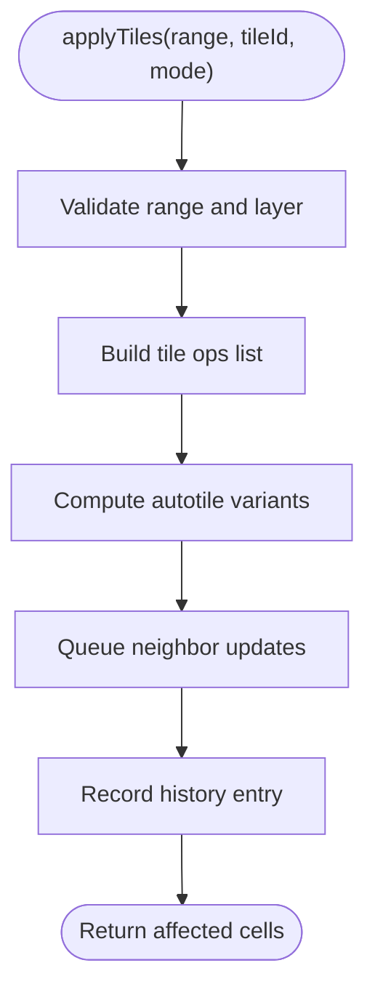
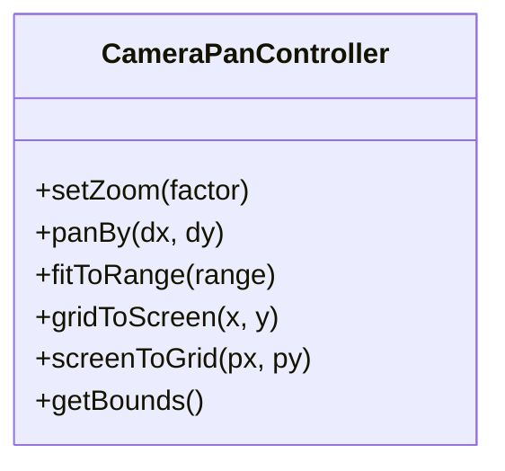
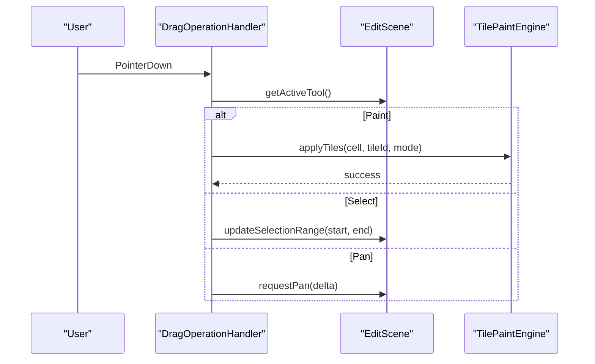
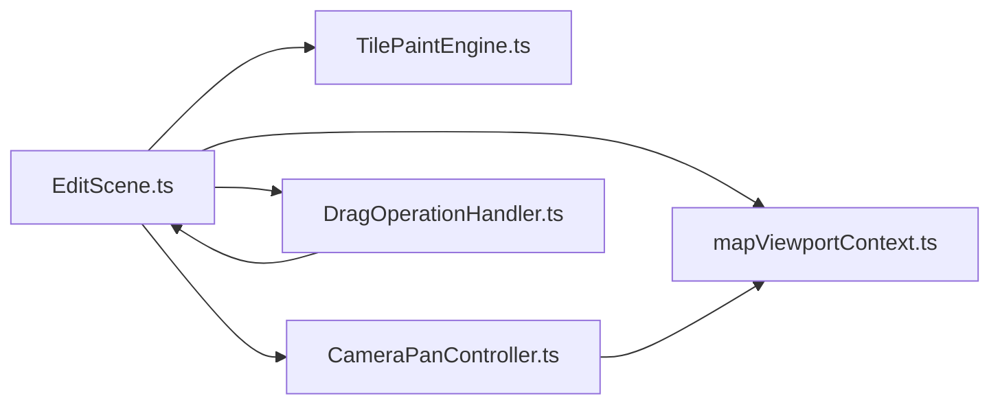

# Map Editor

<cite>
**Referenced Files in This Document**
- [EditScene.ts](file://src/editor/EditScene.ts)
- [TilePaintEngine.ts](file://src/editor/TilePaintEngine.ts)
- [CameraPanController.ts](file://src/editor/CameraPanController.ts)
- [DragOperationHandler.ts](file://src/editor/DragOperationHandler.ts)
- [mapViewportContext.ts](file://src/ai/mapViewportContext.ts)
- [editSceneRender.test.ts](file://test/editSceneRender.test.ts)
- [editSceneHoverPreview.test.ts](file://test/editSceneHoverPreview.test.ts)
- [editScenePaintHistory.test.ts](file://test/editScenePaintHistory.test.ts)
- [tilePaletteSelection.test.ts](file://test/tilePaletteSelection.test.ts)
- [tileBrushTools.test.ts](file://test/tileBrushTools.test.ts)
- [tilePicking.test.ts](file://test/tilePicking.test.ts)
- [editorHotkeys.test.ts](file://test/editorHotkeys.test.ts)
- [regionTaskRun.test.ts](file://test/regionTaskRun.test.ts)
- [mapRegionWaterAndCompact.test.ts](file://test/mapRegionWaterAndCompact.test.ts)
- [showMapRegion.test.ts](file://test/showMapRegion.test.ts)
</cite>

## Table of Contents
1. [Introduction](#introduction)
2. [Project Structure](#project-structure)
3. [Core Components](#core-components)
4. [Architecture Overview](#architecture-overview)
5. [Detailed Component Analysis](#detailed-component-analysis)
6. [Dependency Analysis](#dependency-analysis)
7. [Performance Considerations](#performance-considerations)
8. [Troubleshooting Guide](#troubleshooting-guide)
9. [Conclusion](#conclusion)
10. [Appendices](#appendices)

## Introduction
This document explains the map editor subsystem with a focus on:
- Main editing scene architecture and rendering loop
- Tile painting engine with autotile support
- Camera and viewport controls
- Drag operation handling for pan, select, and paint
- Layer management (ground, shadow, events)
- Tile selection tools and palette system
- Brush tools and region definition capabilities
- Map navigation features and keyboard shortcuts
- Practical workflows and productivity tips
- Performance considerations for large maps

The goal is to provide both conceptual understanding and code-level traceability for contributors and advanced users.

## Project Structure
The map editor is implemented under src/editor and integrates with AI context and test suites that validate behavior. Key files include:
- EditScene.ts: orchestrates the editing scene lifecycle, input routing, and rendering coordination
- TilePaintEngine.ts: implements tile placement, erasing, undo/redo, and autotile updates
- CameraPanController.ts: manages camera movement, zoom, and viewport constraints
- DragOperationHandler.ts: normalizes pointer interactions into drag operations (pan, select, paint)
- mapViewportContext.ts: exposes viewport state to AI-assisted flows and panels

**Diagram sources**
- [EditScene.ts](file://src/editor/EditScene.ts)
- [TilePaintEngine.ts](file://src/editor/TilePaintEngine.ts)
- [CameraPanController.ts](file://src/editor/CameraPanController.ts)
- [DragOperationHandler.ts](file://src/editor/DragOperationHandler.ts)
- [mapViewportContext.ts](file://src/ai/mapViewportContext.ts)
- [editSceneRender.test.ts](file://test/editSceneRender.test.ts)
- [editSceneHoverPreview.test.ts](file://test/editSceneHoverPreview.test.ts)
- [editScenePaintHistory.test.ts](file://test/editScenePaintHistory.test.ts)
- [tilePaletteSelection.test.ts](file://test/tilePaletteSelection.test.ts)
- [tileBrushTools.test.ts](file://test/tileBrushTools.test.ts)
- [tilePicking.test.ts](file://test/tilePicking.test.ts)
- [editorHotkeys.test.ts](file://test/editorHotkeys.test.ts)
- [regionTaskRun.test.ts](file://test/regionTaskRun.test.ts)
- [mapRegionWaterAndCompact.test.ts](file://test/mapRegionWaterAndCompact.test.ts)
- [showMapRegion.test.ts](file://test/showMapRegion.test.ts)

**Section sources**
- [EditScene.ts](file://src/editor/EditScene.ts)
- [TilePaintEngine.ts](file://src/editor/TilePaintEngine.ts)
- [CameraPanController.ts](file://src/editor/CameraPanController.ts)
- [DragOperationHandler.ts](file://src/editor/DragOperationHandler.ts)
- [mapViewportContext.ts](file://src/ai/mapViewportContext.ts)
- [editSceneRender.test.ts](file://test/editSceneRender.test.ts)
- [editSceneHoverPreview.test.ts](file://test/editSceneHoverPreview.test.ts)
- [editScenePaintHistory.test.ts](file://test/editScenePaintHistory.test.ts)
- [tilePaletteSelection.test.ts](file://test/tilePaletteSelection.test.ts)
- [tileBrushTools.test.ts](file://test/tileBrushTools.test.ts)
- [tilePicking.test.ts](file://test/tilePicking.test.ts)
- [editorHotkeys.test.ts](file://test/editorHotkeys.test.ts)
- [regionTaskRun.test.ts](file://test/regionTaskRun.test.ts)
- [mapRegionWaterAndCompact.test.ts](file://test/mapRegionWaterAndCompact.test.ts)
- [showMapRegion.test.ts](file://test/showMapRegion.test.ts)

## Core Components
- EditScene: central coordinator for input, tool state, layer visibility, and render scheduling; bridges UI actions to TilePaintEngine and CameraPanController.
- TilePaintEngine: applies tile changes, supports autotile propagation, maintains history for undo/redo, and exposes batch operations.
- CameraPanController: handles panning, zooming, snapping, and viewport clamping; exposes current view bounds and grid-to-screen transforms.
- DragOperationHandler: interprets pointer events into semantic operations (pan, rectangle select, brush paint), coordinating with EditScene and TilePaintEngine.
- mapViewportContext: provides reactive viewport state for AI panels and overlays.

Key responsibilities:
- Input normalization and dispatch
- Tool mode switching (paint, erase, select, move)
- Layer toggling and z-ordering (ground, shadow, events)
- Autotile rule application during paint
- Viewport navigation and fit-to-selection

**Section sources**
- [EditScene.ts](file://src/editor/EditScene.ts)
- [TilePaintEngine.ts](file://src/editor/TilePaintEngine.ts)
- [CameraPanController.ts](file://src/editor/CameraPanController.ts)
- [DragOperationHandler.ts](file://src/editor/DragOperationHandler.ts)
- [mapViewportContext.ts](file://src/ai/mapViewportContext.ts)

## Architecture Overview
The editor follows a scene-centric architecture where EditScene owns the main loop and delegates specialized tasks:
- Input pipeline: DragOperationHandler converts raw pointer events into high-level operations.
- Rendering pipeline: EditScene schedules redraws based on dirty regions and viewport changes.
- Data mutation: TilePaintEngine applies changes atomically and records history entries.
- Navigation: CameraPanController updates camera state and notifies dependent systems.

**Diagram sources**
- [DragOperationHandler.ts](file://src/editor/DragOperationHandler.ts)
- [EditScene.ts](file://src/editor/EditScene.ts)
- [TilePaintEngine.ts](file://src/editor/TilePaintEngine.ts)
- [CameraPanController.ts](file://src/editor/CameraPanController.ts)
- [mapViewportContext.ts](file://src/ai/mapViewportContext.ts)

## Detailed Component Analysis

### EditScene
Responsibilities:
- Lifecycle management (init, update, teardown)
- Input routing from DragOperationHandler
- Tool state and active layer management
- Dirty-region tracking and render scheduling
- Keyboard shortcut handling and command dispatch
- Integration with mapViewportContext for AI panels

Common workflows:
- Start paint: user selects brush, chooses layer, drags on map
- Switch layers: toggle ground/shadow/events visibility
- Navigate: pan/zoom via mouse or keys; fit to selection

**Diagram sources**
- [EditScene.ts](file://src/editor/EditScene.ts)
- [DragOperationHandler.ts](file://src/editor/DragOperationHandler.ts)
- [TilePaintEngine.ts](file://src/editor/TilePaintEngine.ts)
- [CameraPanController.ts](file://src/editor/CameraPanController.ts)
- [mapViewportContext.ts](file://src/ai/mapViewportContext.ts)

**Section sources**
- [EditScene.ts](file://src/editor/EditScene.ts)
- [editSceneRender.test.ts](file://test/editSceneRender.test.ts)
- [editSceneHoverPreview.test.ts](file://test/editSceneHoverPreview.test.ts)
- [editScenePaintHistory.test.ts](file://test/editScenePaintHistory.test.ts)
- [tilePaletteSelection.test.ts](file://test/tilePaletteSelection.test.ts)
- [tilePicking.test.ts](file://test/tilePicking.test.ts)
- [editorHotkeys.test.ts](file://test/editorHotkeys.test.ts)

### TilePaintEngine
Responsibilities:
- Apply tile writes and erasures across selected ranges
- Compute autotile transitions and propagate neighbors
- Maintain undo/redo history with minimal diffs
- Batch operations for performance

Autotile integration:
- On each write, compute local neighborhood patterns
- Resolve best-fit autotile variant per cell
- Queue neighbor re-evaluations within a bounded radius
- Commit changes atomically to preserve history integrity

**Diagram sources**
- [TilePaintEngine.ts](file://src/editor/TilePaintEngine.ts)

**Section sources**
- [TilePaintEngine.ts](file://src/editor/TilePaintEngine.ts)
- [editScenePaintHistory.test.ts](file://test/editScenePaintHistory.test.ts)
- [tileBrushTools.test.ts](file://test/tileBrushTools.test.ts)

### CameraPanController
Responsibilities:
- Handle pan deltas and zoom factors
- Clamp camera to map bounds
- Provide grid-to-screen and screen-to-grid transforms
- Notify subscribers (including mapViewportContext) on changes

Navigation features:
- Mouse wheel zoom centered at cursor
- Right-drag or middle-drag pan
- Fit-to-selection and center-on-event commands

**Diagram sources**
- [CameraPanController.ts](file://src/editor/CameraPanController.ts)

**Section sources**
- [CameraPanController.ts](file://src/editor/CameraPanController.ts)
- [mapViewportContext.ts](file://src/ai/mapViewportContext.ts)

### DragOperationHandler
Responsibilities:
- Normalize pointer events into operations: pan, rectangle select, brush paint
- Respect modifier keys (shift, ctrl, alt) for multi-cell operations
- Coordinate with EditScene for tool mode and active layer

Interaction model:
- Left-drag: paint/erase depending on active tool
- Shift+drag: extend selection
- Middle/right-drag: pan
- Alt-click: pick tile from map

**Diagram sources**
- [DragOperationHandler.ts](file://src/editor/DragOperationHandler.ts)
- [EditScene.ts](file://src/editor/EditScene.ts)
- [TilePaintEngine.ts](file://src/editor/TilePaintEngine.ts)

**Section sources**
- [DragOperationHandler.ts](file://src/editor/DragOperationHandler.ts)
- [tilePicking.test.ts](file://test/tilePicking.test.ts)

### Layer Management (Ground, Shadow, Events)
- Ground layer: base terrain tiles
- Shadow layer: occlusion and depth cues
- Events layer: interactive objects and triggers

Controls:
- Toggle visibility per layer
- Lock/unlock layers to prevent accidental edits
- Z-ordering ensures correct visual stacking

Integration points:
- TilePaintEngine respects active layer when applying changes
- DragOperationHandler routes operations to the correct layer
- EditScene persists layer states and restores them on reload

**Section sources**
- [EditScene.ts](file://src/editor/EditScene.ts)
- [tilePaletteSelection.test.ts](file://test/tilePaletteSelection.test.ts)

### Tile Palette System and Selection Tools
- Tile palette displays available tiles grouped by tileset sections
- Search/filter by name or tag
- Click to select; right-click to preview
- Contextual filters for autotiles vs. static tiles

Selection tools:
- Rectangle select for bulk operations
- Lasso-like freehand selection (if enabled by tool config)
- Invert selection and clear selection

**Section sources**
- [tilePaletteSelection.test.ts](file://test/tilePaletteSelection.test.ts)
- [tilePicking.test.ts](file://test/tilePicking.test.ts)

### Brush Tools
- Single-cell brush for precise edits
- Multi-cell brushes (square, circle) for rapid coverage
- Eraser tool mirrors brush shape
- Opacity and blending modes (when supported)

Productivity tips:
- Use shift to constrain brush direction
- Hold alt to sample from map
- Use repeat-last-brush action to speed up repetitive work

**Section sources**
- [tileBrushTools.test.ts](file://test/tileBrushTools.test.ts)
- [tilePicking.test.ts](file://test/tilePicking.test.ts)

### Region Definition Capabilities
- Define rectangular or custom-shaped regions
- Tag regions for gameplay logic (water, path, interior)
- Visual overlays show region boundaries and metadata
- Bulk operations can be scoped to regions

Workflows:
- Create region over water bodies
- Assign region intent for AI-assisted placement
- Export/import region definitions for reuse

**Section sources**
- [regionTaskRun.test.ts](file://test/regionTaskRun.test.ts)
- [mapRegionWaterAndCompact.test.ts](file://test/mapRegionWaterAndCompact.test.ts)
- [showMapRegion.test.ts](file://test/showMapRegion.test.ts)

### Map Navigation Features
- Smooth panning and zooming
- Snap-to-grid toggle for precision
- Fit-to-selection and center-on-cursor
- Quick jump to hotspots or named locations (via bookmarks)

Keyboard shortcuts:
- Arrow keys: pan one tile
- Ctrl+F: fit to selection
- Ctrl+0: reset zoom
- Space+drag: temporary pan

**Section sources**
- [editorHotkeys.test.ts](file://test/editorHotkeys.test.ts)
- [CameraPanController.ts](file://src/editor/CameraPanController.ts)

## Dependency Analysis
High-level dependencies:
- EditScene depends on TilePaintEngine, CameraPanController, DragOperationHandler, and mapViewportContext
- TilePaintEngine may depend on autotile rules and tileset metadata
- DragOperationHandler depends on EditScene’s tool registry and layer state
- mapViewportContext subscribes to camera changes and exposes state to AI panels

**Diagram sources**
- [EditScene.ts](file://src/editor/EditScene.ts)
- [TilePaintEngine.ts](file://src/editor/TilePaintEngine.ts)
- [CameraPanController.ts](file://src/editor/CameraPanController.ts)
- [DragOperationHandler.ts](file://src/editor/DragOperationHandler.ts)
- [mapViewportContext.ts](file://src/ai/mapViewportContext.ts)

**Section sources**
- [EditScene.ts](file://src/editor/EditScene.ts)
- [TilePaintEngine.ts](file://src/editor/TilePaintEngine.ts)
- [CameraPanController.ts](file://src/editor/CameraPanController.ts)
- [DragOperationHandler.ts](file://src/editor/DragOperationHandler.ts)
- [mapViewportContext.ts](file://src/ai/mapViewportContext.ts)

## Performance Considerations
- Batched tile writes: prefer range operations over single-cell loops
- Autotile optimization: limit neighbor evaluation radius and coalesce updates
- Dirty-region culling: only re-render visible and changed areas
- Viewport-aware drawing: skip off-screen tiles
- History compression: merge adjacent operations to reduce memory footprint
- Virtualization: defer loading of distant tileset textures until needed

Practical tips:
- Use larger brushes for broad strokes
- Temporarily disable shadows for heavy edits
- Zoom out to plan large-scale layouts before refining details

[No sources needed since this section provides general guidance]

## Troubleshooting Guide
Common issues and diagnostics:
- Stutter during large paints: check for excessive autotile recalculations; use batch operations
- Incorrect autotile seams: verify neighborhood pattern resolution and ensure consistent tileset metadata
- Selection not updating: confirm selection range computation and viewport transform correctness
- Hotkeys not responding: inspect keydown listeners and focus state

Relevant tests to review:
- Render correctness and hover previews
- Paint history integrity and undo/redo
- Palette selection and picking behavior
- Hotkey bindings and tool interactions

**Section sources**
- [editSceneRender.test.ts](file://test/editSceneRender.test.ts)
- [editSceneHoverPreview.test.ts](file://test/editSceneHoverPreview.test.ts)
- [editScenePaintHistory.test.ts](file://test/editScenePaintHistory.test.ts)
- [tilePaletteSelection.test.ts](file://test/tilePaletteSelection.test.ts)
- [tileBrushTools.test.ts](file://test/tileBrushTools.test.ts)
- [tilePicking.test.ts](file://test/tilePicking.test.ts)
- [editorHotkeys.test.ts](file://test/editorHotkeys.test.ts)

## Conclusion
The map editor subsystem centers around a cohesive scene architecture that separates concerns between input handling, data mutation, rendering, and navigation. TilePaintEngine provides robust autotile-aware editing with efficient history management, while CameraPanController and DragOperationHandler deliver smooth navigation and intuitive interaction. Layer management, palette tools, and region capabilities enable powerful authoring workflows. By following the performance recommendations and leveraging keyboard shortcuts, authors can efficiently build complex maps.

[No sources needed since this section summarizes without analyzing specific files]

## Appendices

### Practical Mapping Workflows
- Terrain layout:
  - Sketch coarse shapes using large brushes
  - Refine edges with smaller brushes and eraser
  - Apply autotiles along borders; verify seams
- Interior design:
  - Toggle shadow layer to check depth
  - Place props and events on dedicated layers
  - Use regions to define rooms and pathways
- Iterative polish:
  - Zoom out to assess flow and readability
  - Use fit-to-selection to frame important areas
  - Save frequently and leverage undo history

### Keyboard Shortcuts Reference
- Pan: arrow keys or space+drag
- Zoom: mouse wheel or Ctrl+scroll
- Fit to selection: Ctrl+F
- Reset zoom: Ctrl+0
- Pick tile: Alt+click
- Extend selection: Shift+drag
- Repeat last brush: configured hotkey

[No sources needed since this section provides general guidance]