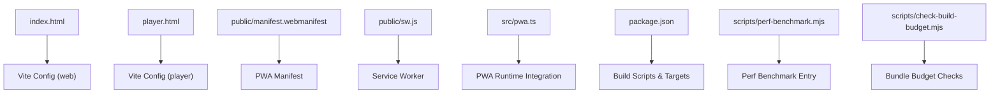
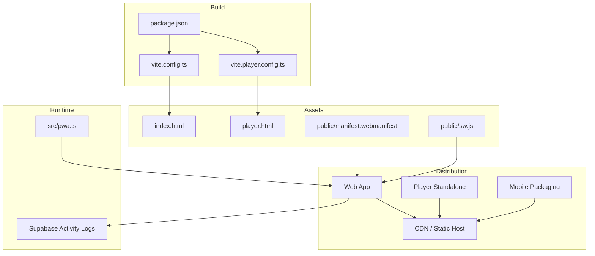
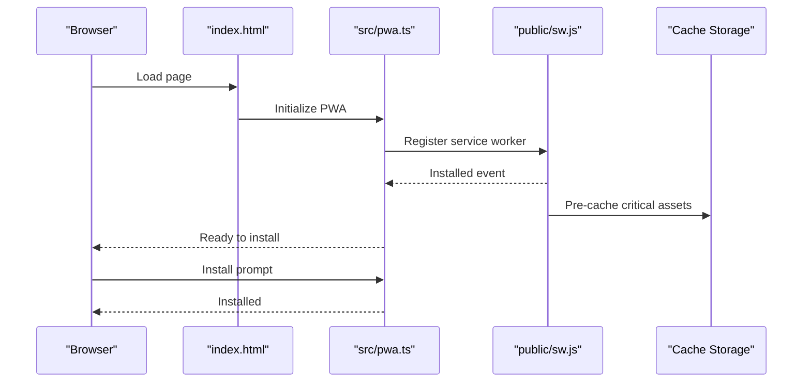
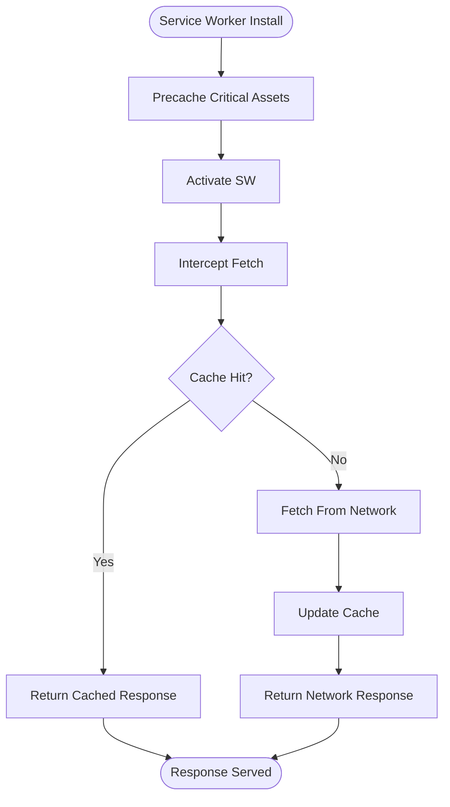
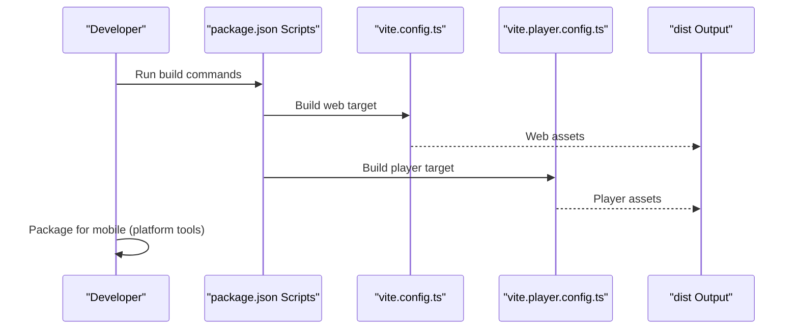
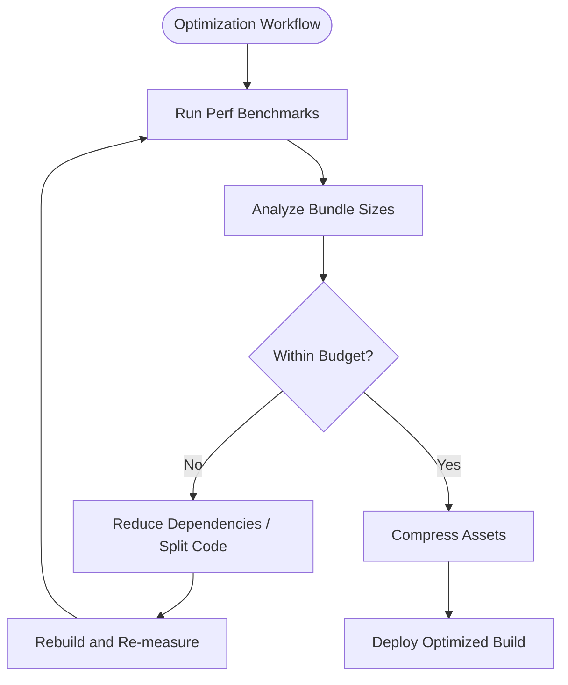
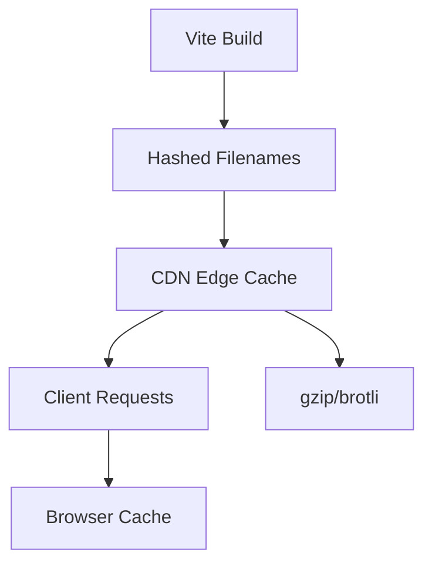
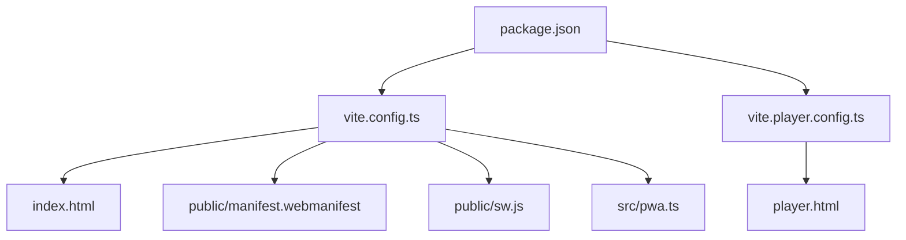

# Deployment and Distribution

<cite>
**Referenced Files in This Document**
- [package.json](file://package.json)
- [vite.config.ts](file://vite.config.ts)
- [vite.player.config.ts](file://vite.player.config.ts)
- [index.html](file://index.html)
- [player.html](file://player.html)
- [public/manifest.webmanifest](file://public/manifest.webmanifest)
- [public/sw.js](file://public/sw.js)
- [src/pwa.ts](file://src/pwa.ts)
- [scripts/launch-pwa.ps1](file://scripts/launch-pwa.ps1)
- [scripts/perf-benchmark.mjs](file://scripts/perf-benchmark.mjs)
- [scripts/perf-benchmark-entry.ts](file://scripts/perf-benchmark-entry.ts)
- [scripts/check-build-budget.mjs](file://scripts/check-build-budget.mjs)
- [supabase/migrations/20260709000000_ai_activity_logs.sql](file://supabase/migrations/20260709000000_ai_activity_logs.sql)
</cite>

## Table of Contents
1. [Introduction](#introduction)
2. [Project Structure](#project-structure)
3. [Core Components](#core-components)
4. [Architecture Overview](#architecture-overview)
5. [Detailed Component Analysis](#detailed-component-analysis)
6. [Dependency Analysis](#dependency-analysis)
7. [Performance Considerations](#performance-considerations)
8. [Troubleshooting Guide](#troubleshooting-guide)
9. [Conclusion](#conclusion)
10. [Appendices](#appendices)

## Introduction
This document explains how to build, deploy, and distribute the application across web, standalone, and mobile targets. It covers PWA configuration, service worker setup, progressive features, build pipelines for different outputs, performance optimization, asset bundling strategies, CDN integration, deployment examples, monitoring setup, maintenance procedures, browser compatibility, security headers, and SEO considerations.

## Project Structure
The project uses a Vite-based build system with multiple entry points and configurations:
- Web app entry point and HTML shell
- Player-only entry point for runtime distribution
- PWA manifest and service worker assets
- Build scripts for benchmarking and budget checks
- Supabase migrations for backend telemetry and logs

**Diagram sources**
- [index.html:1-200](file://index.html#L1-L200)
- [player.html:1-200](file://player.html#L1-L200)
- [vite.config.ts:1-200](file://vite.config.ts#L1-L200)
- [vite.player.config.ts:1-200](file://vite.player.config.ts#L1-L200)
- [public/manifest.webmanifest:1-200](file://public/manifest.webmanifest#L1-L200)
- [public/sw.js:1-200](file://public/sw.js#L1-L200)
- [src/pwa.ts:1-200](file://src/pwa.ts#L1-L200)
- [package.json:1-200](file://package.json#L1-L200)
- [scripts/perf-benchmark.mjs:1-200](file://scripts/perf-benchmark.mjs#L1-L200)
- [scripts/check-build-budget.mjs:1-200](file://scripts/check-build-budget.mjs#L1-L200)

**Section sources**
- [index.html:1-200](file://index.html#L1-L200)
- [player.html:1-200](file://player.html#L1-L200)
- [vite.config.ts:1-200](file://vite.config.ts#L1-L200)
- [vite.player.config.ts:1-200](file://vite.player.config.ts#L1-L200)
- [public/manifest.webmanifest:1-200](file://public/manifest.webmanifest#L1-L200)
- [public/sw.js:1-200](file://public/sw.js#L1-L200)
- [src/pwa.ts:1-200](file://src/pwa.ts#L1-L200)
- [package.json:1-200](file://package.json#L1-L200)
- [scripts/perf-benchmark.mjs:1-200](file://scripts/perf-benchmark.mjs#L1-L200)
- [scripts/check-build-budget.mjs:1-200](file://scripts/check-build-budget.mjs#L1-L200)

## Core Components
- Web build target configured via Vite for production-ready static assets.
- Player-only build target for distributing the runtime without editor tooling.
- PWA manifest defines app metadata, icons, display mode, and theme colors.
- Service worker provides caching and offline capabilities.
- PWA runtime module integrates registration and lifecycle hooks.
- Build scripts support performance benchmarking and bundle size budgets.

Key responsibilities:
- Asset bundling and code splitting for fast initial load.
- Cache strategies for critical resources and long-lived assets.
- Progressive enhancement for installability and background sync.
- Telemetry and activity logging via Supabase migrations.

**Section sources**
- [vite.config.ts:1-200](file://vite.config.ts#L1-L200)
- [vite.player.config.ts:1-200](file://vite.player.config.ts#L1-L200)
- [public/manifest.webmanifest:1-200](file://public/manifest.webmanifest#L1-L200)
- [public/sw.js:1-200](file://public/sw.js#L1-L200)
- [src/pwa.ts:1-200](file://src/pwa.ts#L1-L200)
- [scripts/perf-benchmark.mjs:1-200](file://scripts/perf-benchmark.mjs#L1-L200)
- [scripts/check-build-budget.mjs:1-200](file://scripts/check-build-budget.mjs#L1-L200)
- [supabase/migrations/20260709000000_ai_activity_logs.sql:1-200](file://supabase/migrations/20260709000000_ai_activity_logs.sql#L1-L200)

## Architecture Overview
The deployment architecture centers on Vite builds producing static assets served from a CDN or hosting platform. The PWA manifest and service worker enable installation and offline behavior. The player build isolates runtime assets for lightweight distribution.

**Diagram sources**
- [vite.config.ts:1-200](file://vite.config.ts#L1-L200)
- [vite.player.config.ts:1-200](file://vite.player.config.ts#L1-L200)
- [package.json:1-200](file://package.json#L1-L200)
- [index.html:1-200](file://index.html#L1-L200)
- [player.html:1-200](file://player.html#L1-L200)
- [public/manifest.webmanifest:1-200](file://public/manifest.webmanifest#L1-L200)
- [public/sw.js:1-200](file://public/sw.js#L1-L200)
- [src/pwa.ts:1-200](file://src/pwa.ts#L1-L200)
- [supabase/migrations/20260709000000_ai_activity_logs.sql:1-200](file://supabase/migrations/20260709000000_ai_activity_logs.sql#L1-L200)

## Detailed Component Analysis

### PWA Configuration and Progressive Features
- Manifest file defines app name, short name, start URL, display mode, theme color, and icons.
- PWA runtime module registers the service worker and handles updates.
- Launch script assists local development by serving assets and opening the PWA.

**Diagram sources**
- [index.html:1-200](file://index.html#L1-L200)
- [src/pwa.ts:1-200](file://src/pwa.ts#L1-L200)
- [public/sw.js:1-200](file://public/sw.js#L1-L200)
- [public/manifest.webmanifest:1-200](file://public/manifest.webmanifest#L1-L200)
- [scripts/launch-pwa.ps1:1-200](file://scripts/launch-pwa.ps1#L1-L200)

**Section sources**
- [public/manifest.webmanifest:1-200](file://public/manifest.webmanifest#L1-L200)
- [src/pwa.ts:1-200](file://src/pwa.ts#L1-L200)
- [public/sw.js:1-200](file://public/sw.js#L1-L200)
- [scripts/launch-pwa.ps1:1-200](file://scripts/launch-pwa.ps1#L1-L200)

### Service Worker Setup and Caching Strategy
- The service worker intercepts network requests and serves cached responses where appropriate.
- Strategies include pre-caching during install and runtime caching for API calls and assets.
- Update flow ensures new versions are detected and applied after user interaction or idle time.

**Diagram sources**
- [public/sw.js:1-200](file://public/sw.js#L1-L200)

**Section sources**
- [public/sw.js:1-200](file://public/sw.js#L1-L200)

### Build Processes for Different Targets
- Web build: Produces optimized static assets for hosting behind a CDN.
- Player build: Generates a minimal runtime package suitable for standalone distribution.
- Mobile packaging: Wrap static assets into a container using platform-specific tools.

**Diagram sources**
- [package.json:1-200](file://package.json#L1-L200)
- [vite.config.ts:1-200](file://vite.config.ts#L1-L200)
- [vite.player.config.ts:1-200](file://vite.player.config.ts#L1-L200)

**Section sources**
- [package.json:1-200](file://package.json#L1-L200)
- [vite.config.ts:1-200](file://vite.config.ts#L1-L200)
- [vite.player.config.ts:1-200](file://vite.player.config.ts#L1-L200)

### Performance Optimization Techniques
- Use performance benchmarking scripts to measure load times and resource usage.
- Enforce bundle size budgets to prevent regressions.
- Optimize images and audio; leverage compression and modern formats.
- Implement lazy loading and code splitting for large modules.

**Diagram sources**
- [scripts/perf-benchmark.mjs:1-200](file://scripts/perf-benchmark.mjs#L1-L200)
- [scripts/perf-benchmark-entry.ts:1-200](file://scripts/perf-benchmark-entry.ts#L1-L200)
- [scripts/check-build-budget.mjs:1-200](file://scripts/check-build-budget.mjs#L1-L200)

**Section sources**
- [scripts/perf-benchmark.mjs:1-200](file://scripts/perf-benchmark.mjs#L1-L200)
- [scripts/perf-benchmark-entry.ts:1-200](file://scripts/perf-benchmark-entry.ts#L1-L200)
- [scripts/check-build-budget.mjs:1-200](file://scripts/check-build-budget.mjs#L1-L200)

### Asset Bundling Strategies and CDN Integration
- Configure Vite to output hashed filenames for cache busting.
- Enable gzip/brotli compression at the server or CDN level.
- Set long cache lifetimes for immutable assets and short for index files.
- Use CDN edge caching and HTTP/2 multiplexing for faster delivery.

[No sources needed since this diagram shows conceptual workflow, not actual code structure]

### Deployment Examples for Popular Platforms
- Static hosting platforms: Upload dist assets and configure redirects for SPA routing.
- Containerized deployments: Serve static files via a lightweight web server.
- Mobile packaging: Wrap static assets into an app shell using platform SDKs.

[No sources needed since this section provides general guidance]

### Monitoring Setup and Maintenance Procedures
- Integrate telemetry endpoints and log activity to Supabase tables.
- Monitor performance metrics and error rates through dashboards.
- Schedule regular audits for dependency updates and security patches.
- Maintain versioned releases and rollback plans.

**Section sources**
- [supabase/migrations/20260709000000_ai_activity_logs.sql:1-200](file://supabase/migrations/20260709000000_ai_activity_logs.sql#L1-L200)

### Browser Compatibility, Security Headers, and SEO Considerations
- Ensure polyfills and feature detection for older browsers if required.
- Configure security headers such as Content-Security-Policy, X-Frame-Options, and Strict-Transport-Security.
- Optimize meta tags, Open Graph data, and structured data for SEO.
- Validate accessibility standards and keyboard navigation.

[No sources needed since this section provides general guidance]

## Dependency Analysis
Build-time dependencies and configuration relationships:

**Diagram sources**
- [package.json:1-200](file://package.json#L1-L200)
- [vite.config.ts:1-200](file://vite.config.ts#L1-L200)
- [vite.player.config.ts:1-200](file://vite.player.config.ts#L1-L200)
- [index.html:1-200](file://index.html#L1-L200)
- [player.html:1-200](file://player.html#L1-L200)
- [public/manifest.webmanifest:1-200](file://public/manifest.webmanifest#L1-L200)
- [public/sw.js:1-200](file://public/sw.js#L1-L200)
- [src/pwa.ts:1-200](file://src/pwa.ts#L1-L200)

**Section sources**
- [package.json:1-200](file://package.json#L1-L200)
- [vite.config.ts:1-200](file://vite.config.ts#L1-L200)
- [vite.player.config.ts:1-200](file://vite.player.config.ts#L1-L200)

## Performance Considerations
- Prefer lazy loading for heavy modules and assets.
- Use efficient image formats and sprite sheets where applicable.
- Minimize third-party dependencies and tree-shake unused code.
- Leverage browser caching and CDN edge locations.
- Regularly run benchmarks and enforce budgets to maintain performance.

[No sources needed since this section provides general guidance]

## Troubleshooting Guide
Common issues and resolutions:
- Service worker not updating: Clear cache storage and force reload; verify SW registration and update flow.
- PWA install prompt missing: Ensure manifest is correctly linked and meets requirements.
- Build failures due to size budgets: Review bundle analysis and reduce dependencies.
- Offline errors: Check cache keys and network fallbacks in the service worker.

**Section sources**
- [public/sw.js:1-200](file://public/sw.js#L1-L200)
- [public/manifest.webmanifest:1-200](file://public/manifest.webmanifest#L1-L200)
- [scripts/check-build-budget.mjs:1-200](file://scripts/check-build-budget.mjs#L1-L200)

## Conclusion
By leveraging Vite’s multi-target builds, a well-configured PWA manifest, and a robust service worker strategy, the application can be efficiently deployed across web, standalone, and mobile environments. Integrating performance benchmarks and bundle budgets ensures sustained quality, while CDN and caching strategies improve user experience. Monitoring and maintenance practices keep the system reliable and secure over time.

[No sources needed since this section summarizes without analyzing specific files]

## Appendices
- Local development launch helper for PWA testing.
- Example sequences for PWA registration and service worker activation.
- Guidance for integrating telemetry and activity logs.

**Section sources**
- [scripts/launch-pwa.ps1:1-200](file://scripts/launch-pwa.ps1#L1-L200)
- [src/pwa.ts:1-200](file://src/pwa.ts#L1-L200)
- [public/sw.js:1-200](file://public/sw.js#L1-L200)
- [supabase/migrations/20260709000000_ai_activity_logs.sql:1-200](file://supabase/migrations/20260709000000_ai_activity_logs.sql#L1-L200)