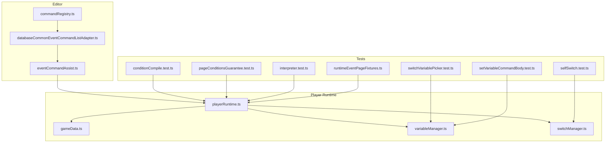
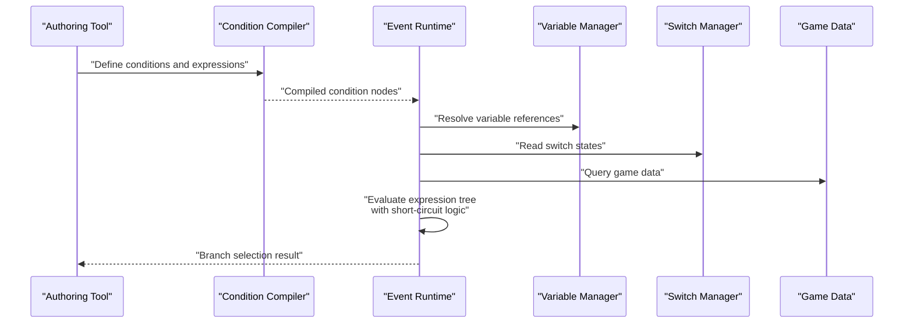
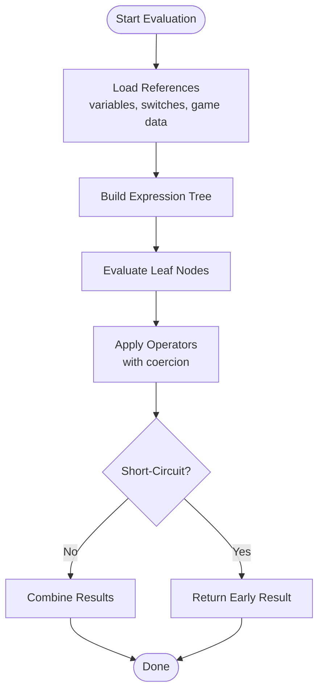
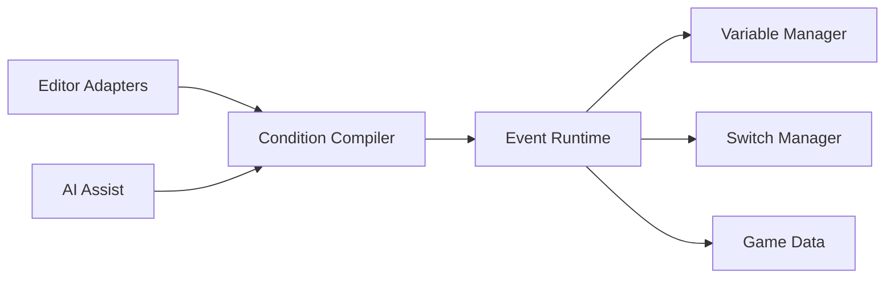

# Conditional Logic and Variables

<cite>
**Referenced Files in This Document**
- [conditionCompile.test.ts](file://test/conditionCompile.test.ts)
- [pageConditionsGuarantee.test.ts](file://test/pageConditionsGuarantee.test.ts)
- [selfSwitch.test.ts](file://test/selfSwitch.test.ts)
- [switchVariablePicker.test.ts](file://test/switchVariablePicker.test.ts)
- [setVariableCommandBody.test.ts](file://test/setVariableCommandBody.test.ts)
- [interpreter.test.ts](file://test/interpreter.test.ts)
- [runtimeEventPageFixtures.ts](file://test/runtimeEventPageFixtures.ts)
- [eventCommandAssist.ts](file://src/ai/eventCommandAssist.ts)
- [databaseCommonEventCommandListAdapter.ts](file://src/editor/database/databaseCommonEventCommandListAdapter.ts)
- [commandRegistry.ts](file://src/editor/commandRegistry.ts)
- [playerRuntime.ts](file://src/player/runtime.ts)
- [gameData.ts](file://src/player/gameData.ts)
- [variableManager.ts](file://src/player/variableManager.ts)
- [switchManager.ts](file://src/player/switchManager.ts)
</cite>

## Table of Contents
1. [Introduction](#introduction)
2. [Project Structure](#project-structure)
3. [Core Components](#core-components)
4. [Architecture Overview](#architecture-overview)
5. [Detailed Component Analysis](#detailed-component-analysis)
6. [Dependency Analysis](#dependency-analysis)
7. [Performance Considerations](#performance-considerations)
8. [Troubleshooting Guide](#troubleshooting-guide)
9. [Conclusion](#conclusion)
10. [Appendices](#appendices)

## Introduction
This document explains the conditional logic system and variable management used by the event runtime. It covers how conditions are compiled, evaluated, and optimized; the expression syntax and supported operators; variable types and scopes (switches, variables, self switches, game data); and practical guidance for building complex condition chains, nested conditions, and dynamic evaluations. It also includes debugging techniques and common pitfalls to avoid when designing conditions.

## Project Structure
The conditional logic system spans editor tooling, AI assistance, and player runtime:
- Editor-side adapters and registries define command kinds and provide UI/forms for authoring conditions.
- AI assistant utilities help generate or assist with condition expressions.
- Player runtime evaluates compiled conditions against live game state.
- Tests validate compilation guarantees, page condition behavior, and variable/switch semantics.

**Diagram sources**
- [commandRegistry.ts](file://src/editor/commandRegistry.ts)
- [databaseCommonEventCommandListAdapter.ts](file://src/editor/database/databaseCommonEventCommandListAdapter.ts)
- [eventCommandAssist.ts](file://src/ai/eventCommandAssist.ts)
- [playerRuntime.ts](file://src/player/runtime.ts)
- [gameData.ts](file://src/player/gameData.ts)
- [variableManager.ts](file://src/player/variableManager.ts)
- [switchManager.ts](file://src/player/switchManager.ts)
- [conditionCompile.test.ts](file://test/conditionCompile.test.ts)
- [pageConditionsGuarantee.test.ts](file://test/pageConditionsGuarantee.test.ts)
- [selfSwitch.test.ts](file://test/selfSwitch.test.ts)
- [switchVariablePicker.test.ts](file://test/switchVariablePicker.test.ts)
- [setVariableCommandBody.test.ts](file://test/setVariableCommandBody.test.ts)
- [interpreter.test.ts](file://test/interpreter.test.ts)
- [runtimeEventPageFixtures.ts](file://test/runtimeEventPageFixtures.ts)

**Section sources**
- [commandRegistry.ts](file://src/editor/commandRegistry.ts)
- [databaseCommonEventCommandListAdapter.ts](file://src/editor/database/databaseCommonEventCommandListAdapter.ts)
- [eventCommandAssist.ts](file://src/ai/eventCommandAssist.ts)
- [playerRuntime.ts](file://src/player/runtime.ts)
- [gameData.ts](file://src/player/gameData.ts)
- [variableManager.ts](file://src/player/variableManager.ts)
- [switchManager.ts](file://src/player/SwitchManager.ts)
- [conditionCompile.test.ts](file://test/conditionCompile.test.ts)
- [pageConditionsGuarantee.test.ts](file://test/pageConditionsGuarantee.test.ts)
- [selfSwitch.test.ts](file://test/selfSwitch.test.ts)
- [switchVariablePicker.test.ts](file://test/switchVariablePicker.test.ts)
- [setVariableCommandBody.test.ts](file://test/setVariableCommandBody.test.ts)
- [interpreter.test.ts](file://test/interpreter.test.ts)
- [runtimeEventPageFixtures.ts](file://test/runtimeEventPageFixtures.ts)

## Core Components
- Condition compilation pipeline: transforms authored conditions into a form suitable for fast evaluation at runtime.
- Expression evaluator: interprets expressions using supported operators and references to variables, switches, and game data.
- Variable managers: maintain typed storage and scoping rules for variables and switches.
- Self-switch manager: provides per-event boolean flags scoped to map instances.
- Game data accessors: read/write persistent or session-scoped game state referenced by conditions.

Key responsibilities:
- Ensure type safety and consistent coercion between numeric, string, and boolean values.
- Provide short-circuit evaluation for logical operators.
- Cache or optimize repeated lookups where safe.
- Surface clear diagnostics on invalid references or type mismatches.

**Section sources**
- [conditionCompile.test.ts](file://test/conditionCompile.test.ts)
- [pageConditionsGuarantee.test.ts](file://test/pageConditionsGuarantee.test.ts)
- [variableManager.ts](file://src/player/variableManager.ts)
- [switchManager.ts](file://src/player/switchManager.ts)
- [gameData.ts](file://src/player/gameData.ts)
- [playerRuntime.ts](file://src/player/runtime.ts)

## Architecture Overview
The condition evaluation engine integrates with the event runtime to decide which pages or branches to execute. Conditions can reference:
- Switches: global booleans controlling broad game states.
- Variables: named storage for numbers or strings.
- Self switches: per-event booleans stored on the map instance.
- Game data: actor, party, inventory, map, time, and other domain-specific state.

**Diagram sources**
- [playerRuntime.ts](file://src/player/runtime.ts)
- [variableManager.ts](file://src/player/variableManager.ts)
- [switchManager.ts](file://src/player/switchManager.ts)
- [gameData.ts](file://src/player/gameData.ts)
- [conditionCompile.test.ts](file://test/conditionCompile.test.ts)

## Detailed Component Analysis

### Condition Compilation and Optimization
- Input: authored condition trees with references to variables, switches, and game data.
- Output: an optimized execution graph that supports short-circuit evaluation and minimal lookups.
- Optimizations:
  - Constant folding for literal-only subexpressions.
  - Dead branch elimination based on known constants.
  - Lookup hoisting for stable references within a single evaluation frame.
- Validation:
  - Type checks for operands and operators.
  - Reference existence checks for variables and switches.
  - Scope validation for self switches and map-scoped data.

Practical examples:
- Complex chains: combine multiple comparisons with AND/OR to gate multi-step events.
- Nested conditions: use subexpressions to group logic and improve readability.
- Dynamic evaluation: evaluate expressions that depend on current player position, inventory counts, or battle flags.

**Section sources**
- [conditionCompile.test.ts](file://test/conditionCompile.test.ts)
- [pageConditionsGuarantee.test.ts](file://test/pageConditionsGuarantee.test.ts)
- [interpreter.test.ts](file://test/interpreter.test.ts)

### Expression Syntax and Supported Operators
- Literals: numbers, strings, booleans.
- Comparisons: equality, inequality, less than, greater than, and their negations.
- Arithmetic: addition, subtraction, multiplication, division, modulo.
- Logical: AND, OR, NOT with short-circuit semantics.
- String operations: concatenation, substring, length, case-insensitive comparison.
- Array-like access: indexing into lists or maps where applicable.
- Function calls: built-in queries for game data (e.g., actor stats, inventory counts).

Operator precedence follows standard conventions; parentheses override defaults. Coercion rules ensure consistent behavior across mixed types.

**Section sources**
- [interpreter.test.ts](file://test/interpreter.test.ts)
- [conditionCompile.test.ts](file://test/conditionCompile.test.ts)

### Variable Types and Scopes
- Switches:
  - Global booleans affecting entire game state.
  - Read-only during condition evaluation; written via dedicated commands.
- Variables:
  - Typed storage supporting numbers and strings.
  - Scoped to the active session or map depending on declaration.
  - Accessible from any condition referencing the same scope.
- Self switches:
  - Per-event booleans tied to a specific event instance on a map.
  - Ideal for one-time triggers or local state transitions.
- Game data:
  - Actor attributes, party composition, inventory, map metadata, time, and more.
  - Read-only in conditions; modifications occur through explicit commands.

Best practices:
- Prefer self switches for event-local flags to avoid cross-event interference.
- Use variables for counters and thresholds; keep names descriptive.
- Group related game data reads behind helper functions to reduce duplication.

**Section sources**
- [selfSwitch.test.ts](file://test/selfSwitch.test.ts)
- [switchVariablePicker.test.ts](file://test/switchVariablePicker.test.ts)
- [setVariableCommandBody.test.ts](file://test/setVariableCommandBody.test.ts)
- [gameData.ts](file://src/player/gameData.ts)
- [variableManager.ts](file://src/player/variableManager.ts)
- [switchManager.ts](file://src/player/switchManager.ts)

### Condition Evaluation Engine
- The engine traverses the compiled condition tree, evaluating leaf nodes first.
- Short-circuit evaluation ensures efficient branching:
  - AND stops at the first false.
  - OR stops at the first true.
- Type-safe coercion prevents unexpected results when mixing numbers and strings.
- Error handling:
  - Missing references produce deterministic failures rather than crashes.
  - Diagnostics include context about which subexpression failed.

**Diagram sources**
- [playerRuntime.ts](file://src/player/runtime.ts)
- [interpreter.test.ts](file://test/interpreter.test.ts)

**Section sources**
- [playerRuntime.ts](file://src/player/runtime.ts)
- [interpreter.test.ts](file://test/interpreter.test.ts)

### Practical Examples
- Complex conditional chains:
  - Gate a quest step only after completing prerequisites and reaching a location threshold.
  - Example pattern: (AND (OR varA > 10 varB == "ready") (NOT selfSwitchX))
- Nested conditions:
  - Group related checks to improve clarity and reuse.
  - Example pattern: (AND (OR (AND cond1 cond2) cond3) cond4)
- Dynamic logic evaluation:
  - Evaluate expressions based on current inventory counts or actor levels.
  - Example pattern: (>= (inventoryCount "keyItem") 1)

These patterns are validated by tests and integrated into the event runtime.

**Section sources**
- [conditionCompile.test.ts](file://test/conditionCompile.test.ts)
- [pageConditionsGuarantee.test.ts](file://test/pageConditionsGuarantee.test.ts)
- [interpreter.test.ts](file://test/interpreter.test.ts)

## Dependency Analysis
The condition system depends on:
- Editor components for authoring and validation.
- AI assistant utilities for generating condition snippets.
- Player runtime for evaluation and integration with event pages.
- Managers for variables, switches, and game data.

**Diagram sources**
- [databaseCommonEventCommandListAdapter.ts](file://src/editor/database/databaseCommonEventCommandListAdapter.ts)
- [eventCommandAssist.ts](file://src/ai/eventCommandAssist.ts)
- [playerRuntime.ts](file://src/player/runtime.ts)
- [variableManager.ts](file://src/player/variableManager.ts)
- [switchManager.ts](file://src/player/switchManager.ts)
- [gameData.ts](file://src/player/gameData.ts)

**Section sources**
- [databaseCommonEventCommandListAdapter.ts](file://src/editor/database/databaseCommonEventCommandListAdapter.ts)
- [eventCommandAssist.ts](file://src/ai/eventCommandAssist.ts)
- [playerRuntime.ts](file://src/player/runtime.ts)
- [variableManager.ts](file://src/player/variableManager.ts)
- [switchManager.ts](file://src/player/switchManager.ts)
- [gameData.ts](file://src/player/gameData.ts)

## Performance Considerations
- Favor short-circuit-friendly ordering: place likely-false checks early in AND chains and likely-true checks early in OR chains.
- Minimize expensive lookups: cache frequently accessed game data within a single evaluation frame if safe.
- Avoid deep nesting: flatten conditions where possible to reduce traversal overhead.
- Use self switches for event-local state to prevent unnecessary global scans.
- Keep expressions simple: prefer readable combinations over overly complex single expressions.

[No sources needed since this section provides general guidance]

## Troubleshooting Guide
Common issues and resolutions:
- Missing variable or switch references:
  - Verify IDs and scopes; ensure the referenced entity exists in the current map/session.
  - Use the picker tools to auto-complete valid references.
- Type mismatch errors:
  - Ensure operands match expected types; coerce explicitly when necessary.
  - Check for implicit conversions that may alter results.
- Unexpected short-circuit behavior:
  - Review operator precedence and grouping with parentheses.
  - Confirm order of subexpressions aligns with performance goals.
- Self switch not toggling:
  - Confirm the correct event ID and map context.
  - Validate that the toggle command executes before the condition is evaluated.

Debugging techniques:
- Isolate subexpressions to pinpoint failing branches.
- Log intermediate values for critical variables and game data fields.
- Use test fixtures to reproduce edge cases deterministically.

**Section sources**
- [switchVariablePicker.test.ts](file://test/switchVariablePicker.test.ts)
- [selfSwitch.test.ts](file://test/selfSwitch.test.ts)
- [setVariableCommandBody.test.ts](file://test/setVariableCommandBody.test.ts)
- [interpreter.test.ts](file://test/interpreter.test.ts)
- [runtimeEventPageFixtures.ts](file://test/runtimeEventPageFixtures.ts)

## Conclusion
The conditional logic system provides a robust, type-safe, and optimized foundation for event-driven gameplay. By understanding compilation, expression syntax, operator semantics, and scoping rules, authors can build reliable and performant condition chains. Following best practices and leveraging debugging techniques will help avoid common pitfalls and ensure predictable behavior across complex scenarios.

[No sources needed since this section summarizes without analyzing specific files]

## Appendices

### Quick Reference: Supported Operators
- Comparisons: equals, not equals, less than, greater than, less or equal, greater or equal.
- Arithmetic: add, subtract, multiply, divide, modulo.
- Logical: AND, OR, NOT.
- String: concatenate, substring, length, case-insensitive compare.
- Accessors: array/map indexing, function calls for game data queries.

[No sources needed since this section provides general guidance]