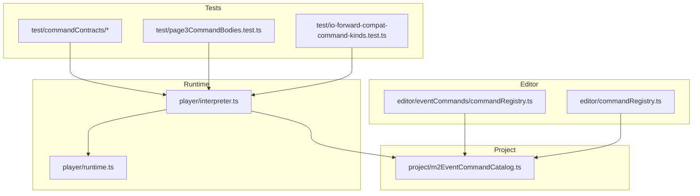
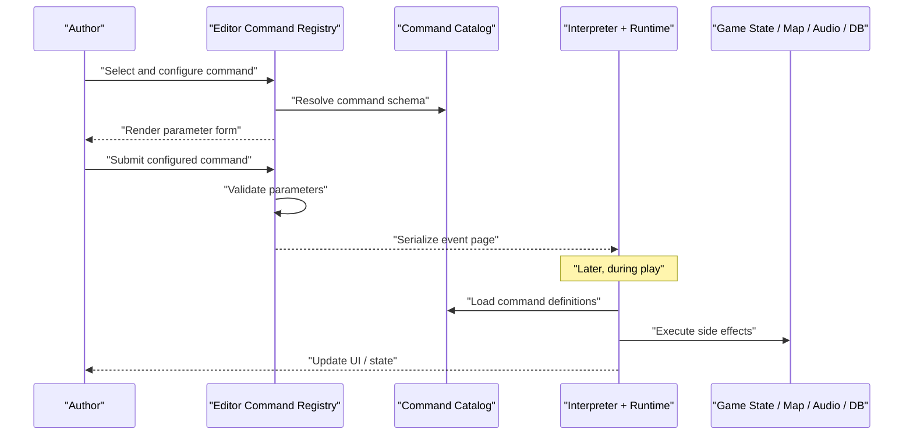
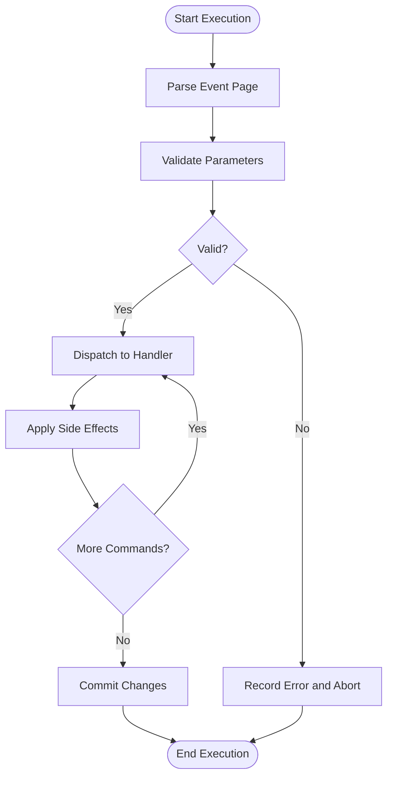
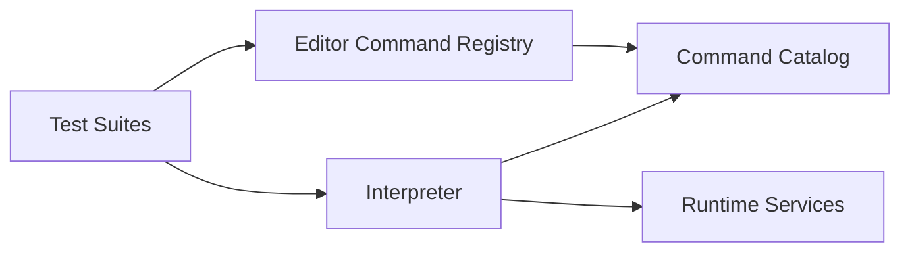

# Event Commands Reference

<cite>
**Referenced Files in This Document**
- [src/editor/eventCommands/commandRegistry.ts](file://src/editor/eventCommands/commandRegistry.ts)
- [src/player/interpreter.ts](file://src/player/interpreter.ts)
- [src/project/m2EventCommandCatalog.ts](file://src/project/m2EventCommandCatalog.ts)
- [src/player/runtime.ts](file://src/player/runtime.ts)
- [src/editor/commandRegistry.ts](file://src/editor/commandRegistry.ts)
- [test/commandContracts/fork.test.ts](file://test/commandContracts/fork.test.ts)
- [test/commandContracts/loop.test.ts](file://test/commandContracts/loop.test.ts)
- [test/commandContracts/dialogue.test.ts](file://test/commandContracts/dialogue.test.ts)
- [test/commandContracts/database.test.ts](file://test/commandContracts/database.test.ts)
- [test/commandContracts/mapManipulation.test.ts](file://test/commandContracts/mapManipulation.test.ts)
- [test/commandContracts/audioVisual.test.ts](file://test/commandContracts/audioVisual.test.ts)
- [test/commandContracts/gameState.test.ts](file://test/commandContracts/gameState.test.ts)
- [test/page3CommandBodies.test.ts](file://test/page3CommandBodies.test.ts)
- [test/io-forward-compat-command-kinds.test.ts](file://test/io-forward-compat-command-kinds.test.ts)
</cite>

## Table of Contents
1. [Introduction](#introduction)
2. [Project Structure](#project-structure)
3. [Core Components](#core-components)
4. [Architecture Overview](#architecture-overview)
5. [Detailed Component Analysis](#detailed-component-analysis)
6. [Dependency Analysis](#dependency-analysis)
7. [Performance Considerations](#performance-considerations)
8. [Troubleshooting Guide](#troubleshooting-guide)
9. [Conclusion](#conclusion)
10. [Appendices](#appendices)

## Introduction
This document provides comprehensive API documentation for the event command system used by the editor and runtime. It covers:
- The command catalog structure and how commands are defined and registered
- Command execution lifecycle from authoring to runtime evaluation
- Parameter validation and error handling strategies
- A categorized catalog of available commands with parameters, context, and behavior
- Migration guidance from legacy formats and best practices for efficient usage

The goal is to enable authors and developers to understand, extend, and debug event commands effectively across both editor and player contexts.

## Project Structure
The event command system spans several modules:
- Editor-side command registry and UI integration
- Runtime interpreter that executes commands against game state
- Catalog definitions that enumerate supported commands and their schemas
- Tests that validate contracts and behaviors across categories

**Diagram sources**
- [src/editor/eventCommands/commandRegistry.ts](file://src/editor/eventCommands/commandRegistry.ts)
- [src/editor/commandRegistry.ts](file://src/editor/commandRegistry.ts)
- [src/player/interpreter.ts](file://src/player/interpreter.ts)
- [src/player/runtime.ts](file://src/player/runtime.ts)
- [src/project/m2EventCommandCatalog.ts](file://src/project/m2EventCommandCatalog.ts)
- [test/commandContracts/fork.test.ts](file://test/commandContracts/fork.test.ts)
- [test/commandContracts/loop.test.ts](file://test/commandContracts/loop.test.ts)
- [test/commandContracts/dialogue.test.ts](file://test/commandContracts/dialogue.test.ts)
- [test/commandContracts/database.test.ts](file://test/commandContracts/database.test.ts)
- [test/commandContracts/mapManipulation.test.ts](file://test/commandContracts/mapManipulation.test.ts)
- [test/commandContracts/audioVisual.test.ts](file://test/commandContracts/audioVisual.test.ts)
- [test/commandContracts/gameState.test.ts](file://test/commandContracts/gameState.test.ts)
- [test/page3CommandBodies.test.ts](file://test/page3CommandBodies.test.ts)
- [test/io-forward-compat-command-kinds.test.ts](file://test/io-forward-compat-command-kinds.test.ts)

**Section sources**
- [src/editor/eventCommands/commandRegistry.ts](file://src/editor/eventCommands/commandRegistry.ts)
- [src/editor/commandRegistry.ts](file://src/editor/commandRegistry.ts)
- [src/player/interpreter.ts](file://src/player/interpreter.ts)
- [src/player/runtime.ts](file://src/player/runtime.ts)
- [src/project/m2EventCommandCatalog.ts](file://src/project/m2EventCommandCatalog.ts)

## Core Components
- Command Registry (Editor): Provides registration, lookup, and schema-driven forms for commands during authoring.
- Interpreter (Runtime): Executes commands sequentially, manages control flow, and interacts with runtime services.
- Command Catalog: Central definition of all supported commands, including parameter schemas and metadata.
- Runtime Services: Game state, map, audio/visual, database accessors used by commands at runtime.

Key responsibilities:
- Registration: Commands declare identifiers, parameter schemas, and optional metadata.
- Validation: Parameters are validated against schemas before execution.
- Execution: Interpreter dispatches to command handlers bound to the runtime.
- Error Handling: Errors are captured, contextualized, and surfaced to the editor or runtime logs.

**Section sources**
- [src/editor/eventCommands/commandRegistry.ts](file://src/editor/eventCommands/commandRegistry.ts)
- [src/player/interpreter.ts](file://src/player/interpreter.ts)
- [src/project/m2EventCommandCatalog.ts](file://src/project/m2EventCommandCatalog.ts)
- [src/player/runtime.ts](file://src/player/runtime.ts)

## Architecture Overview
The event command system follows a clear separation between authoring and execution:
- Authoring: Editor uses the command registry and catalog to present rich forms and validate inputs.
- Execution: Player’s interpreter reads serialized events and runs commands against the runtime.

**Diagram sources**
- [src/editor/eventCommands/commandRegistry.ts](file://src/editor/eventCommands/commandRegistry.ts)
- [src/project/m2EventCommandCatalog.ts](file://src/project/m2EventCommandCatalog.ts)
- [src/player/interpreter.ts](file://src/player/interpreter.ts)
- [src/player/runtime.ts](file://src/player/runtime.ts)

## Detailed Component Analysis

### Command Catalog Structure
- Purpose: Enumerates all supported commands with stable identifiers, human-readable labels, and parameter schemas.
- Schema fields typically include:
  - Identifier: Unique command kind
  - Label: Display name in editor
  - Category: Grouping (control flow, dialogue, database, map manipulation, audio/visual, game state)
  - Parameters: Array of typed fields with defaults, constraints, and options
  - Metadata: Flags such as async, interruptible, requires map context, etc.

Best practices:
- Keep identifiers stable; avoid breaking changes once published.
- Use descriptive parameter names and provide sensible defaults.
- Include validation rules to catch author errors early.

**Section sources**
- [src/project/m2EventCommandCatalog.ts](file://src/project/m2EventCommandCatalog.ts)

### Command Registration Process
- Editor-side registration binds command identifiers to UI forms and validation logic.
- Registration ensures:
  - Consistent rendering across pages and editors
  - Immediate feedback on invalid parameters
  - Compatibility checks when loading older projects

Registration steps:
- Define command entry in catalog
- Bind editor form to parameter schema
- Register handler mapping for runtime dispatch

**Section sources**
- [src/editor/eventCommands/commandRegistry.ts](file://src/editor/eventCommands/commandRegistry.ts)
- [src/editor/commandRegistry.ts](file://src/editor/commandRegistry.ts)

### Parameter Validation
- Validation occurs in two phases:
  - Author-time: Editor enforces schema constraints and shows inline errors
  - Runtime: Interpreter validates inputs before executing side effects
- Common validations:
  - Type checks (string, number, boolean, enum)
  - Range checks (min/max)
  - Referential integrity (IDs must exist in database or maps)
  - Context requirements (e.g., must be on a map)

Error reporting:
- Editor surfaces localized messages near the offending field
- Runtime logs structured errors with command context and stack traces

**Section sources**
- [src/editor/eventCommands/commandRegistry.ts](file://src/editor/eventCommands/commandRegistry.ts)
- [src/player/interpreter.ts](file://src/player/interpreter.ts)

### Control Flow Commands
Categories include branching and loops. Typical commands:
- Branching: If/Else conditions, weighted branches, conditional jumps
- Loops: For-each, while, repeat with exit conditions

Execution semantics:
- Conditions evaluate using current game state and variables
- Weighted branches select outcomes based on weights
- Loop constructs manage iteration counters and break/continue semantics

Validation:
- Ensure loop bounds are safe to prevent infinite loops
- Validate condition expressions reference valid variables and flags

Examples by category:
- Branching: Conditional jump based on variable comparison
- Loops: Repeat until flag set, iterate over list items

**Section sources**
- [test/commandContracts/fork.test.ts](file://test/commandContracts/fork.test.ts)
- [test/commandContracts/loop.test.ts](file://test/commandContracts/loop.test.ts)

### Dialogue and Text Display Commands
Typical commands:
- Show text with choices
- Face character portraits
- Display images or busts
- Pause/wait for input

Behavior:
- Renders modal or inline dialog windows
- Supports pagination and choice routing
- Integrates with voiceover and subtitles if available

Validation:
- Ensure referenced assets exist
- Validate choice routes do not create dead ends

Examples by category:
- Dialogue: Multi-page conversation with branching choices
- Portraits: Change face graphics per speaker

**Section sources**
- [test/commandContracts/dialogue.test.ts](file://test/commandContracts/dialogue.test.ts)

### Database Operations Commands
Typical commands:
- Read/write records
- Query tables with filters
- Update relationships and references
- Trigger callbacks on data changes

Behavior:
- Uses runtime database service to perform operations
- Supports transactions where applicable
- Emits events for observers (e.g., UI refresh)

Validation:
- Check record existence and referential integrity
- Enforce permissions and ownership rules

Examples by category:
- CRUD: Create item, update quest status
- Queries: Find NPCs by region and availability

**Section sources**
- [test/commandContracts/database.test.ts](file://test/commandContracts/database.test.ts)

### Map Manipulation Commands
Typical commands:
- Place/remove events and props
- Change tiles and layers
- Toggle visibility of regions or overlays
- Move camera or pan view

Behavior:
- Applies changes to current map instance
- Updates renderers and collision systems
- Optionally persists changes depending on context

Validation:
- Ensure tile indices and layer IDs are valid
- Prevent out-of-bounds placements

Examples by category:
- Placement: Spawn chest at coordinates
- Visibility: Hide region after quest completion

**Section sources**
- [test/commandContracts/mapManipulation.test.ts](file://test/commandContracts/mapManipulation.test.ts)

### Audio/Visual Effects Commands
Typical commands:
- Play music, sound effects, ambient loops
- Show/hide pictures, weather effects, screen tint
- Animate transitions and fades

Behavior:
- Delegates to audio engine and visual overlay manager
- Manages resource loading and caching
- Supports volume and crossfade controls

Validation:
- Verify asset paths and formats
- Guard against excessive concurrent playback

Examples by category:
- Audio: Play battle theme on encounter
- Visual: Flash screen on damage

**Section sources**
- [test/commandContracts/audioVisual.test.ts](file://test/commandContracts/audioVisual.test.ts)

### Game State Management Commands
Typical commands:
- Set/get variables and switches
- Modify party members and inventory
- Adjust gold, experience, levels
- Save/load checkpoints

Behavior:
- Mutates core game state objects
- Triggers dependent updates (menus, HUD, quests)
- Persists state to save files or remote storage

Validation:
- Clamp numeric values within allowed ranges
- Ensure required entities exist before mutation

Examples by category:
- Variables: Increment quest progress counter
- Inventory: Add item to party bag

**Section sources**
- [test/commandContracts/gameState.test.ts](file://test/commandContracts/gameState.test.ts)

### Command Execution Lifecycle
Lifecycle stages:
- Parse: Deserialize event page into command list
- Validate: Apply schema-based checks and resolve references
- Execute: Run commands sequentially, handling async operations
- Commit: Persist state changes and notify observers

**Diagram sources**
- [src/player/interpreter.ts](file://src/player/interpreter.ts)
- [src/player/runtime.ts](file://src/player/runtime.ts)

**Section sources**
- [src/player/interpreter.ts](file://src/player/interpreter.ts)
- [src/player/runtime.ts](file://src/player/runtime.ts)

### Error Handling and Debugging
Error handling strategies:
- Early validation failures stop execution and report precise locations
- Runtime errors capture command context, parameters, and call stacks
- Graceful degradation for missing assets or transient failures

Debugging techniques:
- Enable detailed logs in editor and runtime
- Inspect serialized event pages for correctness
- Use test suites to reproduce edge cases and regressions

Common pitfalls:
- Infinite loops due to incorrect exit conditions
- Invalid references causing null dereferences
- Race conditions in async commands

**Section sources**
- [src/player/interpreter.ts](file://src/player/interpreter.ts)
- [test/page3CommandBodies.test.ts](file://test/page3CommandBodies.test.ts)

### Migration from Legacy Formats
Migration considerations:
- Maintain backward compatibility for older command kinds
- Provide adapters to normalize legacy structures to current schemas
- Validate migrated content and surface warnings for deprecated features

Steps:
- Detect legacy format version
- Transform old fields to new schema
- Run validation and fix-up passes
- Log migration actions for auditability

**Section sources**
- [test/io-forward-compat-command-kinds.test.ts](file://test/io-forward-compat-command-kinds.test.ts)

### Best Practices for Efficient Command Usage
- Prefer batch operations to reduce overhead (e.g., bulk map edits)
- Cache frequently accessed resources and reuse references
- Avoid heavy computations inside hot paths; precompute where possible
- Use asynchronous commands judiciously and handle timeouts
- Keep command chains short and modular for readability and debugging

[No sources needed since this section provides general guidance]

## Dependency Analysis
The following diagram illustrates key dependencies among components involved in command processing:

**Diagram sources**
- [src/editor/eventCommands/commandRegistry.ts](file://src/editor/eventCommands/commandRegistry.ts)
- [src/editor/commandRegistry.ts](file://src/editor/commandRegistry.ts)
- [src/player/interpreter.ts](file://src/player/interpreter.ts)
- [src/player/runtime.ts](file://src/player/runtime.ts)
- [src/project/m2EventCommandCatalog.ts](file://src/project/m2EventCommandCatalog.ts)
- [test/commandContracts/fork.test.ts](file://test/commandContracts/fork.test.ts)
- [test/commandContracts/loop.test.ts](file://test/commandContracts/loop.test.ts)
- [test/commandContracts/dialogue.test.ts](file://test/commandContracts/dialogue.test.ts)
- [test/commandContracts/database.test.ts](file://test/commandContracts/database.test.ts)
- [test/commandContracts/mapManipulation.test.ts](file://test/commandContracts/mapManipulation.test.ts)
- [test/commandContracts/audioVisual.test.ts](file://test/commandContracts/audioVisual.test.ts)
- [test/commandContracts/gameState.test.ts](file://test/commandContracts/gameState.test.ts)
- [test/page3CommandBodies.test.ts](file://test/page3CommandBodies.test.ts)
- [test/io-forward-compat-command-kinds.test.ts](file://test/io-forward-compat-command-kinds.test.ts)

**Section sources**
- [src/editor/eventCommands/commandRegistry.ts](file://src/editor/eventCommands/commandRegistry.ts)
- [src/editor/commandRegistry.ts](file://src/editor/commandRegistry.ts)
- [src/player/interpreter.ts](file://src/player/interpreter.ts)
- [src/player/runtime.ts](file://src/player/runtime.ts)
- [src/project/m2EventCommandCatalog.ts](file://src/project/m2EventCommandCatalog.ts)

## Performance Considerations
- Minimize repeated lookups by caching resolved references
- Batch mutations to reduce re-renders and state churn
- Use lazy loading for large assets and defer non-critical work
- Profile command-heavy sequences to identify bottlenecks
- Avoid synchronous blocking operations in hot paths

[No sources needed since this section provides general guidance]

## Troubleshooting Guide
- Symptom: Command fails with validation error
  - Action: Check parameter types and ranges; ensure referenced IDs exist
- Symptom: Infinite loop in event page
  - Action: Verify loop exit conditions and update flags/variables correctly
- Symptom: Missing asset warning
  - Action: Confirm asset paths and availability; add fallbacks
- Symptom: Runtime crash with null reference
  - Action: Inspect command context and guard against missing entities

Use tests to isolate issues:
- Reproduce with minimal event pages
- Compare against existing contract tests for similar commands

**Section sources**
- [src/player/interpreter.ts](file://src/player/interpreter.ts)
- [test/page3CommandBodies.test.ts](file://test/page3CommandBodies.test.ts)

## Conclusion
The event command system provides a robust, schema-driven framework for authoring and executing interactive behaviors. By leveraging the command catalog, strict validation, and a clear execution lifecycle, authors can build complex interactions safely and efficiently. Following the best practices and troubleshooting guidelines will help maintain performance and reliability across editor and runtime environments.

[No sources needed since this section summarizes without analyzing specific files]

## Appendices

### Appendix A: Command Categories Summary
- Control Flow: Branching and loops
- Dialogue and Text Display: Conversations and media presentation
- Database Operations: Data read/write and queries
- Map Manipulation: Dynamic map editing and camera control
- Audio/Visual Effects: Sound and visual enhancements
- Game State Management: Variables, inventory, and persistence

[No sources needed since this section aggregates previously analyzed categories]