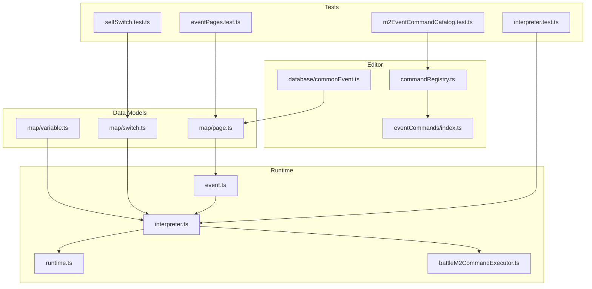
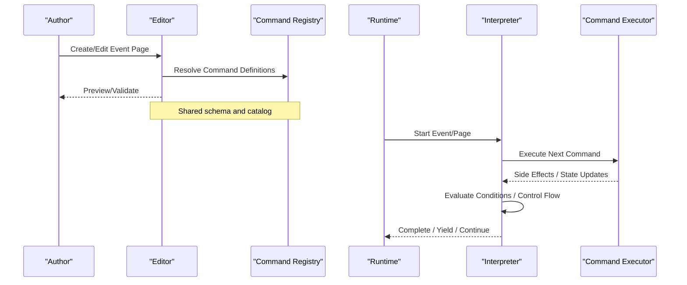
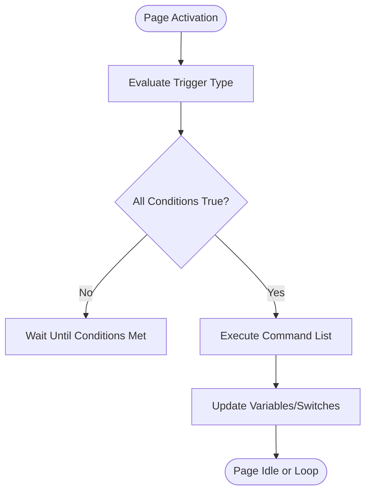
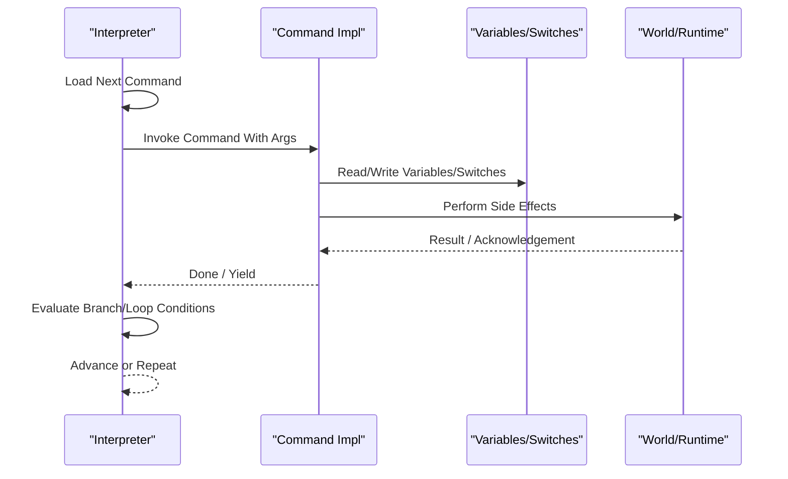
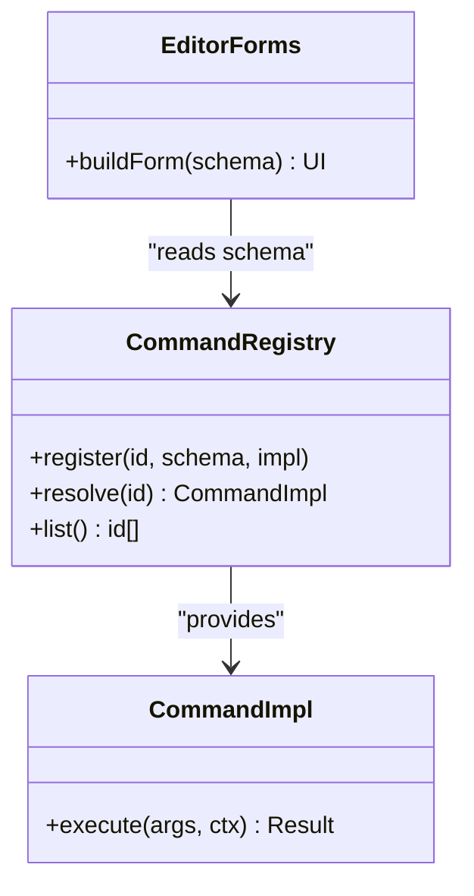
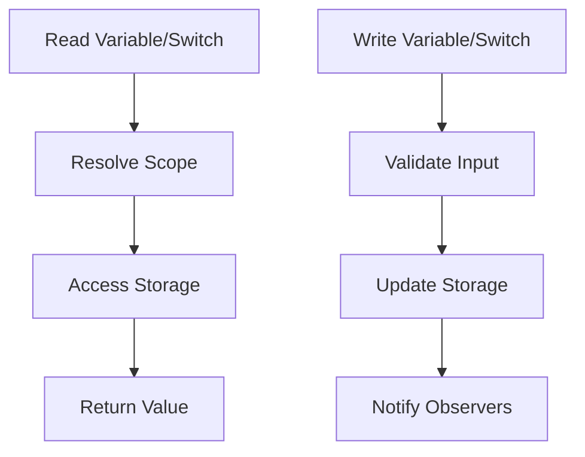
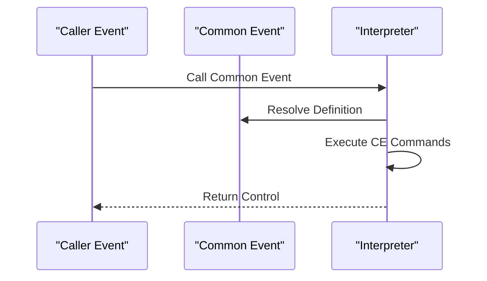
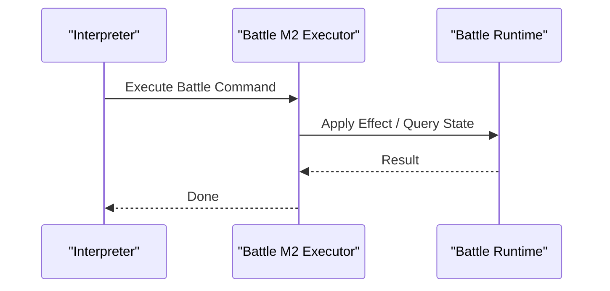
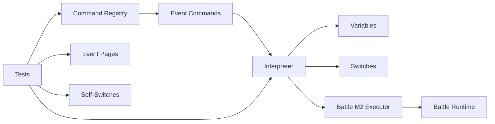

# Event System and Scripting

<cite>
**Referenced Files in This Document**
- [src/player/event.ts](file://src/player/event.ts)
- [src/player/interpreter.ts](file://src/player/interpreter.ts)
- [src/player/runtime.ts](file://src/player/runtime.ts)
- [src/editor/commandRegistry.ts](file://src/editor/commandRegistry.ts)
- [src/editor/eventCommands/index.ts](file://src/editor/eventCommands/index.ts)
- [src/project/database/commonEvent.ts](file://src/project/database/commonEvent.ts)
- [src/project/map/page.ts](file://src/project/map/page.ts)
- [src/project/map/variable.ts](file://src/project/map/variable.ts)
- [src/project/map/switch.ts](file://src/project/map/switch.ts)
- [src/player/battleM2CommandExecutor.ts](file://src/player/battleM2CommandExecutor.ts)
- [test/m2EventCommandCatalog.test.ts](file://test/m2EventCommandCatalog.test.ts)
- [test/eventPages.test.ts](file://test/eventPages.test.ts)
- [test/selfSwitch.test.ts](file://test/selfSwitch.test.ts)
- [test/interpreter.test.ts](file://test/interpreter.test.ts)
</cite>

## Table of Contents
1. [Introduction](#introduction)
2. [Project Structure](#project-structure)
3. [Core Components](#core-components)
4. [Architecture Overview](#architecture-overview)
5. [Detailed Component Analysis](#detailed-component-analysis)
6. [Dependency Analysis](#dependency-analysis)
7. [Performance Considerations](#performance-considerations)
8. [Troubleshooting Guide](#troubleshooting-guide)
9. [Conclusion](#conclusion)
10. [Appendices](#appendices)

## Introduction
This document explains the event system and scripting capabilities, focusing on:
- The event command catalog and how commands are registered and executed
- Conditional logic evaluation for pages and branches
- The script execution environment and API surface
- The event page system, including triggers, conditions, and self-switches
- Variable and switch management across maps and common events
- The common event framework for reusable logic
- Command registry architecture and custom command creation
- Practical examples for interactive storytelling, game state management, and complex mechanics
- Performance considerations for event-heavy scenarios and debugging techniques

## Project Structure
The event system spans editor authoring and runtime execution:
- Editor-side: command registry, UI forms, validation, and database integration
- Runtime-side: interpreter, event pages, variables/switches, and command executors
- Tests: coverage for command catalogs, page behavior, interpreter flows, and self-switch semantics

**Diagram sources**
- [src/editor/commandRegistry.ts](file://src/editor/commandRegistry.ts)
- [src/editor/eventCommands/index.ts](file://src/editor/eventCommands/index.ts)
- [src/project/database/commonEvent.ts](file://src/project/database/commonEvent.ts)
- [src/player/event.ts](file://src/player/event.ts)
- [src/player/interpreter.ts](file://src/player/interpreter.ts)
- [src/player/runtime.ts](file://src/player/runtime.ts)
- [src/player/battleM2CommandExecutor.ts](file://src/player/battleM2CommandExecutor.ts)
- [src/project/map/page.ts](file://src/project/map/page.ts)
- [src/project/map/variable.ts](file://src/project/map/variable.ts)
- [src/project/map/switch.ts](file://src/project/map/switch.ts)
- [test/m2EventCommandCatalog.test.ts](file://test/m2EventCommandCatalog.test.ts)
- [test/eventPages.test.ts](file://test/eventPages.test.ts)
- [test/selfSwitch.test.ts](file://test/selfSwitch.test.ts)
- [test/interpreter.test.ts](file://test/interpreter.test.ts)

**Section sources**
- [src/editor/commandRegistry.ts](file://src/editor/commandRegistry.ts)
- [src/editor/eventCommands/index.ts](file://src/editor/eventCommands/index.ts)
- [src/player/event.ts](file://src/player/event.ts)
- [src/player/interpreter.ts](file://src/player/interpreter.ts)
- [src/player/runtime.ts](file://src/player/runtime.ts)
- [src/player/battleM2CommandExecutor.ts](file://src/player/battleM2CommandExecutor.ts)
- [src/project/map/page.ts](file://src/project/map/page.ts)
- [src/project/map/variable.ts](file://src/project/map/variable.ts)
- [src/project/map/switch.ts](file://src/project/map/switch.ts)
- [test/m2EventCommandCatalog.test.ts](file://test/m2EventCommandCatalog.test.ts)
- [test/eventPages.test.ts](file://test/eventPages.test.ts)
- [test/selfSwitch.test.ts](file://test/selfSwitch.test.ts)
- [test/interpreter.test.ts](file://test/interpreter.test.ts)

## Core Components
- Event Page System: Defines trigger-based activation, condition evaluation, and ordered command lists per page.
- Interpreter: Drives sequential execution of commands within a page, handling control flow (loops, branching), I/O, and side effects.
- Command Registry: Centralized mapping from command IDs to implementations; used by both editor and runtime.
- Variables and Switches: Persistent state containers scoped to map or global contexts; evaluated by conditions and modified by commands.
- Common Events: Reusable event definitions invoked from other events or systems.
- Battle M2 Commands: Specialized command executor for battle-phase operations.

Key responsibilities:
- Pages encapsulate “what happens when” with declarative triggers and conditions.
- Interpreter executes commands deterministically, exposing an API for advanced scripting.
- Registry ensures consistent command availability across editor and runtime.
- Variables/Switches provide stable state storage for narrative and gameplay logic.
- Common Events promote reuse and modularity.

**Section sources**
- [src/player/event.ts](file://src/player/event.ts)
- [src/player/interpreter.ts](file://src/player/interpreter.ts)
- [src/editor/commandRegistry.ts](file://src/editor/commandRegistry.ts)
- [src/project/map/page.ts](file://src/project/map/page.ts)
- [src/project/map/variable.ts](file://src/project/map/variable.ts)
- [src/project/map/switch.ts](file://src/project/map/switch.ts)
- [src/project/database/commonEvent.ts](file://src/project/database/commonEvent.ts)
- [src/player/battleM2CommandExecutor.ts](file://src/player/battleM2CommandExecutor.ts)

## Architecture Overview
The event system follows a layered architecture:
- Data layer: Map pages, variables, switches, and common events define structure and state.
- Execution layer: Interpreter orchestrates command execution against the runtime.
- Command layer: Registry resolves commands to implementations; battle commands use a specialized executor.
- Editor layer: Provides authoring tools and validation backed by the same registry.

**Diagram sources**
- [src/editor/commandRegistry.ts](file://src/editor/commandRegistry.ts)
- [src/player/interpreter.ts](file://src/player/interpreter.ts)
- [src/player/runtime.ts](file://src/player/runtime.ts)
- [src/player/battleM2CommandExecutor.ts](file://src/player/battleM2CommandExecutor.ts)

## Detailed Component Analysis

### Event Page System
- Triggers: Activation modes such as player touch, autorun, parallel process, etc., determine when a page becomes active.
- Conditions: Boolean expressions based on switches, variables, flags, and contextual data gate page activation.
- Command List: Ordered sequence of commands executed upon activation.
- Self-Switches: Per-event flags that persist across activations to model progression without global state pollution.

**Diagram sources**
- [src/player/event.ts](file://src/player/event.ts)
- [src/project/map/page.ts](file://src/project/map/page.ts)
- [src/project/map/switch.ts](file://src/project/map/switch.ts)

**Section sources**
- [src/player/event.ts](file://src/player/event.ts)
- [src/project/map/page.ts](file://src/project/map/page.ts)
- [src/project/map/switch.ts](file://src/project/map/switch.ts)
- [test/eventPages.test.ts](file://test/eventPages.test.ts)
- [test/selfSwitch.test.ts](file://test/selfSwitch.test.ts)

### Interpreter and Command Execution
- Sequential Execution: Commands run in order; control flow commands alter the instruction pointer.
- Condition Evaluation: Branching and loops rely on boolean expressions over variables, switches, and context.
- Side Effects: Commands interact with world state (e.g., movement, dialogue, inventory).
- Yield Points: Some commands pause execution until external input or asynchronous completion.

**Diagram sources**
- [src/player/interpreter.ts](file://src/player/interpreter.ts)
- [src/player/runtime.ts](file://src/player/runtime.ts)
- [src/project/map/variable.ts](file://src/project/map/variable.ts)
- [src/project/map/switch.ts](file://src/project/map/switch.ts)

**Section sources**
- [src/player/interpreter.ts](file://src/player/interpreter.ts)
- [src/player/runtime.ts](file://src/player/runtime.ts)
- [test/interpreter.test.ts](file://test/interpreter.test.ts)

### Command Registry Architecture
- Registration: Commands register their ID, schema, and implementation once.
- Resolution: Both editor and runtime resolve commands via the registry.
- Extensibility: Custom commands can be added by registering new entries.
- Validation: Editor uses schemas to validate inputs and generate UI forms.

**Diagram sources**
- [src/editor/commandRegistry.ts](file://src/editor/commandRegistry.ts)
- [src/editor/eventCommands/index.ts](file://src/editor/eventCommands/index.ts)

**Section sources**
- [src/editor/commandRegistry.ts](file://src/editor/commandRegistry.ts)
- [src/editor/eventCommands/index.ts](file://src/editor/eventCommands/index.ts)
- [test/m2EventCommandCatalog.test.ts](file://test/m2EventCommandCatalog.test.ts)

### Variables and Switches Management
- Scoping: Variables and switches may be map-scoped or global depending on configuration.
- Persistence: Changes survive across page activations and map transitions where applicable.
- Access Patterns: Commands read/write values; conditions evaluate current state.
- Safety: Bounds checks and type guards prevent invalid mutations.

**Diagram sources**
- [src/project/map/variable.ts](file://src/project/map/variable.ts)
- [src/project/map/switch.ts](file://src/project/map/switch.ts)

**Section sources**
- [src/project/map/variable.ts](file://src/project/map/variable.ts)
- [src/project/map/switch.ts](file://src/project/map/switch.ts)

### Common Event Framework
- Definition: Common events are reusable command sequences stored in the project database.
- Invocation: Other events call common events with parameters and receive results.
- Composition: Enables modular design and reduces duplication across maps.

**Diagram sources**
- [src/project/database/commonEvent.ts](file://src/project/database/commonEvent.ts)
- [src/player/interpreter.ts](file://src/player/interpreter.ts)

**Section sources**
- [src/project/database/commonEvent.ts](file://src/project/database/commonEvent.ts)
- [src/player/interpreter.ts](file://src/player/interpreter.ts)

### Battle M2 Commands
- Specialized Executor: Battle-phase commands use a dedicated executor to integrate with battle runtime.
- Context: Commands operate within battle-specific state (actors, enemies, turn gauge).
- Consistency: Follows the same registration and invocation patterns as world commands.

**Diagram sources**
- [src/player/battleM2CommandExecutor.ts](file://src/player/battleM2CommandExecutor.ts)
- [src/player/interpreter.ts](file://src/player/interpreter.ts)

**Section sources**
- [src/player/battleM2CommandExecutor.ts](file://src/player/battleM2CommandExecutor.ts)
- [src/player/interpreter.ts](file://src/player/interpreter.ts)

## Dependency Analysis
- Editor depends on the command registry to provide consistent command definitions and validation.
- Runtime interpreter depends on variable/switch storage and command implementations.
- Battle commands depend on the battle runtime for stateful effects.
- Tests verify catalog completeness, page behavior, interpreter correctness, and self-switch semantics.

**Diagram sources**
- [src/editor/commandRegistry.ts](file://src/editor/commandRegistry.ts)
- [src/editor/eventCommands/index.ts](file://src/editor/eventCommands/index.ts)
- [src/player/interpreter.ts](file://src/player/interpreter.ts)
- [src/player/battleM2CommandExecutor.ts](file://src/player/battleM2CommandExecutor.ts)
- [src/project/map/variable.ts](file://src/project/map/variable.ts)
- [src/project/map/switch.ts](file://src/project/map/switch.ts)
- [test/m2EventCommandCatalog.test.ts](file://test/m2EventCommandCatalog.test.ts)
- [test/eventPages.test.ts](file://test/eventPages.test.ts)
- [test/selfSwitch.test.ts](file://test/selfSwitch.test.ts)
- [test/interpreter.test.ts](file://test/interpreter.test.ts)

**Section sources**
- [src/editor/commandRegistry.ts](file://src/editor/commandRegistry.ts)
- [src/editor/eventCommands/index.ts](file://src/editor/eventCommands/index.ts)
- [src/player/interpreter.ts](file://src/player/interpreter.ts)
- [src/player/battleM2CommandExecutor.ts](file://src/player/battleM2CommandExecutor.ts)
- [src/project/map/variable.ts](file://src/project/map/variable.ts)
- [src/project/map/switch.ts](file://src/project/map/switch.ts)
- [test/m2EventCommandCatalog.test.ts](file://test/m2EventCommandCatalog.test.ts)
- [test/eventPages.test.ts](file://test/eventPages.test.ts)
- [test/selfSwitch.test.ts](file://test/selfSwitch.test.ts)
- [test/interpreter.test.ts](file://test/interpreter.test.ts)

## Performance Considerations
- Minimize heavy work in parallel processes; prefer yielding or batching updates.
- Avoid deep nested loops in event chains; decompose into smaller steps or common events.
- Cache expensive lookups (e.g., region queries) when repeatedly accessed within a page.
- Use self-switches to avoid re-evaluating complex conditions each frame.
- Prefer targeted variable writes over broad state resets to reduce observer churn.
- Profile event-heavy scenes using interpreter logs and runtime metrics.

[No sources needed since this section provides general guidance]

## Troubleshooting Guide
- Verify command catalog completeness: ensure all expected commands are registered and validated.
- Inspect interpreter execution traces to locate failing commands or infinite loops.
- Validate page conditions and triggers; confirm self-switch states before and after execution.
- Check variable bounds and types; guard against out-of-range indices or invalid casts.
- For battle commands, confirm battle context is valid and state transitions are coherent.

**Section sources**
- [test/m2EventCommandCatalog.test.ts](file://test/m2EventCommandCatalog.test.ts)
- [test/interpreter.test.ts](file://test/interpreter.test.ts)
- [test/eventPages.test.ts](file://test/eventPages.test.ts)
- [test/selfSwitch.test.ts](file://test/selfSwitch.test.ts)

## Conclusion
The event system combines a robust page model, a deterministic interpreter, and a centralized command registry to deliver flexible, extensible scripting. Variables and switches provide persistent state, while common events enable modular design. Battle commands integrate seamlessly through a specialized executor. By following best practices for performance and leveraging tests for verification, authors can build complex, interactive experiences reliably.

[No sources needed since this section summarizes without analyzing specific files]

## Appendices

### Practical Examples

- Interactive Storytelling
  - Use conditional branches to present choices and track outcomes via variables.
  - Employ common events for reusable dialogue segments and scene transitions.
  - Reference: [src/player/interpreter.ts](file://src/player/interpreter.ts), [src/project/database/commonEvent.ts](file://src/project/database/commonEvent.ts)

- Game State Management
  - Toggle self-switches to mark quest stages without polluting global state.
  - Persist progress with map-scoped variables and synchronize across events.
  - Reference: [src/project/map/switch.ts](file://src/project/map/switch.ts), [src/project/map/variable.ts](file://src/project/map/variable.ts)

- Complex Gameplay Mechanics
  - Chain multiple commands with yield points for animations, audio, and user input.
  - Use battle M2 commands to modify combat state during scripted encounters.
  - Reference: [src/player/battleM2CommandExecutor.ts](file://src/player/battleM2CommandExecutor.ts), [src/player/interpreter.ts](file://src/player/interpreter.ts)

### API Reference Highlights

- Command Registry
  - Register new commands with unique IDs, schemas, and implementations.
  - Resolve commands by ID for both editor and runtime usage.
  - Reference: [src/editor/commandRegistry.ts](file://src/editor/commandRegistry.ts)

- Interpreter
  - Execute command lists, handle control flow, and manage yields.
  - Provide context access to variables, switches, and world state.
  - Reference: [src/player/interpreter.ts](file://src/player/interpreter.ts)

- Event Pages
  - Define triggers, conditions, and command sequences.
  - Manage self-switches for per-event progression.
  - Reference: [src/project/map/page.ts](file://src/project/map/page.ts), [src/project/map/switch.ts](file://src/project/map/switch.ts)

- Common Events
  - Author reusable command sequences and invoke them from other events.
  - Reference: [src/project/database/commonEvent.ts](file://src/project/database/commonEvent.ts)

- Battle M2 Commands
  - Execute battle-specific commands within the battle runtime context.
  - Reference: [src/player/battleM2CommandExecutor.ts](file://src/player/battleM2CommandExecutor.ts)