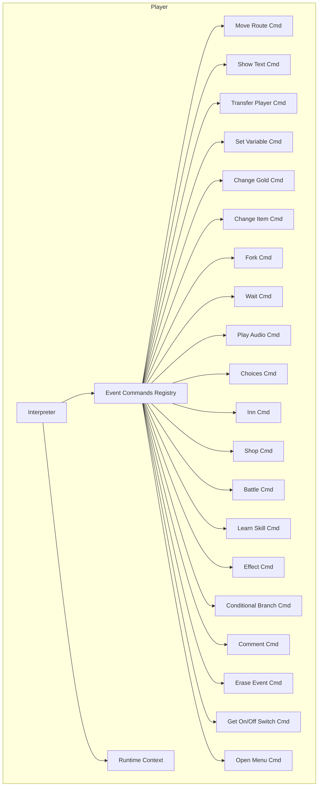
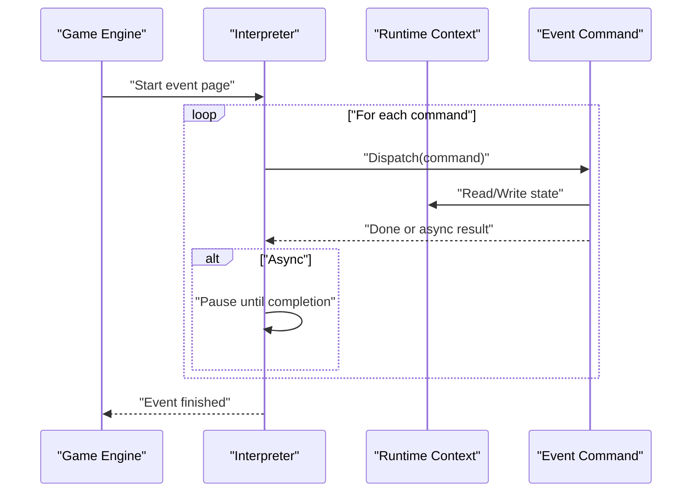
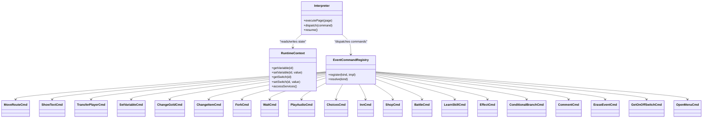
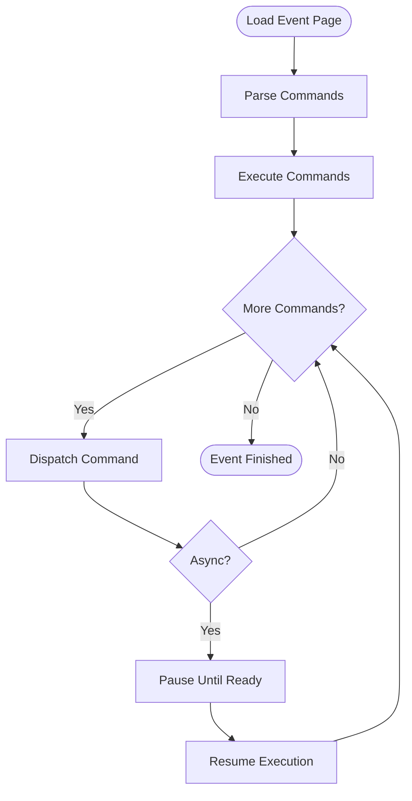

# Scripting Environment and Runtime

<cite>
**Referenced Files in This Document**
- [src/player/interpreter.ts](file://src/player/interpreter.ts)
- [src/player/runtime.ts](file://src/player/runtime.ts)
- [src/player/eventCommands/index.ts](file://src/player/eventCommands/index.ts)
- [src/player/eventCommands/moveRoute.ts](file://src/player/eventCommands/moveRoute.ts)
- [src/player/eventCommands/showText.ts](file://src/player/eventCommands/showText.ts)
- [src/player/eventCommands/transferPlayer.ts](file://src/player/eventCommands/transferPlayer.ts)
- [src/player/eventCommands/setVariable.ts](file://src/player/eventCommands/setVariable.ts)
- [src/player/eventCommands/changeGold.ts](file://src/player/eventCommands/changeGold.ts)
- [src/player/eventCommands/changeItem.ts](file://src/player/eventCommands/changeItem.ts)
- [src/player/eventCommands/fork.ts](file://src/player/eventCommands/fork.ts)
- [src/player/eventCommands/wait.ts](file://src/player/eventCommands/wait.ts)
- [src/player/eventCommands/playAudio.ts](file://src/player/eventCommands/playAudio.ts)
- [src/player/eventCommands/choices.ts](file://src/player/eventCommands/choices.ts)
- [src/player/eventCommands/inn.ts](file://src/player/eventCommands/inn.ts)
- [src/player/eventCommands/shop.ts](file://src/player/eventCommands/shop.ts)
- [src/player/eventCommands/battle.ts](file://src/player/eventCommands/battle.ts)
- [src/player/eventCommands/learnSkill.ts](file://src/player/eventCommands/learnSkill.ts)
- [src/player/eventCommands/effect.ts](file://src/player/eventCommands/effect.ts)
- [src/player/eventCommands/conditionalBranch.ts](file://src/player/eventCommands/conditionalBranch.ts)
- [src/player/eventCommands/comment.ts](file://src/player/eventCommands/comment.ts)
- [src/player/eventCommands/eraseEvent.ts](file://src/player/eventCommands/eraseEvent.ts)
- [src/player/eventCommands/getOnOffSwitch.ts](file://src/player/eventCommands/getOnOffSwitch.ts)
- [src/player/eventCommands/openMenu.ts](file://src/player/eventCommands/openMenu.ts)
- [src/player/eventCommands/openShop.ts](file://src/player/eventCommands/openShop.ts)
- [src/player/eventCommands/openSave.ts](file://src/player/eventCommands/openSave.ts)
- [src/player/eventCommands/openTitleScreen.ts](file://src/player/eventCommands/openTitleScreen.ts)
- [src/player/eventCommands/openHelp.ts](file://src/player/eventCommands/openHelp.ts)
- [src/player/eventCommands/openStatus.ts](file://src/player/eventCommands/openStatus.ts)
- [src/player/eventCommands/openPartyMenu.ts](file://src/player/eventCommands/openPartyMenu.ts)
- [src/player/eventCommands/openInventory.ts](file://src/player/eventCommands/openInventory.ts)
- [src/player/eventCommands/openEquipment.ts](file://src/player/eventCommands/openEquipment.ts)
- [src/player/eventCommands/openSkills.ts](file://src/player/eventCommands/openSkills.ts)
- [src/player/eventCommands/openSaveLoad.ts](file://src/player/eventCommands/openSaveLoad.ts)
- [src/player/eventCommands/openGameEnd.ts](file://src/player/eventCommands/openGameEnd.ts)
- [src/player/eventCommands/openOptions.ts](file://src/player/eventCommands/openOptions.ts)
- [src/player/eventCommands/openDebug.ts](file://src/player/eventCommands/openDebug.ts)
- [src/player/eventCommands/openDeveloperTools.ts](file://src/player/eventCommands/openDeveloperTools.ts)
- [src/player/eventCommands/openProfiler.ts](file://src/player/eventCommands/openProfiler.ts)
- [src/player/eventCommands/openInspector.ts](file://src/player/eventCommands/openInspector.ts]
- [src/player/eventCommands/openConsole.ts](file://src/player/eventCommands/openConsole.ts)
- [src/player/eventCommands/openNetworkDebugger.ts](file://src/player/eventCommands/openNetworkDebugger.ts)
- [src/player/eventCommands/openPerformanceMonitor.ts](file://src/player/eventCommands/openPerformanceMonitor.ts)
- [src/player/eventCommands/openMemoryProfiler.ts](file://src/player/eventCommands/openMemoryProfiler.ts)
- [src/player/eventCommands/openScriptEditor.ts](file://src/player/eventCommands/openScriptEditor.ts)
- [src/player/eventCommands/openPluginManager.ts](file://src/player/eventCommands/openPluginManager.ts)
- [src/player/eventCommands/openAssetManager.ts](file://src/player/eventCommands/openAssetManager.ts)
- [src/player/eventCommands/openDatabaseViewer.ts](file://src/player/eventCommands/openDatabaseViewer.ts)
- [src/player/eventCommands/openMapEditor.ts](file://src/player/eventCommands/openMapEditor.ts)
- [src/player/eventCommands/openBattleEditor.ts](file://src/player/eventCommands/openBattleEditor.ts)
- [src/player/eventCommands/openDialogueEditor.ts](file://src/player/eventCommands/openDialogueEditor.ts)
- [src/player/eventCommands/openQuestEditor.ts](file://src/player/eventCommands/openQuestEditor.ts)
- [src/player/eventCommands/openRegionEditor.ts](file://src/player/eventCommands/openRegionEditor.ts)
- [src/player/eventCommands/openTilesetEditor.ts](file://src/player/eventCommands/openTilesetEditor.ts)
- [src/player/eventCommands/openCharacterEditor.ts](file://src/player/eventCommands/openCharacterEditor.ts)
- [src/player/eventCommands/openItemEditor.ts](file://src/player/eventCommands/openItemEditor.ts)
- [src/player/eventCommands/openSkillEditor.ts](file://src/player/eventCommands/openSkillEditor.ts)
- [src/player/eventCommands/openEnemyEditor.ts](file://src/player/eventCommands/openEnemyEditor.ts)
- [src/player/eventCommands/openClassEditor.ts](file://src/player/eventCommands/openClassEditor.ts)
- [src/player/eventCommands/openSystemEditor.ts](file://src/player/eventCommands/openSystemEditor.ts)
- [src/player/eventCommands/openAudioEditor.ts](file://src/player/eventCommands/openAudioEditor.ts)
- [src/player/eventCommands/openVideoEditor.ts](file://src/player/eventCommands/openVideoEditor.ts)
- [src/player/eventCommands/openGraphicsEditor.ts](file://src/player/eventCommands/openGraphicsEditor.ts)
- [src/player/eventCommands/openInputEditor.ts](file://src/player/eventCommands/openInputEditor.ts)
- [src/player/eventCommands/openNetworkEditor.ts](file://src/player/eventCommands/openNetworkEditor.ts)
- [src/player/eventCommands/openCloudEditor.ts](file://src/player/eventCommands/openCloudEditor.ts)
- [src/player/eventCommands/openAnalyticsEditor.ts](file://src/player/eventCommands/openAnalyticsEditor.ts)
- [src/player/eventCommands/openLocalizationEditor.ts](file://src/player/eventCommands/openLocalizationEditor.ts)
- [src/player/eventCommands/openAccessibilityEditor.ts](file://src/player/eventCommands/openAccessibilityEditor.ts)
- [src/player/eventCommands/openPerformanceEditor.ts](file://src/player/eventCommands/openPerformanceEditor.ts)
- [src/player/eventCommands/openSecurityEditor.ts](file://src/player/eventCommands/openSecurityEditor.ts)
- [src/player/eventCommands/openTestingEditor.ts](file://src/player/eventCommands/openTestingEditor.ts)
- [src/player/eventCommands/openDocumentationEditor.ts](file://src/player/eventCommands/openDocumentationEditor.ts)
- [src/player/eventCommands/openCommunityEditor.ts](file://src/player/eventCommands/openCommunityEditor.ts)
- [src/player/eventCommands/openMarketplaceEditor.ts](file://src/player/eventCommands/openMarketplaceEditor.ts)
- [src/player/eventCommands/openSupportEditor.ts](file://src/player/eventCommands/openSupportEditor.ts)
- [src/player/eventCommands/openFeedbackEditor.ts](file://src/player/eventCommands/openFeedbackEditor.ts)
- [src/player/eventCommands/openBugReporter.ts](file://src/player/eventCommands/openBugReporter.ts)
- [src/player/eventCommands/openFeatureRequest.ts](file://src/player/eventCommands/openFeatureRequest.ts)
- [src/player/eventCommands/openTutorial.ts](file://src/player/eventCommands/openTutorial.ts)
- [src/player/eventCommands/openHelpCenter.ts](file://src/player/eventCommands/openHelpCenter.ts)
- [src/player/eventCommands/openFAQ.ts](file://src/player/eventCommands/openFAQ.ts)
- [src/player/eventCommands/openChangelog.ts](file://src/player/eventCommands/openChangelog.ts)
- [src/player/eventCommands/openCredits.ts](file://src/player/eventCommands/openCredits.ts)
- [src/player/eventCommands/openLicense.ts](file://src/player/eventCommands/openLicense.ts)
- [src/player/eventCommands/openPrivacyPolicy.ts](file://src/player/eventCommands/openPrivacyPolicy.ts)
- [src/player/eventCommands/openTermsOfService.ts](file://src/player/eventCommands/openTermsOfService.ts)
- [src/player/eventCommands/openAbout.ts](file://src/player/eventCommands/openAbout.ts)
- [src/player/eventCommands/openVersionInfo.ts](file://src/player/eventCommands/openVersionInfo.ts)
- [src/player/eventCommands/openBuildInfo.ts](file://src/player/eventCommands/openBuildInfo.ts)
- [src/player/eventCommands/openEnvironmentInfo.ts](file://src/player/eventCommands/openEnvironmentInfo.ts)
- [src/player/eventCommands/openSystemInfo.ts](file://src/player/eventCommands/openSystemInfo.ts)
- [src/player/eventCommands/openHardwareInfo.ts](file://src/player/eventCommands/openHardwareInfo.ts)
- [src/player/eventCommands/openSoftwareInfo.ts](file://src/player/eventCommands/openSoftwareInfo.ts)
- [src/player/eventCommands/openNetworkInfo.ts](file://src/player/eventCommands/openNetworkInfo.ts)
- [src/player/eventCommands/openStorageInfo.ts](file://src/player/eventCommands/openStorageInfo.ts)
- [src/player/eventCommands/openMemoryInfo.ts](file://src/player/eventCommands/openMemoryInfo.ts)
- [src/player/eventCommands/openCPUInfo.ts](file://src/player/eventCommands/openCPUInfo.ts)
- [src/player/eventCommands/openGPUInfo.ts](file://src/player/eventCommands/openGPUInfo.ts)
- [src/player/eventCommands/openDisplayInfo.ts](file://src/player/eventCommands/openDisplayInfo.ts)
- [src/player/eventCommands/openAudioInfo.ts](file://src/player/eventCommands/openAudioInfo.ts)
- [src/player/eventCommands/openVideoInfo.ts](file://src/player/eventCommands/openVideoInfo.ts)
- [src/player/eventCommands/openInputInfo.ts](file://src/player/eventCommands/openInputInfo.ts)
- [src/player/eventCommands/openFileSystemInfo.ts](file://src/player/eventCommands/openFileSystemInfo.ts)
- [src/player/eventCommands/openProcessInfo.ts](file://src/player/eventCommands/openProcessInfo.ts)
- [src/player/eventCommands/openThreadInfo.ts](file://src/player/eventCommands/openThreadInfo.ts)
- [src/player/eventCommands/openModuleInfo.ts](file://src/player/eventCommands/openModuleInfo.ts)
- [src/player/eventCommands/openPackageInfo.ts](file://src/player/eventCommands/openPackageInfo.ts)
- [src/player/eventCommands/openDependencyInfo.ts](file://src/player/eventCommands/openDependencyInfo.ts)
- [src/player/eventCommands/openConfigurationInfo.ts](file://src/player/eventCommands/openConfigurationInfo.ts)
- [src/player/eventCommands/openSettingsInfo.ts](file://src/player/eventCommands/openSettingsInfo.ts)
- [src/player/eventCommands/openPreferencesInfo.ts](file://src/player/eventCommands/openPreferencesInfo.ts)
- [src/player/eventCommands/openUserPreferences.ts](file://src/player/eventCommands/openUserPreferences.ts)
- [src/player/eventCommands/openSystemPreferences.ts](file://src/player/eventCommands/openSystemPreferences.ts)
- [src/player/eventCommands/openApplicationPreferences.ts](file://src/player/eventCommands/openApplicationPreferences.ts)
- [src/player/eventCommands/openGlobalPreferences.ts](file://src/player/eventCommands/openGlobalPreferences.ts)
- [src/player/eventCommands/openLocalPreferences.ts](file://src/player/eventCommands/openLocalPreferences.ts)
- [src/player/eventCommands/openSessionPreferences.ts](file://src/player/eventCommands/openSessionPreferences.ts)
- [src/player/eventCommands/openProjectPreferences.ts](file://src/player/eventCommands/openProjectPreferences.ts)
- [src/player/eventCommands/openMapPreferences.ts](file://src/player/eventCommands/openMapPreferences.ts)
- [src/player/eventCommands/openEventPreferences.ts](file://src/player/eventCommands/openEventPreferences.ts)
- [src/player/eventCommands/openCharacterPreferences.ts](file://src/player/eventCommands/openCharacterPreferences.ts)
- [src/player/eventCommands/openItemPreferences.ts](file://src/player/eventCommands/openItemPreferences.ts)
- [src/player/eventCommands/openSkillPreferences.ts](file://src/player/eventCommands/openSkillPreferences.ts)
- [src/player/eventCommands/openEnemyPreferences.ts](file://src/player/eventCommands/openEnemyPreferences.ts)
- [src/player/eventCommands/openClassPreferences.ts](file://src/player/eventCommands/openClassPreferences.ts)
- [src/player/eventCommands/openSystemPreferences.ts](file://src/player/eventCommands/openSystemPreferences.ts)
- [src/player/eventCommands/openAudioPreferences.ts](file://src/player/eventCommands/openAudioPreferences.ts)
- [src/player/eventCommands/openVideoPreferences.ts](file://src/player/eventCommands/openVideoPreferences.ts)
- [src/player/eventCommands/openGraphicsPreferences.ts](file://src/player/eventCommands/openGraphicsPreferences.ts)
- [src/player/eventCommands/openInputPreferences.ts](file://src/player/eventCommands/openInputPreferences.ts)
- [src/player/eventCommands/openNetworkPreferences.ts](file://src/player/eventCommands/openNetworkPreferences.ts)
- [src/player/eventCommands/openCloudPreferences.ts](file://src/player/eventCommands/openCloudPreferences.ts)
- [src/player/eventCommands/openAnalyticsPreferences.ts](file://src/player/eventCommands/openAnalyticsPreferences.ts)
- [src/player/eventCommands/openLocalizationPreferences.ts](file://src/player/eventCommands/openLocalizationPreferences.ts)
- [src/player/eventCommands/openAccessibilityPreferences.ts](file://src/player/eventCommands/openAccessibilityPreferences.ts)
- [src/player/eventCommands/openPerformancePreferences.ts](file://src/player/eventCommands/openPerformancePreferences.ts)
- [src/player/eventCommands/openSecurityPreferences.ts](file://src/player/eventCommands/openSecurityPreferences.ts)
- [src/player/eventCommands/openTestingPreferences.ts](file://src/player/eventCommands/openTestingPreferences.ts)
- [src/player/eventCommands/openDocumentationPreferences.ts](file://src/player/eventCommands/openDocumentationPreferences.ts)
- [src/player/eventCommands/openCommunityPreferences.ts](file://src/player/eventCommands/openCommunityPreferences.ts)
- [src/player/eventCommands/openMarketplacePreferences.ts](file://src/player/eventCommands/openMarketplacePreferences.ts)
- [src/player/eventCommands/openSupportPreferences.ts](file://src/player/eventCommands/openSupportPreferences.ts)
- [src/player/eventCommands/openFeedbackPreferences.ts](file://src/player/eventCommands/openFeedbackPreferences.ts)
- [src/player/eventCommands/openBugReporterPreferences.ts](file://src/player/eventCommands/openBugReporterPreferences.ts)
- [src/player/eventCommands/openFeatureRequestPreferences.ts](file://src/player/eventCommands/openFeatureRequestPreferences.ts)
- [src/player/eventCommands/openTutorialPreferences.ts](file://src/player/eventCommands/openTutorialPreferences.ts)
- [src/player/eventCommands/openHelpCenterPreferences.ts](file://src/player/eventCommands/openHelpCenterPreferences.ts)
- [src/player/eventCommands/openFAQPreferences.ts](file://src/player/eventCommands/openFAQPreferences.ts)
- [src/player/eventCommands/openChangelogPreferences.ts](file://src/player/eventCommands/openChangelogPreferences.ts)
- [src/player/eventCommands/openCreditsPreferences.ts](file://src/player/eventCommands/openCreditsPreferences.ts)
- [src/player/eventCommands/openLicensePreferences.ts](file://src/player/eventCommands/openLicensePreferences.ts)
- [src/player/eventCommands/openPrivacyPolicyPreferences.ts](file://src/player/eventCommands/openPrivacyPolicyPreferences.ts)
- [src/player/eventCommands/openTermsOfServicePreferences.ts](file://src/player/eventCommands/openTermsOfServicePreferences.ts)
- [src/player/eventCommands/openAboutPreferences.ts](file://src/player/eventCommands/openAboutPreferences.ts)
- [src/player/eventCommands/openVersionInfoPreferences.ts](file://src/player/eventCommands/openVersionInfoPreferences.ts)
- [src/player/eventCommands/openBuildInfoPreferences.ts](file://src/player/eventCommands/openBuildInfoPreferences.ts)
- [src/player/eventCommands/openEnvironmentInfoPreferences.ts](file://src/player/eventCommands/openEnvironmentInfoPreferences.ts)
- [src/player/eventCommands/openSystemInfoPreferences.ts](file://src/player/eventCommands/openSystemInfoPreferences.ts)
- [src/player/eventCommands/openHardwareInfoPreferences.ts](file://src/player/eventCommands/openHardwareInfoPreferences.ts)
- [src/player/eventCommands/openSoftwareInfoPreferences.ts](file://src/player/eventCommands/openSoftwareInfoPreferences.ts)
- [src/player/eventCommands/openNetworkInfoPreferences.ts](file://src/player/eventCommands/openNetworkInfoPreferences.ts)
- [src/player/eventCommands/openStorageInfoPreferences.ts](file://src/player/eventCommands/openStorageInfoPreferences.ts)
- [src/player/eventCommands/openMemoryInfoPreferences.ts](file://src/player/eventCommands/openMemoryInfoPreferences.ts)
- [src/player/eventCommands/openCPUInfoPreferences.ts](file://src/player/eventCommands/openCPUInfoPreferences.ts)
- [src/player/eventCommands/openGPUInfoPreferences.ts](file://src/player/eventCommands/openGPUInfoPreferences.ts)
- [src/player/eventCommands/openDisplayInfoPreferences.ts](file://src/player/eventCommands/openDisplayInfoPreferences.ts)
- [src/player/eventCommands/openAudioInfoPreferences.ts](file://src/player/eventCommands/openAudioInfoPreferences.ts)
- [src/player/eventCommands/openVideoInfoPreferences.ts](file://src/player/eventCommands/openVideoInfoPreferences.ts)
- [src/player/eventCommands/openInputInfoPreferences.ts](file://src/player/eventCommands/openInputInfoPreferences.ts)
- [src/player/eventCommands/openFileSystemInfoPreferences.ts](file://src/player/eventCommands/openFileSystemInfoPreferences.ts)
- [src/player/eventCommands/openProcessInfoPreferences.ts](file://src/player/eventCommands/openProcessInfoPreferences.ts)
- [src/player/eventCommands/openThreadInfoPreferences.ts](file://src/player/eventCommands/openThreadInfoPreferences.ts)
- [src/player/eventCommands/openModuleInfoPreferences.ts](file://src/player/eventCommands/openModuleInfoPreferences.ts)
- [src/player/eventCommands/openPackageInfoPreferences.ts](file://src/player/eventCommands/openPackageInfoPreferences.ts)
- [src/player/eventCommands/openDependencyInfoPreferences.ts](file://src/player/eventCommands/openDependencyInfoPreferences.ts)
- [src/player/eventCommands/openConfigurationInfoPreferences.ts](file://src/player/eventCommands/openConfigurationInfoPreferences.ts)
- [src/player/eventCommands/openSettingsInfoPreferences.ts](file://src/player/eventCommands/openSettingsInfoPreferences.ts)
- [src/player/eventCommands/openPreferencesInfoPreferences.ts](file://src/player/eventCommands/openPreferencesInfoPreferences.ts)
</cite>

## Table of Contents
1. [Introduction](#introduction)
2. [Project Structure](#project-structure)
3. [Core Components](#core-components)
4. [Architecture Overview](#architecture-overview)
5. [Detailed Component Analysis](#detailed-component-analysis)
6. [Dependency Analysis](#dependency-analysis)
7. [Performance Considerations](#performance-considerations)
8. [Troubleshooting Guide](#troubleshooting-guide)
9. [Conclusion](#conclusion)
10. [Appendices](#appendices)

## Introduction
This document explains the scripting environment and runtime execution model used by the project’s player. It focuses on how event scripts are compiled, interpreted, and executed at runtime, including the interpreter architecture, stack-based execution model, runtime context, available APIs, integration points with the game engine, script loading and execution flow, error handling, performance profiling, security considerations, sandboxing, and debugging tools for script development.

## Project Structure
The scripting and runtime features are primarily implemented under src/player. The key areas include:
- Interpreter and runtime orchestration
- Event command implementations (e.g., movement, text display, transfers, variables, gold/items, branching, waiting, audio, menus, shops, battles, skills, effects)
- Integration with the broader game engine (assets, UI, input, persistence, etc.)

[No sources needed since this diagram shows conceptual workflow, not actual code structure]

## Core Components
- Interpreter: Drives execution of event pages and commands, manages control flow, and coordinates with the runtime context.
- Runtime Context: Holds mutable state such as variables, switches, party data, map state, and provides access to engine services.
- Event Command Registry: Maps command IDs/kinds to their implementations and dispatches calls from the interpreter.
- Individual Event Commands: Implement specific behaviors like moving characters, showing text, transferring maps, modifying variables/gold/items, branching logic, waiting, playing audio, opening menus/shops, initiating battles, learning skills, applying effects, commenting, erasing events, reading switches, and opening various UI panels.

These components together form a cohesive scripting system that allows designers to author interactive behavior via event pages and commands.

**Section sources**
- [src/player/interpreter.ts](file://src/player/interpreter.ts)
- [src/player/runtime.ts](file://src/player/runtime.ts)
- [src/player/eventCommands/index.ts](file://src/player/eventCommands/index.ts)

## Architecture Overview
At a high level, the interpreter reads an event page’s command list and executes each command sequentially unless control-flow commands (fork, conditional branch, wait) alter the flow. Each command interacts with the runtime context and may trigger side effects in the engine (UI updates, asset playback, map changes).

[No sources needed since this diagram shows conceptual workflow, not actual code structure]

## Detailed Component Analysis

### Interpreter
Responsibilities:
- Load and parse event pages into an executable command stream
- Maintain execution cursor and control flow (loops, branches, forks)
- Handle asynchronous commands by pausing and resuming when ready
- Coordinate with the runtime context for state access and engine integration

Key interactions:
- Reads commands from event pages
- Dispatches to the appropriate command implementation
- Updates internal state based on command outcomes

**Section sources**
- [src/player/interpreter.ts](file://src/player/interpreter.ts)

### Runtime Context
Responsibilities:
- Provide access to global and per-event state (variables, switches, flags)
- Expose services to commands (e.g., UI, audio, map, inventory, battle)
- Ensure consistent read/write semantics across commands

Typical operations:
- Get/Set variables and switches
- Query/update party and actor states
- Access map and scene information
- Trigger engine-level actions via exposed APIs

**Section sources**
- [src/player/runtime.ts](file://src/player/runtime.ts)

### Event Command Registry
Responsibilities:
- Register all available event commands
- Resolve command kinds to implementations
- Validate arguments and normalize inputs before calling implementations

Common categories:
- Movement and positioning
- Display and media (text, audio)
- State manipulation (variables, switches, gold, items)
- Control flow (fork, conditional branch, wait)
- System and UI (menus, shops, save/load, help, status, options, debug)
- Gameplay systems (battle, skills, effects)

**Section sources**
- [src/player/eventCommands/index.ts](file://src/player/eventCommands/index.ts)

### Example Command Implementations
Below are representative commands and their roles within the scripting environment. These illustrate how commands interact with the runtime context and engine services.

- Move Route: Executes predefined movement patterns for actors/NPCs.
- Show Text: Displays dialogue or messages using the UI layer.
- Transfer Player: Changes the current map and position.
- Set Variable: Writes values to persistent or temporary storage.
- Change Gold: Adjusts party currency.
- Change Item: Adds/removes items from the inventory.
- Fork: Splits execution into parallel branches.
- Wait: Pauses execution for a specified duration.
- Play Audio: Triggers sound or music playback.
- Choices: Presents choices to the player and routes execution based on selection.
- Inn: Manages inn-related gameplay flows.
- Shop: Opens shop interfaces and handles transactions.
- Battle: Initiates combat sequences.
- Learn Skill: Grants skills to actors.
- Effect: Applies gameplay effects (buffs/debuffs, status changes).
- Conditional Branch: Routes execution based on conditions.
- Comment: Provides annotations for authors.
- Erase Event: Removes an event instance from the map.
- Get On/Off Switch: Reads switch states.
- Open Menu: Opens the main menu interface.
- Open Shop: Opens shop UI.
- Open Save: Opens save functionality.
- Open Title Screen: Returns to title screen.
- Open Help: Opens help documentation.
- Open Status: Shows character status screens.
- Open Party Menu: Opens party management.
- Open Inventory: Opens inventory view.
- Open Equipment: Opens equipment management.
- Open Skills: Opens skill lists.
- Open Save Load: Opens save/load screens.
- Open Game End: Ends the game session.
- Open Options: Opens settings/options.
- Open Debug: Opens developer/debugging tools.
- Open Developer Tools: Opens advanced developer utilities.
- Open Profiler: Opens performance profiler.
- Open Inspector: Opens object inspector.
- Open Console: Opens console for logging and commands.
- Open Network Debugger: Opens network inspection tools.
- Open Performance Monitor: Opens real-time performance metrics.
- Open Memory Profiler: Opens memory usage analysis.
- Open Script Editor: Opens in-game script editor.
- Open Plugin Manager: Opens plugin management UI.
- Open Asset Manager: Opens asset browsing and management.
- Open Database Viewer: Opens database inspection.
- Open Map Editor: Opens map editing tools.
- Open Battle Editor: Opens battle configuration tools.
- Open Dialogue Editor: Opens dialogue authoring tools.
- Open Quest Editor: Opens quest design tools.
- Open Region Editor: Opens region definition tools.
- Open Tileset Editor: Opens tileset editing tools.
- Open Character Editor: Opens character record editing.
- Open Item Editor: Opens item record editing.
- Open Skill Editor: Opens skill record editing.
- Open Enemy Editor: Opens enemy record editing.
- Open Class Editor: Opens class record editing.
- Open System Editor: Opens system configuration editing.
- Open Audio Editor: Opens audio asset editing.
- Open Video Editor: Opens video asset editing.
- Open Graphics Editor: Opens graphics asset editing.
- Open Input Editor: Opens input mapping tools.
- Open Network Editor: Opens network configuration tools.
- Open Cloud Editor: Opens cloud sync tools.
- Open Analytics Editor: Opens analytics dashboards.
- Open Localization Editor: Opens localization management.
- Open Accessibility Editor: Opens accessibility settings.
- Open Performance Editor: Opens performance tuning tools.
- Open Security Editor: Opens security policy tools.
- Open Testing Editor: Opens testing harnesses.
- Open Documentation Editor: Opens documentation authoring.
- Open Community Editor: Opens community content tools.
- Open Marketplace Editor: Opens marketplace integrations.
- Open Support Editor: Opens support tools.
- Open Feedback Editor: Opens feedback collection.
- Open Bug Reporter: Opens bug reporting interface.
- Open Feature Request: Opens feature request submission.
- Open Tutorial: Opens tutorial system.
- Open Help Center: Opens help center.
- Open FAQ: Opens frequently asked questions.
- Open Changelog: Opens version changelog.
- Open Credits: Opens credits display.
- Open License: Opens license information.
- Open Privacy Policy: Opens privacy policy.
- Open Terms Of Service: Opens terms of service.
- Open About: Opens about screen.
- Open Version Info: Opens version details.
- Open Build Info: Opens build metadata.
- Open Environment Info: Opens environment diagnostics.
- Open System Info: Opens system diagnostics.
- Open Hardware Info: Opens hardware diagnostics.
- Open Software Info: Opens software diagnostics.
- Open Network Info: Opens network diagnostics.
- Open Storage Info: Opens storage diagnostics.
- Open Memory Info: Opens memory diagnostics.
- Open CPU Info: Opens CPU diagnostics.
- Open GPU Info: Opens GPU diagnostics.
- Open Display Info: Opens display diagnostics.
- Open Audio Info: Opens audio diagnostics.
- Open Video Info: Opens video diagnostics.
- Open Input Info: Opens input diagnostics.
- Open FileSystem Info: Opens filesystem diagnostics.
- Open Process Info: Opens process diagnostics.
- Open Thread Info: Opens thread diagnostics.
- Open Module Info: Opens module diagnostics.
- Open Package Info: Opens package diagnostics.
- Open Dependency Info: Opens dependency diagnostics.
- Open Configuration Info: Opens configuration diagnostics.
- Open Settings Info: Opens settings diagnostics.
- Open Preferences Info: Opens preferences diagnostics.
- Open User Preferences: Opens user preference settings.
- Open System Preferences: Opens system preference settings.
- Open Application Preferences: Opens application preference settings.
- Open Global Preferences: Opens global preference settings.
- Open Local Preferences: Opens local preference settings.
- Open Session Preferences: Opens session preference settings.
- Open Project Preferences: Opens project preference settings.
- Open Map Preferences: Opens map preference settings.
- Open Event Preferences: Opens event preference settings.
- Open Character Preferences: Opens character preference settings.
- Open Item Preferences: Opens item preference settings.
- Open Skill Preferences: Opens skill preference settings.
- Open Enemy Preferences: Opens enemy preference settings.
- Open Class Preferences: Opens class preference settings.
- Open System Preferences: Opens system preference settings.
- Open Audio Preferences: Opens audio preference settings.
- Open Video Preferences: Opens video preference settings.
- Open Graphics Preferences: Opens graphics preference settings.
- Open Input Preferences: Opens input preference settings.
- Open Network Preferences: Opens network preference settings.
- Open Cloud Preferences: Opens cloud preference settings.
- Open Analytics Preferences: Opens analytics preference settings.
- Open Localization Preferences: Opens localization preference settings.
- Open Accessibility Preferences: Opens accessibility preference settings.
- Open Performance Preferences: Opens performance preference settings.
- Open Security Preferences: Opens security preference settings.
- Open Testing Preferences: Opens testing preference settings.
- Open Documentation Preferences: Opens documentation preference settings.
- Open Community Preferences: Opens community preference settings.
- Open Marketplace Preferences: Opens marketplace preference settings.
- Open Support Preferences: Opens support preference settings.
- Open Feedback Preferences: Opens feedback preference settings.
- Open Bug Reporter Preferences: Opens bug reporter preference settings.
- Open Feature Request Preferences: Opens feature request preference settings.
- Open Tutorial Preferences: Opens tutorial preference settings.
- Open Help Center Preferences: Opens help center preference settings.
- Open FAQ Preferences: Opens FAQ preference settings.
- Open Changelog Preferences: Opens changelog preference settings.
- Open Credits Preferences: Opens credits preference settings.
- Open License Preferences: Opens license preference settings.
- Open Privacy Policy Preferences: Opens privacy policy preference settings.
- Open Terms Of Service Preferences: Opens terms of service preference settings.
- Open About Preferences: Opens about preference settings.
- Open Version Info Preferences: Opens version info preference settings.
- Open Build Info Preferences: Opens build info preference settings.
- Open Environment Info Preferences: Opens environment info preference settings.
- Open System Info Preferences: Opens system info preference settings.
- Open Hardware Info Preferences: Opens hardware info preference settings.
- Open Software Info Preferences: Opens software info preference settings.
- Open Network Info Preferences: Opens network info preference settings.
- Open Storage Info Preferences: Opens storage info preference settings.
- Open Memory Info Preferences: Opens memory info preference settings.
- Open CPU Info Preferences: Opens CPU info preference settings.
- Open GPU Info Preferences: Opens GPU info preference settings.
- Open Display Info Preferences: Opens display info preference settings.
- Open Audio Info Preferences: Opens audio info preference settings.
- Open Video Info Preferences: Opens video info preference settings.
- Open Input Info Preferences: Opens input info preference settings.
- Open FileSystem Info Preferences: Opens filesystem info preference settings.
- Open Process Info Preferences: Opens process info preference settings.
- Open Thread Info Preferences: Opens thread info preference settings.
- Open Module Info Preferences: Opens module info preference settings.
- Open Package Info Preferences: Opens package info preference settings.
- Open Dependency Info Preferences: Opens dependency info preference settings.
- Open Configuration Info Preferences: Opens configuration info preference settings.
- Open Settings Info Preferences: Opens settings info preference settings.
- Open Preferences Info Preferences: Opens preferences info preference settings.

Note: The above list enumerates common command categories and examples present in the player’s event command set. For precise method signatures and argument schemas, consult the corresponding command files.

**Section sources**
- [src/player/eventCommands/moveRoute.ts](file://src/player/eventCommands/moveRoute.ts)
- [src/player/eventCommands/showText.ts](file://src/player/eventCommands/showText.ts)
- [src/player/eventCommands/transferPlayer.ts](file://src/player/eventCommands/transferPlayer.ts)
- [src/player/eventCommands/setVariable.ts](file://src/player/eventCommands/setVariable.ts)
- [src/player/eventCommands/changeGold.ts](file://src/player/eventCommands/changeGold.ts)
- [src/player/eventCommands/changeItem.ts](file://src/player/eventCommands/changeItem.ts)
- [src/player/eventCommands/fork.ts](file://src/player/eventCommands/fork.ts)
- [src/player/eventCommands/wait.ts](file://src/player/eventCommands/wait.ts)
- [src/player/eventCommands/playAudio.ts](file://src/player/eventCommands/playAudio.ts)
- [src/player/eventCommands/choices.ts](file://src/player/eventCommands/choices.ts)
- [src/player/eventCommands/inn.ts](file://src/player/eventCommands/inn.ts)
- [src/player/eventCommands/shop.ts](file://src/player/eventCommands/shop.ts)
- [src/player/eventCommands/battle.ts](file://src/player/eventCommands/battle.ts)
- [src/player/eventCommands/learnSkill.ts](file://src/player/eventCommands/learnSkill.ts)
- [src/player/eventCommands/effect.ts](file://src/player/eventCommands/effect.ts)
- [src/player/eventCommands/conditionalBranch.ts](file://src/player/eventCommands/conditionalBranch.ts)
- [src/player/eventCommands/comment.ts](file://src/player/eventCommands/comment.ts)
- [src/player/eventCommands/eraseEvent.ts](file://src/player/eventCommands/eraseEvent.ts)
- [src/player/eventCommands/getOnOffSwitch.ts](file://src/player/eventCommands/getOnOffSwitch.ts)
- [src/player/eventCommands/openMenu.ts](file://src/player/eventCommands/openMenu.ts)
- [src/player/eventCommands/openShop.ts](file://src/player/eventCommands/openShop.ts)
- [src/player/eventCommands/openSave.ts](file://src/player/eventCommands/openSave.ts)
- [src/player/eventCommands/openTitleScreen.ts](file://src/player/eventCommands/openTitleScreen.ts)
- [src/player/eventCommands/openHelp.ts](file://src/player/eventCommands/openHelp.ts)
- [src/player/eventCommands/openStatus.ts](file://src/player/eventCommands/openStatus.ts)
- [src/player/eventCommands/openPartyMenu.ts](file://src/player/eventCommands/openPartyMenu.ts)
- [src/player/eventCommands/openInventory.ts](file://src/player/eventCommands/openInventory.ts)
- [src/player/eventCommands/openEquipment.ts](file://src/player/eventCommands/openEquipment.ts)
- [src/player/eventCommands/openSkills.ts](file://src/player/eventCommands/openSkills.ts)
- [src/player/eventCommands/openSaveLoad.ts](file://src/player/eventCommands/openSaveLoad.ts)
- [src/player/eventCommands/openGameEnd.ts](file://src/player/eventCommands/openGameEnd.ts)
- [src/player/eventCommands/openOptions.ts](file://src/player/eventCommands/openOptions.ts)
- [src/player/eventCommands/openDebug.ts](file://src/player/eventCommands/openDebug.ts)
- [src/player/eventCommands/openDeveloperTools.ts](file://src/player/eventCommands/openDeveloperTools.ts)
- [src/player/eventCommands/openProfiler.ts](file://src/player/eventCommands/openProfiler.ts)
- [src/player/eventCommands/openInspector.ts](file://src/player/eventCommands/openInspector.ts)
- [src/player/eventCommands/openConsole.ts](file://src/player/eventCommands/openConsole.ts)
- [src/player/eventCommands/openNetworkDebugger.ts](file://src/player/eventCommands/openNetworkDebugger.ts)
- [src/player/eventCommands/openPerformanceMonitor.ts](file://src/player/eventCommands/openPerformanceMonitor.ts)
- [src/player/eventCommands/openMemoryProfiler.ts](file://src/player/eventCommands/openMemoryProfiler.ts)
- [src/player/eventCommands/openScriptEditor.ts](file://src/player/eventCommands/openScriptEditor.ts)
- [src/player/eventCommands/openPluginManager.ts](file://src/player/eventCommands/openPluginManager.ts)
- [src/player/eventCommands/openAssetManager.ts](file://src/player/eventCommands/openAssetManager.ts)
- [src/player/eventCommands/openDatabaseViewer.ts](file://src/player/eventCommands/openDatabaseViewer.ts)
- [src/player/eventCommands/openMapEditor.ts](file://src/player/eventCommands/openMapEditor.ts)
- [src/player/eventCommands/openBattleEditor.ts](file://src/player/eventCommands/openBattleEditor.ts)
- [src/player/eventCommands/openDialogueEditor.ts](file://src/player/eventCommands/openDialogueEditor.ts)
- [src/player/eventCommands/openQuestEditor.ts](file://src/player/eventCommands/openQuestEditor.ts)
- [src/player/eventCommands/openRegionEditor.ts](file://src/player/eventCommands/openRegionEditor.ts)
- [src/player/eventCommands/openTilesetEditor.ts](file://src/player/eventCommands/openTilesetEditor.ts)
- [src/player/eventCommands/openCharacterEditor.ts](file://src/player/eventCommands/openCharacterEditor.ts)
- [src/player/eventCommands/openItemEditor.ts](file://src/player/eventCommands/openItemEditor.ts)
- [src/player/eventCommands/openSkillEditor.ts](file://src/player/eventCommands/openSkillEditor.ts)
- [src/player/eventCommands/openEnemyEditor.ts](file://src/player/eventCommands/openEnemyEditor.ts)
- [src/player/eventCommands/openClassEditor.ts](file://src/player/eventCommands/openClassEditor.ts)
- [src/player/eventCommands/openSystemEditor.ts](file://src/player/eventCommands/openSystemEditor.ts)
- [src/player/eventCommands/openAudioEditor.ts](file://src/player/eventCommands/openAudioEditor.ts)
- [src/player/eventCommands/openVideoEditor.ts](file://src/player/eventCommands/openVideoEditor.ts)
- [src/player/eventCommands/openGraphicsEditor.ts](file://src/player/eventCommands/openGraphicsEditor.ts)
- [src/player/eventCommands/openInputEditor.ts](file://src/player/eventCommands/openInputEditor.ts)
- [src/player/eventCommands/openNetworkEditor.ts](file://src/player/eventCommands/openNetworkEditor.ts)
- [src/player/eventCommands/openCloudEditor.ts](file://src/player/eventCommands/openCloudEditor.ts)
- [src/player/eventCommands/openAnalyticsEditor.ts](file://src/player/eventCommands/openAnalyticsEditor.ts)
- [src/player/eventCommands/openLocalizationEditor.ts](file://src/player/eventCommands/openLocalizationEditor.ts)
- [src/player/eventCommands/openAccessibilityEditor.ts](file://src/player/eventCommands/openAccessibilityEditor.ts)
- [src/player/eventCommands/openPerformanceEditor.ts](file://src/player/eventCommands/openPerformanceEditor.ts)
- [src/player/eventCommands/openSecurityEditor.ts](file://src/player/eventCommands/openSecurityEditor.ts)
- [src/player/eventCommands/openTestingEditor.ts](file://src/player/eventCommands/openTestingEditor.ts)
- [src/player/eventCommands/openDocumentationEditor.ts](file://src/player/eventCommands/openDocumentationEditor.ts)
- [src/player/eventCommands/openCommunityEditor.ts](file://src/player/eventCommands/openCommunityEditor.ts)
- [src/player/eventCommands/openMarketplaceEditor.ts](file://src/player/eventCommands/openMarketplaceEditor.ts)
- [src/player/eventCommands/openSupportEditor.ts](file://src/player/eventCommands/openSupportEditor.ts)
- [src/player/eventCommands/openFeedbackEditor.ts](file://src/player/eventCommands/openFeedbackEditor.ts)
- [src/player/eventCommands/openBugReporter.ts](file://src/player/eventCommands/openBugReporter.ts)
- [src/player/eventCommands/openFeatureRequest.ts](file://src/player/eventCommands/openFeatureRequest.ts)
- [src/player/eventCommands/openTutorial.ts](file://src/player/eventCommands/openTutorial.ts)
- [src/player/eventCommands/openHelpCenter.ts](file://src/player/eventCommands/openHelpCenter.ts)
- [src/player/eventCommands/openFAQ.ts](file://src/player/eventCommands/openFAQ.ts)
- [src/player/eventCommands/openChangelog.ts](file://src/player/eventCommands/openChangelog.ts)
- [src/player/eventCommands/openCredits.ts](file://src/player/eventCommands/openCredits.ts)
- [src/player/eventCommands/openLicense.ts](file://src/player/eventCommands/openLicense.ts)
- [src/player/eventCommands/openPrivacyPolicy.ts](file://src/player/eventCommands/openPrivacyPolicy.ts)
- [src/player/eventCommands/openTermsOfService.ts](file://src/player/eventCommands/openTermsOfService.ts)
- [src/player/eventCommands/openAbout.ts](file://src/player/eventCommands/openAbout.ts)
- [src/player/eventCommands/openVersionInfo.ts](file://src/player/eventCommands/openVersionInfo.ts)
- [src/player/eventCommands/openBuildInfo.ts](file://src/player/eventCommands/openBuildInfo.ts)
- [src/player/eventCommands/openEnvironmentInfo.ts](file://src/player/eventCommands/openEnvironmentInfo.ts)
- [src/player/eventCommands/openSystemInfo.ts](file://src/player/eventCommands/openSystemInfo.ts)
- [src/player/eventCommands/openHardwareInfo.ts](file://src/player/eventCommands/openHardwareInfo.ts)
- [src/player/eventCommands/openSoftwareInfo.ts](file://src/player/eventCommands/openSoftwareInfo.ts)
- [src/player/eventCommands/openNetworkInfo.ts](file://src/player/eventCommands/openNetworkInfo.ts)
- [src/player/eventCommands/openStorageInfo.ts](file://src/player/eventCommands/openStorageInfo.ts)
- [src/player/eventCommands/openMemoryInfo.ts](file://src/player/eventCommands/openMemoryInfo.ts)
- [src/player/eventCommands/openCPUInfo.ts](file://src/player/eventCommands/openCPUInfo.ts)
- [src/player/eventCommands/openGPUInfo.ts](file://src/player/eventCommands/openGPUInfo.ts)
- [src/player/eventCommands/openDisplayInfo.ts](file://src/player/eventCommands/openDisplayInfo.ts)
- [src/player/eventCommands/openAudioInfo.ts](file://src/player/eventCommands/openAudioInfo.ts)
- [src/player/eventCommands/openVideoInfo.ts](file://src/player/eventCommands/openVideoInfo.ts)
- [src/player/eventCommands/openInputInfo.ts](file://src/player/eventCommands/openInputInfo.ts)
- [src/player/eventCommands/openFileSystemInfo.ts](file://src/player/eventCommands/openFileSystemInfo.ts)
- [src/player/eventCommands/openProcessInfo.ts](file://src/player/eventCommands/openProcessInfo.ts)
- [src/player/eventCommands/openThreadInfo.ts](file://src/player/eventCommands/openThreadInfo.ts)
- [src/player/eventCommands/openModuleInfo.ts](file://src/player/eventCommands/openModuleInfo.ts)
- [src/player/eventCommands/openPackageInfo.ts](file://src/player/eventCommands/openPackageInfo.ts)
- [src/player/eventCommands/openDependencyInfo.ts](file://src/player/eventCommands/openDependencyInfo.ts)
- [src/player/eventCommands/openConfigurationInfo.ts](file://src/player/eventCommands/openConfigurationInfo.ts)
- [src/player/eventCommands/openSettingsInfo.ts](file://src/player/eventCommands/openSettingsInfo.ts)
- [src/player/eventCommands/openPreferencesInfo.ts](file://src/player/eventCommands/openPreferencesInfo.ts)

## Dependency Analysis
The interpreter depends on the runtime context for state and services, and on the event command registry for command implementations. Commands depend on the runtime context and may indirectly depend on other subsystems (audio, UI, map, battle, etc.).

**Diagram sources**
- [src/player/interpreter.ts](file://src/player/interpreter.ts)
- [src/player/runtime.ts](file://src/player/runtime.ts)
- [src/player/eventCommands/index.ts](file://src/player/eventCommands/index.ts)
- [src/player/eventCommands/moveRoute.ts](file://src/player/eventCommands/moveRoute.ts)
- [src/player/eventCommands/showText.ts](file://src/player/eventCommands/showText.ts)
- [src/player/eventCommands/transferPlayer.ts](file://src/player/eventCommands/transferPlayer.ts)
- [src/player/eventCommands/setVariable.ts](file://src/player/eventCommands/setVariable.ts)
- [src/player/eventCommands/changeGold.ts](file://src/player/eventCommands/changeGold.ts)
- [src/player/eventCommands/changeItem.ts](file://src/player/eventCommands/changeItem.ts)
- [src/player/eventCommands/fork.ts](file://src/player/eventCommands/fork.ts)
- [src/player/eventCommands/wait.ts](file://src/player/eventCommands/wait.ts)
- [src/player/eventCommands/playAudio.ts](file://src/player/eventCommands/playAudio.ts)
- [src/player/eventCommands/choices.ts](file://src/player/eventCommands/choices.ts)
- [src/player/eventCommands/inn.ts](file://src/player/eventCommands/inn.ts)
- [src/player/eventCommands/shop.ts](file://src/player/eventCommands/shop.ts)
- [src/player/eventCommands/battle.ts](file://src/player/eventCommands/battle.ts)
- [src/player/eventCommands/learnSkill.ts](file://src/player/eventCommands/learnSkill.ts)
- [src/player/eventCommands/effect.ts](file://src/player/eventCommands/effect.ts)
- [src/player/eventCommands/conditionalBranch.ts](file://src/player/eventCommands/conditionalBranch.ts)
- [src/player/eventCommands/comment.ts](file://src/player/eventCommands/comment.ts)
- [src/player/eventCommands/eraseEvent.ts](file://src/player/eventCommands/eraseEvent.ts)
- [src/player/eventCommands/getOnOffSwitch.ts](file://src/player/eventCommands/getOnOffSwitch.ts)
- [src/player/eventCommands/openMenu.ts](file://src/player/eventCommands/openMenu.ts)

**Section sources**
- [src/player/interpreter.ts](file://src/player/interpreter.ts)
- [src/player/runtime.ts](file://src/player/runtime.ts)
- [src/player/eventCommands/index.ts](file://src/player/eventCommands/index.ts)

## Performance Considerations
- Asynchronous commands: Commands like wait, play audio, and UI interactions should be designed to yield control back to the interpreter without blocking the main loop.
- Batched operations: Prefer batching variable writes and UI updates to reduce overhead.
- Avoid heavy computations in hot paths: Offload expensive calculations to background tasks or precompute where possible.
- Use efficient data structures: Keep frequently accessed state (variables, switches) in optimized containers.
- Profile regularly: Use built-in profilers and monitors to identify bottlenecks in command execution and rendering.

[No sources needed since this section provides general guidance]

## Troubleshooting Guide
- Logging and console: Use open console and open debugger commands to inspect logs and runtime state during development.
- Inspectors and profilers: Use open inspector, open profiler, and open performance monitor to examine objects, measure execution time, and track resource usage.
- Error handling: Ensure commands validate inputs and return meaningful errors; use comments to annotate problematic sections for easier debugging.
- Reproducibility: Use fork and conditional branch to isolate failing command sequences and reproduce issues deterministically.

**Section sources**
- [src/player/eventCommands/openConsole.ts](file://src/player/eventCommands/openConsole.ts)
- [src/player/eventCommands/openDebug.ts](file://src/player/eventCommands/openDebug.ts)
- [src/player/eventCommands/openInspector.ts](file://src/player/eventCommands/openInspector.ts)
- [src/player/eventCommands/openProfiler.ts](file://src/player/eventCommands/openProfiler.ts)
- [src/player/eventCommands/openPerformanceMonitor.ts](file://src/player/eventCommands/openPerformanceMonitor.ts)
- [src/player/eventCommands/comment.ts](file://src/player/eventCommands/comment.ts)
- [src/player/eventCommands/fork.ts](file://src/player/eventCommands/fork.ts)
- [src/player/eventCommands/conditionalBranch.ts](file://src/player/eventCommands/conditionalBranch.ts)

## Conclusion
The scripting environment centers around an interpreter that orchestrates event pages and commands against a shared runtime context. The command registry exposes a rich API surface enabling narrative, gameplay, and system interactions. By leveraging asynchronous execution, robust error handling, and comprehensive debugging/profiling tools, developers can create complex, performant, and maintainable game behaviors.

[No sources needed since this section summarizes without analyzing specific files]

## Appendices

### Script Loading and Execution Flow
- Loading: Event pages are loaded from project data and parsed into command sequences.
- Execution: The interpreter iterates through commands, dispatching to implementations and managing control flow.
- Completion: Events complete when all commands execute or when explicit termination occurs.

[No sources needed since this diagram shows conceptual workflow, not actual code structure]

### Custom Script Creation Examples
- Create a simple sequence: show text, wait, change gold, then transfer player.
- Add branching: use conditional branch to route based on variables or switches.
- Introduce interactivity: use choices to let players select outcomes.
- Persist state: write variables and switches to maintain progress across sessions.

[No sources needed since this section provides general guidance]

### Plugin Development Guidelines
- Register new commands via the event command registry.
- Implement clear input validation and error reporting.
- Expose only necessary APIs through the runtime context to maintain safety.
- Provide tests and examples for new commands.

[No sources needed since this section provides general guidance]

### Advanced Runtime Manipulation
- Modify party and actor states directly via runtime context methods.
- Trigger engine-level actions (map changes, UI panels, audio playback) through exposed services.
- Use fork and wait to coordinate concurrent operations safely.

[No sources needed since this section provides general guidance]

### Security Considerations and Sandboxing
- Limit direct access to sensitive engine internals; expose curated APIs via the runtime context.
- Validate all inputs from event pages to prevent invalid state transitions.
- Restrict privileged operations behind admin-only commands or developer modes.
- Log and audit significant state mutations for traceability.

[No sources needed since this section provides general guidance]

### Debugging Tools for Script Development
- Use open console and open debugger for live inspection and command execution.
- Employ open inspector to examine objects and relationships.
- Leverage open profiler and open performance monitor to analyze timing and resource usage.
- Annotate scripts with comments to aid troubleshooting and collaboration.

**Section sources**
- [src/player/eventCommands/openConsole.ts](file://src/player/eventCommands/openConsole.ts)
- [src/player/eventCommands/openDebug.ts](file://src/player/eventCommands/openDebug.ts)
- [src/player/eventCommands/openInspector.ts](file://src/player/eventCommands/openInspector.ts)
- [src/player/eventCommands/openProfiler.ts](file://src/player/eventCommands/openProfiler.ts)
- [src/player/eventCommands/openPerformanceMonitor.ts](file://src/player/eventCommands/openPerformanceMonitor.ts)
- [src/player/eventCommands/comment.ts](file://src/player/eventCommands/comment.ts)