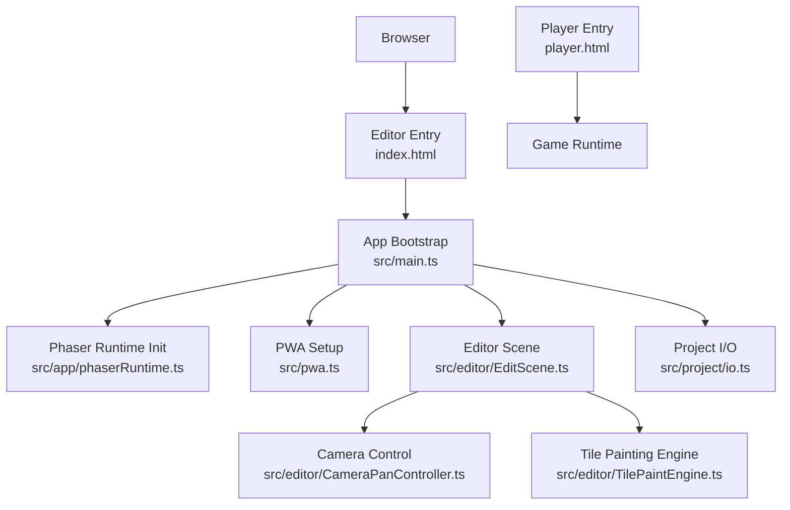
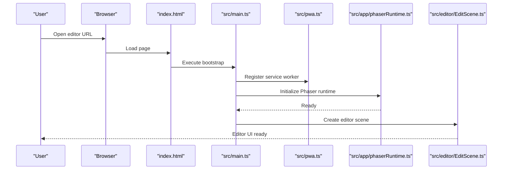
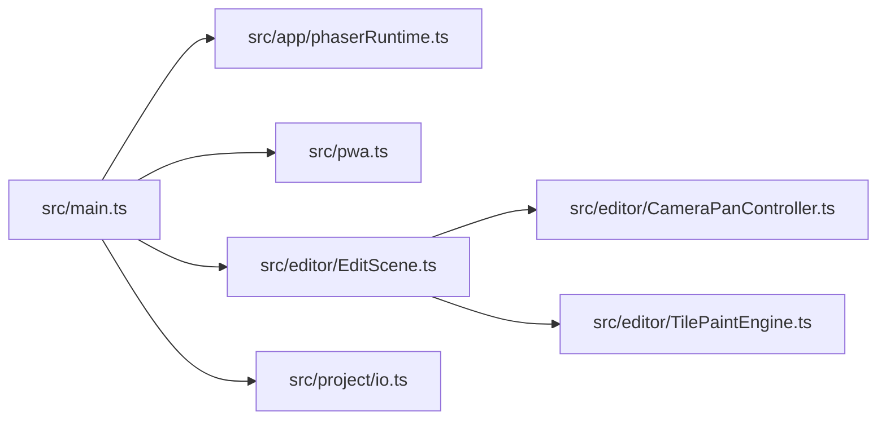

# Getting Started

<cite>
**Referenced Files in This Document**
- [README.md](file://README.md)
- [package.json](file://package.json)
- [index.html](file://index.html)
- [player.html](file://player.html)
- [vite.config.ts](file://vite.config.ts)
- [openwiki/quickstart.md](file://openwiki/quickstart.md)
- [openwiki/editor-workflows.md](file://openwiki/editor-workflows.md)
- [src/main.ts](file://src/main.ts)
- [src/pwa.ts](file://src/pwa.ts)
- [src/app/phaserRuntime.ts](file://src/app/phaserRuntime.ts)
- [src/editor/EditScene.ts](file://src/editor/EditScene.ts)
- [src/editor/CameraPanController.ts](file://src/editor/CameraPanController.ts)
- [src/editor/TilePaintEngine.ts](file://src/editor/TilePaintEngine.ts)
- [src/project/io.ts](file://src/project/io.ts)
- [scripts/_start-dev-hard.ps1](file://scripts/_start-dev-hard.ps1)
</cite>

## Table of Contents
1. [Introduction](#introduction)
2. [Project Structure](#project-structure)
3. [Core Components](#core-components)
4. [Architecture Overview](#architecture-overview)
5. [Detailed Component Analysis](#detailed-component-analysis)
6. [Dependency Analysis](#dependency-analysis)
7. [Performance Considerations](#performance-considerations)
8. [Troubleshooting Guide](#troubleshooting-guide)
9. [Conclusion](#conclusion)
10. [Appendices](#appendices)

## Introduction
RPG Maker Zzu is a modern, browser-based RPG development platform designed as a contemporary alternative to traditional desktop RPG Maker tools. It emphasizes:
- AI-assisted development for faster authoring and iteration
- Real-time collaboration features for team workflows
- Complete compatibility with RPG Maker 2003/2000 projects and assets

This guide helps you set up the environment, create your first project, build a simple map, add characters, and test gameplay directly in the browser.

## Project Structure
At a high level, the repository contains:
- Web application entry points for the editor and player
- Editor subsystems (scene management, camera, tile painting)
- Project I/O and persistence utilities
- Build configuration for development and production
- Documentation and quickstart references

**Diagram sources**
- [index.html](file://index.html)
- [player.html](file://player.html)
- [src/main.ts](file://src/main.ts)
- [src/pwa.ts](file://src/pwa.ts)
- [src/app/phaserRuntime.ts](file://src/app/phaserRuntime.ts)
- [src/editor/EditScene.ts](file://src/editor/EditScene.ts)
- [src/editor/CameraPanController.ts](file://src/editor/CameraPanController.ts)
- [src/editor/TilePaintEngine.ts](file://src/editor/TilePaintEngine.ts)
- [src/project/io.ts](file://src/project/io.ts)

**Section sources**
- [README.md](file://README.md)
- [package.json](file://package.json)
- [index.html](file://index.html)
- [player.html](file://player.html)
- [vite.config.ts](file://vite.config.ts)
- [openwiki/quickstart.md](file://openwiki/quickstart.md)
- [openwiki/editor-workflows.md](file://openwiki/editor-workflows.md)
- [src/main.ts](file://src/main.ts)
- [src/pwa.ts](file://src/pwa.ts)
- [src/app/phaserRuntime.ts](file://src/app/phaserRuntime.ts)
- [src/editor/EditScene.ts](file://src/editor/EditScene.ts)
- [src/editor/CameraPanController.ts](file://src/editor/CameraPanController.ts)
- [src/editor/TilePaintEngine.ts](file://src/editor/TilePaintEngine.ts)
- [src/project/io.ts](file://src/project/io.ts)

## Core Components
- Editor bootstrap and runtime initialization
  - The main entry initializes the application shell, registers PWA capabilities, and starts the Phaser-based game loop used by the editor.
- Editor scene and interaction
  - The editor scene manages the viewport, selection, and tool integration. Camera panning and zoom are handled separately for smooth navigation.
- Tile painting engine
  - Provides brush operations, layer-aware painting, and undo/redo integration for rapid map creation.
- Project I/O
  - Handles loading, saving, and migration of project data, including RM2K/RM2K3 compatibility layers.

Practical implications for beginners:
- Use the editor scene to navigate maps and place tiles efficiently.
- Rely on the tile painting engine for fast terrain work.
- Save frequently; project I/O supports incremental saves and recovery.

**Section sources**
- [src/main.ts](file://src/main.ts)
- [src/pwa.ts](file://src/pwa.ts)
- [src/app/phaserRuntime.ts](file://src/app/phaserRuntime.ts)
- [src/editor/EditScene.ts](file://src/editor/EditScene.ts)
- [src/editor/CameraPanController.ts](file://src/editor/CameraPanController.ts)
- [src/editor/TilePaintEngine.ts](file://src/editor/TilePaintEngine.ts)
- [src/project/io.ts](file://src/project/io.ts)

## Architecture Overview
The editor runs as a web app powered by Phaser. The boot sequence wires the UI shell, PWA service worker, and the editor scene. The player entry point loads the compiled game for testing.

**Diagram sources**
- [index.html](file://index.html)
- [src/main.ts](file://src/main.ts)
- [src/pwa.ts](file://src/pwa.ts)
- [src/app/phaserRuntime.ts](file://src/app/phaserRuntime.ts)
- [src/editor/EditScene.ts](file://src/editor/EditScene.ts)

## Detailed Component Analysis

### Installation and Environment Setup
- Prerequisites
  - Node.js (LTS recommended)
  - pnpm package manager
- Install dependencies
  - Run the package manager install command from the repository root.
- Start the development server
  - Use the provided script or the standard dev command configured by the build system.
  - For Windows PowerShell convenience, a helper script is available.
- Verify installation
  - Open the local development URL shown by the dev server. You should see the editor interface.

Notes:
- The build configuration defines development and production modes.
- The README provides additional setup context and links to quickstart documentation.

**Section sources**
- [package.json](file://package.json)
- [vite.config.ts](file://vite.config.ts)
- [scripts/_start-dev-hard.ps1](file://scripts/_start-dev-hard.ps1)
- [README.md](file://README.md)
- [openwiki/quickstart.md](file://openwiki/quickstart.md)

### Creating Your First Project
- From the editor welcome screen, choose “New Project.”
- Select a genre preset if desired (e.g., Adventure).
- Confirm creation; the editor will scaffold default database entries and a starter map.
- Save the project immediately to ensure persistence.

Tips:
- If using cloud sync or remote storage, follow the prompts to connect your account after project creation.

**Section sources**
- [openwiki/quickstart.md](file://openwiki/quickstart.md)
- [src/project/io.ts](file://src/project/io.ts)

### Building Your First Map
- Open the map editor and select a tileset compatible with RM2K/RM2K3.
- Use the tile palette to paint terrain on the ground layer.
- Add walls and props on upper layers for depth.
- Place event markers for interactions (e.g., NPCs, doors).

Navigation patterns:
- Pan: middle mouse button or right-click drag
- Zoom: scroll wheel or toolbar controls
- Selection: left-click to pick tiles/events

**Section sources**
- [src/editor/EditScene.ts](file://src/editor/EditScene.ts)
- [src/editor/CameraPanController.ts](file://src/editor/CameraPanController.ts)
- [src/editor/TilePaintEngine.ts](file://src/editor/TilePaintEngine.ts)
- [openwiki/editor-workflows.md](file://openwiki/editor-workflows.md)

### Adding Characters (NPCs)
- Open the character database and create or import a sprite.
- On the map, place an NPC event and assign the character graphic.
- Configure basic movement and dialogue via the event editor.
- Test placement by running the game in the editor’s play mode.

Best practices:
- Keep character IDs consistent across events and databases.
- Use presets for common behaviors (shopkeeper, quest giver).

**Section sources**
- [openwiki/editor-workflows.md](file://openwiki/editor-workflows.md)
- [src/editor/EditScene.ts](file://src/editor/EditScene.ts)

### Testing Gameplay
- Launch the player from the editor to run your current project.
- Verify map transitions, NPC interactions, and tile collisions.
- Use the inspector to debug events and variables during play.

Exporting:
- Build the project for web deployment when ready.
- The player entry point loads the compiled game assets and logic.

**Section sources**
- [player.html](file://player.html)
- [openwiki/quickstart.md](file://openwiki/quickstart.md)

## Dependency Analysis
Key relationships between core modules:
- The main entry initializes the runtime and editor scene.
- The editor scene depends on camera control and tile painting engines.
- Project I/O is used throughout the editor for save/load operations.

**Diagram sources**
- [src/main.ts](file://src/main.ts)
- [src/pwa.ts](file://src/pwa.ts)
- [src/app/phaserRuntime.ts](file://src/app/phaserRuntime.ts)
- [src/editor/EditScene.ts](file://src/editor/EditScene.ts)
- [src/editor/CameraPanController.ts](file://src/editor/CameraPanController.ts)
- [src/editor/TilePaintEngine.ts](file://src/editor/TilePaintEngine.ts)
- [src/project/io.ts](file://src/project/io.ts)

**Section sources**
- [src/main.ts](file://src/main.ts)
- [src/pwa.ts](file://src/pwa.ts)
- [src/app/phaserRuntime.ts](file://src/app/phaserRuntime.ts)
- [src/editor/EditScene.ts](file://src/editor/EditScene.ts)
- [src/editor/CameraPanController.ts](file://src/editor/CameraPanController.ts)
- [src/editor/TilePaintEngine.ts](file://src/editor/TilePaintEngine.ts)
- [src/project/io.ts](file://src/project/io.ts)

## Performance Considerations
- Prefer efficient tilesets and avoid excessive transparency to reduce rendering overhead.
- Batch similar events and reuse graphics where possible.
- Use the editor’s performance metrics panel to identify bottlenecks during authoring.
- Keep asset sizes reasonable; leverage compression and atlasing where supported.

[No sources needed since this section provides general guidance]

## Troubleshooting Guide
Common issues and resolutions:
- Development server fails to start
  - Ensure Node.js and pnpm are installed and up-to-date.
  - Clear node_modules and reinstall dependencies if corrupted.
  - Check port conflicts; change the dev server port if necessary.
- Assets not loading in the editor
  - Verify file paths and asset formats.
  - Rebuild generated assets if required by your workflow.
- Save/load errors
  - Check project permissions and disk space.
  - Use the latest version to benefit from migration fixes.
- Player does not launch
  - Confirm the build completed successfully.
  - Open the player entry page directly and check the console for errors.

If problems persist, consult the quickstart and editor workflows guides for step-by-step checks.

**Section sources**
- [openwiki/quickstart.md](file://openwiki/quickstart.md)
- [openwiki/editor-workflows.md](file://openwiki/editor-workflows.md)
- [src/project/io.ts](file://src/project/io.ts)

## Conclusion
You now have the essentials to begin creating RPGs with RPG Maker Zzu:
- Set up the environment with Node.js and pnpm
- Create a new project and build your first map
- Add characters and test gameplay in the browser
- Leverage AI assistance and collaboration features as you iterate

Explore the editor workflows and quickstart docs for deeper tutorials and advanced techniques.

[No sources needed since this section summarizes without analyzing specific files]

## Appendices

### Quick Reference: Commands and URLs
- Install dependencies: use pnpm at the repository root
- Start development server: use the provided script or the dev command
- Open editor: navigate to the local URL printed by the dev server
- Open player: open the player entry page to test your build

**Section sources**
- [package.json](file://package.json)
- [scripts/_start-dev-hard.ps1](file://scripts/_start-dev-hard.ps1)
- [index.html](file://index.html)
- [player.html](file://player.html)