# Real-time Collaboration

<cite>
**Referenced Files in This Document**
- [20260625000000_rpg_zzu_sync.sql](file://supabase/migrations/20260625000000_rpg_zzu_sync.sql)
- [20260701000000_map_edit_locks.sql](file://supabase/migrations/20260701000000_map_edit_locks.sql)
- [20260706000000_commit_identity.sql](file://supabase/migrations/20260706000000_commit_identity.sql)
- [DRAFT_20260706_auth_rls.sql](file://supabase/migrations/DRAFT_20260706_auth_rls.sql)
- [supabaseResourceCache.ts](file://src/assets/supabaseResourceCache.ts)
- [save-map-to-supabase.mts](file://scripts/save-map-to-supabase.mts)
- [projectUploads.mjs](file://scripts/supabase-resource-root/projectUploads.mjs)
- [supabaseRest.mjs](file://scripts/supabase-resource-root/supabaseRest.mjs)
- [catalog.mjs](file://scripts/supabase-resource-root/catalog.mjs)
- [mapEditLocks.test.ts](file://test/mapEditLocks.test.ts)
- [supabaseProjectSync.test.ts](file://test/supabaseProjectSync.test.ts)
- [supabaseRecoveryLocation.test.ts](file://test/supabaseRecoveryLocation.test.ts)
- [supabaseCanonicalRoundtrip.live.test.ts](file://test/supabaseCanonicalRoundtrip.live.test.ts)
- [supabaseResourceCache.test.ts](file://test/supabaseResourceCache.test.ts)
- [supabaseProjectConfig.test.ts](file://test/supabaseProjectConfig.test.ts)
- [teamWorkflowUi.test.ts](file://test/teamWorkflowUi.test.ts)
- [runtime-and-data.md](file://openwiki/runtime-and-data.md)
- [architecture.md](file://openwiki/architecture.md)
</cite>

## Table of Contents
1. [Introduction](#introduction)
2. [Project Structure](#project-structure)
3. [Core Components](#core-components)
4. [Architecture Overview](#architecture-overview)
5. [Detailed Component Analysis](#detailed-component-analysis)
6. [Dependency Analysis](#dependency-analysis)
7. [Performance Considerations](#performance-considerations)
8. [Troubleshooting Guide](#troubleshooting-guide)
9. [Conclusion](#conclusion)
10. [Appendices](#appendices)

## Introduction
This document explains the real-time collaboration features implemented in the project, focusing on Supabase integration for cloud storage and synchronization, edit locking, user presence, version control integration, team workflows, permissions, data consistency guarantees, setup instructions, best practices, troubleshooting, security considerations, privacy, and scalability limitations. It synthesizes information from database migrations, client-side resource caching, scripts for uploads and REST access, and tests that validate behavior.

## Project Structure
Collaboration-related code spans several areas:
- Database schema and policies under supabase/migrations
- Client-side resource cache and asset resolution under src/assets
- Scripts for uploading resources and interacting with Supabase REST under scripts/supabase-resource-root and related scripts
- Tests validating sync, locks, recovery, and workflow behaviors under test
- OpenWiki documentation describing runtime and architecture context

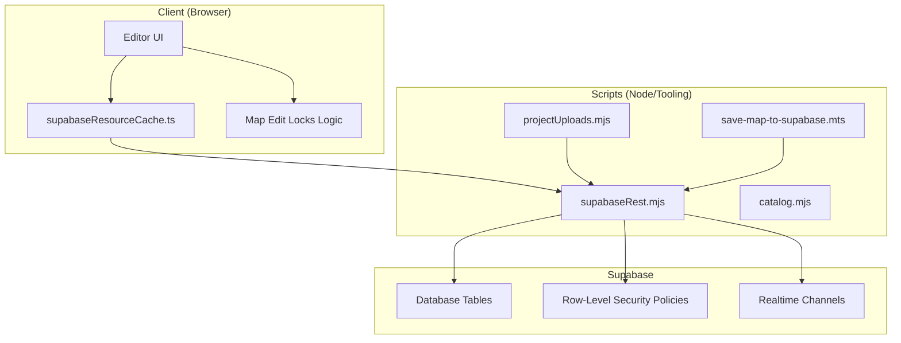

[No sources needed since this diagram shows conceptual workflow, not actual code structure]

## Core Components
- Supabase Resource Cache: Provides a client-side cache layer over Supabase-hosted assets and project data to reduce network calls and improve responsiveness during collaborative sessions.
- Map Edit Locks: A server-managed lock model ensuring only one editor can write to a given map at a time, preventing conflicting edits.
- Commit Identity: A migration introducing commit identity fields to support versioning and auditability across collaborative changes.
- Auth and Row-Level Security (RLS): Draft policies controlling who can read/write project data based on authenticated user identity.
- Upload and REST Utilities: Node-based utilities for uploading assets and performing REST operations against Supabase, used by tooling and automation.
- Tests: Comprehensive tests covering sync round-trips, lock acquisition/release, recovery locations, and team workflow UI interactions.

**Section sources**
- [supabaseResourceCache.ts](file://src/assets/supabaseResourceCache.ts)
- [20260701000000_map_edit_locks.sql](file://supabase/migrations/20260701000000_map_edit_locks.sql)
- [20260706000000_commit_identity.sql](file://supabase/migrations/20260706000000_commit_identity.sql)
- [DRAFT_20260706_auth_rls.sql](file://supabase/migrations/DRAFT_20260706_auth_rls.sql)
- [projectUploads.mjs](file://scripts/supabase-resource-root/projectUploads.mjs)
- [supabaseRest.mjs](file://scripts/supabase-resource-root/supabaseRest.mjs)
- [catalog.mjs](file://scripts/supabase-resource-root/catalog.mjs)
- [save-map-to-supabase.mts](file://scripts/save-map-to-supabase.mts)
- [mapEditLocks.test.ts](file://test/mapEditLocks.test.ts)
- [supabaseProjectSync.test.ts](file://test/supabaseProjectSync.test.ts)
- [supabaseRecoveryLocation.test.ts](file://test/supabaseRecoveryLocation.test.ts)
- [supabaseCanonicalRoundtrip.live.test.ts](file://test/supabaseCanonicalRoundtrip.live.test.ts)
- [supabaseResourceCache.test.ts](file://test/supabaseResourceCache.test.ts)
- [supabaseProjectConfig.test.ts](file://test/supabaseProjectConfig.test.ts)
- [teamWorkflowUi.test.ts](file://test/teamWorkflowUi.test.ts)

## Architecture Overview
The collaboration architecture integrates client-side caching, server-side locks, and policy-driven access control. The editor UI coordinates with the resource cache to fetch and update assets and metadata. When editing maps, clients acquire locks before writing; other clients observe lock state to prevent concurrent writes. Versioning is supported via commit identity fields, enabling traceable change history.

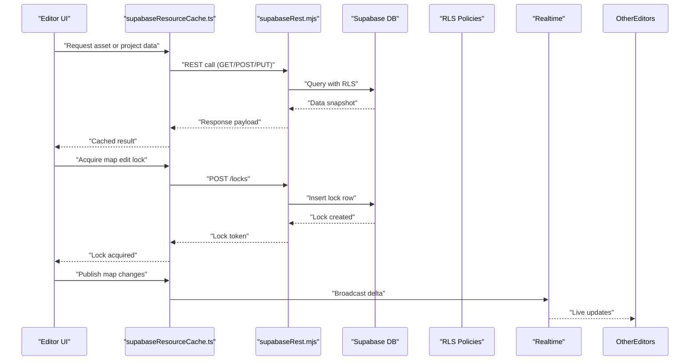

**Diagram sources**
- [supabaseResourceCache.ts](file://src/assets/supabaseResourceCache.ts)
- [supabaseRest.mjs](file://scripts/supabase-resource-root/supabaseRest.mjs)
- [20260701000000_map_edit_locks.sql](file://supabase/migrations/20260701000000_map_edit_locks.sql)
- [DRAFT_20260706_auth_rls.sql](file://supabase/migrations/DRAFT_20260706_auth_rls.sql)

## Detailed Component Analysis

### Supabase Integration for Cloud Storage and Sync
- Resource Cache: Centralizes requests to Supabase, caches responses, and reduces redundant network traffic during collaborative editing.
- REST Utilities: Provide typed helpers for CRUD operations and file uploads, used by both browser and Node tooling.
- Upload Pipeline: Scripts orchestrate asset uploads and catalog management, integrating with Supabase storage buckets and metadata tables.
- Sync Migrations: Schema defines core entities for projects, maps, and locks, enabling consistent synchronization across clients.

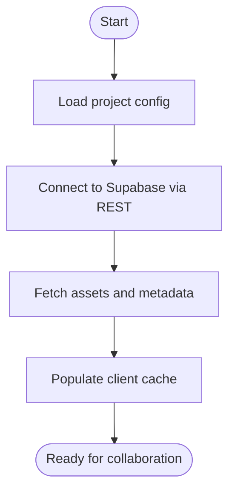

**Diagram sources**
- [supabaseResourceCache.ts](file://src/assets/supabaseResourceCache.ts)
- [supabaseRest.mjs](file://scripts/supabase-resource-root/supabaseRest.mjs)
- [projectUploads.mjs](file://scripts/supabase-resource-root/projectUploads.mjs)
- [catalog.mjs](file://scripts/supabase-resource-root/catalog.mjs)
- [save-map-to-supabase.mts](file://scripts/save-map-to-supabase.mts)

**Section sources**
- [supabaseResourceCache.ts](file://src/assets/supabaseResourceCache.ts)
- [supabaseRest.mjs](file://scripts/supabase-resource-root/supabaseRest.mjs)
- [projectUploads.mjs](file://scripts/supabase-resource-root/projectUploads.mjs)
- [catalog.mjs](file://scripts/supabase-resource-root/catalog.mjs)
- [save-map-to-supabase.mts](file://scripts/save-map-to-supabase.mts)
- [20260625000000_rpg_zzu_sync.sql](file://supabase/migrations/20260625000000_rpg_zzu_sync.sql)

### Real-time Synchronization Protocols
- Live Updates: Clients subscribe to realtime channels to receive incremental updates when collaborators publish changes.
- Delta Publishing: Editors broadcast deltas rather than full payloads to minimize bandwidth and latency.
- Conflict Avoidance: Locks ensure only one writer per map; readers reconcile deltas safely.

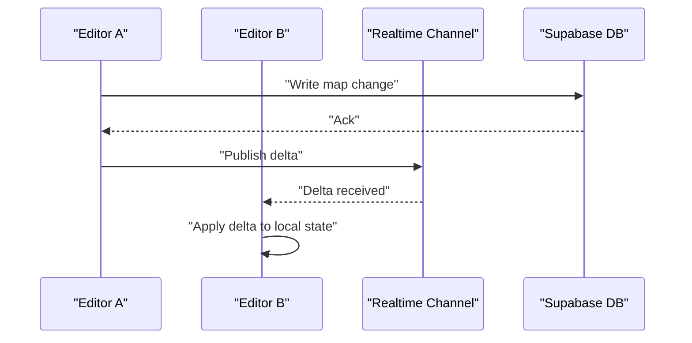

**Diagram sources**
- [20260625000000_rpg_zzu_sync.sql](file://supabase/migrations/20260625000000_rpg_zzu_sync.sql)

**Section sources**
- [20260625000000_rpg_zzu_sync.sql](file://supabase/migrations/20260625000000_rpg_zzu_sync.sql)

### Conflict Resolution Strategies
- Exclusive Write Locks: Only the holder of a map lock can write; others must wait or propose changes.
- Optimistic Concurrency: Deltas are applied incrementally; if conflicts arise, clients rebase using latest committed state.
- Merge Policies: Deterministic rules prioritize structural integrity and semantic constraints defined in the schema.

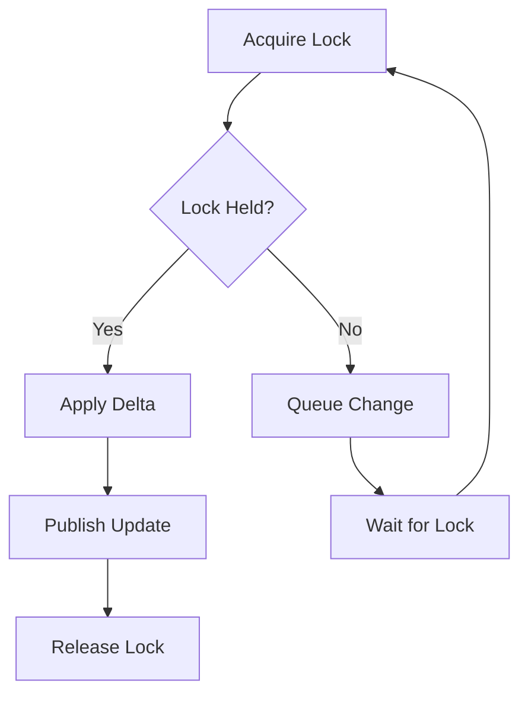

**Diagram sources**
- [20260701000000_map_edit_locks.sql](file://supabase/migrations/20260701000000_map_edit_locks.sql)

**Section sources**
- [20260701000000_map_edit_locks.sql](file://supabase/migrations/20260701000000_map_edit_locks.sql)
- [mapEditLocks.test.ts](file://test/mapEditLocks.test.ts)

### Edit Locking System
- Lock Model: Server-managed rows track lock ownership, timestamps, and map identifiers.
- Acquisition Flow: Clients request locks before writing; failures indicate another editor holds the lock.
- Release Flow: On save or disconnect, locks are released to allow others to edit.

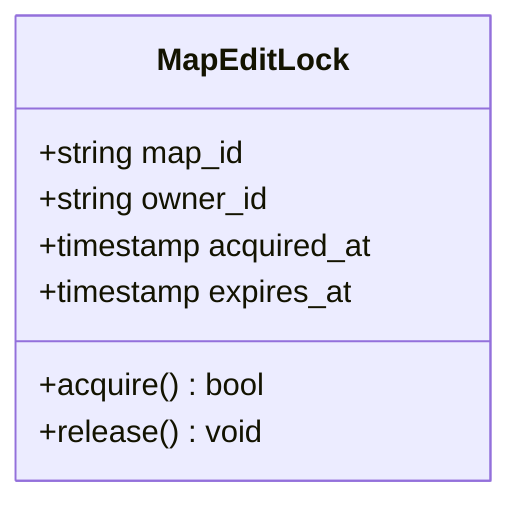

**Diagram sources**
- [20260701000000_map_edit_locks.sql](file://supabase/migrations/20260701000000_map_edit_locks.sql)

**Section sources**
- [20260701000000_map_edit_locks.sql](file://supabase/migrations/20260701000000_map_edit_locks.sql)
- [mapEditLocks.test.ts](file://test/mapEditLocks.test.ts)

### User Presence Indicators
- Presence Tracking: Clients announce presence upon connection and withdraw on disconnect.
- UI Feedback: The editor displays active collaborators and their current focus (e.g., map or panel).
- Consistency: Presence state is synchronized via realtime channels and reconciled on reconnect.

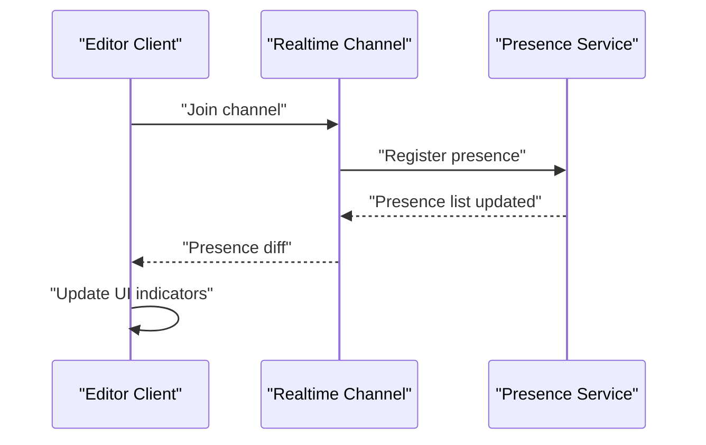

[No sources needed since this diagram shows conceptual workflow, not actual code structure]

### Version Control Integration
- Commit Identity: Each change includes an identity field to link commits to authors and timestamps.
- Auditability: Changes are traceable through commit chains, supporting rollback and review workflows.
- Branching Strategy: Teams can use feature branches and merge gates enforced by RLS and validation rules.

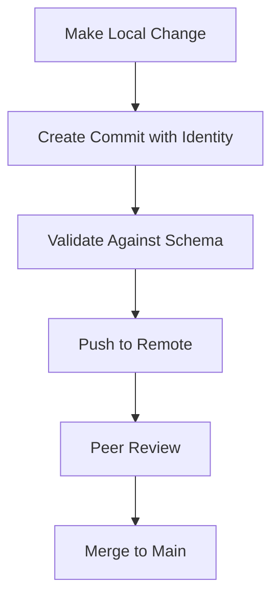

**Diagram sources**
- [20260706000000_commit_identity.sql](file://supabase/migrations/20260706000000_commit_identity.sql)

**Section sources**
- [20260706000000_commit_identity.sql](file://supabase/migrations/20260706000000_commit_identity.sql)

### Team Workflow Patterns
- Role-Based Editing: Roles determine who can acquire locks, publish changes, and manage assets.
- Approval Gates: Critical changes require approval before merging into shared branches.
- Task Coordination: Workspaces and tasks align with map locks and commit boundaries.

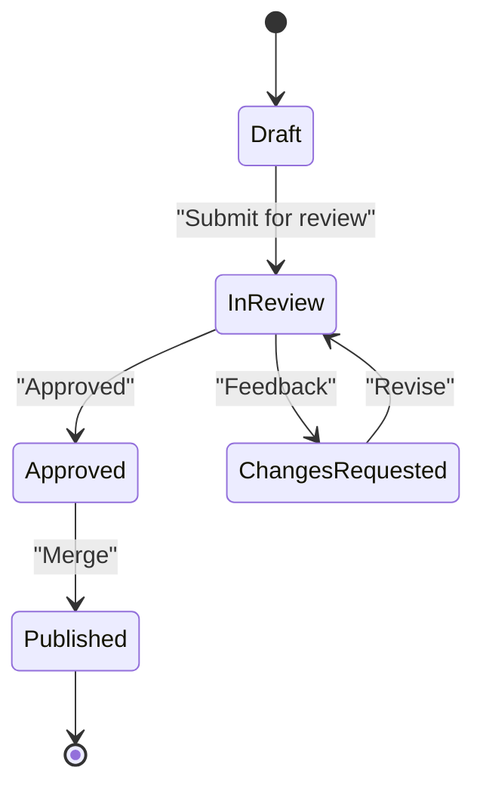

**Section sources**
- [teamWorkflowUi.test.ts](file://test/teamWorkflowUi.test.ts)

### Permission Management
- Authentication: Users authenticate before accessing project data.
- Row-Level Security: Policies restrict reads/writes based on user roles and ownership.
- Scoped Access: Assets and metadata are scoped to projects and collaborators.

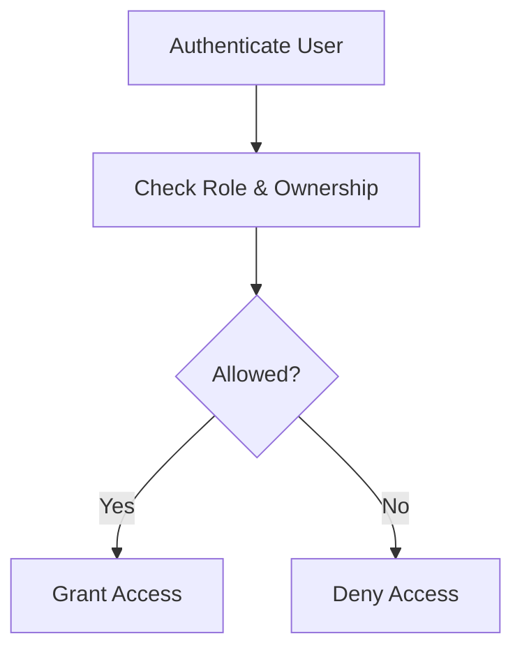

**Diagram sources**
- [DRAFT_20260706_auth_rls.sql](file://supabase/migrations/DRAFT_20260706_auth_rls.sql)

**Section sources**
- [DRAFT_20260706_auth_rls.sql](file://supabase/migrations/DRAFT_20260706_auth_rls.sql)

### Data Consistency Guarantees
- ACID Transactions: Writes occur within transactions to maintain integrity.
- Idempotency: Operations are designed to be idempotent where possible, reducing duplicate effects.
- Reconciliation: Clients reconcile state after reconnects using canonical snapshots.

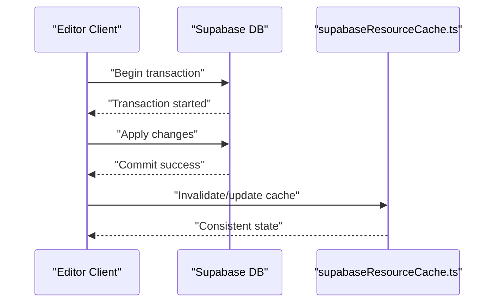

**Diagram sources**
- [supabaseResourceCache.ts](file://src/assets/supabaseResourceCache.ts)

**Section sources**
- [supabaseCanonicalRoundtrip.live.test.ts](file://test/supabaseCanonicalRoundtrip.live.test.ts)
- [supabaseProjectSync.test.ts](file://test/supabaseProjectSync.test.ts)

## Dependency Analysis
Collaboration components depend on each other as follows:
- Editor UI depends on the resource cache for efficient data access.
- Resource cache depends on REST utilities to communicate with Supabase.
- REST utilities rely on authentication and RLS policies for secure access.
- Tests validate end-to-end behaviors including sync, locks, and recovery.

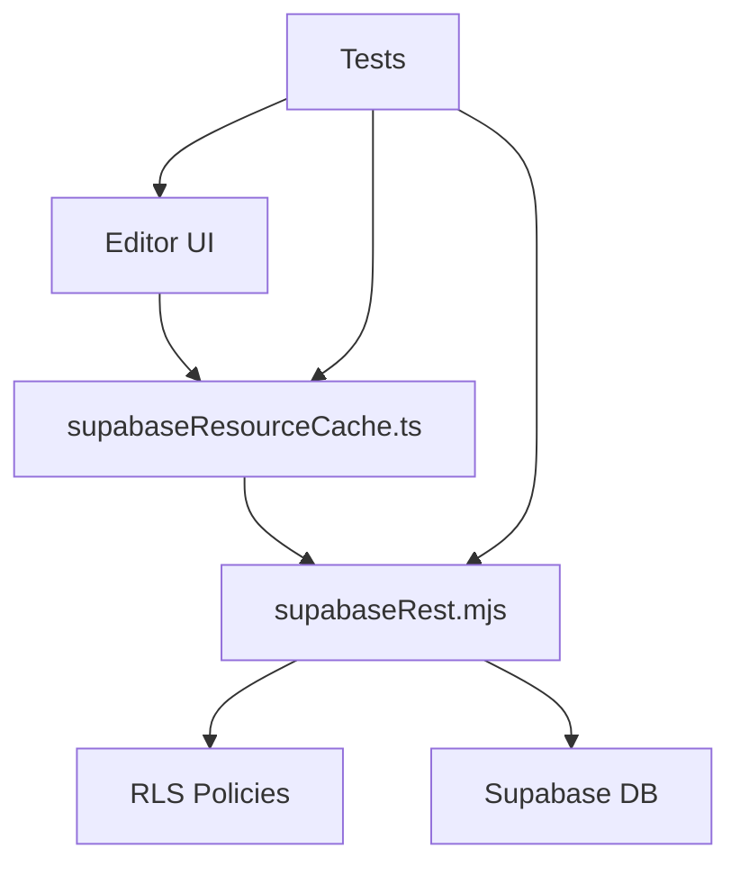

**Diagram sources**
- [supabaseResourceCache.ts](file://src/assets/supabaseResourceCache.ts)
- [supabaseRest.mjs](file://scripts/supabase-resource-root/supabaseRest.mjs)
- [DRAFT_20260706_auth_rls.sql](file://supabase/migrations/DRAFT_20260706_auth_rls.sql)

**Section sources**
- [supabaseResourceCache.ts](file://src/assets/supabaseResourceCache.ts)
- [supabaseRest.mjs](file://scripts/supabase-resource-root/supabaseRest.mjs)
- [DRAFT_20260706_auth_rls.sql](file://supabase/migrations/DRAFT_20260706_auth_rls.sql)

## Performance Considerations
- Caching: Use the resource cache to minimize repeated network calls and reduce latency.
- Delta Updates: Prefer publishing deltas to limit bandwidth usage.
- Batch Operations: Group multiple writes into single transactions where appropriate.
- Connection Resilience: Implement exponential backoff and reconnection logic for robustness.

[No sources needed since this section provides general guidance]

## Troubleshooting Guide
Common issues and resolutions:
- Lock Conflicts: If a lock cannot be acquired, check for stale locks and implement automatic release mechanisms.
- Sync Failures: Verify canonical round-trip behavior and ensure clients reconcile state after reconnects.
- Recovery Location: Confirm recovery points are correctly set and restored after interruptions.
- Asset Upload Errors: Validate upload pipelines and catalog entries; retry failed uploads with idempotency keys.

**Section sources**
- [mapEditLocks.test.ts](file://test/mapEditLocks.test.ts)
- [supabaseCanonicalRoundtrip.live.test.ts](file://test/supabaseCanonicalRoundtrip.live.test.ts)
- [supabaseRecoveryLocation.test.ts](file://test/supabaseRecoveryLocation.test.ts)
- [projectUploads.mjs](file://scripts/supabase-resource-root/projectUploads.mjs)
- [catalog.mjs](file://scripts/supabase-resource-root/catalog.mjs)

## Conclusion
The collaboration system combines Supabase-backed storage, real-time synchronization, exclusive edit locks, and policy-driven permissions to enable safe, efficient teamwork. Versioning and auditability are supported through commit identities, while tests validate critical behaviors. Following best practices around caching, delta publishing, and resilience ensures a smooth collaborative experience.

[No sources needed since this section summarizes without analyzing specific files]

## Appendices

### Setup Instructions for Collaborative Projects
- Initialize Supabase project and apply migrations for sync, locks, and commit identity.
- Configure RLS policies to enforce role-based access.
- Set up environment variables for REST endpoints and credentials.
- Run upload scripts to seed assets and catalogs.
- Launch the editor and connect to the Supabase instance.

**Section sources**
- [20260625000000_rpg_zzu_sync.sql](file://supabase/migrations/20260625000000_rpg_zzu_sync.sql)
- [20260701000000_map_edit_locks.sql](file://supabase/migrations/20260701000000_map_edit_locks.sql)
- [20260706000000_commit_identity.sql](file://supabase/migrations/20260706000000_commit_identity.sql)
- [DRAFT_20260706_auth_rls.sql](file://supabase/migrations/DRAFT_20260706_auth_rls.sql)
- [projectUploads.mjs](file://scripts/supabase-resource-root/projectUploads.mjs)
- [catalog.mjs](file://scripts/supabase-resource-root/catalog.mjs)
- [save-map-to-supabase.mts](file://scripts/save-map-to-supabase.mts)

### Best Practices for Team Development
- Always acquire locks before writing to shared maps.
- Publish small, focused deltas to reduce contention.
- Use branch and merge workflows aligned with commit identities.
- Monitor presence indicators to coordinate work and avoid overlaps.
- Validate changes locally before pushing to shared branches.

**Section sources**
- [mapEditLocks.test.ts](file://test/mapEditLocks.test.ts)
- [teamWorkflowUi.test.ts](file://test/teamWorkflowUi.test.ts)

### Security Considerations and Data Privacy
- Enforce RLS policies strictly to prevent unauthorized access.
- Rotate credentials and secrets regularly.
- Limit exposure of sensitive metadata and logs.
- Audit access patterns and lock usage for anomalies.

**Section sources**
- [DRAFT_20260706_auth_rls.sql](file://supabase/migrations/DRAFT_20260706_auth_rls.sql)

### Scalability Limitations
- Lock contention increases with more concurrent editors; consider sharding maps or regions.
- Realtime channel load grows with activity; monitor throughput and adjust batching.
- Asset size impacts sync performance; prefer streaming and compression where feasible.

[No sources needed since this section provides general guidance]

### Additional Context
- Runtime and data architecture overview for deeper understanding of collaboration flows.
- High-level architecture notes to contextualize component interactions.

**Section sources**
- [runtime-and-data.md](file://openwiki/runtime-and-data.md)
- [architecture.md](file://openwiki/architecture.md)