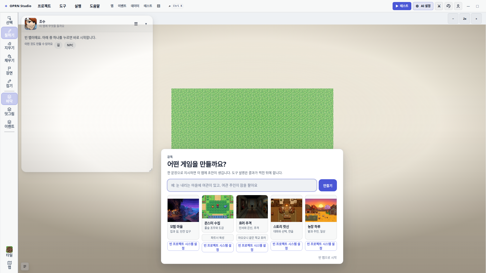
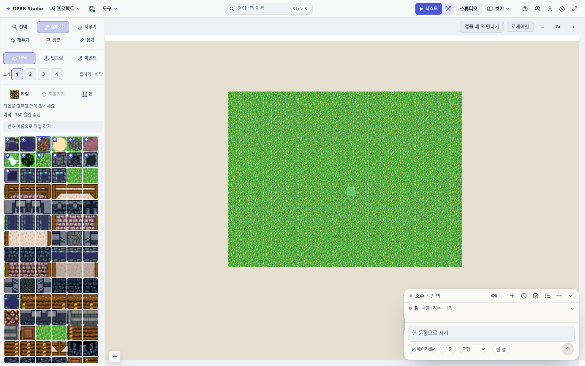
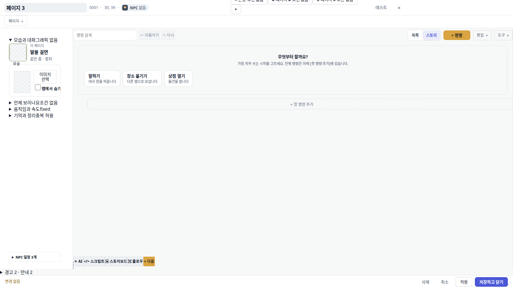
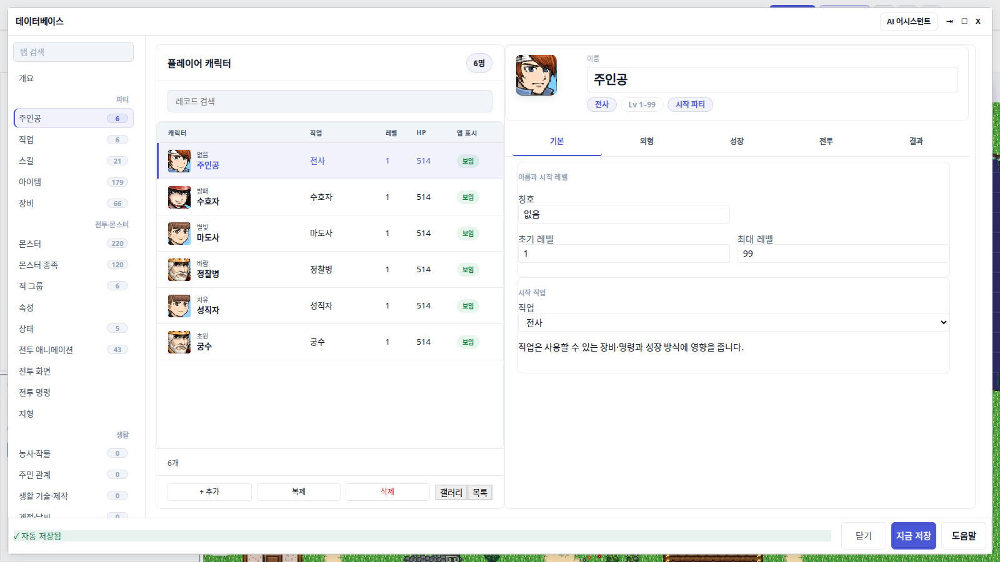
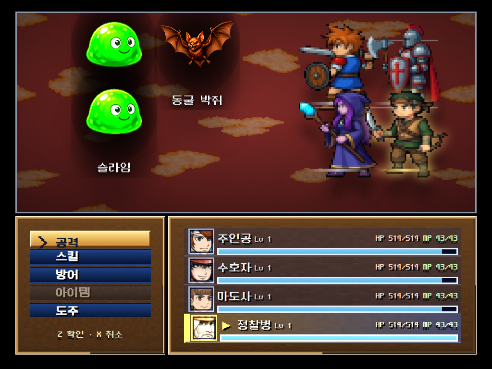
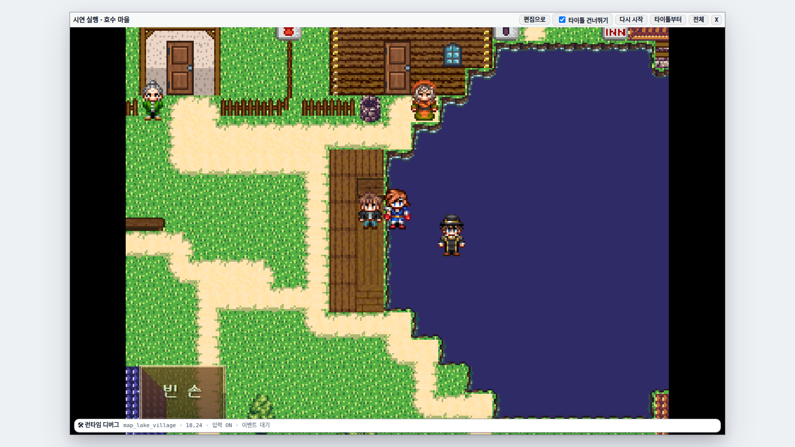

<div align="center">

# OPRN Studio

**웹 브라우저에서 만드는 탑뷰 타일 JRPG 메이커**

에디터로 맵을 그리고 이벤트를 배치한 뒤, Play 모드에서 바로 플레이할 수 있습니다.

[처음 시작하기](#처음-시작하기) · [개발자·에이전트용 Quickstart](openwiki/quickstart.md) · [스펙](docs/specs/2026-06-18-rpg-maker-mvp-design.md) · [에셋 라이선스](public/assets/ATTRIBUTION.md)

</div>

<p align="center">
  
</p>
<p align="center"><i>OPRN Studio 웰컴 화면 — 템플릿에서 새 게임을 시작하거나 AI 어시스턴트와 함께 기획할 수 있습니다.</i></p>

## 처음 시작하기

내 컴퓨터에서 혼자 쓰는 경우입니다. 팀 서버로 여럿이 쓰는 방법은 [`openwiki/team-project-host.md`](openwiki/team-project-host.md)를 보세요.
아래 내용은 macOS·Linux 기준이며, Windows에서는 아직 확인하지 않았습니다.

1. **Node.js 24 LTS를 설치합니다.** [nodejs.org](https://nodejs.org)에서 24 LTS를 받아 설치한 뒤 터미널을 새로 엽니다.
   다른 버전이면 실행기가 `NODE_VERSION` 오류를 내고 멈춥니다.
2. **실행합니다.** macOS에서는 저장소 폴더의 `Start RPG Maker.command`를 더블클릭합니다.
   터미널에서는 저장소 폴더에서 `npm run mac:launch`를 입력합니다. 처음 한 번은 필요한 패키지(`npm ci`)부터 설치합니다.
3. **저장할 폴더를 정합니다.** 처음에만 `기존 프로젝트 폴더 또는 새로 만들 폴더 경로:`를 묻습니다.
   **아직 없는 새 폴더의 전체 경로**를 입력하세요(예: `/Users/이름/Documents/my-rpg`). 이 폴더에 프로젝트가 만들어집니다.
   - `~/Documents/...`처럼 `~`로 쓰면 홈 폴더로 풀리지 않고, 저장소 안에 `~`라는 폴더가 생깁니다.
   - 이미 있는 일반 폴더는 덮어쓰지 않고 거절합니다(`PROJECT_MISSING`).
   - 정한 폴더는 `.oprn-local.json`에 기록되어 다음부터는 묻지 않습니다.
4. **기다립니다.** 실행할 때마다 앱을 다시 빌드하므로 1분 이상 걸릴 수 있습니다. 끝나면 브라우저에 `http://127.0.0.1:9999`가 열립니다.
   처음 화면은 몇 초간 비어 있을 수 있습니다. **새로고침하지 말고 기다리세요**(아래 「막혔을 때」의 편집 잠김이 생깁니다).
5. **터미널 창은 열어 두세요.** 닫으면 앱도 꺼집니다. 끝낼 때는 터미널에서 `Ctrl-C`를 누릅니다.

### AI와 함께 만들기

지금은 개인 실행기가 **AI 연결을 끈 채로 켜집니다.** 이대로 열면 오른쪽 위에 빨간 `Google Antigravity 보조 오류`가 뜨고,
「개발 서버를 껐다 켜 보세요」라는 안내가 나옵니다. 하지만 다시 켜도 풀리지 않습니다. AI를 쓰려면 터미널에서 이렇게 실행하세요.

```bash
OPRN_HOST_OWNER_AI=1 npm run mac:launch
```

그러면 칩이 `… 로그인 필요`로 바뀝니다. 칩(또는 「AI 연결하기」)을 눌러 AI 설정을 열고, 가진 구독 계정
(Google Gemini·Antigravity 또는 ChatGPT의 Codex)으로 로그인합니다. `Start RPG Maker.command` 더블클릭으로는 이 설정을 켤 수 없습니다.

### AI 없이 시작하기

첫 화면 「어떤 게임을 만들까요?」에서 **AI 없이 결과가 생기는 것은 장르 포스터 오른쪽 위의 작은 ⚙뿐**입니다.
⚙를 누르면 빈 맵과 그 장르의 기본 설정(데이터베이스·시스템)이 적용됩니다.

- 입력칸의 「만들기」와 포스터 본문(질문 5개)은 AI가 있어야 결과가 나옵니다. AI 없이 질문에 답하면 ⚙와 같은 결과(장르 기본 설정 + 빈 맵)만 남고, 답한 기획은 맵에 반영되지 않습니다.
- 「빈 맵으로 시작」을 누른 뒤 왼쪽 **타일** 탭에서 타일을 골라 캔버스에 그리고, 위의 **▶ 테스트**로 바로 플레이해 볼 수 있습니다.

### 막혔을 때

| 증상 | 원인과 해결 |
|---|---|
| `호스트님이 편집 중입니다`가 뜨고 그려지지 않음 | 새로고침하거나 탭을 다시 연 직후에는 이전 탭이 편집 권한을 약 1분 쥐고 있습니다. 배너의 **편집 권한 가져오기 → 가져오기**를 누르세요. 혼자 쓰는 경우라면 안전합니다. |
| 빨간 `Google Antigravity 보조 오류` | AI를 끈 채로 실행했습니다. 위 「AI와 함께 만들기」를 보세요. |
| `NODE_VERSION` | Node.js 24가 아닙니다. 24 LTS를 설치한 뒤 터미널을 새로 여세요. |
| `PORT_BUSY` | 9999 포트를 이미 쓰는 프로그램이 있습니다. 전에 실행한 터미널이 아직 열려 있는지 확인하세요. |
| `PROJECT_MISSING` | 이미 있는 폴더인데 OPRN 프로젝트가 아닙니다. 아직 없는 새 폴더 경로를 입력하세요. |
| 다른 프로젝트 폴더를 쓰고 싶음 | `npm run mac:launch -- --project-dir <폴더 경로>`로 실행하거나, `.oprn-local.json`을 지운 뒤 다시 실행하세요. |

## 개발자용 명령

> Node.js 24 LTS, npm. 프로젝트 저장은 SQLite 폴더를 사용합니다. 다른 사람의 `.env.local`을 복사하거나 커밋하지 마세요.

```bash
npm ci
npm run dev              # 개발 서버 (http://localhost:9999) — 메인 체크아웃 전용
npm run dev:worktree     # git 워크트리용 — 체크아웃별 고정 포트를 스스로 배정·기록(.env.local DEV_SERVER_PORT)
npm run build:packaged   # 호스팅/데스크톱 렌더러 빌드
npm run build:electron   # 저장 브리지 빌드
npm start -- --project-dir /path/to/project  # 기존 SQLite 프로젝트 호스트 (기본 mdc-server:9888)
npm test                 # 단위 테스트
npm run typecheck:app    # 앱 타입 검사
```

개인 실행(`npm run mac:launch`, `Start RPG Maker.command`)은 위 [처음 시작하기](#처음-시작하기)를 보세요. 외부 DB 설정은 필요하지 않습니다.

## 주요 기능

| 영역 | 기능 |
|---|---|
| **맵 에디터** | 3레이어(lower / upper / event), Map Tree, 패널 유연 레이아웃 |
| **Database** | 스위치/변수/공통이벤트/타일셋/용어, 액터/직업/스킬/아이템/장비/적/적그룹/상태/전투애니메이션/시스템 |
| **이벤트** | RM2K3 명령 세트, 드래그 재정렬, 분기/변수연산/스위치/타이머/입력대기/라벨/이동 |
| **전투** | RM2K3 사이드뷰 ATB, DB 구동 능력치/보상/스킬/방어/도주 |
| **리소스** | 타일셋/스프라이트 임포트(base64 → IndexedDB), 내장 32비트 픽셀 에셋 |
| **AI 어시스턴트** | Codex ChatGPT OAuth same-origin 브릿지, 또는 OpenAI 호환 API/게이트웨이 |
| **저장 / 내보내기** | SQLite 프로젝트 폴더, 팀 호스트, JSON import/export |

## 지원 맵 타일

에디터는 이미지를 타일 격자로 잘라 그리는 **격자 시트 방식**입니다. 내장 칩셋을 쓰거나, Resource Manager에서 16px·32px·48px 격자 PNG를 임포트해 쓸 수 있습니다.

**지원되는 타일**

- 타일 한 칸이 **16×16, 32×32 또는 48×48 정사각형**이고, 시트의 가로·세로가 그 크기의 배수인 PNG (임포트 시 타일 크기를 선택합니다). 48×48 은 RPG Maker MV/MZ 규격이며, 캐릭터 그래픽은 맵 타일 크기에 맞춰 자동 배율됩니다
- 아래 번들 타일셋은 통행·레이어 메타데이터가 준비돼 있어 바로 그릴 수 있습니다

| 번들 타일셋 | 타일 크기 | 비고 |
|---|---|---|
| EasyRPG RTP 시리즈 (외관·실내·던전·배·월드맵·레트로) | 16px | 480칸 표준 규격(480×256) — **합본 마을이 기본값** |
| 합본 마을 + 레트로 월드맵 확장 | 16px | 480×608, 1,140칸 (숲 나무 띠 포함) |
| 성채 · OpenGameArt Castle | 16px | 512×512, 32열 |
| Scarloxy (초원 마을 / 사막·설원 / 실내) | 16px | CC-BY 4.0 |
| Slates 32px · Ivan Voirol | 32px | 1,792×704, 56열 — 첫 32px 번들 칩셋 |
| 확장 시트 (Modern Exteriors 네온 녹턴, Tibo 실내 확장, forest-harmony) | 16px | 480칸 초과 시트 |

출처·라이선스는 [public/assets/ATTRIBUTION.md](public/assets/ATTRIBUTION.md)를 따릅니다. 새로 임포트한 칩셋은 모든 타일이 "통행 가능 · 하위 레이어"로 시작하므로, Database 타일셋 편집기에서 통행과 레이어를 직접 지정해야 합니다.

**지원되지 않는 타일**

- 16·32·48 이외의 타일 크기 (예: 24×24)
- 가로나 세로가 16/32/48의 배수가 아닌 시트 — 임포트 단계에서 거절됩니다
- RM2K3 **오토타일 자동 연결** — 물·절벽·벽의 대각 조합이 자동으로 이어지지 않으므로 격자 조각을 직접 배치해야 합니다. 물 애니메이션(가로 3프레임 띠)은 번들 16px 칩셋에서만 재생됩니다

## 스크린샷

<p align="center">
  
  
</p>
<p align="center"><i>왼쪽: 3레이어 타일 맵 에디터 / 오른쪽: RM2K3 스타일 이벤트 명령 편집</i></p>

<p align="center">
  
  
</p>
<p align="center"><i>왼쪽: Database(플레이어 캐릭터, 스킬, 적 등) / 오른쪽: 사이드뷰 ATB 전투</i></p>

<p align="center">
  
</p>
<p align="center"><i>Play 모드에서 작성한 마을 맵을 바로 플레이</i></p>

## 사용법

### EDIT 모드

- **좌측 패널** — 도구(펜 / 채우기 / 충돌 / 이벤트 / 지우개), 타일, 맵 목록
- **캔버스** — 드래그로 편집. 충돌 칸(빨강), 시작 위치(초록), 이벤트 표시
- **우측 패널** — 맵 속성, 선택한 이벤트 편집(트리거 / 스프라이트 / 조건 / 명령)
- **상단 메뉴** — 저장 / 불러오기 / 내보내기 / 가져오기 / Play

### PLAY 모드

- **이동**: 방향키 또는 WASD
- **조사 / 확인**: Space / Enter / E
- **대사 진행**: 클릭 또는 Enter (타이핑 중이면 전문 표시)
- **선택지**: 클릭 또는 숫자키 1~9

### 이벤트 명령

이벤트는 명령 리스트를 순차 실행합니다(중첩 가능):

- **text** — 대사창 (화자 + 본문)
- **choices** — 선택지 (각 옵션마다 중첩 branch)
- **setFlag** — 전역 플래그 설정
- **transfer** — 다른 맵으로 이동
- **wait** — 대기

트리거 종류: 조사(action) / 닿음(touch) / 자동(auto). 발동 조건(flag)으로 분기 제어.

## 설치 가이드

<details>
<summary>BGM 및 대용량 에셋 설치</summary>

**그림과 효과음은 clone에 포함되고, 전체 BGM 281곡은 별도 Release 팩으로 설치합니다.**
`npm ci`나 실행 명령이 대용량 음원을 자동 다운로드하지는 않습니다.

| 에셋 | 위치 | 별도 설치 |
|---|---|---|
| 기본 타일셋·캐릭터·얼굴·몬스터·아이콘 | `public/assets/` | 없음 |
| CC0 효과음 635개, 기존 BGM 5곡 | `public/assets/se/`, `public/assets/cc0/audio/bgm/` | 없음 |
| BGM 카탈로그 기본 3곡 | `public/assets/cc0/audio/catalog/` | 없음 |
| BGM 카탈로그 전체 281곡 | [BGM v1 Release](https://github.com/MovieHolic-Plex/rpg-zzu/releases/tag/bgm-v1) | 아래 명령 |
| 사용자가 추가한 그림·음원 | 프로젝트 데이터 | 해당 프로젝트 불러오기 |

#### GitHub CLI로 설치

이 저장소는 **비공개**입니다. 접근 권한이 있는 계정과 [GitHub CLI (`gh`)](https://cli.github.com/)가 필요합니다.

```bash
gh auth login
npm run bgm:install
npm run bgm:verify
npm run dev
```

`bgm:install`은 `bgm-v1`의 `rpg-zzu-bgm-v1.tar`를 받아, 코드에 고정된 `assets/bgm-release-v1.json`의 크기와 SHA-256으로 검증한 뒤 설치합니다. 완료 메시지는 **281/281곡 검증 완료**입니다. 이미 전곡이 정상 설치돼 있으면 다시 다운로드하지 않습니다.

#### gh 없이 수동 설치 / 다른 컴퓨터로 옮기기

1. 접근 권한이 있는 GitHub 계정으로 [BGM v1 Release](https://github.com/MovieHolic-Plex/rpg-zzu/releases/tag/bgm-v1)를 엽니다.
2. **Assets의 `rpg-zzu-bgm-v1.tar`**를 다운로드합니다. `Source code (zip)`은 음원 팩이 아닙니다.
3. 압축을 직접 풀지 말고, 프로젝트 폴더에서 받은 파일을 지정합니다. 경로에 공백이 있으면 따옴표로 감싸세요.

```bash
npm run bgm:install -- --archive "/다운로드/경로/rpg-zzu-bgm-v1.tar"
npm run bgm:verify
```

수동 설치는 **의존성 설치가 끝난 Node.js 환경에서** `gh`나 인터넷 없이 실행됩니다. 팩은 약 **1.304 GB**, 음원 원본 합계는 **1,303,934,164 bytes**입니다. 검증용 임시 복사와 기존 설치본을 고려해 여유 공간 **5 GB 이상**을 권장합니다. 설치된 음원은 Git에서 제외되므로 clone 크기와 커밋 이력을 늘리지 않습니다.

</details>

<details>
<summary>로컬 재생 / 빌드 / 복구</summary>

- 로컬 음원을 사용하려면 `VITE_BGM_CDN_BASE`를 설정하지 마세요. `.env.local`, 모드별 `.env` 또는 셸에 기존 CDN 주소가 있으면 **그 주소가 우선**합니다. 설치 도구는 개인 설정을 수정하지 않습니다. 설정을 바꿨으면 서버를 재시작하세요.
- 프로덕션 사용은 **음원 설치 → `npm run build` → `npm start`** 순서입니다. 이미 빌드한 뒤 음원을 설치했다면 재빌드해야 정적 산출물에 포함됩니다. 웹 게임 내보내기도 음원 설치 후 실행하세요.
- 설치된 음원 재생과 로컬 SQLite 저장은 오프라인으로 가능합니다. 외부 AI 서비스에는 네트워크 연결이 필요합니다.
- `npm run bgm:verify`가 누락·손상을 보고하면 `bgm:install`을 다시 실행하세요. 정상 파일과 관계없는 파일은 유지하고, 누락·손상된 곡만 교체합니다.
- 팩의 크기·해시가 틀리면 기존 음원은 바꾸지 않고 실패합니다. 설치 후반에 디스크 오류가 나면 일부 파일만 교체된 상태일 수 있으며, 같은 명령을 다시 실행해 복구합니다.
- Ctrl-C는 임시 파일·설치 잠금을 정리합니다. 강제 종료나 전원 차단 후 `public/assets/cc0/audio/.bgm-install.lock`이 남았다면, 실행 중인 설치가 없음을 확인한 뒤 해당 잠금 파일만 제거하고 재실행하세요.

CDN 스트리밍을 계속 쓰거나 새 팩을 제작하는 관리자는 [`openwiki/bgm-catalog.md`](openwiki/bgm-catalog.md)를 참고하세요. BGM 팩은 CC0-1.0이며, 다른 기본 에셋의 라이선스는 [`public/assets/ATTRIBUTION.md`](public/assets/ATTRIBUTION.md)를 따릅니다.

</details>

<details>
<summary>AI 어시스턴트 연결</summary>

기본 연결은 API 키 과금 대신 로컬 Codex의 ChatGPT OAuth 로그인을 사용합니다. `npm run dev`만 띄우면 Codex 로그인 상태를 dev 서버와 **같은 포트**(same-origin)로 자동 브릿지합니다 — 별도 터미널이 필요 없습니다.
개인 실행기(`npm run mac:launch`)와 `npm start`는 공유 호스트로 떠서 AI가 기본으로 꺼져 있습니다. `OPRN_HOST_OWNER_AI=1`을 붙여 실행해야 합니다([처음 시작하기](#ai와-함께-만들기)).

```bash
npm run dev
```

로그인이 없으면 `AI 설정 → Google Gemini → 로그인`이 Antigravity 기기 코드 로그인을 시작합니다. 기본 모델은 `gemini-3.7-flash`입니다.

- **DEV / PREVIEW (`npm run dev`, `npm start`)**: vite가 `/auth/*`·`/v1/chat/completions`를 페이지와 같은 오리진에 붙입니다. 브라우저는 `127.0.0.1:17832`를 치지 않습니다 — 그 포트는 oh-my-pi 단독 동반 서비스가 **이 머신 루프백**에서 듣는 주소입니다.
- **단독 동반 서비스**가 필요할 때만:

```bash
npm run ai:oauth   # 127.0.0.1:17832, 토큰은 서버의 ~/.oprn 에 보관
```

환경 변수 이름은 2026-09 에 `RPG_ZZU_*`에서 `OPRN_*`로 바뀌었습니다. 옛 이름도 이번 릴리스까지는 경고 한 줄과 함께 그대로 읽힙니다(`scripts/lib/oprnEnv.mjs`가 새 이름으로 옮겨 줍니다).

API 사용이 필요한 경우 `AI 설정 → API / 게이트웨이`로 전환해 OpenAI 호환 엔드포인트·모델·키를 입력할 수 있습니다. OAuth access/refresh token은 브라우저 localStorage나 프로젝트 데이터에 저장하지 않습니다.

</details>

<details>
<summary>기타 리소스 규격 (칩셋 제외)</summary>

맵 타일 외 리소스는 아래 고정 규격을 씁니다. 자유 크기 항목도 RM2K3 관례 크기를 기본값으로 렌더링하며, 잘라 쓰려면 규격 시트로 준비해야 합니다.

| 리소스 | 규격 | 비고 |
|---|---|---|
| 캐릭터 걸음 시트 (charset) | 24×32 칸, 12열×8행 = 96프레임 (288×256) | 방향 3프레임 × 4방향이 세로 한 줄 |
| 전투 캐릭터 (battleCharset) | 48×48 칸, 3열×8행 = 24프레임 (144×384) | 런타임 backgroundSize 산식이 이 규격에 의존 |
| 전투 무기 (battleWeapon) | 64×64 칸, 3열×8행 = 24프레임 (192×512) | 전투 캐릭터와 같은 3×8 구조 |
| 스프라이트 (내장 32비트 에셋) | 32×32 칸, 2열×4행 = 8프레임 | |
| 얼굴 (faceset) | 낱장 48×48 | 4×4 시트는 임포트 시 자동 분할 |
| 배경·몬스터·타이틀·그림·영상 | 자유 크기 | 이미지 통째로 사용 |

</details>

<details>
<summary>에셋 교체</summary>

기본 에셋은 32비트 픽셀 PNG(`public/assets/`, codex 생성). 더 정교한 에셋으로 교체하려면:

1. 타일셋/스프라이트 이미지를 Resource Manager에서 임포트(또는 `public/assets/`에 직접 배치 후 `bundled.ts` 경로 수정).
2. 타일 인덱스 순서가 `defaults.ts`의 `TILE` 상수와 일치하도록 정렬.
3. 에셋 히스토리는 `public/assets/MANIFEST.md`에 기록(codex 정밀수정 워크플로우).

라이선스: 외부 에셋 사용 시 각 에셋의 라이선스를 준수하고 README에 표기하세요.

</details>

<details>
<summary>에디터 단축키</summary>

| 키 | 동작 |
|---|---|
| `F5` / `F6` / `F7` | 하위 / 상위 / 이벤트 레이어 전환 |
| `1`~`7` | 도구 (연필 / 채우기 / 스포이드 / 이동 / 선택 / 통행 / 이벤트) |
| `+` / `-` | 정수 줌 확대 / 축소 |
| `Ctrl+S` | 저장 |
| `Ctrl+Z` / `Ctrl+Y` (또는 `Ctrl+Shift+Z`) | 실행취소 / 다시실행 |
| `Ctrl+C` / `Ctrl+V` | 타일 영역 복사 / 붙여넣기 |
| `Space` (누르는 동안) | 임시 맵 이동 |
| 가운데 버튼 드래그 | 맵 이동 |

텍스트 입력/모달이 포커스를 잡고 있으면 단축키는 자동으로 비활성화됩니다.

이벤트 명령 리스트는 RM2K3처럼 **드래그로 순서 변경**할 수 있습니다(명령 왼쪽 핸들을 드래그). 위/아래/삭제 버튼도 유지됩니다.

</details>

## 아키텍처

- **단일 진실 원천**: `Project` 데이터(JSON 직렬화)가 유일한 상태. 에디터만 쓰고, 플레이어는 읽기 전용 + 런타임 세션(`PlaySession`) 사용.
- **에디터 / 플레이어 분리**: 한 번에 한 모드. 전환 시 Phaser 게임 재부팅.
- **기술 스택**: Phaser(캔버스) + 바닐라 TypeScript DOM. 실제 의존성 목록은 `package.json`을 참고하세요.
- **기본 에셋**: 그림·효과음은 `public/assets/`에 포함하고, 대용량 BGM은 Release 팩으로 별도 설치합니다.
- **저장**: 프로젝트 정본은 선택한 폴더의 SQLite와 에셋 파일입니다. 팀 호스트도 같은 저장소를 사용합니다. 작업물은 파일로 내보내기·가져오기가 가능합니다.

## 데이터 스키마

스펙 문서 참조: [`docs/specs/2026-06-18-rpg-maker-mvp-design.md`](docs/specs/2026-06-18-rpg-maker-mvp-design.md)

주요 타입은 `src/project/types.ts`. 스키마 버전(`Project.version`)이 바뀌면 `io.ts`에 마이그레이션을 추가합니다.

## 테스트

```bash
npm test               # Vitest 단위 스위트 (test/**/*.test.ts)
npm run test:node      # node:test 스위트 (test/**/*.test.mjs)
npm run test:parity    # 에디터→플레이어 parity 게이트 (test/parity/)
npm run test:e2e       # Playwright 브라우저 스위트 (test/e2e/)
```

Vitest 단위 스위트는 약 680개 파일 / 약 4,900개 테스트입니다(순수 로직 위주). 주요 파일:

- `interpreter.test.ts` — RM2K3 명령 상태머신
- `migration.test.ts` — v1→v3 변환 + 왕복
- `io.test.ts` — 직렬화 왕복 + 잘못된 파일 거부
- `defaults.test.ts` / `collision.test.ts` — 프로젝트 무결성, 통행 기반 충돌
- `actions.test.ts` / `eventActions.test.ts` — 페인트/채우기, 명령 경로 탐색
- `battleRuntime.test.ts` / `battleRuntimeDb.test.ts` — ATB 전투 런타임, DB 구동 능력치/보상/스킬 효과/방어/도주
- `eventCommandReorder.test.ts` — 이벤트 명령 드래그 재정렬
- `editorHotkeys.test.ts` — RM2K3 스타일 에디터 단축키 매핑

`npm run test:node`는 `test/`를 **탐색**해서 `*.test.mjs`를 전부 돌립니다(`scripts/run-node-tests.mjs`).

Phaser 씬/DOM UI는 `npm run dev` + codex 브라우저 QA 및 `test/e2e`로 검증합니다. `test/e2e`에서 `_`로 시작하는 스펙은 진단·임시용이라 기본 실행에서 제외되고, 파일 이름을 직접 지목하거나 `E2E_INCLUDE_DIAGNOSTICS=1`일 때만 돌아갑니다(`playwright.config.ts`).
