<div align="center">


# OPRN Studio

### 说出你的想法，做出你的像素 JRPG。

[English](README.md) · **中文** · [日本語](README.ja.md) · [한국어](README.ko.md)

### 立即下载应用

[](https://github.com/MovieHolic-Plex/OpenRPGMaker/releases/latest/download/OPRN.Studio-windows.exe)
[](https://github.com/MovieHolic-Plex/OpenRPGMaker/releases/latest/download/OPRN.Studio-windows.zip)
[](https://github.com/MovieHolic-Plex/OpenRPGMaker/releases/latest/download/OPRN.Studio-linux.AppImage)

Windows：运行 EXE，或解压 ZIP 后运行 `OPRN Studio.exe`。Linux：为 AppImage 添加执行权限后运行。

[全部下载与发行说明](https://github.com/MovieHolic-Plex/OpenRPGMaker/releases/latest)

[](https://openrpgmaker.com/)
[](https://store.openrpgmaker.com/)
[](LICENSE.md)
[](LICENSE-RUNTIME.md)


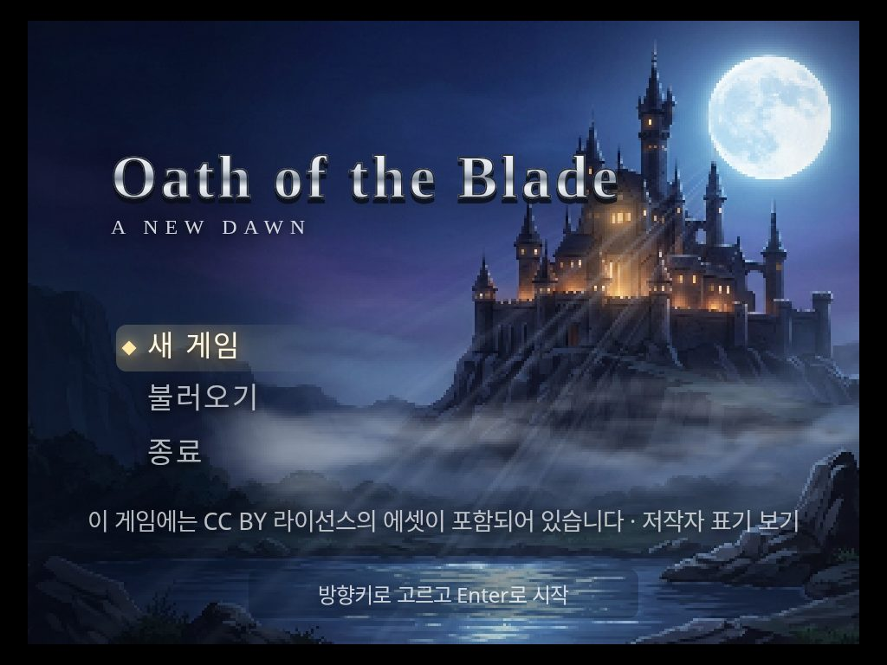

</div>

<table>
  <tr>
    <td width="50%">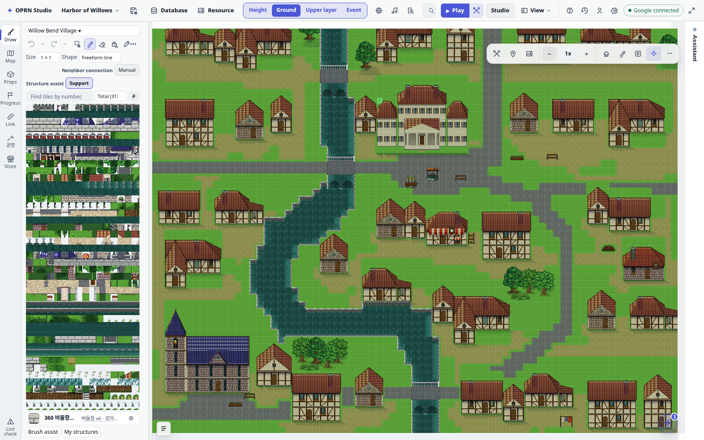</td>
    <td width="50%">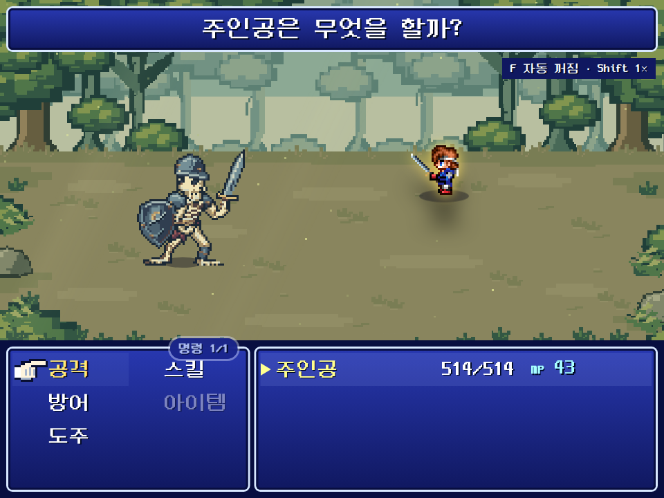</td>
  </tr>
  <tr>
    <td width="50%">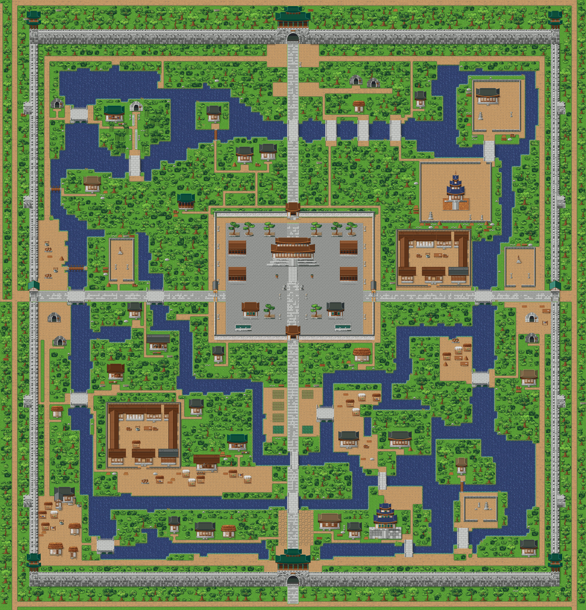</td>
    <td width="50%">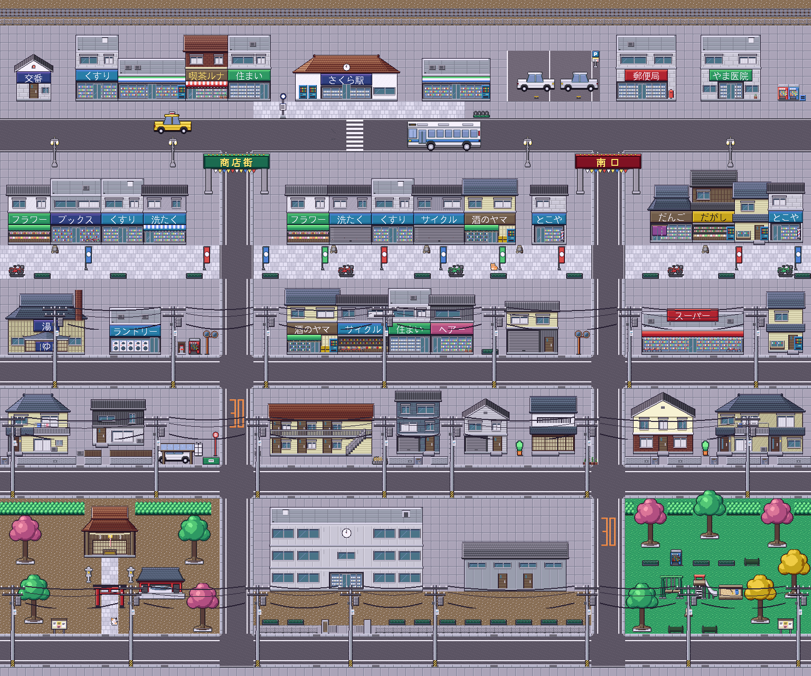</td>
  </tr>
</table>

<div align="center">

[下载](#下载) · [可以做什么](#可以做什么) · [亮点](#亮点) · [快速开始](#快速开始) · [画廊](#画廊) · [许可](#许可)

</div>

---

**OPRN Studio 是一款内置 AI 助手的图块式 JRPG 制作工具。**
绘制地图、放置事件，立即试玩——或者直接对助手说
*「做一个有教堂和酒馆的港口小镇」*，它就会帮你铺好图块、门和 NPC。
所有素材都是手绘 16px 像素画，你做出的游戏完全属于你。

## 可以做什么

- ⚔️ **经典 JRPG** —— 城镇、地下城、世界地图与横版战斗
- 🐉 **怪兽收集冒险** —— 捕捉、培养并与怪兽对战
- 🏯 **历史与现代舞台** —— 朝鲜王宫、日本街区、现代都市、魔法学校
- 💌 **剧情游戏** —— 带分支对话和过场动画的恋爱、推理、恐怖游戏

## 亮点

| | |
|---|---|
| 🤖 **AI 助手** | 用自然语言生成地图、村庄、室内、事件和对话。使用 Google（Gemini）或 ChatGPT（Codex）账号登录，无需 API 密钥。 |
| 🎨 **手绘像素世界** | 开箱即用的图块：罗马风港口小镇、朝鲜时代、日本城市、现代都市、魔法学校和温馨室内。 |
| 🗺️ **完整编辑器** | 分层图块地图、高度与悬崖、世界地图、角色/技能/道具/敌人数据库，以及 RPG Maker 风格的事件指令。 |
| 🎬 **演出效果** | 带光束与视差的动态标题画面、开场动画、镜头运动和对话立绘。 |
| ⚔️ **横版战斗** | 带待机动画的像素战斗角色，技能、状态和奖励全部由数据库驱动。 |
| 🌐 **随处游玩** | 在编辑器内直接试玩，并导出为网页游戏。导出的播放器采用 MIT 许可。 |
| 🛒 **素材商店** | 在 [store.openrpgmaker.com](https://store.openrpgmaker.com/) 分享和下载角色、图块和地图物件。 |
| 🌏 **四种语言** | 编辑器支持 English、中文、日本語 和 한국어。 |

## 下载

无需安装开发工具。[最新发布](https://github.com/MovieHolic-Plex/OpenRPGMaker/releases/latest)。下面两个地址会直接下载该发布里的桌面应用。

| | |
|---|---|
| Windows | [OPRN.Studio-windows.zip](https://github.com/MovieHolic-Plex/OpenRPGMaker/releases/latest/download/OPRN.Studio-windows.zip) — 解压后运行 `OPRN Studio.exe` |
| Linux | [OPRN.Studio-linux.AppImage](https://github.com/MovieHolic-Plex/OpenRPGMaker/releases/latest/download/OPRN.Studio-linux.AppImage) — `chmod +x` 后运行 |
| macOS | 还没有安装包。请用下面的源码命令。 |

## 快速开始

适用于 macOS，或从源码运行。需要 [Node.js 24 LTS](https://nodejs.org/)。

```bash
npm ci
npm run mac:launch   # macOS / Linux —— 询问项目文件夹后打开 http://127.0.0.1:9999
```

首次启动时请输入一个**新**文件夹的完整路径，项目会以 SQLite 和素材文件的形式保存在那里。
点击右上角的 AI 标签即可登录。

## 画廊

<table>
  <tr>
    <td colspan="2">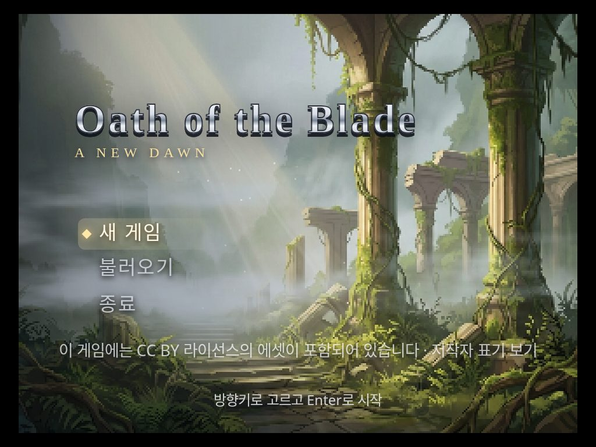<br/><sub>动态标题画面</sub></td>
  </tr>
  <tr>
    <td width="50%">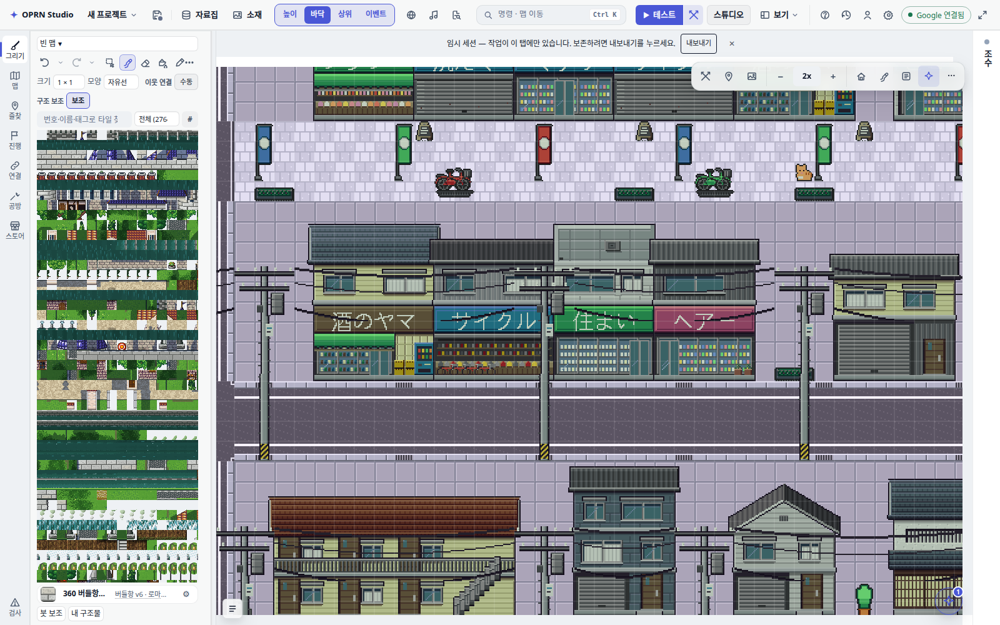<br/><sub>编辑日本商店街</sub></td>
    <td width="50%">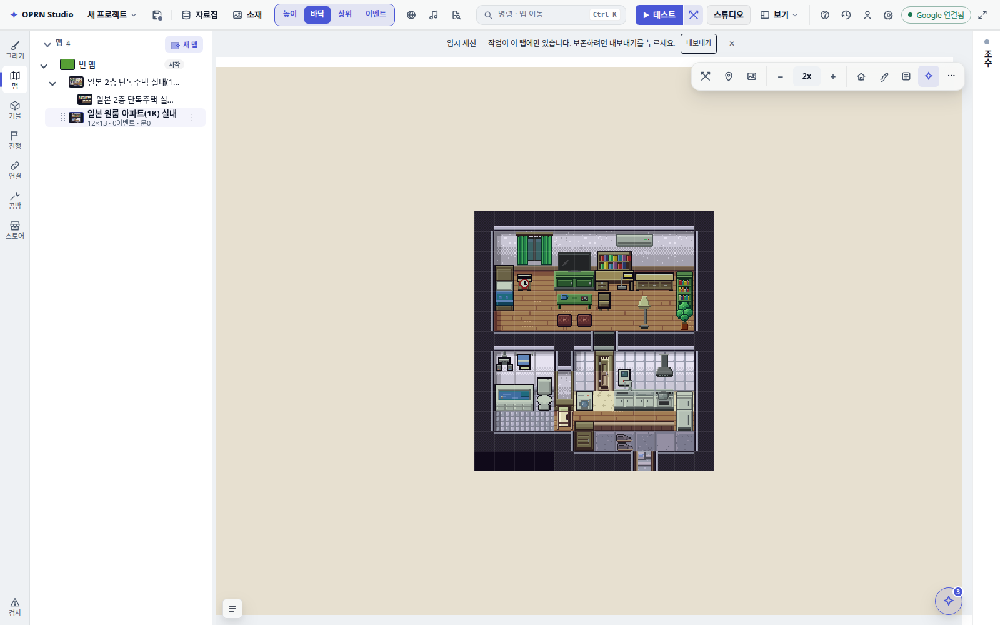<br/><sub>室内与地图树</sub></td>
  </tr>
  <tr>
    <td width="50%">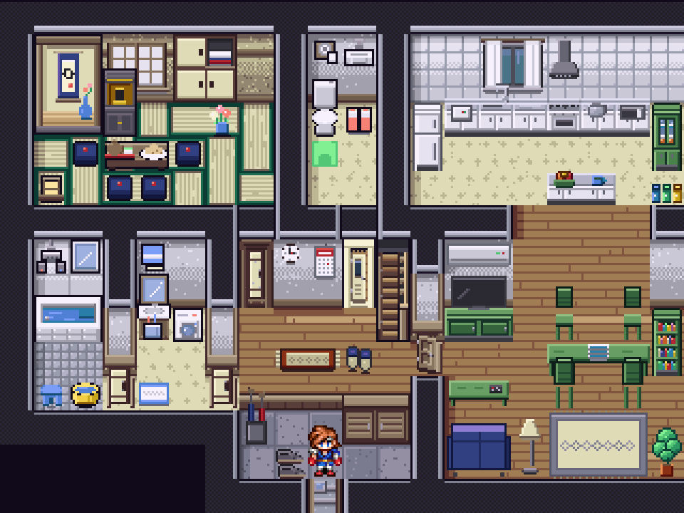<br/><sub>游玩模式——日本民宅</sub></td>
    <td width="50%">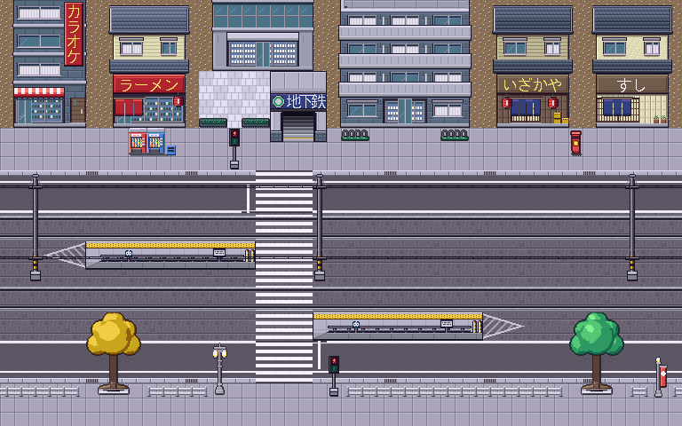<br/><sub>有电车经过的街道</sub></td>
  </tr>
  <tr>
    <td colspan="2">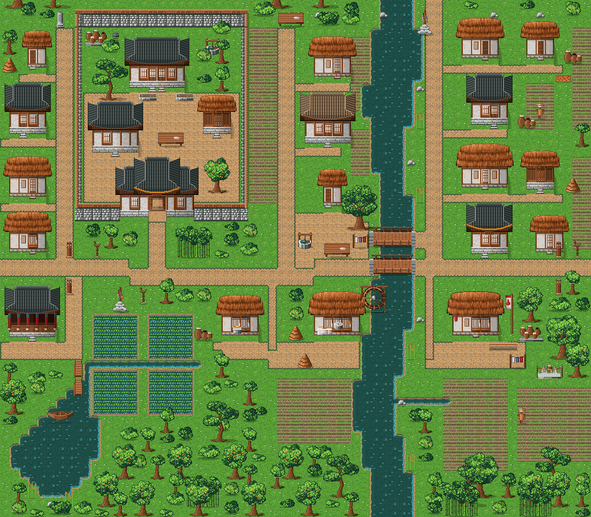<br/><sub>溪边的朝鲜村庄</sub></td>
  </tr>
</table>

## 开发者

```bash
npm ci
npm run dev              # 开发服务器 (http://localhost:9999)
npm run build:packaged   # 托管 / 桌面版渲染构建
npm run build:player     # 独立网页游戏播放器
npm start -- --project-dir /path/to/project   # 打开现有 SQLite 项目
npm test                 # 单元测试
```

- 架构、数据与编辑器文档位于 [`openwiki/`](openwiki/)（目前为韩语）——请从 [`openwiki/quickstart.md`](openwiki/quickstart.md) 和 [`openwiki/PROJECT_WIKI.md`](openwiki/PROJECT_WIKI.md) 开始。
- 编程智能体请先阅读 [`AGENTS.md`](AGENTS.md)。
- 技术栈：Phaser + 原生 TypeScript DOM、SQLite 项目文件夹、Electron 桌面外壳。

## 许可

| 部分 | 许可 |
|---|---|
| 编辑器与工具 | [Sustainable Use License 1.0](LICENSE.md) + 对你的游戏和产出的额外许可 |
| 导出的游戏播放器（运行时） | [MIT](LICENSE-RUNTIME.md) |
| 内置美术与音效 | [OPRN Game Use License](ASSET-LICENSE.md) —— 可在你的游戏中免费使用 |
| 第三方组件 | [THIRD_PARTY_NOTICES.md](THIRD_PARTY_NOTICES.md) |
| 名称与标志 | [TRADEMARKS.md](TRADEMARKS.md) |

**你做出的游戏属于你** —— 可以出售、分享，无需支付版税。
欢迎依据 [CLA](CLA.md) 贡献代码。

OPRN Studio 与 RPG Maker、Gotcha Gotcha Games 及 KADOKAWA 无关。
