# 2026-09-03 정면 전투 스킨 개명(rm2003 → rm2000) · 모던 유리 HUD

- 작성: Claude(에이전트) · 브랜치 `feat/rm2003-to-rm2000-battle-ui`
- 관련 코드: `src/battle/skins/registry.ts`, `src/styles/runtime/battle-skins/_rm2000.css`, `src/player/battleFieldDom.ts`
- 사진 출처: `node scripts/runtime-qa.mjs --scenario battle-rm2000-tour`(1인 파티, 출하 `player.html` 경로) ·
  `node scripts/qa/battle-text-audit.mjs --skins rm2000`(4인 파티). 원본은 `verify-shots/`(gitignore) 에 남고
  이 문서의 사본만 `2026-09-03-battle-rm2000-modern-hud-assets/` 에 둔다.

## 1. 왜

에디터가 저작을 허용하는 전투 스킨은 `pokemon` 과 옛 `rm2003` 둘이었다. 그런데 `rm2003` 은
이름만 2003 이고 실제 구도는 **아군이 필드에 서지 않는 정면 전투**(`layout: "frontview"`,
`showAllySprites: false`) — 즉 2000식이었다. 그래서 식별자를 `rm2000` 으로 바로잡고, 같은 김에
4px 베벨 파란 창(원작 룩)을 버리고 런타임 공용 유리 토큰(`--runtime-glass-*`)으로 그린 모던 카드
HUD 로 바꿨다.

## 2. 개명 — 저장 데이터가 깨지지 않게

| 항목 | 전 | 후 |
|---|---|---|
| 활성 스킨 id | `pokemon`, `rm2003` | `pokemon`, `rm2000` |
| 기본 스킨 | `rm2003` | `rm2000` |
| 등록 스킨 수 | 12 | 11 — 같은 구도의 deprecated `rm2000`(감청 창)을 새 `rm2000` 으로 흡수 |
| `resolveSkinId("rm2003")` | `"rm2003"` | `"rm2000"` (`"classic"` 도 동일) |
| CSS | `_rm2003.css`(1066줄) + `_rm2000.css`(77줄) | `_rm2000.css` 하나(재작성) |
| 픽셀 감사 테스트 | `test/battleRm2003PixelGrid.test.ts` | `test/battleRm2000PixelGrid.test.ts` |
| 런타임 QA 시나리오 | `battle-rm2003` | `battle-rm2000` (+ 투어 `battle-rm2000-tour`) |

- 기본 스킨은 저장 시 생략되므로(`normalizeSystemRecords`) 대부분의 프로젝트는 자동으로 따라온다.
  명시적으로 `"rm2003"` 을 저장한 프로젝트는 렌더 시점의 `resolveSkinId` 가 `rm2000` 으로 푼다.
  `BattleUiStyle` 타입에는 `"rm2003"` 을 legacy 별칭으로 남겨 옛 파일이 타입 검사를 통과한다.
- deprecated 감청 스킨 `rm2000` 을 저장해 둔 프로젝트는 이제 새 유리 HUD 로 렌더된다(같은 정면 구도,
  창 색만 다름). 이 한 가지가 의도된 표시 변경이다.
- **사용자 노출 라벨에는 `RM2000/RM2003` 을 쓸 수 없다**(`test/detsukuruBrandStrings.test.ts`, 법무 지적).
  드롭다운 라벨은 「파란 창 · 전면 필드」→「유리 창 · 정면 필드」. `databaseControls` 의
  「클래식 (RM2003풍)」도 「클래식 (정면 전투)」로 걷어냈다.
- 배경 리소스 id(`battle-skin-rm2003-backdrop`)와 그림 파일은 저장 데이터가 참조하는 식별자라 그대로 둔다.

## 3. 디자인 — 전/후

### 1인 파티 · 커맨드 입력

| 전 (`rm2003`) | 후 (`rm2000`) |
|---|---|
| 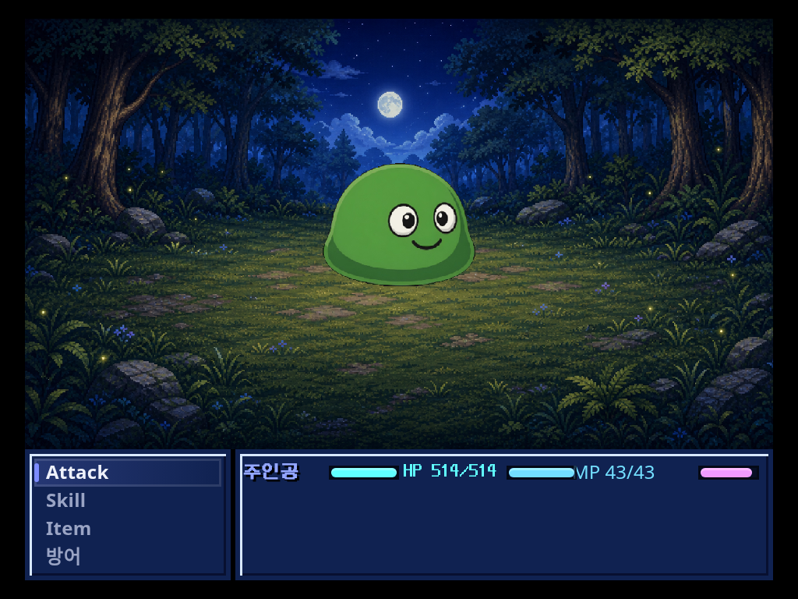 | 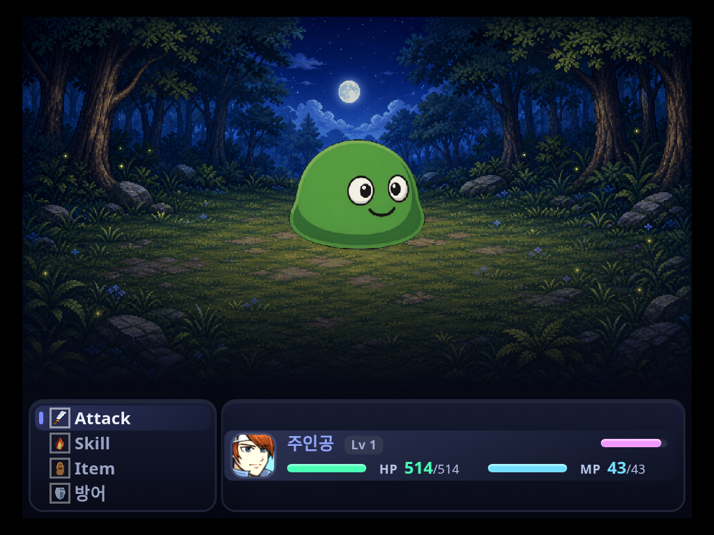 |

- 창: 4px 베벨 + 인셋 하이라이트 → 라운드 12px 유리 카드, 2px 헤어라인 링(box-shadow), 부양 그림자.
  자료집 윈도스킨은 `--battle-window-skin-width: 0` 으로 옵트아웃(`_windowskin.css` 계약 안).
- 글꼴: 픽셀 글꼴 HP/MP 숫자 → `--runtime-ui-font` + tabular-nums. 라벨(HP/MP) 12px 뮤트, 값 16px 잉크색.
- 게이지: 각진 트랙 → 둥근 8px 트랙 + 상단 하이라이트. HP 민트 / MP 하늘 / ATB 보라.
- 커맨드: 아이콘(16px) + 알약 커서(왼쪽 강조 바 + 은은한 그라데이션). 공용 포커스 크롬(남색 그라데이션·
  베벨·안쪽 흰 링)은 끈다.
- 파티: 1~2인은 48px 두 줄 행(얼굴 40px · 이름 · Lv 배지 / 게이지 · 수치), 3인 이상은 24px 한 줄 행.
  카드 안에서 세로 중앙 정렬. 필드 바닥은 그라데이션으로 HUD 바닥색에 녹아든다.

### 4인 파티 · 커맨드 / 스킬 서브메뉴 / 대상 선택

| 전 | 후 |
|---|---|
| 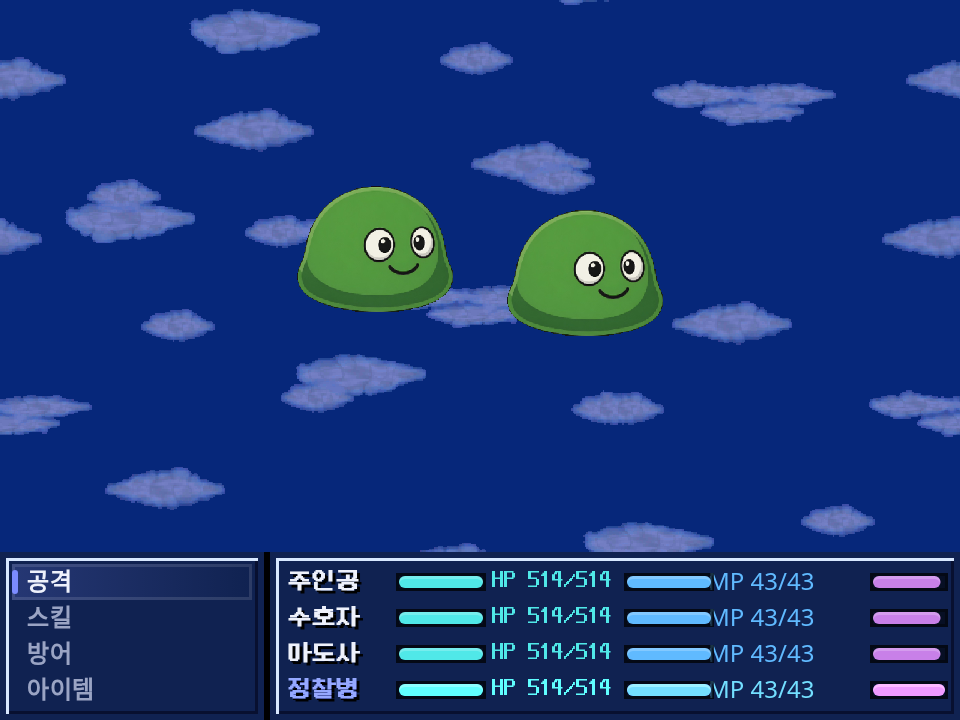 | 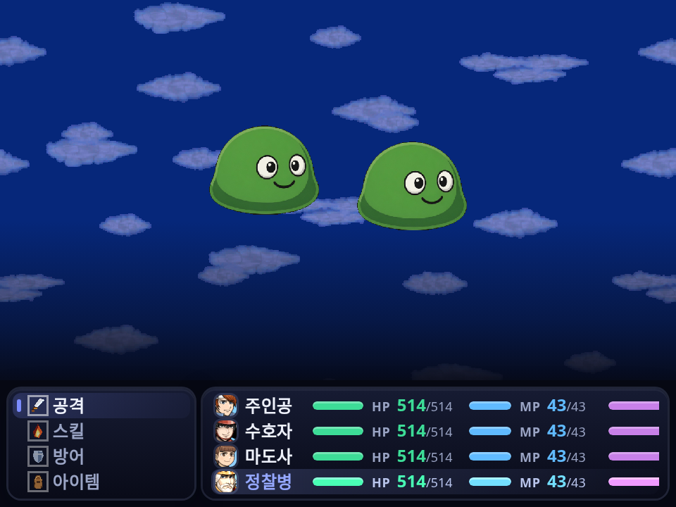 |
| 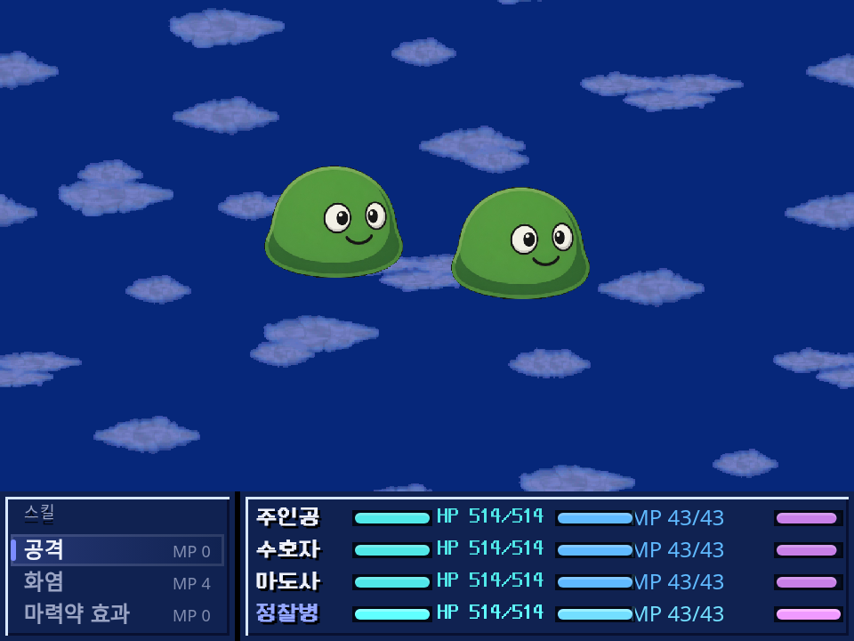 | 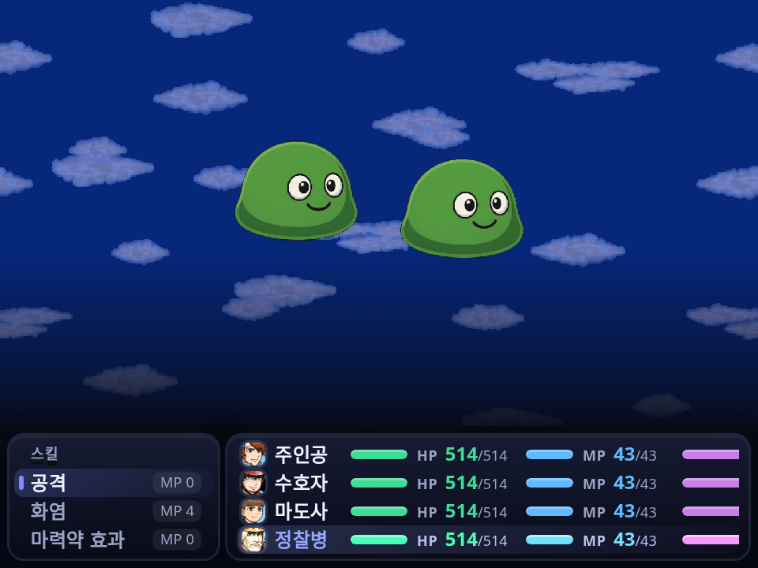 |
| 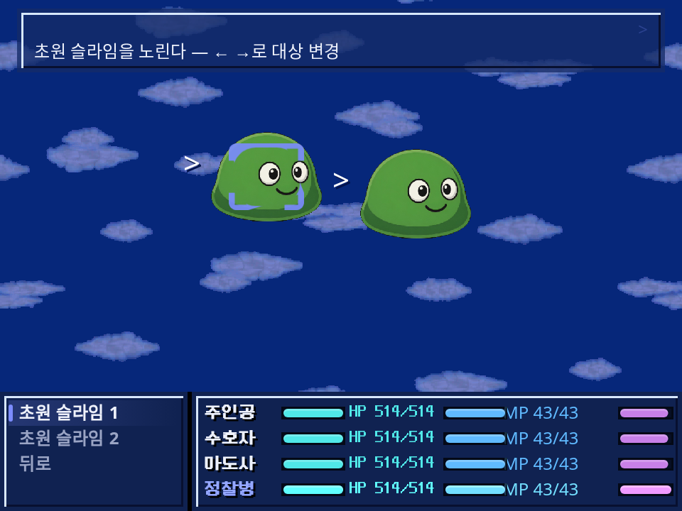 | 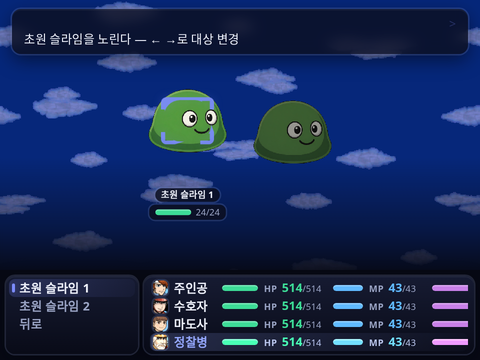 |
| 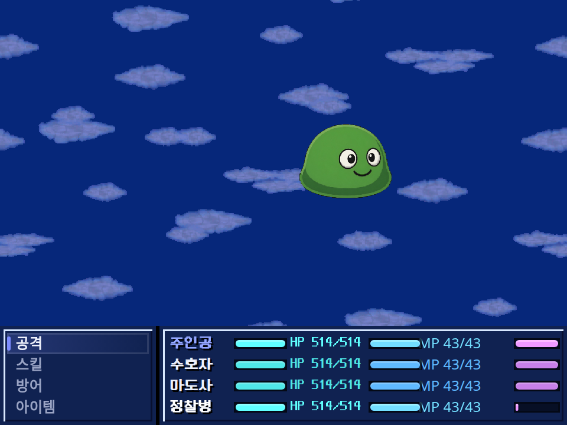 | 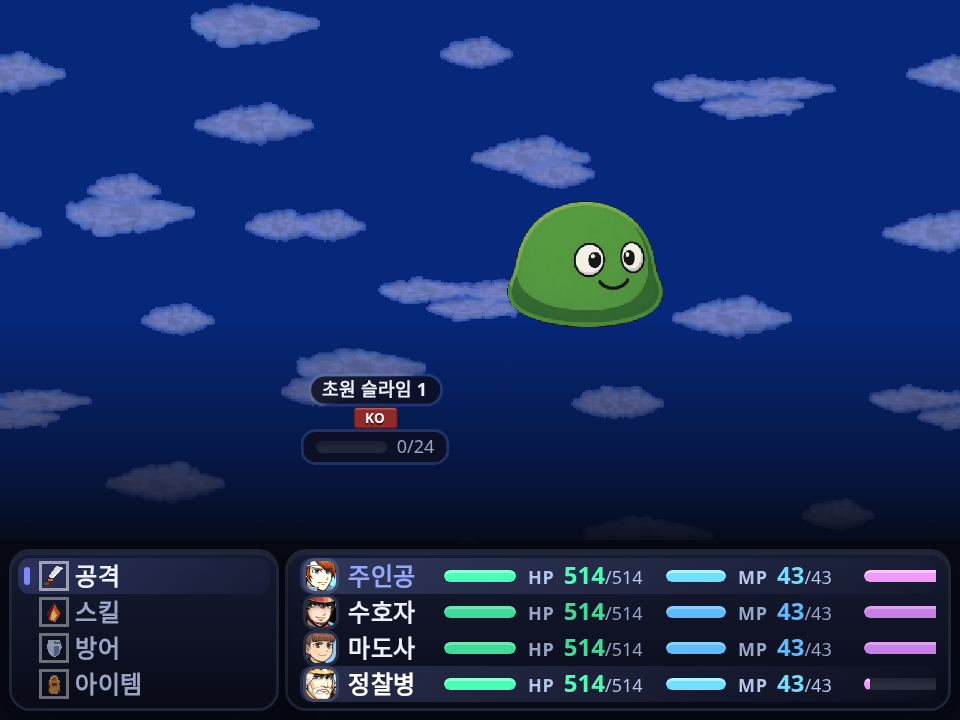 |

- 옛 판은 MP 바가 「MP 43/43」 글자를 덮었다(4인 행 — 위 "전" 사진). 새 판은 열을 분리해 겹침이 없다.
- 행동 단계(4인, 「전 · 행동」 행): 옛 판은 커맨드 창이 숨은 자리에 빈 파란 창이 남았고, 새 판은 파티 카드가 두 열을 쓴다.
- 대상 선택: 공용 `>` 글리프를 접고 코너 리티클만 남긴다. 조준하지 않은 적은 한 단계 어둡게.
  조준한 적(과 한 번이라도 피해를 입은 적)은 이름표 + HP 카드를 스프라이트 발밑에 펼친다 —
  옛 판은 겹(`.battle-enemy-chrome`)을 늘 접어 두어 `17-sprint-a-polish.css` 의 "피해 입은 적 HP 노출"
  규칙이 화면에 닿지 않았다.
- 서브메뉴 상세(`MP n`)는 알약 배지.

### 1인 파티 · 인트로 / 대상 선택 / 임팩트 / 결과

| 인트로 | 대상 선택 |
|---|---|
|  | 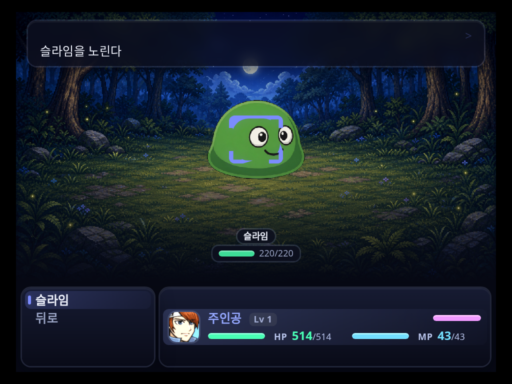 |

| 임팩트 | 결과 |
|---|---|
| 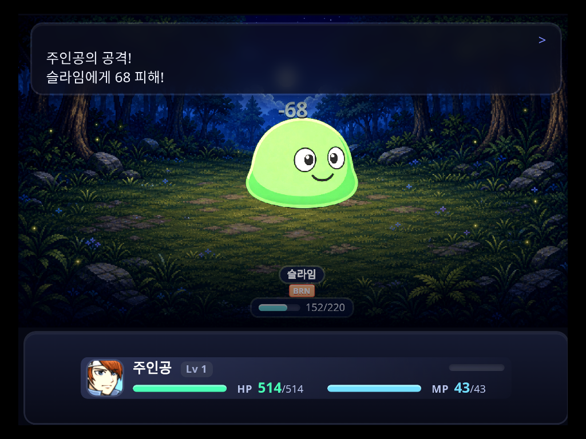 | 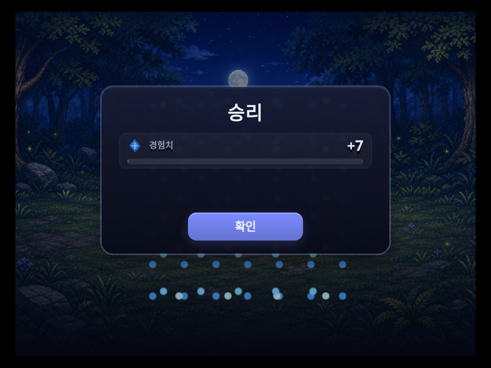 |

| 전 · 결과(4인) | 후 · 결과(1인) |
|---|---|
| 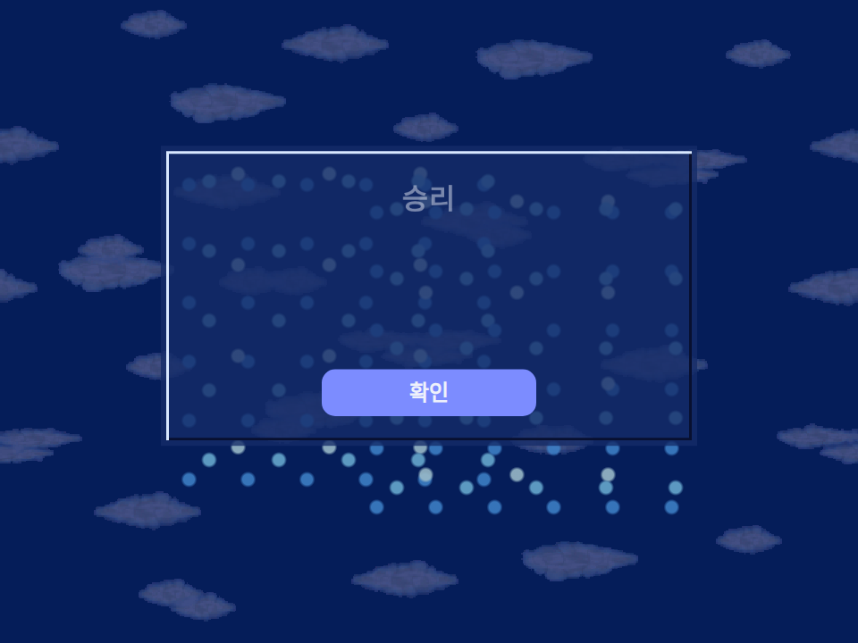 |  |

- 메시지 배너: 상단 유리 스트립(블러). 명령 입력 중에는 숨긴다(옛 판과 같음).
- 결과 카드: 보상 행의 DOM 순서는 라벨·아이콘·값이라 격자 좌표로 앉혀 아이콘·라벨·값 순으로 보인다.
  (흐름에 맡기면 라벨이 20px 아이콘 열에 끼어 「경…」으로 잘렸다 — 첫 촬영에서 실측.)
  결과 단계에서는 쓰러진 적의 KO 배지·HP 카드를 접는다.
- 명령 카드가 숨는 단계에서 파티 카드가 두 열을 차지해도 행은 480px 에서 멈춰 가운데에 선다.

## 4. 유지한 계약

- 기계 감사(`test/battleRm2000PixelGrid.test.ts`): `!important` 0 · px 리터럴 전부 짝수 · font-size 4단계(26/20/16/12) ·
  `--battle-stage-inset-top` 단일 선언 — 전부 통과.
- 배틀러 기하(`BATTLER_PLACEMENTS`, 무대 inset 48px, 필드 액자 0): 옛 판과 동일. 픽스처
  `test/fixtures/battleEnemyFeetRatios.json` 은 키만 `rm2000` 으로 옮겼다(옛 감청 스킨 항목은 삭제).
- 커맨드/대상 행 고정 피치 24px · 간격 0 · 4행 스크롤포트. 라인박스는 22px 로 올려 16px 한글 글꼴의
  위아래 잘림(옛 판 12.8%, battle-text 감사 실측 111건)을 없앴다.
- hex 리터럴 0(css 예산 래칫), 색은 스킨 테마 변수·`--runtime-glass-*` 별칭만.

## 5. 검증

| 검사 | 결과 |
|---|---|
| `tsc --noEmit -p tsconfig.app.json` | 통과 |
| vitest 관련 16파일 | 스킨·전투·픽스처·brand 라벨 테스트 통과. 실패 2건은 main 선행 상태(`fontFamilyTokenGuard` 의 database CSS 2건, `detsukuruBrandStrings` 의 `runtimeDebugPanel.ts:20` 주석) — 이 변경과 무관 |
| `test/databaseSystemStudio.test.ts` | main 에서 빨갔던 라벨 기대(「유리 창 · 사이드뷰」)를 새 라벨로 고쳐 초록 |
| `node scripts/qa/battle-text-audit.mjs --skins rm2000` | 위반 **111 → 0** |
| `node scripts/runtime-qa.mjs --scenario battle-rm2000` (게이트) | 통과 |
| `node scripts/runtime-qa.mjs --scenario battle-rm2000-tour` | 통과(사진 5장) |
| `node scripts/check-css-graph.mjs` · `check-css-live-classes.mjs` | 통과 |
| `npm run gates:css` (예산 래칫) | 실패 — 전부 main 선행 위반(database/editor CSS). 이 변경은 hex 0 · `!important` 0 · CSS 파일 수 −1. 기준선은 저장하지 않았다(무관한 위반을 세탁하지 않기 위해) |

미실행: `test/e2e/battle-rm2000-pixel-qa.spec.ts`(편집기 셸 경로 e2e). 이 스펙의 기하 상수(168/192)는
이미 main 의 CSS(176/112)와 어긋나 있었고 편집기 test-play 경로 자체가 main 에서 실패한다는 기록이 있다
(`scripts/qa/runtime/battle-rm2000.scenario.mjs` 머리 주석). 새 HUD 기하(184/120)로 상수를 갱신해 두었다.

## 6. 2차 개선 — "아직 아쉽다" 에 답한 것 (같은 PR, 2026-09-03)

1차 사진을 기준으로 다시 감사했다. 카드는 좋아졌지만 **전투가 일어나는 느낌**이 약했다 — 막타에
화면이 번쩍이지 않고, 아군이 맞아도 화면 어디에도 신호가 없고, 4인 파티에서 누가 명령을 고르는지
시선이 멀고, 카드 아래는 그냥 검은 띠였다. 그리고 남색 유리 위 남보라 강조는 전형적인 "AI 보라
그라데이션" 으로 읽혔다.

| 1차 (PR 첫 커밋) | 2차 |
|---|---|
|  | 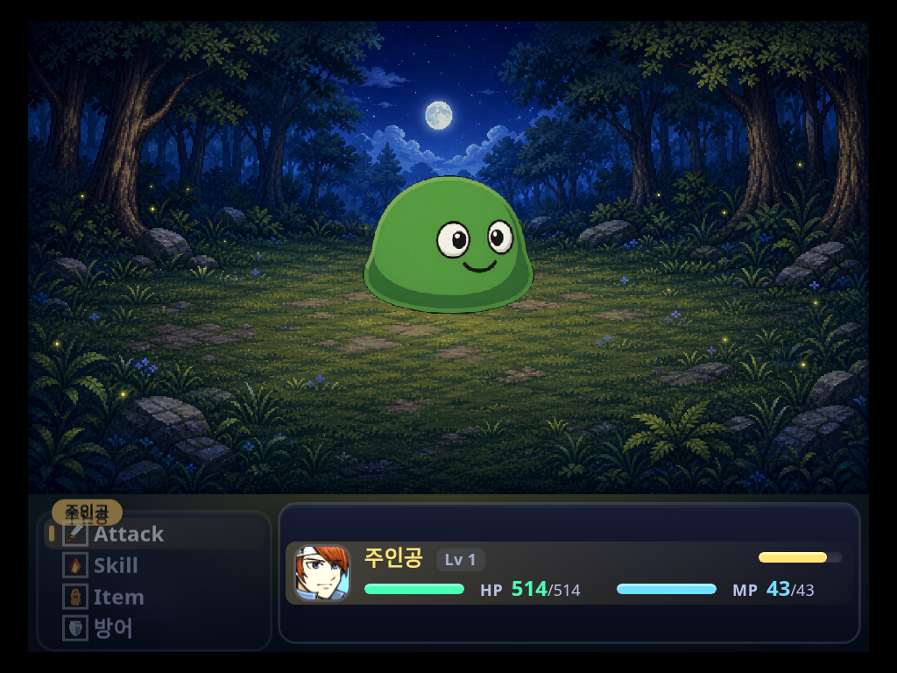 |
|  | 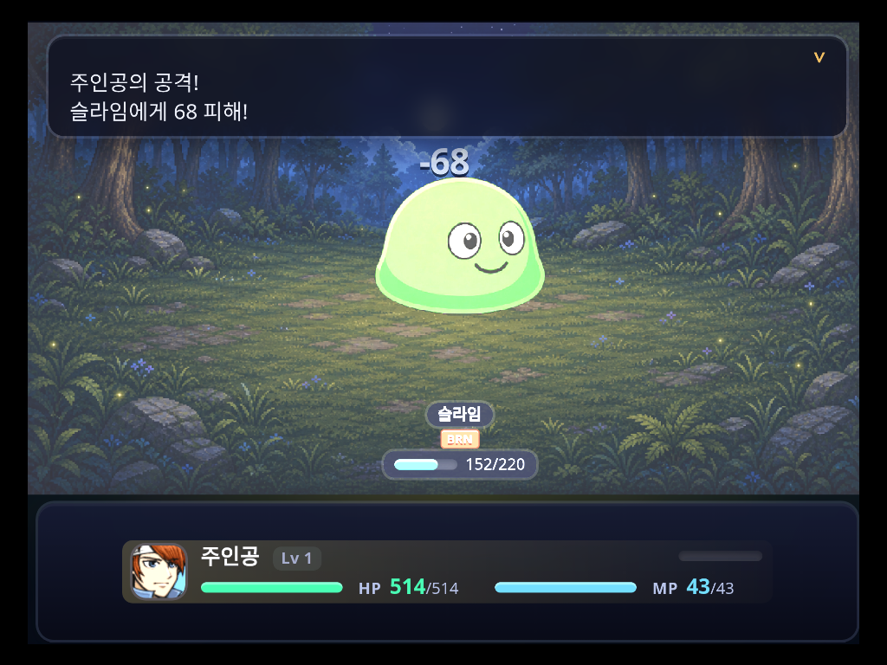 |
|  | 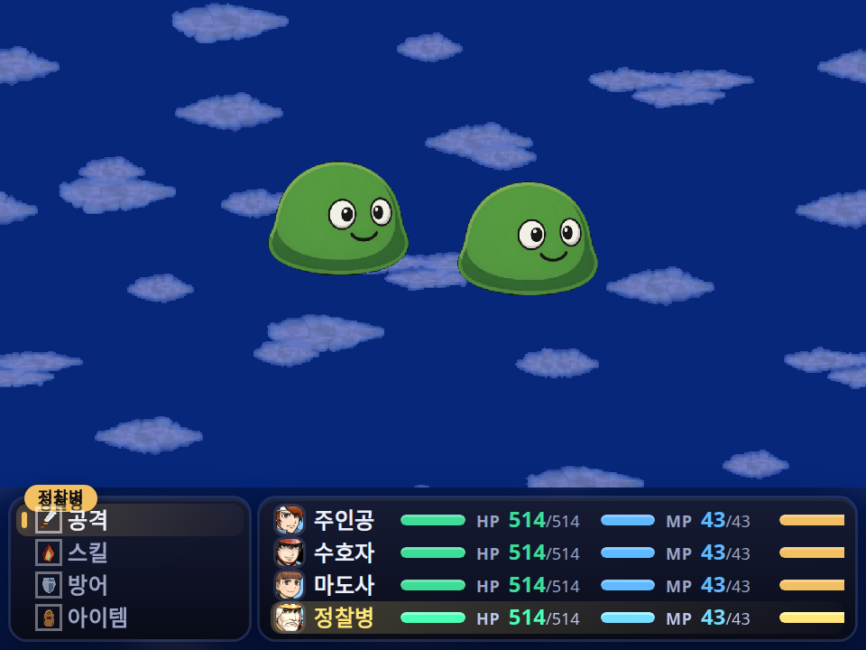 |
|  | 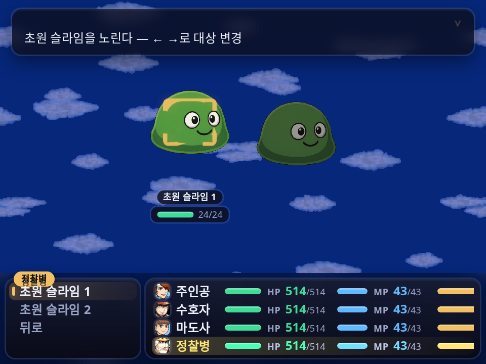 |
|  | 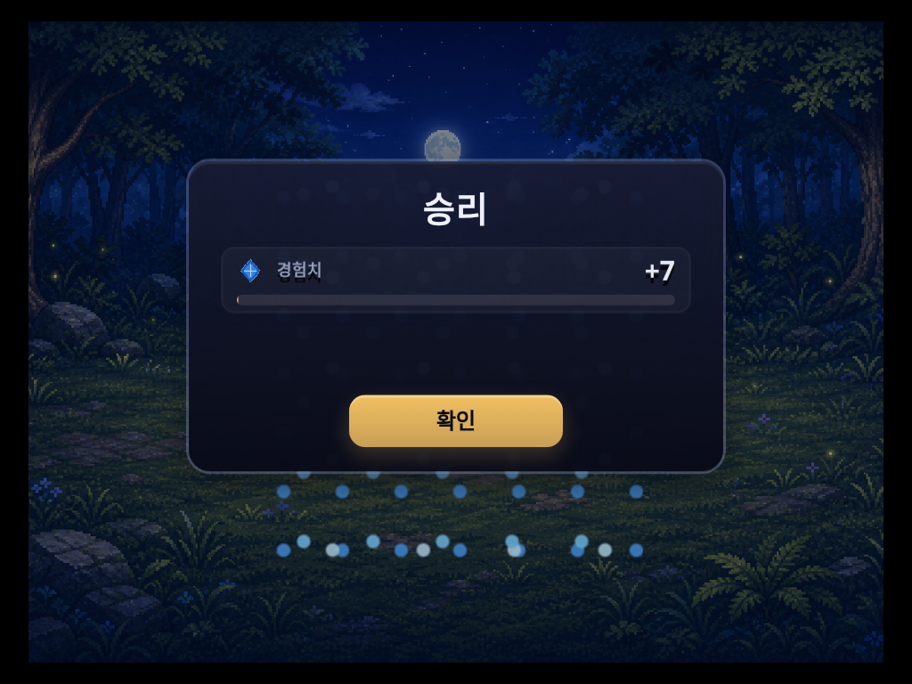 |

| 2차 · 엄격 턴제 명령(진행 칩) | 2차 · 아군이 맞는 순간 |
|---|---|
| 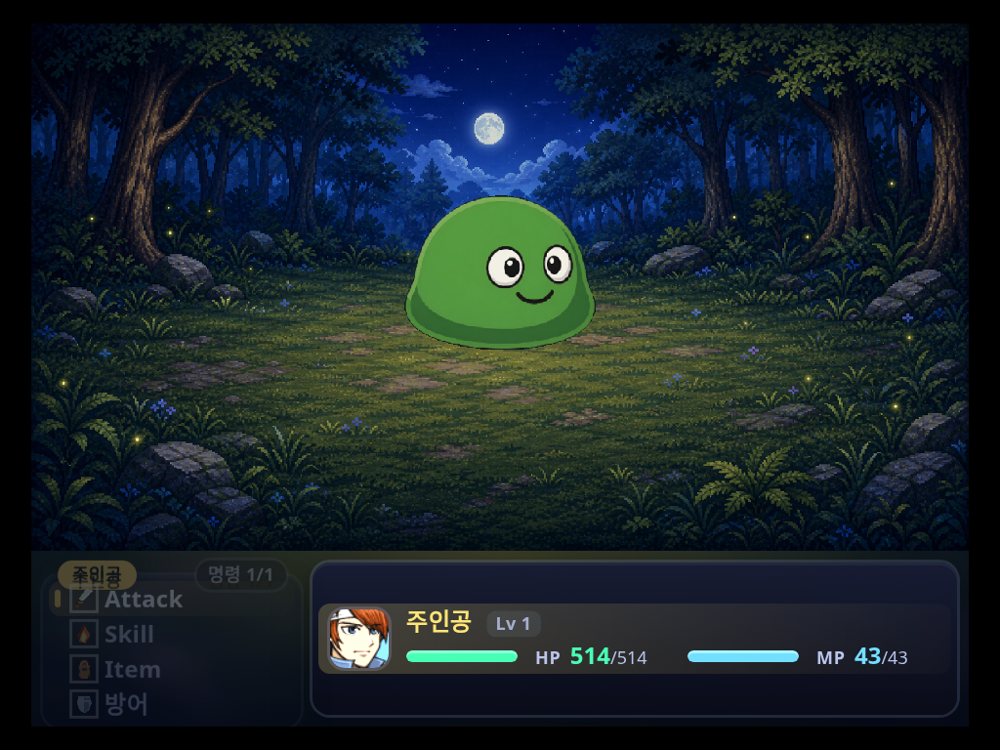 | 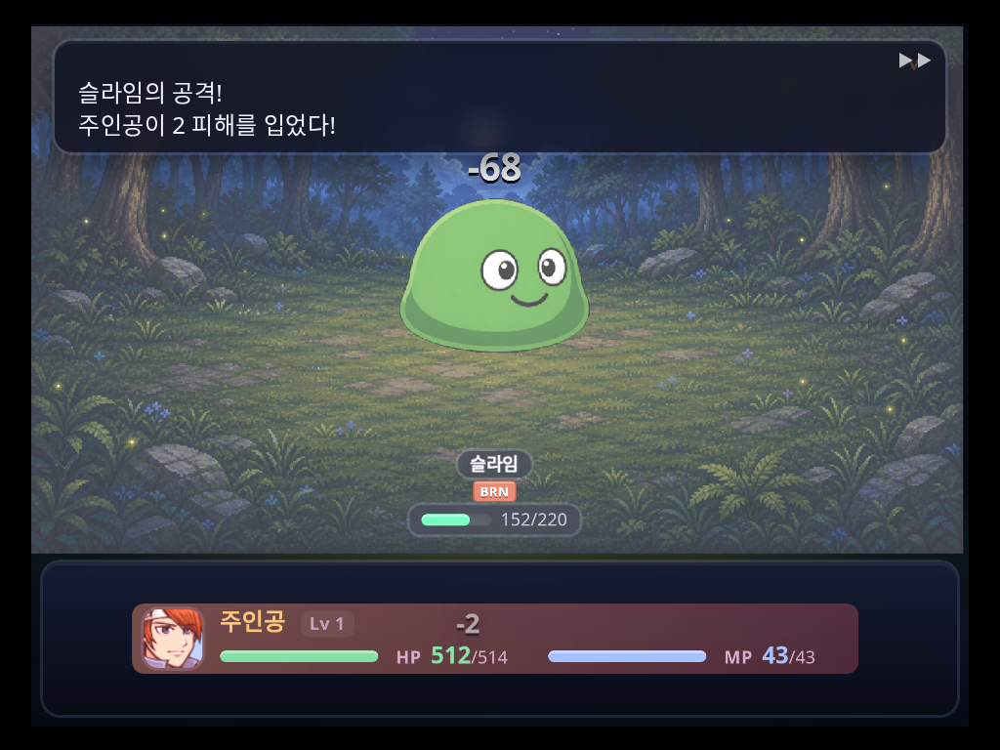 |

### 바뀐 것

- **히트·크리티컬·승리·패배 플래시 복구.** 공용 플래시는 `.battle-field::after` 를 칠하는데(15-juice-capture-fx.css),
  옛 판부터 스킨이 같은 특정도로 `::after` 배경을 덧써 네 플래시가 전부 죽어 있었다. 스킨의 바닥 페이드를
  `::before` 로 옮기고 `::after` 재정의는 `:not(.battle-flash-*)` 일 때만 걸어 막타에 화면이 번쩍인다(위 "2차 임팩트").
- **아군 피해가 파티 카드 행에 뜬다.** 정면 스킨은 필드에 아군 노드가 없어 피해 팝업이 앵커를 잃고 필드 좌상단에
  떠 있었다(누가 맞았는지 읽을 수 없음). `battleFieldDom.showPartyRowDamage` 가 파티 카드의 해당 행 HP 수치 위에
  팝업을 앉히고 행에 `is-hit` 를 480ms 붙인다 — 행이 흔들리고 붉게 번쩍인다.
- **턴 칩.** 명령 카드 윗변에 지금 고르는 액터의 이름(호박색 칩). `battleCommandDom` 이 패널에 `data-actor-name` 을
  심고 스킨이 `attr()` 로 그린다. 엄격 턴제의 「명령 n/N」은 오른쪽 유리 칩 — 옛 판은 이 노드가 1행을 차지하도록
  배치하고 display:none 으로 접어, 메뉴가 2행으로 밀려 스크롤포트 밖으로 나가는 잠재 결함이 있었다.
- **HUD 띠 뒤로 전장이 이어진다.** 루트 `::before` 가 같은 배경 그림을 흐리게(blur 12px) 깔고 스크림으로 눌러,
  카드가 검은 띠가 아니라 전장 위에 뜬 것처럼 읽힌다. 그림 url 은 battleDom/battleFieldDom 이 루트에
  `--battle-backdrop-url` 로 비춘다(배틀러 기하는 필드 안 그대로).
- **강조색을 호박색 하나로.** 커서·차례 액터·ATB·확인 버튼·크리티컬 팝업이 전부 `#f2c063`. 남보라(#7c8cff) 는
  남색 유리와 붙어 "AI 보라 그라데이션" 으로 읽혔고 초록 몬스터 위 리티클 대비도 약했다. HP 민트·MP 하늘은
  의미색이라 그대로. 확인 버튼 글자는 바닥색(호박 위 흰 글자는 대비 미달).
- **모션.** 명령 카드가 차례마다 아래에서 올라오고(220ms), 메시지 배너는 위에서 내려오고(200ms), 결과 카드는
  살짝 커지며 나타난다(260ms). 전부 transform/opacity. `prefers-reduced-motion` 에서 꺼진다.
- **수치 색이 게이지 상태를 따른다**(HP 51% 이상 민트 → 21~50% 노랑 → 20% 이하 빨강 + 깜빡임).
  피해 팝업은 보통 흰색 · 크리티컬 호박 · 회복 민트 · 빗나감 뮤트 이탤릭. 메시지 캐럿 `>` 는 90° 돌려 아래 화살표.

### 검증 (2차)

| 검사 | 결과 |
|---|---|
| `tsc --noEmit -p tsconfig.app.json` | 통과 |
| vitest 전투·스킨·QA 하네스 56파일 | 실패 4건 = HEAD 기준선과 집합 동일(회귀 0) |
| `battle-text-audit --skins rm2000` | 위반 0 |
| `runtime-qa --scenario battle-rm2000`(게이트) · `battle-rm2000-tour` · `battle-rm2000-tour-strict` | 통과 |
| 픽셀 격자 감사(`battleRm2000PixelGrid`) | 통과 — `!important` 0 · 짝수 px · 폰트 4단계 |

하네스 보강: `pressUntil` 이 `attr`/`value` 로 같은 testid 중 특정 요소(피해 팝업의 `data-target-id`)를 기다릴 수 있다.
엄격 턴제 픽스처 `test/fixtures/projects/battle-v3-strict.json` 을 추가했다(ATB 에서는 주인공이 슬라임보다 빨라
슬라임이 행동하기 전에 이겨 아군 피격 장면을 찍을 수 없다 — 실측 z 60회).
