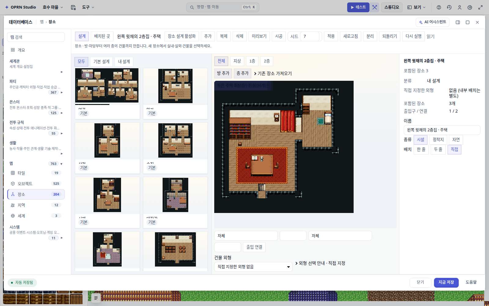
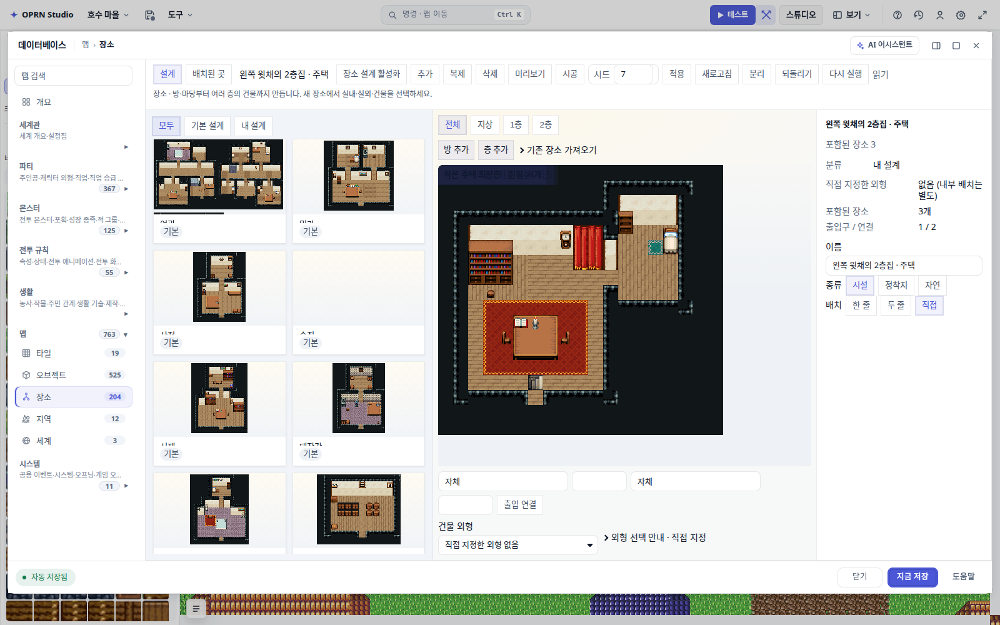
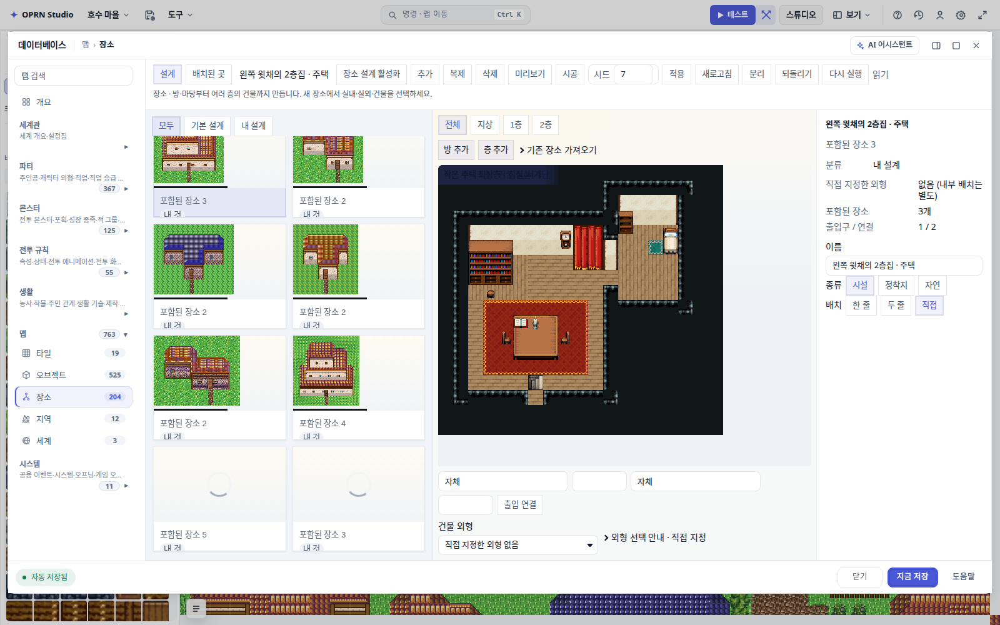
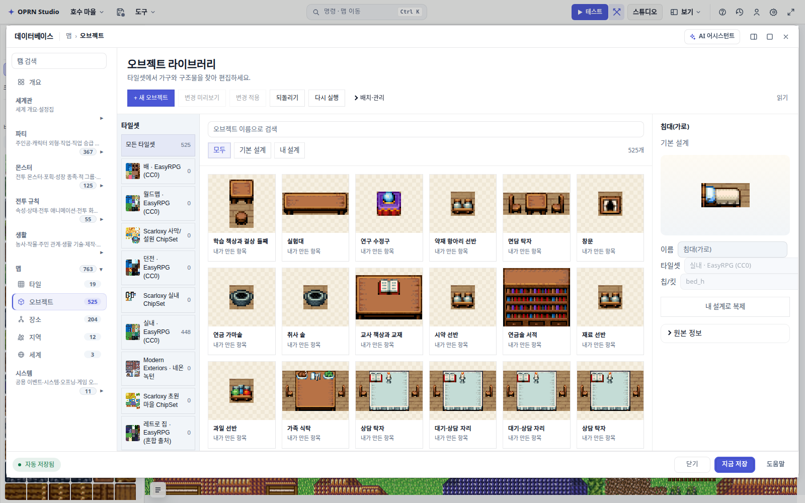
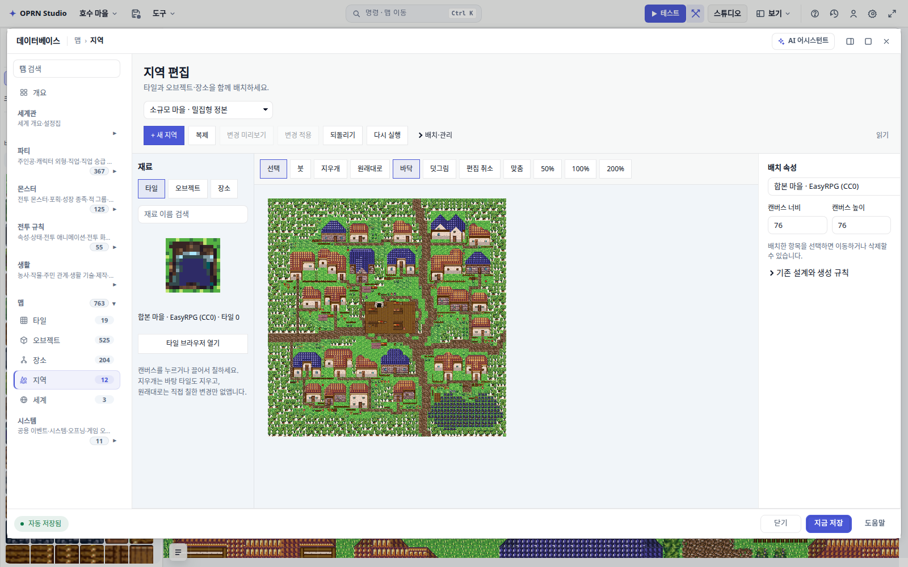

# 데이터베이스 「맵」 탭 로딩 — 2026-09-15 측정

사용자 신고: 데이터베이스의 **장소·오브젝트·지역** 탭이 너무 느리다.

측정 대상은 실앱이다. 프로젝트는 개발 서버가 자동으로 여는 실제 작업물 «호수 마을»
(장소 카드 204장 · 오브젝트 525개 · 지역 12개). 브라우저는 headless Chromium 1600×1000.
재현: `npm run dev:worktree -- --port 9973` 뒤 `npm run measure:db-map-tabs -- http://127.0.0.1:9973 <라벨>`.

세 숫자를 잰다.

| 이름 | 뜻 |
| --- | --- |
| 클릭차단 | 탭 버튼 클릭이 **동기로** 붙잡는 시간. 사용자가 «멈췄다»고 느끼는 구간 |
| 보이는썸네일완료 | 화면 안 자리표시자가 전부 그림이 될 때까지. 미룬 비용을 측정 밖으로 숨기지 않으려고 같이 잰다 |
| 재렌더 | 같은 탭을 다시 눌렀을 때. 셸은 카드 선택·Escape·검색 입력마다 통째로 다시 렌더된다 |

## 1. 증상 (before)

`2026-09-15-db-map-tab-perf/tabs-before.json` — 고치기 전 첫 측정.

```
타일       클릭차단=    78ms   재렌더=    61ms   cards= 19
오브젝트    클릭차단=    63ms   재렌더=    42ms   cards= 48
장소       클릭차단= 34975ms   재렌더= 35510ms   cards=204
지역       클릭차단=  2791ms   재렌더=    96ms   cards=  0
세계       클릭차단=   251ms   재렌더=    37ms   cards=  0
```

**장소 탭은 35초 동안 UI가 멈춘다. 캐시가 없어 다시 눌러도 같은 35초를 또 낸다.**

## 2. 원인 (CPU 프로파일)

`2026-09-15-db-map-tab-perf/profile-places-before.txt` — 장소 탭 클릭 한 번, 총 36.3초.

```
29.3%  10645ms  cloneJson                 guards.ts:25
11.1%   4044ms  record                    guardValues.ts:23
10.7%   3884ms  compileSpatialOccurrence  compileSpatialOccurrence.ts:19
 9.3%   3368ms  compilePlaces             compilePlaces.ts:15
 8.4%   3037ms  deserialize               serialize.ts:27
 5.7%   2066ms  (anonymous)               guardValues.ts:10
 4.4%   1588ms  (garbage collector)
```

체인은 이렇다.

```
renderSpatialGalleryCard        카드마다
→ renderSpatialCardThumb
→ renderPlaceCardThumb
→ previewPlaceMaps
→ compileSpatialOccurrence      ← 첫 줄이 deserialize(JSON.stringify(project))
```

즉 **썸네일 한 장이 프로젝트 전체를 직렬화·역직렬화·재검증한다.** 카드 204장이면 204번이다.
갤러리는 그 일을 마운트 렌더에서 동기로, 캐시 없이, 카드 전부에 대해 한다.

지역 탭은 다른 지점이다. 갤러리 카드를 아예 쓰지 않고(`cards=0`) 선택된 지역의 마을 합성
래스터를 굽는다. 그 안에서 `assertHouseProtection`(houseProtection.ts) 이 2.5초 중 1.9초를
먹고 있었다 — 마을 한 채를 지을 때마다 세 번 불리는데, 집 짝마다 `before.find(...)` 로 훑고
`new Set(...cells.map(cellKey))` 를 **안쪽 루프에서** 다시 만들어 집 H채·칸 C개에
O(H²·C) 의 문자열을 찍었다. (`2026-09-15-db-map-tab-perf/profile-regions-mid.txt` 는 첫 손질만 넣었을 때의 중간 상태다:
1.9초 → 약 0.94초.)

## 3. 고친 것

1. `src/editor/panels/spatialCardThumbs.ts` (신규) — 갤러리 썸네일을 **미루고 기억한다**.
   카드는 자리표시자로 먼저 붙고, 화면에 들어온 칸부터 프레임 예산(8 ms)만큼 굽는다.
   구운 그림은 프로젝트 세대(`tilesets`/`maps`/`spatialAuthoring` 객체 정체성) 단위로
   보관해 재렌더가 컴파일을 다시 내지 않는다.
2. `src/editor/tools/houseProtection.ts` — `assertHouseProtection` 의 판정은 그대로 두고
   소유자 색인·셀 키 집합을 한 번만 만들고, 짝 검사 앞에 **실제 칸에서 잰** 경계 상자로
   가지친다. 경계를 rect 로 잡으면 지붕 데크 사다리처럼 rect 밖 칸이 검사에서 빠진다 —
   `test/houseProtection.test.ts` 의 «rejects an overlap that only touches a roof-deck
   ladder outside the house rect» 가 그것을 잡는다(rect 기준으로 바꾸면 실패한다, 실측).

## 4. 결과 (같은 세션 교차 측정)

같은 브라우저·같은 프로젝트에서 before/after 를 번갈아 두 번씩 돌린 뒤 각 항목의 최솟값.
원본: `2026-09-15-db-map-tab-perf/ab-before-{1,2}.json`, `…/ab-after-{1,2}.json`.

| 탭 | 클릭차단 before | 클릭차단 after | 재렌더 before | 재렌더 after |
| --- | ---: | ---: | ---: | ---: |
| 타일 | 85 ms | 48 ms | 67 ms | 49 ms |
| 오브젝트 | 77 ms | 50 ms | 60 ms | 46 ms |
| **장소** | **44,248 ms** | **1,102 ms** | **43,363 ms** | **1,155 ms** |
| **지역** | **3,766 ms** | **1,665 ms** | 130 ms | 95 ms |
| 세계 | 383 ms | 234 ms | 43 ms | 25 ms |

**장소 40배, 지역 2.3배.**

최종 코드로 기계가 쉬는 상태에서 한 번 더(`2026-09-15-db-map-tab-perf/ab-after-final.json`) —
여기서 «보이는썸네일완료» 까지 본다.

```
타일      클릭차단=  42ms  보이는썸네일완료=   0ms  재렌더=  43ms
오브젝트   클릭차단=  46ms  보이는썸네일완료=   0ms  재렌더=  34ms
장소      클릭차단= 994ms  보이는썸네일완료=1067ms  재렌더=1047ms
지역      클릭차단=1389ms  보이는썸네일완료=   0ms  재렌더= 105ms
세계      클릭차단= 239ms  보이는썸네일완료=   0ms  재렌더=  39ms
```

즉 장소 탭은 **1초에 열리고 1.1초면 보이는 썸네일이 다 찬다**. 예전에는 35초 동안
아무것도 못 했다.

측정 편차 주의: 이 기계는 부하에 따라 같은 탭이 2배까지 흔들린다(타일 탭이 42~93 ms).
그래서 4절의 before/after 는 **같은 세션에서 번갈아** 잰 값이다.

오브젝트 탭의 실제 통증은 탭 전환보다 **입력마다 오는 재렌더**였다
(`2026-09-15-db-map-tab-perf/objects-before.json` / `2026-09-15-db-map-tab-perf/objects-after.json`).

| | before | after |
| --- | ---: | ---: |
| 검색 한 글자 | 최대 13 ms | 최대 5 ms |
| 카드 선택 | 67 ms | 23 ms |

## 5. 그림이 그대로인지

썸네일이 다 구워진 시점의 장소 탭은 고치기 전과 같은 화면이다.

| before | after |
| --- | --- |
|  |  |

갤러리를 2000 px 내리면 화면에 들어온 카드가 차례로 구워진다. 자리표시자 상태에서는
회전 표시가 칸을 지킨다.



오브젝트·지역 탭도 각각 화면 안 미완 썸네일 0개다.





## 6. 테스트 회귀

`npm run test:changed` 는 이 저장소에서 원래부터 실패가 있다. 깃발이 오른 30개 파일을
**같은 기계에서 변경 유무만 바꿔** 돌린 결과가 같다.

```
변경 전: Test Files 9 failed | 21 passed (30)   Tests 13 failed | 330 passed (343)
변경 후: Test Files 9 failed | 21 passed (30)   Tests 13 failed | 330 passed (343)
```

실패 13건의 목록도 항목까지 같다(aiAssistantSession · aiCompletionAccounting ·
interiorObjectCatalog · interiorPipelineMapReplacement · interiorRoomWalkabilitySeal ·
modeTransitions · placeConceptTool ×2 · spatialAssetResolver ×4 · workPlanMapOutcomes).
**이 변경으로 새로 깨진 테스트는 없다.**

한 번은 변경 후에만 12건이 더 실패했는데 전부 타임아웃 계열이었고, 그 파일들만 따로
돌리니 86/86 통과했다 — 브라우저 측정과 테스트를 동시에 돌린 부하 때문이다.

CSS 게이트(`npm run gates:css`)의 FAIL 집합도 변경 전후가 바이트 단위로 같다(528건, 기존값).

## 7. 남은 것 (이 PR 범위 밖)

- 장소 썸네일 한 장이 아직 ~1초다. `compileSpatialOccurrence` 첫 줄의
  `deserialize(JSON.stringify(project))` 가 프로젝트 크기에 비례하는 상수다. 썸네일은
  그 «제안 경계» 검증이 필요 없지만, 입력을 줄이면 컴파일 판정이 바뀔 수 있어 따로 다뤄야 한다.
- 지역 탭의 남은 1.6초는 선택된 지역의 마을 합성 래스터를 한 번 굽는 값이다.
  `2026-09-15-db-map-tab-perf/profile-regions-after.txt` 기준 이제 1위는 보호 검사가 아니라 마을 빌드 자체다
  (`decorateVillageSpaces` 622 ms · `mixedCompositionRaster` 436 ms ·
  `computeReachableCells` 273 ms · `buildVillageDomain` 225 ms). 보호 검사는
  `houseIndexOf` 405 ms + `assertHouseProtection` 226 ms 로 내려왔다.
  스테이지 미리보기도 미루면 더 줄지만 그 보드는 상호작용 편집면이라 별도 설계가 필요하다.
