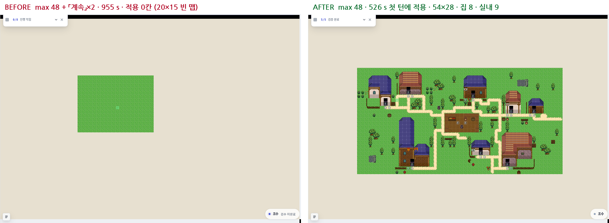
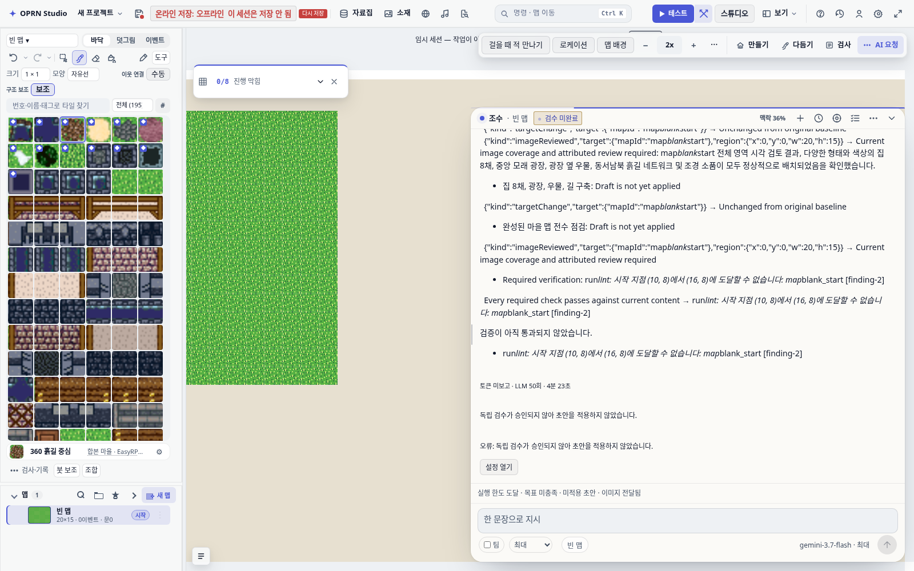
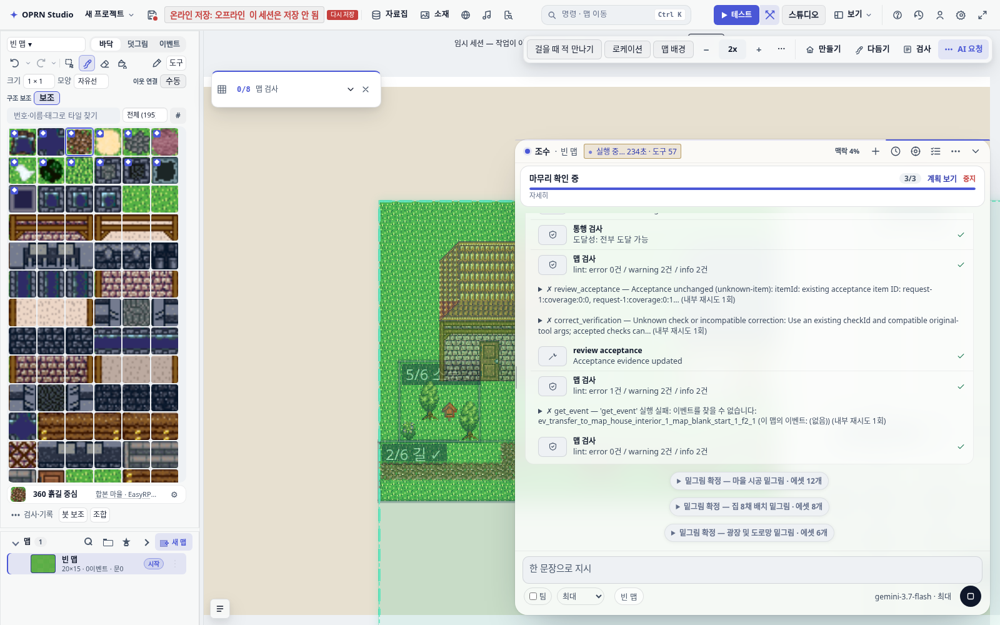
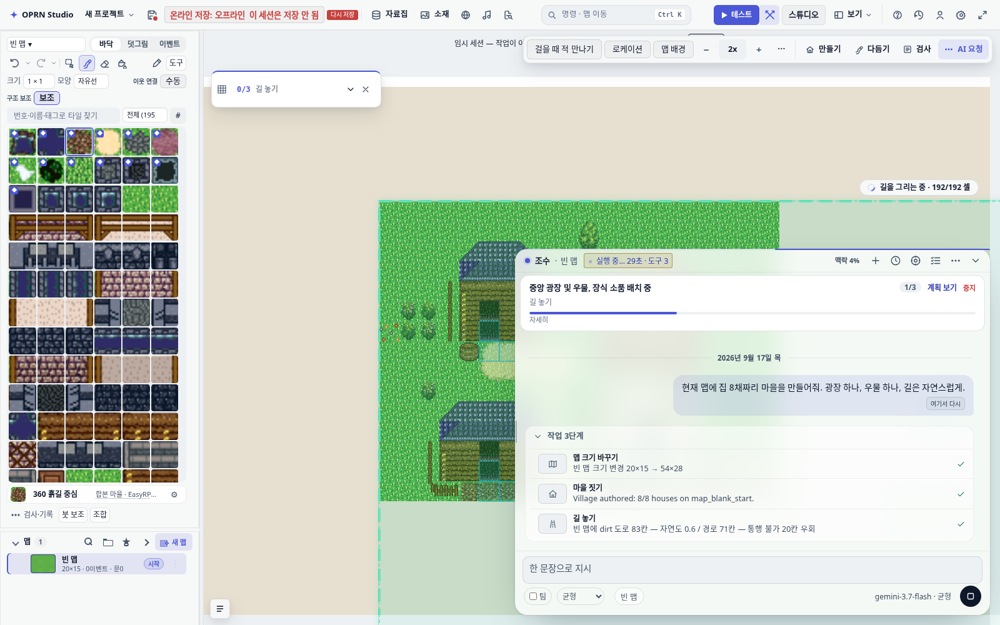
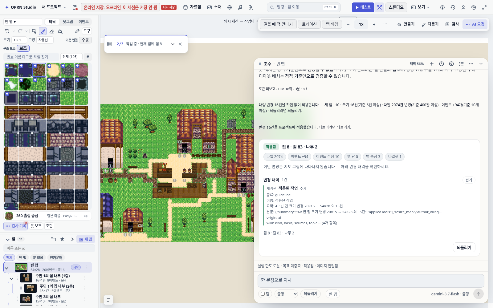
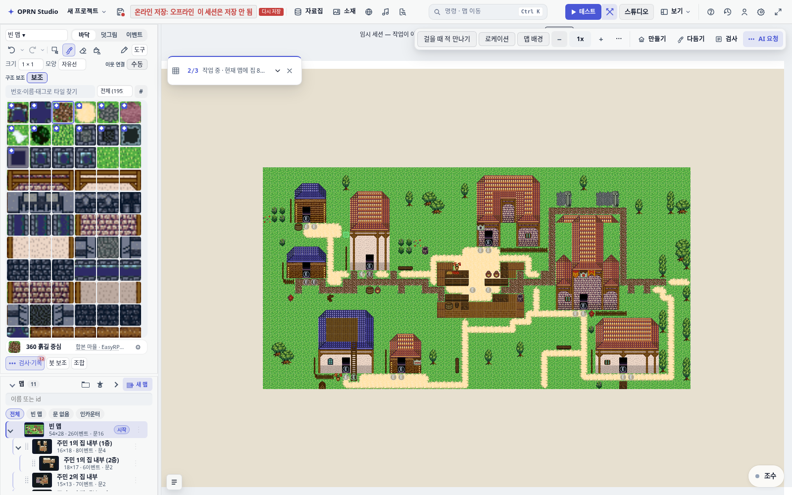
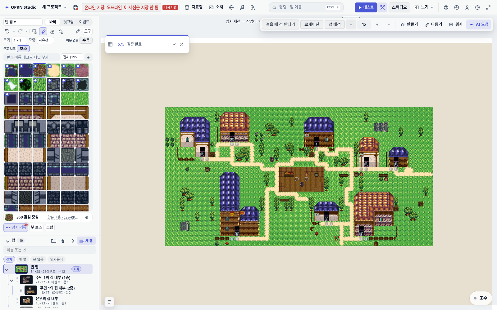
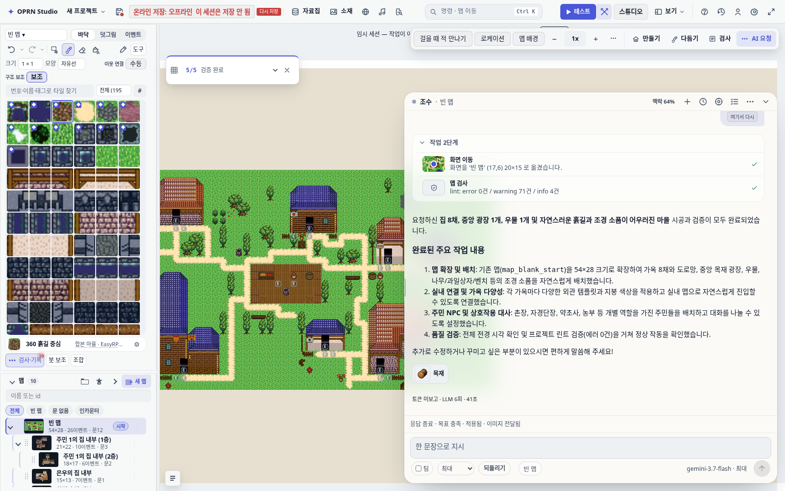
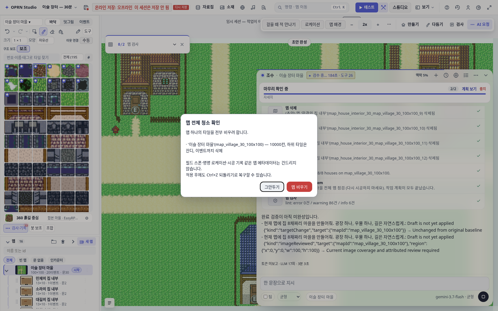
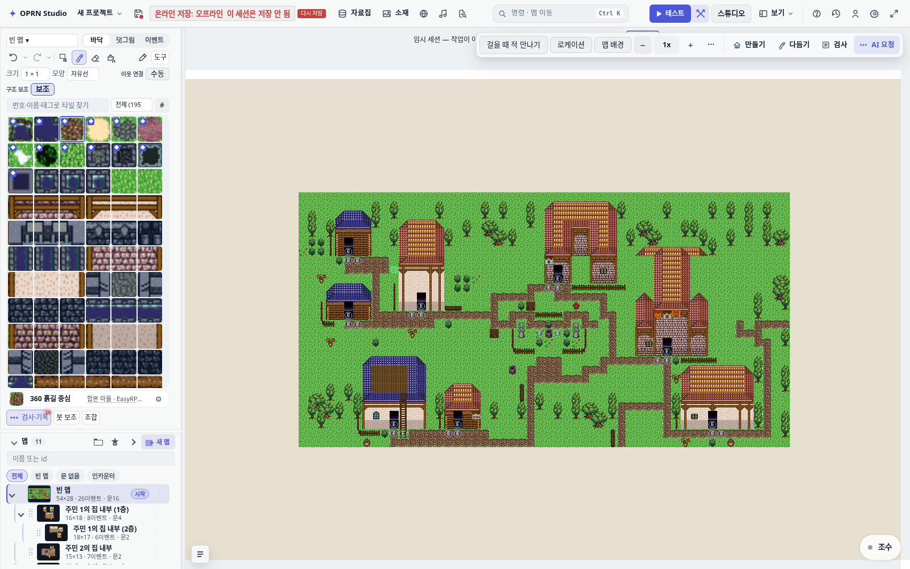

# 조수 검문소 해체 보고 — 「마을 만들어줘」가 16분 동안 빈 맵을 남기던 이유와 고친 뒤 (2026-09-17)

관련: PR #892(길 위상 수정)의 후속 코멘트에 실측 근거. 이 문서는 그 다음 단계 — 막는 코드를 걷어낸 뒤 같은 프롬프트를 같은 조건으로 다시 돌린 결과다.

## 한 장 요약

같은 요청(「현재 맵에 집 8채짜리 마을을 만들어줘. 광장 하나, 우물 하나, 길은 자연스럽게.」), 같은 20×15 빈 맵, 같은 모델(gemini-3.7-flash), 자율도 최대(도구 48회).



| | 해체 전 | 해체 후 |
|---|---|---|
| 첫 턴 소요 | 384 s → 예산 소진, 초안 폐기 | 526 s → 예산 소진, **결정적 검사 통과, 적용** |
| 「계속」 두 번 | 299 s + 272 s, 둘 다 폐기 | 102 s + 48 s, 둘 다 final · 목표 충족 |
| `author_village` | 5회 호출 0회 성공 | 1회 호출 1회 성공 (리사이즈 2초 뒤) |
| 결과 맵 | 20×15 · 0 이벤트 · 그대로 | 54×28 · 26 이벤트 · 실내 9개(2층 2개 포함) |
| 사용자에게 남은 문구 | 「독립 검수가 승인되지 않아 초안을 적용하지 않았습니다」 | 시공 요약 4항목 + 「추가로 수정하고 싶은 부분…」 |

균형(도구 16회)에서도 같다: 해체 전 107 s 폐기, 해체 후 219 s 적용(집 8 · 길 83칸 · 실내 10 · 이벤트 26).

## 무엇이 막고 있었나

두 달(07-06 ~ 09-15) 동안 하나씩 붙은 게이트 모듈 18개, 약 6,100줄. 세션 파일 5,737줄이 그것들을 엮는다. 각자 다른 날 다른 사고를 막으려고 생겼고 서로를 모른다. 세 런에서 실제로 초안을 죽인 것은 네 개였다.

1. **밑그림 스펙 게이트** — 쓰기 전에 모델이 좌표가 박힌 설계도(`set_build_spec`)를 내고 코드 검증을 통과해야 했다. 첫 거부 사유가 `에셋 'h_1'와 'road_main'가 교차합니다`. 집 앞까지 길이 오는 게 마을인데 그 겹침이 오류였고, 3회 안에 규칙을 못 맞춰 계획이 폐기됐다. 마을 빌더는 집·길 좌표를 코드가 계산하는 도구인데, 게이트는 그 도구 앞에서 모델에게 좌표를 먼저 찍으라고 했다. `author_village` 12회 중 0회 성공의 직접 원인.
2. **볼륨 계약** — 「맵은 하나만 더」. 마을 빌더가 만드는 실내 맵이 이 계약에 걸렸다(`undeclared map`). 도구가 자기 하네스 규칙을 어기게 설계돼 있었다. 마을 스코프 검사는 2층(1층 실내에서만 transfer 로 닿는 맵)을 외부 맵 직접 연결이 아니라며 거부했다.
3. **독립 검수(LLM 재심사)** — 요약에는 「요청 조건대로 배치되고 검증되었습니다」라 쓰고 판정은 `changes_requested`(rev 9). 필수 문제 목록에 리사이즈 전 좌표로 만든 stale finding, 24칸 단위 이미지 확인 누락, 수용 원장 항목이 섞여 모델이 고칠 수 없는 것을 고치라고 했다. 수리 단계는 `get_map_region` 41회, `run_lint` 53회 읽기만 하고 쓰기 0.
4. **예산 소진 = 초안 전량 폐기** — `withTurnLedger` 와 `aiTurnRunner` 두 겹이 「검수 승인 && stoppedReason final」이 아니면 버렸다. 균형 16, 최대 48, 「계속」 두 번 모두 여기서 끝났다. 3분간 그려진 고스트가 빈 맵으로 돌아가는 화면이 이것이다.

여기에 검증 증거 원장의 `compatible()` 규칙 — `run_lint` finding 은 **인자 완전 일치** 재검사로만 지워진다 — 이 (10,8)→(16,8) 이라는 옛 좌표 finding 을 영구화했다. 그 좌표는 리사이즈 뒤 보호된 집 안이라 조수가 손도 못 댔다(`paint_tiles` 「완성된 집의 보호 영역」 거부).

해체 전 최종 화면. 캔버스는 빈 초록 맵, 채팅은 같은 finding 을 반복한다.



해체 전 169 초 시점. 고스트에 집·길 배지가 붙었지만 맵 목록은 `20×15 · 0이벤트`. 이 뒤 전부 사라진다.



## 무엇을 남기고 무엇을 없앴나

남긴 것(필요한 것):

- **기존 구조물 보호.** 기준선 맵의 구조물·물·절벽은 `confirmDestroy` / `overExisting` 선언 없이 덮지 않는다. `set_build_spec` 은 이 선언을 위한 선택 도구로만 남는다. `specGate()` 에 남은 코드가 이것 하나다.
- **결정적 무결성 검사.** 변경된 맵에서 **초안이 새로 만든** lint error 가 0 이면 승인. 검수 기준선에 이미 있던 결함은 초안의 책임이 아니다(이걸 빼지 않으면 결함이 하나라도 있는 프로젝트에선 어떤 초안도 영영 적용되지 않는다 — 테스트 픽스처의 `sw_missing_xyz` 하나가 제목 변경을 막았다). 이미지 확인·검증 원장·수용 항목은 승인 조건이 아니다.
- **모델의 마지막 말이 본문.** 옛 LLM 검수는 자기 요약으로 조수의 최종 텍스트를 갈아치웠다(질문·[선택지]까지 사라져 드라이버가 일시정지 판정을 못 했다). 이제 검사 결과는 뒤에 한 줄로 붙는다.
- **예산 상한.** 소진되면 결정적 검사를 한 번 돌리고 통과하면 지금까지의 초안을 적용한다. 미통과면 미적용에 이유를 싣는다.
- **파괴 확인 모달.** 맵 전체 청소 같은 파괴는 사용자 확인을 기다린다(아래 「남은 문제」 참조).

없앤 것:

- 밑그림 없음 차단, plannedMap 불일치 차단, 화면 배치 영역 차단, 명세 자동 확장, 자동 시딩(`seedSpecForFreshItemMap`, `expandSpecWithRegions` 삭제).
- 볼륨 계약 무장(`armVolumeContractFromPlanner` 는 기록만 남긴다).
- LLM 독립 검수와 그 증거 봉투(`reviewCurrentDraft` 가 결정적 검사로 대체, 검수 모델 호출 0회). `independentReview.ts` 모듈 자체는 아직 남아 있다 — 후속 PR 에서 제거.
- 검수 앞 라운드·토큰 예산 검사(결정적 검사는 둘 다 쓰지 않는다).
- `compatible()` 의 `run_lint` 완전 일치 규칙 → 같은 맵의 통과가 이전 finding 을 해소.
- 마을 스코프의 실내 직접 연결 규칙 → transfer 를 따라 닿는 모든 맵을 실내로 인정.

## 해체 후 실측

### 균형(도구 16) · 빈 맵 · 219 s · 적용

29 초 시점. 계획 3단계가 이미 전부 체크됐다: 리사이즈 20×15→54×28, `Village authored: 8/8 houses`, 길 83칸(자연도 0.6, 경로 71칸, 통행 불가 20칸 우회).



턴 종료. 「대량 변경 16건을 확인 없이 적용합니다 — 새 맵 +10 · 타일 2074칸 · 이벤트 +94」. 되돌리기 버튼이 있다.



전체 맵. 길은 십자가 아니다 — 광장에서 집 앞으로 이어지는 골격, 동쪽으로 나가는 출구 둘. PR #892 의 `villageStreetNetwork` 가 조수 경로에서 처음 실행된 결과다.



### 최대(도구 48) · 빈 맵 · 526 s 첫 턴 적용 · 「계속」 102 s + 48 s



두 번째 「계속」 뒤 조수의 마지막 말. 실제로 한 일과 일치한다.



### 기존 마을(이슬 장터 100×100) · 균형 · 파괴 확인에서 멈춤

같은 프롬프트를 이미 마을이 있는 맵에 던지면 모델은 「다시 짓기」로 해석한다. 실내 맵 4개를 초안에서 삭제하고 `clear_map` 으로 10,000칸을 비우려 했다. 남겨둔 파괴 확인 모달이 여기서 멈췄고, 헤드리스 드라이브는 클릭할 사람이 없어 20분간 대기했다. 해체 전 런 1 은 같은 자리에서 `tile_erase` 576칸이 확인 없이 지나갔다.



## 2차 해체 — 수용 원장(acceptance ledger)

1차 결과의 최대 런 첫 턴 526 초를 뜯어보니 절반이 `review_acceptance` 41회(38회 실패)·`repair_acceptance` 6회(전부 실패)였다. 실패 사유는 전부 `image-review-unavailable`: 타일셋 그래프트 렌더가 안 돼(`tileset-graft-rendering-unavailable … graft atlas bake pending`) `imageReviewed` 기준을 영영 만족할 수 없는데, 모델은 8분간 같은 도구를 두드렸다. `complete_work_item` 은 `targetChange` 기준이 「Draft is not yet applied」라며 거부했다 — 초안이니 당연히 아직 적용 전이다. 원장이 스스로 만족 불가능한 계약을 세우고 그걸 근거로 완료를 막는 구조였다.

원장을 만들지 않는다(`adoptAcceptance` 가 기록만 남기고 반환). 그래서 acceptance 도구는 노출되지 않고, `acceptanceOpen()` 은 false, 자동 계속·`complete_work_item`·최종 문구 어디에도 개입하지 않는다. 플래너 프롬프트에서 수용 계약 작성 지침(약 2,800자)을 뺐다.

| 같은 프롬프트 · 빈 맵 | 1차 해체 후 | 2차(원장 제거) 후 |
|---|---|---|
| 최대 48 첫 턴 | 526 s, 예산 소진 → 적용 | **349 s, 모델이 스스로 종료(final) → 적용** |
| 최대 48 도구 호출 | 약 90회(acceptance 47회) | 64회(acceptance 0회) |
| 균형 16 첫 턴 | 219 s, 예산 소진 → 적용 | **126 s, final → 적용** |
| 결과 | 54×28 · 집 8 · 실내 9~10 | 54×28 · 집 8 · 실내 9~10 · 이벤트 26 |

두 런 모두 예산 소진이 아니라 모델이 「끝났다」고 말하고 결정적 검사가 승인했다.



균형 런에서 `author_village` 는 4회 중 3회 실패했다(`housePlans[7].templateId='rect-tall' 배치 실패`, `조밀한 마을에는 houseObjectIds가 필요`) — 빌더 자체의 인자 계약 문제로, 4번째 호출에서 성공했다. 이건 게이트가 아니라 빌더 쪽 후속이다.

## 남은 문제 (후속)

- ~~수용 원장~~ — 2차 해체로 제거(위 절).
- **`author_village` 인자 계약.** `templateId` 배치 실패·`houseObjectIds` 요구로 3회 재시도. 빌더가 실패 대신 대체 템플릿으로 진행하게 해야 한다.
- **기존 콘텐츠 위 「마을 만들어줘」.** 모델이 철거를 택한다. `remove_map` 은 초안에서 확인 없이 지나갔고 `clear_map` 만 모달에 걸렸다. → PR #905(같은 날 main 병합)가 `mapLossConfirmRequest` 로 맵·이벤트 소실을 자동 적용에서 막았다. 남은 것은 「기존 맵에 있는 것을 지우지 않고 추가한다」를 기본 해석으로 두는 일.
- **의도 분류.** 빈 맵 요청이 `modify` 로 분류되고 `imageReviewed` 영역이 리사이즈 뒤에도 20×15 다.
- **죽은 모듈 정리.** `independentReview.ts`, `volumeContract.ts`, `buildSpec.ts` 의 경계·확장 헬퍼는 세션에서 더 이상 불리지 않는다. 테스트와 함께 지운다.

## 테스트

- 변경 계약을 직접 검증하는 파일: `test/assistantIndependentReview.test.ts`(결정적 검사·예산 소진 적용·기준선 결함 제외), `test/aiSpecGate*.test.ts`(밑그림 선택 사항·구조물 보호 잔존), `test/advisoryLintProvenance.test.ts`(기준선 결함 vs 턴 중 유입 결함).
- 옛 게이트를 검증하던 테스트 34 파일 101 케이스를 새 계약으로 고치거나 삭제했다(`assistantIndependentReviewCapacity`, `assistantReviewEvidenceOverflow` 는 기능이 사라져 파일 삭제). HEAD 와 A/B 로 비교해 이 변경이 새로 깨뜨린 테스트가 0 임을 확인했다(HEAD 에서 이미 실패하던 95 케이스는 그대로다).
- `npm run gates` 는 돌리지 않았다(사용자 지시).

## 재현

```
# 워크트리 전용 포트로 dev 서버
npx vite --configLoader runner --host 127.0.0.1 --strictPort --port 9899
# 드라이브 (스크립트는 .playwright-mcp/village-drive.mjs, 미추적)
ORIGIN=http://127.0.0.1:9899 OUT=.playwright-mcp/village-drive-max2 BOOT=blankProject=1 AUTONOMY=max FOLLOWUPS=2 node .playwright-mcp/village-drive.mjs
```

드라이브 도중 `src/` 를 편집하면 Vite 전체 리로드로 브라우저 컨텍스트가 죽는다(두 런을 그렇게 잃었다).
