# 이벤트 편집기 적대적 리뷰 — 실제로 NPC 하나를 저작하며 (2026-09-17)

**방법.** `?freshProject=1` 로 이슬 장터 마을을 열고, 이벤트 레이어에서 빈 칸(46,41)을 더블클릭해
NPC 「촌장 할아버지」를 처음부터 끝까지 손으로 저작했다. 시나리오: 인사 대사 → 선택지(물리치겠다/아직은 무리다)
→ 수락 분기에 스위치 켜기 + 회복약 3개 → 거절 분기에 대사 → 2페이지(스위치 켜짐 조건)에 후속 대사 →
저장하고 닫기 → 다시 열기 → 창 컨트롤 · 1024/768 뷰포트 · ESC 확인. 1440×900, Playwright 크로미움.
모든 스크린샷은 `./2026-09-17-event-editor-authoring-adversarial-review-assets/`.

이 문서는 진단이다. 고치지 않았다. 각 항목 끝에 코드 좌표를 달았다.

---

## P0 — 저작 결과를 배신하는 것 (사용자가 만든 것과 게임이 다르다)

### 1. 이벤트에 이름이 없다. 「이벤트 이름」은 마지막 페이지 이름이다

가장 크고 눈에 띄는 입력 상자(모달 좌상단)는 **페이지 이름**이다(`placeholder="페이지 이름"`, 새 이벤트 기본값 `페이지 1`).
1페이지를 「촌장 할아버지」로 지었고 2페이지는 자동 이름 「페이지 2」인 채로 저장했더니, 맵 툴팁·맵 이벤트 목록·왼쪽
인스펙터·다시 연 모달의 헤더(`이벤트: 페이지 2`)가 전부 **「페이지 2」** 를 이 NPC 의 이름으로 쓴다.

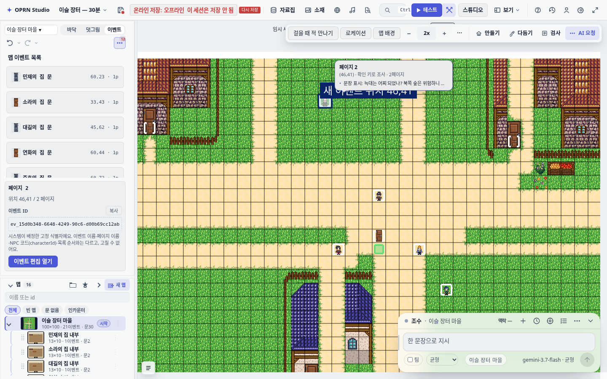

- `src/project/eventDisplayName.ts:9-16` — 뒤에서부터 첫 비어있지 않은 페이지 이름을 이벤트 이름으로. 자동 생성된 `페이지 N` 도 이름으로 친다.
- `src/editor/panels/eventEditor/modal.ts:480-500` — 주석이 스스로 「라벨이 이벤트 이름이라 사용자가 속았다」고 기록하고 라벨만 바꿨다. 근본은 GameEvent 에 name 필드가 없는 것.
- 왼쪽 인스펙터 문구는 「이벤트 이름·페이지 이름·NPC 코드와는 다르다」고 셋을 구분해 말하는데, 편집기 어디에도 이벤트 이름을 짓는 자리가 없다.

### 2. 조건 칩 한 번 누르면 게임의 1번 퀘스트 스위치에 묶인다

「언제 보이나요 → 스위치」 칩을 누르자 확인 없이 **0001 「Q1 약초 의뢰 수락」** 에 바로 묶였다. 페이지 탭도
`2 페이지 2 Q1 약초 의뢰 수락 켜짐` 으로 바뀐다. 이 상태로 저장하면 내 촌장은 다른 퀘스트의 진행에 따라 켜진다.

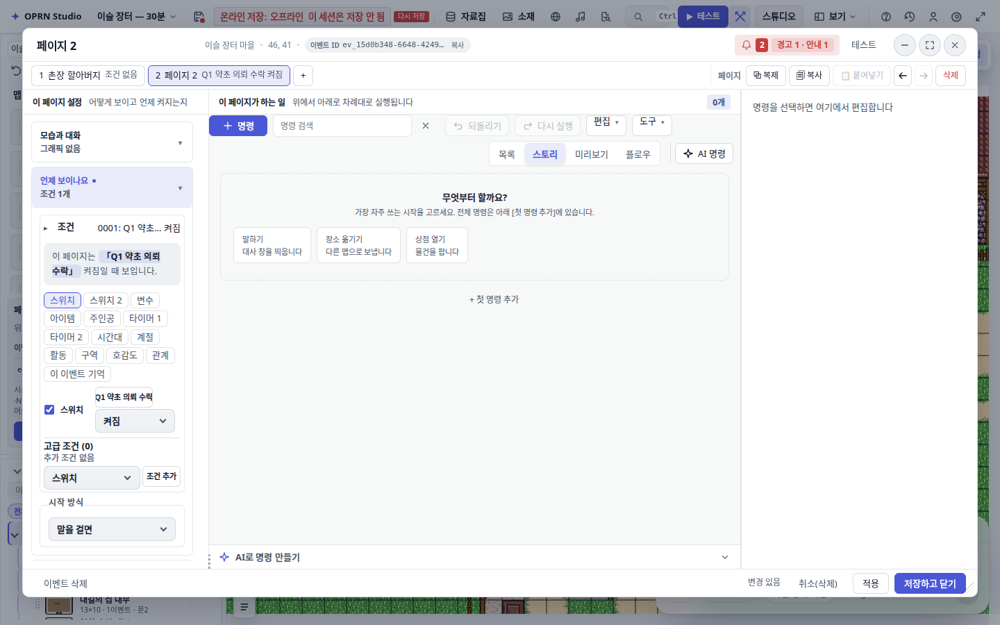
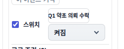

- `src/editor/panels/eventEditor/pageConditionModel.ts:122,200`, `pageAdvancedConditions.ts:490`, `conditionCompile.ts:19,155` — 전부 `switches[0]?.id` 가 기본값.
- 스위치 피커도 같은 1번 스위치를 **미리 선택**해 열고, 그 아래 인라인 「이름」 편집 상자를 펼쳐 둔다. 9곳에서 쓰는 퀘스트 스위치를 실수로 개명하기 좋은 배치다.

### 3. 분기 안에 명령을 넣는 길이 사실상 하나뿐이고, 그 하나도 반대로 간다

분기 안 「스위치 조작」 행을 선택한 채 상단 **「+ 명령」** 을 눌러 아이템 변경을 추가했더니 **분기 밖 최상위 3번**으로 들어갔다.
피커에는 어디에 삽입되는지 표시가 없다. 결과: 거절해도 회복약을 받는 논리 버그를 사용자가 알 수 없다.

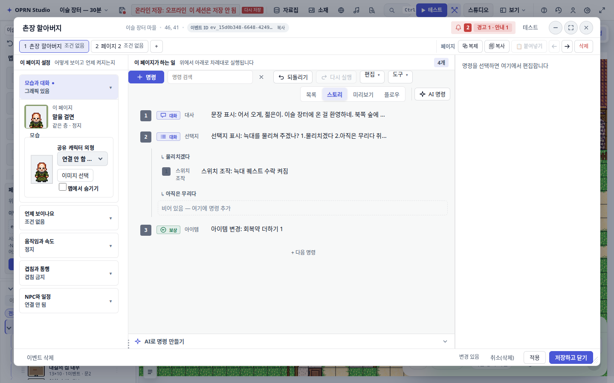

- 「위로 이동」은 선택지 블록 전체를 한 번에 뛰어넘는다. 분기 안으로는 못 들어간다.
- 스토리 뷰에서 행을 드래그하면 **텍스트가 선택**된다(`draggable` 요소 2개뿐, 행은 아님).
- 분기가 명령을 하나 가지면 「비어 있음 — 여기에 명령 추가」 슬롯이 사라져 두 번째 명령을 넣을 곳이 없다.
- 유일하게 분기 안으로 들어간 경로는 `편집 ▾ → 잘라내기` 후 중첩 행 선택 + `Ctrl+V`. 이건 선택 행 **앞**에 넣는다. 「+ 명령」은 선택을 무시하고 **끝**에 넣는다. 두 삽입 규칙이 서로 다르다.

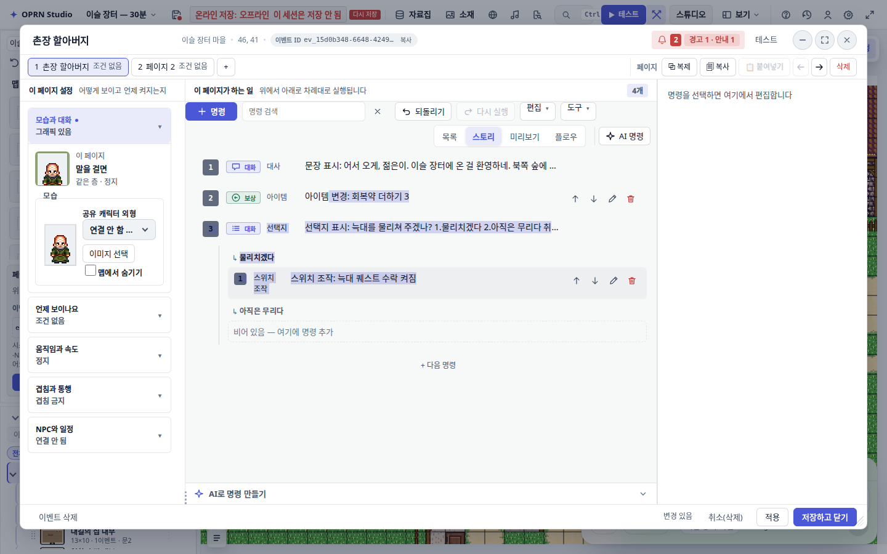

### 4. 2페이지를 보다가 닫으면 맵에서 NPC 가 사라진다

편집기를 2페이지(그래픽 없음) 상태로 닫자 맵 (46,41) 은 빈 칸이 되고 툴팁·목록·요약이 모두 2페이지 것을 보인다.
데이터는 멀쩡하다(`project-export-json` 확인: 1페이지 sprite `tex_easyrpg_charset_people1`, 명령 2개). **맵 렌더가
편집기의 「페이지 미리보기 상태」를 닫힌 뒤에도 따른다.** 「편집 위치 46,41」 배너도 닫힌 뒤 그대로 남는다.

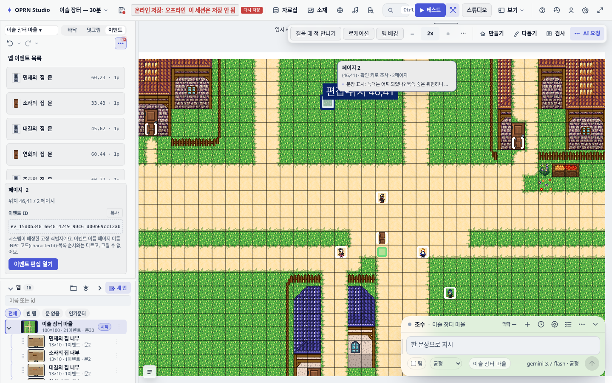

### 5. 1024 에서 본문이 무너지고 768 에서는 저장 버튼이 사라진다

- **1024×700**: 명령 열이 400px 로 줄어 행마다 칩/태그/본문이 3줄로 쌓이고 본문은 10글자. 빈 인스펙터가 폭의 1/3 을 점유한다.
- **768×1024**: 본문 열 폭 0(칩만 남음), 중첩 행은 단어 단위 줄바꿈(`아이템/변경:/회복약/더하기/3`), 페이지 액션 줄 잘림,
  **푸터의 취소·적용·저장하고 닫기가 화면 밖**. 저장할 방법이 없다.

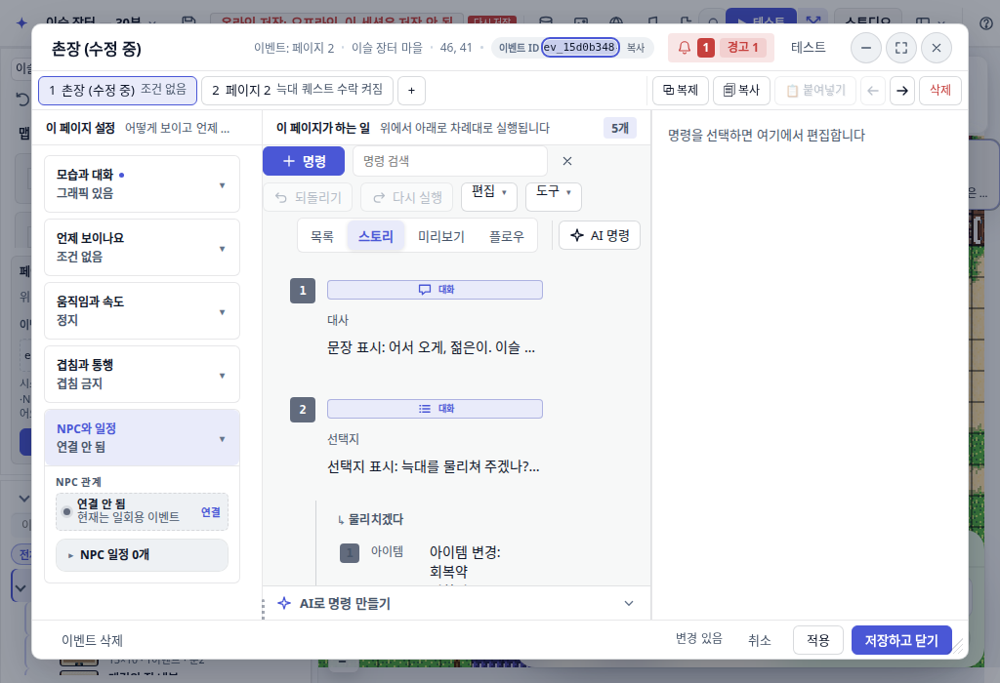
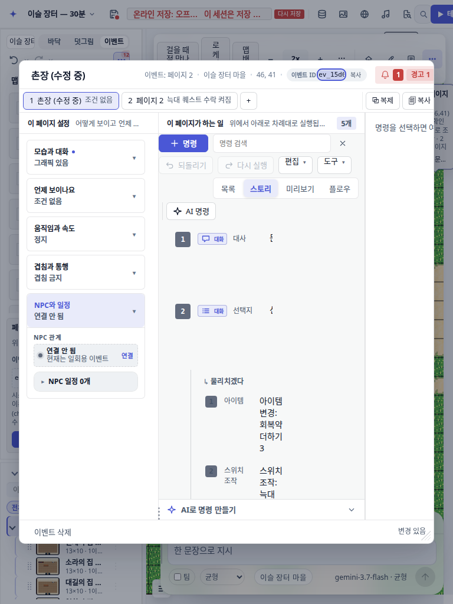

---

## P1 — 고장 난 컨트롤

### 6. 몸 폭 · 몸 높이 · 통행 차단 행 입력이 35px — 값이 보이지 않는다

`scrollWidth 38 > clientWidth 33`. 값 `1` 이 스피너 뒤로 밀려 「:」 만 보인다. 옆의 「배율 직접 지정」 체크박스 라벨은 숫자 입력이 덮어 「지정」이 잘린다.
같은 섹션에 「겹침」 라벨이 두 번(상단 칩 + 하단 체크박스).

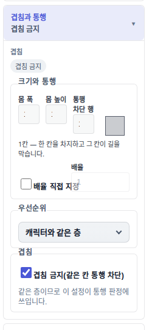

- `src/editor/panels/eventEditor/pageFootprint.ts:66` `axisInput(...)` → `.event-footprint-control`.

### 7. 새 스위치를 짓고 고르면 다이얼로그는 「(이름 없음)」, 미리보기는 「늑대 퀘스트 수락」

같은 다이얼로그의 왼쪽 트리거 버튼과 오른쪽 미리보기가 다른 이름을 말한다. 트리거가 이름 변경 뒤 다시 그려지지 않는다.

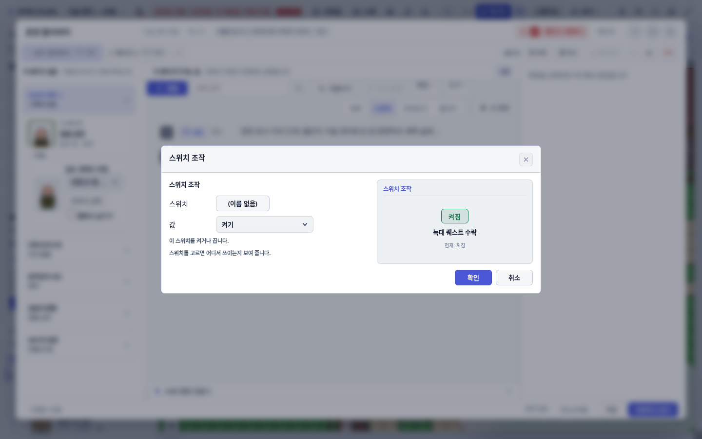

### 8. 「+ 새 스위치」 뒤 이름 상자는 반쯤 잘려 있고 포커스는 버튼에 남는다

새 항목은 목록 맨 아래에 생기고 인라인 이름 상자가 목록 클리핑 경계에 반만 보인다. 포커스는 `event-record-picker-add` 버튼에 그대로.
사용자는 스크롤해서 상자를 찾아 클릭해야 한다.

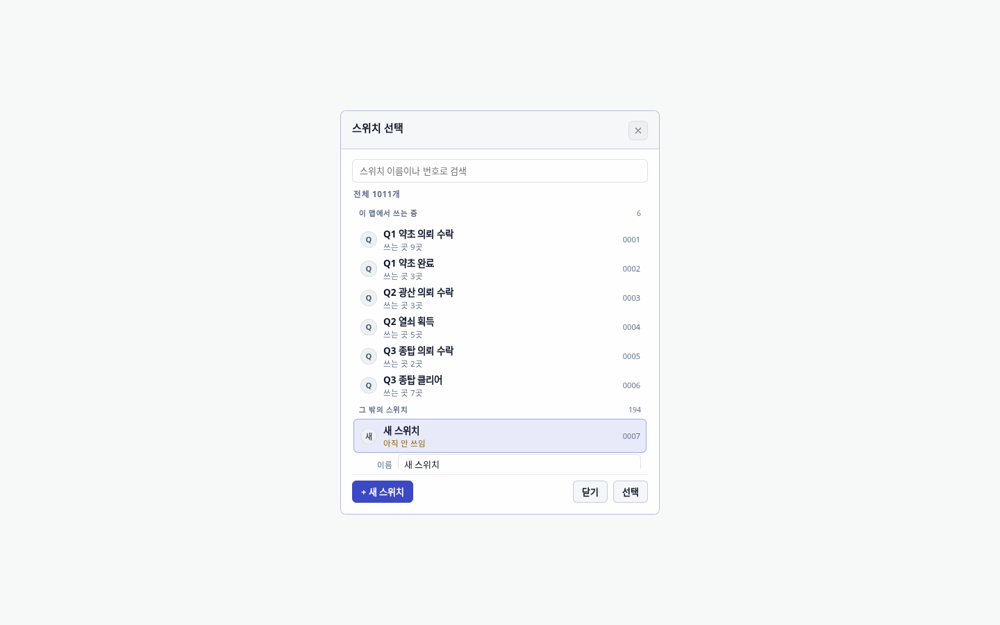

### 9. 3단계 다이얼로그는 화면을 흰 벽으로 만든다

명령 다이얼로그(2단계)에서 스위치 피커(3단계)를 열면 뒤가 전부 사라진다 — 무슨 이벤트의 무슨 명령을 고치고 있었는지 볼 수 없다.
2단계 배경은 반투명 블러, 3단계는 불투명 `var(--bg-surface)`.

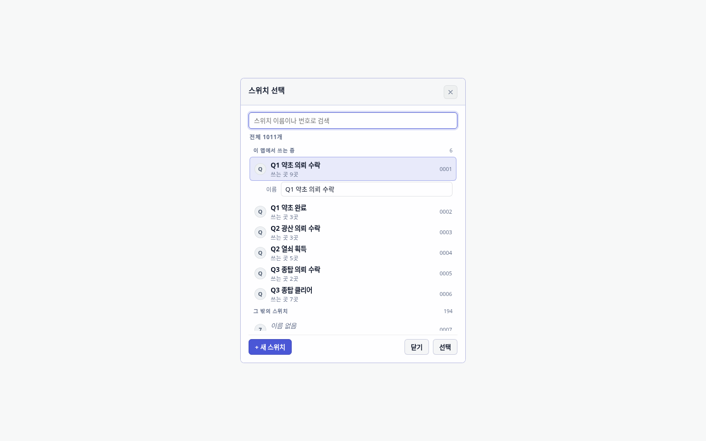

- `src/styles/event/subdialogs/dialogs-3.css:936` `.event-subdialog-backdrop ~ .event-subdialog-backdrop { background: var(--bg-surface); }` — 「블러 중첩 완화」 의도가 맥락 소실로 갔다.
- 같은 피커의 「전체 1011개」 vs 「이 맵에서 쓰는 중 6 + 그 밖의 스위치 194」 = 200. 숫자가 맞지 않는다.

### 10. 모든 서브다이얼로그가 열리면 포커스가 「닫기 ×」에 간다

문장 표시·선택지·스위치·아이템 전부 `document.activeElement` = `.event-subdialog-close`. 열자마자 타자를 치면 아무 데도 안 들어간다.

- `src/editor/panels/eventEditor/subdialog.ts:111-114` `focusFirstControl` 이 `querySelector("button, input, …")` 로 헤더의 첫 버튼을 잡는다.

### 11. 경고 항목을 누르면 워크벤치 전체가 스크롤된다

「이동합니다」는 맞지만 왼쪽 열만이 아니라 3열 컨테이너가 함께 올라가 「이 페이지 설정 / 이 페이지가 하는 일」 열 머리와 `0개` 배지가 잘린다. 열 머리가 sticky 가 아니다.

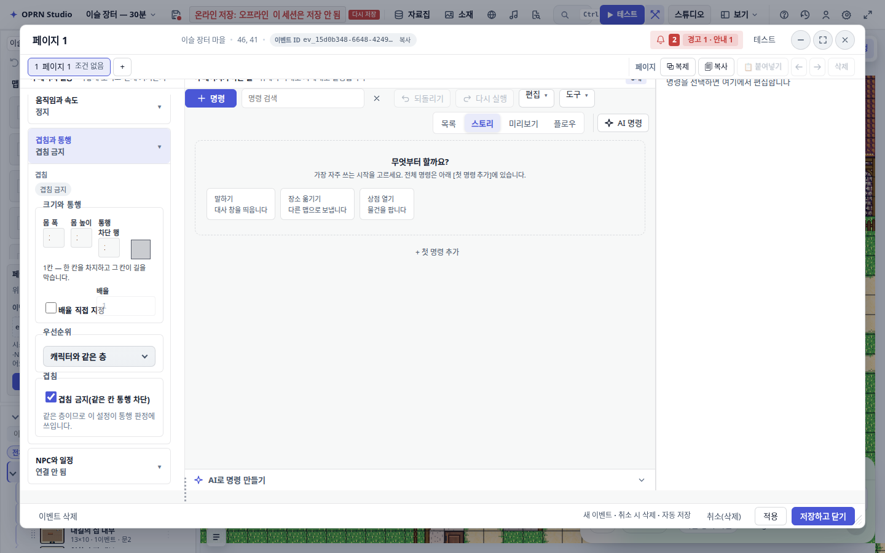

### 12. 값 드롭다운의 aria-label 이 7,019자

`[data-custom-select-for=event-command-switch-value]` 의 `aria-label` = `"값켜기끄기전환변수(선택)회수한 달빛 약초(이름 없음)(이름 없음)…"`. 옵션 전체(변수 200개 포함)를 라벨에 이어 붙였다. 스크린리더는 「이름 없음」을 수백 번 읽는다.

### 13. 「움직임과 속도」 — 230px 열에 fieldset 7개

legend 가 테두리 위에 걸쳐 「물체 동작 / 물체 상호작용 / 플레이어 발견」 이 겹쳐 보이고, 「사용자 지정 이동 경로 설정」 비활성 버튼은 두 줄로 잘린다.

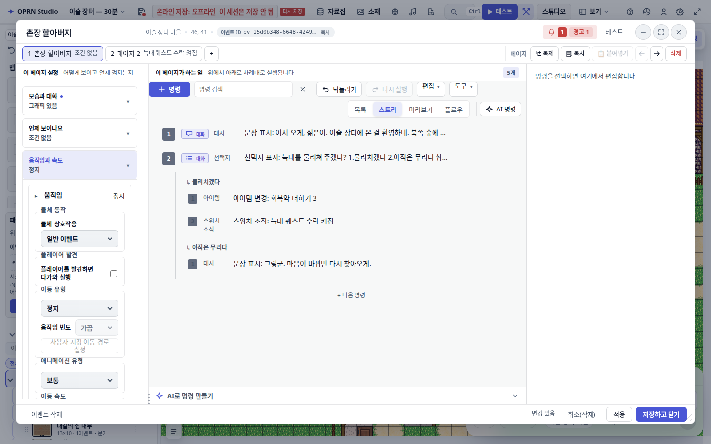

---

## P2 — 소음과 중복 (매 화면에서 신뢰를 조금씩 깎는 것)

### 14. 아무것도 안 한 새 이벤트가 빨간 「경고 1 · 안내 1」로 시작한다

기본값(그래픽 없음 + 겹침 금지)이 스스로 `page.invisible-collision` 경고를 만든다. 페이지를 하나 추가하면 4로 는다.
경고 목록은 `page.invisible-collision · page_e869ebce-… · []`, `event-page-overlap-forbidden`, `event-inspector-body` 같은
내부 토큰을 그대로 보이고, 「기대값: 의도한 실행 조건과 지원 명령 / 편집기의 해당 검토 항목을 확인하세요」는 아무 말도 하지 않는다.
라벨 없는 `<select>` 「Markdown」 이 목록 아래에 떠 있다. (위키 «조건 문구에 내부 토큰을 넣지 마라» 위반.)

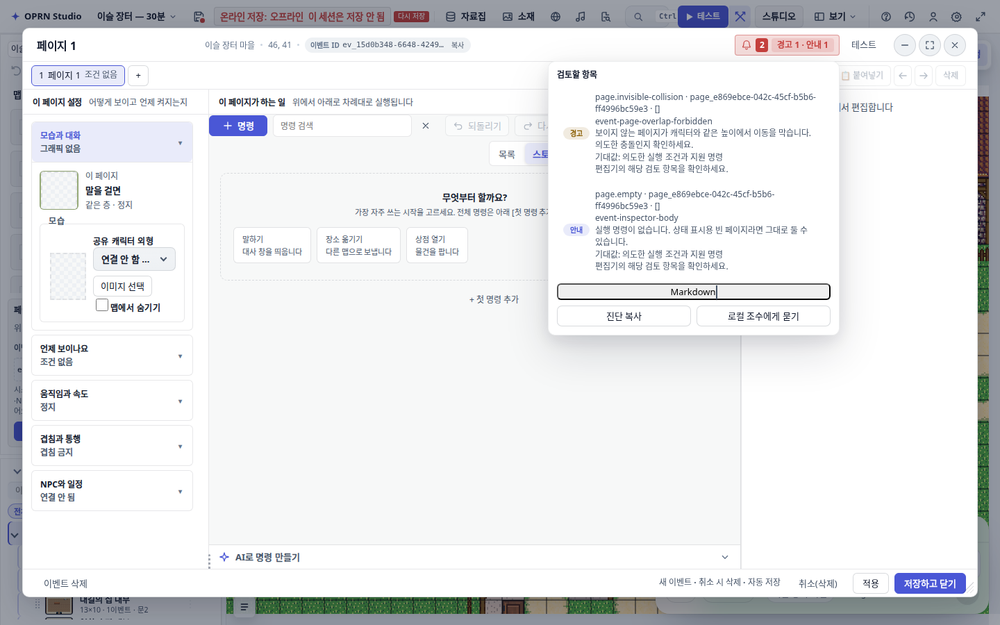

### 15. 첫 화면 — 명령을 추가하는 입구가 다섯 개

「+ 명령」, 「+ 첫 명령 추가」, 「AI 명령」, 「AI로 명령 만들기」(같은 패널을 여는 두 트리거), 「무엇부터 할까요?」 카드 3장.
페이지 줄엔 「복제」와 「복사」가 나란히. 푸터엔 「자동 저장」 문구와 「적용」과 「저장하고 닫기」가 공존한다 — 자동 저장이면 적용은 무엇인가.
「취소(삭제)」는 새 이벤트를 지우는 취소라는 뜻인데 라벨만 보면 알 수 없다.

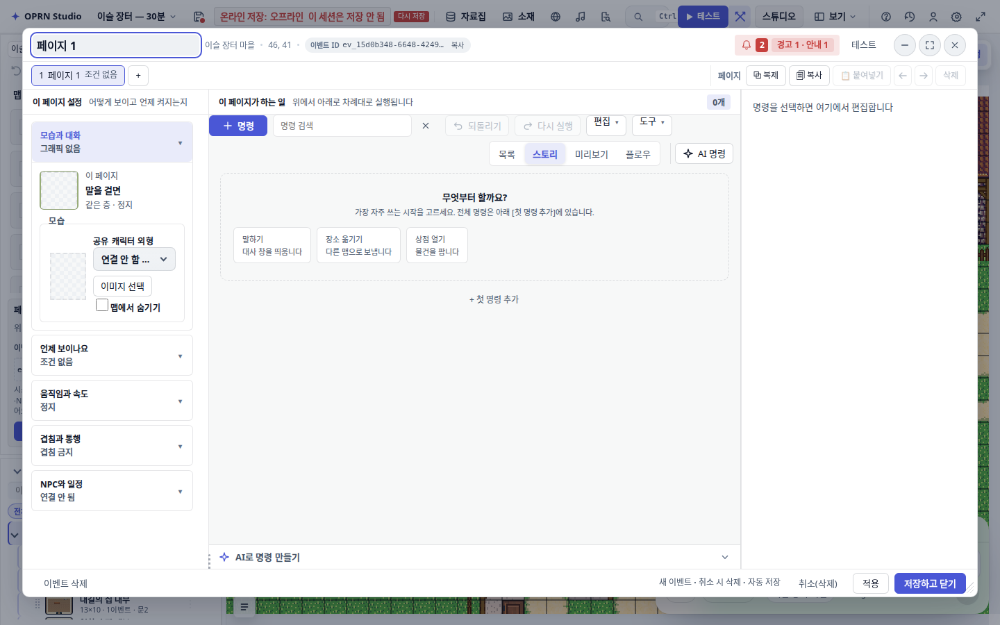

### 16. 기본 뷰 「스토리」가 네 뷰 중 가장 나쁘다

- 본문을 **고정 글자 수(약 40자)** 로 자른다. 전체 보기(820px 폭)에서도 같은 자리에서 잘린다. 3줄 대사가 한 줄 반으로 보인다.
- 행마다 세 번 라벨링: 칩 「대화」 + 태그 「대사」 + 접두 「문장 표시:」. 선택지도 칩은 「대화」.
- 중첩 행은 칩·아이콘을 잃고 회색 텍스트 「스위치 / 조작」 으로 두 줄 접힌다. 번호는 분기마다 1부터 다시 센다(「1」 이 세 개).
- 명령을 추가해도 선택되지 않아 인스펙터가 비어 있다. 반대로 붙여넣기 뒤엔 행은 강조되는데 인스펙터는 빈 채다.
- 「목록」 뷰는 전문을 접어 보이고 아이콘·강조가 있어 훨씬 낫다. 기본이 아니다.

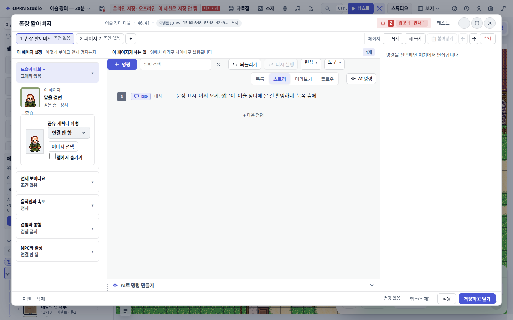
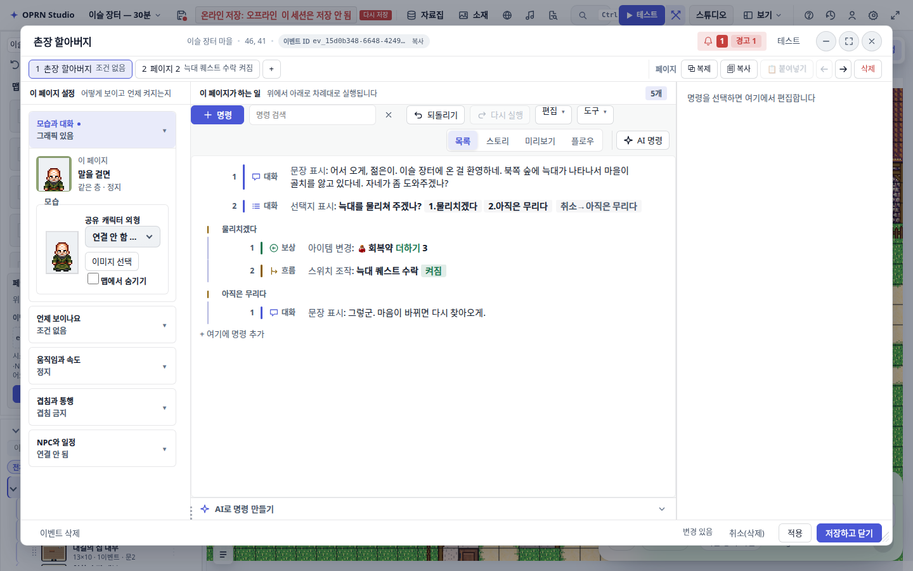
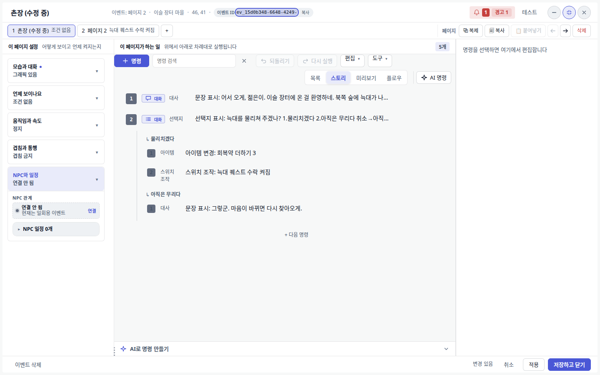

### 17. 명령 피커 — 40px 행 하나에 네 글자, 아이템은 150개짜리 네이티브 select

- 피커는 폭 770px 을 다 써서 한 줄에 항목 하나. 800px 높이에 12개. 「그리드」 토글이 있는데 기본이 아니다. 푸터 범례(⚠ 실행 제한 / ⓘ 편집용 기록)는 화면에 없는 아이콘을 설명한다.
- 아이템 변경의 아이템은 검색 없는 **네이티브 `<select>` 150개 항목**. 스위치는 검색·사용처 표시가 있는 전용 피커. 같은 종류의 선택이 두 패러다임으로 갈린다.
- 아이템 미리보기 「+= 1개」 는 프로그래머 표기. 드롭다운 아래 같은 이름의 「? (아이템 선택)」 칩 중복.

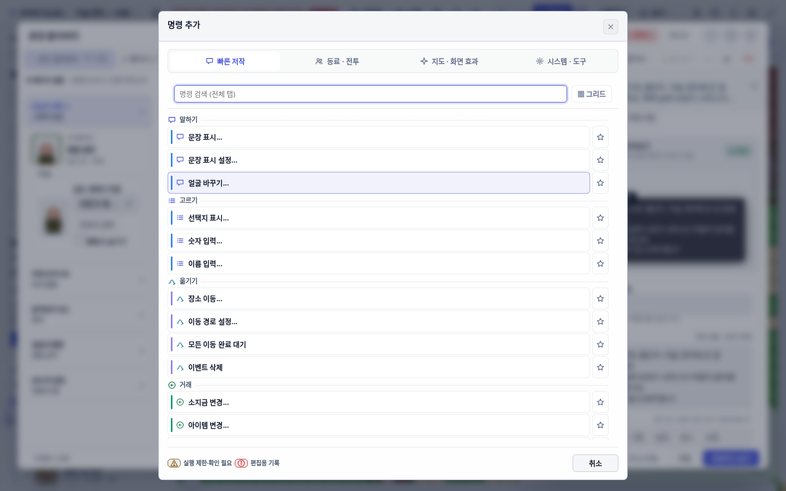
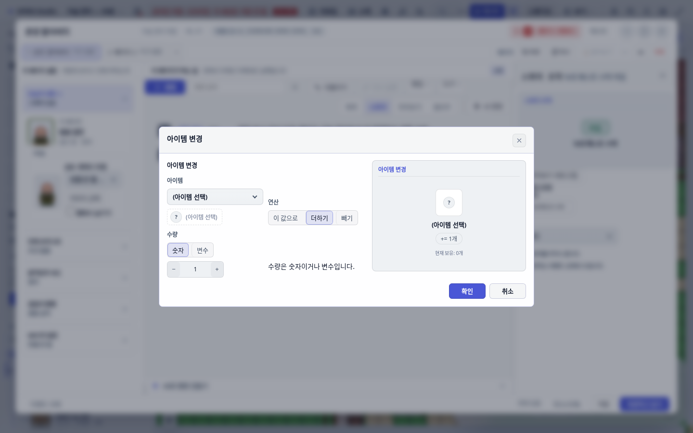

### 18. 문구 · 배치 잡음

- 서브다이얼로그 제목이 2~3번 반복된다(창 제목 「문장 표시」 + 소제목 「문장 표시」 + 미리보기 제목 「문장 표시」). 그래픽 피커 제목만 영어 「Graphic」.
- 그래픽 피커의 시트 목록 스크롤바가 2px — 20개 중 10개가 숨어 있다는 표시가 없다. 「그림 없이 계속」 버튼은 「이미지 선택」 을 눌러 들어온 사람에게 붙는 버튼이 아니다.
- 「시작 방식」(트리거)이 「언제 보이나요」(가시 조건) 안에 들어 있고 legend 가 위 테두리에 잘린다. 같은 패널에 조건 시스템이 둘(칩 14개 + 「고급 조건」 목록).
- 문장 표시 인스펙터: LIVE 배지 옆에 「미리보기 새로고침」 버튼. 헤더 「문장 / 표시」 가 두 줄로 찢어진다.
- 「미리보기 / 플로우」 뷰로 가면 인스펙터 열이 사라져 탭 줄이 오른쪽으로 점프한다.
- 「공유 캐릭터 외형」 드롭다운은 항상 「연결 안 함 …」 으로 잘린다.
- 도구 ▾ 메뉴: 「따라오기 / 프리셋 ☠ 필드 몬스터 템플릿」 — 이모지 아이콘, NPC 편집기 문맥에 몬스터 템플릿.
- ESC 확인 다이얼로그(「계속 편집 / 버리고 닫기」)는 있다. 좋다. 다만 「저장하고 닫기」 선택지가 없어 저장하려면 돌아가야 한다.

---

## 인정할 것

- ESC 에 미적용 변경 확인이 뜬다. 최소화 칩 「이벤트 편집 계속: …」 은 좋은 패턴이다.
- 문장 표시·선택지의 LIVE 미리보기, 플로우 뷰의 분기 상자, 목록 뷰의 전문 표시는 잘 만들어져 있다.
- 스위치 피커의 「이 맵에서 쓰는 중 / 쓰는 곳 N곳」 은 RM 계열에 없던 실질적 개선이다.
- 그래픽 피커의 AI 이름 학습은 조수 경로에는 유용하다(단, 처음 스프라이트를 고르는 화면에 있을 이유는 없다).

---

## 지금 당장 할 다섯 가지 (우선순위)

1. **이벤트 이름을 모델에 넣고** 헤더 상자를 이벤트 이름으로 되돌린다. 페이지 이름은 탭 안에서 고친다. `eventDisplayName` 은 자동 이름(`페이지 N`)을 이름으로 치지 않는다.
2. **조건 칩과 명령 다이얼로그의 `switches[0]` 기본값을 없앤다** — 칩을 누르면 피커가 열리고, 피커는 아무것도 미리 선택하지 않는다. 인라인 개명은 명시 버튼 뒤로.
3. **삽입 규칙 하나로**: 「+ 명령」·피커·붙여넣기 모두 「선택 행 바로 아래, 같은 깊이」. 분기 슬롯은 명령이 있어도 항상 보이거나 hover 로 나타난다. 스토리 뷰 행에 `user-select: none` + 드래그 재배치.
4. **닫을 때 페이지 미리보기 상태와 「편집 위치」 배너를 해제**한다. 맵은 게임 시작 시 켜질 페이지를 그린다.
5. **1024/768 레이아웃**: 인스펙터가 비었으면 접고, 768 에선 2열(설정은 서랍), 푸터는 항상 보이게 고정. 본문 잘림은 폭 기준(`text-overflow`)으로.

그다음: 35px 입력(#6), 불투명 3단계 배경(#9), 서브다이얼로그 초기 포커스(#10), aria-label 7천 자(#12), 새 이벤트의 기본 경고(#14).

---

## 재현 메모

- 드라이버: `.playwright-mcp/event-editor-review/driver.mjs`(gitignore, 세션 한정). 크로미움 플래그 `--disable-background-networking --disable-features=NetworkChangeNotifier` 없으면 백지.
- 이벤트 레이어 탭은 `[data-testid=layer-event]`. 바닥 레이어에서 더블클릭하면 편집기가 아니라 타일이 찍힌다.
- 검증은 `project-export-json` 의 `maps[startMapId].events` 로 했다. 원격 저장은 `freshProject` 라 꺼져 있다(콘텐츠 산출물 아님, 편집기 UI 진단 목적).
