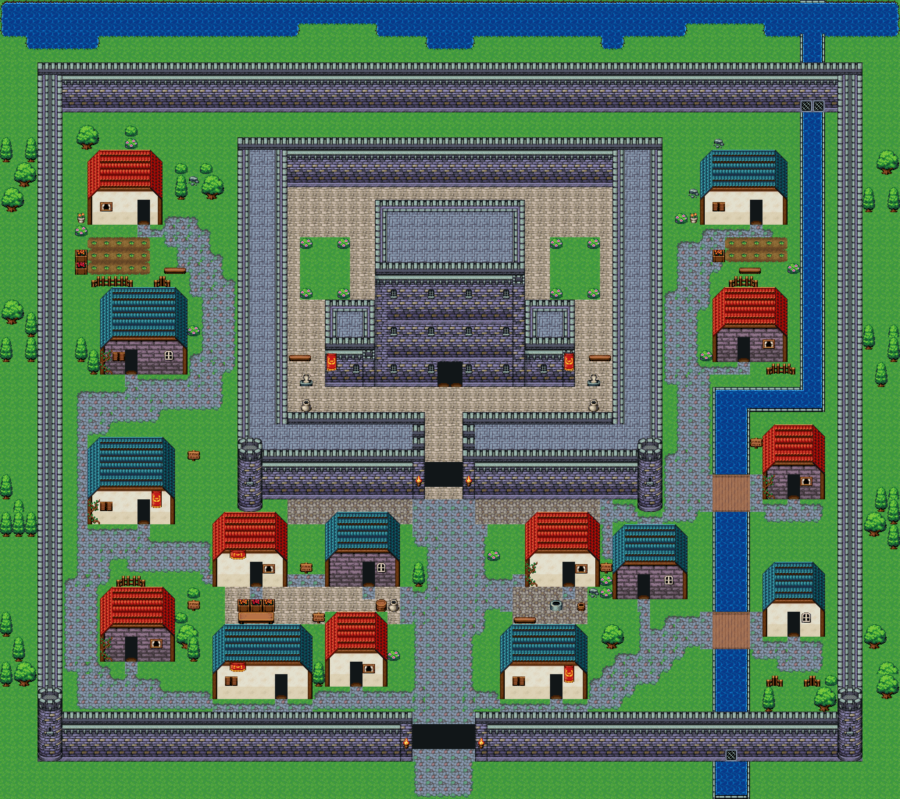
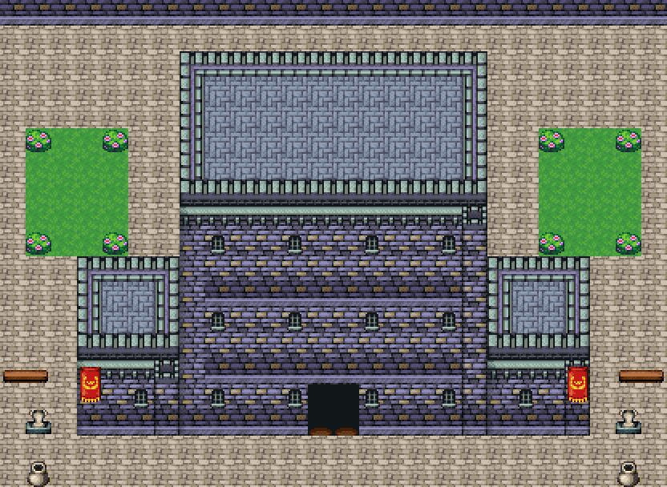
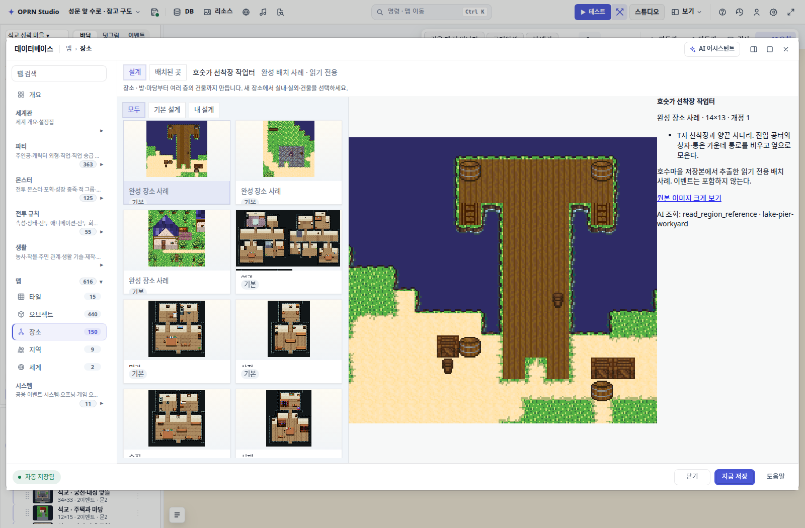
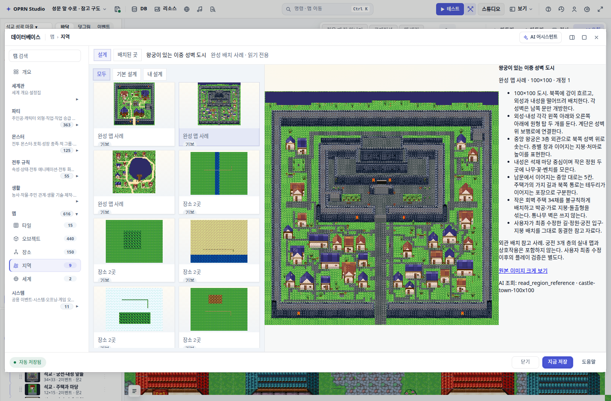

# 석교 성곽 마을과 공간 라이브러리

정본 프로젝트: `rpg-zzu-castle-canal-reference-20260913-6890` (Supabase).
`remote-receipt.json`은 커밋 직전 원격 재로드 결과다.

## 저장 범위

`spatial-reference.json`은 원격 프로젝트에서 추린 맵, 두 칩셋, `seokgyo-*`
오브젝트 25개·공간 8개·장소 5개다. 전체 프로젝트 백업이나 자동 import 명령은 아니다.
현재 프로젝트의 실제 `spatialAuthoring.library`에 등록되어 있으며, 다른 프로젝트에
사용할 때는 정식 저작 controller의 draft → preview → apply 경로로 등록·컴파일해야 한다.
기존 콘텐츠와 ID 충돌을 검사하고 저장 후 다시 로드해야 한다.

## 최종 궁전 규칙

- 내성 바깥에서 회랑으로 올라가는 계단을 두지 않는다. 회랑 양끝도 닫는다.
- 궁전은 같은 중심선의 연속 외벽과 창문 세 줄로 한 동의 3층 외관을 표현한다.
- 본관 평지붕 깊이는 6칸, 양익은 4칸. 중간 층에 흉벽·지붕을 반복하지 않는다.
- 지붕과 외벽은 실제 셀 조합으로 저장한다. 양익 조합의 상단 중앙은 중층과
  겹치지 않도록 빈 셀이다.
- 공간 슬롯은 세 구성품의 접합 위치를 보존한다. 장소의 진입·퇴장 연결은
  서로 다른 출입점으로 생성한다.
- 킷의 `ai.placementRules`는 AI가 읽는 지침이다. 모든 문장이 기계적 제약은 아니다.
- 문은 외관 표현이며 궁전 실내·층간 이동은 저작하지 않았다.

## 검증

`verification.json`: 원격 재로드, 구성품 3개 셀 일치, 기존 맵 보존,
지붕·회랑으로 지상 접근 불가, 궁전 앞·뒤뜰 도달 가능.
최종 `player.html` 하네스 이동·차단 검사 4개 통과 (오류 0).
이전 단계의 7개 공간 재조립, 장소별 진입·퇴장 검증을 수행했고 이후 변경된
궁전에는 갱신·컴파일·이동 검사를 다시 수행했다.

호수마을·100×100 성하마을 참고 자료는 `src/project/regionReferences/`에 별도로 있다.
100×100 성하마을은 사용자 편집본의 동결 참고 자료이며 이 석교 마을과 별개다.

## 최신 main에서 확인한 참고 자료 UI

