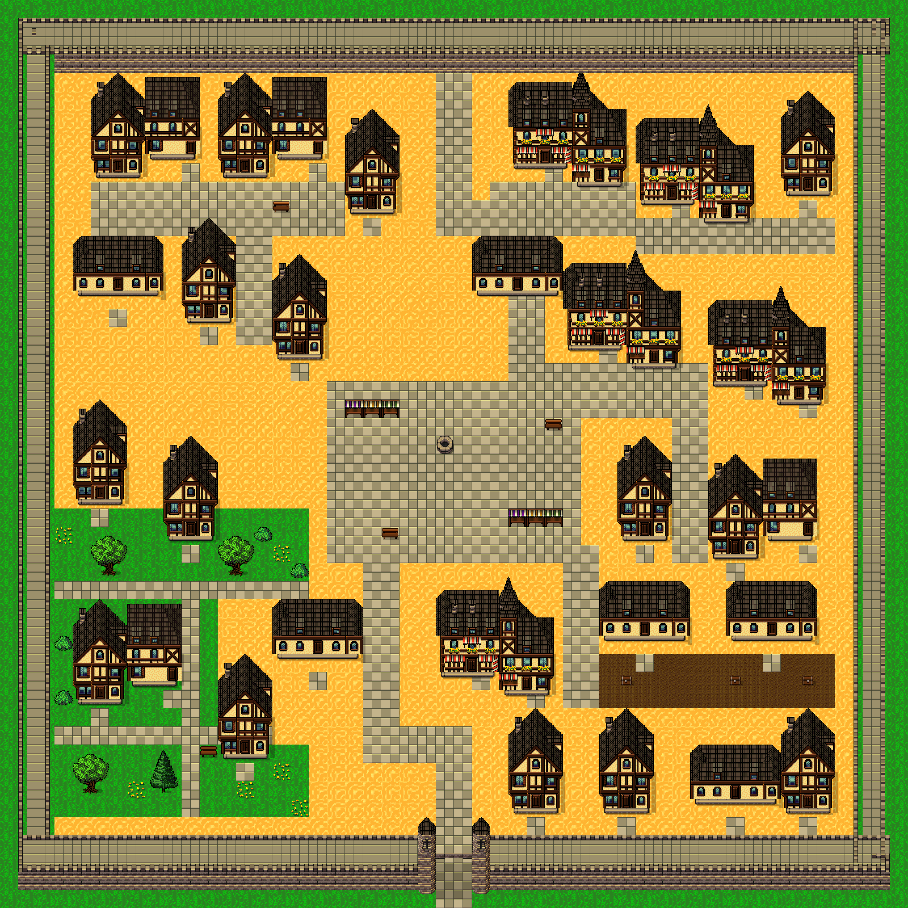

# 두 번째 Slates 전달 실험 — 문서 개정 + 단계별 감독자 검토

**문서 개량과 GPT 6 Astra / medium 재실행을 완료했다. 건물 조립은 개선됐지만, 성곽 도시의 미술 완성도는 여전히 부분 달성이다.** 원격 저장까지 마친 새 맵을 남겼으며 최종 배치는 감독자가 수정하지 않았다.

[그림 비교 페이지](../../../reports/slates-astra-v2/index.html) · [개정 지침](../../../openwiki/slates-assembly-playbook.md) · [154개 파일 학습 ZIP](../../../reports/slates-learning-pack-v2.zip)

## 문서에서 바꾼 것

1. 폭 4/6칸 지붕의 이전 조립 기록을 일반 공식처럼 쓰지 못하도록 적용 범위를 바로잡았다.
2. 고정 끝/중간 반복/모서리와 처마·기단·문 접점을 명시했다. 첫 실험의 실패 그림과 원본 구조를 비교한다.
3. 필수 16/8px 카탈로그 3종과 관찰 표본 7개의 2478개 정확한 합성 연산을 제공했다. 좌표 단위·그리는 순서·32px 경계 분할을 설명했다. 관찰 레시피의 색 보정 부품은 여전히 의미별 검토가 필요하다.
4. 참고 그림에 수작업 실루엣과 골목 단면을 표시했다. 약 48.7% 건축 면적 및 4개 시각 여백은 근사 관찰이고, 새 맵의 45~60% 등 제안값과 실제 충돌 규격을 구분했다.
5. 집 → 붙은 상점 → 성벽/문을 먼저 제출받고 검토한 뒤 작은 거리 → 50×50으로 진행하게 했다. 구조·구성·통행·저장을 별도로 판정한다.

정본은 `openwiki/slates-assembly-playbook.md`와 `reports/slates-assembly-v2/index.html`이다. `slates-agent-entry.md`에서 진입하고 AGENTS/PROJECT_WIKI/quickstart의 기존 Slates 안내로 발견할 수 있다. 첫 실험의 옛 문서 3개는 `docs/experiments/slates-astra/frozen-inputs/`에, 전체 옛 입력은 첫 ZIP에 보존했다.

## 실행 조건과 검토 개입

- 모델 요청 `gpt-6-astra`, effort `medium`, `fork_context:false`, agent `01a0c0ed-c74e-7412-a2c4-a965c920c85f` / Mendel. 도구가 수락한 요청 설정이다.
- 허용 입력 151개를 SHA로 고정했고, 종료 시 변경 없음을 확인했다. 실제 읽은 파일 33개는 허용 목록 안에 있다. 과제 입력 목록 파일 자체는 별도 운영 입력이다.
- 대화 이력·이전 완성 맵 JSON·기존 생성기·앱 코드·DB를 저작 담당에게 전달하지 않았다. 공유 파일시스템의 접근을 기술적으로 차단한 실험은 아니다.
- **첫 실험과 달리 감독자의 중간 시각 피드백 3회가 있다.** 집/상점/벽/문 검토, 추가 작업장 지붕 반려, 반복 띠 배치 반려를 기록했다. 문서만 바꾼 통제 실험으로 해석하면 안 된다. [정확한 프롬프트·피드백](execution.json).
- 콘텐츠와 생성기는 에이전트 한 명만 작성했다. 감독자는 입력 문서를 먼저 완성하고 실행 중 그림을 검토했으며, 종료 후 검증·병합·저장만 수행했다. 저장된 map/tileset/asset은 제출 bundle과 일치한다.

## 결과 평가

| 축 | 감독자 판정 | 관찰 |
|---|---|---|
| 구조 | partial, 첫 실험 대비 개선 | 반칸 돌출층·상점의 다른 높이·분리된 기단. 작업장 톱니 반복은 반려 후 수정. 여관 북쪽 끝·상점 결 전환·얇은 성벽·새 얕은 아치는 아직 한계 |
| 구성 | partial | 5/6개의 반복 가로 띠를 폐기하고 길드 회랑·상점 거리·시장 광장·정원·공방 중정으로 재배치. 빈 공간이 여전히 넓고 건축 점유율 28.46%는 제안 미달 |
| 통행 | 확인 범위 내 pass | 실제 엔진으로 47/47 접근 목표·1196칸 연결, 문 통로 8칸 연결. 남문을 가상 차단한 내부 탐색에서 지도 경계 누출 없음 |
| 저장 | pass | Supabase root/맵/칩셋 재로드 일치. 기존 11개 맵과 시작 위치 보존. 로컬 SQLite revision 9 재로드 일치 |

건물 4형태·26개. 점유율은 모듈 사각 패딩이 아닌 바닥·그림자·수목·소품을 뺀 알파 실루엣 합집합으로 계산했다. 참고의 수작업 다각형과 이번 알파 면적은 측정 방법이 다르므로 정밀한 직접 비교 수치가 아니다. 새 숫자를 맞추려고 같은 집을 더 복제하는 것을 완료 조건으로 삼지 않았다.

[에이전트 최종 보고](AUTHOR-REPORT.md) · [단계별 보고](stage1-report.md) · [레이어/접점 모듈 JSON](modules.json) · [합성 출처](recipes.json) · [배치](layout.json) · [자체 관측 수치](metrics.json).

## 중간 반려 사례

[반려한 가로 띠 초안](rejected-layout/map.png)을 보존했다. 고정 건물 조립의 개선이 전체 마을 구성을 자동 해결하지 않음을 보여준다. 원본 바닥의 가장자리 0을 반복한 잔디 바둑판도 이 단계에서 확인됐고 중심 57로 수정됐다.

초기 모듈의 `partial`과 최종 판정은 별개다. 추가 형태를 붙인 뒤 다시 생긴 톱니 지붕, 잘린 끝, 바닥 보정 픽셀을 단계별 PNG 검토로 잡았다. 이 결과를 “모든 Slates 조합이 검증된 완성 라이브러리”로 승격하지 않는다.

## 엔진·원격·로컬 근거

- 실제 에디터 3200×3200 PNG를 2배 격자로 비교했을 때 최종 bundle 미리보기와 다른 픽셀 **0**. [렌더 비교](editor-render-comparison.json), [통행/에디터 관측](engine-observation.json).
- 전용 `player.html`에서 재로드 프로젝트의 시작점만 바꾼 복사본으로 실제 남문 북쪽 이동·통과를 확인. 에디터 play 경로를 쓰지 않았다. [런타임](runtime-observation.json), [PNG](../../../reports/slates-astra-v2/runtime.png).
- Supabase project `rpg-zzu-slates32-38e6`, map `slates_astra_v2_walled_50`, 전체 12 maps / 7 tilesets. root SHA `ec17ce658ed24fdff49ab15b3dd335cd1b6d3735cb0f086c9c8801591e3a1261`. [저장·재로드](persistence.json).
- 로컬 project `c8c53479-8d1a-42da-96ee-e493598ef498`, revision 9. [로컬 재로드](local-persistence.json).
- 에디터 캡처는 독립 임시 미리보기에서 수행했다. 원격 저장 성공의 근거는 별도 저장기의 실제 DB 재로드이며 화면의 저장 표시가 아니다.
- gates/vitest/전체 typecheck는 실행하지 않았다. 콘텐츠 형식·렌더·통행·저장 관측이다. NPC/실내/거래/문 개폐 기능은 저작하지 않았다.

타일: Ivan Voirol, CC BY 4.0. 원본 사각형 선택·분할·합성과 신규 지도 배치. [출처 표기](../../../public/assets/ATTRIBUTION.md).
