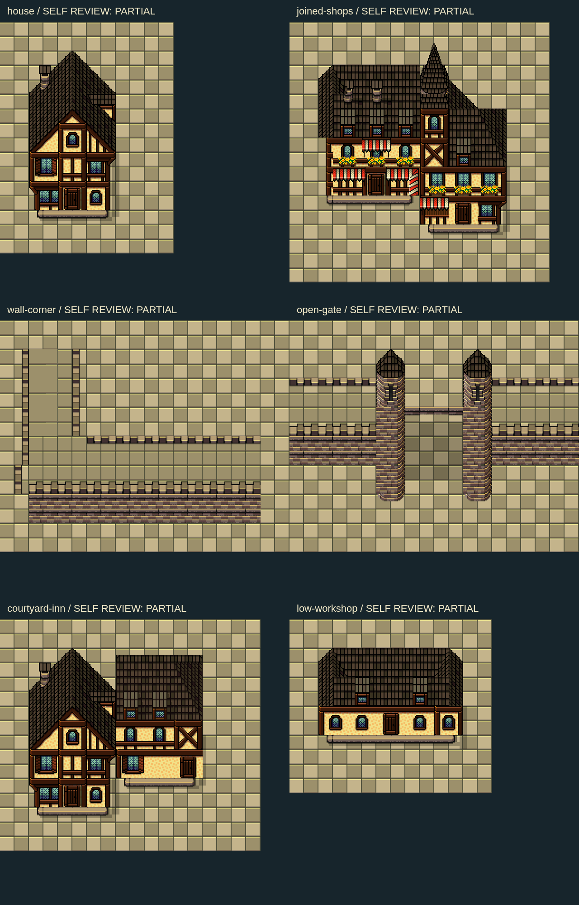

# Slates 독립 실험 2 — 1차 제출 (1~3단계)

집·붙은 상점·성벽 모서리·열린 성문을 조립하고 PNG를 직접 열어 수정했다. **감독자 그림 검토 대기**이며 작은 거리와 50×50 마을은 아직 만들지 않았다. 구조 판정은 모두 저작자의 `partial`이다. 저장·실제 엔진 검증을 완료했다고 주장하지 않는다.

## 산출물과 좌표

- `modules.json`: 원본 버전, source rect, destination, layer, 순서, 접점, 실루엣, 32px 충돌, 검토 기록.
- `recipes.json`: 원본 사각형을 32px 셀 경계에서 잘라 담은 2레이어 레시피. 원본 픽셀 확대·회전·색 변경 없음. PNG의 2/3/4배 확대는 검토용 표시뿐이다.
- `catalog-decoding.json`: 지정 7개 카드의 review와 sourceParts, 패치 해독 개수. patches → fine.rects → exercises.operations의 사각형·좌표·순서를 생성기가 대조한다. 모든 2478개 연산을 해독했다. 이 수치는 구조 합격 점수가 아니다.
- `read-inputs.json`: 실제 읽은 입력 목록과 SHA256. 카탈로그 외 완성 맵/프로젝트 JSON, 기존 생성기, 앱 코드, 이전 대화, 웹, DB/.env를 읽지 않았다. 원본 v1도 Canvas에 로드했으나 최종 모듈에 채택한 픽셀은 v2이다.
- 각 `*-complete.png`: 독립 포장 위 결과. `*-silhouette.png`: 포장·그림자를 뺀 투명 오브젝트. `*-mask.png`: 실루엣 알파 마스크.
- 각 `*-parts.png`: 목적지 16px 행·열 번호판. `*-sources.png`: 실제 사용한 원본 사각형/크기/첫 목적지/operation 번호판. `*-join.png`: 접점 확대. `*-shadow.png`: 독립 그림자 레이어.
- 각 `*-collision.png`: 초록 통행, 빨강 차단, A 접근 목표. 충돌은 실루엣으로 자동 결정하지 않았다.

| 모듈 | native 크기 | 전체 연산 | 16×16 | 8×8 | 자기 판정 |
|---|---:|---:|---:|---:|---|
| house | 192×256 | 200 | 123 | 29 | partial |
| joined-shops | 288×288 | 391 | 290 | 11 | partial |
| wall-corner | 320×256 | 244 | 163 | 0 | partial |
| open-gate | 320×256 | 171 | 76 | 0 | partial |

전체 연산에는 포장과 그림자가 포함된다. 실제 건축에도 16px 및 8px 조각을 사용했다. 8px 수는 품질 점수가 아니다. 집과 상점은 고정 실루엣이며 임의 폭/깊이 반복을 허용하지 않는다.

## 적용한 계약과 독자 결정

조립 지침 §2의 source 0=v2/1=v1, 생략된 size=16, dx/dy=0을 그대로 해독했다. §3의 바닥/그림자/오브젝트/충돌을 분리하고 §4의 돌출층 받침, 높이가 다른 상점 접합, 육지 성문을 각각 저작했다. §6의 1~3단계까지만 수행했다. 구조 학습 §1~4의 16/8px 위상과 방향별 성벽 부재를 적용했다. 저작 문서의 예전 가변 지붕 공식은 사용하지 않았다.

**집** — 참고 구조의 뒤 지붕·앞 박공·창·받침을 부품 수준으로 해독했다. 이웃 지면과 식재, 벤치를 제거하고 독립 기단으로 바꾸었다. 96px 고정 건물 폭을 유지했다. 새 석재 바닥에서 투명 실루엣이 독립적으로 성립한다.

- `fine[10937] = [0,1216,80,8,0,0]` → 새 목적지 `(64,32)`, 능선 좌상부.
- `fine[10808] = [0,1224,80,8,8,0]` → `(72,32)`, 같은 능선의 오른쪽 8px.
- `fine[2424] = [0,1152,336]` → `(64,96)`, 16px 박공 부품(정확한 최종 순서는 modules.operations 참조).
- 문 바닥 중앙 `(80,208)`, 접근 셀 `(2,7)`, 좌우 처마 `(32,144)/(128,144)`. 닫힌 문 자체는 차단이다.

**붙은 상점** — 집 모듈 두 개를 겹치지 않았다. `joined-shops`의 공유 가새와 서로 다른 높이의 전면을 해독하고 잘린 좌단을 원본 지붕 부재로 마감했다. 상단에 잘려 들어온 다른 집은 제외했다. 오른쪽 1층에 새 출입구를 마련했다.

- 공유 접합 x=144..176, 전면 처마 y=128/160, 기단 y=192/224. 32px 깊이 차이를 세로 X 가새·돌출 보·독립 기단으로 설명한다.
- 왼쪽 지붕 귀는 v2 `764`, 뒤 마감은 `709`의 아래 16px, 공유 첨부는 `149`의 위 24px + `34`로 조립했다. 회전·늘리기 없음.
- 카탈로그 8px 받침 `11019: [0,1104,512,8,0,0]`와 `11021: [0,1112,512,8,8,0]`을 깊은 상점 오른쪽 돌출 보에 사용했다. 불필요한 수치 보정 배경은 함께 복사하지 않았다.
- 접근 셀 `(3,6)`과 `(6,7)`은 남쪽 포장에서 서로 연결된다. 문은 그래픽만 있고 실내 이동 이벤트는 없다.

**성벽 모서리** — `parapet-corner` 전체 관찰판 대신 방향별 서쪽 흉벽과 가로 앞/뒤 흉벽, 보행면, 석조 전면을 조립했다. 모서리 뒤의 벤치·다른 벽·주변 포장은 제외했다.

- 세로 상부 x=32..80, 가로 상부 y=128..176의 48px 띠가 연결된다. 서쪽 `2432`, 가로 뒤 `2321`, 가로 앞 `2881`, 원본 모서리 `824/938` 사용.
- 반복은 가로 가운데 x=128..160의 32px 단면만 2회 추가했다. `wall-corner-before.png`(짧은 단면)와 `wall-corner-complete.png`(64px 연장)를 제출한다. 모서리 자체는 고정이다.
- 북쪽과 동쪽은 다음 벽과 붙이는 열린 연결 단면이다. 서쪽 외벽 면이 전면보다 얇아 보이므로 구조 `partial`. 모든 방향 가변 성벽 키트가 아니다.
- 다층 보행을 만들지 않았다. 지상 충돌에서 성벽 전체를 막았다.

**열린 성문** — `hold` 격자문을 복원했다고 하지 않는다. 새 쌍탑·얕은 아치·64px 지상 개구부를 원본으로 따로 조립했다.

- 탑 지붕 `33`, 창 몸통 `369`, 평면 몸통 `201`, 육지 곡면 끝 `482` 상단 16px. 물 반사 조각 없음.
- 아치는 `378`의 오른쪽 16px, `377`의 왼쪽 16px 및 상단 8px를 사용한다. 탑 몸통을 덮어 자르지 않도록 겹치는 사각형을 잘랐다.
- 통로 x=128..192, 충돌 열 4·5. 양쪽 착지는 같은 포장 위이며 닫힌 격자·계단을 두지 않았다. 상부 아치는 upper, 바닥/그림자는 lower.

## PNG 직접 검토와 자체 수정

1. 첫 complete 4장을 열었다. 기단의 투명한 아래 반칸을 고른 실수, 탑 바닥에 `481` 상부 조각을 쓴 실수, 상점 지붕 꼭대기 절단을 발견했다.
2. `source-selection.png`로 원본을 확대했다. 기단을 `716` 우상단, `717` 좌상단, `718` 좌상단으로 교체하고 탑 끝을 `482`로 바꾸었다. 차양 계열이 필터에서 누락된 것도 복구했다.
3. 재생성한 집·상점·성문 complete를 열었다. 탑에 그려진 아치 겹침을 source rect 분할로 제거했고, 상점 첨부의 반복된 좁은 행을 없애 위상을 맞췄다.
4. 실루엣·충돌·접점·반복 전후 그림을 열었다. 집/상점 오른쪽의 536 포장 받침과 1156 계열 백색 보정 픽셀이 수치 맞춤 레시피에 섞여 있음을 발견했다. 좌표/용도 필터로 제외했다. RGB 색으로 삭제하지 않았다.
5. 최종 집·상점·모서리 실루엣과 전체 overview를 다시 열었다. 오른쪽 외곽의 포장 줄과 백색 점이 사라졌다. 모서리 앞 흉벽 아래 투명 틈에는 성벽 상부 바닥을 연속 공급했다.

문서 좌표 계약 자체의 불일치는 발견하지 못했다. 다만 카탈로그의 색차 최소화 레시피에는 건축과 무관한 받침·보정 픽셀이 섞인다. 따라서 `structural()`은 이번 선택 부품에 한정된 필터이며 범용 의미 분리기로 재사용하면 안 된다. 문서의 reference-context/partial 경고를 실제로 적용한 부분이다. 문서는 쓰기 허용 범위 밖이므로 수정하지 않았다.

## 네 가지 판정과 한계

| 축 | 현재 판정 | 근거/남은 작업 |
|---|---|---|
| 구조 | partial | 직접 PNG 수정 완료. 상점 좌측 지붕 질감 접점, 성벽 서측 두께, 새 얕은 아치는 감독자 검토 필요 |
| 구성 | partial | 독립 모듈만 제출. 작은 거리/50×50 밀도·반복감 평가 전 |
| 통행 | partial | 문 앞 목표와 성문 통로의 로컬 32px 마스크 연결 확인. 실제 엔진·캐릭터 가림은 아직 확인하지 않음 |
| 저장 | 보류 | 감독자 담당. DB/.env 접근 및 원격 저장 수행 안 함 |

생성기에 포함한 flood fill의 각 접근 목표가 연결된다. 이 확인은 앱 전체 test/gates/vitest/typecheck가 아니며 해당 명령들은 실행하지 않았다. 성문은 모듈 폭 양끝까지 지상 벽을 막고 열 4·5만 통과시킨다. 전체 성곽의 우회 누출은 50×50 단계에서 별도 판정해야 한다. 그림자는 독립 원본 알파 조각의 보수적 직사각형 배치로, 거리에서 이웃 건물과 맞추는 작업이 남는다.

## 실행·변경 범위

재생성: `node scripts/content/build-slates-astra-v2.mjs`

작성 파일은 이 생성기와 `verify-shots/slates-astra-v2/` 아래 JSON/PNG/보고서뿐이다. 커밋·stash·하위 에이전트·웹 조회·앱 코드 탐색을 하지 않았다. 작성자는 한 명이다. Supabase 프로젝트 `rpg-zzu-slates32-38e6`의 연결/최신 SHA 확인 및 최종 저장·재로드는 감독자가 담당한다. 이 보고서는 원격 저장 성공 근거가 아니다.

감독자의 그림 검토를 받은 뒤 작은 거리와 50×50 새 배치로 진행한다.

타일: Ivan Voirol, CC BY 4.0. 변경: 원본 사각형 선택·분할·재조립.

## 감독자 검토 수신 — 4~5단계 진행

감독자가 overview·네 complete PNG·modules의 anchors/collision/review를 직접 확인했다. 첫 실험보다 돌출층·높이 다른 상점 접합이 개선되었으며 원본 사각형 해독과 실루엣 분리를 확인했다. 집/상점은 거리 배치로 조건부 진행, 성벽/문은 partial을 유지한다. 추가 사용자 승인 없이 4~5단계 진행 지시를 받았다.

1. 큰 사각 그림자를 지도에 통째 복제하지 않고 실제 몸통·기단 오른쪽/아래 접점에 좁힌다. 단차처럼 보이는지 PNG 확인.
2. 상점 왼쪽 지붕 결 전환·첨탑 연결은 partial. 거리 확대에서 다시 확인하고 회관 전체로 확대하지 않는다.
3. 성벽 서측 얇은 면·문 얕은 상부 연결은 복원 완료가 아니다. 전체 성곽에서 직선/모서리 높이와 띠 위상을 맞추고 탑으로 결함을 가리지 않는다.
4. floor는 실습용. 지도 목적지 바닥 위 object/foundation/shadow를 조립하고 실루엣 알파 면적으로 점유율을 계산한다. 패딩을 필지로 복제하지 않는다.

다음 제출은 street.png 및 새 50×50 bundle/map/layout/metrics/recipes/REPORT다. 건축 실루엣 4종 이상, 20개 이상 문 앞/광장/성문 목표, 전역 layout.gates.passageCells, 실제 타일 메타를 사용하는 통행/성벽 누출 관찰을 포함한다. DB 저장은 감독자 담당을 유지한다.

### 추가 모듈 감독자 피드백

감독자는 courtyard-inn 오른쪽 지붕의 북쪽 직선 절단과 low-workshop 상단의 삼각 사면 톱니 반복을 지적했다. 공방 초기 상태는 구조 reject이며 마을 복제를 금지했다. 고정 끝/반복 중앙 면을 구분해 재조립하고 PNG 재확인하도록 지시했다. 여관 끝/연결이 partial이면 이유를 기록하고 첫 집·상점은 임의 폭으로 늘리지 않는다. 구체 타일번호 없이 허용 원본/카탈로그로 해결한다.

저작자는 공방 중앙의 사면 부품을 평면 부품으로 교체하고 좌우 끝만 고정한다. 초기 reject 그림은 최종 지도에 사용하지 않는다.

### 전체 지도 1차 감독자 판정: 구성 reject

감독자는 첫 map.png/metrics.json에서 다섯 가로 띠와 중앙 세로 통로, 전폭 가로길, 네 모듈의 순열 반복을 지적했다. 38%를 45%로 숫자만 맞추려 복제하지 말고 최소 3개 크기·형태가 다른 동네/중정, 대표 건축군, 붙은 상점 거리, 별도 중심 광장, 실제 정원/시장을 구분하도록 지시했다. 잔디 바둑판은 중심 부재/불투명 받침으로 고치고 남문 가로 흉벽 풀색 틈을 확대 확인한다. 얇은 성벽은 partial 유지. 같은 띠를 여섯 번 반복하는 중간 수정안 역시 채택하지 않고 구역 중심으로 재배치한다.
