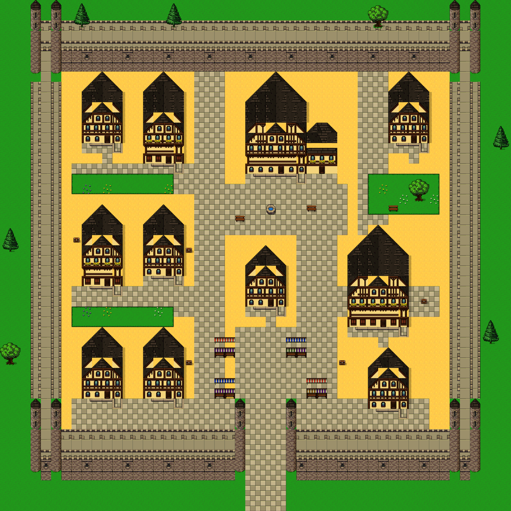

# GPT 6 Astra medium — Slates 문서 전달 실험 결과

**파일 인계와 독립 저작은 실행됐다. 성곽 마을의 미술 품질은 부분 달성이다.**

- 사람이 볼 [결과 HTML](../../../reports/slates-astra-experiment/index.html).
- 다음 에이전트의 [학습 시작 문서](../../../openwiki/slates-agent-entry.md).
- [학습 자료 ZIP](../../../reports/slates-learning-pack.zip): 147개 파일, 경로 구조 유지. SHA256은 [learning-pack.json](learning-pack.json).
- [Astra 직접 작성 보고서](AUTHOR-REPORT.md), [배치](layout.json), [합성 출처](recipes.json).

## 독립성의 범위

`multi_agent_v1__spawn_agent`에 모델 `gpt-6-astra`, effort `medium`, `fork_context:false`를 지정했고 agent `01a0c0cf-e3de-7080-8b74-7ad9109a6356`(Pascal)이 반환됐다. [실행 요청과 프롬프트](execution.json)에 기록했다. 모델 선택은 도구가 수락한 요청 값이며 별도 추론 서버 내부를 측정한 것은 아니다.

타일 저작 입력은 문서·문서 그림·원본 아틀라스와 JSON 144개를 SHA256 목록으로 고정했다. 과제·스키마 README도 제공했다. 에이전트는 33개 입력(과제/목록 포함)을 실제로 읽었다고 기록했고 모두 허용 목록에 속한다. 감독자는 에이전트 작업 기록에서 문서 열람, 번호판 이미지 열람, 자체 생성기와 PNG 교정을 확인했다. OS 접근 차단 샌드박스는 아니므로 “기술적으로 다른 파일에 접근할 수 없었다”는 주장은 하지 않는다.

이전 대화, 기존 완성 맵 JSON, 기존 생성기, 앱 소스를 저작 입력으로 전달하지 않았다. 감독자는 에이전트 저작 중 코드/콘텐츠를 편집하지 않았고, 제출 뒤에도 **타일 배치와 통행을 수정하지 않았다**. 병합·저장·검증만 수행했다. 에이전트는 32px 전체 v2 부품만 사용했고 허용된 16/8px 카탈로그는 읽지 않았다.

## 저작 결과와 검증

- 맵 `slates_astra_walled_50`, 이름 「느티관문 — 우물길 성곽마을」, 50×50, tileSize 32.
- 건물·별동 12개, 열린 쌍탑 남문, 우물 광장, 정원, 시장. 원본 1232 + 파생 96 = 전용 타일 1328개.
- lower/upper 2500칸씩. 실제 에디터 역직렬화·텍스처 로드·3200×3200 PNG 내보내기 성공, page error 없음.
- 실제 엔진 `canMove`로 1380칸, 접근 목표 20/20 연결. spawn 통행 가능. 남문 4칸을 가상 차단하면 외부→광장 불가: 성벽 우회 누출 없음. [관측 JSON](engine-observation.json).
- LegacyDb `rpg-zzu-slates32-38e6` 저장 후 root·11개 맵 미러·6개 칩셋 미러 재로드 일치. SHA `49c29e8f13b751bc2e171d62ff8093347e0034d52aeeddb8b8cd42b5638987cb`. [저장 근거](persistence.json).
- 기존 10개 맵·칩셋·시작 위치 보존. 로컬 SQLite 프로젝트 `c8c53479-8d1a-42da-96ee-e493598ef498`, revision 8에서도 콘텐츠 재로드 일치. [로컬 근거](local-persistence.json).
- 전용 `player.html`에서 저장된 프로젝트의 복사본을 새 맵 시작점으로 열고 실제 북쪽 이동을 관측했다. 에러 없음. 운영 시작 맵은 변경하지 않았다. [런타임 관측](runtime-observation.json), [PNG](../../../reports/slates-astra-experiment/runtime.png).
- gates/vitest/전체 typecheck는 실행하지 않았다. 위 수치는 콘텐츠 렌더·통행 관측이다.

## 남은 품질 문제와 문서에 필요한 보강

1. **넓은 지붕 접합**: 회관/여관의 전면 박공 사이에 큰 삼각형 벽면이 보인다. 완성 규칙으로 인증할 수 없다. 폭별 정확한 원본 부품 표와 잘못된 연결의 확대 비교판이 더 필요하다.
2. **반복·밀도**: 층수와 길이는 다르지만 같은 정면 유형과 규칙적인 필지가 반복된다. 참고의 유기적인 상점 접합·반칸 골목·비대칭 필지를 충분히 구현하지 못했다.
3. **성벽 측면·문**: 외곽 봉쇄는 성립하지만 측면 단면은 단순하다. 열린 통로를 선택해 `hold` 성문 자동 복사는 피했으나 원본 아치·격자 복원과 개폐를 해결한 것은 아니다.
4. **32px만 사용**: 문서가 16/8px 조립 필요성을 설명해도 에이전트가 이를 채택하지 않았다. 다음 전달 실험에는 부품 카탈로그를 필수 입력으로 하고 구체적인 반칸 조립 산출물을 요구할 필요가 있다.
5. NPC·실내·상거래·다층 보행은 구현 범위 밖이다. 통행 연결성 수치는 미술 품질 점수가 아니다.

이번 출력은 다음 에이전트의 “완성된 모범 마을”로 자동 승격하지 않는다. 독립 인계가 가능한 부분과 문서만으로 해결되지 않은 부분을 보여주는 사례로 보관한다.

원본 타일: Ivan Voirol, CC BY 4.0. 출처·변경: [ATTRIBUTION](../../../public/assets/ATTRIBUTION.md).
