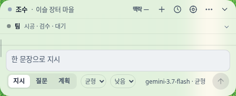
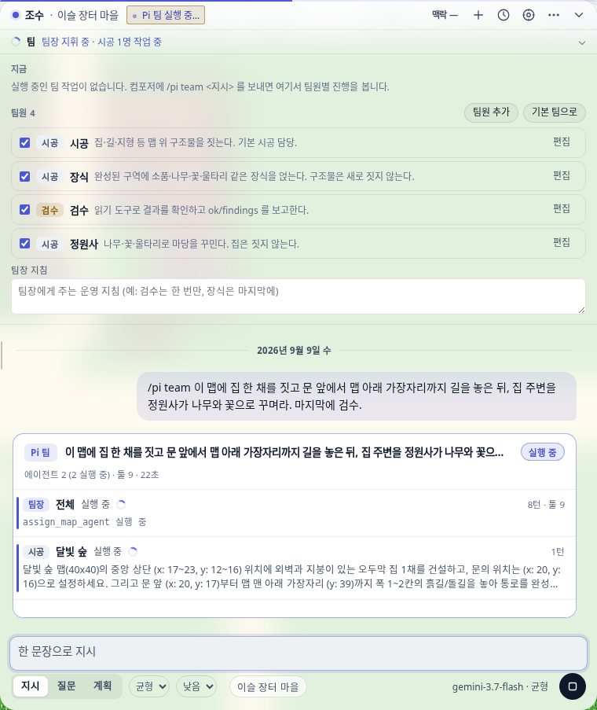
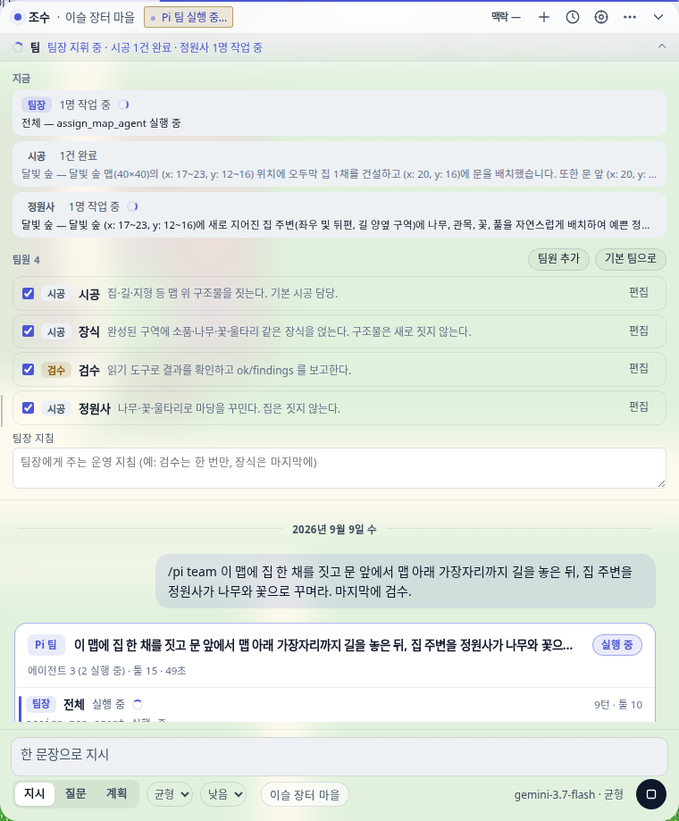
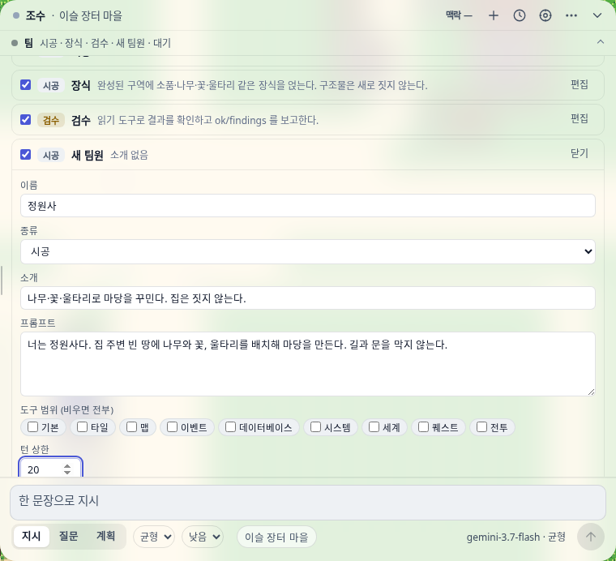

# Pi 에이전트 경로

조수 채팅의 **유일한 실행 경로**다(2026-09-11). 루프는 Bun 쪽 `@oh-my-pi/pi-agent-core` 가 돌리고,
툴·커밋 게이트·적용 함수는 편집기 것을 그대로 쓴다. 세션 루프(`src/ai/assistantSession.ts`)는
deprecated — 조수 창에서 경로로 고를 수 없고, 남은 호출자는 아래 「남은 세션 호출자」 에 적혀 있다.

```
브라우저  /pi <지시>  ──POST /v1/agent/run──▶  vite 동반 미들웨어(Node)
                                                 │ resolveRequestApiKey(provider)
                                                 ▼
                                          Bun 워커 /agent/run  ──▶ runPiAgent()
                                                 │   oh-my-pi Agent + 레지스트리 툴 206개
                                                 │   프로젝트 사본 위에서 끝까지 실행
                                                 ▼
                     NDJSON 진행 이벤트 … 마지막 `done` 에 결과 프로젝트
브라우저  mergeMapBundles() → applyProposedProject()  (커밋 게이트·undo·저장 동일)
```

## 조수 채팅은 Pi 하나다 (2026-09-11)

컴포저의 「경로」 셀렉트와 설정의 「지시 실행 경로」 를 걷어냈다. 지시·질문·계획이 전부 Pi 로 가고,
무엇을 해도 되는지는 **자율성 다이얼**(지시줄의 유일한 컨트롤)이 정한다.

| 입력 | 실행 |
| --- | --- |
| 평문 지시 | Pi — 다이얼의 실행 레벨(균형·자율·최대) |
| 다이얼 「읽기 전용」 | Pi 읽기 전용 — 쓰기 툴 미제공(`request.readOnly`), 답은 본문 그대로 로그에 남는다 |
| 다이얼 「확인」 | Pi 계획 턴 — 읽기 전용 + 계획 지시문. 프로젝트는 바뀌지 않고, 「계획만 세웠습니다」 로 끝난다 |
| `/pi …` `/pi team …` | 언제나 명시적 Pi — 다이얼의 읽기 전용·계획보다 **세다**(사용자가 직접 쓴 명령이다) |
| 선택 영역 작업 | 영역 파이프라인(`runRegionTask` — 하드 클립·블렌드 폴리시·고스트 프리뷰). 아직 Pi 가 아니다 |

**팀은 경로가 아니다** — Pi 루프의 실행 모드(`PiAgentMode`)다. 컴포저 「팀」 토글과 설정 「Pi 팀 실행」
이 같은 비트(`oprn:ai-config.piTeam`)를 읽는다. 옛 blob 의 `executionRoute: "pi-team"` 은 로드 시
그 비트로 승격한다(`loadAiConfig` 한 곳). 읽기 전용·계획 턴에서는 토글이 숨는다 — 쓰기 툴이 없으면
팀은 예산만 태운다.

**적용은 기본이 「검토 후 적용」** (`piApply: review`). Pi 결과는 보드 발의 검토 카드(변경 칩 + 적용/버리기)로 나오고, 사용자가 적용을
눌러야 `applyProposedProject` 를 탄다. 그 사이 프로젝트가 바뀌었으면 stale-base 로 거절된다. 설정에서 「바로 적용」으로 바꿀 수 있다.
적용이 끝나면 **영수증 카드(지금 → 적용 후 두 장 · 변경 칩 · 되돌리기)** 가 로그와 스튜디오 「변경」 탭에
남는다 — Pi 명령은 재료(`PiChangeReceipt`)만 넘기고 렌더는 패널이 한다(`showChangeReceipt`).

### 남은 세션 호출자 (deprecated 재고)

조수 창은 세션을 더 이상 쓰지 않지만, 엔진은 아직 네 곳에서 산다. 셋은 조수 채팅이 아니라 각자
표면의 엔진이고, Pi 이관은 별도 작업이다:

| 표면 | 왜 아직인가 |
| --- | --- |
| 선택 영역 작업·영역 생성기 | 하드 클립·블렌드 폴리시·고스트 프리뷰·부분 적용이 세션 초안 위에 서 있다 |
| 클러스터 AI 모달 | 편집기 안 전용 세션(`clusterAiModal`)이 초안·승인을 직접 든다 |
| DB AI 바 | 조수 QA 브리지(`aiAssistantBridge`)로 보낸다 — 그 계약(감사·수락 장부·런 결과)이 세션 모양이다 |
| 벤치마크·QA 스크립트 | `src/benchmark`, `src/evals`, `scripts/qa/*` 가 세션을 직접 만든다 |

## 쓰는 법

- 채팅 패널: `/pi 집 한 채와 길` — 현재 맵 범위. `/pi map_a,map_b 집 한 채` — 맵마다 에이전트 하나씩 병렬.
- **팀**: `/pi team 마을 셋을 지어라` — 팀장 에이전트가 맵을 나눠 시공·검수 에이전트를 띄운다. `/pi team map_a,map_b …` 는 후보 맵 제한.
- 헤드리스: `bun scripts/pi-agent.mts --project game.json --task "..." --maps map_a,map_b --out out.json --report report.json`
  (`--blank map_a:24x18,map_b:24x18` 로 빈 프로젝트에서 시작할 수도 있다. `--team` 이면 팀 모드. 게이트 실패는 종료 코드 2.)

## 팀 (하네스처럼 역할을 선언한다)

역할은 `src/ai/piAgent/team.ts` 에 선언돼 있다. 역할 = 프롬프트 + 툴 범위 + 턴 상한.

| 역할 | 툴 | 하는 일 |
| --- | --- | --- |
| 팀장 `orchestrator` | 읽기 3종 + `assign_map_agent` · `check_agents` · `wait_agents` · `review_map` · `finish` | 지시를 맵 단위 작업으로 쪼개 **한 턴에 여러 개** 배정(코어가 병렬 실행), 도는 동안 들여다보고, 검수 시키고, 지적이 있으면 수정 배정, 끝나면 보고 |
| 시공 `builder` | 레지스트리 전부 | 팀장이 준 맵 하나에서만 일한다. 결과는 맵 묶음으로 작업 사본에 병합, 범위 밖은 버리고 보고 |
| 검수 `reviewer` | 읽기 툴만 + `report_review` | 구조물·길·겹침·lint 를 확인하고 ok/findings 를 보고 |

런타임은 `scripts/lib/piTeamRuntime.ts`. 하위 에이전트는 `runPiAgent` 를 그대로 재사용하고, 팀장의 커스텀 툴 셋만 이 파일에 있다.

### 배정 계약 (프롬프트가 아니라 툴이 지킨다)

같은 맵의 업무 분할(시공 → 장식 → 정원사)은 **파이프라인**이다. 앞 팀원의 결과를 봐야 다음 팀원이
일할 수 있으므로 병렬 이득이 없고, 겹쳐 돌리면 나중 결과가 앞 결과를 통째로 덮는다. 병렬 이득이
있는 축은 **서로 다른 맵**이다. 정책은 `src/ai/piAgent/teamAssignments.ts` 의 순수 원장에 있다.

| 계약 | 내용 |
| --- | --- |
| 맵 in-flight 락 | 진행 중인 맵에 두 번째 배정·검수가 오면 툴이 거절한다. 다른 맵은 그대로 병렬 |
| 업무/수정 예산 분리 | 업무는 켜진 시공 팀원 수 + 2, 수정(검수 지적 뒤)은 맵당 2회. 팀원을 늘려도 수정 예산이 깎이지 않는다 |
| 시작/확인 분리 | `assign_map_agent` 는 배정만 하고 즉시 돌아온다. 팀장은 `check_agents` 로 중간을 보고 `wait_agents` 로 결과를 받는다 |
| 거두기 안전망 | 팀장이 턴 상한 등으로 `wait` 없이 끝나도 런타임이 남은 배정을 기다렸다 병합한다 |
| 범위 밖 감사 기준 | spill 판정은 병합 시점의 작업 사본이 아니라 **그 에이전트가 출발한 사본** 기준이다(`MapBundleResult.base`). 그 사이 남이 병합한 맵을 오탐하지 않기 위함 |
| 범위 안 정의 | 묶음이 **새로 만든** 스위치·변수·공통이벤트·엔딩·타일셋·자산·DB 레코드는 묶음과 함께 온다(맵이 가리키는 정의가 없으면 게이트가 적용을 통째로 거부한다). 기존 항목의 수정·삭제만 범위 밖이고 spill 로 보고된다 |

### 팀원은 사용자가 정한다

팀원 명세(`src/ai/piAgent/teamSpec.ts`)는 코딩 하네스의 에이전트 정의처럼 **이름 + 종류(시공/검수) + 소개 + 프롬프트 + 툴 도메인 + 턴 상한 (+ 모델)** 이다.
`localStorage(oprn:pi-team)` 에 저장되고(`teamSpecStore.ts`), `/pi team` 요청에 실려 Bun 워커로 간다. 팀장은 `assign_map_agent(member)` /
`review_map(member)` 로 팀원을 고른다. 툴 인자의 `enum` 이 켜진 팀원 id 로 제한되어 없는 팀원을 부를 수 없다. 기본 팀은 시공·장식(꺼짐)·검수.
헤드리스는 `--team-spec team.json`.

실측(2026-09-09): 사용자가 패널에서 「정원사」를 추가하고 장식을 켠 뒤 `/pi team 집 한 채와 길, 주변을 정원사가 꾸며라` 를 보내자
팀장이 시공 → 정원사 → 검수 순으로 배정했고, 정원사 행에 그 팀원의 보고가 실렸다. 새로 고침 뒤에도 명단이 남는다.

## 팀 패널 (접힌 막대)

데크 레일 바로 아래에 **접힌 막대**로 산다(`src/editor/panels/aiTeamPanel.ts`, 스타일 `21-team-panel.css`). 유휴 상태에서도 보이므로
사용자는 팀이 있고 무엇을 하는지 한 줄로 안다.

| 상태 | 막대 문구 |
| --- | --- |
| 유휴 | `팀  시공 · 검수 · 대기` |
| 실행 중 | `팀 ◌ 팀장 지휘 중 · 시공 1건 완료 · 정원사 1명 작업 중` (스피너, 액센트색) |
| 끝난 뒤 | `… · 대기 · 마지막 작업 적용됨` |

펼치면(패널 폭이 열린 폭으로 넘어간다) 세 구획: **지금**(팀장·팀원별 진행 — 작업 중 인원, 최근 3건의 맵·한 줄), **팀원**(명단 편집: 켜기/끄기,
편집 폼 — 이름·종류·소개·프롬프트·도구 범위 칩·턴 상한·모델, 추가, 삭제, 기본 팀으로), **팀장 지침**(자유 텍스트, 팀장 프롬프트에 붙는다).






## 팀 보드 (UI)

`/pi` 실행은 로그 안에 **팀 보드** 카드로 그려진다(`src/editor/panels/aiTeamBoard.ts`, 상태는 순수 리듀서
`src/ai/piAgent/teamBoardState.ts`). 에이전트마다 행 하나: 역할 배지(팀장·시공·검수), 맵, 상태(대기·실행 중·완료·실패·중단),
턴·툴콜·소요 시간, 마지막 한 줄(툴 결과는 고정폭, 말은 본문체). 검수 행은 통과/지적 목록, 시공 행은 팀장이 쓴 작업 지시(두 줄 접힘,
눌러 펼침)와 범위 밖 변경·충돌 경고. 머리에는 단계 알약과 합계, 발에는 팀장 보고와 적용 결과. 실행 중엔 경과 시간이 1초마다 간다.
단일 `/pi` 도 같은 보드를 쓴다(행 하나). 패널의 중단 버튼이 그대로 붙는다.

## 파일

| 위치 | 역할 | 런타임 |
| --- | --- | --- |
| `src/ai/piAgent/protocol.ts` | 요청·이벤트 규약, NDJSON 디코더, 변경 키 계산 | 어디서나 |
| `src/ai/piAgent/toolAdapter.ts` | 레지스트리 툴 → Pi 툴 모양. `ok:false` 를 예외로 옮김 | 어디서나 |
| `src/ai/piAgent/mapBundle.ts` | 맵 묶음(맵 + mapTree 부분 트리) 분할·병합·묶음이 만든 정의 동봉·spill 감사 | 어디서나 |
| `src/ai/piAgent/systemPrompt.ts` | 범위·절차만 담은 기본 시스템 프롬프트 | 어디서나 |
| `src/ai/piAgent/client.ts` | 브라우저 → 동반 서비스 스트림 클라이언트 | 브라우저 |
| `src/editor/panels/aiPiAgentCommand.ts` | `/pi` 파서와 실행·적용 | 브라우저 |
| `scripts/lib/piAgentRuntime.ts` | **oh-my-pi 코어를 아는 유일한 파일.** 코어를 바꾸려면 여기만 | Bun |
| `scripts/oh-my-pi-worker.ts` `/agent/run` | 워커 스트리밍 경로 | Bun |
| `scripts/lib/ohMyPiHttp.mjs` `/v1/agent/run` | 동반 라우터, `writeCompanionResult` 의 NDJSON 통과 | Node |
| `scripts/pi-agent.mts` | 헤드리스 CLI | Bun |

## 왜 맵 묶음인가

집 시공이 `linked-interior` 를 고르면 실내 맵을 새로 만들고 부모 맵의 mapTree 자식으로 단다.
`maps.<id>` 한 키만 옮기면 실내 맵과 트리 항목이 떨어진다(2026-09-09 실측). 그래서 묶음은
mapTree 부분 트리로 정의하고, 묶음 밖 변경은 버린 뒤 `spills` 로 보고한다. 최종 무결성은
`commitChangeset` 게이트가 판정한다.

### 묶음이 만든 정의는 함께 온다 (2026-09-14)

맵 이벤트는 다른 컬렉션을 가리킨다 — `place_battle_blocker` 가 만드는 「클리어 스위치」가 대표적이다.
정의를 버리면 병합본은 **자기 이벤트가 가리키는 스위치가 없는 프로젝트**가 되고, 커밋 게이트가
serialize 왕복에서 그걸 잡아 `/pi` 는 `적용 실패(commit-rejected): 직렬화 왕복 실패: setSwitch:
switchId가 존재하지 않습니다: sw_ev_battle_<uuid>_clear` 로 **에이전트가 한 일 전부를 거부**했다.
그래서 병합은 묶음이 **새로 만든** 항목만 함께 옮긴다(`carryCreatedEntries`): 스위치·변수·공통
이벤트·엔딩·타일셋·업로드 자산·`database` 레코드, 그리고 새 스위치/변수의 세션 시작값.
기존 항목의 **수정·삭제는 여전히 버리고** `spills` 로 보고한다 — 묶음 = 맵 이라는 범위 계약은
그대로다. 함께 옮긴 키는 «버린 것» 이 아니므로 spill 목록에서 덜어낸다.
팀 모드의 병합은 워커 안에서 돌므로 이 계약은 `test/piAgentTeamRuntime.test.ts` 가 잡는다 —
시공 팀원이 `place_battle_blocker` 로 만든 스위치가 병합을 지나 커밋 게이트를 통과하는지
(실패 메시지에 게이트 원문을 실어 회귀 원인이 한 줄로 보이게 했다).

### 개발 중 워커 코드 갱신 (2026-09-14)

워커(`scripts/oh-my-pi-worker.ts`)는 모듈 그래프를 **부팅 때 한 번** 로드하는 오래 사는 Bun
자식 프로세스다. 그래서 코드를 고쳐도 살아 있는 워커는 옛 병합·옛 툴을 계속 돌고, 픽스를 받은
편집기가 같은 오류를 그대로 재현한다 — 실측: 위 픽스 이후에도 페이지를 새로 고친 편집기에서
`적용 실패(commit-rejected): 직렬화 왕복 실패: setSwitch: switchId가 존재하지 않습니다` 가
그대로 나왔다(브라우저가 아니라 워커가 낡아 있었다). 이제 dev 서버가 `src/**`·`scripts/**` 의
`.ts/.tsx/.mts/.mjs/.js` 변경을 보면 다음 요청 때 워커를 갈아 끼우도록 표시한다
(`markOhMyPiWorkerStale` ← `vite.config.ts` 의 워처). 진행 중인 실행은 죽이지 않는다 — 갈아
끼우는 자리는 다음 요청이고, 그래서 파일 저장 한 번으로 도는 Pi 실행이 끊기지 않는다.
계약: `test/ohMyPiWorkerStale.node.test.mjs`.

## 아직 없는 것

- 팀 내 **같은 맵의 다른 구역**을 두 시공 에이전트가 *동시에* 맡는 공간 분할. 구역 잠금이나 id 네임스페이스가 먼저 필요한데,
  수요가 불분명하다 — 사람이 실제로 원하는 건 "서쪽은 A, 동쪽은 B"보다 "짓기는 A, 꾸미기는 B"인 업무 분할이고, 그건 같은 맵을
  순서대로 도는 파이프라인으로 이미 된다(위 「배정 계약」).
- 데이터베이스(NPC·아이템) 작업의 팀 분할. 맵 묶음 병합은 **만든 레코드만** 데려온다 — 시공 에이전트가
  기존 `tilesets`·`database` 레코드를 고치거나 지우면 병합이 버리고 `spills` 로 보고한다(새로 만든 것은
  위 「묶음이 만든 정의는 함께 온다」대로 함께 온다). 기존 레코드를 여러 맵이 공유하는 편집의 팀 분할은 아직 없다.
- 팀원 명세의 프로젝트 단위 저장·공유(지금은 브라우저 localStorage).
- 팀원이 쓸 수 있는 커스텀 툴(레지스트리 밖) 선언.

- 세션 전용 하네스 도구(수용 장부, `verify_npc_reward`, 외형 생성 핸드오프, 원문 컨텍스트, `show_map_region` 이미지 렌더)와
  작업 계획·의도 선언·독립 리뷰·체크포인트. 전부 `assistantSession.ts` 안에 있다.
- 병렬 에이전트가 같은 맵을 바꿨을 때의 **병합** 전략. 팀 모드에서는 in-flight 락이 애초에 겹치지 않게 막고, 그래도 남의
  작업 중인 맵 묶음에 손이 닿으면 `conflicts` 로 알린다. `/pi map_a,map_b`(팀 아닌 다중) 경로는 결과를 한 번에 합치므로
  `mergeMapBundles` 의 뒤가-이긴다 규칙이 그대로 남는다.

## 중단

패널의 기존 중단 버튼(`ai-abort`)이 `/pi` 실행에도 붙는다. 브라우저 fetch 취소 → vite 미들웨어가 `res.close` 로
신호를 만들어 어댑터 fetch 취소 → Bun 워커 `request.signal` → `agent.abort()`. 워커 stderr 에
`[pi-agent] aborted by client after N turns / M tool calls` 가 남는다. 중단 시 아무것도 적용하지 않는다.

## 실측 — 배정 계약 (2026-09-11, Antigravity 기본 모델, 헤드리스 CLI)

새 툴 흐름(`assign` → `wait_agents` → `review_map` → `finish`)이 실제 모델에서 도는지 잰 것. 세 실행 모두
`spills` 0 · `conflicts` 0 · 게이트 통과(경고만).

| 실행 | 결과 |
| --- | --- |
| `--team`, 빈 24×18 맵 2장 | **38초**, 27턴/31툴콜. 팀장이 `assign_map_agent` ×2(즉시 반환) → `wait_agents` → 검수 ×2 병렬 → 통과 → `finish`. 실내 맵 2개·mapTree 보존 |
| `--team-spec`(시공·장식·정원사·검수), 빈 30×24 맵 **1장** | **173초**, 67턴/104툴콜. 한 맵에 시공 → 장식 → 정원사 **업무 3건**을 순차 배정 → 검수 지적 1건(벤치 클러스터 규칙) → **수정 배정 1건** → 재검수 통과 → `finish`. 구 런타임이라면 업무 3건에서 예산이 바닥나 이 수정 배정이 거절됐다 |
| 팀장 지침으로 **같은 맵 동시 배정을 지시**(적대) | **93초**, 36턴/64툴콜. 팀장이 지침을 따르지 않고 시공 → 장식 순차로 갔다. 락은 발동하지 않았다 |

락이 실제로 거절하는 경로는 라이브에서 재현하지 못했다 — 툴 설명이 「같은 맵에는 한 번에 한 명」을
명시하므로 모델이 애초에 시도하지 않는다. 그 경로는 `test/piAgentTeamRuntime.test.ts` 가 진짜 런타임에
가짜 실행기를 물려 덮는다(락·`finish` 거절·검수 거절·거두기 안전망).

## 실측 (2026-09-09, Antigravity gemini-3.7-flash, 도구 206개)

| 경로 | 결과 |
| --- | --- |
| CLI, 빈 24×18 맵 2장 병렬 | 19초, 툴콜 5+4, 실패 0. 실내 맵 2개·mapTree 보존, 게이트 통과(경고만) |
| 브라우저 `/pi`, 100×100 마을 맵 | 18.5초, 툴콜 4, 집+길 시공 후 store 에 적용 |
| 브라우저 `/pi` 중 중단 버튼 | 첫 툴 결과 뒤 클릭 → 두 안내 말풍선이 18ms 간격으로 붙고 적용 없음. 워커도 2턴/1툴콜에서 멈춤 |
| CLI `--team`, 빈 맵 2장 | 58초. 팀장이 시공 2개 병렬 → 검수 2개 병렬 → 통과 → finish. 시공 하나가 남의 맵을 건드렸고 병합이 버리고 보고 |
| 브라우저 `/pi team`, 100×100 마을 맵 | 93초, 팀장·시공·검수 3행, 툴콜 36, 적용됨 |
| 브라우저 `/pi team`, 40×40 숲 맵 | 213초, 검수 지적 1건 → 수정 시공(범위 밖 tilesets 변경 버림) → 재검수 통과. 5행, 툴콜 85 |
| 브라우저 팀 패널: 정원사 추가 → 새로 고침 → `/pi team` | 명단 유지. 122초, 팀장이 시공 → 정원사 → 검수 순 배정, 막대가 단계별로 문구를 바꿈, 적용됨 |
| 브라우저 기본 경로: `/pi` 없이 평문 지시 | 25초 → 검토 대기, 칩 `타일 60 · 이벤트 +9 · 맵 +1 · 맵 속성 2` → 적용 클릭 → 적용됨 |
| 브라우저 질문 모드 평문 | 기존 조수가 답함(보드 안 늘어남) |
| 브라우저 경로 셀렉트 → Pi 팀 → 평문 | 53초, 팀장·시공·검수 → 검토 대기 → 버리기 → 버림, 프로젝트 그대로 |
