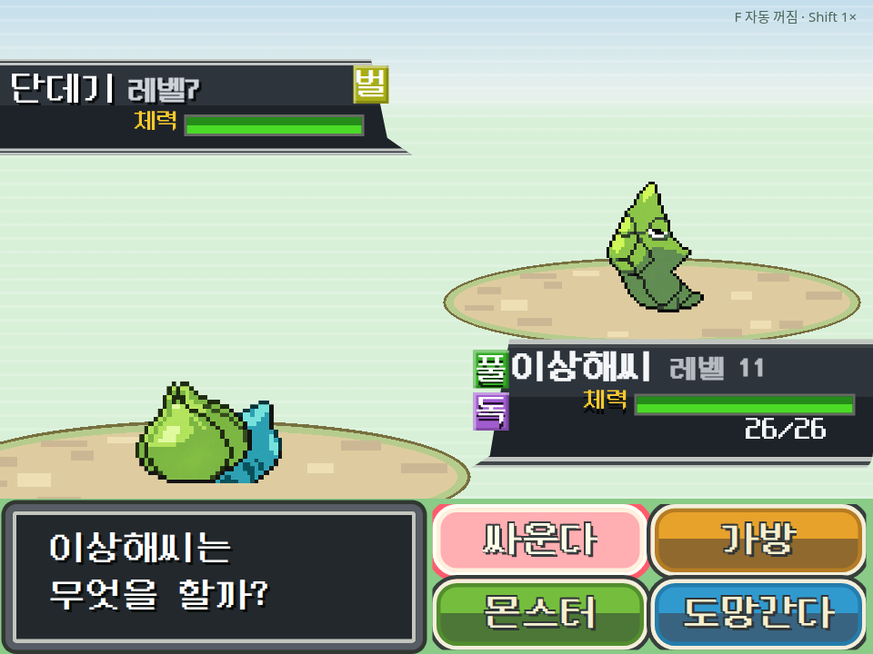

# 포켓몬 참고 스킨 구현과 브라우저 관측

참고의 민트 줄무늬 필드, 모래 타원 발판, 사선 상태창, 검은 메시지 창과 네 색상 버튼을 한글 UI로 구현했다. 단데기 정면과 이상해씨 뒷모습은 참고 기반으로 생성한 별도 투명 PNG다. 종족에는 선택적 `graphic.backResourceId`를 추가했으며, 기존 저작 그래픽을 무조건 바꾸지는 않는다.



## 관측

- 출하 `player.html` + export store shim으로 실행한 브라우저에서 page error 0.
- 키보드로 싸운다/가방/교체 메뉴에 진입. 공격 이후 실제 적 HP 표시가 변했다.
- 375px, 768px 뷰포트에서 네 루트 명령의 한글 라벨 잘림 없음.
- 실제 후면 이미지 렌더링과 타입 배지, 한글 레벨/체력/횟수 표시 확인.
- `git diff --check` 성공. AGENTS.md의 세션 규칙에 따라 vitest/gates/typecheck는 실행하지 않았다. save/load/export 및 후면 fallback 테스트 코드는 추가했으나 실행 결과를 주장하지 않는다. 에디터 선택기의 별도 브라우저 검증도 미실시.

## 재현

```sh
bun scripts/qa/runtime/pokemon-reference-fixture.mts
node scripts/qa/runtime/pokemon-reference.probe.mjs
```

임시 계약 fixture는 `verify-shots/runtime-qa/pokemon-reference/fixture.json`에 생성한다. 기존 데모 코드를 재료로 쓰지만 앱에 싣거나 원격 저장하는 데모는 아니다. 프로젝트 콘텐츠/DB는 수정하지 않았다. 최종 보고는 동일 디렉터리의 `SUMMARY.md`와 `result.json`이다.

## 유사도 한계

95%를 입증하는 정량 측정은 하지 않았다. 한글 글자 폭, 원본과 다른 타입 배지 문자, 스프라이트/발판의 픽셀 패턴, 실제 프로젝트의 HP 수치는 다르다. 스프라이트는 원본 픽셀의 무손실 추출이 아니다. 따라서 현재 결과를 '95% 이상 검증 완료'로 보고하지 않는다. 생성 도구와 프롬프트는 `2026-09-20-pokemon-reference-assets.md`에 기록했다.
