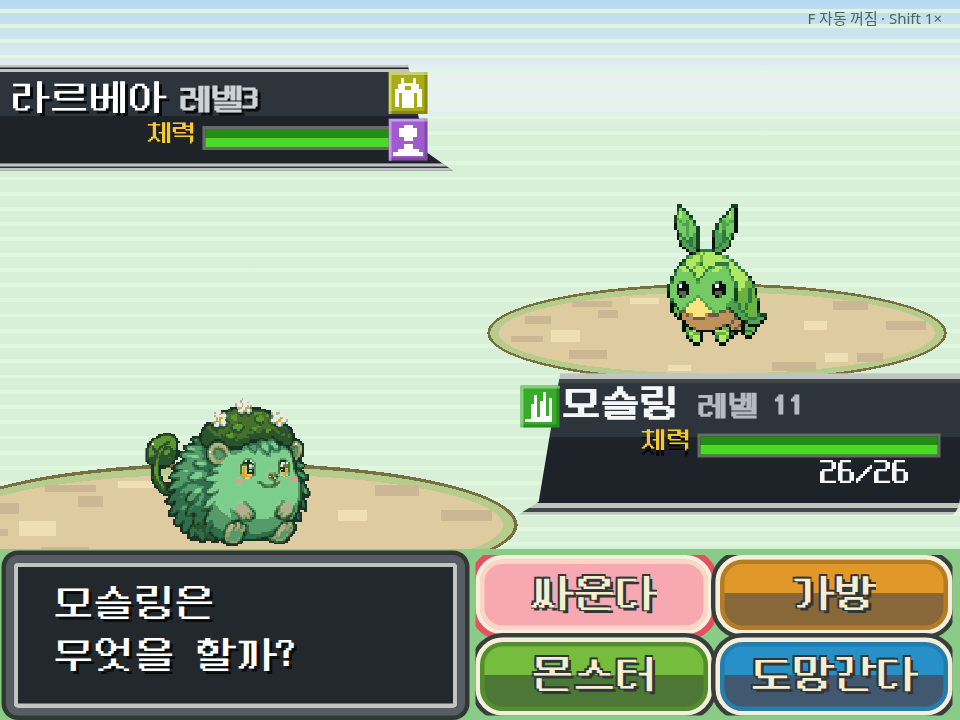

# 에디터 몬스터 전투로 전환 (2026-09-20 후속)

사용자 요청에 따라 포켓몬 모사 몬스터 대신 에디터에 등록된 모슬링/라르베아로 전투 표시를 변경했다. 한글 UI와 구도는 유지한다. 종족/적 데이터의 이름, 타입, 그래픽, 기술을 그대로 쓰며 별도 뒷모습이 있으면 이를 우선한다. 없으면 원래 정면 이미지의 방향을 유지하고 잘리지 않게 표시한다. 기존 모사 스프라이트는 선택 가능한 리소스로만 남으며 기본 전투 별칭에서는 사용하지 않는다.



브라우저 관측: player.html에서 메뉴와 공격 HP 변경 확인, 오류 0, 375/768px 버튼 라벨 잘림 없음. 아래 과거 원본 유사도 기록은 이전 모사 스프라이트 기준이다. 현재 목표에서 몬스터 원본 픽셀 추출 질문은 더 이상 필요하지 않다. 변경은 엔진/UI 기본 표시와 일시적 QA fixture이며, 사용자 게임 프로젝트를 새로 저작하거나 DB를 수정하지 않았다. vitest/gates/typecheck는 세션 규칙에 따라 실행하지 않았다.

---

# 포켓몬 참고 스킨 구현과 브라우저 관측

참고의 민트 줄무늬 필드, 모래 타원 발판, 사선 상태창, 검은 메시지 창과 네 색상 버튼을 한글 UI로 구현했다. 단데기 정면과 이상해씨 뒷모습은 참고 기반으로 생성한 별도 투명 PNG다. 종족에는 선택적 `graphic.backResourceId`를 추가했으며, 기존 저작 그래픽을 무조건 바꾸지는 않는다.


풀·독·벌레 배지는 원본에 가까운 코드 기반 픽셀 실루엣으로 추가 조정했으며, 한글 접근성 이름은 유지한다. 배경 상단 색상도 참고의 푸른색으로 보정했다. 추가 조정 후 같은 브라우저 프로브를 다시 실행해 오류 0, 공격 HP 변경, 두 뷰포트 라벨 잘림 없음이 유지됨을 확인했다.

## 관측

- 출하 `player.html` + export store shim으로 실행한 브라우저에서 page error 0.
- 키보드로 싸운다/가방/교체 메뉴에 진입. 공격 이후 실제 적 HP 표시가 변했다.
- 375px, 768px 뷰포트에서 네 루트 명령의 한글 라벨 잘림 없음.
- 실제 후면 이미지 렌더링과 타입 배지, 한글 레벨/체력/횟수 표시 확인.
- `git diff --check` 성공. AGENTS.md의 세션 규칙에 따라 vitest/gates/typecheck는 실행하지 않았다. save/load/export 및 후면 fallback 테스트 코드는 추가했으나 실행 결과를 주장하지 않는다. 에디터 선택기의 별도 브라우저 검증도 미실시.

## 재현

```sh
bun scripts/qa/runtime/pokemon-reference-fixture.mts
node scripts/qa/runtime/pokemon-reference.probe.mjs
```

임시 계약 fixture는 `verify-shots/runtime-qa/pokemon-reference/fixture.json`에 생성한다. 기존 데모 코드를 재료로 쓰지만 앱에 싣거나 원격 저장하는 데모는 아니다. 프로젝트 콘텐츠/DB는 수정하지 않았다. 최종 보고는 동일 디렉터리의 `SUMMARY.md`와 `result.json`이다.

## 유사도 한계

95%를 입증하는 정량 측정은 하지 않았다. 한글 글자 폭, 타입 배지의 세부 픽셀, 스프라이트/발판의 픽셀 패턴, 실제 프로젝트의 HP 수치는 다르다. 스프라이트는 원본 픽셀의 무손실 추출이 아니다. 따라서 현재 결과를 '95% 이상 검증 완료'로 보고하지 않는다. 생성 도구와 프롬프트는 `2026-09-20-pokemon-reference-assets.md`에 기록했다.

## 원본 비교 진단

`python scripts/qa/runtime/pokemon-reference-compare.py REFERENCE CAPTURE`는 이미지를 읽기만 하며 비교용 배열을 참고 해상도로 맞춰 RGB SSIM을 출력한다(numpy/OpenCV 필요). 원본 파일이나 자산을 편집하지 않는다. 같은 입력/영역으로 반복해 색상·배치 변경 방향을 확인하기 위한 진단이며, 한글 문구와 종횡비 차이를 포함하므로 사람의 지각 유사도 백분율이나 승인 게이트로 해석하지 않는다. 전체 화면, 빈 배경, 양측 스프라이트, 명령창을 각각 보고한다. 결과는 `evidence/pokemon-reference/comparison.json`.

원본 픽셀에서 분홍/주황/파랑 버튼 색상을 읽어 보정하고 줄무늬 시작 위치와 간격을 맞췄다. 원본 픽셀을 코드로 직접 추출해 자산으로 사용하는 선택은 사용자 답변 대기 중이며, 현재 자산은 계속 생성 도구 출력이다.
