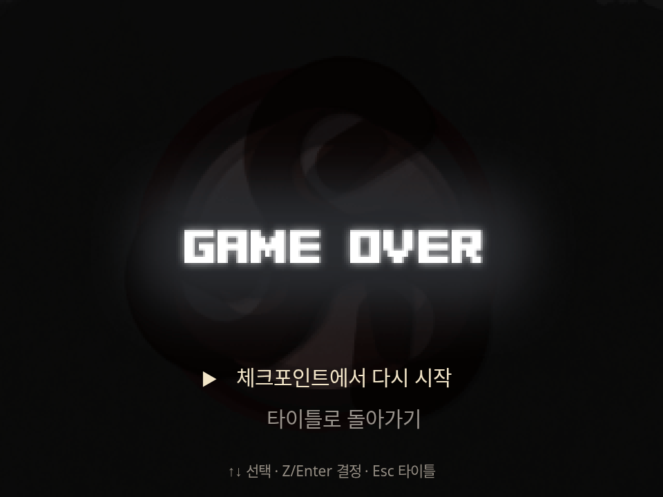
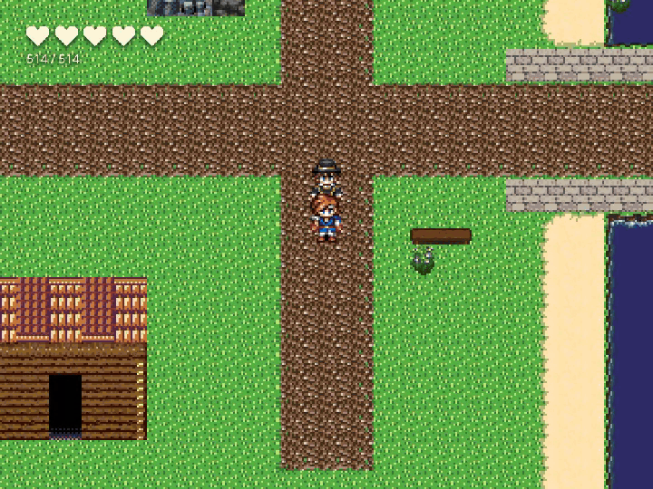

# Game-over scene

The terminal now uses opaque full-stage art with small text choices below the artwork. It stops field audio, keeps the map/HUD covered after cinematic playback, restores checkpoint audio on retry, and terminates commands after game over instead of resuming them.

## Browser verification

Recorded the real `player.html` path at 960×720 using the dedicated runtime QA server and the existing `editor-authored-demo-v3.json` map. Only fixture events/settings changed in memory; no canonical project content was written. The GIF is a 9.8-second excerpt of the browser recording, encoded at 15fps / 720×540. It contains no mockup frames.

- Default art loads; field audio stops. Menu selection, checkpoint restoration to (14,18), restored field audio, repeated game over and title return work.
- Authored background/title/message/button labels are retained.
- Long body copy scrolls with PageUp/PageDown while actions remain within the viewport.
- Completing an image sequence leaves the opaque terminal scene visible.
- Without a checkpoint, only the title option appears.
- Foreground and parallel terminal commands do not execute subsequent variable changes or dialogue.
- A failed background request falls back to a text heading and working choices.
- Seven browser conditions completed with zero page errors. `git diff --check` passed.

Regression tests were added/updated for nested interpreter termination, default-art export inclusion, and broken-image fallback. Vitest, gates and full typecheck were not run, per the repository's session execution rule. The export asset collector was updated; a built export ZIP was not separately exercised. Async parallel resume guards were code-reviewed, without a separate fault-injection run.

Capture source: `scripts/qa/runtime/game-over-scene.probe.mjs`. It writes screenshots, raw recording and `results.json` to `output/evidence/game-over-implemented-20260922/`. `PROOF_VARIANTS` selects comma-separated conditions. Running the capture requires explicit verification authorization under this repository's rules.
