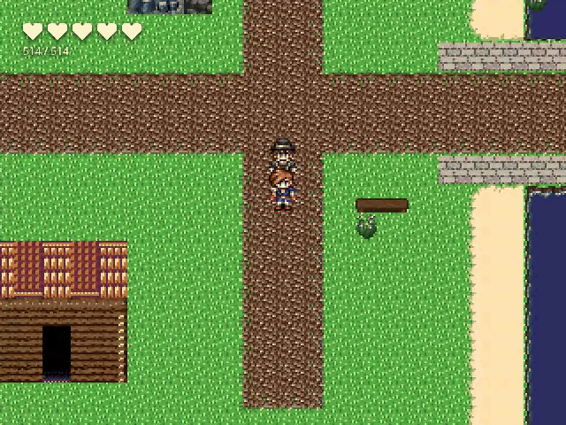
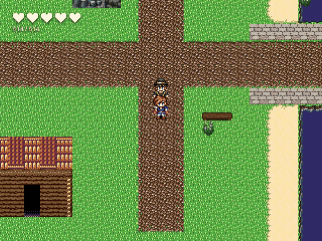
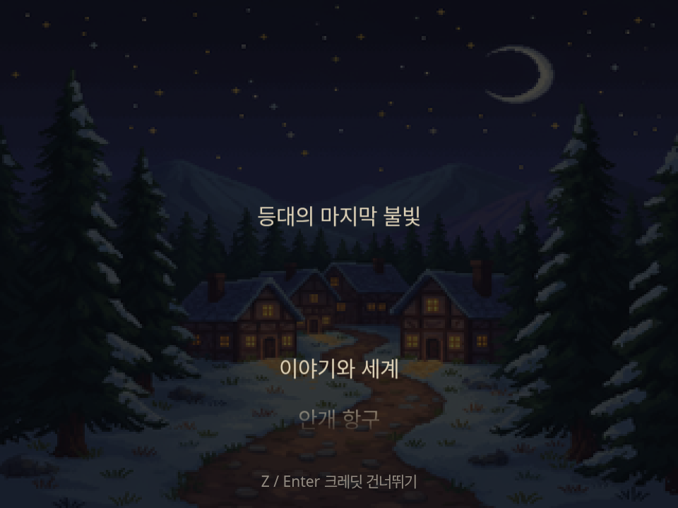
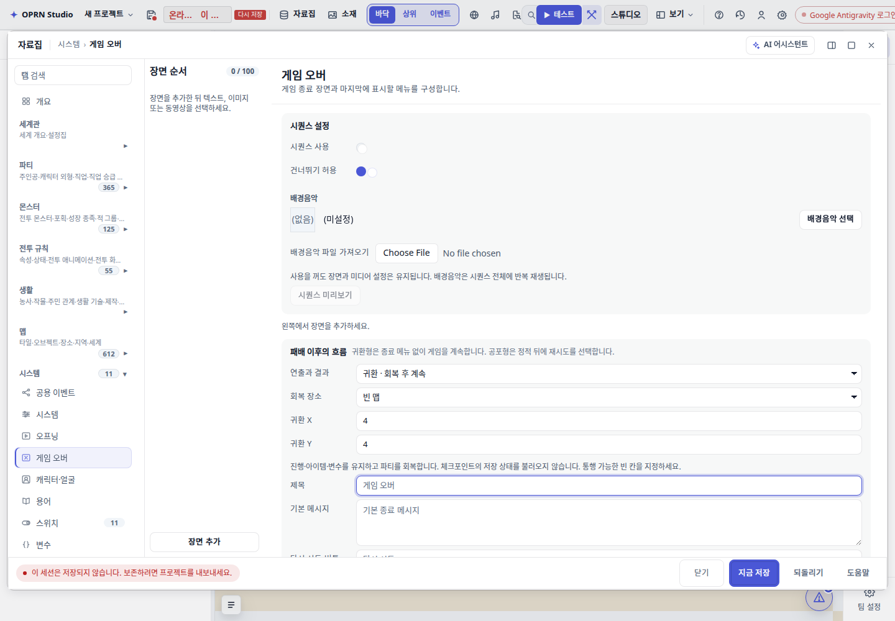

# 장르별 패배와 엔딩 — 실제 플레이 기록

기존 게임 오버는 한 장의 그림과 즉시 뜨는 선택지에 머물렀고, 엔딩은 여전히 맵 위 일반 패널이었다.
이번 변경은 화면의 외형뿐 아니라 결과에 따라 플레이가 끝나거나 이어지는 흐름을 구분한다.

| 흐름 | 실제 동작 | 상태 처리 |
|---|---|---|
| 공포형 | 암전 → 정적 → 결과 문구 → 재시도 선택 | 체크포인트를 선택하면 저장 당시 상태로 복원 |
| 귀환형 | 암전 → 패배 문장 → 회복 장소에서 밝아짐 → 이동 재개 | 현재 진행 유지, 파티 회복. 저장 상태를 되감지 않음 |
| 엔딩 | 에필로그 → 크레딧 → THE END → 타이틀 | 엔딩별 분위기·배경·음악·크레딧. 후속 이벤트 실행 종료 |

장르를 자동 추측하지 않는다. DB → 게임 오버에서 흐름과 귀환 좌표를 고른다.
`define_ending.presentation`은 엔딩마다 다른 연출을 지정하고, 직접 `ending` 명령 폼에서도 분위기와 크레딧을 편집한다.
기존 프로젝트는 클래식 흐름을 유지하며 기존 배경·문구·시퀀스는 보존된다.

## 실제 인게임 GIF

GIF는 `player.html`의 Playwright 녹화를 자른 것이다. 합성 화면이나 목업이 아니며 재생 속도를 바꾸지 않았다.
GIF 자체에는 소리가 없으며 엔딩 음악 재생은 브라우저의 재생 상태와 재생 시간으로 별도 확인했다.
샘플 맵·이미지·문구는 흐름 확인을 위한 메모리 fixture다. 특정 공포게임/포켓몬의 그래픽을 복제한 것이 아니다.

### 공포형 — 정적 후 선택

### 귀환형 — 현재 진행 유지

패배 직전 변수는 37, 체크포인트 당시 값은 0이다. 귀환 후에도 37이 유지되고 HP가 모두 회복되며 (14,20)에서 (14,21)로 실제 이동했다.
공포형 재시도에서는 동일 변수가 체크포인트 값 0으로 복원되었다.

### 엔딩 — 여운, 크레딧, 타이틀

## 확인 범위

- 전용 플레이어: 공포, 귀환, 밝은 엔딩, 어두운 엔딩, 모션 감소, 크레딧 자동 완주, 막힌 귀환 위치의 복구 메뉴. 모두 페이지 오류 0건.
- 기존 클래식: 기본/체크포인트 없음/선행 시퀀스/병렬 이벤트/이미지 실패를 다시 확인했다.
- 종료 후 변수 777을 쓰는 명령이 실행되지 않았고, 엔딩·게임 오버 진입 직후 확정키가 다음 단계로 넘어가지 않았다.
- 편집기: 흐름 선택과 귀환 좌표 편집 → serialize/deserialize 값 유지, 페이지 오류 0건.
- 변경 TypeScript의 문법 검사와 `git diff --check`를 확인했다. 저장소 세션 규칙에 따라 Vitest·전체 typecheck·gates는 실행하지 않았다. 회귀 테스트 코드는 추가/갱신했지만 미실행이다.

재현 스크립트: `scripts/qa/runtime/terminal-flows.probe.mjs`, `scripts/qa/runtime/game-over-scene.probe.mjs`.
기계 판독 요약: [evidence.json](evidence.json).

순수 엔진/편집기 코드와 QA fixture 변경이다. 실제 프로젝트 SQLite에는 콘텐츠를 쓰지 않았다.
내보낸 ZIP 실행, 실제 몬스터 전투에서 패배하는 전체 경로, 동적 '마지막 병원' 기록과 금전 패널티는 이번 확인 범위에 포함하지 않는다.
귀환 장소는 명시 좌표 또는 체크포인트/시작 위치이며, 임의로 병원이나 패널티를 생성하지 않는다.
